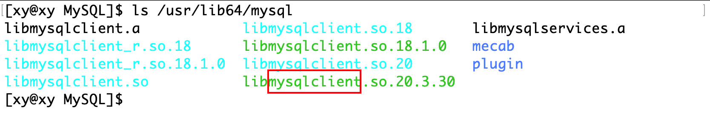
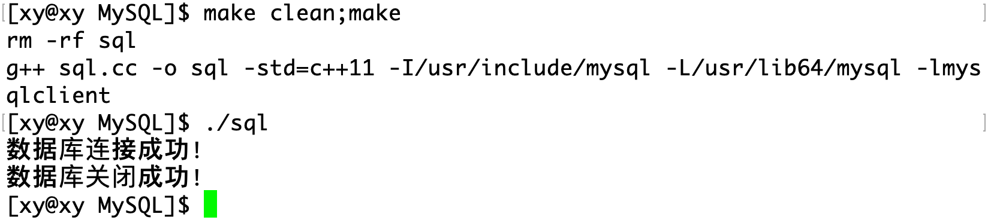
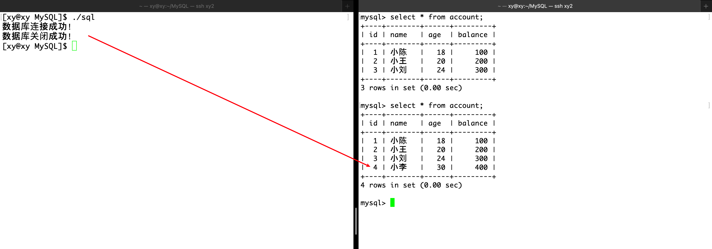
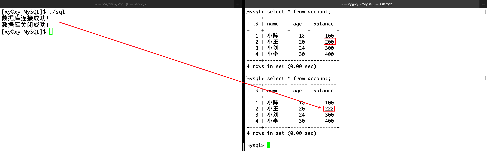
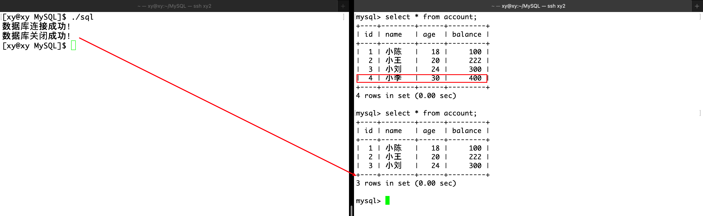

## 安装 MySQL 库

在 CentOS7 下，使用命令安装 MySQL：

```
yum install mysql-devel
```

在`/usr/include`可以看到一个`mysql`新目录，里面存放的是 mysql 的头文件。另外在 `/lib64/mysql/` 以及 `/usr/lib64/mysql` 目录下存放了 mysql 的动态和静态库。

用一个 MySQL 库提供的接口验证 MySQL 库是否安装成功：

```cpp
##include <iostream>
##include <mysql/mysql.h>

using namespace std;

int main()
{
	cout << "mysql version: " << mysql_get_client_info() << endl;
	return 0;
}
```

编译：

```
g++ sql.cc -o sql -I/usr/include/mysql -L/usr/lib64/mysql -lmysqlclient
```


编译选项中关于库的使用：

- `-I`：用于指明头文件的搜索路径。
- `-L`：用于指明库文件的搜索路径。
- `-l`：用于指明需要连接库文件路径下的哪一个库。



因为这个库没有在链接的默认目录`/usr/lib64`下，所以作为第三方导入的库，在编译时需要显式地指定`-L/usr/lib64/mysql`；同理，头文件不在默认目录`/usr/include`下，所以要显式地指定`-I/usr/include/mysql`。在这个目录下，存在名为`mysqlclient`的第三方库，同样需要用`-l`显式地声明。

只要正常运行上面的程序，那就表明库的链接没有问题，剩下的就是简单的 API 使用。

## 连接 MySQL

### MYSQL 类

在使用 MySQL 提供的接口之前，需要了解一下这个重要的类。

`MYSQL`类是一个非常核心的结构体，它用于表示与 MySQL 服务器的一个连接实例。在客户端程序中，这个结构体用来保存客户端与数据库服务器之间连接的所有必要信息，包括但不限于：

- 服务器的地址
- 用户名和密码
- 正在使用的数据库
- 网络连接的状态和配置
- 错误信息和错误码
- 查询结果
- 选项设置

在`mysql.h`中可以查看 MYSQL 结构体的定义（了解即可）：

```cpp
typedef struct st_mysql
{
  NET		net;			/* Communication parameters */
  unsigned char	*connector_fd;		/* ConnectorFd for SSL */
  char		*host,*user,*passwd,*unix_socket,*server_version,*host_info;
  char          *info, *db;
  struct charset_info_st *charset;
  MYSQL_FIELD	*fields;
  MEM_ROOT	field_alloc;
  my_ulonglong affected_rows;
  my_ulonglong insert_id;		/* id if insert on table with NEXTNR */
  my_ulonglong extra_info;		/* Not used */
  unsigned long thread_id;		/* Id for connection in server */
  unsigned long packet_length;
  unsigned int	port;
  unsigned long client_flag,server_capabilities;
  unsigned int	protocol_version;
  unsigned int	field_count;
  unsigned int 	server_status;
  unsigned int  server_language;
  unsigned int	warning_count;
  struct st_mysql_options options;
  enum mysql_status status;
  my_bool	free_me;		/* If free in mysql_close */
  my_bool	reconnect;		/* set to 1 if automatic reconnect */

  /* session-wide random string */
  char	        scramble[SCRAMBLE_LENGTH+1];
  my_bool unused1;
  void *unused2, *unused3, *unused4, *unused5;

  LIST  *stmts;                     /* list of all statements */
  const struct st_mysql_methods *methods;
  void *thd;
  /*
    Points to boolean flag in MYSQL_RES  or MYSQL_STMT. We set this flag 
    from mysql_stmt_close if close had to cancel result set of this object.
  */
  my_bool *unbuffered_fetch_owner;
  /* needed for embedded server - no net buffer to store the 'info' */
  char *info_buffer;
  void *extension;
} MYSQL;
```

- MYSQL 对象中的 methods 成员是一个结构体变量，该变量里面保存着很多函数指针，这些函数指针将会在数据库连接成功以后的各种数据操作中被调用。

### 创建 MySQL 对象

```cpp
MYSQL* mysql_init(MYSQL *mysql);
```

- 该函数用来分配或者初始化一个 MySQL 对象，用于连接 MySQL 服务器。
- 如果传入的参数是 NULL，那么 mysql_init 将自动为你分配一个 MySQL 对象并返回。
- 如果传入的参数是一个地址，那么 mysql_init 将在该地址处帮你完成初始化。

### 连接数据库

```cpp
MYSQL* mysql_real_connect(MYSQL *mysql, const char *host,
					const char *user,
					const char *passwd,
					const char *db,
					unsigned int port,
					const char *unix_socket,
					unsigned long clientflag);
```

其中：

- **mysql：** 表示在连接数据库前，调用 mysql_init 函数创建的 MySQL 对象。
- **host：** 表示需要连接的 MySQL 服务器的 IP 地址，`"127.0.0.1"`表示连接本地 MySQL 服务器。
- **user：** 表示连接 MySQL 服务器时，所使用用户的用户名。
- **passwd：** 表示连接 MySQL 服务器时，所使用用户的密码
- **db：** 表示连接 MySQL 服务器后，需要使用的数据库。
- **port：** 表示连接的 MySQL 服务器，所对应的端口号。
- **unix_socket：** 表示连接时应该使用的套接字或命名管道，通常设置为 NULL。
- **clientflag：** 可以设置为多个标志位的组合，表示允许特定的功能，通常设置为 0。

**返回值说明：**

- 如果连接数据库成功，则返回一个 MySQL 对象，该对象与第一个参数的值相同。
- 如果连接数据库失败，则返回 NULL。

### 关闭数据库连接

```cpp
void mysql_close(MYSQL *sock);
```

其中：

- 该函数的参数，就是连接数据库前调用 mysql_init 创建的 MySQL 对象。
- 如果传入的 MySQL 对象是 mysql_init 自动创建的，那么调用 mysql_close 时就会释放这个对象。

### 示例

在 MySQL 中首先有一个新用户：

```
grant all on curd_db.* to 'new_user'@'%' identified by '12345';
```

用户名是`new_user`，`%`表示任意主机的用户，`grant all`表示它被授予所有权限在`curd.db`数据库下，密码是`12345`。

在本地测试：

```cpp
##include <iostream>
##include <string>
##include <mysql/mysql.h>
using namespace std;

const string host = "localhost";
const string user = "new_user";
const string passwd = "12345";
const string db = "curd_db";
const int port = 3306;

int main()
{
	// 1、创建 MySQL 对象
	MYSQL *mySQL = mysql_init(nullptr);
	// 2、连接数据库
	if (mysql_real_connect(mySQL, host.c_str(), user.c_str(), passwd.c_str(), db.c_str(), port, nullptr, 0) == nullptr)
	{
		cerr << "数据库连接失败！" << endl;
		exit(1);
	}
	cout << "数据库连接成功！" << endl;

	// 3、关闭数据库
	mysql_close(mySQL);
	cout << "数据库关闭成功！" << endl;

	return 0;
}
```

编译并运行：



## 发送命令

```cpp
int mysql_query(MYSQL *mysql, const char *stmt_str);
```

数用于向 MySQL 服务器发送一个查询或命令，执行指定的 SQL 语句。

参数说明：

- `MYSQL *mysql`：指向 MYSQL 结构体的指针，这个结构体代表了与 MySQL 服务器的一个连接。
- `const char *stmt_str`：要执行的 SQL 语句的字符串。

返回值：

- 成功执行时，返回 `0`。
- 出现错误时，返回非 `0` 值。

## 设置编码格式

在连接数据库之后，需要统一客户端和服务器的编码格式，避免在数据交互过程中出现乱码，设置编码格式的函数如下：

```
int mysql_set_character_set(MYSQL *mysql, const char *csname);
```

参数说明：

- mysql： 表示在连接数据库前，调用 mysql_init 函数创建的 MySQL 对象。
- csname： 表示要设置的编码格式，如`"utf8"`。

返回值说明：

- 返回值为 0 表示设置成功，否则表示设置失败。

## 插入、删除或修改记录

在 mysql_query 函数中向 MySQL 发送 INSERT SQL：

```cpp
int main()
{
    // ...
	cout << "数据库连接成功！" << endl;
	// 设置编码
	mysql_set_character_set(mySQL, "utf8");
	// 插入记录
	string sql = "insert into account values(4,'小李',30,400)";
	if (mysql_query(mySQL, sql.c_str()) != 0)
	{
		cout << "插入数据失败！" << endl;
		exit(2);
	}
	// ...
	return 0;
}
```

数据被成功插入到表中。



类似地，可以删除和修改记录：

```cpp
	string sql = "update account set balance=222 where id=2";
```



```cpp
	string sql = "delete from account where id=4";
```



## 查询记录

对于 mysql_query 函数而言，插入、删除和修改操作都很简单，只要将 SQL 字符串作为参数传入即可，不需要返回值。但是 SELECT 查询需要返回结果，这需要使用到 MYSQL_RES 对象。

```cpp
MYSQL_RES* mysql_store_result(MYSQL *mysql);
```

- 该函数会调用指定 MySQL 对象中对应的函数指针来获取查询结果，并将获取到的查询结果保存到 MYSQL_RES 变量中进行返回。
- 需要注意的是，MYSQL_RES 变量的内存空间是 malloc 出来的，因此在使用完后需要调用 free 函数进行释放，否则会造成内存泄露。

MYSQL_RES 变量中保存了查询得到的各种信息，其类型定义如下：

```cpp
typedef struct st_mysql_res {
	my_ulonglong  row_count;
	MYSQL_FIELD	*fields;
	MYSQL_DATA	*data;
	MYSQL_ROWS	*data_cursor;
	unsigned long *lengths;		/* column lengths of current row */
	MYSQL		*handle;		/* for unbuffered reads */
    const struct st_mysql_methods *methods;
    MYSQL_ROW	row;			/* If unbuffered read */
    MYSQL_ROW	current_row;		/* buffer to current row */
    MEM_ROOT	field_alloc;
    unsigned int	field_count, current_field;
    my_bool	eof;			/* Used by mysql_fetch_row */
    /* mysql_stmt_close() had to cancel this result */
    my_bool       unbuffered_fetch_cancelled;
    void *extension;
} MYSQL_RES;
```

获取查询结果的行数：

```cpp
my_ulonglong mysql_num_rows(MYSQL_RES *res);
```

获取查询结果的列数：

```cpp
unsigned int mysql_num_fields(MYSQL_RES *res);
```

获取查询结果的列属性：

```cpp
MYSQL_FIELD* mysql_fetch_fields(MYSQL_RES *res);
```

mysql_fetch_fields 函数将会返回多个 MYSQL_FIELD 对象，每个 MYSQL_FIELD 对象中保存着对应列的各种列属性，其类型定义如下：

```
typedef struct st_mysql_field {
	char *name;                 /* Name of column */
	char *org_name;             /* Original column name, if an alias */
	char *table;                /* Table of column if column was a field */
	char *org_table;            /* Org table name, if table was an alias */
	char *db;                   /* Database for table */
	char *catalog;	      /* Catalog for table */
	char *def;                  /* Default value (set by mysql_list_fields) */
	unsigned long length;       /* Width of column (create length) */
	unsigned long max_length;   /* Max width for selected set */
	unsigned int name_length;
	unsigned int org_name_length;
	unsigned int table_length;
	unsigned int org_table_length;
	unsigned int db_length;
	unsigned int catalog_length;
	unsigned int def_length;
	unsigned int flags;         /* Div flags */
	unsigned int decimals;      /* Number of decimals in field */
	unsigned int charsetnr;     /* Character set */
	enum enum_field_types type; /* Type of field. See mysql_com.h for types */
	void *extension;
} MYSQL_FIELD;
```

获取查询结果中的一行数据：

```
MYSQL_ROW mysql_fetch_row(MYSQL_RES *result);
```

MYSQL_ROW 对象中保存着一行数据，这一行数据中可能包含多个字符串，对应就是这行数据中的多个列信息，因此 MYSQL_ROW 本质就是 char** 类型，其类型定义如下：

```
typedef char **MYSQL_ROW;		/* return data as array of strings */
```

### 示例

```cpp
int main()
{
    // ...
	// 3、查询数据库表中的记录
	// a、执行查询语句
	string sql = "select * from account";
	if (mysql_query(mySQL, sql.c_str()) != 0)
	{
		cout << "查询数据失败！" << endl;
		exit(2);
	}
	cout << "查询数据成功！" << endl;
	// b、获取查询结果
	MYSQL_RES *res = mysql_store_result(mySQL);
	int rows = mysql_num_rows(res);	  // 数据的行数
	int cols = mysql_num_fields(res); // 数据的列数
	// 获取每列的属性并打印列名
	MYSQL_FIELD *fields = mysql_fetch_fields(res);
	for (int i = 0; i < cols; i++)
	{
		cout << fields[i].name << "\t";
	}
	cout << endl;
	for (int i = 0; i < rows; i++)
	{
		// 获取一行数据并进行打印
		MYSQL_ROW row = mysql_fetch_row(res);
		for (int j = 0; j < cols; j++)
		{
			cout << row[j] << "\t";
		}
		cout << endl;
	}
	// 释放内存空间
	free(res); 
    // ...
	return 0;
}
```


## 参考资料

- [Linux centos 7/ubantu 下： 用 C 语言连接 MySQL 数据库](https://developer.aliyun.com/article/641363)
- [MySQL 使用 C 语言连接](https://blog.csdn.net/chenlong_cxy/article/details/129039323)