## 事务的概念

### 引入

在 A 转账 100 元给 B 的过程中，如果在 A 的账户已经减去了 100 元，B 的账户还未加上 100 元之前断网，那么这 100 元将会凭空消失。对于转账这件事，转出和转入这两件事应该是**绑定**在一起的，任意一个动作出现错误，都会导致双方数据出现异常 。

数据库作为服务端应用，需要接受大量客户端的请求，某些数据可能同时被多个客户端访问。

为了解决这样的问题，引入了事务。

### 概念

事务（Transaction）是数据库管理系统中执行的一个操作序列单元（由一个或多个 SQL 语句组成），这些操作作为一个整体一起执行，<mark>要么全部成功，要么全部失败</mark>。

事务是数据库维护数据一致性的重要机制，尤其是在并发操作环境下。它们遵循 ACID 属性，以确保数据库的完整性和可靠性。

#### ACID 属性

1. 原子性（Atomicity）：事务中的所有操作都被视为一个单一的单位，要么全部执行，要么全部不执行。这意味着如果事务中的任何操作失败，整个事务都会回滚到开始状态，如同它从未执行过一样。

2. 一致性（Consistency）：事务执行的结果必须使数据库从一个一致性状态转换到另一个一致性状态。事务执行过程中不应破坏数据的完整性和业务规则。

3. 隔离性（Isolation）：并发执行的事务之间是隔离的，事务的执行不会被其他事务干扰。这意味着一个事务的中间状态不应该对其他事务可见。

4. 持久性（Durability）：一旦事务成功完成（即提交），其对数据库的更改就是永久性的，即使发生系统故障，更改也不会丢失。

#### 事务的操作

- 开始事务（BEGIN TRANSACTION）：标志着事务的开始。
- 提交事务（COMMIT）：事务中的所有更改都被永久保存到数据库中。
- 回滚事务（ROLLBACK）：撤销事务中的所有操作，回到事务开始前的状态。

#### 使用场景

事务在很多场景中都非常有用，特别是那些需要多步操作且操作间有依赖关系的场景，例如银行转账（从一个账户扣款并向另一个账户存款）、订单处理系统（更新库存、记录订单详情、更新用户余额）等。

事务不是数据库的天然属性，而是面向业务应运而生。在多用户和并发环境中，事务不仅能维护数据的一致性，处理并发控制，还能进行错误恢复等操作。只要用户开启了事务，那么数据库将会自动执行这些操作，这简化了编程和错误处理。开发者不需要担心每个单独操作的状态和错误管理，只需要关注整个事务的成功或失败，从而提高了数据库系统的可靠性。

> 面试时回答“什么是事务”时，首先要回答为什么，再回答是什么。
>
> 学习事务不仅要从程序员的角度，还要站在使用者的角度看待才能更好地理解。由逻辑组织的若干 SQL 组成了事务，它们本质上是运行在计算机上的程序，一个数据库中不止一个事务，需要对其描述和组织。因此从原理上依然还是要从数据结构+算法的角度理解它。

#### 示例

例如上面简单的银行转账操作，需要从账户 A 转移资金到账户 B：

1. **开始事务**。
2. 从账户 A 扣除相应金额。
3. 向账户 B 添加相应金额。
4. **如果步骤 2 和 3 都成功执行，则提交事务**；否则，**回滚事务**。

这个过程确保了转账操作的原子性，一致性，隔离性和持久性，保障了数据库的完整性和准确性。

## 版本支持

`show engines`查看数据库引擎：


其中：

- Engine： 表示存储引擎的名称。
- Support： 表示服务器对存储引擎的支持级别，YES 表示支持，NO 表示不支持，
- DEFAULT 表示数据库默认使用的存储引擎，DISABLED 表示支持引擎但已将其禁用。
- Comment： 表示存储引擎的简要说明。
- Transactions： 表示存储引擎是否支持事务，可以看到 InnoDB 存储引擎支持事务，而
- MyISAM 存储引擎不支持事务。
- XA： 表示存储引擎是否支持 XA 事务。
- Savepoints： 表示存储引擎是否支持保存点。

在 MySQL 中只有使用了 InnoDB 存储引擎的数据库或表才支持事务。

## 事务的提交方式

通过查看全局变量中的`autocommit`判断：

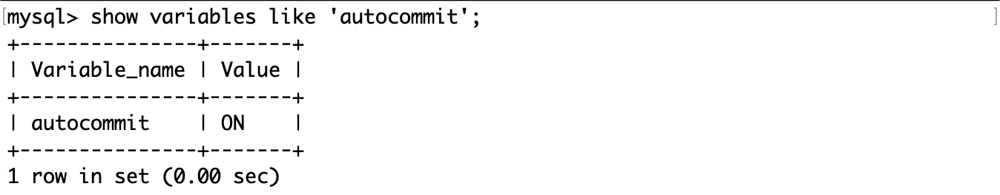

通过`set autocommit=1 或 0`来设置自动提交或手动提交。

## 事务的基本操作

事务的基本操作主要包括以下几个方面：

1. 开始事务（BEGIN TRANSACTION 或 START TRANSACTION）：这标志着事务的开始。从这一点开始，事务中的所有操作要么全部成功提交，要么全部失败回滚，以保证数据的一致性和完整性。
2. 提交事务（COMMIT）：提交事务意味着事务中的所有操作都已成功完成，并且对数据库所做的所有更改都将被永久保存。一旦事务被提交，这些更改就对其他用户和事务可见。
3. 回滚事务（ROLLBACK）：如果在事务执行过程中遇到错误或者需要主动撤销事务中的操作，可以执行回滚操作。回滚事务会撤销事务中的所有操作，将数据库状态恢复到事务开始之前的状态。
4. 保存点（SAVEPOINT）：保存点允许在事务内部标记一个中间状态。这样，如果需要，可以仅回滚到事务中的某个特定点，而不是完全回滚事务。这在处理复杂事务时非常有用，特别是当事务中的某些部分已确定无误，但其他部分可能需要撤销时。
5. 释放保存点（RELEASE SAVEPOINT）：释放一个先前设置的保存点。一旦释放，你将无法再回滚到这个保存点。这通常用于在确认事务的某个阶段已成功完成后，释放不再需要的保存点资源。
6. 设置事务特性（如设置隔离级别）：在开始事务时，可以设置一些特性，如事务的隔离级别。隔离级别决定了一个事务所做的更改在被其他事务看到之前需要满足的条件，这直接影响到事务的并发性和系统的整体性能。

### 测试表

为了方便观察实验现象，将隔离级别设置为“读未提交”。

```sql
set global transaction isolation level read uncommitted;
```

但是此次修改仅在当前会话有效，重启当前会话，重新连接 MySQL，查看隔离级别：


创建账户表：


下面的演示将会用两个会话模拟并发情况。

### 启动事务

使用`start transaction`或`begin`启动一个事务。

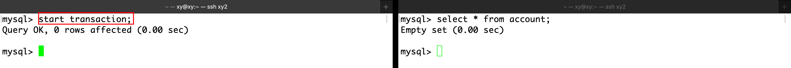

在右事务查看表中信息，还未插入记录。

左事务插入记录的同时在右事务查看表内容：

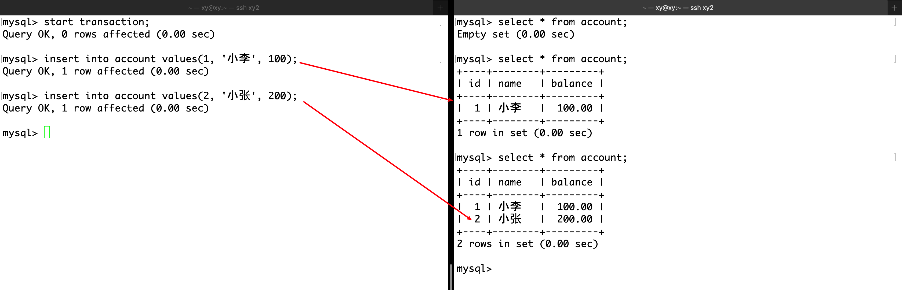

之所以右事务能够实时看到左事务改变了表的内容，是因为隔离级别事先被设置为“读未提交”，即左事务的事务在 commit 之前，右事务也能看到其修改的内容。

### 保存点

使用`savepoint point_name`创建一个保存点，以用于回滚。


创建保存点不影响隔离级别。

### 回滚

使用`rollback to 保存点名`回滚到保存点，这样会失去保存点之后的记录。

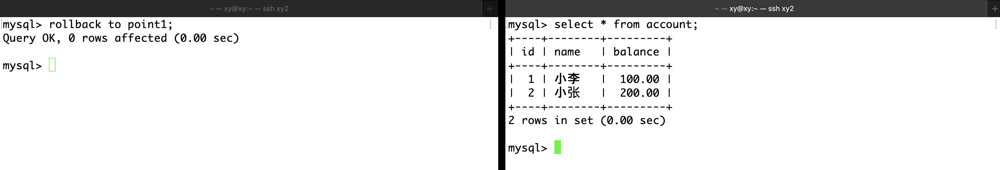

使用`rollback`回滚在事务的起点，这样会失去所有记录。


### 提交

重新开始一个事务，然后插入两条数据。

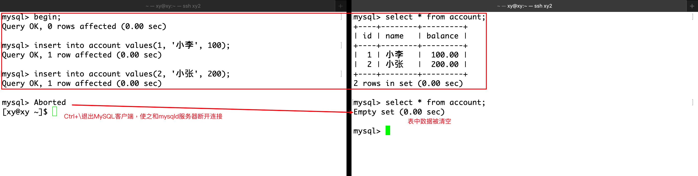

当客户端断开连接后（quit），表中内容将被清空。原因是启动了事务却没有提交，在这种情况下 MySQL 会将表回滚到事务启动之前的样子。

在插入记录后 commit，并尝试回滚和断开连接：

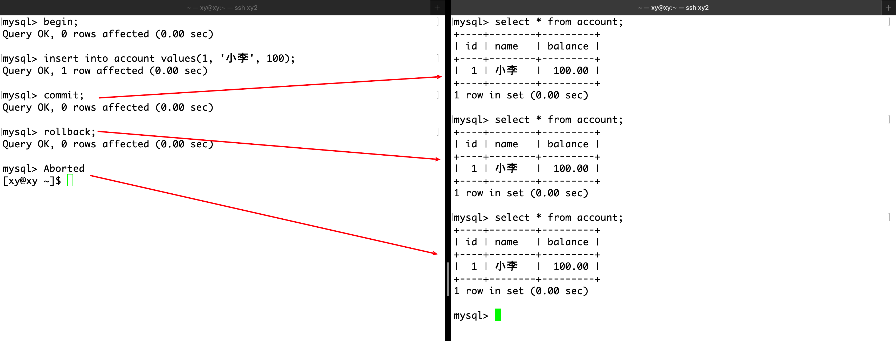

可见，只要 commit 后，数据将被持久化到数据库中，而回滚或断开连接都不会影响。这体现了事务的原子性，要么全都做，要么全不做，这由 commit 控制。

> 这和自动提交开启与否无关。只要用户像上面这样手动键入`begin`或`start transaction`开启事务，所有的更改都不会自动提交，需要手动`commit`提交事务。无论`autocommit`设置如何。这允许用户执行多个操作作为一个单一的事务单元，确保了数据的一致性和完整性。

实际上，当`autocommit`模式开启时（默认设置），普通的 SQL 语句（如`INSERT`、`UPDATE`、`DELETE`等）被视为一个只包含单个操作的事务，并且在执行后会自动提交。这意味着每条这样的 SQL 语句立即被执行，并且它们对数据库所做的更改是永久性的，除非显式地通过事务控制命令（如`BEGIN`、`ROLLBACK`）进行管理。

示例：

当`autocommit`开启时：

```sql
INSERT INTO table_name (column1) VALUES ('value1');
-- 这条 INSERT 语句执行后会立即提交更改。
```

从这一点来看，事务的存在确实方便了用户的工作。

当`autocommit`关闭时：

```sql
SET autocommit = 0;
INSERT INTO table_name (column1) VALUES ('value1');
-- 这条 INSERT 语句不会立即提交，需要显式执行 COMMIT 命令。
COMMIT;
```

在处理复杂事务或需要确保数据一致性的情况下，可能需要关闭`autocommit`模式，以手动控制事务的提交和回滚。

## 事务的隔离级别

事务的隔离级别是为了解决在并发事务中可能出现的几种问题，同时在隔离性与并发性能之间寻找平衡。事务可能由多条 SQL 语句组成，这意味着它可能会出现中间状态，数据库事务在执行时可能会遇到以下并发问题：

1. 脏读（Dirty Read）：一个事务读取到了另一个事务未提交的数据。如果那个事务回滚，读取到的数据将是不准确的。

2. 不可重复读（Non-repeatable Read）：在同一事务中，多次读取同一数据集合时，由于其他事务的更新操作，导致两次读取的数据不一致。

3. 幻读（Phantom Read）：在同一事务中，两次执行相同的查询，第二次查询返回了第一次查询中未出现的额外行。这通常是由于其他事务在这两次查询之间插入了新行。

4. 丢失修改（Lost Update）：当两个或多个事务读取相同的数据，并基于读取的值更新该数据时，其中一个事务的修改可能会被另一个事务的修改覆盖。

### 为什么需要隔离级别？

- 性能与准确性的权衡（主要）：较低的隔离级别（如读未提交）可能提高并发性能，但增加了数据不一致的风险。较高的隔离级别（如串行化）提供了更强的数据一致性保证，但可能导致较大的性能开销，因为它们限制了事务的并发执行。
- 业务需求：不同的应用和业务场景对数据的准确性和处理速度有不同的要求。选择合适的隔离级别可以确保应用在满足数据一致性要求的同时，还能获得良好的性能表现。

### 事务隔离级别

为了解决以上问题，SQL 标准定义了四个隔离级别，每个级别都以不同的方式平衡了数据的准确性和访问速度：

1. 读未提交（Read Uncommitted）：最低的隔离级别，允许脏读，但可以最大程度地提高并发性。

2. 读已提交（Read Committed）：保证一个事务不会读取另一个事务未提交的数据，从而避免脏读。这是大多数数据库系统的默认隔离级别。

3. 可重复读（Repeatable Read）：确保在同一事务中，多次读取同一数据集合的结果是一致的，避免不可重复读。但在某些数据库实现中，可能仍然会遇到幻读。

4. 串行化（Serializable）：最高的隔离级别，通过强制事务串行执行，避免脏读、不可重复读和幻读，但并发性能最低。

### 设置隔离级别

通过`select @@global.tx_isolation`查看全局隔离级别：


通过`set global transaction isolation level 隔离级别`设置全局隔离级别。


注意当前会话的隔离级别仍然是原来的（见下），需要重启会话才能生效。

通过`select @@session.tx_isolation`或`select @@tx_isolation`查看当前会话隔离级别。


通过`set session transaction isolation level 隔离级别`设置当前会话隔离级别。


注意会话隔离级别的修改只对此次会话有效，其他会话仍使用全局隔离级别的设置。

### 读未提交

设置两个会话的隔离级别都为“读未提交”，然后左右会话各自启动一个事务，只要其中一个事务对表内容做修改，其他事务能立即查看修改后的内容。

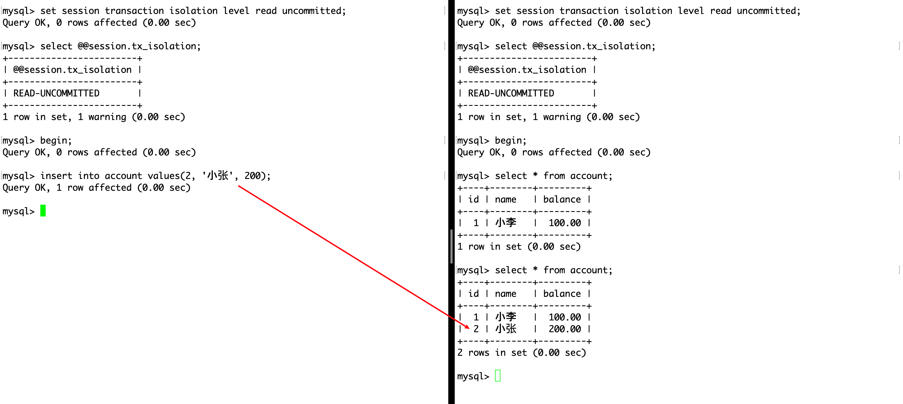

> 如果并未达到类似效果，可以重新连接 MySQL 尝试。

读未提交（Read Uncommitted）是数据库事务的最低隔离级别。在这个隔离级别下，一个事务可以读取另一个事务尚未提交的数据变更。这种行为可能导致几个问题，最主要的是“脏读”（Dirty Reads）。以下是读未提交隔离级别的几个关键特点：

#### 脏读（Dirty Reads）

- **定义**：当一个事务能够看到其他并发事务未提交的更改时，就发生了脏读。这意味着，如果那个并发事务回滚（Rollback），读取到的数据就会变成从未存在过的，导致数据不一致的问题。
- **例子**：事务 A 修改了一条记录但尚未提交，事务 B 在此时读取了同一记录，若事务 A 回滚，事务 B 读到的数据就是错误的。

#### 提高并发性

- 由于读未提交级别不会对读取的数据加锁，它允许更高程度的并发操作。这可以在某些高并发的应用场景中减少等待时间和锁争用。

#### 性能提升

- 在读未提交级别，由于几乎没有锁操作，事务可以快速执行，这在理论上可以提高系统的整体性能。然而，这种性能提升是以牺牲数据的准确性和完整性为代价的。

#### 应用场景的限制

- 由于脏读的风险，读未提交级别在需要保证数据一致性和准确性的应用中通常不被推荐。它可能只在对数据一致性要求不高的特定场景下被考虑。

#### 数据不一致的风险

- 除了脏读，读未提交隔离级别也可能导致其他数据不一致问题，如不可重复读和幻读，尽管这些问题在更高的隔离级别中更常被讨论。

#### 使用场景

- 尽管存在上述问题和限制，但在某些特定的应用场景下，如果事务主要执行读操作，且对数据的绝对一致性要求不高，读未提交的隔离级别可以被用来提高性能。例如，实时数据分析和统计，其中数据的最新准确性不是首要关注点。

### 读已提交

设置两个会话的隔离级别都为“读已提交”，然后左右会话各自启动一个事务，只有事务在修改后 commit，其他事务才能查看修改后的内容。 

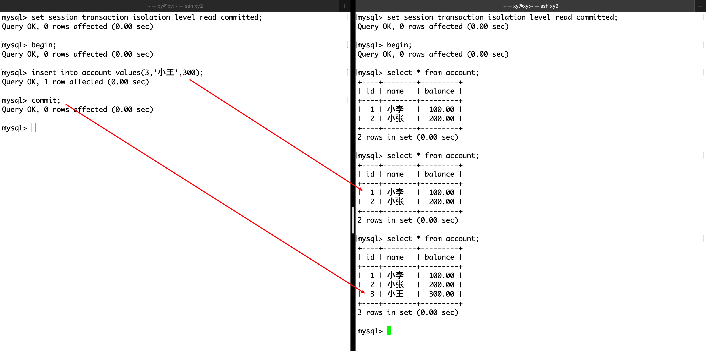

读已提交（Read Committed）提供了比读未提交（Read Uncommitted）更严格的数据一致性保证。在读已提交隔离级别下，一个事务只能看到其他事务已经提交的更改。这个级别主要用来避免脏读（Dirty Reads），但仍可能遇到不可重复读（Non-repeatable Reads）和幻读（Phantom Reads）的问题。以下是读已提交隔离级别的关键特点：

#### 避免脏读

- **脏读**是指一个事务读取到另一个事务未提交的数据。在读已提交隔离级别下，事务只能读取到其他事务已经成功提交的更改，从而避免了脏读的发生。

#### 不可重复读

- 在读已提交隔离级别下，一个事务在其执行期间对同一数据集的多次读取可能会看到不同的数据。这是因为其他事务可能在这两次读取之间修改并提交了这些数据，导致所谓的**不可重复读**问题。

在上面的例子中，一个会话多次相同查询，得到了不同的结果，这就是不可重复读。

#### 提高并发性

- 与更高隔离级别（如可重复读和串行化）相比，读已提交提供了更高的并发性。这是因为数据在读取时只被锁定很短的时间，或者使用版本控制机制来避免锁定，从而减少了锁争用。

#### 实现方式

- 大多数数据库系统提供了两种实现读已提交隔离级别的方式：一种是使用锁定机制，另一种是使用多版本并发控制（MVCC）。MVCC 允许读操作不阻塞写操作，写操作不阻塞读操作，从而进一步提高了并发性。

#### 适用场景

- 读已提交是许多数据库系统的默认隔离级别，因为它在保证数据一致性的同时也提供了较好的性能和并发性。它适用于对脏读不能容忍，但可以接受不可重复读的应用场景。

#### 幻读问题

- 尽管读已提交可以避免脏读，但它无法解决幻读问题。幻读是指当一个事务在对表中某些行进行操作时，另一个事务插入或删除了满足操作条件的行，导致第一个事务在再次读取表时看到不一致的结果。

读已提交隔离级别在很多数据库应用中被广泛使用，因为它为应用提供了合理的平衡点，既保证了一定级别的数据一致性，又保持了良好的系统性能和高并发能力。

### 可重复读

设置两个会话的隔离级别都为“可重复读”，然后左右会话各自启动一个事务，只有当两个事务都 commit 后，才能查看修改后的内容。 

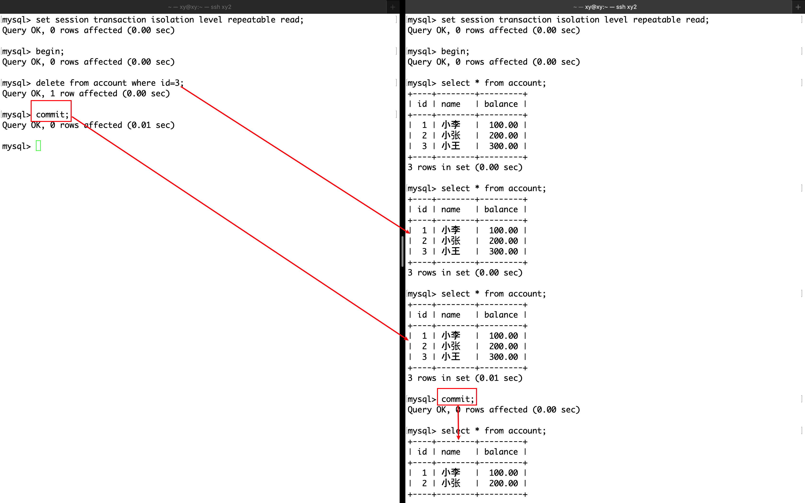

可重复读（Repeatable Read）提供比读已提交更强的数据一致性保证。在可重复读隔离级别下，一个事务在其整个执行过程中多次读取同一数据集的结果将保持一致，即使其他事务在这期间提交了更新那些数据的操作。这个级别主要用来解决脏读（Dirty Reads）和不可重复读（Non-repeatable Reads）的问题。以下是可重复读隔离级别的几个关键特点：

#### 解决不可重复读

- 可重复读隔离级别确保了在一个事务内部，多次读取同一数据集的结果是一致的。这意味着，如果一个事务已经读取了一个数据集，那么在这个事务的剩余部分中，其他事务所做的对这个数据集的更新操作对当前事务是不可见的。

#### 可能遇到幻读

- 尽管可重复读隔离级别可以防止不可重复读，但它可能无法完全解决幻读（Phantom Reads）问题。幻读是指当一个事务重新执行范围查询时，返回了其他事务插入或删除的行。在某些数据库系统中，例如 MySQL 的 InnoDB 存储引擎，可重复读通过使用多版本并发控制（MVCC）机制实际上也能够有效防止幻读。

#### 多版本并发控制（MVCC）

- 许多支持可重复读隔离级别的数据库系统使用 MVCC 来实现它。MVCC 通过为每个读取的数据项创建一个快照来保证事务的可重复读特性，从而允许读写操作并发执行而互不干扰，提高了系统的并发性能。

#### 性能和并发性

- 相对于串行化（Serializable）隔离级别，可重复读提供了更高的并发性，因为它不需要对读取的数据加锁。然而，它可能比读已提交隔离级别稍微牺牲一些性能，因为需要维护数据的多个版本来支持 MVCC。

#### 使用场景

- 可重复读是许多数据库系统的默认隔离级别（例如，MySQL 的 InnoDB 存储引擎），适用于那些需要防止脏读和不可重复读，但又不想因为使用串行化隔离级别而带来的性能开销的应用场景。

可重复读隔离级别在保证较高数据一致性的同时，尝试平衡性能和并发性。它对于需要在事务中多次读取相同数据，并期望每次读取结果一致的应用非常有用。然而，它不能解决幻读。

### 串行化

设置两个会话的隔离级别都为“串行化”，然后左右会话各自启动一个事务，尝试同时读或写。

当两个事务都尝试读取表中内容时，事务不会被阻塞，可以并发执行。

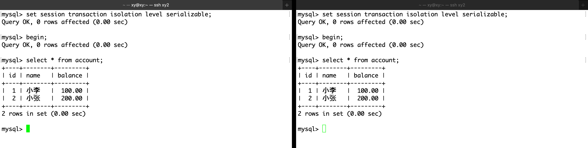

当任意一个事务尝试写操作，它会被立即阻塞，直到其他所有事务都 commit 后才会被唤醒。

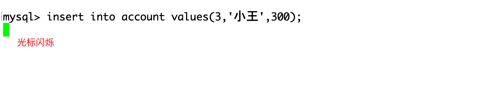

另一个事务 commit。


串行化（Serializable）提供了最严格的事务隔离。在串行化隔离级别下，事务将会被顺序执行，以避免事务之间的干扰，从而防止脏读（Dirty Reads）、不可重复读（Non-repeatable Reads）和幻读（Phantom Reads）。这个级别通过完全串行化事务的执行来确保数据的绝对一致性，模拟了一个用户在任意时刻都是独占数据库的情况。以下是串行化隔离级别的几个关键特点：

#### 完全避免并发问题

- 串行化通过锁定所涉及的数据库表或行（取决于实现细节），确保了一个事务在执行期间，不会与其他事务发生冲突，从而避免了所有的并发问题，包括脏读、不可重复读和幻读。

#### 性能影响

- 由于事务是顺序执行的，串行化隔离级别可能会显著降低数据库的并发性能。在高并发应用中，这可能导致显著的性能瓶颈，因为事务必须等待其他事务完成才能继续执行。

#### 锁定机制

- 实现串行化隔离级别通常依赖于数据库的锁定机制。这可能包括行锁、表锁或更精细的锁定策略，以保证事务的串行执行。不同的数据库管理系统（DBMS）可能采用不同的锁定策略来实现这一隔离级别。

#### 应用场景

- 串行化隔离级别适用于对数据一致性要求极高的场景，其中任何并发问题都是不可接受的。然而，由于其对系统性能的影响，通常只在绝对必要时才使用。

串行化隔离级别提供了最强的事务隔离保证，但这也伴随着性能和并发性的牺牲。

### 总结

|           隔离级别           | 脏读 | 不可重复读 | 幻读 | 加锁读 |
| :--------------------------: | :--: | :--------: | :--: | :----: |
| 读未提交（read uncommitted） |  √   |     √      |  √   | 不加锁 |
|  读已提交（read committed）  |  ×   |     √      |  √   | 不加锁 |
| 可重复读（repeatable read）  |  ×   |     ×      |  ×   | 不加锁 |
|   可串行化（serializable）   |  ×   |     ×      |  ×   |  加锁  |

## 事务的一致性

事务的一致性是指在数据库事务开始之前和完成之后，数据库从一个正确的状态转变到另一个正确的状态的特性。这意味着事务的执行不会破坏数据库数据的完整性和业务规则。

- 事务执行的结果：在事务开始和结束时，数据库必须处于一致的状态。即使事务中包含了多个操作，这些操作要么全部成功（在此情况下，事务被提交），要么完全不发生（事务回滚），从而保证数据的一致性。

- 错误处理：当事务执行过程中遇到错误（如违反数据完整性约束）时，系统应能够识别这些错误，并将事务回滚到其开始状态，确保数据库保持一致性。

- 并发控制：数据库管理系统通过实现不同的事务隔离级别来处理并发事务，防止诸如脏读、不可重复读和幻读等问题，这些都是为了维护事务的一致性。虽然隔离级别的选择可能影响性能，但适当的隔离级别可以确保即使在并发环境下，事务的一致性也不会被破坏。

- 持久性与一致性：事务的持久性保证了一旦事务被提交，其结果就被永久保存，即使发生系统故障。持久性和一致性共同确保了数据的准确性和可靠性。

例如转账操作，从账户 A 向账户 B 转账 100 元。这个操作包含两个步骤：从账户 A 扣除 100 元，向账户 B 添加 100 元。事务的一致性确保了以下几点：

- 转账前后，两个账户的总余额不变。
- 账户 A 的余额不会因为扣款变成负数（假设透支不被允许）。
- 如果任何一个步骤失败（例如，账户 A 余额不足），整个事务都会回滚，保证账户余额不发生变化，维护数据一致性。

事务的一致性是确保数据库在执行事务操作后仍然保持正确状态的关键特性，它要求事务的执行不能违反数据库的任何完整性约束或**业务规则**。从技术方面，原子性、隔离性和持久性保证了一致性；从业务方面，上层用户是逻辑设计也会影响一致性。

实际上，在“可重复读”这个隔离级别下，多个事务的 UPDATE，INSERT 和 DELETE 时会出现加锁现象，而 SELECT 不加锁。这是通过（行或表的）读写锁和 MVCC 实现的隔离性。

## 多版本并发控制

### MVCC

多版本并发控制（Multiversion Concurrency Control，MVCC）是一种广泛用于数据库管理系统中的技术，用于提高数据库事务的并发性能，同时保持数据的一致性。MVCC 通过为数据对象保留不同时间点的多个版本来实现，**允许读取操作和写入操作并发执行而互不干扰，从而避免了在读取时对数据进行锁定**（并发读写不加锁）。这种机制特别适用于读多写少的应用场景，可以显著减少等待时间和锁争用，提高系统的整体性能。

数据库并发的场景无非如下三种：

- 读-读并发：不存在任何问题，不需要并发控制。
- 读-写并发：有线程安全问题，可能会存在事务隔离性问题，可能遇到脏读、幻读、不可重复读。
- 写-写并发：有线程安全问题，可能会存在两类更新丢失问题。

其中写-写并发有两类更新丢失问题：

- 覆盖丢失（Lost Update）：发生在两个或多个事务试图同时更新同一数据项时。如果没有适当的并发控制机制，一个事务的更新可能会被另一个事务的更新所覆盖，导致第一个事务的更改丢失。
- 回滚丢失（Lost Rollback）：它指的是在某些系统中处理回滚操作时可能遇到的问题，其中一个事务的回滚操作意外地撤销了其他事务已经提交的更改。实际上，在现代数据库系统中，更常见的情况是，系统设计应确保一旦事务提交，其更改就是永久性的，不会因为其他事务的回滚而丢失。

#### MVCC 的工作原理

1. 版本控制：每当数据被修改时，MVCC 不是直接覆写旧的数据，而是创建一个新的版本（或快照）。这意味着同一数据项可以有多个版本，每个版本都有一个时间戳或事务 ID。

2. 读操作：当执行读操作时，MVCC 允许事务读取到该事务开始时刻的数据快照。这意味着读操作可以访问到数据的一个一致性版本，而不受并发写入事务的影响。这样，读操作不需要等待写锁释放，从而避免了读-写冲突。

3. 写操作：写操作产生数据的新版本，但不会立即对所有用户可见。只有当写事务提交时，其更改才对其他事务可见。这样，写操作不会阻塞读操作，因为读操作访问的是旧版本的数据。

4. 版本可见性：系统根据事务的开始时间和数据版本的时间戳（或版本号）来确定一个事务能看到哪个版本的数据。这样，每个事务都能看到一个一致的数据快照，即使其他事务正在并发修改数据。

5. 垃圾收集：随着时间的推移，一些旧版本的数据将不再被任何事务所需要，系统可以通过垃圾收集过程来清理这些不再需要的数据版本。

#### MVCC 的优点

- 提高并发性：**MVCC 允许多个读者和写者同时对数据库进行操作，而不会相互阻塞**，大大提高了并发性能。
- 减少锁争用：由于读操作不需要锁定数据，因此减少了锁争用，提高了系统的响应速度和吞吐量。
- 支持事务隔离级别：MVCC 能够支持不同的事务隔离级别，包括读已提交（Read Committed）和可重复读（Repeatable Read）等，而不需要显式的锁定机制。

#### 应用场景

MVCC 特别适用于读操作远多于写操作的应用场景，例如在线事务处理（OLTP）系统、Web 应用和报表生成等。通过 MVCC，这些应用可以实现高效的并发访问，同时保持数据的一致性和完整性。

### 记录的三个隐藏字段

在 MySQL 的 InnoDB 存储引擎中，每条记录（row）都会有一些隐藏的字段，这些字段对于用户是不可见的，但它们对于数据库的内部操作非常重要。这些隐藏字段主要用于支持事务的多版本并发控制（MVCC），以及其他一些内部机制。对于 InnoDB 存储引擎，每条记录通常会包含以下三个隐藏字段：

1. DB_TRX_ID：每当记录被修改时，InnoDB 都会在这个隐藏字段中存储一个事务 ID（Transaction ID）。这个事务 ID 代表了最后修改该记录的事务。这个字段是 MVCC 机制的一部分，用于确定在给定事务中哪些更改是可见的。

2. DB_ROLL_PTR：这是一个回滚指针（Rollback Pointer），它指向 undo 日志中的一个记录。如果需要回滚事务，或者在 MVCC 中为了提供一致性视图而需要访问行的旧版本，这个指针将会被用到。通过这个指针，InnoDB 可以找到行的先前版本，从而支持了行级的回滚和一致性非锁定读取。

3. DB_ROW_ID：如果表没有定义主键，InnoDB 会自动添加一个隐藏的行 ID 字段作为主键。这个行 ID 是唯一的，由 InnoDB 自动维护，用于内部行的唯一标识。如果表已经有了显式定义的主键，这个字段则不会被创建。

例如有一张空的信息表，插入第一条记录后：


图片来源（包括后文）：https://blog.csdn.net/chenlong_cxy/article/details/128919989

解释：

- 假设插入该记录的事务的事务 ID 为 9，那么该记录的`DB_TRX_ID`字段填的就是 9。
- 因为这是插入的第一条记录，所以隐式主键`DB_ROW_ID`字段填的就是 1。
- 由于这条记录是新插入的，没有历史版本，所以回滚指针`DB_ROLL_PTR`的值设置为 null。

这些隐藏字段是 InnoDB 实现事务隔离级别、MVCC、数据一致性等功能的基础。它们使得 InnoDB 能够有效地管理并发访问，提供高性能的事务处理能力，同时保持数据的一致性和完整性。

### undo 日志

undo 日志是 MySQL 的 InnoDB 存储引擎中用于支持事务回滚（Rollback）和多版本并发控制（MVCC）的一种机制。undo 日志记录了事务发生之前的数据状态，如果一个事务需要被回滚（例如，由于执行错误或显式的 ROLLBACK 语句），数据库可以利用 undo 日志中的信息将数据恢复到事务开始之前的状态。

MySQL 的三大日志：

- redo log：重做日志，由 Innodb 存储引擎层生成。用于 MySQL 崩溃后进行数据恢复，保证数据的持久性。
- bin log：逻辑日志，由 Server 层生成。用于主从数据备份时进行数据同步，保证数据的一致性。
- undo log：回滚日志，由 Innodb 存储引擎层生成。用于对已经执行的操作进行回滚和 MVCC，保证事务的原子性。

MySQL 会为上述三大日志开辟对应的缓冲区，用于存储日志相关的信息，必要时会将缓冲区中的数据刷新到磁盘。

#### 主要作用

1. 支持事务回滚：当一个事务因为错误或其他原因需要被取消时，undo 日志提供了必要的信息来撤销该事务所做的所有更改，确保数据库的一致性不被破坏。

2. 实现 MVCC：在支持 MVCC 的数据库系统中，undo 日志用于存储旧的数据版本。这允许系统为不同的事务提供数据的一致性视图，即使这些数据被其他事务并发修改。通过访问 undo 日志中的旧版本数据，事务可以看到在其启动时刻数据库的一致性状态，从而实现非锁定读取，提高并发性能。

#### undo 日志的工作原理

- 当事务对数据库进行修改时（如插入、更新或删除操作），数据库不仅会修改当前数据，还会在 undo 日志中记录修改前的数据状态。
- 如果事务成功提交，undo 日志中的数据最终会被清理。但在事务提交之前，undo 日志中的信息必须保留，以便于在需要时进行数据恢复。
- 在 MVCC 中，undo 日志中保留的旧版本数据可以被并发执行的其他事务访问，以获取数据的一致性视图。

#### undo 日志的管理

- undo 日志通常存储在数据库的特定区域或文件中，数据库系统会管理 undo 日志的空间和生命周期，确保 undo 日志的有效利用和及时清理。
- 数据库可能会根据 undo 日志的大小和使用情况自动进行优化，如扩展存储空间或回收不再需要的 undo 信息。

### 快照

快照（Snapshot）是 InnoDB 实现高效并发控制（MVCC）的关键机制，通过允许事务访问数据的一致性视图，同时避免了直接的数据锁定，大大提高了数据库的性能和可伸缩性。

快照并不指代物理的数据副本，而是一种逻辑上的数据视图或状态，允许事务查询到数据库在某一特定时间点的状态，而无需关心在这之后是否有其他事务对数据进行了修改。这种机制使得数据库能够支持高效的并发读写操作，同时保持一致性和隔离性。

#### 快照的工作原理

1. 非阻塞读取：快照允许读取操作在不阻塞写入操作的情况下进行，反之亦然。这是通过为每个读取操作提供一个数据库状态的“快照”来实现的，这个状态反映了读取操作开始时的数据状态。

2. 版本控制：InnoDB 通过维护每行数据的多个版本来实现快照。每个版本都有一个关联的事务 ID，表示创建该版本的事务。当事务进行读取操作时，它只能看到在事务开始之前已经提交的更改，或者是该事务自己所做的更改。

3. 隐藏列：InnoDB 为每行数据自动添加几个隐藏的列，用于支持 MVCC，包括事务 ID（表示最后修改该行的事务）和回滚指针（指向该行的旧版本）。这些隐藏列使得 InnoDB 能够根据事务的开始时间决定哪些数据版本对当前事务是可见的。

#### 使用场景

- 一致性非锁定读取（Consistent Non-locking Reads）：在 READ COMMITTED 和 REPEATABLE READ 隔离级别下，快照支持查询在不加锁的情况下读取一致的数据状态。

- 事务回滚：如果事务需要被回滚，快照中保留的数据版本可以用来恢复数据到事务开始前的状态。

#### 隔离级别和快照

- READ COMMITTED：在这个隔离级别下，每个 SQL 语句都会创建一个新的快照。
- REPEATABLE READ：在 MySQL 的 InnoDB 存储引擎中，默认的隔离级别。在这个级别下，事务开始时创建的快照会被整个事务期间复用，确保了事务中的查询可以重复读取到相同的数据集。

#### 示例

下文引用自：https://blog.csdn.net/chenlong_cxy/article/details/128919989

现在有一个事务 ID 为 10 的事务，要将刚才插入学生表中的记录的学生姓名改为“李四”：

- 因为是要进行写操作，所以需要先给该记录加行锁。
- 修改前，先将该行记录拷贝到 undo log 中，此时 undo log 中就有了一行副本数据。
- 然后再将原始记录中的学生姓名改为“李四”，并将该记录的`DB_TRX_ID`改为 10，回滚指针`DB_ROLL_PTR`设置成 undo log 中副本数据的地址，从而指向该记录的上一个版本。
- 最后当事务 10 提交后释放锁，这时最新的记录就是学生姓名为“李四”的那条记录。

修改后的示意图如下：

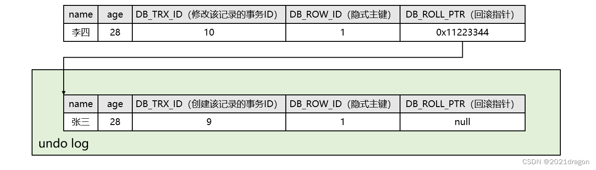

现在又有一个事务 ID 为 11 的事务，要将刚才学生表中的那条记录的学生年龄改为 38：

- 因为是要进行写操作，所以需要先给该记录（最新的记录）加行锁。
- 修改前，先将该行记录拷贝到 undo log 中，此时 undo log 中就又有了一行副本数据。
- 然后再将原始记录中的学生年龄改为 38，并将该记录的`DB_TRX_ID`改为 11，回滚指针`DB_ROLL_PTR`设置成刚才拷贝到 undo log 中的副本数据的地址，从而指向该记录的上一个版本。
- 最后当事务 11 提交后释放锁，这时最新的记录就是学生年龄为 38 的那条记录。

修改后的示意图如下：


此时我们就有了一个基于链表记录的历史版本链，而 undo log 中的一个个的历史版本就称为一个个的快照。

从 SQL 执行的角度来看，commit 之前的回滚要做的事就是从 undo log 读取数据，然后执行和原先相反的 SQL。比如当 delete 一条记录时，undo log 中会把记录中的内容都记下来，然后执行回滚操作的时候，就读取 undo log 里的数据，然后进行 insert 操作。

> INSERT 和 DELETE 的记录如何维护版本链？

- 删除记录并不是真的把数据删除了，而是先将该记录拷贝一份放入 undo log 中，然后将该记录的删除 flag 隐藏字段设置为 1，这样回滚后该记录的删除 flag 隐藏字段就又变回 0 了，相当于删除的数据又恢复了。
- 新插入的记录是没有历史版本的，但是一般为了回滚操作，新插入的记录也需要拷贝一份放入 undo log 中，只不过被拷贝到 undo log 中的记录的删除 flag 隐藏字段被设置为 1，这样回滚后就相当于新插入的数据就被删除了。

增加、删除和修改数据都会形成版本链。

> 当前读 VS 快照读

- 当前读：读取最新的记录，就叫做当前读。
- 快照读：读取历史版本，就叫做快照读。

事务在进行增删查改的时候，并不是都需要进行加锁保护：

- 事务对数据进行增删改的时候，操作的都是最新记录，即当前读，需要进行加锁保护。

- 事务在进行 select 查询的时候，既可能是当前读也可能是快照读，如果是当前读，那也需要进行加锁保护，但如果是快照读，那就不需要加锁，因为历史版本不会被修改，也就是可以并发执行，提高了效率，这也就是 MVCC 的意义所在。

而 select 查询时应该进行当前读还是快照读，则是由隔离级别决定的，在读未提交和串行化隔离级别下，进行的都是当前读，而在读提交和可重复读隔离级别下，既可能进行当前读也可能进行快照读。

理解事务的隔离性：事务是有先后顺序的，而它们对数据的增删查改操作在时间线上是交叉的、混乱的，由于需要保证事务的原子性和先后次序，就要让事务看到它应该看到的内容，因为单个事务对其他事务是无感知的。事务究竟看到的内容能达到什么级别，这取决于它的隔离级别。

> 例如 20 年前的人和现在的人有一个先后次序关系，虽然我们在一段时间内共同生活，但是除此之外我们看到的内容应该是不一样的，这是合理的。

> undo log 中的版本链何时才会被清除？

- 在 undo log 中形成的版本链不仅仅是为了进行回滚操作，其他事务在执行过程中也可能读取版本链中的某个版本，也就是快照读。
- 因此，只有当某条记录的最新版本已经修改并提交，并且此时没有其他事务与该记录的历史版本有关了，这时该记录在 undo log 中的版本链才可以被清除。

注意：

- 对于新插入的记录来说，没有其他事务会访问它的历史版本，因此新插入的记录在提交后就可以将 undo log 中的版本链清除了。
- 因此版本链在 undo log 中可能会存在很长时间，尤其是有其他事务和这个版本链相关联的时候，但这也没有坏处，这说明它是一个热数据。

### 读视图

在 InnoDB 存储引擎中，读视图（Read View）是多版本并发控制（MVCC）机制中的一个关键组成部分，用于实现事务的一致性非锁定读取。读视图允许事务看到数据库在特定时间点的一致状态，而忽略在该事务开始之后发生的其他事务所做的更改。这样，即使数据库中的数据在事务执行期间被其他事务修改，当前事务也能保持对数据的一致视图。

在 MySQL 的源码中，读视图实现的参数：

```cpp
class ReadView {
	// 省略。..
private:
	/** 高水位：大于等于这个 ID 的事务均不可见*/
	trx_id_t m_low_limit_id;
	
	/** 低水位：小于这个 ID 的事务均可见 */
	trx_id_t m_up_limit_id;
	
	/** 创建该 Read View 的事务 ID*/
	trx_id_t m_creator_trx_id;
	
	/** 创建视图时的活跃事务 id 列表*/
	ids_t m_ids;
	
	/** 配合 purge，标识该视图不需要小于 m_low_limit_no 的 UNDO LOG，
	* 如果其他视图也不需要，则可以删除小于 m_low_limit_no 的 UNDO LOG*/
	trx_id_t m_low_limit_no;
	
	/** 标记视图是否被关闭*/
	bool m_closed;
	
	// 省略。..
};
```

其中：

- m_ids： 一张列表，记录 Read View 生成时刻，系统中活跃的事务 ID。
- m_up_limit_id： 记录 m_ids 列表中事务 ID 最小的 ID。
- m_low_limit_id： 记录 Read View 生成时刻，系统尚未分配的下一个事务 ID。
- m_creator_trx_id： 记录创建该 Read View 的事务的事务 ID。

由于事务 ID 是单向增长的，因此根据 Read View 中的 m_up_limit_id 和 m_low_limit_id，可以将事务 ID 分为三个部分：

- 事务 ID 小于 m_up_limit_id 的事务，一定是生成 Read View 时已经提交的事务，因为 m_up_limit_id 是生成 Read View 时刻系统中活跃事务 ID 中的最小 ID，因此事务 ID 比它小的事务在生成 Read View 时一定已经提交了。
- 事务 ID 大于等于 m_low_limit_id 的事务，一定是生成 Read View 时还没有启动的事务，因为 m_low_limit_id 是生成 Read View 时刻，系统尚未分配的下一个事务 ID。
- 事务 ID 位于 m_up_limit_id 和 m_low_limit_id 之间的事务，在生成 Read View 时可能正处于活跃状态，也可能已经提交了，这时需要通过判断事务 ID 是否存在于 m_ids 中来判断该事务是否已经提交。


- 一个事务在进行读操作时，只应该看到自己或已经提交的事务所作的修改，因此我们可以根据 Read View 来判断当前事务能否看到另一个事务所作的修改。
- 版本链中的每个版本的记录都有自己的 DB_TRX_ID，即创建或最近一次修改该记录的事务 ID，因此可以依次遍历版本链中的各个版本，通过 Read View 来判断当前事务能否看到这个版本，如果不能则继续遍历下一个版本。

注意，快照的事务 ID 不一定是连续的，因为有些事务可能在快照之前就 commit 了。

源码中策略的部分实现，它将会被事务调用：

```cpp
bool changes_visible(trx_id_t id, const table_name_t& name) const 
	MY_ATTRIBUTE((warn_unused_result))
{
	ut_ad(id > 0);
	//1、事务 id 小于 m_up_limit_id（已提交）或事务 id 为创建该 Read View 的事务的 id，则可见
	if (id < m_up_limit_id || id == m_creator_trx_id) {
		return(true);
	}
	check_trx_id_sanity(id, name);
	//2、事务 id 大于等于 m_low_limit_id（生成 Read View 时还没有启动的事务），则不可见
	if (id >= m_low_limit_id) {
		return(false);
	}
	//3、事务 id 位于 m_up_limit_id 和 m_low_limit_id 之间，并且活跃事务 id 列表为空（即不在活跃列表中），则可见
	else if (m_ids.empty()) {
		return(true);
	}
	const ids_t::value_type* p = m_ids.data();
	//4、事务 id 位于 m_up_limit_id 和 m_low_limit_id 之间，如果在活跃事务 id 列表中则不可见，如果不在则可见
	return (!std::binary_search(p, p + m_ids.size(), id));
}
```

使用该函数时将版本的 DB_TRX_ID 传给参数 id，该函数的作用就是根据 Read View，判断当前事务能否看到这个版本。

 当事务被启动时，Read View 不会被创建；只有当首次 SELECT 时才会创建 Read View 对象。

### 读已提交和可重复读的本质区别

本质区别是：Read View 的生成时机不同，造成了快照读的结果的不同。

在读已提交隔离级别下，**每个 SQL 语句执行时都会生成一个新的快照**。这意味着：

- 当事务执行一个查询时，它看到的是执行该查询时刻其他事务已经提交的更改。
- 在同一事务中，不同的查询可能看到不同时间点的数据状态，因为其他事务可能在这两次查询之间提交了新的更改。
- 这个级别不保证可重复读，即在同一事务中，两次相同的查询可能返回不同的结果集，如果其他事务在两次查询之间提交了对这些数据的更改。

在可重复读隔离级别下，**事务开始时生成一个快照，并在整个事务期间复用这个快照**。这意味着：

- 无论事务执行多少次查询，它都会看到事务开始时刻的数据状态，不会看到事务开始之后其他事务所做的更改。
- 这个级别保证了可重复读，即在同一事务中，多次执行相同的查询会返回相同的结果集，即使其他事务已经提交了对这些数据的更改。
- 在 InnoDB 存储引擎中，可重复读隔离级别还通过额外的机制（如 Next-Key Locking）来防止幻读。

例如在可重复读隔离级别下：

实验一：在启动两边的事务后，（注意顺序）首先在右事务中查看表中内容，然后再在左事务中修改并提交。结果我们是能够预想的，只有当两个事务都 commit 后，才能查看修改后的内容。 

如果此时在右会话中使用`select * from table_name lock in share mode`以共享锁的方式，进行当前读，就能查看到修改后的数据。

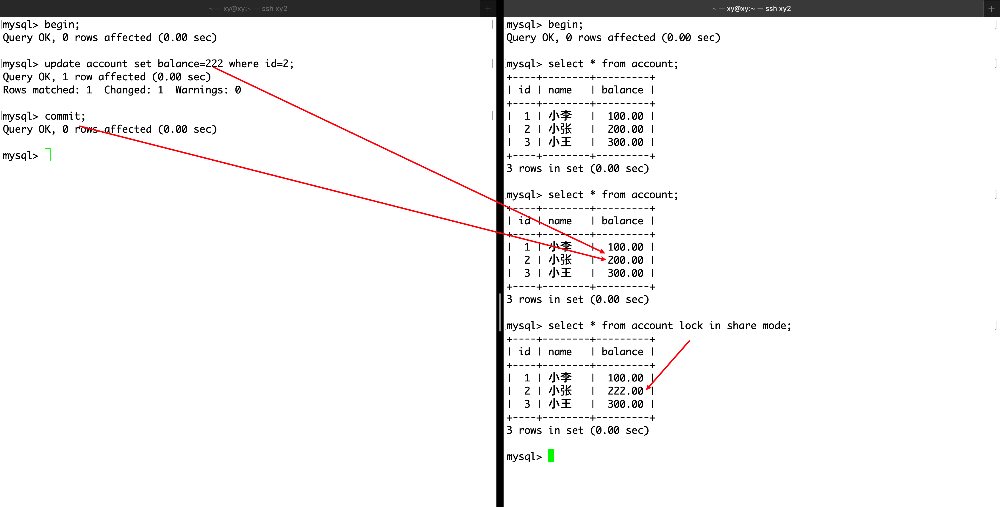

实验二：在启动两边的事务后，（注意顺序）直接左事务中修改并提交。然后再右事务中查看表的内容，然而修改后的数据直接被呈现出来了。


造成两种方式不一样的直接原因是 SQL 在不同事务中执行的顺序不同，实验一的右事务在数据修改之前访问了表数据，这相当于进行了一次快照读，创建了 Read View；实验二的右事务没有，也就没有快照。由于是可重复读级别，所以要求读取的内容要一致，因此第一次进行快照读的地方决定了该事务后续快照读结果的能力。

## 参考资料

- [MySQL 事务管理](https://blog.csdn.net/chenlong_cxy/article/details/128919989)

- [MySQL 日志：undo log、redo log、binlog 有什么用？](https://xiaolincoding.com/mysql/log/how_update.html#mysql-%E6%97%A5%E5%BF%97-undo-log%E3%80%81redo-log%E3%80%81binlog-%E6%9C%89%E4%BB%80%E4%B9%88%E7%94%A8)
