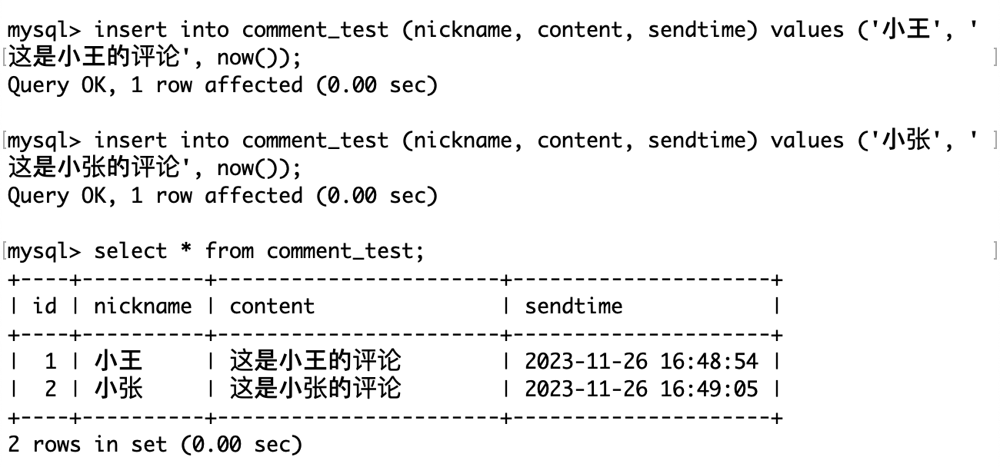
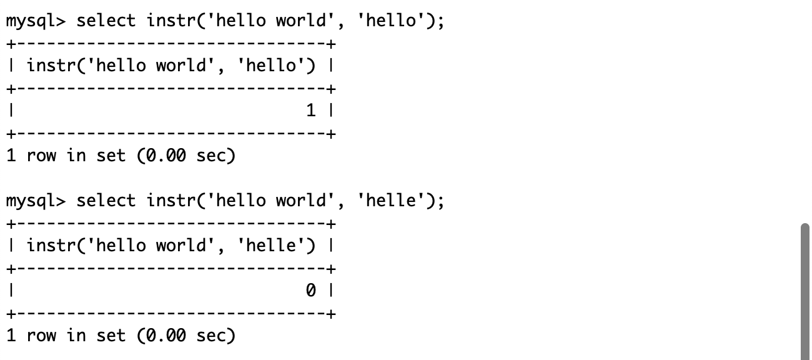
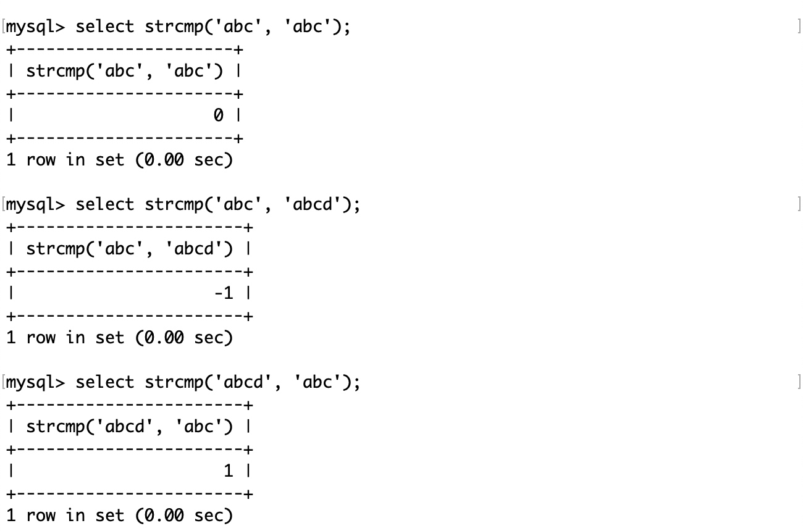
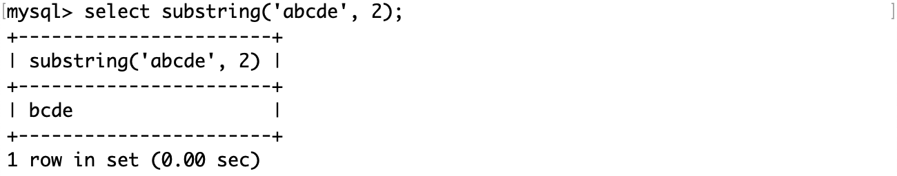

# MySQL 内置函数

MySQL 的内置函数主要分为以下几种：

- 字符串函数：用于对字符串进行操作，如连接、截取、替换、反转、格式化等。
- 数值函数：用于对数值进行计算，如求和、平均、最大、最小、绝对值、幂、对数、三角函数等。
- 日期和时间函数：用于对日期和时间进行操作，如获取当前日期和时间、格式化日期和时间、计算日期和时间的差值、提取日期和时间的部分等。例如，NOW() 函数可以返回当前的日期和时间，DATE_FORMAT(date,format) 函数可以按照指定的格式返回日期，DATEDIFF(date1,date2) 函数可以返回两个日期之间的天数，YEAR(date) 函数可以返回日期的年份，HOUR(time) 函数可以返回时间的小时部分。1
- 聚合函数：用于对一组数据进行统计，如计数、求和、平均、最大、最小、标准差、方差等。
- 流程控制函数：用于根据条件执行不同的操作，如条件判断、选择、循环等。
- 信息函数：用于获取数据库、表、列、用户等的信息，如数据库名、表名、列名、用户名、版本号等。

# 日期和时间函数

常用的日期和时间函数有：

| 函数名称                              | 描述                                                         |
| ------------------------------------- | ------------------------------------------------------------ |
| current_date()                        | 获取当前日期                                                 |
| current_time()                        | 获取当前时间                                                 |
| current_timestamp()                   | 获取当前时间戳                                               |
| now()                                 | 获取当前日期时间                                             |
| date(datetime)                        | 获取 datetime 参数的日期部分                                 |
| date_add(date, interval d_value_type) | 在 date 中添加日期或时间，interval 后的数值单位可以是：year、month、day、hour、minute、second |
| date_sub(date, interval d_value_type) | 在 date 中减去日期或时间，interval 后的数值单位可以是：year、month、day、hour、minute、second |
| datediff(date1, date2)                | 获取两个日期的差，单位是天                                   |

current_date 函数、current_time 函数、current_timestamp 函数和 now 函数：获取当前日期、时间、时间戳以及当前日期时间：

date 函数：获取获取 datetime 参数的日期部分：

在已有日期的基础上添加日期或时间：

操作的单位可以是日期或时间，根据原有的日期或时间而可以精确到秒数。

date_sub 函数的功能完全相同，只是它对已有日期或时间操作的是减法运算。

获取两个日期的差，单位是天：

日期和时间是数据的一种属性，例如在网上发表评论，需要用日期和时间标记。

评论测试表：

插入记录并查询：

用户可能不需要这么精确的日期或时间，对于比较久远的评论，可以只精确到天：

如果要查询 2 分钟之前的评论，就可能需要用若干函数组合来查询了：

# 字符串函数

常用字符串函数有：

| 函数名称                              | 描述                                                |
| ------------------------------------- | --------------------------------------------------- |
| charset(str)                          | 获取字符串使用的字符集                              |
| concat(str1, str2 [, …])              | 获取连接后的字符串                                  |
| instr(str, substr)                    | 获取 substr 在 str 中首次出现的位置，没有出现返回 0 |
| ucase(str)                            | 获取转换成大写后的字符串                            |
| lcase(str)                            | 获取转换成小写后的字符串                            |
| left(str, length)                     | 从字符串的左边开始，向后截取 length 个字符          |
| length(str)                           | 获取字符串占用的字节数                              |
| replace(str, search_str, replace_str) | 将字符串中的 search_str 替换成 replace_str          |
| strcmp(str1, str2)                    | 逐字符比较两个字符串的大小                          |
| substring(str, position [, length])   | 从字符串的 position 开始，向后截取 length 个字符    |
| ltrim(str)、rtrim(str)、trim(str)     | 去除字符串的前空格、后空格、前后空格                |

charset 函数用来返回指定字符串的字符集。字符集是一种给定一系列字符并赋予对应的编码的方式。例如，给定字符列表为 {‘A’,’B’}时， {‘A’=>0, ‘B’=>1}就是一个字符集。

例如查看这张员工雇佣表中名字这一列的字符集：

concat 函数：按参数顺序连接字符串。例如将上面的雇佣表的列属性按照如下方式连接成一个字符串。

instr 函数：获取一个字符串在另一个字符串中首次出现的位置，如果没有出现则返回 0。

ucase 函数：获取转换成大写后的字符串。

lcase 函数：获取转换成小写后的字符串。

left 函数：从字符串的左边开始，向后截取指定个数的字符。

length 函数：获取字符串占用的字节数。

值得注意的是这个函数返回的是字节数而不是字符数，如果是汉字，utf8 占 3 个字节，gbk 占 2 个字节。

replace 函数：将字符串中的指定子字符串替换成另一个字符串。

strcmp 函数：逐字符按照 ASCII 码比较两个字符串的大小，两个字符串大小相等返回 0，前者大返回 1，后者大返回 - 1。且不区分大小写。

substring 函数：从字符串的指定位置开始，向后截取指定个数的字符。

trim 函数：去除字符串的前后空格。

ltrim 和 rtrim 函数：去除字符串的前空格和后空格。

以首字母小写的方式显示员工表中所有员工的姓名：

1. substring 函数和 lcase 函数将姓名的第一个字母转换成小写。
2. substring 函数截取员工姓名的第二个字符及其后续字符。
3. concat 函数用于连接上面获得的两个字符串。

# 数学函数

常用的数学函数如下：

| 函数名称                         | 描述                              |
| -------------------------------- | --------------------------------- |
| abs(number)                      | 绝对值函数                        |
| bin(decimal_number)              | 十进制转换成二进制                |
| hex(decimal_number)              | 十进制转换成十六进制              |
| conv(number, from_base, to_base) | from_base 进制转换成 to_base 进制 |
| ceiling(number)                  | 向上取整                          |
| floor(number)                    | 向下取整                          |
| format(number, n)                | 格式化，保留 n 位小数（四舍五入） |
| rand()                           | 生成随机浮点数，范围 [0.0, 1.0)   |
| mod(number, denominator)         | 求余                              |

abs 函数：获取参数绝对值。

bin 函数和 hex 函数：将参数转换为二进制或十六进制：

conv 函数：进制转换。

ceiling 函数：对参数向上取整。

floor 函数：对参数向下取整。

format 函数：对参数格式化，以四舍五入的方式保留指定位数的小数。

rand 函数：生成 0.0 到 1.0 的随机浮点数。

如果想要生成 0 到 100 的随机数，可以用生成的随机浮点数乘以 100，然后再取整。

mod 函数：对参数求余。

# 信息函数

user 函数：获取 MySQL 连接的当前用户名和主机名。

md5 函数：对一个字符串进行 md5 摘要，摘要后得到一个 32 位字符串。

md5 是一种密码散列函数，它可以将任意长度的信息映射为固定长度（通常为 32bit）的哈希值。它具有不可逆性、唯一性和抗碰撞性。并且由于哈希算法的雪崩效应，即使被加密的信息发生了一个很微小的改动，也会使得最后的哈希值变得完全不同。这是因为密码哈希算法通常采用对轮迭代和复杂的非线性变换，使得输入的每一位都会影响输出的每一位（信息安全专业的同学应该会比较了解）。

在工业应用中持久化存储用户的账号和密码这样的私密信息时，为了用户的安全是不会存储明文的，而是存储它的摘要，在验证时也是也是以同样的方式对用户输入的密码进行摘要，通过与数据库中的哈希值比较以验证用户身份。

这么做也有一个好处，不论用户的密码多长，加密得到的哈希值总是固定的，这样在设计表时就可以用固定长度的列存储密码摘要。

database 函数：显示当前正在使用的数据库。

password 函数：对用户数据进行加密。

另外，像 password 这样涉及用户隐私的函数，它不会被保存在 MySQL 的历史命令中（键盘上下方向键查看）。

ifnull 函数接受两个参数，如果第一个参数不为 null 则返回第一个参数值，否则返回第二个参数值。

# 参考资料

- [MySQL 函数|菜鸟教程](https://www.runoob.com/mysql/mysql-functions.html)
- [MySQL 内置函数](https://blog.csdn.net/chenlong_cxy/article/details/128538165)