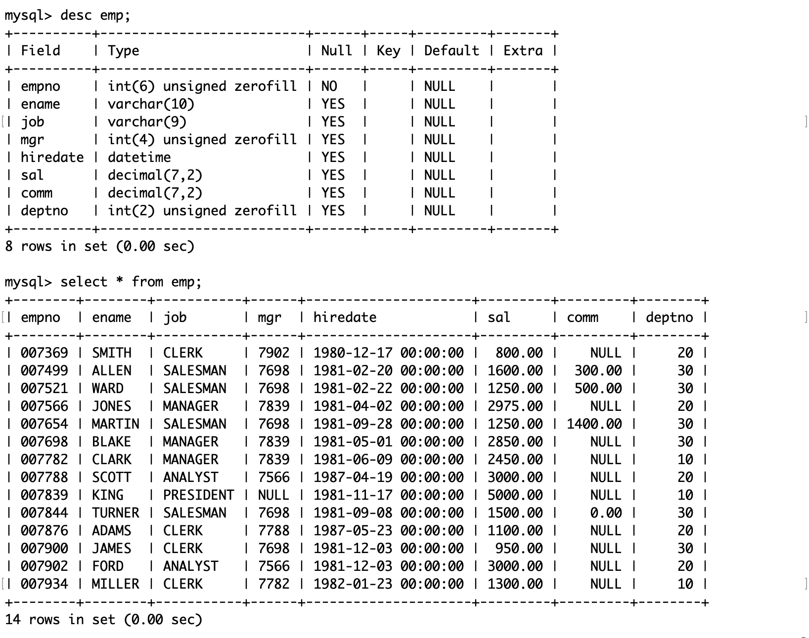
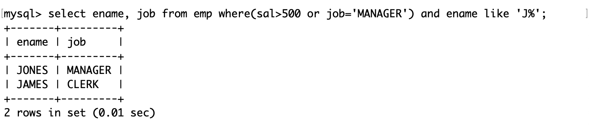
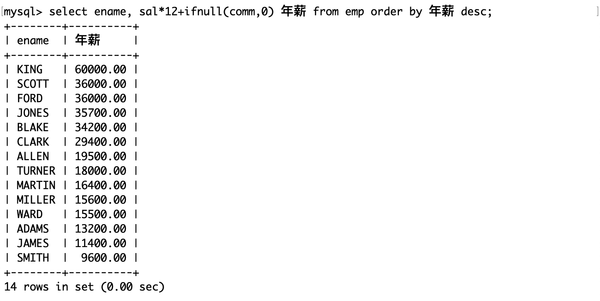
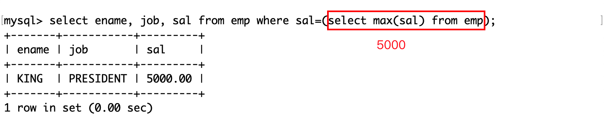
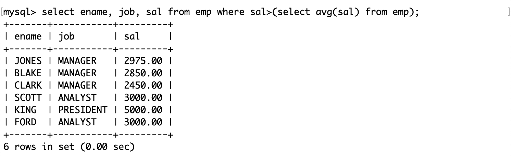
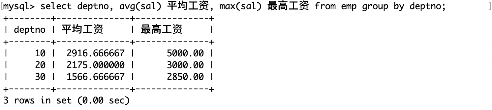
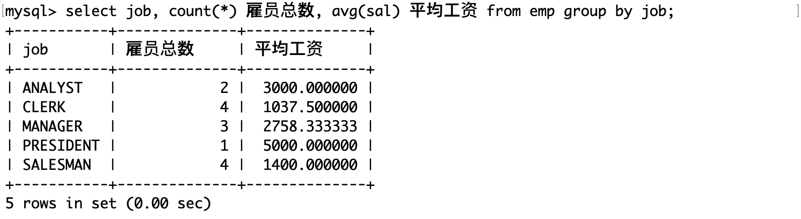
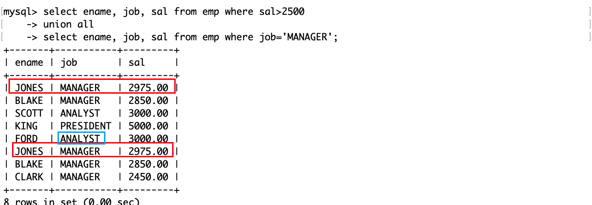

# 复合查询

## 测试表

雇员信息表中包含三张表，分别是员工表（emp）、部门表（dept）和工资等级表（salgrade）。

员工表（emp）：

- 雇员编号（empno）
- 雇员姓名（ename）
- 雇员职位（job）
- 雇员领导编号（mgr）
- 雇佣时间（hiredate）
- 工资月薪（sal）
- 奖金（comm）
- 部门编号（deptno）

部门表（dept）：

- 部门编号（deptno）
- 部门名称（dname）
- 部门所在地点（loc）

工资等级表（salgrade）：

- 等级（grade）
- 此等级最低工资（losal）
- 此等级最高工资（hisal）

雇员信息表的 SQL：

```MySQL
DROP database IF EXISTS `scott`;
CREATE database IF NOT EXISTS `scott` DEFAULT CHARACTER SET utf8 COLLATE utf8_general_ci;

USE `scott`;

DROP TABLE IF EXISTS `dept`;
CREATE TABLE `dept` (
  `deptno` int(2) unsigned zerofill NOT NULL COMMENT '部门编号',
  `dname` varchar(14) DEFAULT NULL COMMENT '部门名称',
  `loc` varchar(13) DEFAULT NULL COMMENT '部门所在地点'
);

DROP TABLE IF EXISTS `emp`;
CREATE TABLE `emp` (
  `empno` int(6) unsigned zerofill NOT NULL COMMENT '雇员编号',
  `ename` varchar(10) DEFAULT NULL COMMENT '雇员姓名',
  `job` varchar(9) DEFAULT NULL COMMENT '雇员职位',
  `mgr` int(4) unsigned zerofill DEFAULT NULL COMMENT '雇员领导编号',
  `hiredate` datetime DEFAULT NULL COMMENT '雇佣时间',
  `sal` decimal(7,2) DEFAULT NULL COMMENT '工资月薪',
  `comm` decimal(7,2) DEFAULT NULL COMMENT '奖金',
  `deptno` int(2) unsigned zerofill DEFAULT NULL COMMENT '部门编号'
);

DROP TABLE IF EXISTS `salgrade`;
CREATE TABLE `salgrade` (
  `grade` int(11) DEFAULT NULL COMMENT '等级',
  `losal` int(11) DEFAULT NULL COMMENT '此等级最低工资',
  `hisal` int(11) DEFAULT NULL COMMENT '此等级最高工资'
);

insert into dept (deptno, dname, loc)
values (10, 'ACCOUNTING', 'NEW YORK');
insert into dept (deptno, dname, loc)
values (20, 'RESEARCH', 'DALLAS');
insert into dept (deptno, dname, loc)
values (30, 'SALES', 'CHICAGO');
insert into dept (deptno, dname, loc)
values (40, 'OPERATIONS', 'BOSTON');

insert into emp (empno, ename, job, mgr, hiredate, sal, comm, deptno)
values (7369, 'SMITH', 'CLERK', 7902, '1980-12-17', 800, null, 20);

insert into emp (empno, ename, job, mgr, hiredate, sal, comm, deptno)
values (7499, 'ALLEN', 'SALESMAN', 7698, '1981-02-20', 1600, 300, 30);

insert into emp (empno, ename, job, mgr, hiredate, sal, comm, deptno)
values (7521, 'WARD', 'SALESMAN', 7698, '1981-02-22', 1250, 500, 30);

insert into emp (empno, ename, job, mgr, hiredate, sal, comm, deptno)
values (7566, 'JONES', 'MANAGER', 7839, '1981-04-02', 2975, null, 20);

insert into emp (empno, ename, job, mgr, hiredate, sal, comm, deptno)
values (7654, 'MARTIN', 'SALESMAN', 7698, '1981-09-28', 1250, 1400, 30);

insert into emp (empno, ename, job, mgr, hiredate, sal, comm, deptno)
values (7698, 'BLAKE', 'MANAGER', 7839, '1981-05-01', 2850, null, 30);

insert into emp (empno, ename, job, mgr, hiredate, sal, comm, deptno)
values (7782, 'CLARK', 'MANAGER', 7839, '1981-06-09', 2450, null, 10);

insert into emp (empno, ename, job, mgr, hiredate, sal, comm, deptno)
values (7788, 'SCOTT', 'ANALYST', 7566, '1987-04-19', 3000, null, 20);

insert into emp (empno, ename, job, mgr, hiredate, sal, comm, deptno)
values (7839, 'KING', 'PRESIDENT', null, '1981-11-17', 5000, null, 10);

insert into emp (empno, ename, job, mgr, hiredate, sal, comm, deptno)
values (7844, 'TURNER', 'SALESMAN', 7698,'1981-09-08', 1500, 0, 30);

insert into emp (empno, ename, job, mgr, hiredate, sal, comm, deptno)
values (7876, 'ADAMS', 'CLERK', 7788, '1987-05-23', 1100, null, 20);

insert into emp (empno, ename, job, mgr, hiredate, sal, comm, deptno)
values (7900, 'JAMES', 'CLERK', 7698, '1981-12-03', 950, null, 30);

insert into emp (empno, ename, job, mgr, hiredate, sal, comm, deptno)
values (7902, 'FORD', 'ANALYST', 7566, '1981-12-03', 3000, null, 20);

insert into emp (empno, ename, job, mgr, hiredate, sal, comm, deptno)
values (7934, 'MILLER', 'CLERK', 7782, '1982-01-23', 1300, null, 10);

insert into salgrade (grade, losal, hisal) values (1, 700, 1200);
insert into salgrade (grade, losal, hisal) values (2, 1201, 1400);
insert into salgrade (grade, losal, hisal) values (3, 1401, 2000);
insert into salgrade (grade, losal, hisal) values (4, 2001, 3000);
insert into salgrade (grade, losal, hisal) values (5, 3001, 9999);
```

这些 SQL 将保存在一个以`.sql`结尾的文件中，然后再 MySQL 中使用 source 命令执行它：


部门表的结构和内容：


员工表的结构和内容：



工资等级表的结构和内容：


# 单表查询

- 查询工资高于 500 或岗位为 MANAGER 的员工，同时要求员工姓名的首字母为大写的 J

1. 首先明确查询的目标是员工。
2. 其次明确条件有 3 个，通过题意使用 AND 或 OR 连接。
3. 这些属性都能在表`emp`中找到。



- 查询员工信息，按部门号升序而员工工资降序显示


- 查询员工信息，按年薪降序显示

注意年薪应该是 12 倍的月薪+奖金，而奖金可能为 NULL，为了避免年薪为 NULL，此时应该为 0



- 查询工资最高的员工的姓名和岗位



- 查询工资高于平均工资的员工信息



- 查询每个部门的平均工资和最高工资

group by 子句按照部门号来计算每一组的平均工资和最高工资。



- 查询平均工资低于 2000 的部门号和它的平均工资


HAVING 子句通常与 GROUP BY 子句一起使用。当它在 GROUP BY 子句中使用时，我们可以应用它在 GROUP BY 子句之后来指定过滤的条件。如果省略了 GROUP BY 子句，HAVING 子句行为就像 WHERE 子句一样。

请注意，HAVING 子句应用筛选条件每一个分组的行，而 WHERE 子句的过滤条件是过滤每个单独的行。

- 查询每种岗位的雇员总数和平均工资



# 多表查询

由于在查询时可能会用到不止一张表中的属性，所以要用到多表查询，其 SQL 的语法和单表查询是类似的。

需要注意的是，多表查询实际上是从若干表的笛卡尔积中操作的。多表的笛卡尔积指的是用其中一张表的一条记录去和剩余的整张表组合，以此类推。因此笛卡尔积保存了这些表记录的所有可能的集合，但是集合中的组合并不全是有意义的，而且不同表中也可能有相同的列属性（例如雇员表和工资表都有部门号），所以在合并多表时，需要要筛选符合逻辑的组合，并且合并相同的列属性。

例如这个查询返回了一个原始的笛卡尔积集合。


通过这个结果可以知道 MySQL 是不断地用前一张表的一条记录来和另外一个表组合来求笛卡尔积的：前半部分是雇员表，后半部分是部门表。在这一行中有两个部门号，部门号不同的记录都是没有意义的。

在用 SQL 操作不同表的相同列属性时，可以用`表名。列名`来表示。

- 显示部门号为 10 的部门名、员工名和员工工资

后面的 where 子句就是在上面这个原始的笛卡尔积中筛选符合题意的记录。


- 显示各个员工的姓名、工资和工资级别


员工的工资决定了工资等级，因此只有这两个属性对应才能是有意义的记录。

# 子查询

## 单行子查询

返回单行单列数据的子查询。

- 显示 SMITH 同一部门的员工

1. 子查询：首先查询 SMITH 的部门号 x 作为查询的依据
2. 然后选出部门号为 x 且不是 SMITH 的员工


## 多行子查询

返回多行单列数据的子查询。

### IN 关键字

- 显示和 10 号部门的工作岗位相同的员工的名字、岗位、工资和部门号，但是不包含 10 号部门的员工

1. 子查询：首先查询 10 号部门有哪些工作岗位，查询时去重，将结果作为查询的依据
2. 通过在查询的 where 子句中使用 IN 关键字，判断工作岗位是否在子查询的返回值中


### ALL 关键字

- 显示工资比 30 号部门的所有员工的工资高的员工的姓名、工资和部门号

1. 子查询：首先查询 30 号部门有哪些工资，查询时去重，将结果作为查询的依据
2. 通过在查询的 where 子句使用 ALL 关键字，判断工资是否**都**大于子查询的返回值。


这是一个常见的逻辑问题，要判断某个值是否大于集合中的所有元素，只需要判断这个值是否大于集合中的最大值。这和上面是等价的。

### ANY 关键字

- 显示工资比 30 号部门的任意员工的工资高的员工的姓名、工资和部门号，包含 30 号部门的员工

1. 子查询：首先查询 30 号部门有哪些工资，查询时去重，将结果作为查询的依据
2. 通过在查询的 where 子句使用 ANY 关键字，判断工资是否**都**大于子查询的返回值。


同样地，这也可以等价地转换为求最小值的问题。

## 多列子查询

返回多列数据的子查询。

- 显示和 SMITH 的部门和岗位完全相同的员工，不包含 SMITH 本人

1. 子查询：首先查询 SMITH 的部门号和岗位，将结果作为查询的依据
2. 在子查询的返回值中筛选名字不是 SMITH 的记录


注意：

- 多列子查询得到的结果是多列数据，在比较多列数据时需要将待比较的多个列用圆括号括起来，并且列属性的位置要对应。
- 多列子查询返回的如果是多行数据，在筛选数据时也可以使用 IN、ALL 和 ANY 关键字。

子查询相当于一个新表，如上演示，它不仅可以被用在 where 子句中（筛选条件），还可以被用在 from 子句中（临时表）。

- 显示每个高于自己部门平均工资的员工的姓名、部门、工资和部门的平均工资

1. 计算每个部门的平均工资，作为一张表
2. 将平均工资表和雇员表做笛卡尔积，选出部门号和平均工资表相同的记录，并且要求工资大于平均工资。


其中子查询的别名是 avg_sal。

- 显示每个部门工资最高的员工的姓名、工资、部门和部门的最高工资

1. 查询每个部门的最高工资作为子查询
2. 将最高工资表和雇员表做笛卡尔积，要求两表中的部门号相同，且员工工资在最高工资中可被查询到。


- 显示每个部门的部门名、部门编号、所在地址和人员数量

1. 查询每个部门的人员数量作为子查询
2. 将人员数量表和雇员表做笛卡尔积，要求两表的部门编号一致


# 合并查询

将多个查询结果进行合并，可使用的操作符有：

- UNION：取得两个查询结果的并集，union 会自动去掉结果集中的重复行。

- UNION ALL：取得两个查询结果的并集，但 union all 不会去掉结果集中的重复行。

- 显示工资大于 2500 或职位是 MANAGER 的员工

如果用 or 连接两个筛选条件：


如果分别对两个条件做两次查询，并且用 UNION 对两个查询结果做合并：


如果分别对两个条件做两次查询，并且用 UNION ALL 对两个查询结果做合并：



由此可见，UNION ALL 只是单纯地对两张表进行合并，并不会做去重工作。

需要注意的是：

- 待合并的两个查询结果的列的数量必须一致，否则无法合并。
- 待合并的两个查询结果对应的列属性可以不一样，但不建议这样做。

这两个操作符存在的意义是，有时需要查询的属性可能来自不同的表，但是不同的表之间没有很强的关联性，所以需要硬凑，不过硬凑也需要符合逻辑。如果这些表没有共同的列属性的话，那么合并就没有意义了。