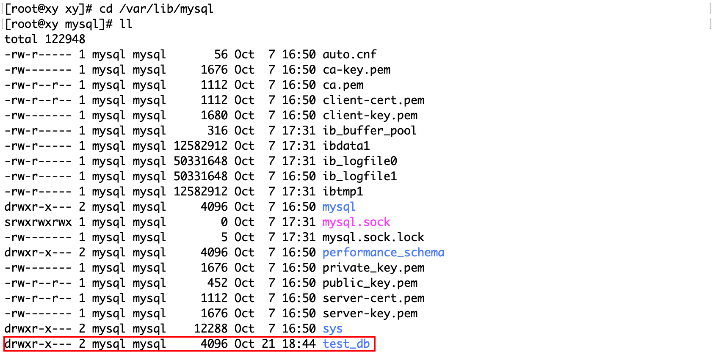
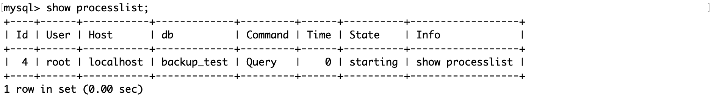

# 安装 MySQL

这是在 Linux 中安装 MySQL 的教程：[Linux 下 MySQL 安装](https://blog.csdn.net/lirendada/article/details/131513739?ops_request_misc=&request_id=&biz_id=102&utm_term=MySQL%E5%AE%89%E8%A3%85&utm_medium=distribute.pc_search_result.none-task-blog-2~all~sobaiduweb~default-1-131513739.142^v96^pc_search_result_base5&spm=1018.2226.3001.4187)。本系列测试用的 MySQL 版本是 5.7，机器是 centOS7.6。

实际应用中，一般 MySQL 服务都是部署在 Linux 主机上的，如果想在 Windows 系统中安装，可以参考：[Windows 下 MySQL 安装](https://blog.csdn.net/m0_63112274/article/details/130517120?ops_request_misc=%257B%2522request%255Fid%2522%253A%2522169788855716800213052480%2522%252C%2522scm%2522%253A%252220140713.130102334..%2522%257D&request_id=169788855716800213052480&biz_id=0&utm_medium=distribute.pc_search_result.none-task-blog-2~all~top_click~default-11-130517120-null-null.142^v96^pc_search_result_base5&utm_term=MySQL%E5%AE%89%E8%A3%85&spm=1018.2226.3001.4187)。

# 修改密码

MySQL 在安装时会为用户设置一个默认的随机密码，可以通过：
```bash
cat /var/log/mysqld.log | grep 'temporary password'
```

来查看密码：

```text
2023-10-20T08:04:42.247710Z 1 [Note] A temporary password is generated for root@localhost: crOcKwwB;7Wd
```

其中，`crOcKwwB;7Wd`就是密码，使用它来登录：
```bash
mysql -uroot -p # 以 root 身份登录
```

修改 root 用户的密码有多个方法，在此介绍其中一种，在命令行中使用：

```bash
[root@xy xy]# mysqladmin -uroot -p'旧密码' password '新密码'
```

[注] 如果出现以下提示，则说明密码过于简单：

```text
mysqladmin: unable to change password; error: 'Your password does not satisfy the current policy requirements'
```

# 连接和退出数据库服务器

```bash
mysql -uroot -p # 以 root 身份登录
```

- h： 表示你要连接的 MySQL 服务器所在的主机，127.0.0.1 表示本主机。如果连接的是本地数据库服务器，它可以省略。

- P： 表示你要连接的 MySQL 服务器所对应的端口号，一般默认是 3306。
- u： 表示用哪一个用户连接 MySQL 服务器，root 表示超级用户。
- p： 表示该用户对应的密码，密码可以直接跟在-p 后面，也可以回车后输入。

为了方便学习，都以 root 用户登录数据库服务器。

在 MySQL 服务器的命令行中键入`quit`/`exit`/`\q`回车以退出。

# 使用 systemctl 管理服务器进程

systemctl 是一个用于控制和检查 systemd 系统和服务管理器的工具，它负责在 Linux 内核启动后运行和维护用户空间的组件。systemctl 可以用来启动、停止、重启、重载、启用、禁用等各种操作 systemd 的服务单元，也可以用来查看系统的状态、日志、性能等信息。

终止服务器进程：

```bash
systemctl stop mysqld
```

启动服务器进程：

```bash
systemctl start mysqld
```

重启服务器进程：

```bash
systemctl restart mysqld
```

`mysqld`可以是你想要操作的进程名称。

# 配置数据库

MySQL 的配置文件在这个路径：

```bash
cat /etc/my.cnf
```

```text
# For advice on how to change settings please see
# http://dev.mysql.com/doc/refman/5.7/en/server-configuration-defaults.html

[mysqld]
#
# Remove leading # and set to the amount of RAM for the most important data
# cache in MySQL. Start at 70% of total RAM for dedicated server, else 10%.
# innodb_buffer_pool_size = 128M
#
# Remove leading # to turn on a very important data integrity option: logging
# changes to the binary log between backups.
# log_bin
#
# Remove leading # to set options mainly useful for reporting servers.
# The server defaults are faster for transactions and fast SELECTs.
# Adjust sizes as needed, experiment to find the optimal values.
# join_buffer_size = 128M
# sort_buffer_size = 2M
# read_rnd_buffer_size = 2M
datadir=/var/lib/mysql
socket=/var/lib/mysql/mysql.sock

# Disabling symbolic-links is recommended to prevent assorted security risks
symbolic-links=0

log-error=/var/log/mysqld.log
pid-file=/var/run/mysqld/mysqld.pid

port=3306
character-set-server=utf8
default-storage-engine=innodb
```

其中各个选项的含义是：

- innodb_buffer_pool_size = 128M 设置了 InnoDB 存储引擎的缓冲池大小，这是 MySQL 中最重要的数据缓存，用来缓存表数据和索引。一般建议设置为服务器总内存的 70%（如果是专用服务器）或者 10%（如果是共享服务器）。这个选项可以提高查询性能和减少磁盘 I/O。
- log_bin 开启了二进制日志功能，这是 MySQL 中非常重要的数据完整性选项，它会记录所有对数据库的修改操作，可以用来做数据恢复和主从复制。如果不指定日志文件名，就会使用默认的 mysql-bin 前缀。
- join_buffer_size = 128M 设置了连接查询时使用的缓冲区大小，这个选项主要用于报表服务器，可以提高连接查询的性能。
- sort_buffer_size = 2M 设置了排序查询时使用的缓冲区大小，这个选项也主要用于报表服务器，可以提高排序查询的性能。
- read_rnd_buffer_size = 2M 设置了随机读取时使用的缓冲区大小，这个选项在按照非索引字段排序或分组时会用到，可以提高随机读取的性能。
- datadir=/var/lib/mysql 设置了 MySQL 数据文件所在的目录，这里是 /var/lib/mysql ，也就是说所有的数据库和表文件都存储在这个目录下。
- socket=/var/lib/mysql/mysql.sock 设置了 MySQL 客户端程序和服务器之间的本地通信指定一个套接字文件，这里是 /var/lib/mysql/mysql.sock ，也就是说客户端程序要连接到这个套接字文件才能和服务器通信。
- symbolic-links=0 禁用了符号链接功能，这是为了防止一些安全风险，比如通过符号链接访问或修改其他数据库或文件系统中的文件。
- log-error=/var/log/mysqld.log 设置了 MySQL 错误日志文件的位置，这里是 /var/log/mysqld.log ，也就是说所有的错误信息都会记录在这个文件中。
- pid-file=/var/run/mysqld/mysqld.pid 设置了 MySQL 服务器进程的标识文件的位置，这里是 /var/run/mysqld/mysqld.pid ，也就是说这个文件中存储了 MySQL 服务器进程的 ID 号。
- port=3306 设置了 MySQL 服务器监听的端口号，默认是 3306 ，也就是说客户端程序要连接到这个端口才能和服务器通信。测试学习时可以不用改，或者使用完毕后关闭 MySQL 服务器。实际使用时一般要做修改，因为服务器一般是暴露在公网上的。
- *character-set-server=utf8 设置了 MySQL 服务器默认使用的字符集，这里是 utf8 ，也就是说所有的数据库和表都会使用 utf8 编码存储数据，除非另外指定。
- *default-storage-engine=innodb 设置了 MySQL 创建数据表时默认使用的存储引擎，这里是 innodb ，也就是说所有的表都会使用 innodb 存储引擎存储数据和索引，除非另外指定。

其中打`*`号的是自定义的选项，可能数据库默认的选项就是它们，但为了保险，仍然显式地在配置文件中设定。datadir 的路径可以自定义，但这里使用默认的路径。当配置完毕后，要使配置文件生效，（重启 mysqld 后）重新连接 MySQL 服务。

在这里简单介绍一下索引：如果说数据库是一本字典，那么索引就是字典的目录。有了目录才能提高查找的效率，但目录本身也是占用数据库的空间的，所以这是空间换时间的做法。

# 从文件角度看待数据库

在`/var/lib/mysql`路径下， 存放的是 MySQL 的所有数据库和表文件。例如创建了一个数据库`test_db`：

```my
mysql> create database test_db
```

在这个目录下会增加一个同名目录：



这个目录下有一个`db.log`文件，它记录这个数据库的默认字符集和字符校验规则：


如果在这个数据库中创建一个表：
```mysql
mysql> use test_db; # 进入数据库

mysql> create table test_table( # 创建表
    -> col int(2)
    -> );
```

在上面这个目录下会增加两个同名的文件：


.frm 和 .ibd 是两种不同类型的文件：

- .frm 文件：这是表定义文件，用于描述表结构。每当在 MySQL 中创建一个新的数据表时，都会在相应的数据库目录下生成一个与表名相同的 .frm 文件。这个文件包含了数据表的元数据信息，如字段名称、数据类型等。
- .ibd 文件：这是表数据和索引文件。当你使用 InnoDB 存储引擎（MySQL 的默认存储引擎）创建一张表时，会在相应的数据库目录下生成一个与表名相同的 .ibd 文件。这个文件包含了数据表的实际数据以及索引信息。

需要注意的是，这两种文件都不能直接打开查看，而是由 MySQL 组织搭配的文件。如果需要查看或修改表结构，可以使用 SQL 语句；如果需要查看或修改表数据，可以使用 SQL 查询和更新语句。

而 MyISAM 存储引擎创建表时，会创建三个文件。

> 以上这些内容对于初学者而言可以不细究，只要知道我们在操作数据库或表的本质是对文件操作，只不过是间接地通过数据库软件支持的 SQL 语句操作，而不直接操作文件。
>
> 上面这些操作数据库和表的 SQL 语句将会在后续学习，此处只是站在文件的角度理解。

上面的操作是用户使用 SQL 语句，让 MySQL 创建数据库和表，假如用户直接操作这些底层文件会发生什么呢？下面直接将刚才创建的数据库`test_db`这个目录下的所有文件删除：

```bash
rm -rf test_db/
```

在 MySQL 客户端中查看数据库：

```mysql
######## 删除前 ########
mysql> show databases;
+--------------------+
| Database           |
+--------------------+
| information_schema |
| mysql              |
| performance_schema |
| sys                |
| test_db            |
+--------------------+
5 rows in set (0.00 sec)
######## 删除后 ########
mysql> show databases;
+--------------------+
| Database           |
+--------------------+
| information_schema |
| mysql              |
| performance_schema |
| sys                |
+--------------------+
4 rows in set (0.00 sec)
```

从效果上说，直接操作文件和执行 SQL 语句是一样的，但是这样做不能保证数据的安全性。例如多个客户端并发访问同一个数据库的同一张表这种情况，数据库需要限制不同客户端的行为，以保证数据的一致性等。MySQL 会记录用户的所有操作（除了修改密码这类私密的语句），并会进行一定的语法优化，将它们合并到一起。

数据库备份或移植，本质就是将这些文件拷贝，放在其他目录下。虽然这么做不会怎样，但是这是一种越级的操作。MySQL 在操作文件时，也是使用诸如`rm`、`cp`、`mkdir`这些操作的。

[注](了解)

MySQL 默认有四个数据库，每个数据库都有其特定的用途：

1. information_schema：这个数据库提供了访问数据库元数据的方式。元数据是关于数据的数据，如数据库名或表名，列的数据类型，或访问权限等。换句话说，information_schema 是一个信息数据库，它保存着关于 MySQL 服务器所维护的所有其他数据库的信息。
2. mysql：这是 MySQL 的核心数据库，类似于 SQL Server 中的 master 表。它主要负责存储数据库的用户、权限设置、关键字等 MySQL 自己需要使用的控制和管理信息。
3. performance_schema：这个数据库主要用于收集数据库服务器性能参数。它提供了进程等待的详细信息，包括锁、互斥变量、文件信息等，并保存了历史的事件汇总信息，为提供 MySQL 服务器性能做出详细的判断。
4. sys：这个库所有的数据源来自 performance_schema。它的目标是降低 performance_schema 的复杂度，让 DBA 能更好地阅读这个库里的内容，从而让 DBA 更快地了解 DB 的运行情况。

# 查看连接情况

show processlist 命令可以显示当前连接到 MySQL 服务器的线程的信息，可以使用这个命令来监控服务器的性能，排查问题，或者终止某些线程。



其中：

- Id：一个标识，可以在 MySQL 中通过 kill id 杀死指定 id 的线程。
- User：显示当前用户，如果不是 root，这个命令就只显示你权限范围内的 SQL 语句。
- Host：显示这个语句是从哪个 IP 的哪个端口上发出的，可用来追踪出问题语句的用户。
- db：当前执行的命令是在哪一个数据库上，如果没有指定数据库，则该值为 NULL。
- Command：显示当前连接执行的命令，一般就是休眠（Sleep）、查询（Query）和连接（Connect）。
- Time：表示该线程处于当前状态的时间，单位是秒。
- State：显示使用当前连接的 SQL 语句的状态。
- Info：一般记录的是线程执行的语句，默认只显示前 100 个字符，如果要看全部信息，需要使用 show full processlist。

这个命令通常用于监控服务器的性能，排查问题或终止某些线程，也可以帮助分析 SQL 语句的执行时间，锁等待和事务隔离级别等。
