# 什么是索引

索引是一种数据结构，用于快速查找和访问数据库表中的数据。索引的主要目的是提高查询效率，减少数据库的搜索时间。可以把它想象成一本书的目录：不需要逐页浏览整本书来找到特定的内容，而是直接查看目录，快速定位到所需的部分。

> 数据库按记录为单位存储数据，如果不使用索引而采取遍历查询数据，其时间复杂度是$O(N)$。

总结：**索引是数据的目录**。在 MySQL 中，索引也叫做 Key。

索引的效率取决于索引列的值是否散列，即该列的值如果越互不相同，那么索引效率越高。反之，如果记录的列存在大量相同的值，例如性别只记录了男或者女，那么它们大概各占一半，因此对该列创建索引无意义，它不是散列的。

可以对一张表创建多个索引。索引的优点是提高了查询效率，**缺点是在插入、更新和删除记录时，需要同时修改索引，因此，索引越多，插入、更新和删除记录的速度就越慢**。索引虽然不够完美，但是它足够物美价廉，而且贴合数据库的使用场景：提高检索海量数据的速度。

> 磁盘和内存的 I/O 次数越少，效率越高。

对于主键，关系数据库会自动对其创建主键索引。使用主键索引的效率是最高的，因为主键会保证绝对唯一。

## 测试表

首先用一个测试表来看看索引的威力。

```SQL
drop database if exists `index_demon`;
create database if not exists `index_demon` default character set utf8;
use `index_demon`;

-- 构建一个 8000000 条记录的数据
-- 构建的海量表数据需要有差异性，所以使用存储过程来创建

-- 产生随机字符串
delimiter $$
create function rand_string(n INT)
returns varchar(255)
begin
declare chars_str varchar(100) default
'abcdefghijklmnopqrstuvwxyzABCDEFJHIJKLMNOPQRSTUVWXYZ';
declare return_str varchar(255) default '';
declare i int default 0;
while i < n do
set return_str =concat(return_str,substring(chars_str,floor(1+rand()*52),1));
set i = i + 1;
end while;
return return_str;
end $$
delimiter ;

-- 产生随机数字
delimiter $$
create function rand_num( )
returns int(5)
begin
declare i int default 0;
set i = floor(10+rand()*500);
return i;
end $$
delimiter ;

-- 创建存储过程，向雇员表添加海量数据
delimiter $$
create procedure insert_emp(in start int(10),in max_num int(10))
begin
declare i int default 0;
set autocommit = 0;
repeat
set i = i + 1;
insert into EMP values ((start+i)
,rand_string(6),'SALESMAN',0001,curdate(),2000,400,rand_num());
until i = max_num
end repeat;
commit;
end $$
delimiter ;

-- 雇员表
CREATE TABLE `EMP` (
  `empno` int(6) unsigned zerofill NOT NULL COMMENT '雇员编号',
  `ename` varchar(10) DEFAULT NULL COMMENT '雇员姓名',
  `job` varchar(9) DEFAULT NULL COMMENT '雇员职位',
  `mgr` int(4) unsigned zerofill DEFAULT NULL COMMENT '雇员领导编号',
  `hiredate` datetime DEFAULT NULL COMMENT '雇佣时间',
  `sal` decimal(7,2) DEFAULT NULL COMMENT '工资月薪',
  `comm` decimal(7,2) DEFAULT NULL COMMENT '奖金',
  `deptno` int(2) unsigned zerofill DEFAULT NULL COMMENT '部门编号'
);

-- 执行存储过程，添加 8000000 条记录
call insert_emp(100001, 8000000);
```

> 使用方法：
>
> 1. 退出 MySQL，将以上 SQL 保存在一个文件中，例如`index_data.sql`
> 2. 然后进入 MySQL server，使用命令`source index_data.sql`执行它。

由于它创建了 8000000 万条记录到数据库中，因此需要耗费一定时间（光标闪烁）：

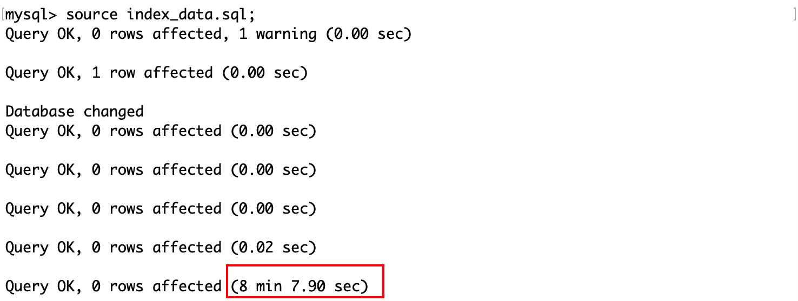

进入数据库中：

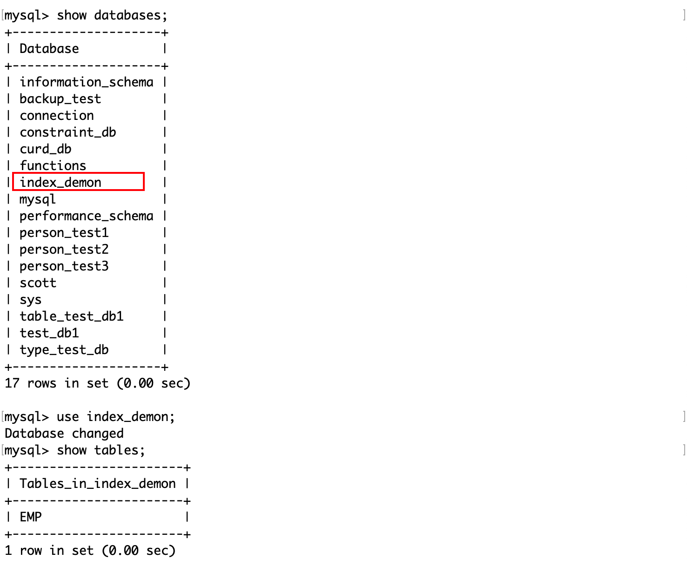

表的内容和结构如下：

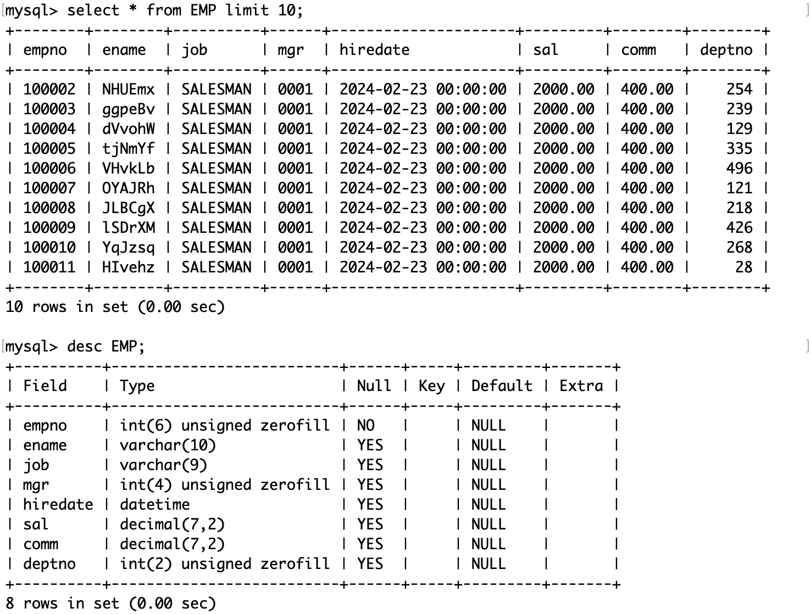

表结构中表明它没有建立索引。

先尝试查询几条记录：
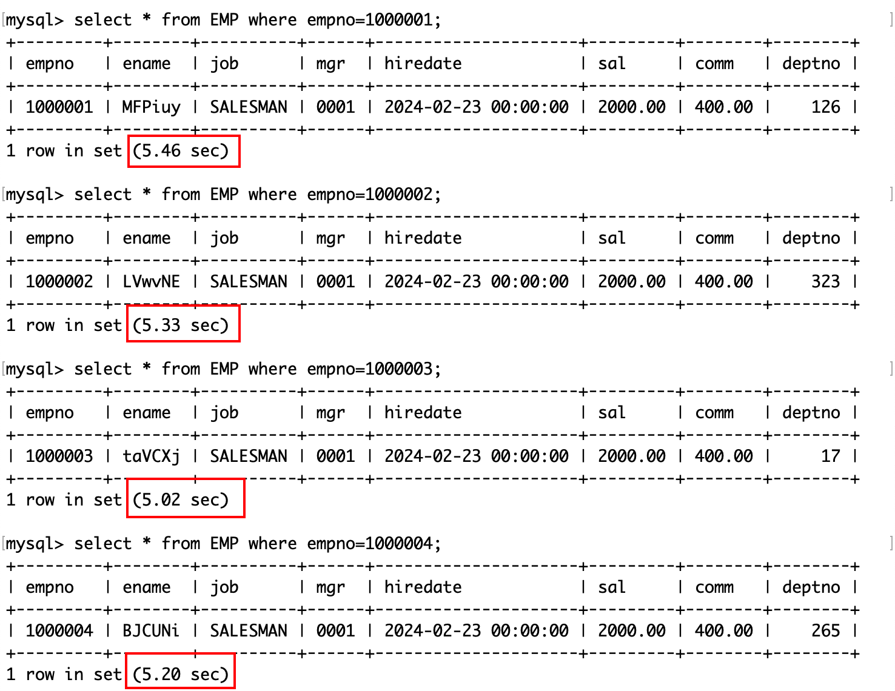

为员工编号建立索引后查询相同的记录：

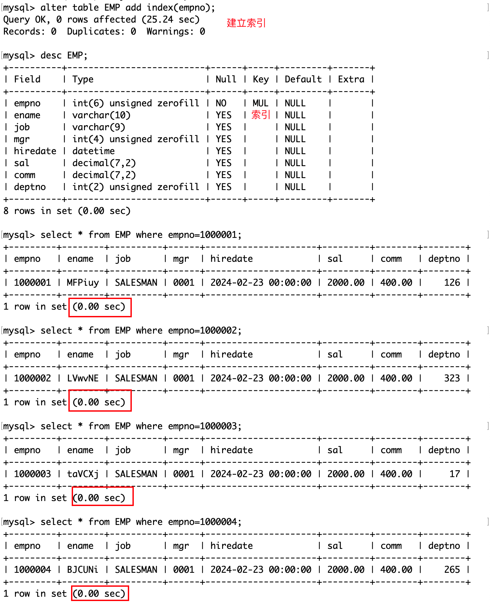

结果显而易见。关于索引，这里只是简单地展示了它在使用时的性能，更多篇幅将会讨论它的实现原理，以更好地理解并使用索引。

# 磁盘和 MySQL 的交互

## 了解磁盘

磁盘在操作系统这门课中已经了解过，在此仅讨论和数据库索引有关的部分。以下内容部分引用自：[数据库中的 B 树与 B+ 树](https://yey.world/2021/01/02/LearnedIndex-03/)

+</sup> 树- YEY 的博客| YEY Blog" />

我们来看一下 **磁盘 (disk)** 的结构：一个典型的磁盘驱动器由一个或多个 **盘片 (platter)** 组成，它们以一个固定的速度围绕一个共同的 **主轴 (spindle)** 旋转。每个盘片表面覆盖着一层可磁化的物质。驱动器通过 **磁臂 (arm)** 末尾的 **磁头 (head)** 来读/写盘片。

盘片在 **逻辑上 （而非物理上）** 被划分为一系列的同心环状区域，数据就存储在这样的同心圆环上面，这些同心圆环被称为 **磁道 (track)**。每个盘面可以划分多个磁道，最外圈的磁道是 0 号磁道，向圆心增长依次为 1 号磁道、2 号磁道……磁盘的数据存放就是从最外圈开始的。

根据硬盘的规格不同，磁道数可以从几百到成千上万不等。每个磁道可以存储几个 Kb 的数据，但是计算机不必要每次都读写这么多数据。因此，再把每个磁道划分为若干个弧段，每个弧段就是一个 **扇区 (sector)**。

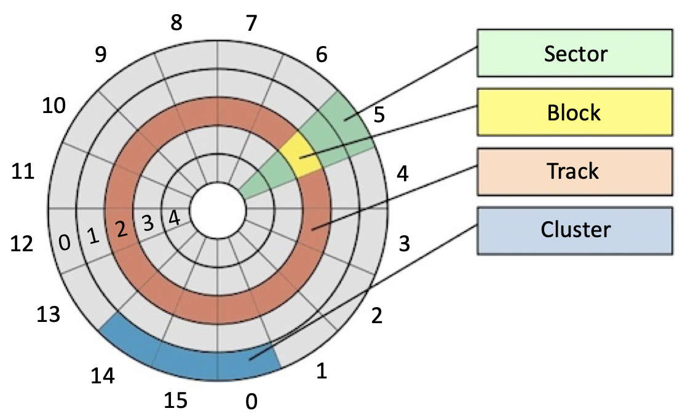

一个盘片被划分为许多磁道和扇区，一个磁道和一个扇区相交的区域称为一个 **块 (block)**。因此，磁盘上的任意一个块都可以通过其对应的磁道编号和扇区编号来寻址，也就是说，磁盘上的块地址格式由磁道编号和扇区编号组成：
$$
块地址 = （磁道编号，扇区编号）
$$
块是硬盘上存储的物理单位。出于稳定性考虑，通常一个块存储 512 字节的数据，但是实际上其容量可以是任意大小，具体取决于磁盘制造商和磁盘型号。

这里，我们假设每个块的容量为 512 字节。当我们从磁盘上读取或写入数据时，我们总是以块为单位进行读/写。如果现在我们读取一个 512 字节的块，假设其中第一个字节的地址为 0，最后一个字节的地址为 511，那么其中每个字节都有其各自的地址，我们称之为 **偏移量 (offset)**。

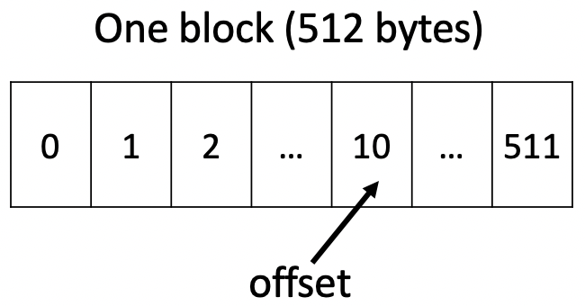

假设磁盘上的每个块的第一个和最后一个字节的偏移量都分别为 0 和 511。因此，我们只需要知道 **磁道编号**、**扇区编号** 和 **偏移量** 这三个信息就可以定位到磁盘上的任意一个字节：首先，利用磁道编号和扇区编号定位到该字节所在的块；然后，在块内通过偏移量定位到该字节。

正常情况下，我们可以通过盘片的旋转来选择扇区，通过磁头的轴向移动来选择磁道，也就是说，我们可以通过旋转盘片和移动磁头来定位到某个块，而数据总是以块的形式存储在磁盘上的。

我们知道，数据处理无法直接在磁盘上进行，数据需要被读入内存中处理后再写回磁盘，才能被程序读取。

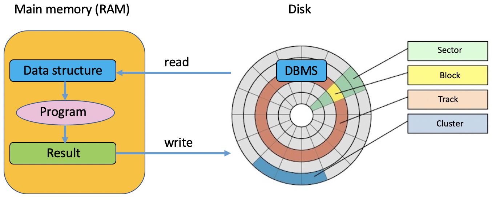

内存中的数据可以被程序直接访问，我们将其称为 **数据结构 (data structure)**。而在磁盘上高效组织数据使得其能够以一种简单方式被利用的系统被称为 **数据库管理系统 (DBMS)**。因此要查找某个数据，本质就是在磁盘上找到这个数据存在的扇区。

## MySQL 的工作原理

MySQL 服务器（mysqld）在操作系统中是一个进程，在网络中是一个服务器，所以 MySQL 是运行在内存中的，因此对数据的所有操作包括索引都要在内存中进行。

MySQL 与磁盘交互的基本单位是“页”（Page）。在 MySQL 中，尤其是在 InnoDB 存储引擎中，数据以页为单位进行读写。和操作系统的“页”类似，这种设计有几个原因：

- 提高 I/O 效率
- 减少数据碎片，提高磁盘利用率
- 并发控制和恢复
- 缓存管理

> 无特殊说明，下文都是在存储引擎为 InnoDB 的基础上讨论的。

通常情况下，MySQL 和磁盘交互的基本单位指的是 InnoDB 的默认页大小，是 16KB。

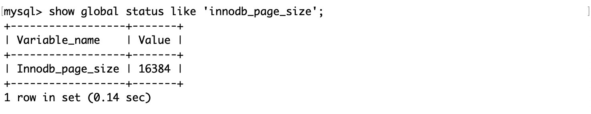

> 为什么是 16KB 而不是和操作系统一样是 4KB？

16KB 的默认页大小是 InnoDB 存储引擎根据多年的经验和性能测试选择的，旨在为广泛的应用场景提供最佳的性能平衡。然而，根据特定的工作负载和硬件配置，MySQL 提供了一定程度的灵活性，允许数据库管理员根据需要调整页大小。

1. **性能优化**：
   - **减少磁盘 I/O**：较大的页大小意味着单次磁盘 I/O 操作可以读写更多的数据。这在处理大量数据时尤其有效，因为它可以减少需要进行的总 I/O 操作次数，从而提高查询和数据加载的速度。
   - **提高缓存效率**：更大的页可以优化缓存利用率，因为它允许更多的数据被缓存在同一内存区域。这有助于减少对磁盘的访问需求，尤其是在处理关联查询和范围查询时。
2. 数据存储效率：
   - 在数据库中，大量的小型 I/O 操作比少量的大型 I/O 操作更低效。较大的页大小有助于在数据库和磁盘之间传输更多的数据，尤其是当数据频繁被连续访问时。
   - 较大的页还可以更有效地处理大型数据对象和 BLOB（二进制大对象），这些在 4KB 的页面上可能会产生更多的管理开销和碎片。
3. 系统兼容性：
   - 尽管操作系统页通常为 4KB，但数据库系统通过自己的内部页管理和缓冲策略来优化性能。数据库设计者会根据数据访问模式和典型工作负载来选择最佳的页大小，以平衡 CPU 缓存利用、内存管理和磁盘 I/O 效率。
   - 数据库系统通常需要处理的是大量的、复杂的查询和数据处理操作，这与操作系统处理的广泛类型的任务有所不同。因此，数据库可以通过使用与操作系统不同的页大小来优化这些特定的工作负载。
4. 历史和兼容性考虑：
   - InnoDB 的设计和优化是基于典型的服务器硬件和应用程序的性能特性进行的。16KB 页大小是一个折中的结果，它在许多情况下都能提供良好的性能表现，尽管对于特定应用来说，可能需要调整这个大小以获得最佳性能。

简单地说，操作系统和数据库都为了 I/O 的效率设置了一个交互的基本单位：页（page），这是一个经验值。而 MySQL 作为数据库，它的 I/O 事件比操作系统更频繁，所以单位要更大一些。

> 注意，I/O 次数相比于单次 I/O 数据大小对 I/O 效率的影响大得多。

## Buffer Pool

从冯诺依曼体系架构来看，MySQL 就是一个应用层的协议，它的作用类似一个文件系统，运行在操作系统之上，管理着磁盘中的数据。数据要被 CPU 处理，就必须加载到 mysqld 申请的内存中，然后通过系统调用写回磁盘。要管理这些数据，本质上是管理这些文件。和操作系统的思想类似，**先描述**，**再组织**。

为了减少内存和磁盘的 I/O 次数，mysqld 会为此向系统申请一块内存空间作为缓存，即 Buffer Pool。在数据发生改动后，MySQL 不会立即将它回写到磁盘中，而是存放在 Buffer Pool 中，当缓冲区有了一定数量的待写入数据后才会刷新。然而，内核也是有缓冲区的，因此 MySQL 中的待写入数据将会经过两个缓冲区的拷贝才会由内核写入磁盘。

谈到内存，往往避免不了要谈局部性原理。MySQL 和磁盘 I/O（跳过了磁盘和操作系统）的基本单位是一个 Page，这么做的目的是减少 I/O 次数，从而提高 I/O 效率。原因是下一次要访问的数据很可能也在这个 Page 中。

MySQL 作为运行在 OS 之上的应用软件，它只和文件交互，而不直接和数据交互（数据保存在文件中）。也就是说，为了减少和磁盘的交互次数，MySQL 尽量将所有操作都在它申请的内存中进行。

Buffer Pool 是 InnoDB 存储引擎的一个关键组件，用于提高数据库操作的性能。下面是 Buffer Pool 的作用：

1. 缓存数据页：Buffer Pool 缓存来自 InnoDB 表的数据页。当查询数据时，MySQL 首先查看数据是否在 Buffer Pool 中。如果是，直接从内存读取，速度快。如果不是，从磁盘读取并存入 Buffer Pool，未来访问会更快。
2. 缓存索引页：除了数据，索引页也被缓存。这意味着数据查找和索引扫描也能从快速的内存操作中受益。
3. 写回机制：Buffer Pool 还管理数据的写回磁盘。它不是立即写回，而是采用一定策略，比如脏页（修改过的页）的定期写回，以此减少 I/O 操作。
4. 配置和管理：Buffer Pool 的大小是可配置的，根据系统的内存大小和数据库负载进行调整可以最大化其效能。
5. LRU 算法：为了管理内存，Buffer Pool 使用最近最少使用（LRU）算法来决定哪些页被保留，哪些被淘汰。

# 理解索引

## 引入

首先用一个以 ID 作为主键的信息表作为测试表。

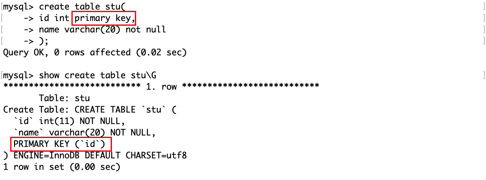

然后以 ID 乱序插入若干记录。

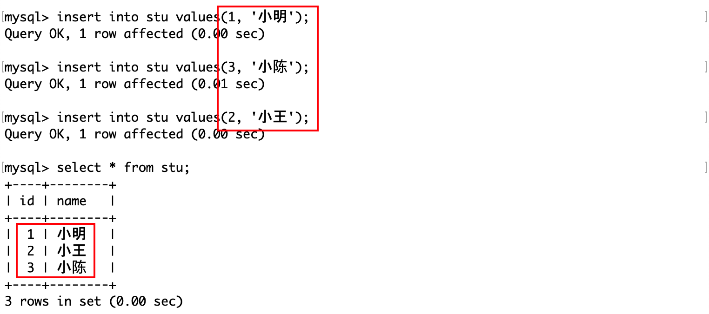

可以看到即使插入的主键是乱序的，MySQL 会按照主键对插入的记录进行排序。

> 为什么要这么做？

类似书本中的目录，一个 Page 相当于一个章节，章节内部的每一页都有编号，这样方便查找。Page 本身对于整个文件而言也相当于目录。Page 和 Page 中的记录都以链表的形式被组织起来。

## Page 的结构

一个 Page 的结构主要包括几个关键部分（了解即可）：

1. **文件头部（File Header）**：包含了该页的一些元信息，如页类型（比如是否为叶子节点）、==上一个和下一个页的指针==等。
2. **页头部（Page Header）**：包含页的特定信息，如记录数量、最后一个记录的位置等。
3. **Infimum 和 Supremum 记录**：这是两个虚拟的记录，分别表示页中最小和最大的记录。它们用于辅助记录的插入操作。
4. **用户记录（User Records）**：实际存储的==数据记录==，可以是表中的行数据或者是索引条目。
5. **空闲空间（Free Space）**：页中未被使用的部分，可以用来存储将来插入的记录。
6. **页目录（Page Directory）**：页中记录的索引，用于快速定位记录。它通过记录的相对位置（slot）来组织记录，有助于加速页内搜索。
7. **文件尾部（File Trailer）**：包含页的校验和信息，用于检查页数据在磁盘上的完整性。


图片来自：https://blog.j 列 e.us/2013/01/07/the-physical-structure-of-innodb-index-pages/

InnoDB 通过这样的页结构，实现了其高效的数据存储和访问机制。每个页都通过 B+树结构组织在一起，无论是数据页（B+树的叶子层）还是索引页（B+树的非叶子层），都遵循这种结构。这使得 InnoDB 能够高效地进行数据的读取、插入、更新和删除操作。

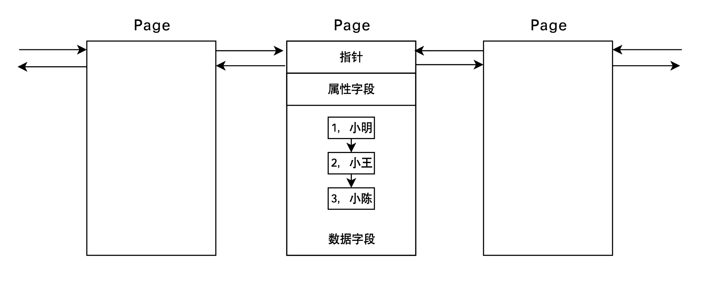

> 其中 User Records 存储的是数据，图示将它作为“数据字段”，其他部分作为“属性字段”。B+树将会在后续介绍。

值得注意的是，在 MySQL 的 InnoDB 存储引擎中，一个 Page（页面）记录的数据通常**不会**来自不同的表。每个 Page 是专门用于存储单一表中的数据或索引信息的。这是因为 InnoDB 的表和索引是基于 B+树数据结构组织的，而每个 B+树结构是独立于表的基础上构建的。这一点将会在后文中解释。

## 页内目录（Page Directory）

一个页中存放的数据记录以链表的形式被组织起来，当达到一定数量后，线性查找的时间复杂度会降低效率，在页内维护数据记录的目录以提高查找效率。

页内目录的目的：

- 提高搜索效率：页内目录使得 InnoDB 能够通过二分查找快速定位页内的记录，而不是线性扫描整个页。二分查找的前提是有序，这样就使得查找的每一步都是有效的。
- 有序组织：尽管页内的记录是按照插入顺序存储的，页目录却按照键值的顺序维护指向这些记录的指针，以加速查找操作。

页内目录的结构：

- 指针数组：页内目录由一组指针（或称为槽）组成，这些指针指向页内的记录。这些指针并不是指向所有记录，而是指向“关键记录”。
- 关键记录：在 B+树的叶子页中，关键记录通常是指页内按键值排序后每隔一定间隔的记录。这样，每个槽大致代表了页内一段范围的记录。

页内目录的机制：

1. 记录插入：当一个记录被插入到页中时，它会被放置在页内适当的位置以保持记录的总体顺序。如果这个插入导致了一个新的“关键记录”的产生，页目录也会相应更新。
2. 记录查找：进行查找时，InnoDB 首先使用二分查找法在页目录中查找最接近的关键记录。一旦找到最接近的槽，就在该槽指向的记录附近开始线性搜索，直到找到目标记录。

页内目录的好处

- 效率：通过减少必须检查的记录数量，页目录显著提高了页内搜索的效率。
- 适应性：页目录的设计允许页内记录保持物理插入顺序，而不影响查找性能。

由于页内目录是 Page 内的记录，所以这是一种空间换时间的做法，现实中书本的目录也是如此。

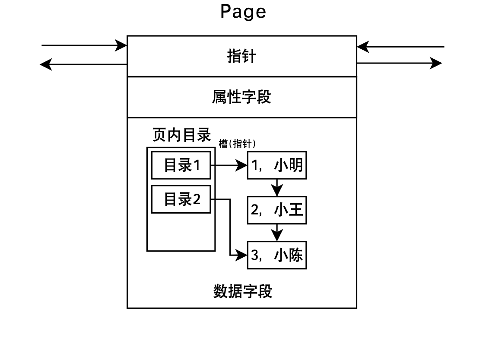

现在能解释最初为什么 MySQL 可以对记录排序了。因为 MySQL 默认会对含有主键的表的记录进行排序。页内部的数据记录本质是一个链表，链表的特点是增删快而查改慢，所以只要是有序的，那么二分查找的每一步都是有效的。并且主键的性质能保证排序是一定正确的，反之排序的依据不是主键（例如是性别），那么为之建立的索引也是无意义的。

## 多页情况

MySQL 的一页大小是 16KB，如果单页不断被插入记录，那么在容量不足时 MySQL 会开辟新页来储存新记录，然后通过指针记录新页的位置。

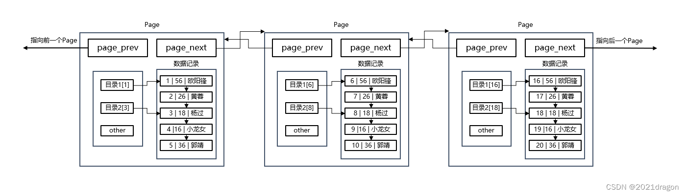

图片来源（包括下文）：https://blog.csdn.net/chenlong_cxy/article/details/128784469

值得注意的是，每一个 Page 内部和整体都是保持有序的，这意味着并不是每一条新纪录都会在新的 Page 中。这些关联在一起的 Page 共同维护着同一张表的所有记录，如果 Page 数量过多，那么 MySQL 在查询时仍然需要遍历 Page。虽然事先在 Page 内部使用了页内目录，但是首先得找到正确的 Page 后它才能发挥作用。

类似地，为每一个 Page 都建立目录，以供 MySQL 更快地找到正确的 Page。这类似某些检索系统，通过多级索引，最终划分到细支上。

## B 树和 B+树

以上讨论的 Page 的目录，叫做 B+树索引。那么什么是 B+树呢？有没有 B 树？

[参看本文的第六、七、八节](https://yey.world/2021/01/02/LearnedIndex-03/)

总之，B+树是含有索引的查找树，如果不断地为 Page 建立索引，那么最终总会有一个根结点作为索引的入口。

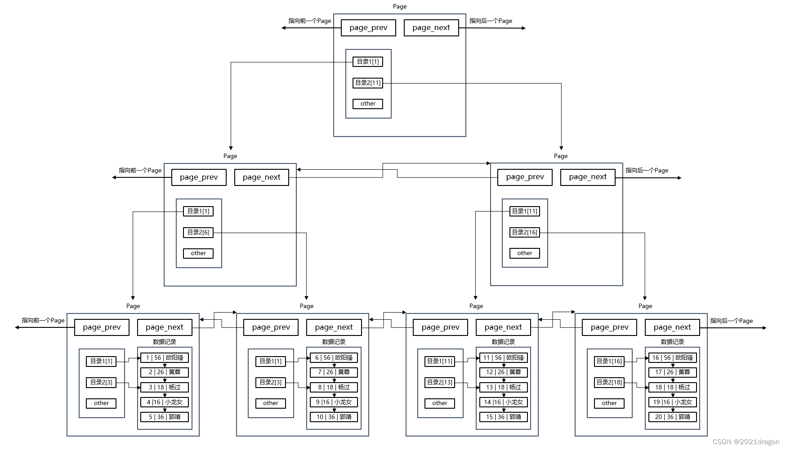

这是 InnoDB 存储引擎的索引结构，它是一棵 B+树。当一张表的数据量增加到需要多个页来存储时，InnoDB 使用一种结构来组织这些页，这个结构称为** B+树索引**。

> 在操作系统中的多级页表和多级索引也是类似的思想。

注意：在 B+树中，所有的数据记录都存储在叶子节点中，而内部节点仅存储键值作为索引。

B+树的特点：

- 所有叶子节点都位于同一层，并且通过指针相互连接，这为全范围扫描提供了便利。
- 内部节点的键作为指向子节点的指针，它们并不直接关联于实际的数据记录，只用于导航。
- 叶子节点包含所有键值及指向数据记录的指针，因此 B+树通常有更高的分支因子，减少树的高度更进一步。

当表被设置主键后，MySQL 会将它以 B+树的形式维护起来（叶子节点存数据，其他节点存索引），通过查询 B+树来提高效率。**在一个有主键索引的表中，一个 B+树通常维护的是一张表中的所有记录**。

> 是否所有 page 节点都需要加入到 Buffer Pool？

- 按需缓存：理论上，所有的 page 节点都可以被缓存到 Buffer Pool 中。但实际上，由于 Buffer Pool 的大小是有限的，因此并不是所有的 page 节点都会被缓存。
- 缓存策略：InnoDB 使用一系列的缓存策略来管理 Buffer Pool 的内容，包括最近最少使用（LRU）算法、从 Buffer Pool 中逐出不常用的页来为新的页腾出空间等。这意味着频繁访问的页更有可能被缓存。
- 写回策略：对于被修改的页（称为脏页），InnoDB 会定期将它们写回到磁盘，以确保数据的持久性。这个过程叫做“刷新”（flushing）。

> B+树一般有几层，在保证一定性能的情况下可以保存多少条记录？

B+树的层数和它能保存的记录数量依赖于几个关键因素，包括树的阶（即每个节点可以包含的最大子节点数），页（节点）的大小，以及记录的大小。这些参数决定了 B+树的高度和它能够有效管理的数据量大小。

B+树的层数通常很少，这是因为每个节点可以包含大量的子节点，这样的高分支因子使得即使是在存储大量记录的情况下，B+树的高度也相对较低。这是 B+树非常适合用于数据库索引的一个原因，因为即使是庞大的数据集也可以通过几次磁盘 I/O 操作访问到。

假设一个 B+树的阶是 100，这意味着每个内部节点可以最多有 100 个子节点，而每个叶节点可以包含最多 99 个记录（或索引项）。

- **一层**：只有一个根节点的 B+树可以直接存储最多 99 条记录。
- **两层**：一层内部节点加上叶节点层，可以存储大约 \($100 \times 99 = 9,900$\) 条记录。
- **三层**：可以存储大约 \($100^2 \times 99 = 990,000$\) 条记录。
- **四层**：可以存储大约 \($100^3 \times 99 = 99,000,000$\) 条记录。

实际上，即使是几百万到几十亿条记录，B+树的层数也通常只需维持在 3 到 4 层，这极大地减少了数据检索时的磁盘 I/O 次数，保证了数据库操作的高效性。

> 为什么 B+树的非叶子节点不存储数据呢？

索引和记录都被记录在 Page 的数据段中，这么做可以让一个 Page 都记录索引，这样这棵 B+树就会比较“矮胖”。换句话说就是让存放数据的节点只有一层叶子节点，其他节点就能全部用作存储索引，层数越低，I/O 次数越少，效率越高。如果数据和记录一起存储在一个 Page 中，那么 B+树就会变得比较高。

从 B+树的结构来看，它是边使用边构建的。

> 索引可以使用什么数据结构？

- [ ] 链表：查找效率低（平均时间复杂度为$O(n)$），不支持快速随机访问和有效的范围查询。
- [ ] 二叉搜索树：最坏情况下（如插入已排序的数据时）退化为链表，性能大幅下降。
- [ ] AVL 树和红黑树：相比于 B+树，节点存储数据导致树的高度较高，增加了磁盘 I/O 操作，特别是在大量数据存储的场景下。
- [x] 哈希表：官方的索引实现方式中 MySQL 是支持哈希表的，只不过 InnoDB 和 MyISAM 存储引擎并不支持。哈希表的优点就是它查找的时间复杂度是$O(1)$ 的，缺点是不支持范围查询，哈希冲突处理可能会影响性能，数据无序。

下面是几个常见的存储引擎，与其所支持的索引类型：

|  存储引擎   | 支持的索引类型 |
| :---------: | :------------: |
|   InnoDB    |     BTREE      |
|   MyISAM    |     BTREE      |
| MEMORY/HEAP |  HASH、BTREE   |
|     NDB     |  HASH、BTREE   |

> 为什么不使用 B 树作为索引的结构？

1. B 树可以将数据和指针存储在任意节点，原因见上
2. B 树的叶子节点之间没有用链表关联起来，不利于范围查找。

而其他数据结构虽然很高效，但是效率接近二分，而 B+树的效率高于二分，每次都可以筛掉一大部分不符合条件的分支。哈希空间满后需要重新构建哈希，这样反而效率会降低，虽然这可以通过新老哈希来解决，但是和 B+树相比，还是有点麻烦了。

## 聚簇索引和非聚簇索引

像 B+树这样，将所有数据存储在叶子节点的索引就是聚簇索引，反之是非聚簇索引。

不同存储引擎使用不同的索引结构，例如 MyISAM 就是非聚簇索引，InnoDB 就是聚簇索引。我们知道在 MySQL 中建表，实际上是在磁盘中创建文件，其中`.frm`是结构文件。

采用 InnoDB 存储引擎创建表时会生成一个`.ibd`文件，该文件中存储的是索引和数据相关的信息，索引和数据是存储在同一个文件中的。

采用 MyISAM 存储引擎创建表时会生成一个`.MYD`文件和一个`.MYI`文件，其中`.MYD`文件中存储的是数据相关的信息，而`.MYI`文件中存储的是索引相关的信息，索引和数据是分开存储的。

当插入记录时，使用 MyISAM 的表会立即写入到磁盘中，而使用 InnoDB 的需要刷新才会变化。

# 主键索引

主键索引是数据库表中的一种特殊索引，用于唯一标识表中的每一行记录。

主键索引的主要特点和作用包括：

- 唯一性：主键的值必须是唯一的，不能有重复。这意味着通过主键可以唯一确定表中的每一条记录。

- 非空性：主键字段不能为 NULL。每一行都必须有一个主键值。

- 索引：主键自动成为一个索引（在大多数数据库管理系统中是聚簇索引），这使得基于主键的数据检索非常快速。因为聚簇索引影响数据的物理存储顺序，所以基于主键的查询可以高效地执行。

- 数据完整性：主键帮助维护数据的完整性。它确保了表中的每一行都可以被清晰地识别和引用。

- 外键关联：在关系型数据库中，其他表可以通过主键来引用该表中的记录，主键成为这种关系的基础。这种通过主键和外键建立的链接是维护数据完整性和实现数据之间关系的关键机制。
- 使用场景：选择主键时，通常选择不会更改的数据列。常用的主键类型包括自增整数（在很多数据库系统中被称为自动编号的字段）和全局唯一标识符（GUID）。

## 创建

方法一：在属性名后指定

```sql
create table t1(
    id int primary key
);
```

方法二：在表后指定

```sql
create table t2(
    id int,
    primary key(id)
);
```

方法三：在已有表中使用 alter 和 add 添加

```sql
create table t3(
    id int    
);

alter table t3 add primary key(id);
```

注意，不要随意定义主键，一张表只能有一个主键，即只能有一个索引。mysqld 会为有主键的表自动构建主键索引（聚簇索引和非聚簇索引）。

复合主键形式上虽然是两个主键，但它们的列值组合是唯一的，所以可以当做一个主键来使用，复合主键将自动成为表的聚簇索引。

# 唯一索引

唯一索引是数据库表中的一种索引，它确保索引键列中的每个值都是唯一的。这意味着两行不能有相同的索引键值。唯一索引用于防止数据表中出现重复的记录，从而保持数据的完整性和准确性。它既可以作为数据完整性的一个约束，也可以提高基于这些列的查询的效率。

## 主要特点

- **唯一性**：唯一索引保证了表中每个索引键值的唯一性。尝试插入或更新重复的索引键值时，数据库系统将拒绝这些操作。
- **非空性（可选）**：唯一索引允许索引键中的值为 NULL，但这取决于具体的数据库管理系统（DBMS）实现。大多数 DBMS 允许唯一索引列包含 NULL 值，但通常限制为只能有一个 NULL 值，因为 NULL 通常被视为未知且不相等的值。
- **查询优化**：唯一索引不仅用于数据完整性检查，也用于加速对唯一索引列的查询操作。

## 与主键索引的区别

- **唯一性约束**：主键索引和唯一索引都强制实施唯一性约束，但每个表只能有一个主键，而可以有多个唯一索引。
- **非空约束**：主键字段不允许 NULL 值，而唯一索引字段通常允许包含一个 NULL 值（具体取决于 DBMS）。
- **用途**：主键索引是标识表中每行的唯一标识符，而唯一索引是用来防止特定列或列组合中的重复值。

## 使用场景

- **数据完整性**：当你希望确保某列（如电子邮件地址、身份证号码等）中的数据值不重复时，可以使用唯一索引。
- **性能优化**：对于经常用作查询条件的列，如果它们的值是唯一的或几乎唯一的，创建唯一索引可以提高查询性能。

## 创建

方法一：在属性名后指定

```sql
create table t1(
    id int unique
);
```

方法二：在表后指定

```sql
create table t2(
    id int,
    unique(id)
);
```

方法三：在已有表中使用 alter 和 add 添加

```sql
create table t3(
    id int    
);

alter table t3 add unique(id);
```

# 联合索引

联合索引（也称为复合索引）是在数据库表的两个或多个列上创建的索引。这种类型的索引可以极大地提高涉及这些列的查询性能，尤其是当查询条件包含这些列的组合时。联合索引利用了数据库表中列的组合关系，以优化查询、更新和管理数据的操作。

## 工作原理

联合索引的创建遵循特定的列顺序，这一点对于查询的优化至关重要。例如，如果在列 1 和列 2 上创建一个联合索引，则索引会首先按列 1 排序，然后在列 1 的每个值内部按列 2 排序。这意味着，当你的查询条件同时包含列 1 和列 2 时，该索引可以非常高效地使用。然而，如果查询只涉及列 2，则这个联合索引可能不会被使用（除非索引是覆盖索引，即查询只需要索引中的数据）。

## 优点

1. **提高查询效率**：对于包含 WHERE 子句中有多个条件的查询，联合索引可以减少查找和排序的时间。
2. **优化排序和分组查询**：对于包含 ORDER BY 或 GROUP BY 多个列的查询，如果这些列在同一个联合索引中，可以显著提高查询的效率。
3. ***支持索引覆盖**：如果查询只需要索引中的列，即使查询不使用所有的索引列，也可以避免访问表数据，从而提高查询速度。

## 创建

在 MySQL 中，可以使用以下 SQL 语句创建联合索引：

```sql
CREATE INDEX index_name ON table_name（列 1, 列 2, ...);
```

或者在创建表的时候直接定义索引：

```sql
CREATE TABLE table_name (
    列 1 datatype,
    列 2 datatype,
    ...
    INDEX index_name （列 1, 列 2, ...)
);
```

## 注意事项

- 索引列的顺序很重要：查询性能的提升在很大程度上依赖于联合索引中列的顺序，以及查询中使用这些列的方式。
- 避免过度索引：虽然索引可以提高查询性能，但每个额外的索引都会消耗更多的存储空间，并且会在插入、更新和删除数据时增加额外的性能开销。
- 选择性和宽度：高选择性的列（即具有许多唯一值的列）通常是创建索引的好候选，但是过宽的索引（即包含许多列或很长的列）可能会减慢操作速度。

## 最左匹配原则

最左匹配原则（Leftmost Prefix Principle）是数据库索引特别是复合索引查询过程中的一个重要原则。它涉及到如何利用复合索引进行查询优化和索引选择，从而影响使用数据库的效率。

### 原理

复合索引是在表的两个或多个列上创建的索引。最左匹配原则指的是，在使用复合索引时，**查询条件必须从索引的最左边的列开始**，并且按照索引列的顺序进行匹配。数据库能够利用索引加速查询的能力取决于查询条件如何与索引的最左边的列对应起来。

### 示例

假设有一个复合索引是在`col1`, `col2`, `col3`上创建的（按此顺序）。根据最左匹配原则：

- 查询条件包含`col1`，可以有效利用这个索引。
- 查询条件包含`col1`和`col2`，也可以有效利用这个索引。
- 查询条件如果只包含`col2`或只包含`col3`，则无法有效利用这个复合索引。

### 作用

- **查询优化**：理解最左匹配原则对于编写可以充分利用复合索引的查询至关重要。这可以显著提高查询性能，特别是在处理大量数据时。
- **索引设计**：在设计复合索引时，应考虑查询模式，并将**最常用作查询条件的列放在索引的最左边**。
- **减少全表扫描**：正确使用复合索引可以避免不必要的全表扫描，从而减少 I/O 操作，提高查询速度。

### 注意事项

- 范围查询：在复合索引中，一旦某一列用于范围查询（如`>`、`<`、`BETWEEN`等），它右边的列就不能再利用这个索引进行优化查询了。
- 前缀匹配：最左匹配原则也适用于 LIKE 查询，但一旦 LIKE 模式的开头是通配符（如`%`或`_`），索引就不会被使用。
- 函数和表达式：如果查询条件中列被函数或表达式包含，那么即使这些列在索引中，索引也可能不会被使用。

# 普通索引

普通索引，也称为标准索引或单列索引，是数据库中最基本类型的索引（实际应用多）。普通索引不强制实施任何数据完整性约束，如唯一性约束。这意味着，即使是使用了普通索引的列也可以**包含重复的值**。

> 普通（辅助）索引和主键索引最主要的差别是它的主键不能重复，非主键可以重复。

## 主要特点

- **数据检索**：普通索引主要用于提高查询效率，特别是对于那些经常作为查询条件（WHERE 子句）、联结条件（JOIN 子句）或排序（ORDER BY 子句）的字段。
- **无唯一性要求**：与唯一索引或主键索引不同，普通索引允许索引列中存在重复的值。
- **单列索引**：通常指为表中的单一列创建的索引，但也可以为多个列创建组合索引，组合索引中的第一列可以视为普通索引。

## 使用场景

- 当你希望提高基于某个字段的查询性能，但该字段不需要是唯一的，就可以为该字段创建一个普通索引。
- 对于那些可能会在查询中作为过滤条件出现的列，尤其是那些包含大量数据的列，使用普通索引可以显著减少查询时间。

## 创建和维护

- **创建索引**：在数据库中，可以通过 CREATE INDEX 语句来为表中的列创建索引。
- **维护开销**：虽然索引可以提高查询性能，但它们也需要在插入、更新或删除操作时进行维护，这可能会影响这些操作的性能。因此，需要在提高查询效率与维护索引的开销之间找到平衡。

## 注意事项

- 使用普通索引时，应仔细选择需要索引的列。过多的索引会增加数据库的存储需求，并可能降低写操作的性能。
- 在选择索引的列时，考虑查询的模式和数据的分布情况。选择那些能够显著改善查询性能而对写操作影响最小的列。

对于 MyISAM 存储引擎，构建主键索引或普通索引就是构建 B+树，叶子节点保存的是数据记录的地址。

InnoDB 存储引擎中构建主键索引（聚簇索引）和普通索引（二级索引或非聚簇索引）有所不同，其区别主要体现在数据的存储结构和访问方式上。这些区别直接影响了数据的检索效率和存储方式。

主键索引（聚簇索引）

- **数据和索引的结合**：在 InnoDB 中，聚簇索引将数据直接存储在索引的叶子节点中。这意味着，表数据按照主键的顺序进行存储。
- **唯一标识**：**每个 InnoDB 表都有一个聚簇索引**，如果表定义了主键，那么主键自动成为聚簇索引；如果没有显式定义主键，InnoDB 会选择一个唯一的非空索引代替；如果这样的索引也不存在，InnoDB 内部会生成一个隐藏的行 ID 作为聚簇索引。

普通索引（非聚簇索引）

- **指向聚簇索引的指针**：普通索引的叶子节点包含了聚簇索引键的值，而不是直接指向行数据的物理位置。因此，使用普通索引找到数据时，通常需要通过聚簇索引键的值来定位实际的数据行（即“回表”操作）。
- **索引的独立存储**：普通索引存储在表空间的独立部分，与聚簇索引物理分开。

### 回表

下面这张表中 ID 是主键：

```
CREATE TABLE `student` (
  `id` int(11) NOT NULL AUTO_INCREMENT COMMENT '自增主键',
  `name` varchar(32) 列 LATE utf8_bin NOT NULL COMMENT '名称',
  `age` int(3) unsigned NOT NULL DEFAULT '1' COMMENT '年龄',
  PRIMARY KEY (`id`),
  KEY `I_name` (`name`)
) ENGINE=InnoDB;

id		name		age
1		小王			12
2		小陈			13
3		小刘			14
```

对于查询：

```SQL
SELECT age FROM student WHERE name = '小王';
```

主键索引的 B+树的叶子节点存储了整条记录：

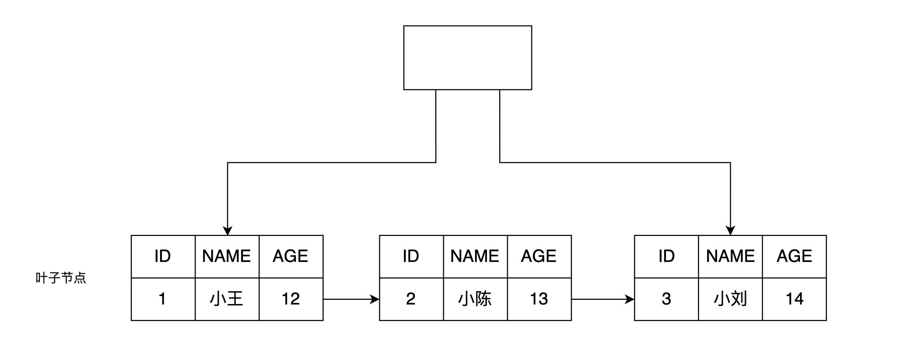

而普通索引的 B+树的叶子节点只存储主键：

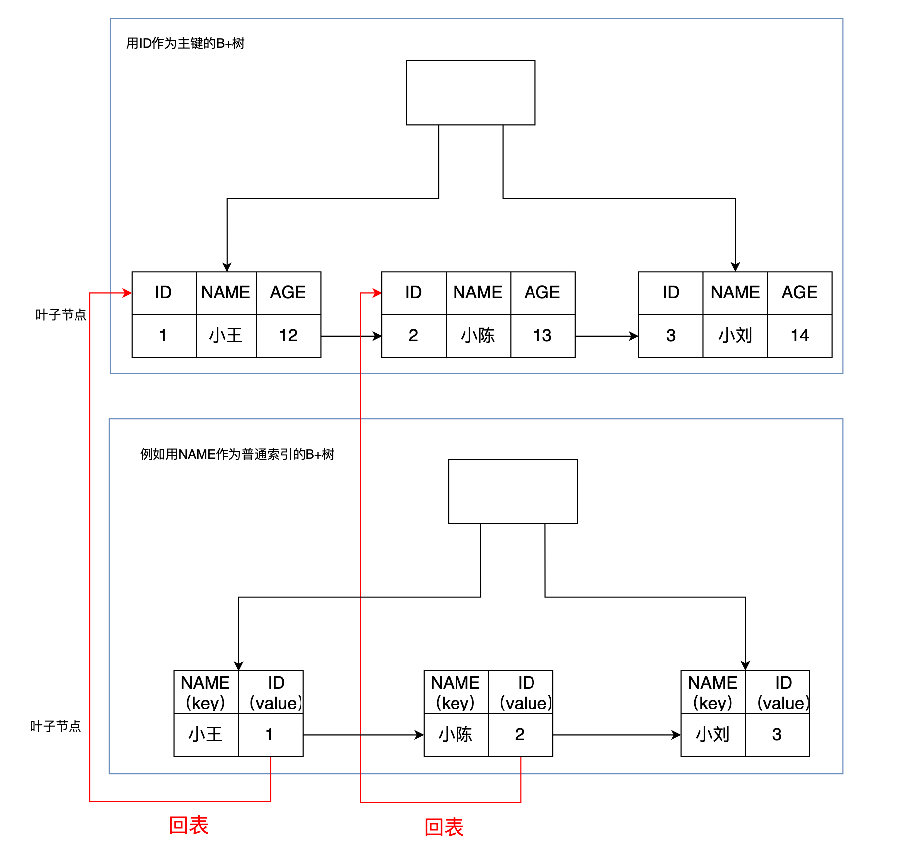

回表（Bookmark Lookup）

- **定义**：回表是 InnoDB 执行普通索引查询时的一种操作。当通过普通索引（非聚簇索引）查找数据时，数据库首先找到对应的聚簇索引键值，然后使用这个键值在聚簇索引中再次查找以获取实际的行数据。这个过程称为“回表”操作，因为它需要回到聚簇索引去查找完整的行数据。
- **性能影响**：回表操作需要额外的索引查找，可能会对查询性能产生影响。单次回表不会对效率产生影响，因为 B+树的层高一般是 3 到 4 层。当包含大量普通索引查找的查询时，回表操作可能会成为性能瓶颈。

### 索引覆盖

回表会对性能产生影响，优化的方式是索引覆盖（covering index，或覆盖索引）。

当一个查询能够完全通过一个或多个索引来获取所需的所有数据，而无需访问数据行本身时，我们称这种情况为“索引覆盖”。这意味着查询操作只需要读取索引，而不必访问表中的数据行。索引覆盖能够显著提高查询效率，因为索引结构（如 B+树）通常优化了数据的读取操作，且**索引的大小通常小于整个表的大小**，从而减少了磁盘 I/O 操作和提高了查询速度。

覆盖索引的使用方式如下：

对于查询：

```SQL
SELECT age FROM student WHERE name = '小刘';
```

上面以 NAME 建立的普通索引首先需要被删除，然后以 NAME 和 AGE 建立联合索引。

```SQL
ALTER TABLE student DROP INDEX I_name;
ALTER TABLE student ADD INDEX I_name_age(name, age);
```

如果在创建表时，可以这样建立联合索引：
```SQL
CREATE INDEDX i_name_age ON student(name, age);
```

这个需求是常见的：根据名称获取年龄或其他信息。那么建立它们的复合索引，索引本身包含了需要查询的年龄列，数据库可以直接用索引中获取这些数据而无需回表。这个索引是一个覆盖索引，它覆盖了上面的查询。

## 创建

方法一：

```sql
create table t4(
    id int,
    name varchar(20),
    index(name)
);
```

方法二：在已有表中使用 alter 和 add 添加

```sql
create table t5(
    id int,
    name varchar(20),
);

alter table t5 add index(name);
```

方法三：在已有表中使用 create 和 on 添加

```sql
create table t6(
    id int,
    name varchar(20),
);

create index idx_name on t6(name);
```

# 全文索引

全文索引是一种特殊类型的数据库索引，它允许对文本内容中的所有单词进行索引，以便进行高效的全文搜索。这种索引类型适用于包含大量文本的字段，如文章、报告、评论等，使得可以快速检索包含指定关键词或短语的记录。全文索引的设计旨在解决传统索引方法（如 B 树索引）在处理文本搜索时效率不高的问题。

## 主要特性

- 高效文本搜索：全文索引通过预先索引文本中的所有单词，提供了比 LIKE 子句或正则表达式更快的文本搜索能力。
- 支持复杂查询：支持多种查询操作，包括词汇匹配、短语匹配、布尔查询等，以及对查询结果的相关性排序。
- 自然语言处理：在建立索引过程中，通常会涉及到词干提取（stemming）、停用词过滤（stopwords filtering）等自然语言处理技术，以提高搜索的准确性和相关性。

## 应用场景

- 内容管理系统（CMS）：在新闻、博客和文档管理系统中快速查找包含特定关键词的文章或页面。
- 电子商务平台：在商品描述中搜索用户输入的关键词，快速定位相关商品。
- 社交网络和论坛：在用户生成的内容中搜索特定话题或信息。

## 创建

测试表如下，其中正文主题 body 是 text 类型。

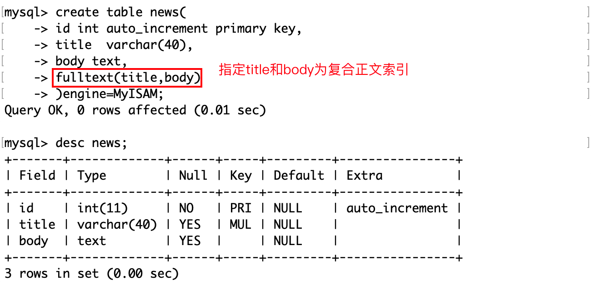

由于 InnoDB 只有在版本 5.6 之后的 mysqld 才支持全文索引，所以这里指定存储引擎为 MyISAM。

插入几条测试记录。


用模糊搜索：

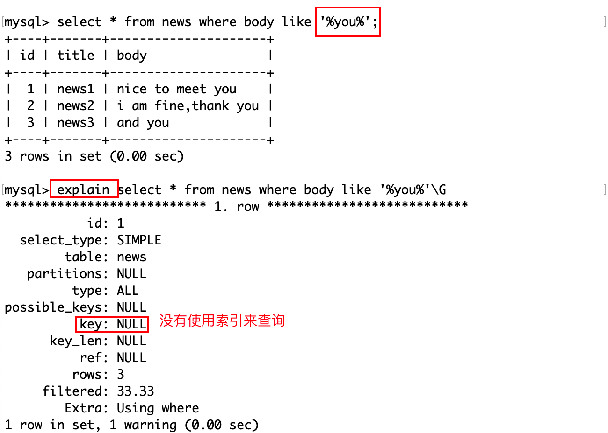

虽然这样能搜索到，但是通过`explain`命令可以看到，模糊查询并未使用到索引，因此在本文很长时就需要耗费时间。

全文索引的使用方式：

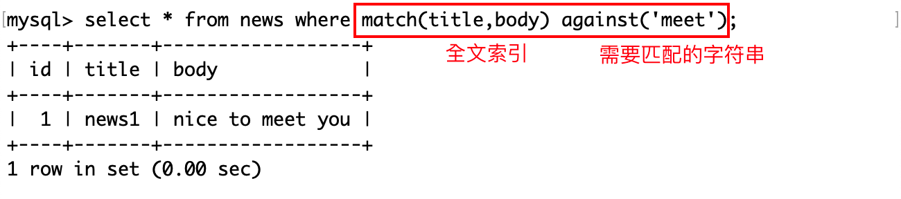

但是在 MySQL 的默认设置中，最小搜索长度通常是 3 或 4，这意味着全文索引只会为长度大于等于 4 或 3 的词语建立索引。

如果搜索的字符串长度小于 3：

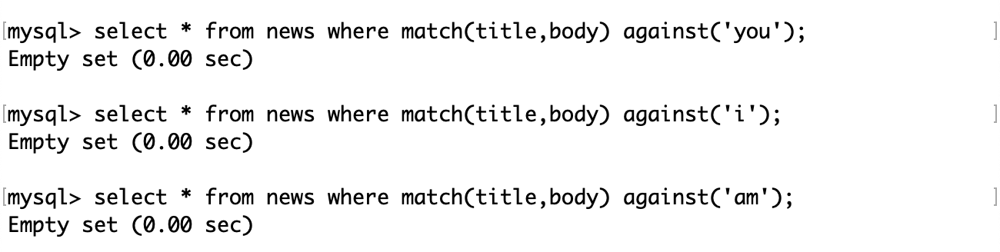

原因是这些词语没有被建立全文索引，无法用索引定位。

查看存储引擎的最小/最大搜索长度：
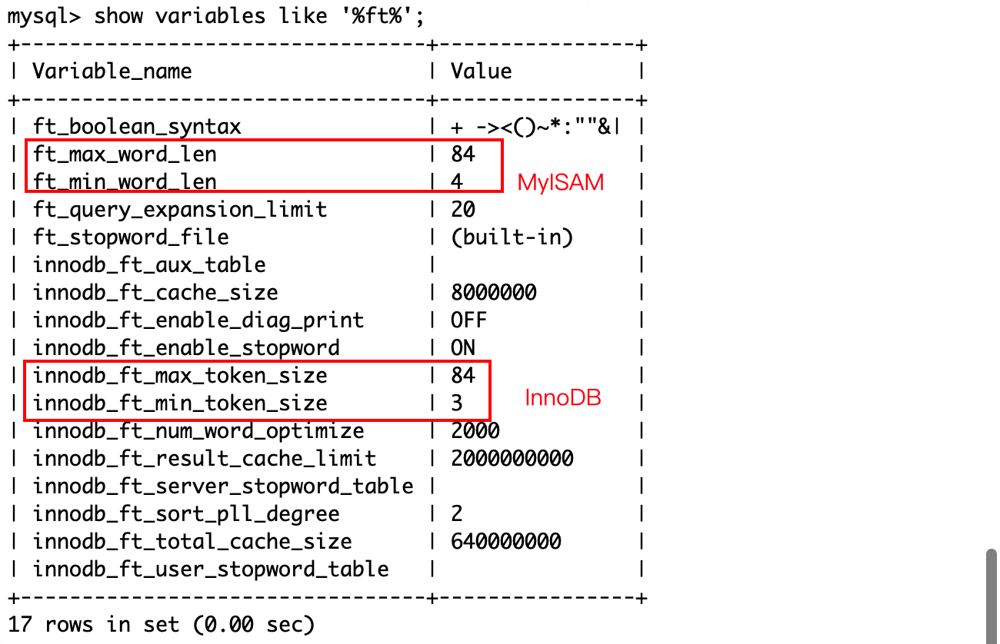

可以在`/etc/my.cnf`中的`[mysqld] `选项下追加以下内容：

```text
[mysqld]
innodb_ft_min_token_size = 1
```

然后重启 MySQL 服务器，并修复全文索引。注意，修改完参数以后，一定要修复索引，否则参数不会生效。

方法一：使用命令`repair table productnotes quick;`

方法二：删除并重新建立索引

## 补充：explain 命令

在 MySQL 中，`EXPLAIN`命令是一个非常有用的工具，用于分析 MySQL 如何执行一个查询。开发者和数据库管理员经常使用`EXPLAIN`来查看查询的执行计划，包括 MySQL 如何使用索引，是否进行了表扫描，查询如何连接表，以及估算的行数等。通过理解`EXPLAIN`的输出，可以帮助优化查询语句，改善数据库的性能。

### 使用 EXPLAIN

要使用`EXPLAIN`命令，只需在你的 SELECT 查询前加上关键字`EXPLAIN`：

```sql
EXPLAIN SELECT * FROM your_table WHERE your_列 umn = 'some_value';
```

这将返回 MySQL 如何执行该查询的详细信息。

### EXPLAIN 输出的关键列

`EXPLAIN`命令输出的结果中包含多个列，每列都提供了执行计划的不同方面的信息。以下是一些最重要的列：

- **id**：查询的标识符，如果查询包含子查询，每个子查询和主查询都会有不同的 id。
- **select_type**：查询的类型，例如，SIMPLE 表示简单的 SELECT 查询，而 SUBQUERY 表示结果来自子查询。
- **table**：显示行是从哪个表获得的。
- **type**：显示连接类型，这是重要的性能指标。值可能包括 ALL（全表扫描）、index（索引扫描）等，其中 ALL 通常是最慢的。
- **possible_keys**：显示 MySQL 能使用哪些索引来优化该查询。
- **key**：实际使用的索引。如果没有使用索引，则为 NULL。
- **key_len**：使用的索引的长度。较短的索引通常更优。
- **ref**：显示索引的哪一部分被使用了，如果可能的话，它会与某个值比较。
- **rows**：MySQL 认为必须检查的行数，以找到查询结果。估算的行数越少，查询通常越快。
- **Extra**：包含 MySQL 解决查询的详细信息，如是否使用了索引覆盖、是否进行了临时表排序等。

### 使用 EXPLAIN 进行优化

通过`EXPLAIN`的输出，你可以识别查询中的性能瓶颈，如是否进行了全表扫描（type 列为 ALL），是否有更好的索引可以使用（possible_keys 与 key 列），以及查询涉及的行数（rows 列）等。

基于这些信息，你可能需要：

- 优化查询语句，比如改变 JOIN 的顺序。
- 添加或修改索引，以确保查询可以利用索引来提高效率。
- 调整数据库的配置，或者重新设计表结构来提高性能。

例如在使用聚合函数`count(*)`检查表的行数时，由于这是一个精确的数字，所以可能需要遍历整个表而耗费时间，但是`explain`可以迅速地返回一个估计值。

# 查询索引

方法一：通过`show keys from 表名`查询。

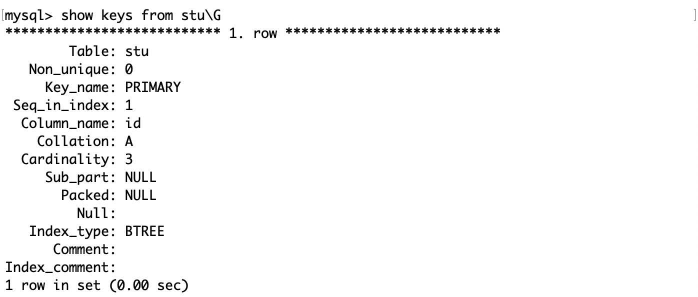

其中：

- Table： 表示创建索引的表的名称。
- Non_unique： 表示该索引是否是唯一索引，如果是则为 0，如果不是则为 1。
- Key_name： 表示索引的名称。
- Seq_in_index： 表示该列在索引中的位置，如果索引是单列的，则该列的值为 1，如果索引是复合索引，则该列的值为每列在索引定义中的顺序。
- 列 umn_name： 表示定义索引的列字段。
- 列 lation： 表示列以何种顺序存储在索引中，“A”表示升序，NULL 表示无分类。
- Cardinality： 索引中唯一值数目的估计值。基数根据被存储为整数的统计数据计数，所以即使对于小型表，该值也没有必要是精确的。基数越大，当进行联合时，MySQL 使用该索引的机会就越大。
- Sub_part： 表示列中被编入索引的字符的数量，若列只是部分被编入索引，则该列的值为被编入索引的字符的数目，若整列被编入索引，则该列的值为 NULL。
- Packed： 指示关键字如何被压缩。若没有被压缩，则值为 NULL。
- Null： 用于显示索引列中是否包含 NULL，若包含则为 YES，若不包含则为 NO。
- Index_type： 显示索引使用的类型和方法（BTREE、FULLTEXT、HASH、RTREE）。
- Comment： 显示评注。

方式二：`show index from 表名`

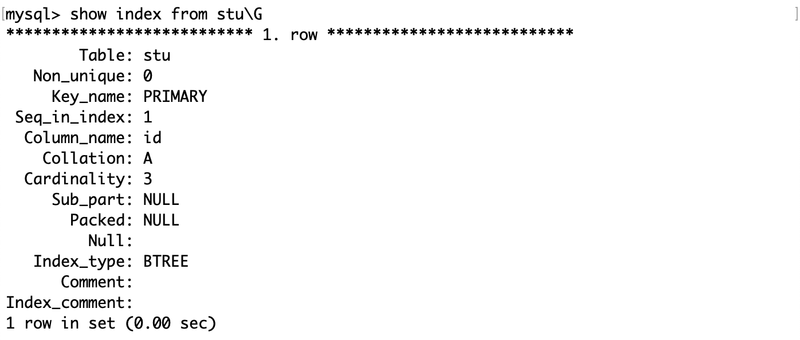

方式三：`desc 表名`

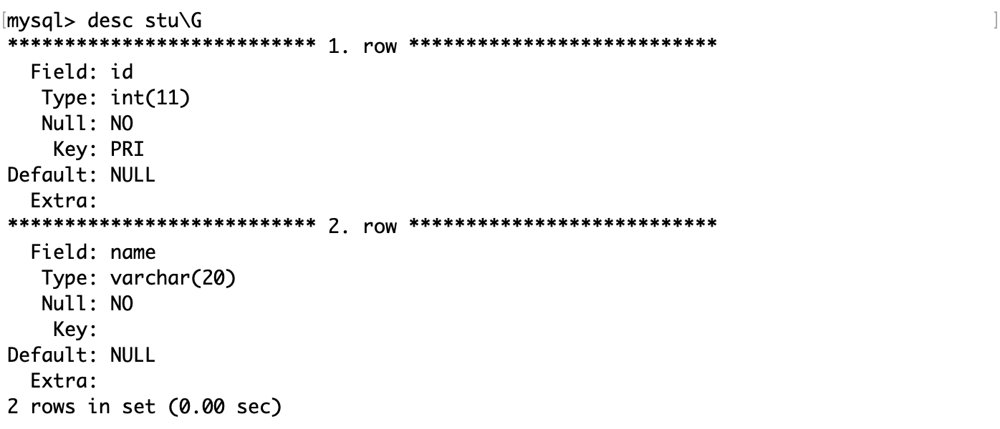

# 删除索引

假如测试表的结构如下。

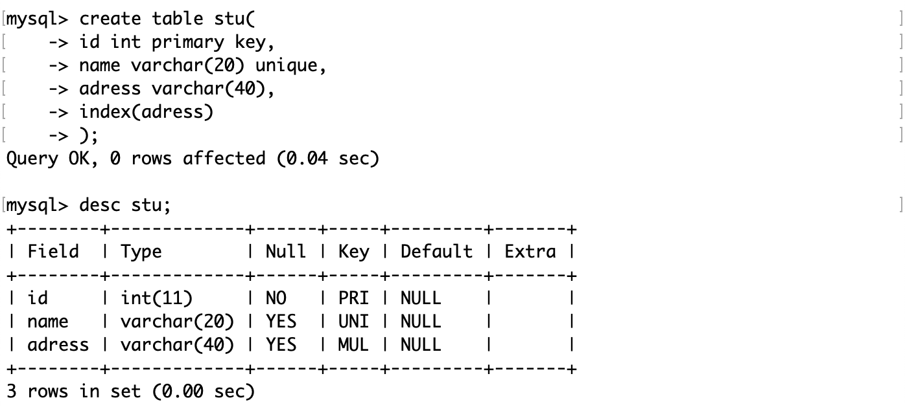

删除主键索引：`alter table 表名 drop primary key`

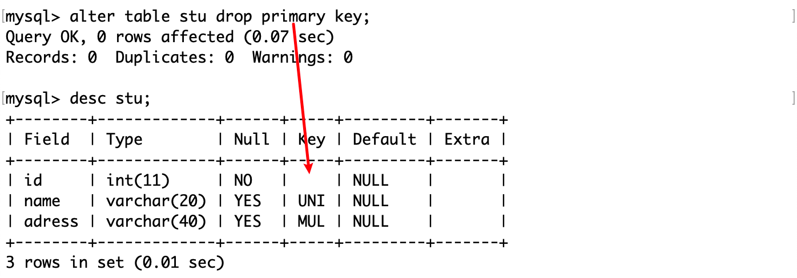

删除非主键索引：`alter table 表名 drop index 索引名`

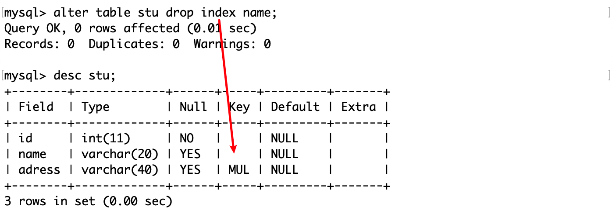

也可以使用：`drop index 索引名 on 表名`删除非主键索引

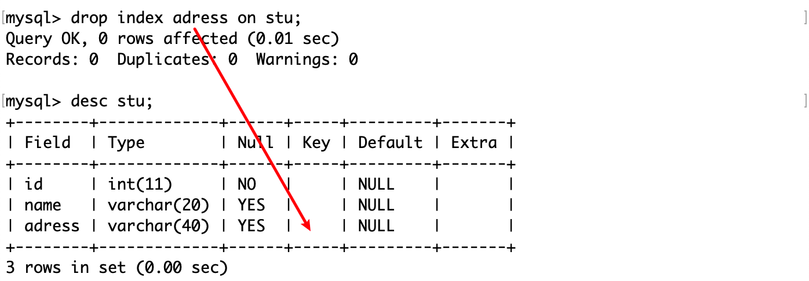

由于一个表只有一个主键索引，所以在删除主键索引的时候不用指明索引名，而一个表中可能有多个非主键索引，所以在删除非主键索引时需要指明索引名。

# 索引的特点

- **提高查询速度**：索引能够大幅度提高数据检索的速度，避免了全表扫描，因为它允许数据库引擎快速定位到表中的数据行。
- 增加写操作成本：虽然索引可以提高查询速度，但同时也会增加插入、删除和更新数据时的成本。因为每当表数据变更时，索引也需要被更新。
- 占用额外空间：索引需要占用物理存储空间。对于大型表，索引可能会占用大量的磁盘空间（就像书本目录一样）。
- 索引类型多样：
  - 主键索引：唯一标识表中每一行的索引。每个表只能有一个主键索引，且主键的值不能重复。
  - 唯一索引：保证数据库表中每行数据在索引列上的值是唯一的。
  - 普通索引：最基本的索引类型，没有唯一性的限制。
  - 全文索引：用于全文检索，特别适用于查找文本中的关键字。
  - 复合索引：基于表中的多个列构建，用于优化多列的查询条件。
- 选择合适的索引：不是所有的列都适合建立索引。通常，频繁作为查询条件的列、有唯一性要求的列、经常参与连接的列、有大量数据的列更适合建立索引。
- 索引覆盖：如果一个查询只需要访问索引中的信息，那么这个查询就可以被完全“覆盖”而无需访问表数据，这可以极大提高查询效率。
- 索引分裂和碎片整理：随着数据的不断更新，索引可能会发生分裂，导致索引碎片化。这时，可能需要对索引进行碎片整理，以保持数据库性能。
- 索引选择性：索引的选择性是衡量索引效果的一个重要因素，选择性高的索引意味着通过索引能够更准确地定位数据行。唯一索引的选择性是最高的。

# 索引创建的原则

## 选择性高的列

- 选择唯一性接近或完全唯一的列：索引的选择性是指不重复的索引值与表中总行数的比例。选择性越高的列作为索引，查询效率通常越高。

## 常用于查询条件的列
- WHERE 子句中的列：经常用作查询条件的列是索引的好候选。
- JOIN 操作的列：如果两个表常常需要通过某列进行连接，那么这列在两个表中都应该被索引。

## 考虑列的数据类型
- 使用较小的数据类型：较小的数据类型通常意味着索引结构更小，索引扫描更快。
- 避免 NULL：尽可能不要在允许 NULL 值的列上创建索引，处理 NULL 值会使索引效率降低。

## 覆盖索引
- 利用覆盖索引进行查询优化：如果一个索引包含了查询所需的所有列，查询可以直接使用索引来获取数据，避免访问表数据，这样可以极大提高查询效率。

## 联合索引的创建
- 遵循最左前缀匹配原则：在创建联合索引时，应该将最常用作查询条件的列放在最左边。
- 考虑索引列的顺序：索引的列顺序会影响索引的使用，正确的顺序可以使索引更有效。

## 避免过多的索引
- 权衡索引的利弊：虽然索引可以加快查询速度，但过多的索引会增加写操作（如 INSERT、UPDATE、DELETE）的成本，因为每次写操作都需要更新所有的索引。
- 监控和调整：定期监控索引的使用情况，删除不再使用或很少使用的索引，保持索引集合的精简和高效。

## 使用前缀索引
- 对于文本类型的长字符串，可以使用前缀索引来减少索引的大小，提高索引效率。但需要根据实际情况选择合适的前缀长度。

# 参考资料

- [索引|廖雪峰](https://www.liaoxuefeng.com/wiki/1177760294764384/1218728442198976)
- [MySQL 索引特性](https://blog.csdn.net/chenlong_cxy/article/details/128784469)
- [ 索引常见面试题|小林 coding](https://xiaolincoding.com/mysql/index/index_interview.html#%E4%BB%80%E4%B9%88%E6%98%AF%E7%B4%A2%E5%BC%95)

- [数据库中的 B 树与 B+ 树](https://yey.world/2021/01/02/LearnedIndex-03/)

- [MySQL 覆盖索引详解](https://juejin.cn/post/6844903967365791752)