阅读前导：

一般来说，对表的操作可以分为对表结构和对表内容的操作。

- 对表结构的操作，就是用数据定义语言 DDL 来创建、修改或删除表中的对象，比如字段、索引、约束等。常用的命令有 CREATE、ALTER、DROP 等。
- 对表内容的操作，就是用数据操作语言 DML 来插入、更新或删除表中的记录，比如数据行或列。常用的命令有 INSERT、UPDATE、DELETE 等。

前者已经在介绍了 [表结构的操作](https://blog.csdn.net/m0_63312733/article/details/133977132?spm=1001.2014.3001.5502)。

## 表的 CRUD

CRUD 即：Create（新增），Retrieve（查找），Update（修改），Delete（删除）。

SQL 标准规定大写单词表示关键字，在使用时为了方便和可读性，可以小写，因为 MySQL 会自动优化合并。

## Create（增加）

### 插入记录

```mysql
INSERT [INTO] table_name [(column1 [, column2] ...)] VALUES (value_list1) [, (value_list2)] ...;
```

VALUES 关键字前后分别指的是参数名和参数要插入的值，它们的位置是一一对应的。如果插入的值是这个表的所有列，那么前面的若干参数名可以省略。

创建表：

```mysql
mysql> create table students(
    -> id int primary key,
    -> name varchar(20) not null,
    -> class int not null
    -> );
```


指定列插入：


如果插入的是所有列，那么可以省略列名：


如果将 id 列的属性设置为自增，那么自增的值将是当前 id 的最大值+1，即 3。这允许插入时不指定 id 的值：
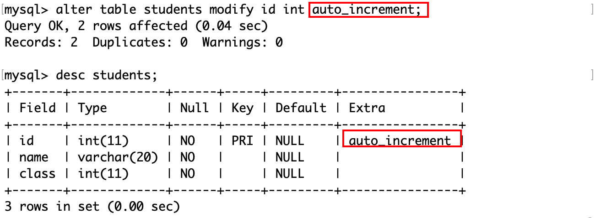


也就是说，只要表的约束允许插入列值时可以为空，那么在插入时就可以不指定列名，不过需要注意列名和列值位置和数量上的对应。

上面是每次插入一条数据，也可以在指定列名后，插入多条记录的列值：


### 插入冲突则更新记录

```mysql
INSERT INTO table_name (column1, column2,..) VALUES (value1, value2,..) ON DUPLICATE KEY UPDATE column1=value1, column2=value2,..;
```

如果在插入之前和表中的主键或唯一键产生冲突，那么则「更新」，否则直接插入。更新，即插入这个已存在的记录除了主键或唯一键之外不同的列值。

例如将上表中 id=5 的记录修改为：


如果插入了一条不存在的记录，那么相当于直接插入：


它们的不同之处在于 MySQL 打印的日志信息，前者是`2 rows affected`，表示这条已存在的记录中数据有冲突（先删除后插入）；后者是`1 rows affected`，表示没有数据冲突（直接插入）。如果是`0 rows affected`，则说明插入的和原来的记录相同。

### 替换记录

替换记录的语法和插入类似，只需要将 INSERT 换成 REPLACE。

替换的记录有冲突，实际上是先删除这条记录，然后再插入：


所以 MySQL 会提示有 2 行被影响。

如果不存在这条记录，相当于直接插入：


## Retrieve（查找）

### 查找记录

```mysql
SELECT [DISTINCT] {* | {column1 [, column2] ...}} FROM table_name [WHERE ...] [ORDER BY ...] [LIMIT ...];
```

查找语句是数据库最常用的工具。

和插入数据类似，在查询时可以指定类名，位置要对应。

```mysql
mysql> create table en_exam(
    -> id int primary key auto_increment,
    -> name varchar(20),
    -> listening int not null,
    -> speaking int not null,
    -> writing int not null
    -> );
```

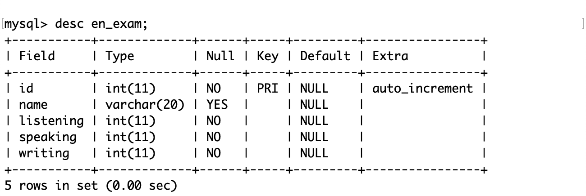

插入若干数据以测试：

```mysql
mysql> insert into en_exam
    -> values
    -> (1, 'A', 7, 7, 8), (2, 'B', 6, 7, 8), (3, 'C', 5, 9, 8), (4, 'D', 7, 5, 8), (5, 'E', 9, 7, 8);
```

查询表中指定列名的值：


通过通配符`*`来查询全列信息：


在测试时表的结构简单，通常用全列查询。但实际上数据库的一张表中就可能维护着成千上万条记录，这么做不但可读性差，而且如果是通过网络连接到 MySQL 服务器，可能对 MySQL 客户端的性能产生影响。

因此在查询时通常会指定查询条件。

事实上在 MySQL 中，select 命令可以执行表达式，例如计算一个四则运算，执行一个函数。那么言外之意是，在含有 select 关键字的 SQL 中，select 是最后才执行的。

例如计算上面这张表中所有人的总分和平均分：

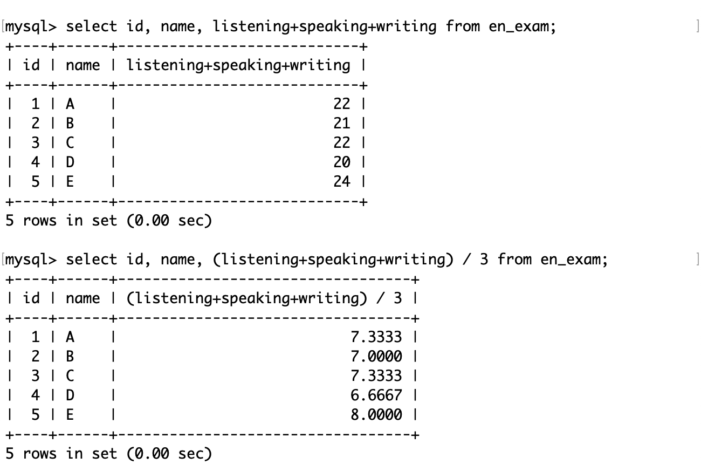

关于更多类似的做法，将会在下面介绍。

### 指定表达式的别名

```mysql
SELECT column [AS] alias_name [...] FROM table_name;
```

在上面这个例子中，计算总分和平均分这个表达式在 select 语句中相当于一个列，相比于其他列而言，直接将表达式作为列名可读性较差，可以为这个表达式的返回值取一个别名。


### 为结果去重

在 select 关键字后加上 DISTINCT 关键字以对表指定的列值去重：


### WHERE 子句

WHERE 子句用于从表中选择满足指定条件的数据。用户可以使用不同的比较运算符、逻辑运算符、通配符等来构造过滤表达式。WHERE 子句可以用在 SELECT、UPDATE、DELETE 等语句中。

那么，SELECT 等语句在查询表时，是根据 WHERE 子句筛选结果的，也就是说 WHERE 子句的执行在 SELECT 等语句之前。

#### 运算符

比较运算符：

| 运算符                  | 说明                                                         |
| ----------------------- | ------------------------------------------------------------ |
| >、>=、<、<=            | 大于、大于等于、小于、小于等于                               |
| =                       | 等于。NULL 不安全，例如 NULL=NULL 的结果是 NULL 而不是 TRUE(1) |
| <=>                     | 等于。NULL 安全，例如 NULL<=>NULL 的结果就是 TRUE(1)         |
| !=、<>                  | 不等于                                                       |
| BETWEEN a0 AND a1       | 范围匹配。如果 a0<=value<=a1，则返回 TRUE(1)                 |
| IN(option1, option2, …) | 如果是 IN 中的任意一个 option，则返回 TRUE(1)                |
| IS NULL                 | 如果是 NULL，则返回 TRUE(1)                                  |
| IS NOT NULL             | 如果不是 NULL，则返回 TRUE(1)                                |
| LIKE                    | 模糊匹配。`%`表示任意多个字符（包括 0 个），`_`表示任意一个字符 |

逻辑运算符：

| 运算符 | 说明                                                         |
| ------ | ------------------------------------------------------------ |
| AND    | 多个条件同时为 TRUE(1)，则结果为 TRUE(1)，否则为 FALSE(0)    |
| OR     | 任意一个条件为 TRUE(1)，则结果为 TRUE(1)，否则为 FALSE(0)    |
| NOT    | 条件为 TRUE(1)，则结果为 FALSE(0)；条件为 FALSE(0)，则结果为 TRUE(1) |

其中和编程语言的习惯不同的主要是“等于”（=，<=>）和“不等于”（<>），需要注意区分。

#### 条件查询

在 en_exam 表中，做一下条件查询：


查询听力在 6 分以下的人的姓名：


WHERE 子句中的条件并没有标准来规范格式，所以不需要添加空格。

在查询时，可以指定表中存在的任意列名。例如查询听力为 9 分的人的姓名和写作成绩：

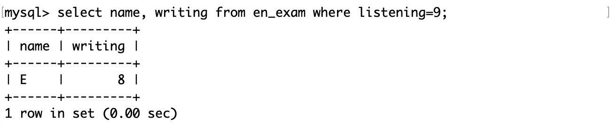

#### 区间查询

查询口语成绩在 5~8 分之间的人的姓名：


也可以使用 BETWEEN a AND b 来查询 [a, b] 这个区间的值：


查询听力成绩在 6~8 分之间**或者**口语成绩大于 6 分的人的写作成绩：


在练习时可以以行（回车）来划分不同的关键字。

查询听力成绩比口语成绩更好的人的姓名：


查询听力成绩为 5 分或者 7 分或者 9 分的人的姓名：


也可以用 xx IN (...) 来判断 xx 是否存在于后面这个集合中：


由于 WHERE 子句在 SELECT 语句之前执行，所以不能在 WHERE 子句中使用在 SELECT 语句中定义的别名。

例如查找总成绩大于 21 分的人的姓名和总分：


因为 SELECT 语句在 WHERE 子句之后执行，所以在前者中定义的别名对于后者是未知值。

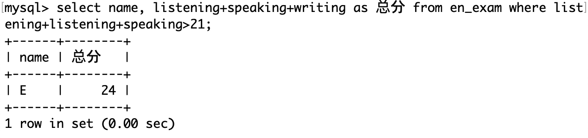

#### 模糊查询

插入了两条记录：

```mysql
mysql> insert into en_exam values (8, '孙大勇', 5, 7, 8, 1), (9, '森破', 6, 8, 7, 2);
```

模糊查询：查询孙某某同学和森某同学的记录：


注意下划线的数量要和字符的个数匹配。

如果要查找姓孙和姓森的记录，只需要匹配第一个字符：

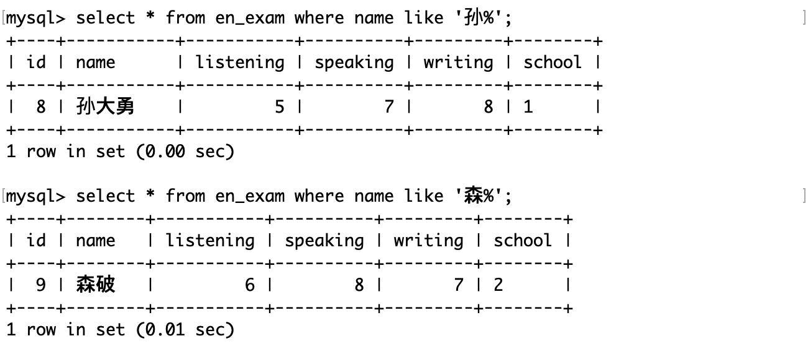

#### 空值查询

现在表的内容：


其中只有 8,9 号的 school 非空。

查询学校为空的记录：


查询学校不为空的记录：


也可以用运算符`<=>`查询空值，但是其他运算符`<>`、`!=`等都不能与 NULL 比较。这是因为在数据库中 NULL 值表示遗漏或位置的数据，它和任何值都不相等，它是一个空的占位符，没有实际值，因此不能用常规方式比较。所以除了`<=>`外的常规运算符，都不是“NULL 安全的”。


### 对结果排序

```mysql
SELECT ... FROM table_name [WHERE ...] ORDER BY column [ASC | DESC] [, ...];
```

其中：ASC 和 DESC 分别代表的是排升序和排降序，默认为 ASC。如果查询 SQL 中没有 order by 子句，那么返回的顺序是未定义的。

查询口语成绩，分别按升序和降序排序：


查询学校编号，分别按升序排序：

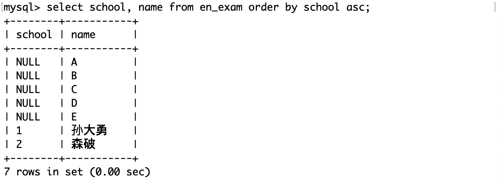

NULL 值表示为空，虽然它参与运算没有意义，但是在排序时视为比任何值都要小。

除了对一列属性进行排序之外，还可以对多列进行排序：


注意只需要一个 order by 关键字，要排序的列属性之间用逗号隔开。

order by 子句的执行在 select 语句之后，所以在 order by 子句中也可以使用 select 中指定的别名：


但是排序的前提是要有数据。

查询姓孙或姓森的同学及其口语成绩，按口语成绩降序显示。

对于这个查询，首先要找到要查询的记录，然后再对它们排序。


### 筛选分页结果

从第 0 条记录开始，向后筛选出 n 条记录：

```mysql
SELECT ... FROM table_name [WHERE ..] [ORDER BY ...] LIMIT n;
```

从第 s 条记录开始，向后筛选出 n 条记录：

```mysql
SELECT ... FROM table_name [WHERE ...] [ORDER BY ...] LIMIT s, n;
```

从第 s 条记录开始，向后筛选出 n 条记录：

```mysq
SELECT ... FROM table_name [WHERE ...] [ORDER BY ...] LIMIT n OFFSET s;
```

其中：

- 查询 SQL 中各语句的执行顺序为：where、select、order by、limit（按照某种条件筛选记录，然后从这个记录中再筛选若干条）。
- limit 子句在筛选记录时，记录的下标从 0 开始。

通常情况下一张表中的数据可能非常多，所以最好在 对未知表进行查询时最好在查询 SQL 后加上 limit 1。

按 id 进行分页，每页 3 条记录，分别显示第 1、2、3 页：


这些查询记录的子句，每一步都相当于从原表中摘出来的一张新的子表，后执行的语句都是在这张子表的基础上进行的。

## Update（修改）

```mysql
UPDATE table_name SET column1=expr1 [, column2=expr2] ... [WHERE ...] [ORDER BY ...] [LIMIT ...];
```

其中：

- SQL 中的 column=expr，表示将记录中列名为 column 的值修改为 expr。
- 修改记录的前提是这条记录存在，所以 update 语句中的 where、order by 和 limit 子句就是用来找到符合条件的记录。

将姓孙的同学的写作成绩改为 7：


修改子句总是最后才执行的，因为前面的子句都是查询。

将口语成绩前 3 的同学的口语成绩全部+3 分：
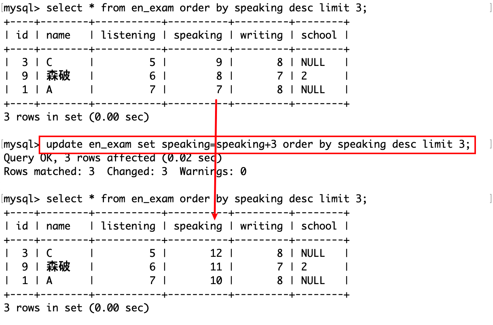

不论是多复杂的查询，总是要先得到查询后的这张子表，在子表中修改属性的值。另外注意 MySQL 不支持诸如+=这样的运算符。前 3 名+3 分后仍然是前三，但是如果是倒数 3 名+3 分后，可能就不是了。

## Delete（删除）

### DELETE

```mysql
DELETE FROM table_name [WHERE ...] [ORDER BY ...] [LIMIT ...];
```

和修改数记录一样，删除记录的前提是这条记录存在。所以 delete 子句也是在找到最终这张子表之后进行的。

删除孙大勇的记录：


删除表：

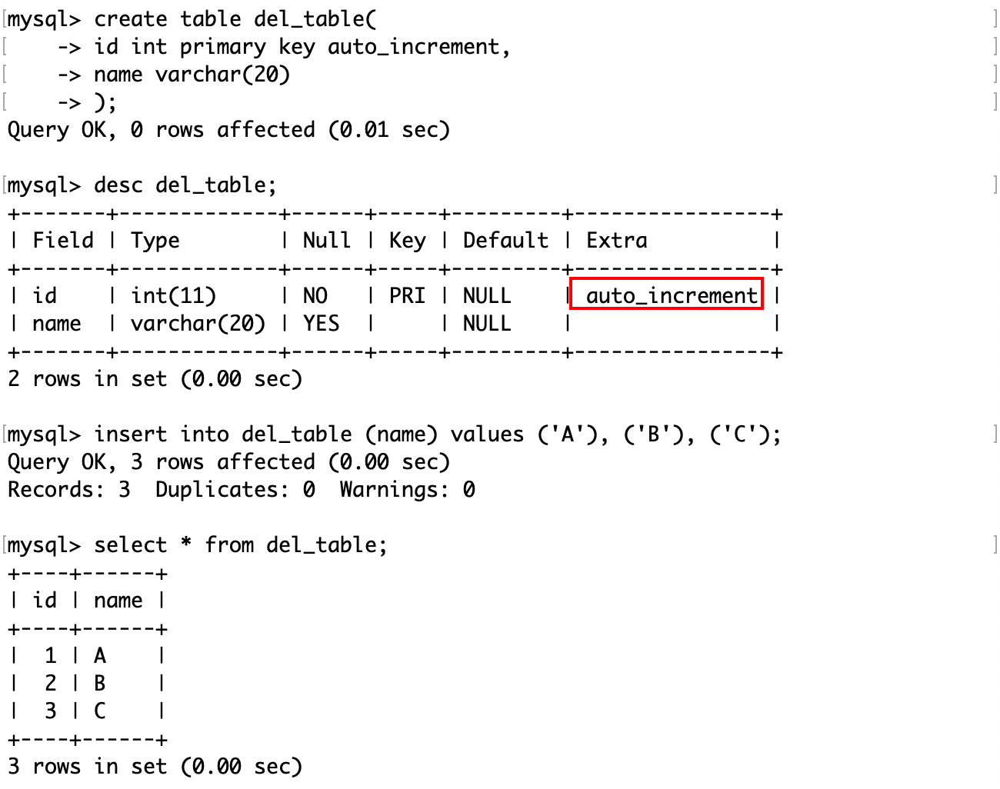

对于这张表，id 是一个自增属性，尝试删除它。


删除后这张表中就没有记录了，再向它插入几条不指定 id 的记录，可见自增变量即使在删除表以后仍然是删除前的最大值。

### TRUNCATE

删除表中所有数据。

```mysql
TRUNCATE [TABLE] table_name;
```

truncate 子句的作用类似于没有 where 条件的 delete 语句，或者是先 drop 表再 create 表的操作，但是 truncate 子句更高效，因为它直接删除并重新创建表，而不是逐行删除数据。

注意：

- truncate 在删除数据时不经过真正的事务，所以无法回滚。
- truncate 会重置`AUTO_INCREMENT=n`选项。

对于同样的一张表：


执行 truncate 操作，会将表中的数据清空，包括自增长属性。


由于 truncate 不对数据操作，而是直接 drop 表，所以执行截断操作后影响行数为 0。


截断表后再插入记录，从 1 开始自增。

### 记录去重

只保留重复记录中的一份，通常的做法是使用一个临时表。这种方法可以通过创建一个和原表结构相同的临时表，然后将原表中不重复的数据插入到临时表中，再删除原表并将临时表重命名为原表的名字。

下面这张表中有两份重复记录：


首先创建一个结构和原表一样的临时表：


可以使用 like 关键字来创建。

还记得上面我们说不论多复杂的查询，每一步都是在已有表的基础上，得到一张新的子表吗？这里我们可以在原表中查询出一张没有重复记录的子表，然后将这个子表插入到临时表中。


这样临时表中的记录就不会重复了。

最后可以将旧表删除，将临时表的名字改为旧表的名字。或者改为 xx_backup，表示它是原表的一个备份。


## 聚合函数

聚合函数是一类用于对一组值进行计算并返回单个值的函数。MySQL 提供了多种聚合函数，可以用来计算平均值，总和，计数，最大值，最小值等。聚合函数通常和 GROUP BY 子句一起使用，来对数据进行分组和统计。

常用的聚合函数有：

- COUNT(expr)：返回 expr 的非 NULL 值的个数。如果没有匹配的行，返回 0。可以使用 COUNT(*) 来返回所有行的个数，包括 NULL 值。可以使用 DISTINCT 关键字来指定只计算不同的值。

- AVG(expr)：返回 expr 的平均值，忽略 NULL 值。
- SUM(expr)：返回 expr 的总和，忽略 NULL 值。可以使用 DISTINCT 关键字来指定只计算不同的值。
- MAX(expr)：返回 expr 的最大值，忽略 NULL 值。可以用于数值，字符串，日期等类型的数据。
- MIN(expr)：返回 expr 的最小值，忽略 NULL 值。

在这张表中测试聚合函数：


统计这张表中总共有多少条记录：


分别用`*`和表达式`1`作为参数，得到的结果是一样的。这是因为后者这种写法相当于在查询时在原表中新增了一个值为 1 的列，然后 count 函数就会计算出有多少行值为 1 的列。

实际上 count(1) 数的是这一列：


统计这张表中有学校信息的记录：

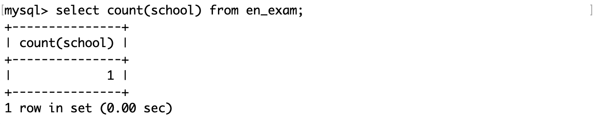

如果 count 函数的参数是一个确定的列名，那么 count 函数将会忽略该列中的 NULL 值。

统计这次考试中口语成绩的所有情况的个数，即口语成绩去重后的结果：

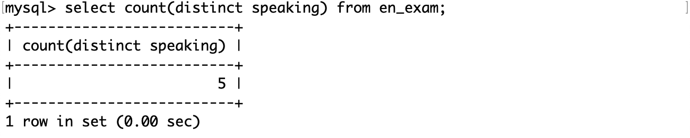

统计口语成绩的总分：


统计所有成绩的平均分：


找到写作成绩的最高分和最低分：


## 分组查询

分组查询是一种用于对查询结果按照一个或多个字段进行分组的查询方式。分组查询可以配合聚合函数来对每个分组进行统计或计算。

```mysql
SELECT column1 [, column2], ... FROM table_name [WHERE ...] GROUP BY column [, ...] [order by ...] [LIMIT ...];
```

由于聚合函数是直接或间接地统计某些列的数据，所以首先要有查询后的结果，然后再对它进行排序或者分组。SQL 中各语句的执行顺序为：where、group by、select、order by、limit。

此前做的查询都是将记录作为一个整体查询的，在 MySQL 中可以支持按照指定列对记录分组，然后通过 SQL 在划分好的组中进行操作。因为现实中的表中的数据很可能是很多的，而我们要操作的数据可能是很少的，如果不对它做划分，操作起来可行性几乎为 0。

雇员信息表中包含三张表，分别是员工表（emp）、部门表（dept）和工资等级表（salgrade）。

员工表（emp）：

- 雇员编号（empno）
- 雇员姓名（ename）
- 雇员职位（job）
- 雇员领导编号（mgr）
- 雇佣时间（hiredate）
- 工资月薪（sal）
- 奖金（comm）
- 部门编号（deptno）

部门表（dept）：

- 部门编号（deptno）
- 部门名称（dname）
- 部门所在地点（loc）

工资等级表（salgrade）：

- 等级（grade）
- 此等级最低工资（losal）
- 此等级最高工资（hisal）

雇员信息表的 SQL：

```MySQL
DROP database IF EXISTS `scott`;
CREATE database IF NOT EXISTS `scott` DEFAULT CHARACTER SET utf8 COLLATE utf8_general_ci;

USE `scott`;

DROP TABLE IF EXISTS `dept`;
CREATE TABLE `dept` (
  `deptno` int(2) unsigned zerofill NOT NULL COMMENT '部门编号',
  `dname` varchar(14) DEFAULT NULL COMMENT '部门名称',
  `loc` varchar(13) DEFAULT NULL COMMENT '部门所在地点'
);

DROP TABLE IF EXISTS `emp`;
CREATE TABLE `emp` (
  `empno` int(6) unsigned zerofill NOT NULL COMMENT '雇员编号',
  `ename` varchar(10) DEFAULT NULL COMMENT '雇员姓名',
  `job` varchar(9) DEFAULT NULL COMMENT '雇员职位',
  `mgr` int(4) unsigned zerofill DEFAULT NULL COMMENT '雇员领导编号',
  `hiredate` datetime DEFAULT NULL COMMENT '雇佣时间',
  `sal` decimal(7,2) DEFAULT NULL COMMENT '工资月薪',
  `comm` decimal(7,2) DEFAULT NULL COMMENT '奖金',
  `deptno` int(2) unsigned zerofill DEFAULT NULL COMMENT '部门编号'
);

DROP TABLE IF EXISTS `salgrade`;
CREATE TABLE `salgrade` (
  `grade` int(11) DEFAULT NULL COMMENT '等级',
  `losal` int(11) DEFAULT NULL COMMENT '此等级最低工资',
  `hisal` int(11) DEFAULT NULL COMMENT '此等级最高工资'
);

insert into dept (deptno, dname, loc)
values (10, 'ACCOUNTING', 'NEW YORK');
insert into dept (deptno, dname, loc)
values (20, 'RESEARCH', 'DALLAS');
insert into dept (deptno, dname, loc)
values (30, 'SALES', 'CHICAGO');
insert into dept (deptno, dname, loc)
values (40, 'OPERATIONS', 'BOSTON');

insert into emp (empno, ename, job, mgr, hiredate, sal, comm, deptno)
values (7369, 'SMITH', 'CLERK', 7902, '1980-12-17', 800, null, 20);

insert into emp (empno, ename, job, mgr, hiredate, sal, comm, deptno)
values (7499, 'ALLEN', 'SALESMAN', 7698, '1981-02-20', 1600, 300, 30);

insert into emp (empno, ename, job, mgr, hiredate, sal, comm, deptno)
values (7521, 'WARD', 'SALESMAN', 7698, '1981-02-22', 1250, 500, 30);

insert into emp (empno, ename, job, mgr, hiredate, sal, comm, deptno)
values (7566, 'JONES', 'MANAGER', 7839, '1981-04-02', 2975, null, 20);

insert into emp (empno, ename, job, mgr, hiredate, sal, comm, deptno)
values (7654, 'MARTIN', 'SALESMAN', 7698, '1981-09-28', 1250, 1400, 30);

insert into emp (empno, ename, job, mgr, hiredate, sal, comm, deptno)
values (7698, 'BLAKE', 'MANAGER', 7839, '1981-05-01', 2850, null, 30);

insert into emp (empno, ename, job, mgr, hiredate, sal, comm, deptno)
values (7782, 'CLARK', 'MANAGER', 7839, '1981-06-09', 2450, null, 10);

insert into emp (empno, ename, job, mgr, hiredate, sal, comm, deptno)
values (7788, 'SCOTT', 'ANALYST', 7566, '1987-04-19', 3000, null, 20);

insert into emp (empno, ename, job, mgr, hiredate, sal, comm, deptno)
values (7839, 'KING', 'PRESIDENT', null, '1981-11-17', 5000, null, 10);

insert into emp (empno, ename, job, mgr, hiredate, sal, comm, deptno)
values (7844, 'TURNER', 'SALESMAN', 7698,'1981-09-08', 1500, 0, 30);

insert into emp (empno, ename, job, mgr, hiredate, sal, comm, deptno)
values (7876, 'ADAMS', 'CLERK', 7788, '1987-05-23', 1100, null, 20);

insert into emp (empno, ename, job, mgr, hiredate, sal, comm, deptno)
values (7900, 'JAMES', 'CLERK', 7698, '1981-12-03', 950, null, 30);

insert into emp (empno, ename, job, mgr, hiredate, sal, comm, deptno)
values (7902, 'FORD', 'ANALYST', 7566, '1981-12-03', 3000, null, 20);

insert into emp (empno, ename, job, mgr, hiredate, sal, comm, deptno)
values (7934, 'MILLER', 'CLERK', 7782, '1982-01-23', 1300, null, 10);

insert into salgrade (grade, losal, hisal) values (1, 700, 1200);
insert into salgrade (grade, losal, hisal) values (2, 1201, 1400);
insert into salgrade (grade, losal, hisal) values (3, 1401, 2000);
insert into salgrade (grade, losal, hisal) values (4, 2001, 3000);
insert into salgrade (grade, losal, hisal) values (5, 3001, 9999);
```

这些 SQL 将保存在一个以`.sql`结尾的文件中，然后再 MySQL 中使用 source 命令执行它：


部门表的结构和内容：


员工表的结构和内容：


工资等级表的结构和内容：


显示每个部门的平均工资和最高工资：


首先按照部门号分组，然后在各自的组内做聚合查询，得到各个组的平均和最高工资。

显示每个部门的每种岗位的平均工资和最低工资：


注意：group by 子句中可以指明按照多个字段进行分组，各个字段之间使用逗号隔开，分组优先级与书写顺序相同。当两条记录的部门号相同时，将会继续按照岗位进行分组。

### HAVING

HAVING 子句是用来在 SELECT 语句中指定一组行或聚合的过滤条件的。HAVING 子句通常与 GROUP BY 子句一起使用，以根据指定的条件过滤分组。如果省略 GROUP BY 子句，则 HAVING 子句的行为与 WHERE 子句类似。

```mysql
SELECT ... FROM table_name [WHERE ...] [GROUP BY ...] [HAVING ...] [order by ...] [LIMIT ...];
```

其中：

- SQL 中各语句的执行顺序为：
  - 根据 where 子句筛选出符合条件的记录。
  - 根据 group by 子句对数据进行分组。
  - 将分组后的数据依次执行 select 语句。
  - 根据 having 子句对分组后的数据进行进一步筛选。
  - 根据 order by 子句对数据进行排序。
  - 根据 limit 子句筛选若干条记录进行显示。
- having 子句中可以指明一个或多个筛选条件。

having 子句和 where 子句的区别：

- where 子句放在表名后面，而 having 子句必须搭配 group by 子句使用，放在 group by 子句的后面。
- where 子句是对整表的数据进行筛选，having 子句是对分组后的数据进行筛选。
- where 子句中不能使用聚合函数和别名，而 having 子句中可以使用聚合函数和别名。

显示平均工资低于 2500 的部门和它的平均工资：

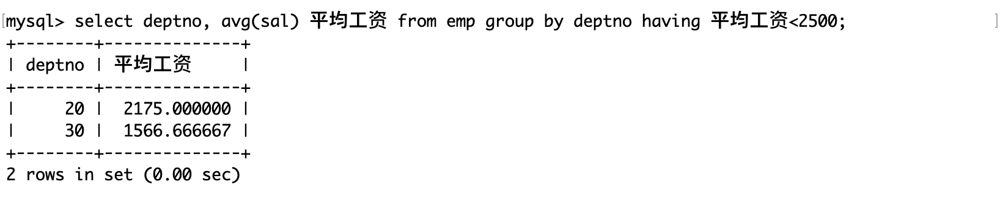
