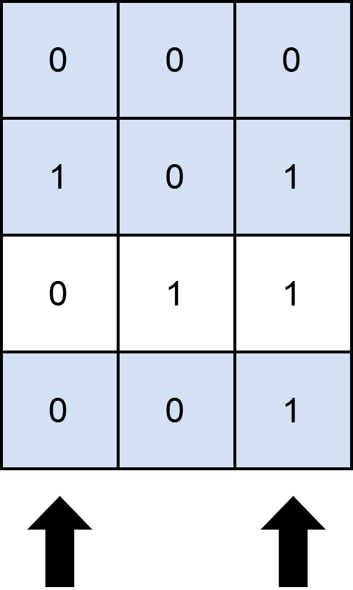
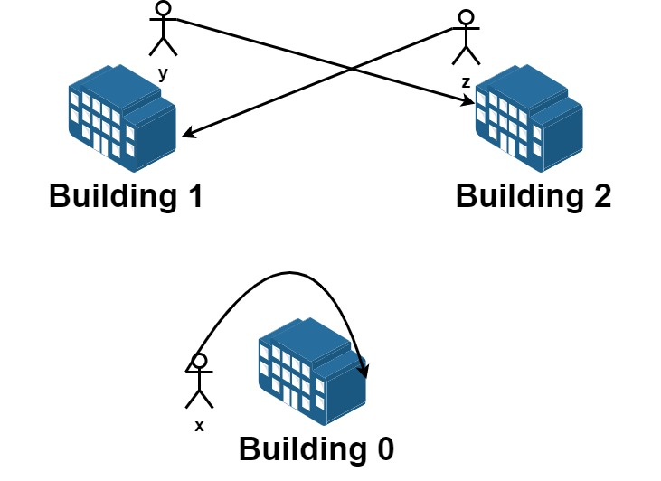

## 预备知识

【视频】[回溯算法套路①子集型回溯【基础算法精讲 14】](https://www.bilibili.com/video/BV1mG4y1A7Gu/?spm_id_from=333.788&vd_source=b46c022ff65a946442d77e8b7b4b2646)

【博客】[回溯算法入门级详解](https://leetcode.cn/problems/permutations/solutions/9914/hui-su-suan-fa-python-dai-ma-java-dai-ma-by-liweiw/)

### 输入角度，选或不选

输入角度就是从无到有构建答案的过程，是从递归树的根节点到叶子节点的过程。每一层都代表着一个元素，每层的两个分支都表示“选或者不选”。

### 答案角度，枚举选哪个

这个角度更像双指针，dfs(i)表示枚举每一个元素，在每个dfs()内部，有一个循环for(j in range(i, n))，枚举i后面的所有剩余元素。这样i之前的元素就表示已经被考虑过的，j之后的元素就表示未被考虑过的。

## [17. 电话号码的字母组合](https://leetcode.cn/problems/letter-combinations-of-a-phone-number/)

给定一个仅包含数字 `2-9` 的字符串，返回所有它能表示的字母组合。答案可以按 **任意顺序** 返回。

给出数字到字母的映射如下（与电话按键相同）。注意 1 不对应任何字母。


 

**示例 1：**

```
输入：digits = "23"
输出：["ad","ae","af","bd","be","bf","cd","ce","cf"]
```

**示例 2：**

```
输入：digits = ""
输出：[]
```

**示例 3：**

```
输入：digits = "2"
输出：["a","b","c"]
```

#### 思路


#### 代码

```cpp
/*
    原问题：构造一个长度为n的字符串
    子问题：构造一个长度为n-1的字符串

    子集型回溯：输入角度，选或不选
    当前操作：枚举nums[i]，填入字符串
    子问题：构造字符串下标>=i的部分
    下一个子问题：构造字符串下标>=i+1的部分
*/
class Solution
{
  public:
    vector<string> letterCombinations(string digits)
    {
        int n = digits.size();
        if (n == 0) return {};
        vector<string> res;
        string Map[10] = {"", "", "abc", "def", "ghi", "jkl", "mno", "pqrs", "tuv", "wxyz"};
        string path;

        function<void(int)> dfs = [&](int index) {
            if (index == n) // 构造了一个长度为n的字符串,假如到集合中
            {
                res.push_back(path);
                return;
            }
            int digit = digits[index] - '0'; // 获得当前数字对应的字符串
            for (char ch : Map[digit]) // 迭代这个字符串的每个字符
            { 
                path.push_back(ch);
                dfs(index + 1); // 移动到下一个数字
                path.pop_back(); // 回溯，移除最后一个字符
            }
        };

        dfs(0);
        return res;
    }
};
```

#### 复杂度分析

- 时间复杂度：$O()$。
- 空间复杂度：$O()$。

## [78. 子集](https://leetcode.cn/problems/subsets/)

给你一个整数数组 `nums` ，数组中的元素 **互不相同** 。返回该数组所有可能的

子集（幂集）。

解集 **不能** 包含重复的子集。你可以按 **任意顺序** 返回解集。

 

**示例 1：**

```
输入：nums = [1,2,3]
输出：[[],[1],[2],[1,2],[3],[1,3],[2,3],[1,2,3]]
```

**示例 2：**

```
输入：nums = [0]
输出：[[],[0]]
```

### 输入角度，选或不选

#### 思路

回溯三问：

1. 当前操作：枚举第i个字符选或不选
2. 对于当前操作的子问题：从第i个字符构造子字符串
3. 进行完当前操作后的下一个子问题：从第i+1个字符构造子字符串

递归终止条件：i遍历完所有字符，即走到了递归树的一个叶子节点，说明找到了一个结果。

#### 代码

```cpp
class Solution {
public:
    vector<vector<int>> subsets(vector<int>& nums) {
        vector<vector<int>> res;
        vector<int> path;
        int n = nums.size();
        function<void(int)> dfs = [&](int i) 
        {
            if (i == n) // 找到一个答案
            {
                res.push_back(path);
                return;
            }
            // 不选：跳过当前i，递归到i+1
            dfs(i + 1);
            // 选：回溯
            path.push_back(nums[i]);
            dfs(i + 1);
            path.pop_back(); // 恢复现场
        };
        dfs(0);
        return res;
    }
};
```

#### 复杂度分析

- 时间复杂度：$O()$。
- 空间复杂度：$O()$。

### 答案角度，枚举选哪个

#### 思路

回溯三问：

1. 当前操作：枚举第i个字符后的所有字符s[j]
2. 对于当前操作的子问题：考虑第j个字符是否能构造子字符串
3. 进行完当前操作后的下一个子问题：考虑第j+1个字符是否能构造子字符串

#### 代码

```cpp
class Solution {
public:
    vector<vector<int>> subsets(vector<int>& nums) {
        vector<vector<int>> res;
        vector<int> path;
        int n = nums.size();
        function<void(int)> dfs = [&](int i) {
            res.push_back(path);
            if (i == n) {
                return;
            }
            for (int j = i; j < n; j++) {
                path.push_back(nums[j]);
                dfs(j + 1);
                path.pop_back();
            }
        };
        dfs(0);
        return res;
    }
};
```


#### 复杂度分析

- 时间复杂度：$O()$。
- 空间复杂度：$O()$。

## [46. 全排列](https://leetcode.cn/problems/permutations/)

给定一个不含重复数字的数组 `nums` ，返回其 *所有可能的全排列* 。你可以 **按任意顺序** 返回答案。

 

**示例 1：**

```
输入：nums = [1,2,3]
输出：[[1,2,3],[1,3,2],[2,1,3],[2,3,1],[3,1,2],[3,2,1]]
```

**示例 2：**

```
输入：nums = [0,1]
输出：[[0,1],[1,0]]
```

**示例 3：**

```
输入：nums = [1]
输出：[[1]]
```

### 答案角度，枚举选哪个

#### 思路

由于全排列的每个子集元素个数都是$n$，因此这道题没办法用“输入角度，选或不选”。

DFS枚举答案的第i个位置可以选择哪些数字。

回溯三问：

1. 当前操作：
2. 对于当前操作的子问题：
3. 执行完当前操作后下一个子问题：

#### 代码

```cpp
class Solution {
public:
    vector<vector<int>> permute(vector<int>& nums) {
        int n = nums.size();
        vector<bool> visited(n, false);
        vector<vector<int>> res;
        vector<int> path(n);
        function <void(int)> dfs = [&](int i)
        {
            if (i == n) 
            {
                res.push_back(path);
                return;
            }

            for (int j = 0; j < n; j++)
            {
                if (visited[j] != true)
                {
                    path[i] = nums[j];
                    visited[j] = true;
                    dfs(i + 1);
                    visited[j] = false;
                }
            }
        };
        dfs(0);
        return res;
    }
};
```

#### 复杂度分析

- 时间复杂度：$O(n)$。
- 空间复杂度：$O(n)$。

## [131. 分割回文串](https://leetcode.cn/problems/palindrome-partitioning/)

给你一个字符串 `s`，请你将 `s` 分割成一些子串，使每个子串都是 

**回文串**

 。返回 `s` 所有可能的分割方案。

**示例 1：**

```
输入：s = "aab"
输出：[["a","a","b"],["aa","b"]]
```

**示例 2：**

```
输入：s = "a"
输出：[["a"]]
```
### 答案角度，枚举选哪个

#### 思路

回溯三问：

1. 当前操作：枚举从位置i开始的所有可能的后缀子串s[i:n-1]，确认s[i:j]是否回文。
2. 对于当前操作的子问题：枚举子串s[j:n-1]的所有可能的回文分割。
3. 进行完当前操作后的下一个子问题：枚举子串s[j+1:n-1]的所有可能的回文分割。

步骤：

1. DFS枚举所有子字符串可能的起点 s[i]。
2. 在一次DFS中，枚举这个子字符串从当前起点到所有可能的终点 s[j]，j从i到字符串结束。
   - 如果s[i:j]是回文字符串，那么加入到临时数组 path中，回溯。
   - 如果在DFS过程中i已经遍历了所有字符串，那么将path加入到答案数组res中。

递归终止条件：i遍历完所有字符，即走到了递归树的一个叶子节点，说明找到了一个结果。

#### 代码

```cpp
class Solution {
public:
    bool check(string s, int left, int right)
    {
        while (left < right)
            if (s[left++] != s[right--]) return false;
        return true;
    }
    vector<vector<string>> partition(string s) {
        vector<string> path;
        vector<vector<string>> res;
        int n = s.size();
        // 答案角度：枚举可能的结尾字符s[i:n-1]
        function <void(int)> dfs = [&] (int i)
        {
            if (i == n) // 找到一个答案
            {
                res.emplace_back(path);
                return;
            }
            for (int j = i; j < n; j++)
            {
                if (check(s, i, j))
                {
                    path.push_back(s.substr(i, j - i + 1));
                    dfs(j + 1);
                    path.pop_back();
                }
            }
        };
        dfs(0);
        return res;
    }
};
```

#### 复杂度分析

- 时间复杂度：$O(n2^n)$。其中$n$是字符串长度。答案最多有$2^n$个，检查回文的函数时间复杂度是$O(n)$。
- 空间复杂度：$O(n)$。


### 输入角度，选或不选

#### 思路

回溯三问：

1. 当前操作：选或不选当前字符s[i]，构造回文子串s[start:i]
2. 对于当前操作的子问题：
   - 不选s[i]：跳过s[i]，考虑s[i+1]及其之后的字符，看它们是否能组成回文子串。
   - 选s[i]：寻找从i+1开始的所有可能的回文子串组合。
3. 进行完当前操作后的下一个子问题：选或不选字符s[i+1]，构造回文子串s[start:i+1]。

#### 代码

```cpp
class Solution {
public:
    bool check(string s, int left, int right)
    {
        while (left < right)
            if (s[left++] != s[right--]) return false;
        return true;
    }
    vector<vector<string>> partition(string s) {
        vector<string> path;
        vector<vector<string>> res;
        int n = s.size();
        // 输入角度：枚举可能的结尾字符s[i],构成子串s[start:i]
        function <void(int, int)> dfs = [&] (int start, int i)
        {
            if (i == n) // 找到一个答案
            {
                res.emplace_back(path);
                return;
            }
            // 不选s[i]
            if (i < n - 1) dfs(start, i + 1);
            // 选s[i]
            if (check(s, start, i))
            {
                path.push_back(s.substr(start, i - start + 1));
                dfs(i + 1, i + 1);
                path.pop_back();
            }
        };
        dfs(0, 0);
        return res;
    }
};
```

#### 复杂度分析

- 时间复杂度：$O(n2^n)$。
- 空间复杂度：$O(n)$。

## [784. 字母大小写全排列](https://leetcode.cn/problems/letter-case-permutation/)

给定一个字符串 `s` ，通过将字符串 `s` 中的每个字母转变大小写，我们可以获得一个新的字符串。

返回 *所有可能得到的字符串集合* 。以 **任意顺序** 返回输出。

 

**示例 1：**

```
输入：s = "a1b2"
输出：["a1b2", "a1B2", "A1b2", "A1B2"]
```

**示例 2:**

```
输入: s = "3z4"
输出: ["3z4","3Z4"]
```

### 输入角度，选或不选

#### 思路

答案的个数取决于字母字符的个数，站在输入的角度，只需要考虑当前字母是否需要转换，非字母直接加入到答案路径path中。

回溯三问：

1. 当前操作：选择s[i]构造子串s[0:i]。
2. 对于当前操作的子问题：
   - 不转换s[i]：前提它是一个字母或者数字，直接对它进行回溯，然后考虑下一个字符s[i+1]。
   - 转换s[i]：前提它是一个字母，大小写转换后回溯，然后考虑下一个字符s[i+1]。
3. 进行完当前操作后的下一个子问题：选择s[i+1]构造子串s[0:i+1]。

递归终止条件：i遍历完所有字符，即走到了递归树的一个叶子节点，说明找到了一个结果。

#### 代码

```cpp
class Solution {
public:
    char transfer(char ch) 
    {
        if (std::islower(ch)) return std::toupper(ch);
        else if (std::isupper(ch)) return std::tolower(ch);
        return ch;
    }
    vector<string> letterCasePermutation(string s) 
    {
        vector<string> res;
        string path;
        int n = s.size();
        function <void(int)> dfs = [&] (int i)
        {
            if (i == n)
            {
                res.emplace_back(path);
                return;
            }
            // 不转换
            path.push_back(s[i]);
            dfs(i + 1);
            path.pop_back();

            // 转换
            if (isalpha(s[i]))
            {
                path.push_back(transfer(s[i]));
                dfs(i + 1);
                path.pop_back();
            }
        };
        dfs(0);
        return res;
    }
};
```

或者DFS也可以这样写：

答案由原字符串s变化而来，所以可以在s的基础上转换字母字符：在没有考虑的字符中，每枚举一个字母字符（转换或者不转换），都是答案之一。

回溯三问：

1. 当前操作：转换或者不转换s的第i个字符
2. 对于当前操作的子问题：
   - 不转换s[i]：考虑下一个字符s[i+1]。
   - 转换s[i]：前提它是一个字母，大小写转换后回溯，然后考虑下一个字符s[i+1]。
3. 进行完当前操作后的下一个子问题：转换或者不转换s的第i+1个字符

```cpp
// DFS枚举s每个字符，考虑s[i]是否转换
string x = s;
function <void(int)> dfs = [&] (int i)
{
    if (i == n)
    {
        res.emplace_back(x);
        return;
    }
    // 不转换
    dfs(i + 1);
    // 转换
    if (isalpha(s[i]))
    {
        x[i] ^= ' ';
        dfs(i + 1);
        x[i] ^= ' ';
    }
};
```

可以通过位运算实现大小写转换：在ASCII字符集中，`0x20`（十六进制）对应的是十进制数`32`，表示的是空格字符`' '`。

#### 复杂度分析

- 时间复杂度：$O(n2^n)$。
- 空间复杂度：$O(n)$。

### 答案角度，枚举选哪个

#### 思路

1. 当前操作：对于当前字母字符s[i]，考虑转换i之后的所有字母字符s[j]。
2. 对于当前操作的子问题：考虑字母字符s[j]是否能构成子字符串。
3. 进行完当前操作后的下一个子问题：考虑字母字符s[j+1]是否能构成子字符串。

#### 代码

```cpp
class Solution {
public:
    vector<string> letterCasePermutation(string s) {
        vector<string> res;
        string x = s;
        int n = s.size();
        function<void(int)> dfs = [&](int i) 
        {
            res.emplace_back(x);
            if (i == n) return;
            for (int j = i; j < n; j++)
            {
                if (isalpha(s[j])) 
                {
                    x[j] ^= ' ';
                    dfs(j + 1);
                    x[j] ^= ' ';
                }
            }
        };
        dfs(0);
        return res;
    }
};
```

#### 复杂度分析

- 时间复杂度：$O(n2^n)$。
- 空间复杂度：$O(n)$。

## [LCP 51. 烹饪料理](https://leetcode.cn/problems/UEcfPD/)

欢迎各位勇者来到力扣城，城内设有烹饪锅供勇者制作料理，为自己恢复状态。

勇者背包内共有编号为 `0 ~ 4` 的五种食材，其中 `materials[j]` 表示第 `j` 种食材的数量。通过这些食材可以制作若干料理，`cookbooks[i][j]` 表示制作第 `i` 种料理需要第 `j` 种食材的数量，而 `attribute[i] = [x,y]` 表示第 `i` 道料理的美味度 `x` 和饱腹感 `y`。

在饱腹感不小于 `limit` 的情况下，请返回勇者可获得的最大美味度。如果无法满足饱腹感要求，则返回 `-1`。

**注意：**

- 每种料理只能制作一次。

**示例 1：**

> 输入：`materials = [3,2,4,1,2]` `cookbooks = [[1,1,0,1,2],[2,1,4,0,0],[3,2,4,1,0]]` `attribute = [[3,2],[2,4],[7,6]]` `limit = 5`
>
> 输出：`7`
>
> 解释： 食材数量可以满足以下两种方案： 方案一：制作料理 0 和料理 1，可获得饱腹感 2+4、美味度 3+2 方案二：仅制作料理 2， 可饱腹感为 6、美味度为 7 因此在满足饱腹感的要求下，可获得最高美味度 7

**示例 2：**

> 输入：`materials = [10,10,10,10,10]` `cookbooks = [[1,1,1,1,1],[3,3,3,3,3],[10,10,10,10,10]]` `attribute = [[5,5],[6,6],[10,10]]` `limit = 1`
>
> 输出：`11`
>
> 解释：通过制作料理 0 和 1，可满足饱腹感，并获得最高美味度 11

### 输入角度，选或不选

#### 思路

回溯三问：

1. 当前操作：枚举第i种料理，选择或不选择它，使得当前饱腹感`maxY`大于等于`limit`的情况下，美味度`maxX`最大。
2. 对于当前操作的子问题：
   - 不选择第i种料理：跳过第i种料理
   - 选择第i种料理：背包的食材储备减少，美味度和饱腹感增加。
3. 执行完当前操作后的下一个子问题：选择或者不选择第i+1种料理。

递归终止条件：i遍历完所有料理，即走到了递归树的一个叶子节点，说明找到了一个结果。

#### 代码

```cpp
class Solution {
public:
    int res = INT_MIN;

    bool check(vector<int>& materials, vector<int>& cook) 
    {
        for (int j = 0; j < materials.size(); j++) 
        {
            if (materials[j] < cook[j])
                return false;
        }
        return true;
    }

    int perfectMenu(vector<int>& materials, vector<vector<int>>& cookbooks, vector<vector<int>>& attribute, int limit) {
        int maxX = 0;
        int maxY = 0;
        int n = cookbooks.size(); // 遍历所有料理

        function<void(int)> dfs = [&](int i) 
        {
            if (i == n) 
            {
                if (maxY >= limit) res = max(res, maxX);
                return;
            }
            // 不选择第i种料理
            dfs(i + 1);
            // 选择第i种料理
            if (check(materials, cookbooks[i])) // 预处理保证背包里有足够食材数量
            {
                // 更新食材数量
                for (int j = 0; j < materials.size(); j++) 
                    materials[j] -= cookbooks[i][j];
                maxX += attribute[i][0];
                maxY += attribute[i][1];

                dfs(i + 1);

                // 回溯
                for (int j = 0; j < materials.size(); j++)
                    materials[j] += cookbooks[i][j];
                maxX -= attribute[i][0];
                maxY -= attribute[i][1];
            }
        };
        dfs(0);
        return res == INT_MIN ? -1 : res; // 检查res是否被更新过
    }
};
```

#### 复杂度分析

- 时间复杂度：$O(n2^m)$。其中$m$是料理的数量，$n$是食材的种类数。
- 空间复杂度：$O(m)$。

### 答案角度，枚举选哪个

#### 思路

站在答案的角度，枚举选哪个料理。

回溯三问：

1. 当前操作：枚举i之后的所有料理j，只要可以做，那就选择并递归回溯。
2. 对于当前操作的子问题：考虑所有第j个料理，使得当前饱腹感`maxY`大于等于`limit`的情况下，美味度`maxX`最大。
3. 执行完当前操作后的下一个子问题：考虑所有第j+1个料理，使得当前饱腹感`maxY`大于等于`limit`的情况下，美味度`maxX`最大。

#### 代码

```cpp
class Solution {
public:
    int res = INT_MIN;

    bool check(vector<int>& materials, vector<int>& cook) 
    {
        for (int j = 0; j < materials.size(); j++) 
        {
            if (materials[j] < cook[j])
                return false;
        }
        return true;
    }

    int perfectMenu(vector<int>& materials, vector<vector<int>>& cookbooks, vector<vector<int>>& attribute, int limit) {
        int maxX = 0;
        int maxY = 0;
        int n = cookbooks.size();
        // 枚举未考虑过的每一种料理
        function<void(int)> dfs = [&](int i) 
        {
            if (maxY >= limit) res = max(res, maxX);
            if (i == n) return;
            for (int k = i; k < n; k++)
            {
                if (check(materials, cookbooks[k]))
                {
                    for (int j = 0; j < materials.size(); j++) 
                        materials[j] -= cookbooks[k][j];
                    maxX += attribute[k][0];
                    maxY += attribute[k][1];

                    dfs(k + 1);

                    for (int j = 0; j < materials.size(); j++)
                        materials[j] += cookbooks[k][j];
                    maxX -= attribute[k][0];
                    maxY -= attribute[k][1];
                }
            }
        };
        dfs(0);
        return res == INT_MIN ? -1 : res;
    }
};
```

#### 复杂度分析

- 时间复杂度：$O(n2^m)$。其中$m$是料理的数量，$n$是食材的种类数。
- 空间复杂度：$O(m)$。

## [2397. 被列覆盖的最多行数](https://leetcode.cn/problems/maximum-rows-covered-by-columns/)

给你一个下标从 **0** 开始、大小为 `m x n` 的二进制矩阵 `matrix` ；另给你一个整数 `numSelect`，表示你必须从 `matrix` 中选择的 **不同** 列的数量。

如果一行中所有的 `1` 都被你选中的列所覆盖，则认为这一行被 **覆盖** 了。

**形式上**，假设 `s = {c1, c2, ...., cnumSelect}` 是你选择的列的集合。对于矩阵中的某一行 `row` ，如果满足下述条件，则认为这一行被集合 `s` **覆盖**：

- 对于满足 `matrix[row][col] == 1` 的每个单元格 `matrix[row][col]`（`0 <= col <= n - 1`），`col` 均存在于 `s` 中，或者
- `row` 中 **不存在** 值为 `1` 的单元格。

你需要从矩阵中选出 `numSelect` 个列，使集合覆盖的行数最大化。

返回一个整数，表示可以由 `numSelect` 列构成的集合 **覆盖** 的 **最大行数** 。

 

**示例 1：**

****

```
输入：matrix = [[0,0,0],[1,0,1],[0,1,1],[0,0,1]], numSelect = 2
输出：3
解释：
图示中显示了一种覆盖 3 行的可行办法。
选择 s = {0, 2} 。
- 第 0 行被覆盖，因为其中没有出现 1 。
- 第 1 行被覆盖，因为值为 1 的两列（即 0 和 2）均存在于 s 中。
- 第 2 行未被覆盖，因为 matrix[2][1] == 1 但是 1 未存在于 s 中。
- 第 3 行被覆盖，因为 matrix[2][2] == 1 且 2 存在于 s 中。
因此，可以覆盖 3 行。
另外 s = {1, 2} 也可以覆盖 3 行，但可以证明无法覆盖更多行。
```

**示例 2：**

****

```
输入：matrix = [[1],[0]], numSelect = 1
输出：2
解释：
选择唯一的一列，两行都被覆盖了，因为整个矩阵都被覆盖了。
所以我们返回 2 。
```

### 输入角度，选或不选

#### 思路

回溯三问：

1. 当前操作：选择或者不选择第i列
2. 对于当前操作的子问题：
   - 选择第i列：将select[i]标记为true
   - 不选择第i列：跳过当前列
3. 进行完当前操作后的下一个子问题：选择或者不选择第i+1列

由于题目有一个选择数目selectNum的限制，，所以每次DFS都需要知道当前剩余的选择数目是多少。因此递归终止条件是列数越界并且选择数目仍有富余。

注意只有当选择完所有列后（即selectNum等于0），才能遍历所有行的每个元素，判断是否被覆盖。其他情况就是“选或不选”的模版了。

#### 代码

```cpp
class Solution {
public:
    int res = INT_MIN;

    int maximumRows(vector<vector<int>>& matrix, int numSelect) {
        int row = matrix.size(), col = matrix[0].size();
        vector<bool> selected(col, false);
        function <void(int, int)> dfs = [&](int colNum, int selectNum)
        {
            if (colNum == col && selectNum != 0) return;
            // 刚好选完，遍历每一行，判断是否被覆盖
            if (selectNum == 0)
            {
                int count = 0;
                for (int i = 0; i < row; i++)
                {
                    bool flag = true;
                    for (int j = 0; j < col; j++)
                    {
                        if (matrix[i][j] == 1 && selected[j] == false)
                            flag = false;
                    }
                    if (flag) count++; 
                }
                res = max(res, count);
            }
            else // 正在选
            {
                // 不选
                dfs(colNum + 1, selectNum);
                // 选
                selected[colNum] = true;
                dfs(colNum + 1, selectNum - 1);
                selected[colNum] = false;
            }
        };
        dfs(0, numSelect);
        return res;
    }
};
```

#### 复杂度分析

- 时间复杂度：$O(row*col*2^{col})$。
- 空间复杂度：$O(col)$。

### 答案角度，枚举选哪个

#### 思路

回溯三问：

1. 当前操作：枚举第i列之后的剩余所有的j列
2. 对于当前操作的子问题：考虑第i列之后的j列是否能选择
3. 执行完当前操作后的下一个子问题：j+1列是否能选择

#### 代码

```cpp
class Solution {
public:
    int res = INT_MIN;

    int maximumRows(vector<vector<int>>& matrix, int numSelect) {
        int row = matrix.size(), col = matrix[0].size();
        vector<bool> selected(col, false);
        function <void(int, int)> dfs = [&](int colNum, int selectNum)
        {
            if (colNum == col && selectNum != 0) return;
            // 刚好选完，遍历每一行，判断是否被覆盖
            if (selectNum == 0)
            {
                int count = 0;
                for (int i = 0; i < row; i++)
                {
                    bool flag = true;
                    for (int j = 0; j < col; j++)
                    {
                        if (matrix[i][j] == 1 && selected[j] == false)
                            flag = false;
                    }
                    if (flag) count++; 
                }
                res = max(res, count);
            }
            for (int j = colNum; j < col; j++)
            {
                selected[j] = true;
                dfs(j + 1, selectNum - 1);
                selected[j] = false;
            }
        };
        dfs(0, numSelect);
        return res;
    }
};
```

#### 复杂度分析

- 时间复杂度：$O(row*col*2^{col})$。
- 空间复杂度：$O(col)$。

## [2151. 基于陈述统计最多好人数](https://leetcode.cn/problems/maximum-good-people-based-on-statements/)

游戏中存在两种角色：

- **好人**：该角色只说真话。
- **坏人**：该角色可能说真话，也可能说假话。

给你一个下标从 **0** 开始的二维整数数组 `statements` ，大小为 `n x n` ，表示 `n` 个玩家对彼此角色的陈述。具体来说，`statements[i][j]` 可以是下述值之一：

- `0` 表示 `i` 的陈述认为 `j` 是 **坏人** 。
- `1` 表示 `i` 的陈述认为 `j` 是 **好人** 。
- `2` 表示 `i` 没有对 `j` 作出陈述。

另外，玩家不会对自己进行陈述。形式上，对所有 `0 <= i < n` ，都有 `statements[i][i] = 2` 。

根据这 `n` 个玩家的陈述，返回可以认为是 **好人** 的 **最大** 数目。

 

**示例 1：**


```
输入：statements = [[2,1,2],[1,2,2],[2,0,2]]
输出：2
解释：每个人都做一条陈述。
- 0 认为 1 是好人。
- 1 认为 0 是好人。
- 2 认为 1 是坏人。
以 2 为突破点。
- 假设 2 是一个好人：
    - 基于 2 的陈述，1 是坏人。
    - 那么可以确认 1 是坏人，2 是好人。
    - 基于 1 的陈述，由于 1 是坏人，那么他在陈述时可能：
        - 说真话。在这种情况下会出现矛盾，所以假设无效。
        - 说假话。在这种情况下，0 也是坏人并且在陈述时说假话。
    - 在认为 2 是好人的情况下，这组玩家中只有一个好人。
- 假设 2 是一个坏人：
    - 基于 2 的陈述，由于 2 是坏人，那么他在陈述时可能：
        - 说真话。在这种情况下，0 和 1 都是坏人。
            - 在认为 2 是坏人但说真话的情况下，这组玩家中没有一个好人。
        - 说假话。在这种情况下，1 是好人。
            - 由于 1 是好人，0 也是好人。
            - 在认为 2 是坏人且说假话的情况下，这组玩家中有两个好人。
在最佳情况下，至多有两个好人，所以返回 2 。
注意，能得到此结论的方法不止一种。
```

**示例 2：**


```
输入：statements = [[2,0],[0,2]]
输出：1
解释：每个人都做一条陈述。
- 0 认为 1 是坏人。
- 1 认为 0 是坏人。
以 0 为突破点。
- 假设 0 是一个好人：
    - 基于与 0 的陈述，1 是坏人并说假话。
    - 在认为 0 是好人的情况下，这组玩家中只有一个好人。
- 假设 0 是一个坏人：
    - 基于 0 的陈述，由于 0 是坏人，那么他在陈述时可能：
        - 说真话。在这种情况下，0 和 1 都是坏人。
            - 在认为 0 是坏人但说真话的情况下，这组玩家中没有一个好人。
        - 说假话。在这种情况下，1 是好人。
            - 在认为 0 是坏人且说假话的情况下，这组玩家中只有一个好人。
在最佳情况下，至多有一个好人，所以返回 1 。 
注意，能得到此结论的方法不止一种。
```

### 输入角度，选或不选

#### 思路

DFS枚举每一个人，选择或者不选择当前第i个人，直到遍历完所有人，说明找到了一个组合，此时验证这个组合是否满足所有陈述。每次验证都更新一次答案res。

回溯三问：

1. 当前操作：选择或者不选择当前第i个人
2. 对于当前操作的子问题：
   - 不选择第i个人：他一定是坏人，直接递归到第i+1个人。
   - 选择第i个人：它可能是好人，递归到i+1个人后回溯。
3. 执行完当前操作的下一个子问题：选择或者不选择第i+1个人。

#### 代码

```cpp
class Solution {
public:
    int res = INT_MIN;
    int maximumGood(vector<vector<int>>& statements) {
        int n = statements.size(); // 人数
        vector<int> type(n, 2); // 2代表未知，0代表坏人，1代表好人

        function<void(int)> dfs = [&](int i) 
        {
            if (i == n) // 找到一个组合，对它进行检验
            {
                int count = 0;
                bool flag = true;
                for (int j = 0; j < n; j++) // 枚举所有人的陈述
                {
                    if (type[j] == 1) // j是好人
                    {
                        count++;
                        for (int k = 0; k < n; k++) // 检查j对所有人的陈述
                        {
                            if (statements[j][k] != 2 && statements[j][k] != type[k]) 
                            {
                                flag = false;
                                break;
                            }
                        }
                    }
                    if (flag == false) break;
                }
                if (flag) res = max(res, count);
                return;
            } 
            else // 正在找一个组合
            {
                type[i] = 0; // 假设当前人是坏人，不选
                dfs(i + 1);
                
                type[i] = 1; // 假设当前人是好人，选
                dfs(i + 1);
                type[i] = 2; // 回溯
            }
        };

        dfs(0);
        return res;
    }
};
```

#### 复杂度分析

- 时间复杂度：$O(2^nn^2)$。其中$n$是人数，最多需要枚举$2^n$种情况。每一次检查的时间复杂度是$O(n^2)$。
- 空间复杂度：$O(n)$。

### 二进制枚举

#### 思路

因为集合中元素只有两种，那么可以用$0$和$1$表示，总共有$2^n$种情况。

遍历所有情况（$[0, 2^n-1]$）：对于每一种情况，我们可以得到组合的二进制序列对应的十进制数`mask`，只需要检查`mask`是否符合陈述，即可认为它是一个满足题意的组合。二进制序列中$1$的个数即为这一种情况的好人数目。

#### 代码

```cpp
class Solution {
public:
    int res = INT_MIN;
    int maximumGood(vector<vector<int>>& statements) {
        int n = statements.size(); // 人数
        
        // 枚举所有可能的好人坏人组合
        for (int mask = 0; mask < (1 << n); ++mask) 
            if (check(mask, statements)) // __builtin_popcount 返回整数中 1 的数量
                res = max(res, __builtin_popcount(mask));
        
        return res;
    }
    
    bool check(int mask, vector<vector<int>>& statements) 
    {
        int n = statements.size();
        for (int i = 0; i < n; ++i) 
        {
            // 如果 i 是好人
            if (mask & (1 << i))
            {
                for (int j = 0; j < n; ++j) 
                {
                    // 如果 i 对 j 有明确的陈述
                    if (statements[i][j] != 2) 
                    {
                        // i 的陈述必须与 j 的实际情况一致
                        bool jIsGood = (mask & (1 << j)) > 0;
                        if (jIsGood != (statements[i][j] == 1)) return false;
                    }
                }
            }
        }
        return true;
    }
};
```

#### 复杂度分析

- 时间复杂度：$O(2^nn^2)$。其中$n$是人数，最多需要枚举$2^n$种情况。每一次检查的时间复杂度是$O(n^2)$。
- 空间复杂度：$O(n)$。

#### 思路


#### 代码

```cpp

```


#### 复杂度分析

- 时间复杂度：$O()$。
- 空间复杂度：$O()$。

## [1601. 最多可达成的换楼请求数目](https://leetcode.cn/problems/maximum-number-of-achievable-transfer-requests/)

我们有 `n` 栋楼，编号从 `0` 到 `n - 1` 。每栋楼有若干员工。由于现在是换楼的季节，部分员工想要换一栋楼居住。

给你一个数组 `requests` ，其中 `requests[i] = [fromi, toi]` ，表示一个员工请求从编号为 `fromi` 的楼搬到编号为 `toi` 的楼。

一开始 **所有楼都是满的**，所以从请求列表中选出的若干个请求是可行的需要满足 **每栋楼员工净变化为 0** 。意思是每栋楼 **离开** 的员工数目 **等于** 该楼 **搬入** 的员工数数目。比方说 `n = 3` 且两个员工要离开楼 `0` ，一个员工要离开楼 `1` ，一个员工要离开楼 `2` ，如果该请求列表可行，应该要有两个员工搬入楼 `0` ，一个员工搬入楼 `1` ，一个员工搬入楼 `2` 。

请你从原请求列表中选出若干个请求，使得它们是一个可行的请求列表，并返回所有可行列表中最大请求数目。

 

**示例 1：**


```
输入：n = 5, requests = [[0,1],[1,0],[0,1],[1,2],[2,0],[3,4]]
输出：5
解释：请求列表如下：
从楼 0 离开的员工为 x 和 y ，且他们都想要搬到楼 1 。
从楼 1 离开的员工为 a 和 b ，且他们分别想要搬到楼 2 和 0 。
从楼 2 离开的员工为 z ，且他想要搬到楼 0 。
从楼 3 离开的员工为 c ，且他想要搬到楼 4 。
没有员工从楼 4 离开。
我们可以让 x 和 b 交换他们的楼，以满足他们的请求。
我们可以让 y，a 和 z 三人在三栋楼间交换位置，满足他们的要求。
所以最多可以满足 5 个请求。
```

**示例 2：**



```
输入：n = 3, requests = [[0,0],[1,2],[2,1]]
输出：3
解释：请求列表如下：
从楼 0 离开的员工为 x ，且他想要回到原来的楼 0 。
从楼 1 离开的员工为 y ，且他想要搬到楼 2 。
从楼 2 离开的员工为 z ，且他想要搬到楼 1 。
我们可以满足所有的请求。
```

**示例 3：**

```
输入：n = 4, requests = [[0,3],[3,1],[1,2],[2,0]]
输出：4
```

### 输入角度，选或不选

#### 思路

DFS枚举所有请求，每个请求有选或者不选两个选择。用一个数组path记录每栋楼的净变化人数。

回溯三问：

1. 当前操作：选或不选第i个请求。
2. 对于当前操作的子问题：
   - 不选第i个请求：直接递归到第i+1个请求。
   - 选择第i个请求：path[旧]--，path[新]++，然后递归到第i+1个请求，回溯。
3. 执行完当前操作后的下一个子问题：选或不选第i+1个请求。

终止条件：枚举完所有请求，说明找到了递归树的一个叶子，即找到了一个可能的答案，验证path记录的净变化人数，如果都是0，那么说明这个答案是正确的，否则不是答案，直接返回。

#### 代码

```cpp
class Solution {
public:
    int res = INT_MIN;
    int count = 0;
    int maximumRequests(int n, vector<vector<int>>& requests) {
        int m = requests.size();
        vector<int> path(n, 0);
        // 输入角度，选或不选。枚举每一个请求
        function<void(int, int)> dfs = [&](int i, int count)
        {
            if (i == m)
            {
                for (int j = 0; j < n; j++)
                    if (path[j] != 0) return;
                res = max(res, count);
                return;
            }
            // 不选
            dfs(i + 1, count);

            // 选
            int ori = requests[i][0], des = requests[i][1];
            path[ori]--;
            path[des]++;
            dfs(i + 1, count + 1);
            path[ori]++;
            path[des]--;
        };
        dfs(0, 0);
        return res;
    }
};
```

#### 复杂度分析

- 时间复杂度：$O(n2^m)$。其中$n$是楼的数量，$m$是请求的数量。
- 空间复杂度：$O(m+n)$​。递归最大深度是$m$，path数组长度是$n$。

### 答案角度，枚举选哪个

#### 思路

回溯三问：

1. 当前操作：枚举当前第i个之后的所有请求j。
2. 对于当前操作的子问题：对于第j个请求，用path记录所有可能的答案。
3. 执行完当前操作后的下一个子问题：对于第j+1个请求，用path记录所有可能的答案。

path的每个状态都可能是答案，因此每次DFS都要先检查path中都是0，然后再更新答案res。

终止条件：当枚举完所有请求后，直接返回。

#### 代码

```cpp
class Solution
{
public:
    int res = INT_MIN;
    int maximumRequests(int n, vector<vector<int>> &requests)
    {
        int m = requests.size();
        vector<int> path(n, 0);
        auto check = [&]()
        {
            for (int j = 0; j < n; j++)
                if (path[j] != 0) return false;
            return true;
        };
        function<void(int, int)> dfs = [&](int i, int count)
        {
            if (check()) res = max(res, count);
            if (i == m) return;
            
            for (int j = i; j < m; j++)
            {
                int ori = requests[j][0], des = requests[j][1];
                path[ori]--;
                path[des]++;
                dfs(j + 1, count + 1);
                path[ori]++;
                path[des]--;
            }
        };
        dfs(0, 0);
        return res;
    }
};
```

#### 复杂度分析

- 时间复杂度：$O(n2^m)$。
- 空间复杂度：$O(m+n)$。

## [306. 累加数](https://leetcode.cn/problems/additive-number/)

**累加数** 是一个字符串，组成它的数字可以形成累加序列。

一个有效的 **累加序列** 必须 **至少** 包含 3 个数。除了最开始的两个数以外，序列中的每个后续数字必须是它之前两个数字之和。

给你一个只包含数字 `'0'-'9'` 的字符串，编写一个算法来判断给定输入是否是 **累加数** 。如果是，返回 `true` ；否则，返回 `false` 。

**说明：**累加序列里的数，除数字 0 之外，**不会** 以 0 开头，所以不会出现 `1, 2, 03` 或者 `1, 02, 3` 的情况。

 

**示例 1：**

```
输入："112358"
输出：true 
解释：累加序列为: 1, 1, 2, 3, 5, 8 。1 + 1 = 2, 1 + 2 = 3, 2 + 3 = 5, 3 + 5 = 8
```

**示例 2：**

```
输入："199100199"
输出：true 
解释：累加序列为: 1, 99, 100, 199。1 + 99 = 100, 99 + 100 = 199
```

### 输入角度，选或不选

#### 思路


#### 代码

```cpp
class Solution
{
public:
    string add(string &a, string &b)
    {
        int n1 = a.size() - 1;
        int n2 = b.size() - 1;
        int carry = 0;
        string ans;
        while (n1 >= 0 || n2 >= 0 || carry > 0)
        {
            int t1 = n1 >= 0 ? a[n1--] - '0' : 0;
            int t2 = n2 >= 0 ? b[n2--] - '0' : 0;
            ans += (t1 + t2 + carry) % 10 + '0';
            carry = (t1 + t2 + carry) >= 10 ? 1 : 0;
        }
        reverse(ans.begin(), ans.end());
        return ans;
    }
    bool isAdditiveNumber(string num)
    {
        int n = num.size();
        vector<string> path;
        vector<vector<string>> ans;
        function<void(int, int)> dfs = [&](int i, int start)
        {
            if (i == n)
            {
                ans.push_back(path);
                return;
            }
            // 不选当前位置，直接递归到下一位置
            if (i < n - 1) dfs(i + 1, start);
            // 如果当前数字以'0'开头并且长度大于1，跳过
            if (i - start > 0 && num[start] == '0') return;
            // 选当前位置，将num[start:i+1]转换为数字并加入path
            string digit = num.substr(start, i - start + 1);
            // 选这个数字的条件：path中少于2个数字或者满足累加条件
            if (path.size() < 2 || digit == add(path[path.size() - 1], path[path.size() - 2]))
            {
                path.push_back(digit);
                dfs(i + 1, i + 1);
                path.pop_back(); // 回溯
            }
        };

        dfs(0, 0);

        // 检查构建的序列是否满足条件
        for (auto &v : ans)
        {
            if (v.size() < 3) continue;
            bool flag = true;
            for (size_t i = 2; i < v.size(); ++i)
            {
                if (v[i] != add(v[i - 1], v[i - 2]))
                {
                    flag = false;
                    break;
                }
            }
            if (flag) return true;
        }
        return false;
    }
};
```


#### 复杂度分析

- 时间复杂度：$O()$。
- 空间复杂度：$O()$。

### 答案角度，枚举选哪个

#### 思路


#### 代码

```cpp
class Solution
{
public:
    string add(string &a, string &b)
    {
        int n1 = a.size() - 1;
        int n2 = b.size() - 1;
        int carry = 0;
        string ans;
        while (n1 >= 0 || n2 >= 0 || carry > 0)
        {
            int t1 = n1 >= 0 ? a[n1--] - '0' : 0;
            int t2 = n2 >= 0 ? b[n2--] - '0' : 0;
            ans += (t1 + t2 + carry) % 10 + '0';
            carry = (t1 + t2 + carry) >= 10 ? 1 : 0;
        }
        reverse(ans.begin(), ans.end());
        return ans;
    }
    bool isAdditiveNumber(string num)
    {
        int n = num.size();
        vector<string> path;
        vector<vector<string>> ans;
        function<void(int, int)> dfs = [&](int i, int start)
        {
            if (i == n)
            {
                ans.push_back(path);
                return;
            }

            for (int j = i; j < n; j++)
            {
                // 跳过前导0
                if (j - i > 0 && num[i] == '0') continue;
                // 选当前位置，将num[start:i+1]转换为数字并加入path
                string digit = num.substr(start, j - start + 1);
                // 选这个数字的条件：path中少于2个数字或者满足累加条件
                if (path.size() < 2 || digit == add(path[path.size() - 1], path[path.size() - 2]))
                {
                    path.push_back(digit);
                    dfs(j + 1, j + 1);
                    path.pop_back();
                }
            }
        };	

        dfs(0, 0);

        // 检查构建的序列是否满足条件
        for (auto &v : ans)
        {
            if (v.size() < 3) continue;
            bool flag = true;
            for (size_t i = 2; i < v.size(); ++i)
            {
                if (v[i] != add(v[i - 1], v[i - 2]))
                {
                    flag = false;
                    break;
                }
            }
            if (flag) return true;
        }
        return false;
    }
};
```


#### 复杂度分析

- 时间复杂度：$O()$。
- 空间复杂度：$O()$。

## [93. 复原 IP 地址](https://leetcode.cn/problems/restore-ip-addresses/)

**有效 IP 地址** 正好由四个整数（每个整数位于 `0` 到 `255` 之间组成，且不能含有前导 `0`），整数之间用 `'.'` 分隔。

- 例如：`"0.1.2.201"` 和` "192.168.1.1"` 是 **有效** IP 地址，但是 `"0.011.255.245"`、`"192.168.1.312"` 和 `"192.168@1.1"` 是 **无效** IP 地址。

给定一个只包含数字的字符串 `s` ，用以表示一个 IP 地址，返回所有可能的**有效 IP 地址**，这些地址可以通过在 `s` 中插入 `'.'` 来形成。你 **不能** 重新排序或删除 `s` 中的任何数字。你可以按 **任何** 顺序返回答案。

 

**示例 1：**

```
输入：s = "25525511135"
输出：["255.255.11.135","255.255.111.35"]
```

**示例 2：**

```
输入：s = "0000"
输出：["0.0.0.0"]
```

**示例 3：**

```
输入：s = "101023"
输出：["1.0.10.23","1.0.102.3","10.1.0.23","10.10.2.3","101.0.2.3"]
```

### 答案角度，枚举选哪个

#### 思路

类似整数的全排列，IP地址分为4个字节，因此DFS的递归树只会有4层。我们只需要在一层找到一个字节的合法值即可。当找到递归树的叶子节点时，说明找到了4个字节的内容，它们可以在查找的过程中用path保存，最后再将每个字节的数值和`'.'`拼接起来即可。

回溯三问：

1. 当前操作：确定一个字节可能的合法数值。
2. 对于当前操作的子问题：从s[i]之后的字符s[j]中尝试找到一个字节的合法数值，满足：
   - 数值必须在0到255之间。
   - 如果长度大于1，则不能以0开头。
3. 执行完当前操作的下一个子问题：从s[i]之后的字符s[j+1]中尝试找到一个字节的合法数值。

终止条件：当path中有4个元素时，意味着找到叶子节点。如果此时已经用完所有字符，拼接IP地址后加入到答案中，返回；否则说明虽然找到了4个元素，但是仍然有剩余字符，这不满足题意，直接返回。

#### 代码

```cpp
class Solution {
public:
    vector<string> restoreIpAddresses(string s) {
        vector<string> res;
        vector<string> path;
        // 枚举4个字节的所有可能选择
        function<void(int)> dfs = [&](int i) 
        {
            if (path.size() == 4) 
            {
                if (i == s.size()) // 如果已经用完所有字符
                {
                    // 将path转换为IP地址形式
                    res.push_back(path[0] + "." + path[1] + "." + path[2] + "." + path[3]);
                }
                return;
            }
            // 枚举单个字节的所有可能选择
            for (int j = 1; j <= 3; j++) // 尝试一个字节长度为1到3的每个部分
            {
                if (i + j > s.size()) break; // 剩余字符不足以形成当前部分
                string x = s.substr(i, j);
                if (x.size() > 1 && x[0] == '0') continue; // 排除前导0的情况，除非是0本身
                if (stoi(x) > 255) continue; // 排除超出范围的情况

                path.push_back(x);
                dfs(i + j);
                path.pop_back();
            }
        };
        dfs(0);
        return res;
    }
};
```

#### 复杂度分析

- 时间复杂度：$O(1)$。由于IP地址由四个部分组成，最多进行4层递归。在每层递归中，最多有3种尝试。时间复杂度是$O(3^4$)。
- 空间复杂度：$O(1)$。最多进行4层递归，空间复杂度是$O(4)$。

#### 思路


#### 代码

```cpp

```


#### 复杂度分析

- 时间复杂度：$O()$。
- 空间复杂度：$O()$。

## [2698. 求一个整数的惩罚数](https://leetcode.cn/problems/find-the-punishment-number-of-an-integer/)

给你一个正整数 `n` ，请你返回 `n` 的 **惩罚数** 。

`n` 的 **惩罚数** 定义为所有满足以下条件 `i` 的数的平方和：

- `1 <= i <= n`
- `i * i` 的十进制表示的字符串可以分割成若干连续子字符串，且这些子字符串对应的整数值之和等于 `i` 。

 

**示例 1：**

```
输入：n = 10
输出：182
解释：总共有 3 个整数 i 满足要求：
- 1 ，因为 1 * 1 = 1
- 9 ，因为 9 * 9 = 81 ，且 81 可以分割成 8 + 1 。
- 10 ，因为 10 * 10 = 100 ，且 100 可以分割成 10 + 0 。
因此，10 的惩罚数为 1 + 81 + 100 = 182
```

**示例 2：**

```
输入：n = 37
输出：1478
解释：总共有 4 个整数 i 满足要求：
- 1 ，因为 1 * 1 = 1
- 9 ，因为 9 * 9 = 81 ，且 81 可以分割成 8 + 1 。
- 10 ，因为 10 * 10 = 100 ，且 100 可以分割成 10 + 0 。
- 36 ，因为 36 * 36 = 1296 ，且 1296 可以分割成 1 + 29 + 6 。
因此，37 的惩罚数为 1 + 81 + 100 + 1296 = 1478
```

### 答案角度，枚举选哪个

#### 思路

可以把i*i转换成字符串s进行递归处理。DFS枚举s的每个数字s[i]，在每次DFS的过程中，枚举s[i]之后的所有数字s[j]。

#### 代码

```cpp
class Solution {
public:
    int punishmentNumber(int n) 
    {
        int res = 0;
        for (int i = 1; i <= n; i++) 
        {
            string s = to_string(i * i);
            int n = s.size();
            function<bool(int, int)> dfs = [&](int index, int sum) 
            {
                if (index == n) return sum == i;
                int x = 0;
                for (int j = index; j < n; j++) 
                {
                    x = x * 10 + s[j] - '0';
                    if (dfs(j + 1, sum + x)) return true;
                }
                return false;
            };
            if (dfs(0, 0)) res += i * i;
        }
        return res;
    }
};
```


#### 复杂度分析

- 时间复杂度：$O()$。
- 空间复杂度：$O()$。

#### 优化（预处理）

一个数的惩罚数是固定的，所以可以先算好所有需要的惩罚数并保存，后续只要查表即可。

```cpp
int f[1010];
int init = []() 
{
    int res = 0;
    for (int i = 1; i <= 1000; i++) 
    {
        string s = to_string(i * i);
        int n = s.size();
        function<bool(int, int)> dfs = [&](int index, int sum) 
        {
            if (index == n) return sum == i;
            int x = 0;
            for (int j = index; j < n; j++) 
            {
                x = x * 10 + s[j] - '0';
                if (dfs(j + 1, sum + x)) return true;
            }
            return false;
        };
        f[i] = f[i - 1] + (dfs(0, 0) ? i * i : 0);
    }
    return 0;
}();
class Solution {
    public:
        int punishmentNumber(int n) {
            return f[n];
        }
    };
```

### 模运算

#### 思路

本题的难点在于如何求出i*i这个数的若干位之和等于i。本质是对十进制数字不断求它的最低位，可以用10,100,1000...对十进制数做取模运算。

#### 代码

```cpp
class Solution {
public:
    int punishmentNumber(int n) {
        int res = 0;
        for (int i = 1; i <= n; i++) 
        {
            int x = i * i;
            if (dfs(x, i)) res += x;
        }
        return res;
    }

    // 要验证t的若干位之和等于x,只需要每次同时将t和x都减去当前t的最低位,直到二者相等即可
    // 例如1296=36*36
    // dfs(1296, 36)->dfs(129, 30)->dfs(1, 1)->true
    // 例如81=9*9
    // dfs(81, 9)->dfs(81/10, 9-(81%10))->dfs(8, 8)->true
    bool dfs(int t, int x) 
    {
        if (t == x) return true;
        int d = 10;
        while (t >= d && t % d <= x) 
        {
            if (dfs(t / d, x - (t % d))) return true;
            d *= 10; 
        }
        return false;
    }
};
```


#### 复杂度分析

- 时间复杂度：$O()$。
- 空间复杂度：$O()$。

#### 思路


#### 代码

```cpp

```


#### 复杂度分析

- 时间复杂度：$O()$。
- 空间复杂度：$O()$。
