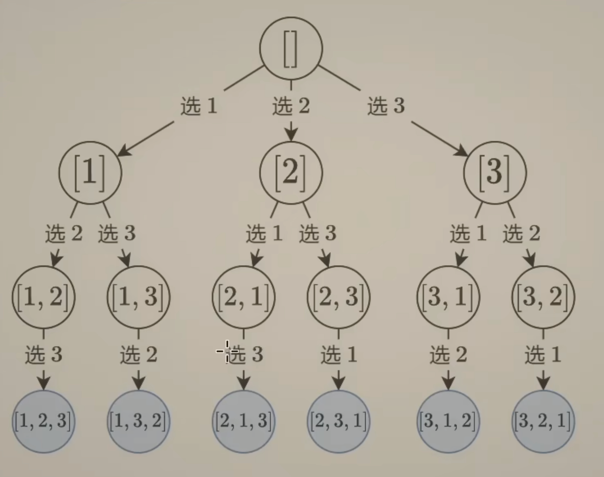
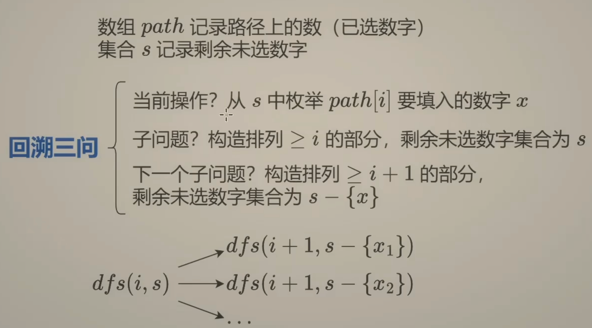
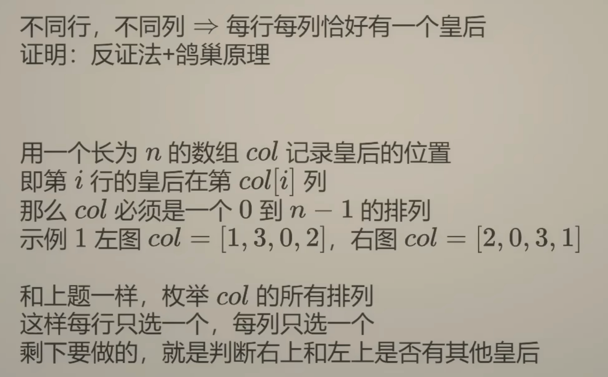
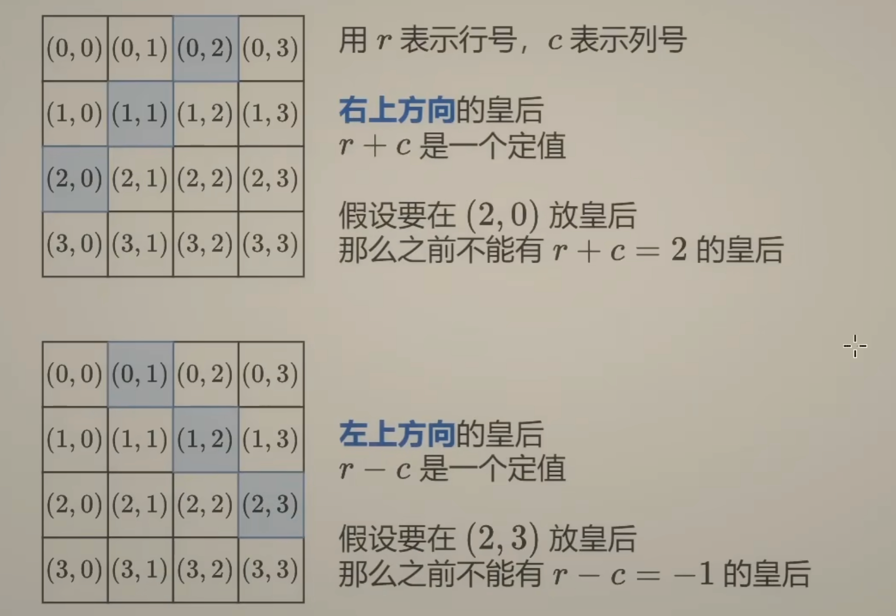
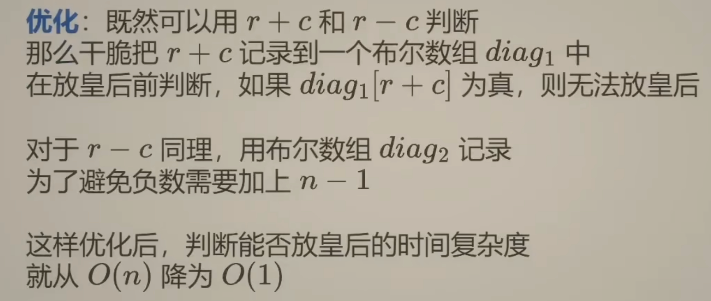

## 预备知识：

【视频】[回溯算法套路③排列型回溯+N皇后【基础算法精讲 16】](https://www.bilibili.com/video/BV1mY411D7f6/?spm_id_from=333.788&vd_source=b46c022ff65a946442d77e8b7b4b2646)

【STL】[常用C++ algorithm：next_permutation](https://yuihuang.com/cpp-algorithm-next-permutation/)

## [46. 全排列](https://leetcode.cn/problems/permutations/)

给定一个不含重复数字的数组 `nums` ，返回其 *所有可能的全排列* 。你可以 **按任意顺序** 返回答案。

 

**示例 1：**

```
输入：nums = [1,2,3]
输出：[[1,2,3],[1,3,2],[2,1,3],[2,3,1],[3,1,2],[3,2,1]]
```

**示例 2：**

```
输入：nums = [0,1]
输出：[[0,1],[1,0]]
```

**示例 3：**

```
输入：nums = [1]
输出：[[1]]
```

### 集合划分

#### 思路

「排列」和「组合」不同之处在于元素的顺序是有要求的，例如[1,2]和[2,3]的顺序不同，它们是不同的排列，但是是相同的组合。



对于这个排列问题的搜索树，每个答案（叶子节点）的长度都是相同的，因此树的高度是固定的。每一层节点的长度也是相同的，这意味着DFS每往下递归一次，都代表着选择一个新的数字作为子串的一部分。

什么是“新的数字呢”，就是对于当前从根到叶子节点的path中，没有被path选择过的数字。我们用用一个集合unordered_set存储当前未被选择的数字，用一个子集path表示当前已经被选择的数字。如果path的长度等于nums.size()，说明找到了一个答案；否则继续DFS向下递归回溯。



#### 代码

```cpp
// path存储已经选过的数字, unordered_set存储没有被选过的数字
class Solution
{
public:
    vector<vector<int>> permute(vector<int> &nums)
    {
        int n = nums.size();
        vector<vector<int>> res;
        vector<int> path;
        function<void(unordered_set<int>)> dfs = [&](unordered_set<int> s)
        {
            if (path.size() == n)
            {
                res.emplace_back(path);
                return;
            }
            for (auto it = s.begin(); it != s.end();)
            {
                int x = *it;
                path.push_back(x);
                it = s.erase(it);
                dfs(s);
                path.pop_back();
                s.insert(x);
            }
        };
        dfs(unordered_set<int>(nums.begin(), nums.end()));
        return res;
    }
};
```

注意unordered_set不可以传递引用给DFS函数，因为在递归和回溯时，需要还原现场，集合对于两个子树而言，状态是不一样的。（实际上只要是回溯，就不能传引用）

> 为什么“回溯”和一般的递归（DFS）不一样呢，总是要手动删除来进行回溯？
>
> 本质原因是递归本身就能自动回溯，而数组不可以，只要递归策略正确，那么一定可以枚举所有可能的情况。这个问题的目的是求一个集合，集合中的每个元素是一个结果，从递归树来看，这个结果就是从根节点到叶子节点组成的路径。而这条路径是我们手动记录的，但是它不会因为递归的返回而自动撤销，所以需要我们手动删除，以避免它对后续搜索产生影响。这样当返回时，就好像什么都没有发生，这样才可以递归到当前层的另外一个分支，所以回溯的操作叫做“恢复现场”。

#### 复杂度分析

- 时间复杂度：$O(n)$。
- 空间复杂度：$O(n)$。

### 标记

#### 思路

用哈希表表示未被选择的集合的方法中，每次选择新

#### 代码

```cpp
class Solution
{
public:
    vector<vector<int>> permute(vector<int> &nums)
    {
        int n = nums.size();
        vector<vector<int>> res;
        vector<int> path;
        vector<bool> visited(n, false);
        // dfs(i) 枚举答案的每一位
        function<void(int)> dfs = [&](int i)
        {
            if (i == n)
            {
                res.emplace_back(path);
                return;
            }
            for (int j = 0; j < n; j++)
            {
                if (visited[j] == false) // 选一个未被选择的数字
                {
                    path.push_back(nums[j]);
                    visited[j] = true;
                    dfs(i + 1);
                    path.pop_back();
                    visited[j] = false;
                }
            }
        };
        dfs(0);
        return res;
    }
};
```


#### 复杂度分析

- 时间复杂度：$O(n*n!)$。
- 空间复杂度：$O(n)$。

## [51. N 皇后](https://leetcode.cn/problems/n-queens/)

按照国际象棋的规则，皇后可以攻击与之处在同一行或同一列或同一斜线上的棋子。

**n 皇后问题** 研究的是如何将 `n` 个皇后放置在 `n×n` 的棋盘上，并且使皇后彼此之间不能相互攻击。

给你一个整数 `n` ，返回所有不同的 **n 皇后问题** 的解决方案。

每一种解法包含一个不同的 **n 皇后问题** 的棋子放置方案，该方案中 `'Q'` 和 `'.'` 分别代表了皇后和空位。

 

**示例 1：**


```
输入：n = 4
输出：[[".Q..","...Q","Q...","..Q."],["..Q.","Q...","...Q",".Q.."]]
解释：如上图所示，4 皇后问题存在两个不同的解法。
```

**示例 2：**

```
输入：n = 1
输出：[["Q"]]
```

### 集合划分

#### 思路

使得N皇后成立的棋盘中，所有皇后行列下标分别组成的集合都是一个[0, n-1]的全排列。如示例1的第一个棋盘，从上到下枚举每一行，那么列集合是[1, 3, 0, 2]。



那么我们可以用一个哈希表来存储来存储当前还未使用的列，每次递归尝试放置皇后时会从集合中移除相应的列，以保证不在同一列放置多个皇后。这样在递归时，我们只需要判断斜线是否冲突即可。

数据结构：

- `cols`：存储已经放置皇后的列索引。它用来判断斜线是否冲突，以及构造答案。
- `s`：存储还未使用过的列索引。由于它是一个set，所以能保证所有可能的列索引集合都是[0, n-1]的一个全排列。



DFS从上到下枚举每一行，在DFS内部枚举当前行可以放置的每一列（即当前哈希表中的元素）。因此斜线只需要检查当前点(row, col)的左上方（行数-列数是恒定值）和右上方（行数+列数是恒定值）。

#### 代码

```cpp
class Solution
{
public:
    vector<vector<string>> solveNQueens(int n)
    {
        vector<vector<string>> res;
        vector<int> cols(n, -1);
        // 检查(row, col)位置的斜线是否冲突
        function<bool(int, int)> check = [&](int row, int col)
        {
            for (int r = 0; r < row; r++) // 遍历当前所有行:[0, row-1]
            {
                int c = cols[r];
                if (r + c == row + col || c - r == col - row)
                    return false;
            }
            return true;
        };
        // DFS遍历所有行
        function<void(int, unordered_set<int>)> dfs = [&](int row, unordered_set<int> s)
        {
            if (row == n) // 找到一个答案
            {
                vector<string> board(n, string(n, '.')); // 初始化棋盘
                for (auto &r : cols)
                    board[r][cols[r]] = 'Q'; // 放置皇后
                res.emplace_back(board);
                return;
            }
            for (auto it = s.begin(); it != s.end();) // 尝试当前行的每一列
            {
                int col = *it;
                if (check(row, col))
                {
                    cols[row] = col;
                    it = s.erase(it); // 删除当前列并更新迭代器
                    // s.erase(it++); // 等价
                    dfs(row + 1, s);
                    s.insert(col); // 回溯
                }
                else
                {
                    ++it; // 当前列不合适，移动到下一列
                }
            }
        };
        unordered_set<int> s; // 保证同行同列不冲突
        for (int i = 0; i < n; i++) s.insert(i);
        dfs(0, s);
        return res;
    }
};
```

需要注意关联式容器同时erase和insert会使迭代器失效，所以要在删除后更新迭代器。参考：[【C++ STL】迭代器失效的几种情况总结 ](https://www.cnblogs.com/linuxAndMcu/p/14621819.html)

#### 复杂度分析

- 时间复杂度：$O(n^2*n!)$。每找到一个答案需要$O(n^2)$，叶子节点个数是$O(n!)$。
- 空间复杂度：$O(n)$。

### 标记

#### 思路



#### 代码

```cpp
class Solution
{
public:
    vector<vector<string>> solveNQueens(int n)
    {
        vector<vector<string>> res;
        vector<int> cols(n, -1);
        vector<bool> visited(n, false); // 标记列索引是否被使用过
        vector<bool> diag1(2 * n - 1, false); // 主对角线是否正在被使用
        vector<bool> diag2(2 * n - 1, false); // 副对角线是否正在被使用

        // DFS遍历所有行
        function<void(int)> dfs = [&](int row)
        {
            if (row == n) // 找到一个答案
            {
                vector<string> board(n, string(n, '.')); // 初始化棋盘
                for (auto &r : cols)
                    board[r][cols[r]] = 'Q'; // 放置皇后
                res.emplace_back(board);
                return;
            }
            for (int col = 0; col < n; col++) // 尝试当前行的每一列
            {
                if (visited[col] == false && diag1[row + col] == false && diag2[n + row - col + 1] == false)
                {
                    cols[row] = col;
                    visited[col] = diag1[row + col] = diag2[n + row - col + 1] = true;
                    dfs(row + 1);
                    visited[col] = diag1[row + col] = diag2[n + row - col + 1] = false;
                }
            }
        };
        dfs(0);
        return res;
    }
};
```

#### 复杂度分析

- 时间复杂度：$O(n^2*n!)$。每找到一个答案需要$O(n^2)$，叶子节点个数是$O(n!)$。
- 空间复杂度：$O(n)$。

### 直接回溯

#### 思路


#### 代码

```cpp
class Solution
{
public:
    vector<vector<string>> solveNQueens(int n)
    {
        vector<vector<string>> res;
        vector<int> cols(n, -1);
        function<bool(int, int)> check = [&](int row, int col)
        {
            for (int r = 0; r < row; r++)
            {
                int c = cols[r];
                // 检查同列和对角线
                if (c == col || r + c == row + col || c - r == col - row)
                    return false;
            }
            return true;
        };
        function<void(int)> dfs = [&](int row)
        {
            if (row == n)
            {
                vector<string> board(n, string(n, '.'));
                for (int r = 0; r < n; r++)
                    board[r][cols[r]] = 'Q';
                res.emplace_back(board);
                return;
            }
            for (int col = 0; col < n; col++)
            {
                if (check(row, col))
                {
                    cols[row] = col;
                    dfs(row + 1);
                    // 回溯时无需手动恢复 cols[row] = -1，
                    // 因为下一次成功放置皇后会覆盖当前值
                }
            }
        };
        dfs(0);
        return res;
    }
};
```

#### 复杂度分析

- 时间复杂度：$O(n^2*n!)$。每找到一个答案需要$O(n^2)$，叶子节点个数是$O(n!)$。
- 空间复杂度：$O(n)$。

## [2850. 将石头分散到网格图的最少移动次数](https://leetcode.cn/problems/minimum-moves-to-spread-stones-over-grid/)

给你一个大小为 `3 * 3` ，下标从 **0** 开始的二维整数矩阵 `grid` ，分别表示每一个格子里石头的数目。网格图中总共恰好有 `9` 个石头，一个格子里可能会有 **多个** 石头。

每一次操作中，你可以将一个石头从它当前所在格子移动到一个至少有一条公共边的相邻格子。

请你返回每个格子恰好有一个石头的 **最少移动次数** 。

 

**示例 1：**


```
输入：grid = [[1,1,0],[1,1,1],[1,2,1]]
输出：3
解释：让每个格子都有一个石头的一个操作序列为：
1 - 将一个石头从格子 (2,1) 移动到 (2,2) 。
2 - 将一个石头从格子 (2,2) 移动到 (1,2) 。
3 - 将一个石头从格子 (1,2) 移动到 (0,2) 。
总共需要 3 次操作让每个格子都有一个石头。
让每个格子都有一个石头的最少操作次数为 3 。
```

**示例 2：**


```
输入：grid = [[1,3,0],[1,0,0],[1,0,3]]
输出：4
解释：让每个格子都有一个石头的一个操作序列为：
1 - 将一个石头从格子 (0,1) 移动到 (0,2) 。
2 - 将一个石头从格子 (0,1) 移动到 (1,1) 。
3 - 将一个石头从格子 (2,2) 移动到 (1,2) 。
4 - 将一个石头从格子 (2,2) 移动到 (2,1) 。
总共需要 4 次操作让每个格子都有一个石头。
让每个格子都有一个石头的最少操作次数为 4 。
```

### 算法

#### 思路


#### 代码

```cpp
class Solution
{
public:
    int minimumMoves(vector<vector<int>> &grid)
    {
        vector<pair<int, int>> from;
        vector<pair<int, int>> to;
        for (int i = 0; i < grid.size(); i++)
        {
            for (int j = 0; j < grid[0].size(); j++)
            {
                if (grid[i][j])
                {
                    for (int k = 1; k < grid[i][j]; k++)
                        from.emplace_back(i, j);
                }
                else
                    to.emplace_back(i, j);
            }
        }
        int res = INT_MAX;
        do
        {
            int total = 0;
            for (int i = 0; i < from.size(); i++)
            {
                total += (abs(from[i].first - to[i].first) +
                          abs(from[i].second - to[i].second));
            }
            res = min(res, total);
        } while (next_permutation(from.begin(), from.end()));

        return res;
    }
};
```


#### 复杂度分析

- 时间复杂度：$O(n)$。
- 空间复杂度：$O(n)$。

### 算法

#### 思路


#### 代码

```cpp

```


#### 复杂度分析

- 时间复杂度：$O(n)$。
- 空间复杂度：$O(n)$。

### 算法

#### 思路


#### 代码

```cpp

```


#### 复杂度分析

- 时间复杂度：$O(n)$。
- 空间复杂度：$O(n)$。

### 算法

#### 思路


#### 代码

```cpp

```


#### 复杂度分析

- 时间复杂度：$O(n)$。
- 空间复杂度：$O(n)$。