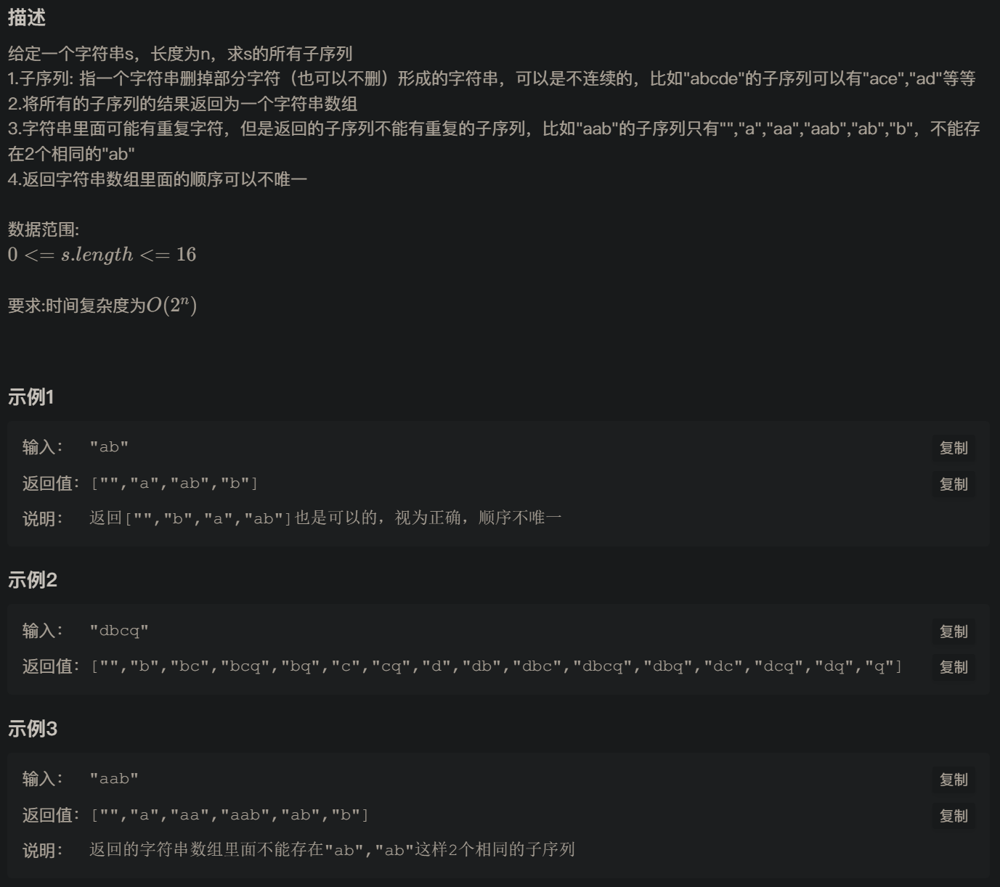
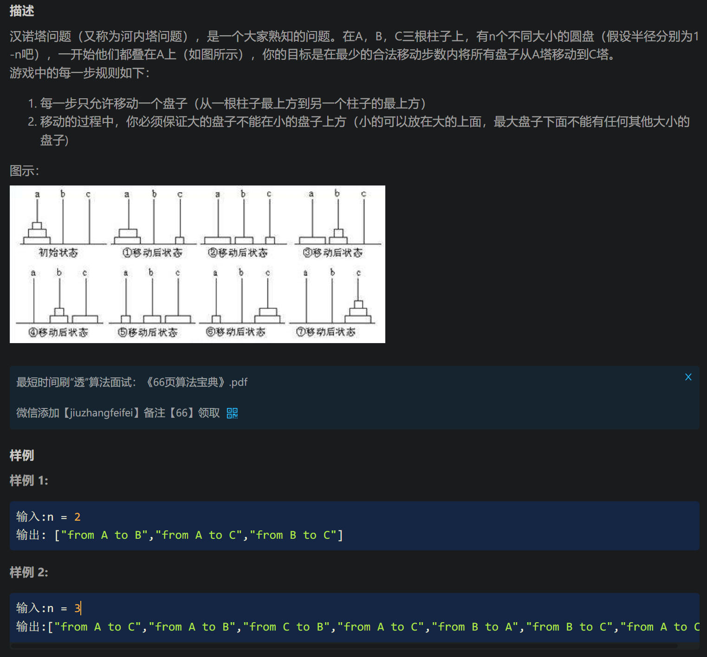

## 预备知识

【视频】

- [回溯算法套路①子集型回溯【基础算法精讲 14】](https://www.bilibili.com/video/BV1mG4y1A7Gu/?spm_id_from=333.788&vd_source=b46c022ff65a946442d77e8b7b4b2646)
- [算法讲解038【必备】常见经典递归过程解析](https://www.bilibili.com/video/BV19m4y1n7mo/?spm_id_from=333.999.0.0&vd_source=b46c022ff65a946442d77e8b7b4b2646)

【博客】

- [回溯算法入门级详解](https://leetcode.cn/problems/permutations/solutions/9914/hui-su-suan-fa-python-dai-ma-java-dai-ma-by-liweiw/)

### 输入角度，选或不选

输入角度就是从无到有构建答案的过程，是从递归树的根节点到叶子节点的过程。每一层都代表着一个元素，每层的两个分支都表示“选或者不选”。

### 答案角度，枚举选哪个

这个角度更像双指针，dfs(i)表示枚举每一个元素，在每个dfs()内部，有一个循环for(j in range(i, n))，枚举i后面的所有剩余元素。这样i之前的元素就表示已经被考虑过的，j之后的元素就表示未被考虑过的。

[78\. 子集](https://leetcode.cn/problems/subsets/description/)
------------------------------------------------------------

给你一个整数数组 `nums` ，数组中的元素 **互不相同** 。返回该数组所有可能的

子集

（幂集）。

解集 **不能** 包含重复的子集。你可以按 **任意顺序** 返回解集。

**示例 1：**

**输入：**nums = \[1,2,3\]
**输出：**\[\[\],\[1\],\[2\],\[1,2\],\[3\],\[1,3\],\[2,3\],\[1,2,3\]\]

**示例 2：**

**输入：**nums = \[0\]
**输出：**\[\[\],\[0\]\]

**提示：**

*   `1 <= nums.length <= 10`
*   `-10 <= nums[i] <= 10`
*   `nums` 中的所有元素 **互不相同**

### 选或不选

#### 思路

选或不选+回溯。

#### 代码

```cpp
class Solution {
public:
    vector<vector<int>> subsets(vector<int>& nums) {
        vector<vector<int>> res;
        vector<int> path;
        int n = nums.size();
        if (n == 0) return res;
        function<void(int)> dfs = [&](int i)
        {
            if (i == n)
            {
                res.push_back(path);
                return;
            }
            // 选，加入到路径中
            path.push_back(nums[i]);
            dfs(i + 1);
            // 不选，从路径中移出
            path.pop_back();
            dfs(i + 1);
        };
        dfs(0);
        return res;
    }
};
```

> 为什么“回溯”和一般的递归（DFS）不一样呢，总是要手动删除来进行回溯？
>
> 本质原因是递归本身就能自动回溯，而数组不可以，只要递归策略正确，那么一定可以枚举所有可能的情况。这个问题的目的是求一个集合，集合中的每个元素是一个结果，从递归树来看，这个结果就是从根节点到叶子节点组成的路径。而这条路径是我们手动记录的，但是它不会因为递归的返回而自动撤销，所以需要我们手动删除，以避免它对后续搜索产生影响。这样当返回时，就好像什么都没有发生，这样才可以递归到当前层的另外一个分支，所以回溯的操作叫做“恢复现场”。

#### 复杂度分析

- 时间复杂度：$O(n)$。
- 空间复杂度：$O(n)$。

## [字符串的全部子序列](https://www.nowcoder.com/practice/92e6247998294f2c933906fdedbc6e6a)



### 选或不选

#### 思路

这道题和上面的思路相同，需要注意的是这题可能存在相同的子序列，需要对它进行去重。

#### 代码

```cpp
#include <functional>
#include <vector>
class Solution {
public:
    vector<string> generatePermutation(string s) {
        set<string> res;
        int n = s.size();
        string path;
        function<void(int)> dfs = [&](int i)
        {
            if (i == n)
            {
                res.insert(path);
                return;
            }
            path.push_back(s[i]);
            dfs(i + 1);
            path.pop_back();
            dfs(i + 1);
        };
        dfs(0);
        return vector<string>(res.begin(), res.end());
    }
};
```


#### 复杂度分析

- 时间复杂度：$O(n)$。
- 空间复杂度：$O(n)$。

[90\. 子集 II](https://leetcode.cn/problems/subsets-ii/description/)
------------------------------------------------------------------

给你一个整数数组 `nums` ，其中可能包含重复元素，请你返回该数组所有可能的

子集

（幂集）。

解集 **不能** 包含重复的子集。返回的解集中，子集可以按 **任意顺序** 排列。

**示例 1：**

**输入：**nums = \[1,2,2\]
**输出：**\[\[\],\[1\],\[1,2\],\[1,2,2\],\[2\],\[2,2\]\]

**示例 2：**

**输入：**nums = \[0\]
**输出：**\[\[\],\[0\]\]

**提示：**

*   `1 <= nums.length <= 10`
*   `-10 <= nums[i] <= 10`

### 选或不选

#### 思路

本题相较于『78. 子集』而言，唯一的区别在于要对数组进行排序，因为子集只和元素的种类及其个数有关，和元素的顺序无关。

例如nums = [1,5,1]，直接用『78. 子集』的代码：

```
[[],[1],[1,1],[1,5],[1,5,1],[5],[5,1]]
```

预期结果：

```
[[],[1],[1,1],[1,1,5],[1,5],[5]]
```

其中

[1, 5]和[5, 1]属于同一子集，排序可以简化去重的过程。

#### 代码

```cpp
class Solution {
public:
    vector<vector<int>> subsetsWithDup(vector<int>& nums) {
        int n = nums.size();
        set<vector<int>> res;
        vector<int> path;
        sort(nums.begin(), nums.end());
        function<void(int)> dfs = [&](int i)
        {
            if (i == n)
            {
                res.insert(path);
                return;
            }
            path.push_back(nums[i]);
            dfs(i + 1);
            path.pop_back();
            dfs(i + 1);
        };
        dfs(0);
        return vector(res.begin(), res.end());
    }
};
```


#### 复杂度分析

- 时间复杂度：$O(n)$。
- 空间复杂度：$O(n)$。

### 枚举选哪个

#### 思路

在递归生成子集的过程中，检查当前元素是否与前一个元素相同。如果相同，并且前一个元素没有被选择（即它在同一递归层级中没有被包括），则跳过当前元素。

子集问题的目的是求一个集合的幂集（所有子集的集合），排序和上面的操作保证了每一次递归都能产生一个新的集合，所以每次递归的一开始都将当前组合填到答案中。

子集型回溯，对于当前索引i，考虑枚举[i, n-1]之间的组合。这个角度更像双指针，dfs(i)表示枚举每一个元素，在每个dfs()内部，有一个循环for(j in range(i, n))，枚举i后面的所有剩余元素。这样i之前的元素就表示已经被考虑过的，j之后的元素就表示未被考虑过的。

#### 代码

```cpp
class Solution {
public:
    vector<vector<int>> subsetsWithDup(vector<int>& nums) {
        vector<vector<int>> res;
        vector<int> path;
        sort(nums.begin(), nums.end());
        function<void(int)> dfs = [&](int i) 
        {
            res.push_back(path);
            for (int j = i; j < nums.size(); j++) 
            {
                // 检查当前元素是否与前一个元素相同，并且前一个元素没有被选入
                if (j > i && nums[j] == nums[j - 1]) continue;
                path.push_back(nums[j]);
                dfs(j + 1);
                path.pop_back();
            }
        };
        dfs(0);
        return res;
    }
};
```

`j > i` 确保我们在同一层的递归中比较当前元素与前一个元素，此跳过重复元素的过程在下面的『[40. 组合总和 II](https://leetcode.cn/problems/combination-sum-ii/)』还会遇到。

> 这个过程非常关键，需要掌握。

#### 复杂度分析

- 时间复杂度：$O(n)$。
- 空间复杂度：$O(n)$。

[77\. 组合](https://leetcode.cn/problems/combinations/description/)
-----------------------------------------------------------------

给定两个整数 `n` 和 `k`，返回范围 `[1, n]` 中所有可能的 `k` 个数的组合。

你可以按 **任何顺序** 返回答案。

**示例 1：**

**输入：**n = 4, k = 2
**输出：**
\[
  \[2,4\],
  \[3,4\],
  \[2,3\],
  \[1,2\],
  \[1,3\],
  \[1,4\],
\]

**示例 2：**

**输入：**n = 1, k = 1
**输出：**\[\[1\]\]

**提示：**

*   `1 <= n <= 20`
*   `1 <= k <= n`

### 枚举选哪个

#### 思路

延续上一题的思路。不一样的是题目要求的子集长度是k，所以当长度为k时再把它加到答案中。

#### 代码

```cpp
class Solution {
public:
    vector<vector<int>> combine(int n, int k) {
        vector<vector<int>> res;
        vector<int> path;

        function<void(int)> dfs = [&](int i) 
        {
            if (path.size() == k)
            {
                res.push_back(path);
                return;
            }
            for (int j = i; j <= n; j++)
            {
                path.push_back(j);
                dfs(j + 1);
                path.pop_back();
            }
        };
        dfs(1);
        return res;
    }
};
```


#### 复杂度分析

- 时间复杂度：$O(n)$。
- 空间复杂度：$O(n)$。

[39\. 组合总和](https://leetcode.cn/problems/combination-sum/description/)
----------------------------------------------------------------------

给你一个 **无重复元素** 的整数数组 `candidates` 和一个目标整数 `target` ，找出 `candidates` 中可以使数字和为目标数 `target` 的 所有 **不同组合** ，并以列表形式返回。你可以按 **任意顺序** 返回这些组合。

`candidates` 中的 **同一个** 数字可以 **无限制重复被选取** 。如果至少一个数字的被选数量不同，则两种组合是不同的。 

对于给定的输入，保证和为 `target` 的不同组合数少于 `150` 个。

**示例 1：**

**输入：**candidates = `[2,3,6,7],` target = `7`
**输出：**\[\[2,2,3\],\[7\]\]
**解释：**
2 和 3 可以形成一组候选，2 + 2 + 3 = 7 。注意 2 可以使用多次。
7 也是一个候选， 7 = 7 。
仅有这两种组合。

**示例 2：**

**输入:** candidates = \[2,3,5\]`,` target = 8
**输出:** \[\[2,2,2,2\],\[2,3,3\],\[3,5\]\]

**示例 3：**

**输入:** candidates = `[2],` target = 1
**输出:** \[\]

**提示：**

*   `1 <= candidates.length <= 30`
*   `2 <= candidates[i] <= 40`
*   `candidates` 的所有元素 **互不相同**
*   `1 <= target <= 40`

### 枚举选哪个

#### 思路

类似完全背包问题。

规定dfs(i, j)表示考虑前i个元素，剩余容量为j的组合。枚举[i, n-1]的所有可能选择k，因为可以重复选择，所以不从k+1开始，而是从k开始递归，容量要减掉第k个。

#### 代码

```cpp
class Solution {
public:
    vector<vector<int>> combinationSum(vector<int>& candidates, int target) {
        vector<vector<int>> res;
        vector<int> path;
        function<void(int, int)> dfs = [&](int i, int j) 
        {
            if (j == 0) // 容量恰好为0，说明这是一组正确答案
            {
                res.push_back(path);
                return;
            }
            if (j < 0) return; // 容量不足
            for (int k = i; k < candidates.size(); k++) 
            {
                path.push_back(candidates[k]);
                dfs(k, j - candidates[k]);
                path.pop_back();
            }
        };
        dfs(0, target);
        return res;
    }
};
```


#### 复杂度分析

- 时间复杂度：$O(n)$。
- 空间复杂度：$O(n)$。

### 选或不选

#### 思路


#### 代码

```cpp

```


#### 复杂度分析

- 时间复杂度：$O(n)$。
- 空间复杂度：$O(n)$。

[40\. 组合总和 II](https://leetcode.cn/problems/combination-sum-ii/description/)
----------------------------------------------------------------------------

给定一个候选人编号的集合 `candidates` 和一个目标数 `target` ，找出 `candidates` 中所有可以使数字和为 `target` 的组合。

`candidates` 中的每个数字在每个组合中只能使用 **一次** 。

**注意：**解集不能包含重复的组合。 

**示例 1:**

**输入:** candidates = `[10,1,2,7,6,1,5]`, target = `8`,
**输出:**
\[
\[1,1,6\],
\[1,2,5\],
\[1,7\],
\[2,6\]
\]

**示例 2:**

**输入:** candidates = \[2,5,2,1,2\], target = 5,
**输出:**
\[
\[1,2,2\],
\[5\]
\]

**提示:**

*   `1 <= candidates.length <= 100`
*   `1 <= candidates[i] <= 50`
*   `1 <= target <= 30`

### 选或不选

#### 思路


#### 代码

```cpp

```


#### 复杂度分析

- 时间复杂度：$O(n)$。
- 空间复杂度：$O(n)$。

### 枚举选哪个

#### 思路

延续『40. 组合总和 I』的思路。

不同的是这道题类似01-背包，每个物品要么不选，要么只能被选一次。并且题目要求组合是不同的，因此通过对数组进行排序，相同的数字将会排在一起。在递归过程中，如果当前的数字与前一个数字相同，并且前一个数字没有被选中，我们可以跳过当前数字，从而避免生成重复的组合。

去重：所以在递归中枚举[i, n-1]的过程中，通过比较当前元素和前一个元素来跳过重复的元素。

剪枝：当当前的元素大于剩余的目标 `target` 时，可以直接跳出循环，因为后续的元素一定也无法满足条件。（这由排序保证）

#### 代码

```cpp
class Solution {
public:
    vector<vector<int>> combinationSum2(vector<int>& candidates, int target) {
        vector<vector<int>> res;
        vector<int> path;
        ranges::sort(candidates);
        function<void(int, int)> dfs = [&](int i, int j) 
        {
            if (j == 0) // 容量恰好为0，说明这是一组正确答案
            {
                res.push_back(path);
                return;
            }
            if (j < 0) return; // 容量不足
            for (int k = i; k < candidates.size(); k++) 
            {
                if (k > i && candidates[k] == candidates[k - 1]) continue;
                if (j < candidates[k]) break;
                path.push_back(candidates[k]);
                dfs(k + 1, j - candidates[k]);
                path.pop_back();
            }
        };
        dfs(0, target);
        return res;
    }
};
```


#### 复杂度分析

- 时间复杂度：$O(n)$。
- 空间复杂度：$O(n)$。

[46\. 全排列](https://leetcode.cn/problems/permutations/description/)
------------------------------------------------------------------

给定一个不含重复数字的数组 `nums` ，返回其 _所有可能的全排列_ 。你可以 **按任意顺序** 返回答案。

**示例 1：**

**输入：**nums = \[1,2,3\]
**输出：**\[\[1,2,3\],\[1,3,2\],\[2,1,3\],\[2,3,1\],\[3,1,2\],\[3,2,1\]\]

**示例 2：**

**输入：**nums = \[0,1\]
**输出：**\[\[0,1\],\[1,0\]\]

**示例 3：**

**输入：**nums = \[1\]
**输出：**\[\[1\]\]

**提示：**

*   `1 <= nums.length <= 6`
*   `-10 <= nums[i] <= 10`
*   `nums` 中的所有整数 **互不相同**

### 库函数（next_permutation）

#### 思路

使用库函数`next_permutation`来生成全排列，注意使用前要先排序，因为它是按照字典顺序生成的，以避免漏掉。

#### 代码

```cpp
class Solution {
public:
    vector<vector<int>> permute(vector<int>& nums) {
        vector<vector<int>> res;
        ranges::sort(nums);
        do {
            res.push_back(nums);
        }while (next_permutation(nums.begin(), nums.end()));
        return res;
    }
};
```

#### 复杂度分析

- 时间复杂度：$O(n)$。
- 空间复杂度：$O(n)$。

### 枚举选哪个

#### 思路

全排列没有『选或不选』的写法，因为是全排列，所以集合中的每个元素的长度都和原数组一样。

回到递归树中，每一条路径的长度都相等，造成不同分支的原因是当前层的选择，只能从没有被选过的元素中递归。

优化：因为path的长度一定和原数组相等，所以回溯时path就不用手动删除，而是直接覆盖，前提是首先要给path数组扩容到n。

#### 代码

```cpp
class Solution
{
public:
    vector<vector<int>> permute(vector<int> &nums)
    {
        int n = nums.size();
        vector<vector<int>> res;
        vector<int> path;
        vector<bool> visited(n, false);
        // dfs(i) 枚举答案的每一位
        function<void(int)> dfs = [&](int i)
        {
            if (i == n)
            {
                res.emplace_back(path);
                return;
            }
            for (int j = 0; j < n; j++)
            {
                if (visited[j] == false) // 选一个未被选择的数字
                {
                    path.push_back(nums[j]);
                    visited[j] = true;
                    dfs(i + 1);
                    visited[j] = false;
                    path.pop_back();
                }
            }
        };
        dfs(0);
        return res;
    }
};
```

#### 复杂度分析

- 时间复杂度：$O(n)$。
- 空间复杂度：$O(n)$。

### 交换法

#### 思路

每一层递归`dfs(i)`来到第`i`个位置的数，枚举`j=[i, n - 1]`：

- 如果`i`已经越界，到达`n`，那么说明找到了一个排列。
- 否则：
  1. 选择：在 `dfs` 函数中，`for` 循环控制从位置 `i` 开始的元素进行交换。每次交换都会选择一个新的排列方式。
    
  1. 探索：交换完元素后，递归调用 `dfs(i + 1)` 继续生成剩余元素的排列。这相当于深入探索这个选择下的所有可能结果。
    
  1. 撤销（回溯）：在递归调用结束后，通过 `swap(nums[i], nums[j])` 将之前交换的元素换回原来的位置，这一步是回溯的关键，它确保了在下一个 `j` 位置进行新的尝试时，`nums` 列表的状态是正确的。
  


例子

假设 `nums = [1, 2, 3]`：

- `i = 0` 时，`j` 从 `0` 开始：
  - `swap(nums[0], nums[0])`，`nums` 仍然是 `[1, 2, 3]`。
    - 递归 `dfs(1)`，进入下一个层次。
    - 继续交换和递归直到生成一个完整的排列 `[1, 2, 3]`。
    - 回溯后 `swap(nums[0], nums[0])`，`nums` 恢复为 `[1, 2, 3]`。
  - `swap(nums[0], nums[1])`，`nums` 变为 `[2, 1, 3]`。
    - 递归 `dfs(1)`，进入下一个层次。
    - 继续交换和递归直到生成一个完整的排列 `[2, 1, 3]`。
    - 回溯后 `swap(nums[0], nums[1])`，`nums` 恢复为 `[1, 2, 3]`。
  - 以此类推...

每次递归到 `i == n` 的时候，都会得到一个完整的排列，并将其添加到结果集中。

#### 代码

```cpp
class Solution
{
public:
    vector<vector<int>> permute(vector<int> &nums)
    {
        int n = nums.size();
        vector<vector<int>> res;
        function<void(int)> dfs = [&](int i)
        {
            if (i == n)
            {
                res.emplace_back(nums);
                return;
            }
            for (int j = i; j < n; j++)
            {
                swap(nums[i], nums[j]);
                dfs(i + 1);
                swap(nums[i], nums[j]);
            }
        };
        dfs(0);
        return res;
    }
};
```

可以和上面『枚举选哪个』的回溯代码对比一下。这个交换法的全排列算法实际上是回溯算法的一种实现形式，它利用了回溯的核心思想，通过递归和撤销操作来生成所有可能的排列。

必须要进行回溯操作，否则会出现重复的排列（视频讲解有）。

#### 复杂度分析

- 时间复杂度：$O(n! \times\ n)$。生成一个排列需要$O(n!)$，一共$n$个排列。
- 空间复杂度：$O(n)$。

[47\. 全排列 II](https://leetcode.cn/problems/permutations-ii/description/)
------------------------------------------------------------------------

给定一个可包含重复数字的序列 `nums` ，_**按任意顺序**_ 返回所有不重复的全排列。

**示例 1：**

**输入：**nums = \[1,1,2\]
**输出：**
\[\[1,1,2\],
 \[1,2,1\],
 \[2,1,1\]\]

**示例 2：**

**输入：**nums = \[1,2,3\]
**输出：**\[\[1,2,3\],\[1,3,2\],\[2,1,3\],\[2,3,1\],\[3,1,2\],\[3,2,1\]\]

**提示：**

*   `1 <= nums.length <= 8`
*   `-10 <= nums[i] <= 10`

### 枚举选哪个

#### 思路


#### 代码

```cpp
class Solution {
public:
    vector<vector<int>> permuteUnique(vector<int>& nums) {
        vector<vector<int>> res;
        vector<int> path;
        vector<bool> visited(nums.size(), false);
        sort(nums.begin(), nums.end());  // 排序以便跳过重复的元素
        function<void()> dfs = [&]() 
        {
            if (path.size() == nums.size()) 
            {
                res.push_back(path);
                return;
            }
            for (int i = 0; i < nums.size(); i++) 
            {
                if (visited[i]) continue;  // 如果当前元素已经被使用，跳过
                if (i > 0 && nums[i] == nums[i - 1] && !visited[i - 1]) continue;  // 跳过重复的元素
                visited[i] = true;
                path.push_back(nums[i]);
                dfs();
                path.pop_back();
                visited[i] = false;
            }
        };
        
        dfs();
        return res;
    }
};

```

#### 复杂度分析

- 时间复杂度：$O(n! \times\ n)$。生成一个排列需要$O(n!)$，一共$n$个排列。
- 空间复杂度：$O(n)$。

### 交换法+set1

#### 思路

思路跟上一题一样，只不过用set保存了结果。

#### 代码

```cpp
class Solution
{
public:
    vector<vector<int>> permuteUnique(vector<int> &nums)
    {
        int n = nums.size();
        set<vector<int>> res;
        function<void(int)> dfs = [&](int i)
        {
            if (i == n)
            {
                res.insert(nums);
                return;
            }
            for (int j = i; j < n; j++)
            {
                swap(nums[i], nums[j]);
                dfs(i + 1);
                swap(nums[i], nums[j]);
            }
        };
        dfs(0);
        return vector(res.begin(), res.end());
    }
};

```

但是插入set的时间复杂度是$O(n \log n)$。比回溯更慢。

#### 复杂度分析

- 时间复杂度：$O(n! \times\ n\log n)$。
- 空间复杂度：$O(n)$。

### 交换法+set2

#### 思路

回到造成重复排列的根本原因：原始数组中存在重复元素，造成了无效操作（交换，递归，回溯）。例如对于当前数字`nums[i]`，如果它和值相同的`nums[j]`交换，最终得到的排列是一样的，所以我们只需要当`nums[j]`没有被交换过才会用它来做排列数的元素。

#### 代码

```cpp
class Solution
{
public:
    vector<vector<int>> permuteUnique(vector<int> &nums)
    {
        int n = nums.size();
        vector<vector<int>> res;
        function<void(int)> dfs = [&](int i)
        {
            if (i == n)
            {
                res.emplace_back(nums);
                return;
            }
            set<int> visited;
            for (int j = i; j < n; j++)
            {
                if (!visited.contains(nums[j]))
                {
                    visited.insert(nums[j]);
                    swap(nums[i], nums[j]);
                    dfs(i + 1);
                    swap(nums[i], nums[j]);
                }
            }
        };
        dfs(0);
        return res;
    }
};

```

值得注意的是这个set是对于每一个`nums[i]`独有的，所以在每次递归时set都是空的。

#### 复杂度分析

- 时间复杂度：$O(n! \times\ n)$。生成一个排列需要$O(n!)$，一共$n$个排列。
- 空间复杂度：$O(n)$。

## [用递归函数和栈逆序一个栈](https://www.nowcoder.com/practice/1de82c89cc0e43e9aa6ee8243f4dbefd?tab=note)

描述

一个栈依次压入1,2,3,4,5，那么从栈顶到栈底分别为5,4,3,2,1。将这个栈转置后，从栈顶到栈底为1,2,3,4,5，也就是实现栈中元素的逆序，但是只能用递归函数来实现，不能用其他数据结构。

输入描述：

输入数据第一行一个整数N为栈中元素的个数。

接下来一行N个整数$X_i$表示一个栈依次压入的每个元素。

输出描述：

输出一行表示栈中元素逆序后的栈顶到栈底的每个元素

示例1

输入：

```
5
1 2 3 4 5
```

输出：

```
1 2 3 4 5
```

## [用递归函数和栈排序](https://www.luogu.com.cn/problem/P1177)

### 算法

#### 思路


#### 代码

```cpp

```


#### 复杂度分析

- 时间复杂度：$O(n)$。
- 空间复杂度：$O(n)$。

### 算法

#### 思路


#### 代码

```cpp

```


#### 复杂度分析

- 时间复杂度：$O(n)$。
- 空间复杂度：$O(n)$。

## [169 · 汉诺塔](https://www.lintcode.com/problem/169/description)



### 算法

#### 思路


#### 代码

```cpp
class Solution {
public:
    void f(int i, string from, string to, string other, vector<string> &res)
    {
        if (i == 1) res.push_back(string("from "+from+" to "+to));
        else
        {
            f(i - 1, from, other, to, res);
            res.push_back(string("from "+from+" to "+to));
            f(i - 1, other, to, from, res);
        }
    }
    vector<string> towerOfHanoi(int n) {
        vector<string> res;
        f(n, "A", "C", "B", res);
        return res;
    }
};
```


#### 复杂度分析

- 时间复杂度：$O(n)$。
- 空间复杂度：$O(n)$。

### 算法

#### 思路


#### 代码

```cpp

```


#### 复杂度分析

- 时间复杂度：$O(n)$。
- 空间复杂度：$O(n)$。

### 算法

#### 思路


#### 代码

```cpp

```


#### 复杂度分析

- 时间复杂度：$O(n)$。
- 空间复杂度：$O(n)$。

### 算法

#### 思路


#### 代码

```cpp

```


#### 复杂度分析

- 时间复杂度：$O(n)$。
- 空间复杂度：$O(n)$。

### 算法

#### 思路


#### 代码

```cpp

```


#### 复杂度分析

- 时间复杂度：$O(n)$。
- 空间复杂度：$O(n)$。

### 算法

#### 思路


#### 代码

```cpp

```


#### 复杂度分析

- 时间复杂度：$O(n)$。
- 空间复杂度：$O(n)$。