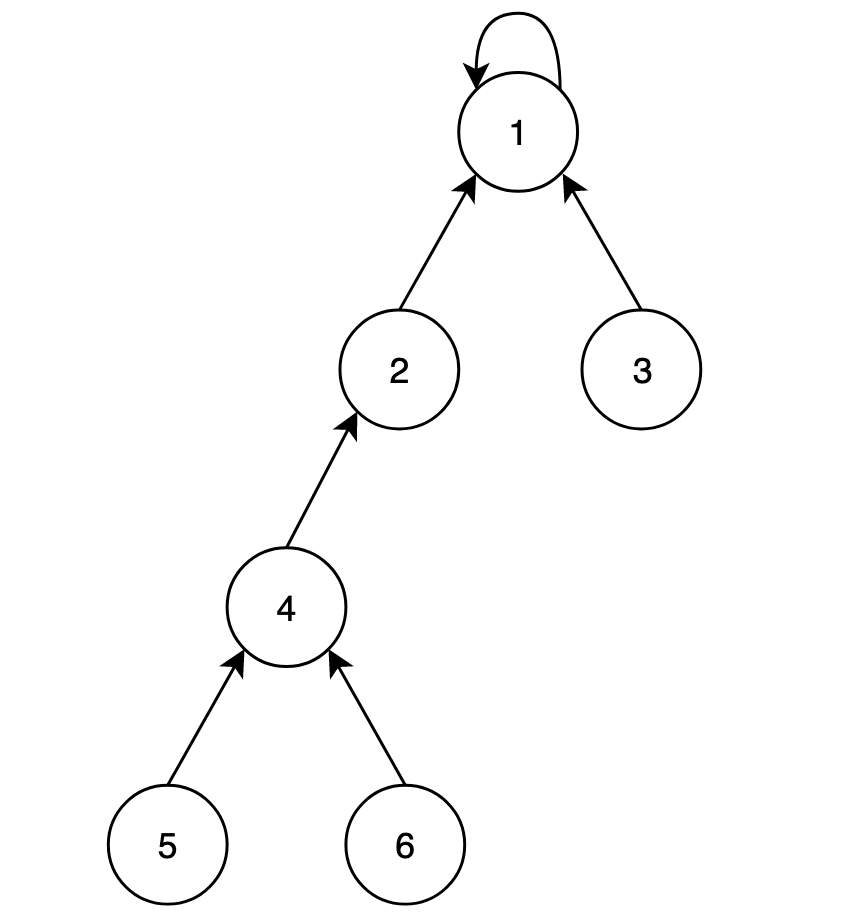
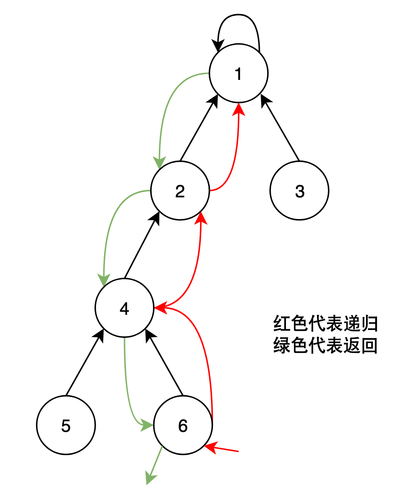
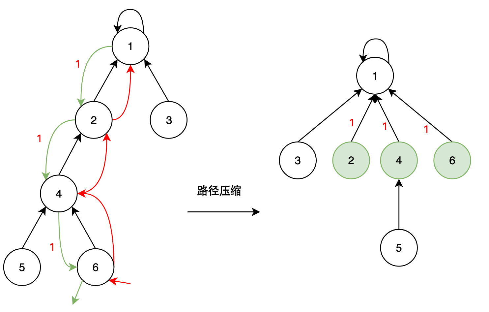
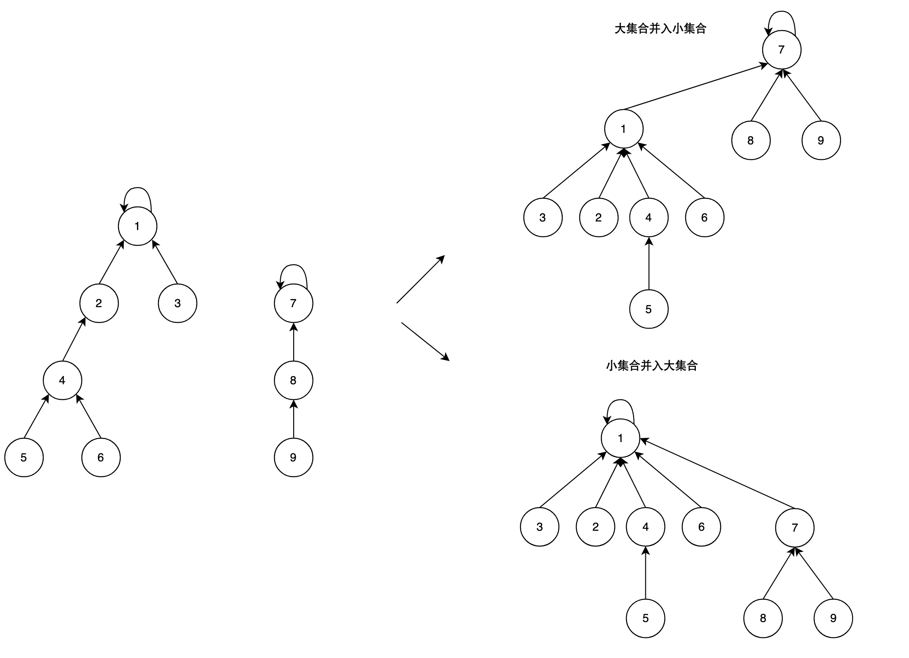

## 前置知识

并查集（Disjoint-set data structure，不交集数据结构）是一种树型的数据结构，用于处理一些不相交集合的合并及查询问题。 并查集的思想是用一个数组表示了整片森林（parent），树的根节点唯一标识了一个集合，我们只要找到了某个元素的的树根，就能确定它在哪个集合里。 并查集支持两种操作：

- 合并（Union）：把两个不相交的集合合并为一个集合。
- 查询（Find）：查询两个元素是否在同一个集合中。

例如，下面就是一个并查集：



我们用一个数组`p[x]`存储节点`x`的父节点，在上图中:

```text
p[1] = 1
p[2] = 1
p[3] = 1

p[4] = 2
p[5] = 4
p[6] = 4
```

默认根节点的父节点是它本身。

初始化`f[]`：每子树都是一个集合，每个节点的父节点都是它自己：

```cpp
for (int i = 1; i <= n; i++) f[i] = i;
```

### 查找 

每一个节点代表的子树都是一个集合，查找元素在此集合中，就是查找元素集合的根节点。

1. 如果父结点等于元素本身，即找到了根节点，返回。
2. 否则说明没有找到根节点，继续递归地查找。

例如要查找上图中的6节点是否在此集合中（`find(6)`）:

1. 首先从6进入树
2. 找到6的父节点4，不是根节点1，继续向上递归查找
3. 找到4的父节点2，不是根节点1，继续向上递归查找
4. 找到2的父节点1，是根节点1，查找成功，返回根节点的值。



代码示例：

```cpp
int find(int x)
{
	if(f[x] == x) return x;
	return find(f[x]);	
}
```

#### 路径压缩

可见，这样查找的效率是很低的，每次查找都要不断地递归。对于节点6，执行查找的过程中，将信息利用起来，这样下次查找6节点时就能直接得到答案，从而降低整体时间复杂度。

做法是这样的：在不断向上查找父节点的过程中，同时将各个节点的父节点改为根节点。如上例：



流程是这样的：

```text
[递归过程]
从6节点进入，找到父节点4
从4节点进入，找到父节点2
从2节点进入，找到父节点1
从1节点进入，返回

[返回过程]
从1节点回到2节点，修改f[2]=1，返回1
从2节点回到4节点，修改f[4]=1，返回1
从4节点回到6节点，修改f[6]=1，返回1
```

代码如下：

```cpp
// 路径压缩
int find(int x)
{
	if(f[x] == x) return f[x] = x;
	return find(f[x]);
}
```

相比于原本递归的代码，只增加了终止条件的赋值语句，表示在返回的同时更新节点的父节点为根节点。这就能直接对应上并查集中“查”的那一部分，赋值体现了“同时”。

因此现在`find()`对于未被查找过的元素还有压缩的功能。

### 合并

每个子树都是一个集合，那么每个并查集的也是一个集合，要将集合合并，也就是将一个并查集的根节点的父节点不再指向它本身，而是指向另外一个并查集的根节点。

```cpp
void unionset(int x, int y)
{
    f[find(x)] = find(y);
}
```

例如：



这两种不一样的合并结果会造成效率上的差异。例如大集合并入小集合，大于等于3层的节点个数是5个；小集合并入大集合，大于等于3层的节点个数是3个。明显后者合并后的集合查找效率更高。

#### 按秩合并

按秩合并就是将小集合并入大集合（高度）。

步骤：

0. 用一个数组`size[i]`存储值为`i`的节点对应的子树中的元素个数。
   1. 默认将`x`并入`y`，也就是说默认`x`中的元素数量更小。
1. 初始化：将`size[]`元素置为1，因为每个节点都是一个集合，元素个数是1。
2. 用`find()`得到两个集合的根节点的值`x`和`y`。
   1. 如果相等，则说明`x`在`y`的集合中，则无需合并。
   2. 否则就要合并。
3. 合并步骤：
   1. 如果`x`中的元素数量更多，即`size[x]>size[y]`，那么将`x`和`y`的值交换，以符合预先设定。
   2. 将`x`并入`y`，即`f[x] = y`。
   3. 更新大集合`y`的`size`，即`size[y] += size[x]`。

代码：

```cpp
memset(size, 1, sizeof(size));
void unionset(int x, int y)
{
	x = find(x), y = find(y);
	if (x == y) return;
	if (size[x] > size[y]) swap(x, y);
	f[x] = y;
	size[y] += size[x];
}
```

实际上，只要对一个集合中的所有元素查找一遍，那么这个树就只有2层，这样再对两个集合合并时，最多也只有2层，即使不严格地满足，只要大部分节点执行了路径压缩，那么按秩合并就没有很大的意义。

按秩合并和路径压缩都是优化并查集的方法，它们的目的都是减少查询时的路径长度，提高查询效率。但是它们也有一些缺点：

- 按秩合并会增加合并时的判断和赋值操作，可能会降低合并的效率。
- 路径压缩会破坏树的结构，导致秩不再准确反映树的高度，可能会影响按秩合并的正确性。
- 路径压缩和按秩合并同时使用时，时间复杂度接近$O(1)$，但是实现起来比较复杂，需要维护额外的数组来记录秩。

因此，在选择使用哪种优化方法时，需要根据具体的问题和数据规模进行权衡。

### 时间复杂度

接近$O(1)$。

如上所述，只要大部分节点执行了路径压缩操作，那么后续再对其查找时，时间复杂度是$O(1)$。

### 参考资料

- [视频：110 并查集](https://www.bilibili.com/video/BV1W34y1L734/?spm_id_from=333.999.0.0&vd_source=b46c022ff65a946442d77e8b7b4b2646)

### 相关题目

- [Luogu题单：并查集模板题](https://www.luogu.com.cn/training/3065)

## [【模板】并查集](https://www.luogu.com.cn/problem/P3367)

题目描述

如题，现在有一个并查集，你需要完成合并和查询操作。

输入格式

第一行包含两个整数 $N,M$ ,表示共有 $N$ 个元素和 $M$ 个操作。

接下来 $M$ 行，每行包含三个整数 $Z_i,X_i,Y_i$ 。

当 $Z_i=1$ 时，将 $X_i$ 与 $Y_i$ 所在的集合合并。

当 $Z_i=2$ 时，输出 $X_i$ 与 $Y_i$ 是否在同一集合内，是的输出 
 `Y` ；否则输出 `N` 。

输出格式

对于每一个 $Z_i=2$ 的操作，都有一行输出，每行包含一个大写字母，为 `Y` 或者 `N` 。

样例 #1

样例输入 #1

```
4 7
2 1 2
1 1 2
2 1 2
1 3 4
2 1 4
1 2 3
2 1 4
```

样例输出 #1

```
N
Y
N
Y
```

提示

对于 $30\%$ 的数据，$N \le 10$，$M \le 20$。

对于 $70\%$ 的数据，$N \le 100$，$M \le 10^3$。

对于 $100\%$ 的数据，$1\le N \le 10^4$，$1\le M \le 2\times 10^5$，$1 \le X_i, Y_i \le N$，$Z_i \in \{ 1, 2 \}$。

### 算法

#### 思路

见上。

#### 代码

```cpp
#include <bits/stdc++.h>
using namespace std;

const int N = 10010;
int n, m;
int fa[N];

void init()
{
	for (int i = 1; i <= n; i++) fa[i] = i;
}

int find(int x)
{
	if (x == fa[x]) return x;
	return fa[x] = find(fa[x]);
}

void unionset(int x, int y)
{
	fa[find(x)] = find(y);
}

int main()
{
	cin >> n >> m;
	init();
	while (m--)
	{
		int z, x, y;
		cin >> z >> x >> y;
		if (z == 1) unionset(x, y);
		else if (z == 2)
		{
			if (find(x) == find(y)) cout << "Y" << endl;
			else cout << "N" << endl;
		}
	}
	return 0;
}
```

#### 复杂度分析

- 时间复杂度：均摊$O(1)$。
- 空间复杂度：$O(n)$。

[547\. 省份数量](https://leetcode.cn/problems/number-of-provinces/description/)
---------------------------------------------------------------------------

有 `n` 个城市，其中一些彼此相连，另一些没有相连。如果城市 `a` 与城市 `b` 直接相连，且城市 `b` 与城市 `c` 直接相连，那么城市 `a` 与城市 `c` 间接相连。

**省份** 是一组直接或间接相连的城市，组内不含其他没有相连的城市。

给你一个 `n x n` 的矩阵 `isConnected` ，其中 `isConnected[i][j] = 1` 表示第 `i` 个城市和第 `j` 个城市直接相连，而 `isConnected[i][j] = 0` 表示二者不直接相连。

返回矩阵中 **省份** 的数量。

**示例 1：**


**输入：** isConnected = \[\[1,1,0\],\[1,1,0\],\[0,0,1\]\]

**输出：** 2

**示例 2：**


**输入：** isConnected = \[\[1,0,0\],\[0,1,0\],\[0,0,1\]\]
**输出：** 3

**提示：**

*   `1 <= n <= 200`
*   `n == isConnected.length`
*   `n == isConnected[i].length`
*   `isConnected[i][j]` 为 `1` 或 `0`
*   `isConnected[i][i] == 1`
*   `isConnected[i][j] == isConnected[j][i]`

### 算法

#### 思路

初始状态将每个城市看做一个单独的集合，size用于记录连通分量的个数。两两枚举城市，如果它们是连通的，那就加到一个集合中。最终合并后的连通分量的个数就是省份的数量。（实际上对于邻接矩阵，只需要遍历矩阵的上三角）

#### 代码

```cpp
class Solution {
public:
    static const int N = 210;
    int fa[N];
    int size = 0;
    void init(int n) {
        iota(fa, fa + n, 0);
        size = n;
    }
    int find(int x) {
        if (x == fa[x]) return x;
        return fa[x] = find(fa[x]);
    }
    void unite(int x, int y) {
        x = find(x), y = find(y);
        if (x != y) {
            fa[x] = y;
            size--;
        }
    }
    int findCircleNum(vector<vector<int>>& isConnected) {
        int n = isConnected.size();
        init(n);
        for (int i = 0; i < n; i++) {
            for (int j = i + 1; j < n; j++) 
                if (isConnected[i][j] == 1) unite(i, j);
        }
        return size;
    }
};
```

这道题向我们揭示了并查集看待问题的视角，那就是“连通分量”。

#### 复杂度分析

- 时间复杂度：$O(n)$。
- 空间复杂度：$O(n)$。

[200\. 岛屿数量](https://leetcode.cn/problems/number-of-islands/description/)
-------------------------------------------------------------------------

给你一个由 `'1'`（陆地）和 `'0'`（水）组成的的二维网格，请你计算网格中岛屿的数量。

岛屿总是被水包围，并且每座岛屿只能由水平方向和/或竖直方向上相邻的陆地连接形成。

此外，你可以假设该网格的四条边均被水包围。

**示例 1：**

**输入：**grid = \[
  \["1","1","1","1","0"\],
  \["1","1","0","1","0"\],
  \["1","1","0","0","0"\],
  \["0","0","0","0","0"\]
\]

**输出：**1

**示例 2：**

**输入：**grid = \[
  \["1","1","0","0","0"\],
  \["1","1","0","0","0"\],
  \["0","0","1","0","0"\],
  \["0","0","0","1","1"\]
\]

**输出：**3

**提示：**

*   `m == grid.length`
*   `n == grid[i].length`
*   `1 <= m, n <= 300`
*   `grid[i][j]` 的值为 `'0'` 或 `'1'`

### 算法

#### 思路

初始情况把所有的`'1'`都看做一个单独的集合，`'0'`就不需要考虑了。对于每一个`'1'`，我们只考虑合并它的上方和左方的`'1'`，而不用枚举4个方向，因为对于当前位置的`'1'`来说，它向下合并，和它下面的位置向上合并是一样的。

当所有`'1'`都合并了它的上方和左方的`'1'`之后，所有集合的个数就是岛屿的数量。

关键点：

- 用一个计数器`size`记录当前区域中集合的个数，初始情况它的个数就是`'1'`的个数。
- 这个并查集模板中，`fa`数组的索引`x`是元素的**序号**，`fa[x]`的值是`x`的父节点的序号。但是这道题中每个元素都需要用一个二维下标标识，这可以用函数`get_index`将二维下标转换为一维序号，这样我们就可以方便地操作`'1'`了。
- 当两个集合合并时，需要对`size`做-1操作，但是两个集合在同一个集合中时，就不需要做-1操作。

#### 代码

```cpp
class Solution {
public:
    static const int N = 90000;
    int size = 0; // 集合数
    int fa[N];
    int n = 0, m = 0;

    int get_index(int i, int j) { return i * m + j; }
    int find(int x) {
        if (x == fa[x])
            return x;
        return fa[x] = find(fa[x]);
    }
    void union_set(int x, int y) {
        x = find(x), y = find(y);
        if (x != y) // x和y不在同一个集合才合并，集合数-1
        {
            fa[x] = y;
            size--;
        }
    }
    void init(vector<vector<char>>& grid) {
        for (int i = 0; i < n; i++) {
            for (int j = 0; j < m; j++) {
                if (grid[i][j] == '1') { // 每一个'1'都作为一个集合
                    int x = get_index(i, j); // 从二维(i, j)转换为一维(x)坐标
                    fa[x] = x;
                    size++;
                }
            }
        }
    }
    int numIslands(vector<vector<char>>& grid) {
        this->n = grid.size(), this->m = grid[0].size();
        init(grid);
        for (int i = 0; i < n; i++) {
            for (int j = 0; j < m; j++) {
                if (grid[i][j] == '1') // 只有'1'才能合并其它位置的资格
                {
                    // 向上一行的'1'合并
                    if (i > 0 && grid[i - 1][j] == '1') {
                        union_set(get_index(i, j), get_index(i - 1, j));
                    }
                    // 向左一列的'1'合并
                    if (j > 0 && grid[i][j - 1] == '1') {
                        union_set(get_index(i, j), get_index(i, j - 1));
                    }
                }
            }
        }
        return size;
    }
};
```

#### 复杂度分析

- 时间复杂度：$O(n*m)$。并查集查询和合并的代价均摊为$O(1)$，最多有$n*m$个集合需要合并。
- 空间复杂度：$O(n*m)$。初始情况下，最多有$n*m$个集合。

[990\. 等式方程的可满足性](https://leetcode.cn/problems/satisfiability-of-equality-equations/description/)
-------------------------------------------------------------------------------------------------

给定一个由表示变量之间关系的字符串方程组成的数组，每个字符串方程 `equations[i]` 的长度为 `4`，并采用两种不同的形式之一：`"a==b"` 或 `"a!=b"`。在这里，a 和 b 是小写字母（不一定不同），表示单字母变量名。

只有当可以将整数分配给变量名，以便满足所有给定的方程时才返回 `true`，否则返回 `false`。 

**示例 1：**

**输入：**\["a==b","b!=a"\]
**输出：**false
**解释：**如果我们指定，a = 1 且 b = 1，那么可以满足第一个方程，但无法满足第二个方程。没有办法分配变量同时满足这两个方程。

**示例 2：**

**输入：**\["b\==a","a\==b"\]
**输出：**true
**解释：**我们可以指定 a = 1 且 b = 1 以满足满足这两个方程。

**示例 3：**

**输入：**\["a\==b","b\==c","a\==c"\]
**输出：**true

**示例 4：**

**输入：**\["a\==b","b\!=c","c\==a"\]
**输出：**false

**示例 5：**

**输入：**\["c\==c","b\==d","x\!=z"\]
**输出：**true

**提示：**

1.  `1 <= equations.length <= 500`
2.  `equations[i].length == 4`
3.  `equations[i][0]` 和 `equations[i][3]` 是小写字母
4.  `equations[i][1]` 要么是 `'='`，要么是 `'!'`
5.  `equations[i][2]` 是 `'='`

### 算法

#### 思路

初始情况26个小写字母各自作为一个单独的集合。第一次遍历所有字符串，如果出现了`==`，那么就把两端的字母加到同一个集合中。第二次遍历所有字符串，如果出现了`!=`，并且两端的字母不在同一集合中，说明推出了矛盾，返回`false`，最终返回`true`。

#### 代码

```cpp
class Solution {
public:
    static const int N = 26;
    int fa[N];
    void init()
    {
        iota(fa, fa + N, 0);
    }
    int find(int x)
    {
        if (x == fa[x]) return x;
        return find(fa[x]);
    }
    void unite(int x, int y)
    {
        x = find(x), y = find(y);
        if (x != y)
        {
            fa[x] = y;
        }
    }
    bool equationsPossible(vector<string>& equations) {
        init();
        for (auto &e : equations)
        {
            int x = e[0] - 'a', y = e[3] - 'a';
            if (e[1] == '=') unite(x, y);
        }
       	for (auto &e : equations)
        {
            int x = e[0] - 'a', y = e[3] - 'a';
            if (e[1] == '!')
                if (find(x) == find(y)) return false;
        }
        return true;
    }
};
```

#### 复杂度分析

- 时间复杂度：$O(n)$。
- 空间复杂度：$O(26)$。

[721\. 账户合并](https://leetcode.cn/problems/accounts-merge/description/)
----------------------------------------------------------------------

给定一个列表 `accounts`，每个元素 `accounts[i]` 是一个字符串列表，其中第一个元素 `accounts[i][0]` 是 _名称 (name)_，其余元素是 _**emails**_ 表示该账户的邮箱地址。

现在，我们想合并这些账户。如果两个账户都有一些共同的邮箱地址，则两个账户必定属于同一个人。请注意，即使两个账户具有相同的名称，它们也可能属于不同的人，因为人们可能具有相同的名称。一个人最初可以拥有任意数量的账户，但其所有账户都具有相同的名称。

合并账户后，按以下格式返回账户：每个账户的第一个元素是名称，其余元素是 **按字符 ASCII 顺序排列** 的邮箱地址。账户本身可以以 **任意顺序** 返回。

**示例 1：**

**输入：**accounts = \[\["John", "johnsmith@mail.com", "john00@mail.com"\], \["John", "johnnybravo@mail.com"\], \["John", "johnsmith@mail.com", "john\_newyork@mail.com"\], \["Mary", "mary@mail.com"\]\]
**输出：**\[\["John", 'john00@mail.com', 'john\_newyork@mail.com', 'johnsmith@mail.com'\],  \["John", "johnnybravo@mail.com"\], \["Mary", "mary@mail.com"\]\]
**解释：**
第一个和第三个 John 是同一个人，因为他们有共同的邮箱地址 "johnsmith@mail.com"。 
第二个 John 和 Mary 是不同的人，因为他们的邮箱地址没有被其他帐户使用。
可以以任何顺序返回这些列表，例如答案 \[\['Mary'，'mary@mail.com'\]，\['John'，'johnnybravo@mail.com'\]，
\['John'，'john00@mail.com'，'john\_newyork@mail.com'，'johnsmith@mail.com'\]\] 也是正确的。

**示例 2：**

**输入：**accounts = \[\["Gabe","Gabe0@m.co","Gabe3@m.co","Gabe1@m.co"\],\["Kevin","Kevin3@m.co","Kevin5@m.co","Kevin0@m.co"\],\["Ethan","Ethan5@m.co","Ethan4@m.co","Ethan0@m.co"\],\["Hanzo","Hanzo3@m.co","Hanzo1@m.co","Hanzo0@m.co"\],\["Fern","Fern5@m.co","Fern1@m.co","Fern0@m.co"\]\]
**输出：**\[\["Ethan","Ethan0@m.co","Ethan4@m.co","Ethan5@m.co"\],\["Gabe","Gabe0@m.co","Gabe1@m.co","Gabe3@m.co"\],\["Hanzo","Hanzo0@m.co","Hanzo1@m.co","Hanzo3@m.co"\],\["Kevin","Kevin0@m.co","Kevin3@m.co","Kevin5@m.co"\],\["Fern","Fern0@m.co","Fern1@m.co","Fern5@m.co"\]\]

**提示：**

*   `1 <= accounts.length <= 1000`
*   `2 <= accounts[i].length <= 10`
*   `1 <= accounts[i][j].length <= 30`
*   `accounts[i][0]` 由英文字母组成
*   `accounts[i][j] (for j > 0)` 是有效的邮箱地址

### 算法

#### 思路

比较朴素的思路是只要遇到名字相同，那就两两比较他们的邮箱，只要有一个邮箱相同，那么就将它们合并到一个集合中。

例如例子一，最终得到的fa数组是：
```
i 0 1 2 3
  1 1 2 3
```

也就是说0和1都在一个集合中。用一个数组map保存同一个集合中的所有人在accounts中对应的下标。例如例子一：
```
map[0]={}
map[1]={0, 1}
map[2]={2}
map[3]={3}
```

然后去遍历每一个map[i]中的下标，把它们的邮箱全部用set去重并排序，再放到临时容器vector中，最后再头插邮箱所属者的姓名。

#### 代码

```cpp
class Solution {
public:
    static const int N = 1010;
    int fa[N];
    void init() {
        for (int i = 0; i < N; i++)
            fa[i] = i;
    }
    int find(int x) {
        if (x == fa[x])
            return x;
        return find(fa[x]);
    }
    void unite(int x, int y) {
        x = find(x), y = find(y);
        if (x != y) {
            fa[x] = y;
        }
    }
    vector<vector<string>> accountsMerge(vector<vector<string>>& accounts) {
        int n = accounts.size();
        init();
        vector<vector<string>> res;
        for (int i = 0; i < n; i++) {
            for (int j = i + 1; j < n; j++) {
                if (accounts[i][0] == accounts[j][0]) {
                    for (int k = 1; k < accounts[j].size(); k++) {
                        auto it = std::find(accounts[i].begin(), accounts[i].end(), accounts[j][k]);
                        if (it != accounts[i].end()) {
                            unite(i, j);
                        }
                    }
                }
            }
        }
        vector<vector<int>> map(n, vector<int>());
        for (int i = 0; i < n; i++) map[find(i)].push_back(i);
        for (int i = 0; i < n; i++) {
            if (map[i].empty()) continue;
            vector<string> v;
            set<string> s;
            for (int j = 0; j < map[i].size(); j++) {
                for (int k = 1; k < accounts[map[i][j]].size(); k++)
                    s.insert(accounts[map[i][j]][k]);
            }
            v.assign(s.begin(), s.end());
            v.insert(v.begin(), accounts[i][0]);
            res.push_back(v);
        }
        return res;
    }
};
```

#### 复杂度分析

- 时间复杂度：$O(n^2 * m)$。外层两个循环是 $O(n^2)$，内层的 `std::find` 是 $O(m)$。 因此，总的时间复杂度为 $O(n^2 * m)$。其中 $n$ 是账户的数量，$m$ 是每个账户的邮箱数量。
- 空间复杂度：$O(n*m)$。

一顿操作猛如虎，提交一看5%。

### 算法

#### 思路

可以用哈希表优化查找的过程。

#### 代码

```cpp
class Solution {
public:
    static const int N = 1010;
    int fa[N];
    void init() {
        for (int i = 0; i < N; i++)
            fa[i] = i;
    }
    int find(int x) {
        if (x == fa[x])
            return x;
        return find(fa[x]);
    }
    void unite(int x, int y) {
        x = find(x), y = find(y);
        if (x != y) {
            fa[x] = y;
        }
    }
    vector<vector<string>> accountsMerge(vector<vector<string>>& accounts) {
        int n = accounts.size();
        init();
        unordered_map<string, int> emailToIndex; // 邮箱到索引的映射

        // 合并具有相同邮箱的账户
        for (int i = 0; i < n; i++) {
            for (int j = 1; j < accounts[i].size(); j++) {
                string email = accounts[i][j];
                if (emailToIndex.count(email)) {
                    unite(i, emailToIndex[email]); // 合并拥有相同邮箱的账户
                } else {
                    emailToIndex[email] = i; // 记录邮箱所属账户
                }
            }
        }

        // 归类每个并查集的根节点的邮箱
        unordered_map<int, set<string>> indexToEmails;
        for (auto& [email, index] : emailToIndex) {
            indexToEmails[find(index)].insert(email);
        }

        // 构建结果
        vector<vector<string>> res;
        for (auto& [index, emails] : indexToEmails) {
            vector<string> v(emails.begin(), emails.end());
            v.insert(v.begin(), accounts[index][0]); // 插入账户名
            res.push_back(v);
        }

        return res;
    }
};
```

用哈希表优化也是经常和并查集在一起用的。

#### 复杂度分析

- 时间复杂度：$O(n * m * \log m)$。
- 空间复杂度：$O(n*m)$。

## [3670 · 彼此认识的最早时间](https://www.lintcode.com/problem/3670/)

描述

在一个社交圈子中，有 `n` 个人，编号从 `0` 到 `n - 1`。现在有一份日志列表 `logs`，其中 `logs[i] = [time, x, y]` 表示 `x` 和 `y` 在 `time` 时刻成为朋友相互认识。

友谊是 **相互且具有传递性** 的。 也就是说：

- 相互性：当 `a` 和 `b` 成为朋友，那么 `b` 的朋友中也有 `a`
- 传递性：当 `a` 和 `b` 成为朋友，`b` 的朋友中有 `c`，那么 `a` 和 `c` 也会成为朋友相互认识

返回这个圈子中所有人之间都相互认识的最早时间。如果找不到最早时间，则返回 `-1`。

样例

样例 1：

```
输入：
logs = [[20220101,0,1],[20220109,3,4],[20220304,0,4],[20220305,0,3],[20220404,2,4]]
n = 5
输出：
20220404
解释：
time = 20220101，0 和 1 成为好友，关系为：[0,1], [2], [3], [4]
time = 20220109，3 和 4 成为好友，关系为：[0,1], [2], [3,4]
time = 20220304，0 和 4 成为好友，关系为：[0,1,3,4], [2]
time = 20220305，0 和 3 已经是好友
time = 20220404，2 和 4 成为好友，关系为：[0,1,2,3,4]，所有人都相互认识
```

样例 2：

```
输入：
logs = [[7,3,1],[3,0,3],[2,0,1],[1,1,2],[5,3,2]]
n = 4
输出：
3
```

### 算法

#### 思路

使用并查集将所有认识的人加到同一个集合，`count`表示这个集合中连通分量的大小。当所有人都是朋友时，`count`的值为1，初始情况是`n`。

这道题要求的是当`count`为1时，最早的时间，那么对时间按照升序排列，一旦达到要求就直接输出该时间，否则输出-1。

#### 代码

```cpp
class Solution {
public:
    static const int N = 1010;
    int fa[N];
    int count = 0; // 连通分量的个数
    void init(int n) {
        for (int i = 0; i < n; i++) fa[i] = i, count = n;
    }
    int find(int x) {
        if (fa[x] == x) return x;
        return fa[x] = find(fa[x]);
    }
    void unite(int x, int y) {
        x = find(x), y = find(y);
        if (x != y) {
            fa[x] = y;
            count--;
        }
    }
    int earliestAcq(vector<vector<int>> &logs, int n) {
        init(n);
        sort(logs.begin(), logs.end());
        for (auto& log : logs) {
            unite(log[2], log[1]);
            // 如果所有人已经相互认识
            if (count == 1) {
                return log[0];
            }
        }
        // 如果遍历完所有记录后仍然没有满足条件，返回 -1
        return -1;
    }
};
```

这道题揭示了具有“传递性”的元素可以被合并，它们具有相同的某种性质。

#### 复杂度分析

- 时间复杂度：$O(n \log n)$。
- 空间复杂度：$O(n)$。

## [3671 · 替换句子中的近义词](https://www.lintcode.com/problem/3671/)

描述

现有一个近义词表 `synonyms` 和一个句子 `text`， 其中，`synonyms` 表中的每一个子项都是一些近义词对 ，你需要将句子 `text` 中每个在表中出现的单词用它的近义词来进行替换。

请你找出 **所有** 用近义词替换后的句子，并按 **字典序排序** 后返回。

样例

**样例一**

输入

```
synonyms = [
    ["happy","joy"],
    ["sad","sorrow"],
    ["joy","cheerful"]
]
text = "I am happy today but was sad yesterday"
```

输出

```
["I am cheerful today but was sad yesterday",
"I am cheerful today but was sorrow yesterday",
"I am happy today but was sad yesterday",
"I am happy today but was sorrow yesterday",
"I am joy today but was sad yesterday",
"I am joy today but was sorrow yesterday"]
```

**样例二**

输入

```
synonyms = [
    ["happy","joy"],
    ["cheerful","glad"]
]
text = "I am happy today but was sad yesterday"
```

输出

```
["I am happy today but was sad yesterday",
 "I am joy today but was sad yesterday"]
```


### 算法

#### 思路

首先利用并查集将同义词进行合并，构建出同一组同义词的集合。然后将输入的句子切割成单词列表，通过递归遍历每个单词，检查是否存在同义词，并依次进行替换。每次递归生成不同的句子版本，并将这些句子组合结果保存到结果集中。最后，对所有生成的句子按字典序进行排序，得到所有可能的替换句子组合。

#### 代码

```cpp
class Solution
{
public:
	unordered_map<string, string> fa;

	// 并查集初始化和合并
	void initAndUnite(vector<vector<string>> &synonyms)
	{
		for (auto &pair : synonyms)
		{
			string &word1 = pair[0];
			string &word2 = pair[1];
			if (!fa.count(word1)) fa[word1] = word1;
			if (!fa.count(word2)) fa[word2] = word2;
			unite(word1, word2);
		}
	}

	// 并查集的查找
	string find(string &x)
	{
		if (fa[x] != x)
		{
			fa[x] = find(fa[x]); // 路径压缩
		}
		return fa[x];
	}

	// 并查集的合并
	void unite(string &x, string &y)
	{
		string rootX = find(x);
		string rootY = find(y);
		if (rootX != rootY)
		{
			fa[rootX] = rootY; // 合并
		}
	}

	// 替换同义词并生成所有可能的句子
	vector<string> replaceSynonyms(vector<vector<string>> &synonyms, string &text)
	{
		vector<string> res;
		vector<string> words;

		// 1. 初始化并查集并合并同义词
		initAndUnite(synonyms);

		// 2. 切割字符串成单词
		stringstream ss(text);
		string word;
		while (ss >> word)
		{
			words.push_back(word);
		}

		// 3. 递归生成所有可能的替换句子
		function<void(int)> dfs = [&](int i)
		{
			if (i == words.size())
			{
				string sentence = "";
				for (int j = 0; j < words.size(); ++j)
				{
					if (j > 0) sentence += " ";
					sentence += words[j];
				}
				res.push_back(sentence);
				return;
			}

			string x = words[i];
			dfs(i + 1); // 不替换当前单词

			// 如果当前单词存在同义词，尝试替换
			if (fa.find(x) != fa.end())
			{
				string root = find(x);
				for (auto &entry : fa)
				{
					if (find(entry.first) == root && entry.first != original)
					{
						words[i] = entry.first; // 替换单词
						dfs(i + 1); // 递归处理替换后的单词
						words[i] = x; // 回溯恢复原单词
					}
				}
			}
		};

		dfs(0); // 从第一个单词开始递归

		// 4. 对结果进行排序
		sort(res.begin(), res.end());
		return res;
	}
};
```


#### 复杂度分析

- 时间复杂度：$O(n)$。
- 空间复杂度：$O(n)$。

### 算法

#### 思路


#### 代码

```cpp

```


#### 复杂度分析

- 时间复杂度：$O(n)$。
- 空间复杂度：$O(n)$。

### 算法

#### 思路


#### 代码

```cpp

```


#### 复杂度分析

- 时间复杂度：$O(n)$。
- 空间复杂度：$O(n)$。

### 算法

#### 思路


#### 代码

```cpp

```


#### 复杂度分析

- 时间复杂度：$O(n)$。
- 空间复杂度：$O(n)$。

### 算法

#### 思路


#### 代码

```cpp

```


#### 复杂度分析

- 时间复杂度：$O(n)$。
- 空间复杂度：$O(n)$。

