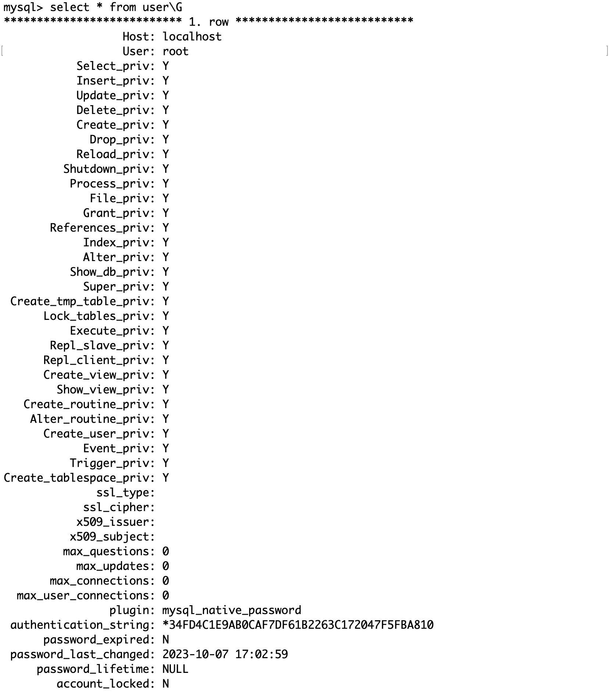
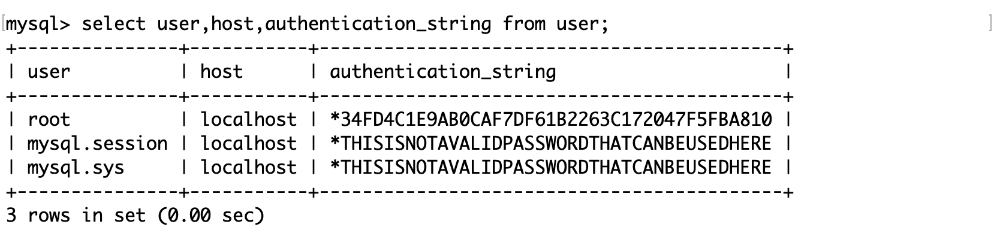
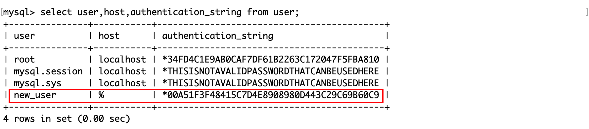
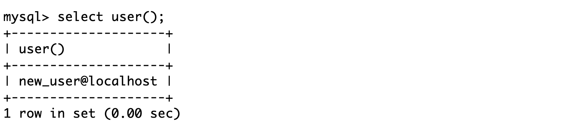
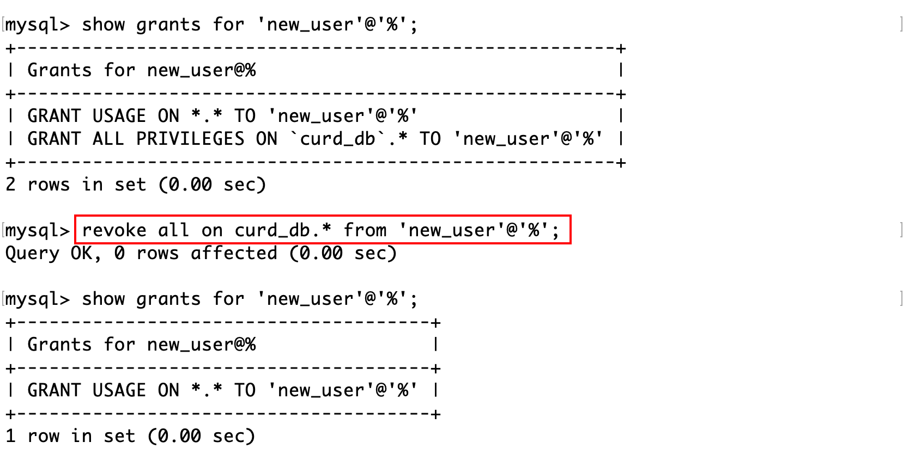

## 查看用户信息

在名为`mysql`的数据库中有一个表`user`维护着 MySQL 的用户信息。



其中：

- user： 表示该用户的用户名。
- host： 表示该用户可以从哪个主机登录，localhost 表示只能从本机登录（127.0.0.1），% 表示可以从任意地方登录。
- authentication_string： 表示该用户的密码经过 password 函数加密后的值。
- xxx_priv： 表示该用户是否拥有对应权限。

其中 password 函数可以对参数进行摘要。

尝试查看它们的值：



由于 user 表中 Host 和 User 属性共同作为联合主键，所以只要用户名和主机 IP 的组合唯一即可，这是合理的，一台主机可能有多个用户。

MySQL 的所有用户管理工作都通过 user 表来进行，实际上，后续所有的用户操作都会被 MySQL 解析为 SQL 来执行，并且允许用户直接通过 SQL 对 user 表修改。例如通过 INSERT 添加用户，UPDATE+password 函数来修改用户密码登操作，都是可行的。但是这只能作为特殊情况的补救措施，因为这么做有风险。

## 创建用户

SQL：
```sql
CREATE USER '用户名'@'登录主机' IDENTIFIED BY '密码';
```

 如果你设置的密码过于简单，由于 MySQL 的密码策略等级，会出现以下错误：

```
Your password does not satisfy the current policy requirements
```

通过`SHOW VARIABLES LIKE 'validate_password%';`查看密码策略，从而设计符合条件的密码。


或者修改密码策略：

```sql
set global validate_password_policy=0;
set global validate_password_length=1;
```

创建用户：

```sql
create user 'new_user'@'%' identified by '12345';
```



现在可以以新用户的身份登录 MySQL：

```
mysql -unew_user -p
```

登录后可以查看客户端信息：



由于`%`表示允许来自任何主机的用户登录，所以在远端登录 MySQL 的方式也是一样的。需要注意的是，可能在连接时会不被允许，这可能是服务端主机没有开放 3306（MySQL 服务器）端口，为了测试可以在`/etc/mysql.cnf`修改 MySQL 的端口配置为测试端口如 8080。实际应用中，数据库不对外开放而只在内网中使用。

## 修改密码

用户自己修改密码：

```sql
set password=password('新密码');
```

超级用户修改任意用户的密码：

```sql
set password for '用户名'@'登录主机'=password('新密码');
```

## 删除用户

SQL：
```sql
DROP USER '用户名'@'登录地址';
```

注意，如果不指明待用户的登录地址，则默认删除的是登录地址为 % 的用户。

## 授予权限

MySQL 数据库提供的权限如下：

| 权限                    | 列名                  | 上下文                 |
| ----------------------- | --------------------- | ---------------------- |
| CREATE                  | Create_priv           | 数据库、表或索引       |
| DROP                    | Drop_priv             | 数据库或表             |
| GRANT OPTION            | Grant_priv            | 数据库、表或保存的程序 |
| REFERENCES              | References_priv       | 数据库或表             |
| ALTER                   | Alter_priv            | 表                     |
| DELETE                  | Delete_priv           | 表                     |
| INDEX                   | Index_priv            | 表                     |
| SELECT                  | Select_priv           | 表                     |
| UPDATE                  | Update_priv           | 表                     |
| CREATE VIEW             | Create_view_priv      | 视图                   |
| SHOW VIEW               | Show_view_priv        | 视图                   |
| ALTER ROUTINE           | Alter_routine_priv    | 保存的程序             |
| CREATE ROUTINE          | Create_routine_priv   | 保存的程序             |
| EXECUTE                 | Execute_priv          | 保存的程序             |
| FILE                    | File_priv             | 服务器主机上的文件访问 |
| CREATE TEMPORARY TABLES | Create_tmp_table_priv | 服务器管理             |
| LOCK TABLES             | Lock_tables_priv      | 服务器管理             |
| CREATE USER             | Create_user_priv      | 服务器管理             |
| PROCESS                 | Process_priv          | 服务器管理             |
| RELOAD                  | Reload_priv           | 服务器管理             |
| REPLICATION CLIENT      | Repl_client_priv      | 服务器管理             |
| REPLICATION SLAVE       | Repl_slave_priv       | 服务器管理             |
| SHOW DATABASES          | Show_db_priv          | 服务器管理             |
| SHUTDOWN                | Shutdown_priv         | 服务器管理             |
| SUPER                   | Super_priv            | 服务器管理             |

新创建的用户没有任何权限，创建用户后需要给用户授权。

```sql
GRANT 权限列表 ON 库名。对象名 TO '用户名'@'登录地址' [IDENTIFIED BY '密码'];
```

其中：

- `'用户名'@'登录地址'`：表示给哪一个用户授权。
- `库名。对象名`：表示要授予用户哪个数据库下的哪个对象的权限。
- `权限列表`：表示要授予用户何种权限，多个权限之间用逗号隔开。
- `IDENTIFIED BY '密码'`可选：如果用户存在，则在授予权限的同时修改该用户的密码，如果用户不存在，则创建该用户。

例如授予用户`new_user`在`curd_db`数据库下所有对象的`select`权限：

```sql
grant select on curd_db.* to 'new_user'@'%' identified by '12345';
```

这样新用户就能看到 curd_db 这个数据库了。


查看用户的权限：


其中：

- 创建用户后该用户默认会有 USAGE 权限，该权限只能用于数据库登录，不能执行任何操作。
- `*.*`表示所有数据库的所有对象，`库名。*`表示某个数据库的所有对象（表、视图、存储过程等）。
- information_schema 数据库保存的了 MySQL 服务器所维护的所有其他数据库的信息。新用户默认只能看到它。

但是目前只有 select 权限，不能对数据库内容做修改。授予`new_user`在`curd_db`数据库下以所有权限：

```sql
grant all on curd_db.* to 'new_user'@'%';
```

## 收回权限

```sql
REVOKE 权限列表 ON 库名。对象名 FROM '用户名'@'登录地址';
```



注意：

- 回收用户在某一数据库下的权限后，在该用户下一次进入该数据库时才会起作用。
- 如果回收权限时该用户正在使用对应数据库，那么回收权限后该用户仍然拥有对应的权限。