## 什么是约束

在数据库中，约束（constraint）指的是对表中数据的限制条件。数据是由数据库的操作人员（一般是程序员）插入到表中的，因此对表的数据做约束，确实也是一种对程序员的规范，要求他们在编写代码时遵循一定的逻辑和规则，以保证数据的质量和一致性。

对于数据本身而言，对它们做约束可以：

- 提高数据的安全性
- 提高数据的可读性
- 提高查询数据的效率

因此约束不仅是对程序员的限制，也是对数据的保护和优化。通常在创建表时，会对列属性添加约束；在表已经存在的情况下，可以使用`ALTER TABLE`语句来修改或删除约束。

## DEFAULT（默认约束）

DEFAULT 是用来指定某列的默认值的约束。例如当插入一条记录时没有为这个列赋值，那么 MySQL 会为这个列赋值为 DEFAULT 约束所指定的值。

在创建表时添加 DEFAULT 约束：

```mysql
mysql> create table default_test(
    -> name varchar(20) default '这是一个默认值'
    -> );
```

查看表结构：


插入一条没有 name 属性的记录：


在表已存在时添加DEFAULT约束：

```mysql
alter table default_test modify name varchar(20) default '这是一个默认值';
```

或者：

```mysql
alter table default_test change name name varchar(20) default '这是一个默认值';
```

删除DEFAULT约束：

```mysql
alter table default_test modify name varchar(20);
```

或者：

```mysql
alter table default_test change name name varchar(20);
```

因为 MySQL 在执行这些修改表的操作不是在原有的基础上做部分修改，而是用新的 SQL 执行后将旧的列属性替换，所以修改的语句和创建表时是一样的，只是用`ALTER`+`MODIFY`或者`CHANGE`关键字表示要修改某一列的属性。

> 修改表的操作都是类似的，下面就以常用的`MODIFY`修改。

## NULL与 NOT NULL（非空约束）

SELECT命令可以计算表达式的值：

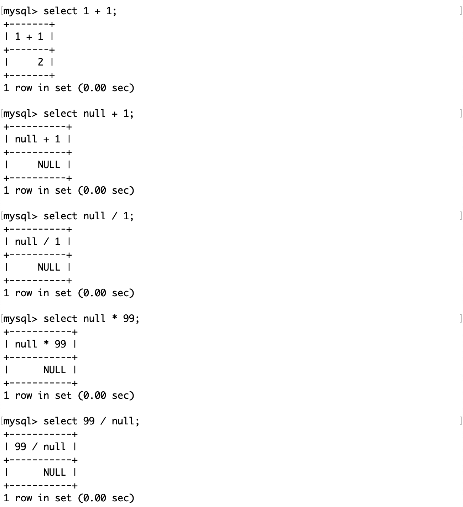

然而NULL 值是无法参与运算的，或者说 NULL 与任何值运算的结果都是 NULL。

MySQL 中的 NULL 和 NOT NULL 是两种不同的列属性，用来表示某个列是否可以存储空值。空值表示没有值或未知值，而非空值表示有确定的值。

- 如果一个列设置为 NULL，那么它可以存储空值或非空值。但是，空值会占用额外的空间，并且在进行比较或索引时会有一些特殊的规则。
- 如果一个列设置为 NOT NULL，那么它不能存储空值，只能存储非空值。这样可以提高数据的完整性、安全性和效率。

在 MySQL 中，可以使用 IS NULL 或 IS NOT NULL 运算符来判断一个列是否为空值；也可以使用 IFNULL() 函数来处理空值。

在创建表时不添加 NULL 和 NOT NULL 约束：

```mysql
mysql> create table null_test(
    -> name varchar(20),
    -> tel varchar(11)
    -> );
```

查看表结构：
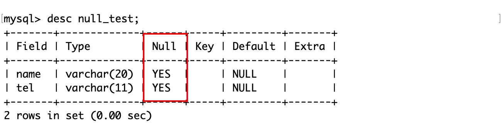

说明在创建表时，属性的约束默认是 NULL。这意味着这个列可以存储空值或非空值。

如果在插入时，不指定 tel 的值：


在这个表的基础上增加 tel 属性的约束为 NOT NULL：
```mysql
alter table null_test modify tel varchar(11) not null;
```

查看表结构：


插入数据：


给表中某一列属性同时设置 not null 和 default ，它的意思是，这个列不能存储空值，只能存储非空值，而且如果没有为这个列提供值，那么它会自动赋值为 default 所指定的值。这个做法不是必要的，但是一种规范，因为 DEFAULT 就意味着它一定不是空的。

```mysql
mysql> create table deft_null_test(
    -> id int, 
    -> name varchar(20) not null default '未知'
    -> );
```


## COMMENT（注释约束）

MySQL 的 COMMENT 约束是一种用来给表或字段添加注释的约束。注释可以帮助用户记录表或字段的用途、含义、来源等信息，方便以后查看或维护。

在创建表或字段时使用 COMMENT 关键字来添加注释：

```sql
mysql> create table comment_test(
    -> id int comment '用户 ID',
    -> name varchar(20) comment '用户姓名'
    -> ) comment '用户信息';
```

甚至还可以给表注释。这样就能方便维护时查看表的注释信息，可以使用：

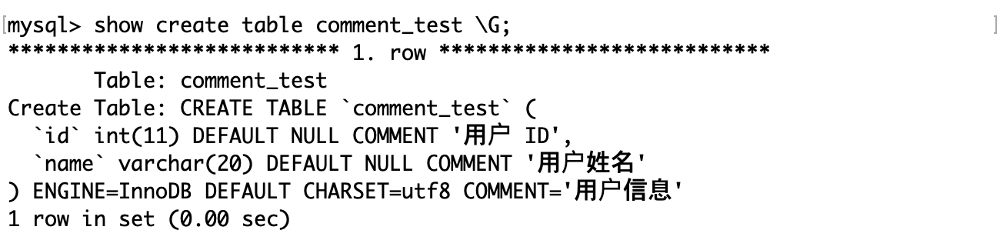

或者：

```mysql
SHOW FULL COLUMNS FROM users;
```

在表或字段已经存在的情况下，使用 ALTER TABLE 语句来修改或删除注释，例如：

```sql
ALTER TABLE users MODIFY id INT COMMENT '用户编号';
ALTER TABLE users MODIFY name VARCHAR(20) COMMENT '';
```

这样，就可以将 id 字段的注释改为 ‘用户编号’，或者将 name 字段的注释删除。

## ZEROFILL（零填充约束）

MySQL 的 zerofill 约束是一种用来给数值类型的字段添加前导零的约束。当你插入或查询一个数值类型的字段时，如果它的值的长度小于定义的长度，那么它会在前面补上相应的零，直到达到定义的长度。例如，如果你定义一个字段为 int (8) zerofill，那么当你插入一个值为 123 的记录时，它会显示为 000001233。

```mysql
mysql> create table zerofill_test(
    -> num1 int(4),
    -> num2 int(4) zerofill
    -> );
```

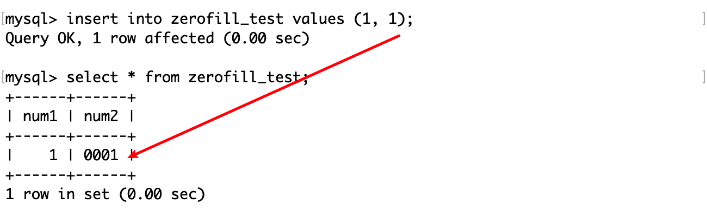

当然，zerofill 约束只是在显示时补充前导零，并不影响底层数据的存储方式。可以通过 hex()函数来验证。

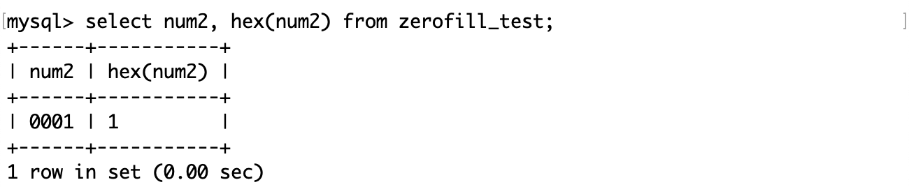

[注]hex()函数可以将一个数值或字符串转化为一个 16 进制的字符串。

使用 zerofill 约束有以下几个注意事项：

- 使用 zerofill 约束时，默认会自动加上 unsigned（无符号）属性，这意味着该字段不能存储负数，而且数值范围是原来的两倍。
- zerofill 约束只会影响数据的显示方式，不会影响数据的存储方式和比较方式。
- 如果数据的长度超过了定义的长度，那么不会截断数据，而是完整地显示数据。

## UNIQUE（唯一键约束）

MySQL 的 unique 约束用来保证表中的一列或多列的值不重复。

唯一约束：

- 指定列属性不能重复，以保证数据的唯一性。
- 不能出现重复的非 NULL 值。
- 同一个表可以有多个唯一约束。

unique 和 primary key 约束都可以实现唯一性，但是每个表只能有一个 primary key。

在创建表时使用 unique 关键字来指定某个列或多个列为唯一约束，例如：

```sql
mysql> create table uni_test(
    -> id int,
    -> name varchar(20) unique
    -> );
```


Key 为 UNI 的列表示它是一个唯一键，唯一键是允许为空的。

也可以在表已经存在时使用 alter table 语句来添加或删除唯一约束，例如：

```sql
ALTER TABLE uni_test ADD UNIQUE (name);
ALTER TABLE uni_test DROP INDEX name;
```

[注]如果删除的唯一约束列具有自增长约束，则必须先删除自增长约束，再去删除唯一约束。

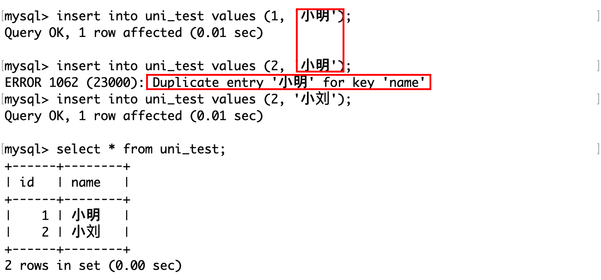

在使用上，被唯一键约束的列，插入记录时不允许重复，除非是 NULL 值。

## *PRIMARY KEY（主键约束）

MySQL 的主键约束（primary key）是一种用来唯一标识表中**每条记录**的约束。它要求被约束的字段或字段组合不能重复，也不能为null。

主键约束相当于唯一键约束（unique）和非空约束（not null）的组合。这意味着，主键约束要求被约束的字段或字段组合不能重复，也不能为null。而且，**每个表只能有一个主键约束**，但可以有多个唯一键约束。

**主键约束的粒度比唯一键约束的粒度更强**：对于主键约束和唯一键约束，我们可以把它们看作是两种不同的维度组合。主键约束是由非空且唯一的字段或字段组合构成的维度，而唯一键约束是由可空且唯一的字段或字段组合构成的维度。显然，主键约束的维度组合比唯一键约束的维度组合更严格，因为它排除了空值的可能性。

> 粒度（granularity）是一个用来描述数据的细致程度的概念。粒度越细，数据就越详细，粒度越粗，数据就越简略。在数据库中，粒度通常取决于维度的组合，即我们想通过什么角度去看事物。

主键约束和唯一键约束的区别有以下几点：

- 空值要求：主键约束不允许空值，唯一键约束允许空值。
- 个数限制：一个表只能有一个主键约束，但可以有多个唯一键约束。
- 外键引用：引用主键的外键不能为null，而引用唯一键的外键可以为null。

可以说，主键是一种特殊的唯一键。

> 外键引用下文会介绍。

 那么，主键约束能保证某列中的所有数据不重复，而且不为空，那这就可以作为查找的依据，相当于一个完整映射且不重复的键值对了。因此从这个角度看，一般具有唯一性且不为空的列，可以作为主键，例如人的身份证号，学生的学号等等。

因为主键是唯一且不为空的， 所以一般将主键称之为“某表的主键”。

在创建表时指定 id 列为主键约束：
```mysql
mysql> create table pri_test(
    -> id int primary key,
    -> tel varchar(11)
    -> );
```


Key 为 PRI 的列为表的主键，而且不允许为空，而唯一键允许为空。


这个错误信息和唯一键是一样的，主键不允许重复。

也可以在表已经存在时使用 alter table 语句来删除或添加主键约束，例如：

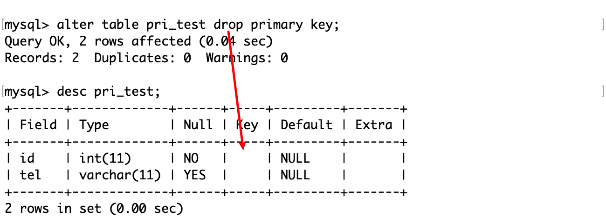

值得注意的是，即使删除了这一列的主键约束，它原有的非空约束是不会被删除的。

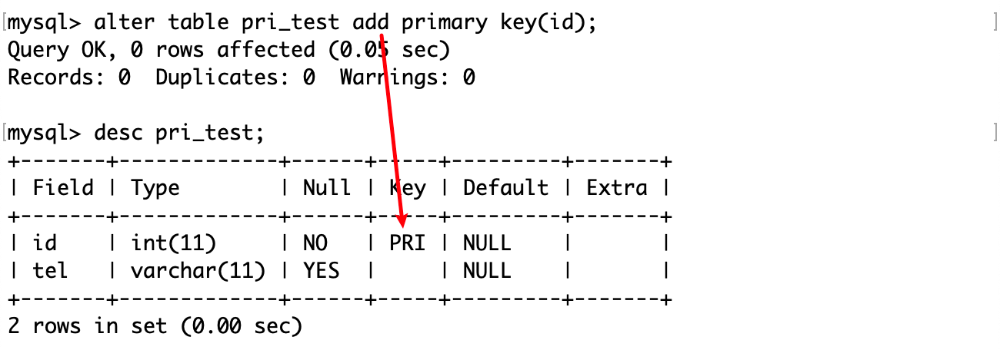

在表删除了唯一键后，让有两个不同 id 的记录的tel 值相同，然后试图将 tel 列作为主键：


可见，不论是在插入记录，还是在已有表中设置主键，MySQL 都要检查数据的唯一性。

主键对于用户和数据库本身的作用：

- 精确地定位和操作表中的特定行，避免数据的重复或丢失。
- 加快数据库的查询速度，因为数据库会自动为主键创建唯一索引。
- 与其他表的外键建立关联，实现数据之间的逻辑关系和引用完整性。
- 规范数据的显示顺序，使数据更加有序和易于管理。

## 复合主键

MySQL复合主键是指数据库表的主键由多个字段组成。复合主键可以用于以下场景：

- 当单个字段无法唯一标识记录时，需要使用复合主键。例如，一个用户表中，用户名和手机号码可以组成复合主键，用于唯一标识用户。
- 当表中存在多个字段具有相同的业务含义时，可以使用复合主键来强制它们的值保持一致。例如，一个订单表中，订单号和订单状态可以组成复合主键，用于保证每笔订单的订单号和订单状态是唯一且一致的。

在创建表时，单独在表的最后用括号包含若干个列名，然后用PRIMARY KEY 关键字来表名它们是复合主键。

```mysql
mysql> create table pris_test(
    -> id int,
    -> tel varchar(20),
    -> primary key(id, tel)
    -> );
```


插入几条数据：

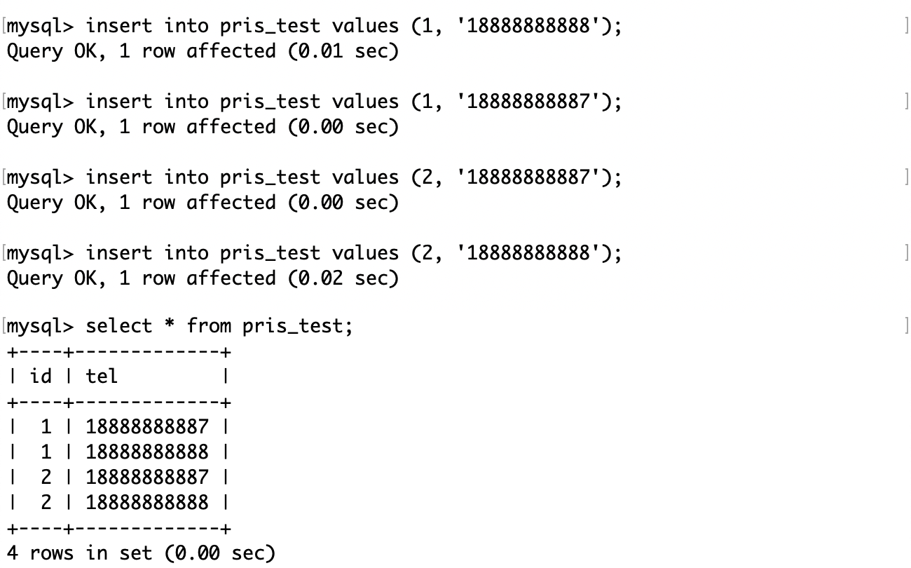

只要复合主键这个整体没有重复，那么就可以插入。这个场景很符合学生选课时的场景，例如同一个学生可以选不同课，多个学生可以选同一门课。

类似地，删除复合主键：
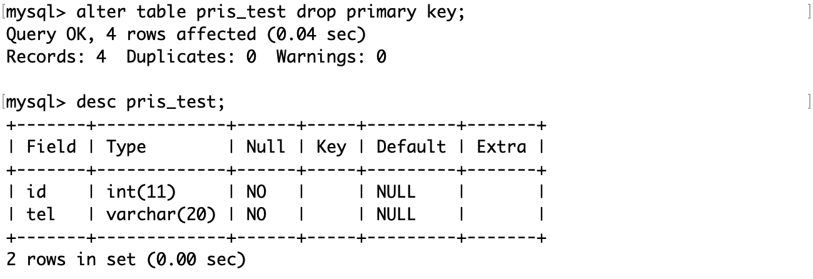

删除主键约束的列，其非空约束也不会被删除。

在已有的表中增加复合主键：


同样地，在增加复合主键时，也要保证这些「列组合」的唯一性。

在设计主键时，除了要选择这个表中数据唯一的那一列，还要保证它与业务无关，也就是说业务调整以后，不会影响主键的表结构。

## FOREIGN KEY（外键约束）

MySQL 的外键约束是指在两个表之间建立的一种关联关系，建立外键约束的表叫做从表，对于从表而言，“外键”是主表的主键，这样可以保证从表中的外键值必须在主表中存在，从而维护数据的一致性和完整性。

外键约束可以用于以下场景：

- 确保一个表中的记录与另一个表中的记录之间存在关联关系。例如，一个客户表和一个订单表。每个客户可以有多个订单，每个订单只属于一个客户。客户表是主表（父表），订单表是从表（子表）。订单表中的 customer_id 列是外键，它引用了客户表中的 id 列，这是主键。
- 防止数据的非法更新或删除。例如，在用户表中，用户角色外键可以防止用户被删除后，其角色信息仍然存在。

例如在订单表中，引用了用户表的主键 id：

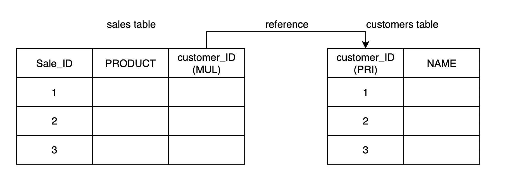

创建 customers 表：

```mysql
mysql> create table customers(
    -> customer_id int primary key,
    -> name varchar(20)
    -> );
```


在创建表时使用 FOREIGN KEY 和 REFERENCES 关键字创建外键约束：
```mysql
mysql> create table sales(
    -> sale_id int primary key,
    -> product varchar(20),
    -> customer_id int,
    -> foreign key(customer_id) references customers(customer_id)
    -> );
```


Key值为 MUL （multi）的列，表示这个列是一个非唯一索引的第一列，或者是一个唯一索引的部分组成但是可以含有空值。MUL 只表示这个列的值可以重复，并不表示这个列与其他列有关联。

如果为 MUL 的列引用了另一个表的主键或唯一键，并且有外键约束，那么它就是本表的外键。

通过下面的例子理解外键约束。

首先在主表（customers）插入两条记录：


再向从表（sales）插入：


第二条记录插入的外键的值可以为 NULL，这是因为表没有对它做空值约束。

第三条不允许插入的原因是，外键的值在主表中没有对应的记录。这就是外键约束，它将两个表关联起来，从表插入外键的值必须在主表中有对应的记录。

MySQL 作为一款数据管理系统，它能做的事情我们人类也能做，只是在这个信息爆炸的时代，人工管理数据的成本很高，相比于人类而言，计算机的正确性和效率是绝对的。我们不设置外键也可以手动实现同样的约束，只不过在数据很多时成本很高就是了。

关于外键约束，这里的约束指的是两张表在逻辑上的关联性，两张表仍然是各自独立的表，在设置外键约束的表在插入数据时，需要保证插入的数据在被引用的表的主键中是合法的，约束的不仅是这个更新数据（包括插入、删除和更新）的动作，也维护了两张表的关系。

> 如何完全理解这句话呢？
>
> 如果你想让两张表产生关联，那么只要将它们合并为一张表就好了（这并不总是合理的），不需要外键约束。但是，这样无法保证数据的一致性和安全性。而“约束”指的是按某种符合现实意义的规则，不仅让两张表产生逻辑上的联系，还保证了数据的一致性，以维护两张各自独立的表之间的关系。

> 为啥不合并它们而保持两张表的独立呢？

这取决于表的列属性之间的关联性，例如学校的班级表和班级的学生表，合并后会有许多冗余的信息，例如有好多个同学都是同一个班的。如果把这张表作为学校领导评估班级学习成果的参考，那么就太麻烦了。

这还不算非常冗余的表，因为它们之间有一个共同的属性––班级。如果两张表之间没有任何连接条件，那么它们的交叉连接就是笛卡尔积。如果 A 有 8 行，B 有 10 行，那么 A 表和 B表的笛卡尔积就有 80 行。

关于「表的连接」，可以本栏目中找到对应介绍。

## AUTO_INCREMENT（自增长约束）

AUTO_INCREMENT 是一种特殊的属性，它可以让一个整数类型的列自动增加一个唯一的值，每当向表中插入一条新记录时。这样可以方便地为表中的每一行添加一个标识符，而不需要用户手动输入。

因此，在大多数情况下，使用自增长的列作为主键是比较推荐的做法。

> 但是使用自增长的列作为主键也有一些限制，例如，在分库分表或复制的场景下，可能会出现主键冲突或不连续的问题。
>
> 使用自增长的列作为非主键可以避免上述问题，但是也会带来一些额外的开销，例如，需要定义额外的唯一索引，并且需要手动指定或生成主键的值。而且如果想要根据自增长的列进行查询，可能需要联合查询多个列，这会降低查询效率。
>
> 因此，是否将自增长约束设置为主键取决于具体需求和场景。

要创建一个 AUTO_INCREMENT 的列，可以在 CREATE TABLE 或 ALTER TABLE 语句中使用 AUTO_INCREMENT 关键字，并指定该列为主键或唯一键。例如，以下语句创建了一个名为 customers 的表，其中 id 列是一个 AUTO_INCREMENT 的主键：

```sql
mysql> create table auto_inc(
    -> id int not null primary key auto_increment,
    -> name varchar(20)
    -> );
```


默认情况下，AUTO_INCREMENT 的初始值是 1，每次新增一条记录，该列的值就会自动加 。

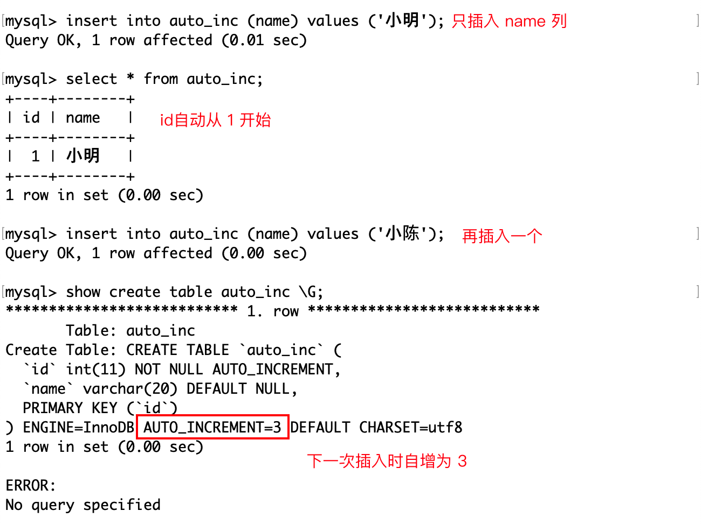

如果想改变 AUTO_INCREMENT 的初始值或者步长，可以使用 ALTER TABLE 语句或者设置全局或会话级别的变量。例如，以下语句将表的 AUTO_INCREMENT 的初始值改为 10：


除此之外，还可以使用 NULL 或者 DEFAULT 占位符插入含有自增属性的列值，效果和上面是一样的。

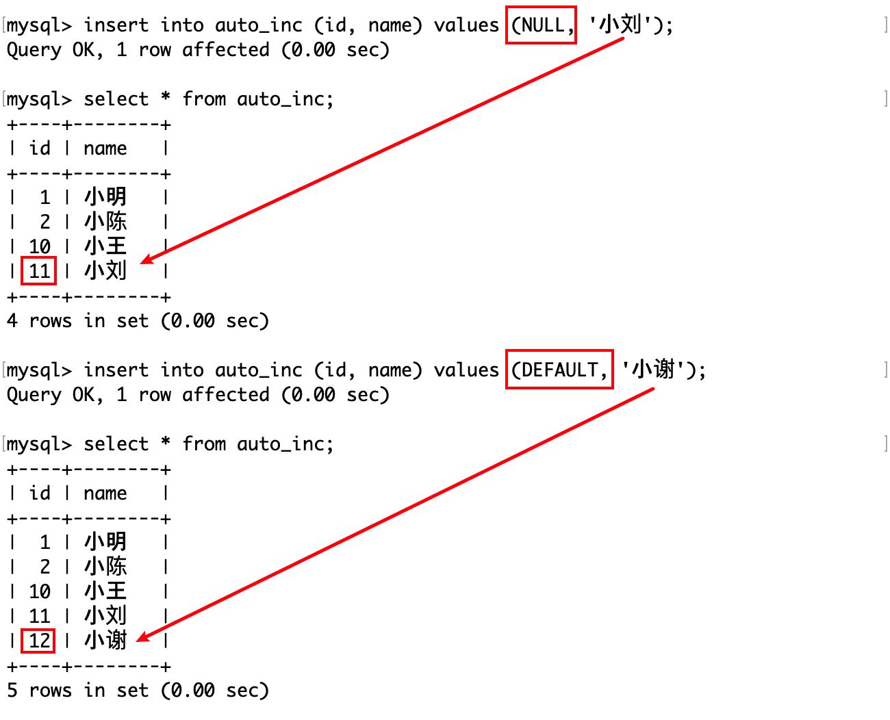

如果在插入时，指定的 AUTO_INCREMENT值比表中记录的值还要大，那么它将会被更新为最大的那个AUTO_INCREMENT值。


值得注意的是，即使删除了某一条记录，表中的AUTO_INCREMENT的值是不会被影响的，它只会记录当前的最大值。


值得注意的是，一个表只允许欧一个自增长列，并且改列需要定义约束。


删除某个列的自增属性：


## 参考资料

- [MySQL——约束(constraint)详解](https://www.cnblogs.com/cangqinglang/p/10036680.html)
- [一篇文章带你彻底了解MySQL各种约束](https://segmentfault.com/a/1190000039214953)