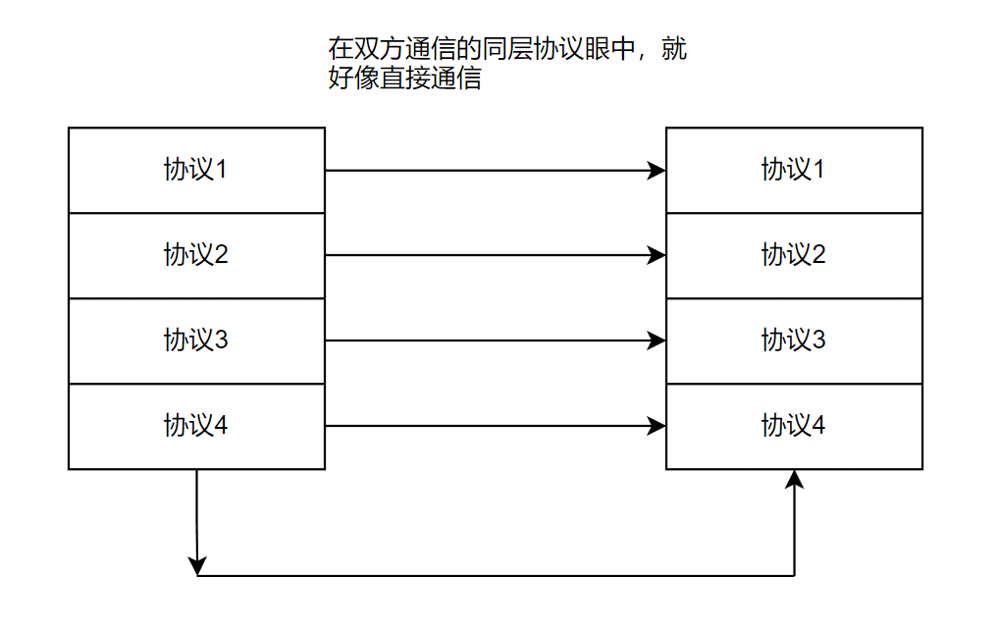
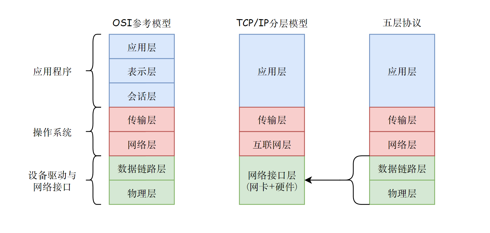
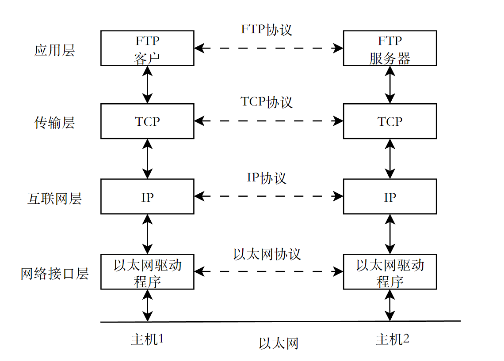
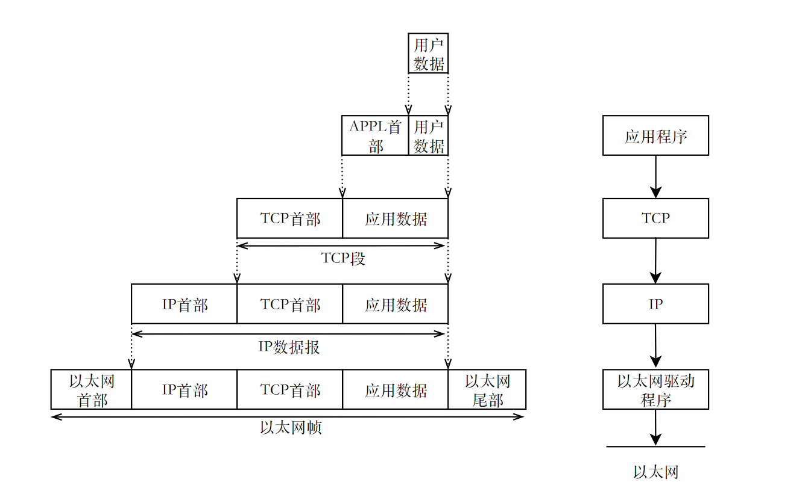
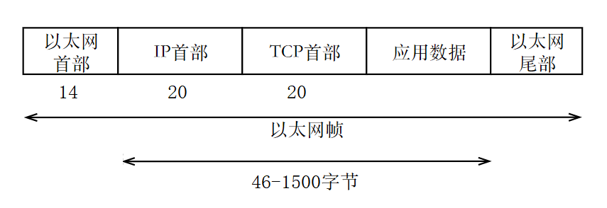
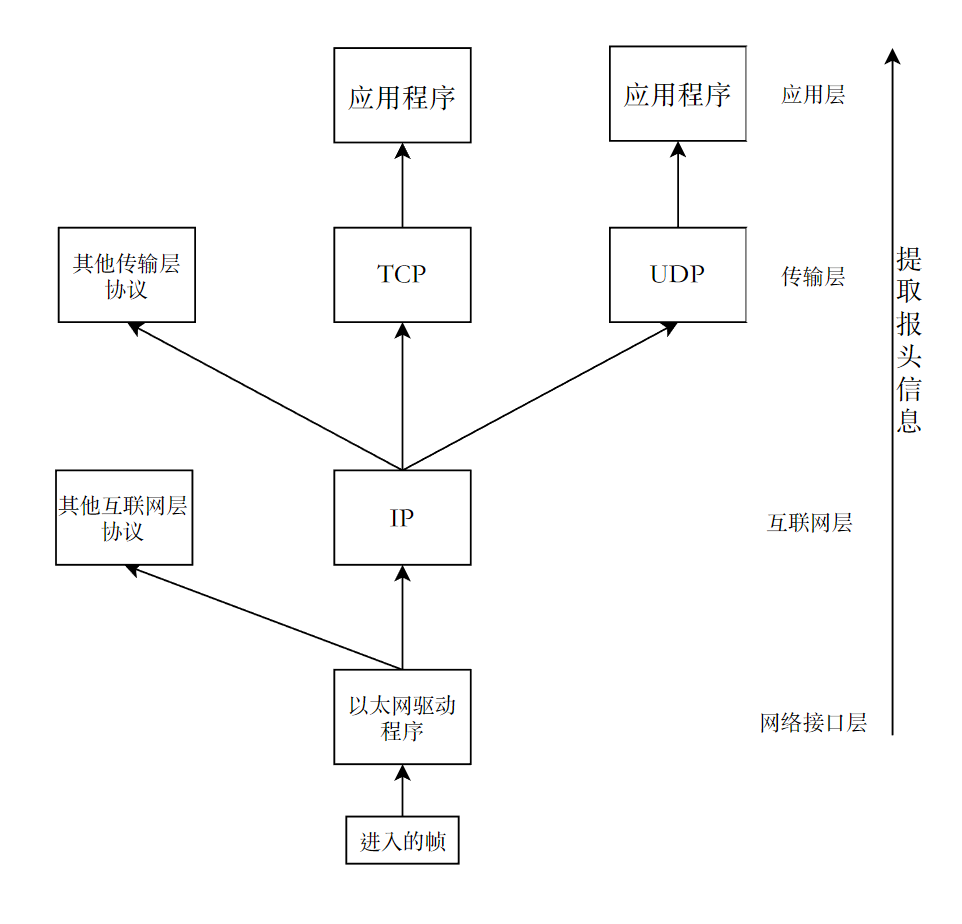
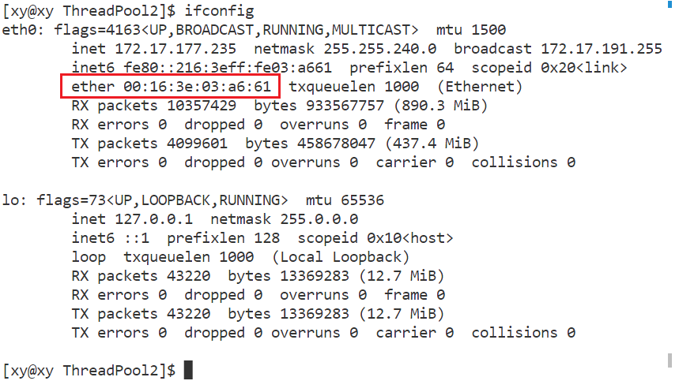
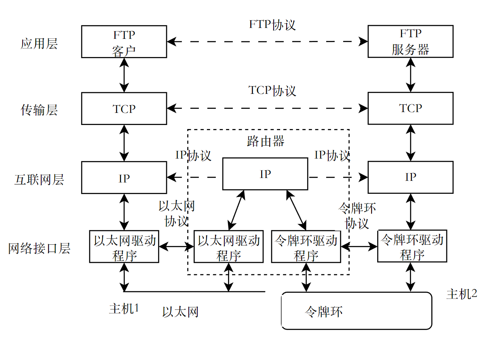
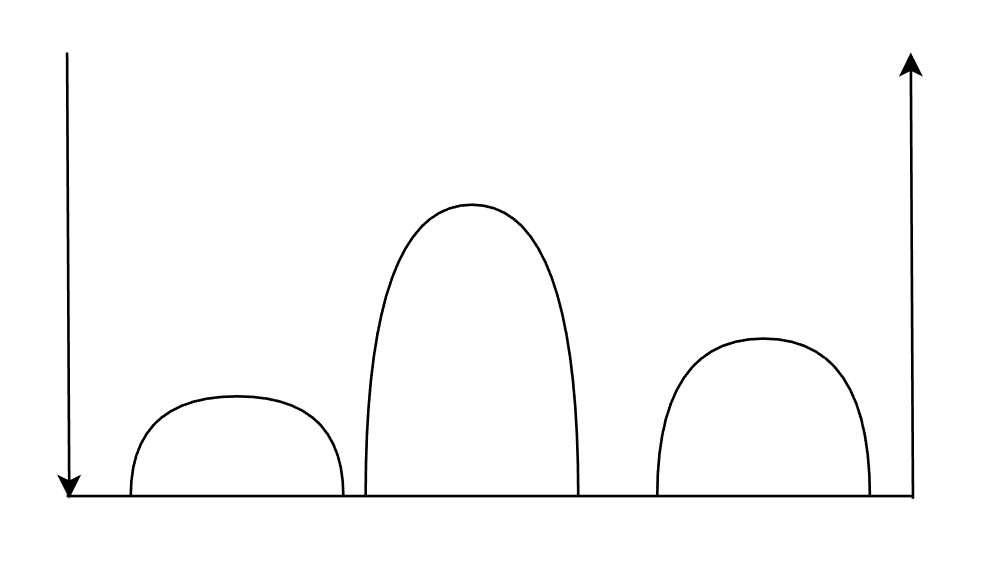

## 1. 计算机网络的发展背景

在早期计算机之间是相互独立的，计算机要协同完成任务，必须在上一台机器处理完毕后才能把数据交给下一台机器，效率低下。网络的出现，使得原本各自独立的计算机能够通过线缆共享数据，协同完成任务，效率直线上升。

### 1.1 局域网（LAN）

局域网（Local Area Network， LAN）是指在一个局部的地理范围内（如一个学校、工厂和机关内），将各种计算机、外部设备和数据库等互相联接起来组成的计算机通信网。它可以通过数据通信网或专用数据电路，与远方的局域网、数据库或处理中心相连接，构成一个大范围的信息处理系统。

网络覆盖的范围可以很大，通常将规模很大的网络称之为广域网（WAN）或城域网（MAN）。

> 局域网（LAN）、城域网（MAN）和广域网（WAN）是三种不同类型的计算机网络，它们的主要区别在于覆盖范围和技术实现。
>

### 1.2 以太网的由来

以太网（Ethernet）最早是由 Xerox 公司创建的局域网组网规范。早在 1972 年，Robert Metcalfe（被尊称为“以太网之父”）作为网络专家受雇于 Xerox 公司，当时他的第一个任务是把 Xerox 公司 Palo Alto 研究中心（PARC）的计算机连接到 Arpanet（Internet 的前身）。同年底，Robert Metcalfe 设计了一套网络，把 PARC 的计算机连接起来。因为该网络是以 ALOHA 系统（一种无线电网络系统）为基础的，又连接了众多的 Xerox 公司 Palo Alto 研究中心的计算机，所以 Metcalfe 把它命名为 ALTO ALOHA 网络。ALTO ALOHA 网络在 1973 年 5 月开始运行，Metcalfe 把这个网络正式命名为以太网（Ethernet）。

这就是最初的以太网试验原型，该网络运行速率为 2.94Mbps，网络运行的介质为粗同轴电缆。1976 年 6 月，Metcalfe 和他的助手 David Boggs 发表了一篇名为《以太网：区域计算机网络的分布式包交换技术》（ Ethernet: Distributed Packet Switching for Local Computer Networks ）的文章。1977 年底，Metcalfe 和他的三位合作者获得了“具有冲突检测的多点数据通信系统”（"Multipoint data communication system with collision detection"）的专利。从此，以太网就正式诞生了。

> 以太网中的“以太”什么深意吗？

以太是一种假想的介质，人们认为它充满了整个宇宙，是光波和电磁波的传播媒介。后来，随着物理学的发展，以太的存在被否定了，但它在科幻小说和电影中仍然有着广泛的影响。

1973 年，Robert Metcalfe 将其命名为“以太网”，寓意这种网络可以像以太一样无处不在，无所不通。

## 2. 认识网络协议

### 2.1 什么是协议

协议是一种约定，它是事先规定好的规则。在生活中双方或多方可以通过协议完成某种事情而很少会发生问题，问题发生的概率取决于具体情况和协议本身的完成度。

### 2.2 什么是网络协议

网络协议是计算机网络中实现数据交换和通信的一组规则和标准。它定义了数据在网络中传输的格式、顺序、错误检测和纠正等方面的细节，以确保不同设备之间能够顺利地进行通信。

常见的网络协议包括 TCP/IP、HTTP、FTP、SMTP 等。这些协议定义了不同类型的网络通信，如文件传输、电子邮件发送和接收、网页浏览等。

### 2.3 如何管理协议

网络协议不止一种，所以操作系统要对各种协议进行管理，操作系统对任何事务管理的准则都是：先描述，后组织。

在此忽略硬件的存在，那么网络协议在操作系统中本质是一种软件，既然是软件，那么网络协议是可以被“分层”管理的。这就像各种嵌套的类、函数，以及冯诺依曼体系架构中的各种软件层，操作系统本身就是处于硬件和应用层之间的软件层。

而网络协议在被设计时，就是按层次划分的。

在计算机中，网络协议是由操作系统的协议栈来管理的。协议栈是操作系统中负责处理网络通信的部分，它包含了一系列的软件模块，用来实现不同层次的网络协议。

#### 协议栈

协议栈（英语：Protocol stack），又称协议堆叠，是计算机网络协议套件的一个具体的软件实现。

协议套件中的一个协议通常是只为一个目的而设计的，这样可以使得设计更容易。因为每个协议模块通常都要和上下两个其他协议模块通信，它们通常可以想象成是协议栈中的层。最低级的协议总是描述与硬件的物理交互。每个高级的层次增加更多的特性。用户应用程序只是处理最上层的协议。（参见 OSI 模型）

在实际中，协议栈通常分为三个主要部分：媒体，传输和应用。一个特定的操作系统或平台往往有两个定义良好的软件接口：一个在媒体层与传输层之间，另一个在传输层和应用程序之间。

- 媒体到传输接口定义了传输协议的软件怎样使用特定的媒体和硬件（“驱动程序”）。例如，此接口定义的 TCP/IP 传输软件怎么与以太网硬件对话。

- 应用到传输接口定义了应用程序如何利用传输层。例如，此接口定义一个网页浏览器程序怎样和 TCP/IP 传输软件对话。

> [维基百科--协议栈](https://zh.wikipedia.org/wiki/%E5%8D%8F%E8%AE%AE%E6%A0%88)

当计算机需要进行网络通信时，它会将数据传递给协议栈。网络栈会根据所使用的协议，对数据进行封装、分段、添加校验和等操作，然后将数据发送到网络中。当计算机接收到来自网络的数据时，协议栈会对数据进行解封装、重组、校验等操作，然后将数据传递给应用程序。

## 3. 了解网络协议

### 3.1 协议分层

网络协议栈被设计成层状结构，目的是将网络通信分解为不同的层次，每一层都负责处理特定的问题。分层操作将层与层之间解耦，保证了代码的可维护性和可拓展性。

例如，在那个连信件通信都不存在的年代，人们只能口头交流。人与人之间通过某种语言交流，可以将其称之为语言层。有了电话以后，电话就是通信设备层语言层就只用关心交流本身，而不需要考虑如何交流或交流方式带来的问题，因为这些问题取决于通信方式本身。这就实现了语言层和通信设备层之间的解耦。

### 3.2 分层的作用

#### 模块化

首先，通过上面的例子可以知道协议分层的作用是通过将网络通信分解为不同的层次，每一层都可以专注于解决特定的问题，而不需要关心其他层次的细节。这样，每一层都可以独立地进行设计、开发和测试，从而提高了开发效率和可维护性。

#### 标准化

分层就是封装，但不同模块之间交流的接口还是不变的，就像给同一个车壳换上换上了不同的发动机。也就是说，分层使得整个协议栈更稳定，当某一个模块更换了协议，但是整体依然不受影响，这就类似将积木中的某一块抽去，换上另一块外观一样的上去一样。

每一层都可以定义自己的标准和协议，从而实现不同厂商、不同操作系统之间的互操作性。例如，TCP/IP 协议栈就定义了一组标准化的协议，使得不同厂商生产的设备都能够在 Internet 上进行通信。

### 3.3 分层对用户的影响

以电话为例，虽然我们通过中介设备电话与对方进行通信，但是对于通信的双方而言，打电话的过程就是直接进行沟通的，因为我们从体验上就是你问我答。而事实上双方通过电话进行通信，数据需要经过多方转发。

对于网络协议栈中的每个模块也是一样的，协议本身是一种软件，对于通信双方的同层协议，它们可以认为自己通信的对象是和对方同层的协议进行通信。以图示理解：

在网络中，对于通信的双方，它们都有各自的协议栈，数据的处理、传输路径也很复杂，但是在双方的同一层协议的眼中，数据交流就像打电话一样，是直接通信的。

### 3.4 常见的分层模型

计算机网络中有几个著名的概念（参考）模型，包括 OSI（(Open Systems Interconnection，开放系统互连）模型和 TCP/IP （Transmission Control Protocol/Internet Protocol，传输控制协议/互联网协议）模型。

- OSI 模型是一个七层概念模型。它定义了网络中设计的各种功能和协议。它为协调国际标准化组织（International Organization for Standardization， ISO）开发以实现系统互连提供了一个通用基础。
- TCP/IP 模型是一个四层结构，它定义了网络通信中设计的各种协议和功能。TCP/IP 模型是 OSI 模型的简明版本。它以两个最重要的协议命名（见上）。

但是，在某些网络环境中，TCP/IP 模型使用了五层模型，用于描述网络中设备之间的数据流。五层模型与 OSI 模型的区别在于 OSI 有两个附加层：会话层和表示层。

在计算机网络中，概念模型是标准化框架，它提供网络的各种元素和功能的通用术语和抽象表示，帮助设计人员和管理员理解和管理复杂的网络系统。

值得注意的是，传输层和网络层是在从操作系统内部实现的。

## 4. OSI 七层模型

OSI （Open System Interconnection，开放系统互联）是一个用于描述计算机网络中不同功能层次的标准框架，它由国际标准化组织（ISO）在 1984 年提出，目的是促进不同厂商和设备之间的互操作性。

### 4.1 功能概述

OSI 七层模型将网络通信的过程分为七个层次，从下到上依次是：物理层、数据链路层、网络层、传输层、会话层、表示层和应用层。

- 物理层（Physical）是最底层，它负责将比特流（0 和 1）转换为电信号或光信号，并通过物理介质（如双绞线、光纤等）进行传输。物理层的主要协议有：RS-232、V.35、RJ45 等。

- 数据链路层（Data Link）是第二层，它负责在物理层提供的服务基础上，建立可靠的数据传输链路，实现点对点或点对多点的通信。数据链路层将比特流划分为数据帧，并进行帧同步、差错控制、流量控制等功能。数据链路层的主要协议有：以太网、令牌环、HDLC、PPP 等。

- 网络层（Network/Internet）是第三层，它负责在数据链路层提供的服务基础上，实现网络间的互连和路由选择，使数据能够根据目的地址找到最佳的传输路径。网络层使用逻辑地址（如 IP 地址）来标识网络和主机，并将数据帧封装为数据包或分组。网络层的主要协议有：IP、ICMP、ARP、RARP 等。

- 传输层（Transport）是第四层，它负责在网络层提供的服务基础上，实现端到端的可靠数据传输，保证数据完整性和顺序性。传输层使用端口号来标识不同的应用程序，并将数据包划分为数据段或用户数据报。传输层的主要协议有：TCP、UDP 等。

- 会话层（Session）是第五层，它负责在传输层提供的服务基础上，建立、管理和终止会话，实现不同主机之间的对话控制。会话层可以使用检查点和恢复机制来处理通信中断的情况，并可以使用同步点来协调不同任务之间的交互。会话层的主要协议有：RPC、NFS、SQL 等。

- 表示层（Presentation）是第六层，它位于会话层之上，应用层之下。它负责提供各种用于应用层数据的编码和转换功能，确保一个系统的应用层发送的数据能被另一个系统的应用层识别。实现数据的表示、编码、转换和加密等功能，使数据能够按照双方约定的格式进行交换。表示层可以处理不同系统之间的字符集、数据结构、图像格式等差异，并可以提供数据压缩和加密等服务。表示层的主要协议有：ASCII、EBCDIC、JPEG、MPEG 等。

- 应用层（Application）是最顶层，是最靠近用户的一层。它负责为计算机用户、各种应用程序以及网络提供接口，也为用户直接提供各种网络服务。应用层处理与具体应用相关的逻辑问题，如用户身份识别、文件传输、电子邮件、远程登录等。应用层的主要协议有：HTTP、FTP、FTP、Telnet 等。

每一层都有自己的功能和协议，而且每一层只与相邻的上下层进行交互，不直接与其他层通信。

这是标准化和规范数据处理方式。分层后，各层独立，可以把大问题分割成多个小问题，利于实现和维护。这样，如果某一层发生变化，只要接口不变，不会影响其他层。此外，分层后，用户只关心用到的应用层，其他层用户可以复用。各层之间相互独立：高层不需要知道底层的功能是采取硬件来实现的，只需要知道通过底层的接口来获得所需要的服务。

这样的分层设计可以使网络通信更加模块化和灵活，也便于定位和解决网络问题。

> OSI 七层参考模型的结构很复杂，但并非不实用。它在架构思想上非常完善，甚至预测了某些需求，TCP/IP 去除的表示层和应用层的是否必要，取决于实际场景。OSI 模型是在协议开发前设计的，具有通用性。

## 5. TCP/IP 四层/五层结构

TCP/IP 是一组协议的代名词，它还包括许多协议，共同组成了 TCP/IP 协议簇。TCP/IP 通讯协议采用了五层的层级结构，每一层都呼叫它的下一层所提供的网络来完成自己的需求。

### 5.1 功能概述

TCP/IP 模型是 OSI 模型的简明版本。它包含四层，与 OSI 模型中的七层不同。层数有时称为五层或四层。在这篇文章中，我们将研究五个层次。物理层和数据链路层在 4 层参考中被称为一个单独的层，称为“物理层”或“网络接口层”。

- 物理层（Physical）：是最底层的网络层次，它负责将数据转换为电信号或光信号，并通过物理介质（如双绞线、光纤、无线电波等）进行传输。物理层不关心数据的内容和含义，只负责按照一定的编码规则和传输速率进行数据的发送和接收。物理层的主要设备有网卡、集线器、中继器等。

- 数据链路层（Data Link，MAC）：，它负责将物理层传输的比特流（0 和 1）组织为有意义的数据帧，并进行错误检测和流量控制。数据链路层还负责在同一局域网内进行节点之间的寻址和通信，使用硬件地址（如 MAC 地址）来标识每个节点。数据链路层的主要设备有网桥、交换机等。

- 网络层（Network）：它负责将数据帧封装为数据包，并进行路由选择和转发。网络层还负责在不同局域网或广域网之间进行节点之间的寻址和通信，使用逻辑地址（如 IP 地址）来标识每个节点。网络层的核心设备有路由器、网关等。

- 传输层（Transport，TCP/UDP）：它负责将数据包分割为数据段，并进行可靠性保证和端到端的连接管理。传输层还负责在不同应用程序之间进行寻址和通信，使用端口号（如 80、443 等）来标识每个应用程序。传输层的主要协议有 TCP（传输控制协议）和 UDP（用户数据报协议）。

- 应用层（Application）：是最高层的网络层次，它负责提供各种具体的网络服务和应用，如 Web 浏览、电子邮件、文件传输、远程登录等。应用层使用各种高级协议来实现不同的功能，如 HTTP（超文本传输协议）、SMTP（简单邮件传输协议）、FTP（文件传输协议）、Telnet（远程登录协议）等。

注意：

- 对于前三层，它们已经有能力做到两个两个设备之间传输数据了，但是无法保证数据一定能被传输，也无法保证数据能被安全地传输。
- 对于传输层，协议保证了数据的安全性，核心设备是主机，由于协议本身是软件，所以传输层也可以被认为是软件层。
- 对于数据链路层，设备之间数据的传输和识别对应着局域网，也就是说局域网工作在数据链路层。例如以太网、无线 WLAN、令牌环网等协议。不同场景的协议是不同的。核心设备是调制解调器，交换机（非必要）。

- 对于应用层，它是 TCP/IP 的第一层，是直接为应用程序进程服务的，对不同种类的应用程序它们会根据自己的需要来使用应用层的不同协议。

如果不考虑硬件的话，TCP/IP 就是 4 层结构。TCP/IP 协议中的应用层对应 OSI 中的前三层，即应用层、表示层和会话层。

一般而言：

- 对于一台主机，它的操作系统内核实现了数据在传输层到物理层之间传输。
- 对于一台路由器，它实现了数据在网络层到物理层之间传输。
- 对于一台交换机，它实现了数据在数据链路层到物理层之间传输。
- 对于集线器，它只实现了在物理层之间传输数据。

但这并不是绝对的，比如交换机也可能实现网络层的转发，很多路由器也可以实现部分传输层的内容（比如端口转发）。

[TCP/IP 和 OSI 的区别](https://baike.baidu.com/item/TCP%2FIP%E5%8F%82%E8%80%83%E6%A8%A1%E5%9E%8B/5081378#3)

## 6. 网络传输基本流程

下面以 TCP/IP 四层模型为例，对于通信的两台主机，它们每层的协议都是一样的。下面以两台主机通信为例。

### 6.1 同局域网通信

两台主机在同一个局域网中可以直接通信。

首先看一个例子，假如两个人住在两幢相邻的同一层楼：

- 从物理上（程序员）：A 要给 B 送东西，不太可能直接从 18 层楼直接投过去，而是 A 先走到地面，然后走到 B 所在的楼，再坐电梯到 18 楼将礼物送给 B。
- 从逻辑上（用户）：对于 B 而言，A 是直接送礼物给他的，B 看不到 A 是如何送礼物的。

> 从物理层面理解这个例子，是理解网络传输流程的关键。

### 6.2 通信的通路

下面是两台主机通过局域网（图中是以太网）通信的通路，可见，每一层的协议都是不同的。

每一层都有各自的协议定制的方案，每一层协议都有对应的报头。

### 6.3 报头与有效载荷

在计算机网络中，被传输的数据本身相对于报头而言通常被称为“有效载荷”或“数据负载”。报头包含了关于如何处理数据的信息，而有效载荷则是实际传输的数据。

#### 报头

报头（Header）是协议的一部分，它用于传输报文，<mark>是数据发送方和接收方用来传递属性字段的重要方式</mark>。

报头是一种用于描述文档或数据的元数据，通常出现在文档的开头或数据的传输过程中。报头可以提供有关文档或数据的重要信息，例如作者、标题、日期、类型、大小、格式、编码等。报头还可以用于控制文档或数据的显示、处理或传输方式，例如指定字符集、语言、样式表、压缩方法、缓存策略等。

如果把计算机网络中的传输的数据比作要被寄送的物品，那么报头就像快递单上的信息。快递单上包含了寄件人和收件人的信息、快递的类型和重量等信息，这些信息帮助快递公司正确地处理和运输快递。同样，计算机网络中的报头包含了关于数据包的信息，帮助计算机正确地处理和传输数据。

#### 有效载荷

有效载荷（Payload）是指在计算机网络中传输的实际数据。它是数据包中除了报头之外的部分，包含了用户希望传输的信息。在上面快递的例子中，被邮寄的数据本身就是有效载荷。再例如，在电子邮件中，有效载荷就是电子邮件的正文和附件。在网络传输中，有效载荷通常会被压缩和加密，以提高传输效率和安全性。

### 6.4 传输的基本流程

首先要明确，主机在很多时候只是帮忙传递数据的“工具人”，因为作为用户，我们使用的是应用程序，数据是由应用程序产生的。例如我们日常使用的支付宝、浏览器等等应用程序，它们处于用户层，是面向用户的。根据主机的用途，我们可以分为用户主机和服务器主机。

> 值得注意的是，并非用户主机的应用层才有应用程序，在这里应用程序面向的对象不仅是使用软件的用户，还包括设计软件的程序员，服务器要对数据进行处理，也必须在设计好的软件层实现，因此服务器主机的应用层也是有应用程序的。
>
> 严格地说，

假设用户主机 1 的一个应用程序想发送数据给服务器主机 2，那么数据会在主机 1 中从上到下依次封装，当主机 2 的最底层接收到被封装很多次的数据包以后，从下到上依次解封，最终主机 2 的应用层的接收到的数据就是主机 1 应用层发送的数据。

当用户要将数据（例如一个文件）从一个主机传输到另一个主机之前，数据需要被网络协议栈封装，也就是图中左边添加报头信息的步骤；相对地，当对端主机接收到数据以后，需要通过对应的网络协议栈对数据将报头提取出来，即进行解包与分用。

自顶向下通过协议栈封装数据的过程中，每一层协议都会添加对应的报头信息；自底向上通过协议栈完成数据包的解包与分用的过程中，每一层协议都会将对应的报头信息提取出来。

#### 协议栈

在 TCP/IP 中，协议栈是指一组用于实现网络通信的协议层。这些协议层按照功能分层，每一层都负责处理特定的任务。TCP/IP 协议栈通常包括四层：链路层、网络层、传输层和应用层。数据在传输过程中会经过这四层，每一层都会对数据进行处理，例如添加报头、路由选择、差错控制等。在上图中可以看见添加报头的操作是如何进行的。

> 为什么把它叫做一种“栈”？

请看图中的`✡☆□△`，它是每层协议给有效载荷在头部添加的报头，同时也是一种标记。网络栈被称为“栈”，是因为它的结构类似于数据结构中后进先出（LIFO）的栈。

在网络栈中，不同层次的协议也是按照一定的顺序进行处理的。当数据从应用程序传递到网络栈时，它会先经过最高层的协议进行处理，然后依次向下传递，直到最底层的协议，是一个压栈的过程。当数据从网络中接收到网络栈时，它会先经过最底层的协议进行处理，然后依次向上传递，直到最高层的协议，是一个出栈的过程。

#### 数据包的封装

TCP/IP 网络通信协议将数据分成小的单元，称为数据包，然后通过网络发送给目的地。数据包在传输过程中，会经过不同的网络层，每一层都会给数据包添加一些额外的信息，这些信息称为头部（header）。

封装是指在发送数据包时，每一层都会在有效载荷前面添加自己的报头信息，从而形成一个新的数据包。这样，每一层都可以根据自己的报头信息来处理数据包，而不用关心其他层的细节。例如，在应用层，发送方会在有效载荷前面添加应用层报头，然后将数据包传递给传输层；在传输层，发送方会在应用层数据包前面添加传输层报头，然后将数据包传递给网络层；在网络层，发送方会在传输层数据包前面添加网络层报头，然后将数据包传递给链路层；在链路层，发送方会在网络层数据包前面添加链路层报头，然后将数据包通过物理介质发送出去。这个过程就叫做封装（encapsulation）。

不同协议层对数据包有不同的称谓，在传输层叫做段（segment），在网络层叫做数据报（datagram），在链路层叫做帧（frame）。

封装的目的是让数据包能够正确地在网络中传输和路由，以及让接收方能够识别和处理数据包。封装也可以提供一些额外的功能，比如错误检测、安全加密、优先级控制等。

在这里只要了解上图中的流程即可，下面是 TCP/IP 协议中数据包被封装的详细过程。

- 应用层：这一层是最接近用户的层次，它负责提供各种网络应用服务，比如网页浏览、电子邮件、文件传输等。应用层不会对数据包进行封装，而是直接将应用数据交给下一层传输层。

- 传输层：这一层是负责在两个主机之间建立可靠或不可靠的通信连接，以及控制数据流量和拥塞。传输层有两种主要的协议，分别是 TCP（传输控制协议）和 UDP（用户数据报协议）。TCP 是一种面向连接的协议，它会对数据进行分段，并给每个段添加一个 TCP 头部，其中包含了序号、确认号、校验和等信息。TCP 头部可以保证数据的可靠性、有序性和完整性。UDP 是一种无连接的协议，它只会给数据添加一个简单的 UDP 头部，其中只包含了源端口号、目的端口号和长度等信息。UDP 头部不提供任何可靠性保证，但是可以减少开销和延迟。

- 网络层：这一层是负责将数据包从源主机发送到目的主机，通过路由选择最佳的路径。网络层使用 IP（网际协议）来实现这个功能。IP 会给每个数据包添加一个 IP 头部，其中包含了源地址、目的地址、生存时间（TTL）、协议类型等信息。IP 头部可以实现数据包的寻址和转发。

- 链路层：这一层是负责将数据包从一个网络设备（比如路由器或交换机）发送到另一个网络设备，通过物理介质（比如电缆或无线信号）进行传输。链路层使用不同的协议来适应不同的物理介质，比如以太网（Ethernet）、无线局域网（WLAN）、点对点协议（PPP）等。链路层会给每个数据包添加一个链路层头部和尾部，其中包含了目的地址、源地址、类型、校验码等信息。链路层头部和尾部可以实现数据包的递送和错误检测。

友情链接：https://zhuanlan.zhihu.com/p/471644419

数据封装的过程就是上面每层协议不断添加报头信息的过程，下面将`✡☆□△`用每层对应的协议替代，并且补充“帧”和“段”的区别：

#### 数据包的分用

数据包的分用即解包，是封装的逆过程。自底向上，每一层协议都会去掉自己的报头信息， 向上传递有效载荷。每一层的解包操作，就是一个出栈的过程。

解封装是指在接收数据包时，每一层都会去掉自己的报头信息，从而得到上一层的数据包。这样，每一层都可以根据自己的报头信息来处理数据包，而不用关心其他层的细节。例如，在链路层，接收方会去掉链路层报头，然后将数据包传递给网络层；在网络层，接收方会去掉网络层报头，然后将数据包传递给传输层；在传输层，接收方会去掉传输层报头，然后将数据包传递给应用层；在应用层，接收方会去掉应用层报头，然后得到有效载荷。

在 TCP/IP 协议中，数据可以通过分段和分片来进行分用。在传输层（TCP 协议）中，这个过程被称为分段。在网络层（IP 层）中，这个过程被称为分片。

- 在 TCP 中，数据被分段的长度由 MSS（Maximum Segment Size，最大报文长度）决定。MSS 是 TCP 提交给 IP 层的最大分段大小，不包括 TCP 头和 TCP 选项，只包括 TCP 有效载荷。MSS 用于限制应用层最大的发送字节数，一般是 1460 字节。

- 在 IP 层中，数据被分片的长度由 MTU（Maximum Transmission Unit，最大传输单元）决定。MTU 是由数据链路层提供的，用于告诉上层 IP 层自己的传输能力是多大，一般是 1500 字节。IP 层就会根据它进行数据包切分。

补充：[MTU TCP-MSS 详解](https://zhuanlan.zhihu.com/p/139537936)

下面是数据分用（解包）的过程：

> 这个过程是可以理解的，但是（在 TCP/IP 协议中）如何实现将每一层协议的报头完整地提取出来而不影响其他协议层的报头信息？

在 TCP/IP 协议中，协议栈的每一层都有自己的报头信息，用来标识和控制数据包的传输。报头信息应使用协议而异，每个协议都有各自定义的格式，当数据包自下而上地被解包交付时，每一层协议会解压缩相应的报头，并使用下一层报头中包含的信息将数据包传送到其目的地（这个目的地是包含在报头信息的字段中的）。

在 TCP/IP 协议中，报头的大小是不同的。例如，TCP 报头的固定首部长度为 20 字节，可变部分为 0-40 字节。而 IP 报头的长度范围为 20（不含 options）-60 字节。这些报头中包含了许多不同的字段，用于在网络通信中传输数据。

> Options 是 TCP/IP 协议中的一个可选字段，它可以用来扩展 TCP 报头的功能。例如，TCP 报头中的 Options 字段长度不定，但长度必须是 32bits 的整数倍。常见的选项包括 MSS（最大分段长度）、SACK（选择性确认）、Timestamp（时间戳）等等。这些选项可以用来提高 TCP 传输的效率和可靠性。
>

划分了数据包中不同范围代表的报头信息，对应着不同层次的协议，这样的效果是当任意一层接收到传递的数据包以后，它只认识自己这一层的报头信息，那么对于每一层而言，除去它本身的报头信息之外，在它眼里剩下的都可以被认为是有效载荷（实际上只有最内层的数据才是）。

### 6.5 协议的特点

因此，（网络）协议都有两个必须要有的特点：

1. 提供一个将报头与数据包分离的方法。
2. 协议中必须包含一个字段，表明应该将数据包交付给上层的哪个协议。

没有一种办法是完美的，因此今后可能将会有很多新协议，两个方面是了解新协议很好的切入点。

### 6.6 同一局域网中多主机通信

在同一局域网中，多主机能直接通信。任何一台主机向局域网中发送的数据对所有主机可见，但是发送的数据会包含接收者信息等相关字段，以表明这个数据的方向。例如在班里老师喊“张三你怎么没交作业？”，只有张三才会站起来回答，其他学生只是看看。主机在局域网中发送数据，就像它开了公开麦，所有主机都会接收到这个主机发送的数据，它们会检查数据的接受者是否是自己，如果不是自己，那么就会将数据丢弃。

> 这个例子和上面用视频类比的例子很像，有时候眼见不一定为实，特别是在计算机中。

### 6.7 碰撞问题

假如在一个局域网中不止两台主机。如果某个主机发送出去的数据与其他主机发送的数据之间产生了干扰，那么就称这两台主机在该碰撞域中发生了碰撞。

> 如何判断数据发送了碰撞？

当一个主机向局域网中发送数据，所有主机都能接收到这个数据，包括发送数据的主机，因此它可以将接收到的数据和发送的数据进行校验，如果有所区别，就发生了数据碰撞。

> 如何避免？

当一个主机发现自己发送出去的数据产生了碰撞，此时该主机就要执行 “碰撞避免” 算法。“碰撞避免”算法实际很简单：当一个主机发送出去的数据产生了碰撞，那么该主机可以选择等一段时间后，再重新发送该数据。这就像现实生活中的两个人同时想要说话，此时对方就都会说“你先说吧”，这实际上就是一种碰撞避免。

> 实际上只有当网络通信压力很大时才**有可能**发生数据碰撞。

### 6.8 MAC 地址

> 在 6.6 中，主机会对同局域网中发送的数据进行身份校验，这个“身份”具体是什么？

MAC 地址本质上是硬件的“身份证”，它是不可改变具有全球唯一性。MAC 地址是固化（烧录）在网卡上的物理地址，用来表示互联网上每一个站点的标识符。任一网络设备（如网卡，路由器）一旦生产出来以后，其 MAC 地址永远唯一且不能由用户改变。

MAC 地址（Media Access Control Address），直译为媒体存取控制位址，也称为局域网地址（LAN Address），MAC 位址，以太网地址（Ethernet Address）或物理地址（Physical Address），它是一个用来确认网络设备位置的位址。在 OSI 模型中，第三层网络层负责 IP 地址，第二层数据链路层则负责 MAC 位址。

在上面的例子中，主机的名字就是用 MAC 地址来标定的。

例如在终端中输入`ifconfig`：

其中，`ether`（以太）就是 MAC 地址的表示，它是由 6 个 16 进制的整数组成的被`:`分隔，因此 MAC 地址有 6 字节。

在局域网中主机发送的数据是 MAC 数据帧，它的报头中有两个字段，叫做源 MAC 地址和目的 MAC 地址，分别表示数据的起点和终点，就像寄快递一样。在上面的例子中，收到广播的主机会根据源 MAC 地址和自己的 MAC 地址进行比对，如果不匹配则直接丢弃该 MAC 数据帧。

> 补充：
>
> - **单向数据发送：** 主机发送数据帧时，将数据帧当中的目的 MAC 地址指定为某一台主机，此时每台主机对数据帧进行识别后，最终只有那台指定的主机会将该数据帧向上交付进行处理。
> - **局域网内进行数据广播：** 主机发送数据帧时，将数据帧当中的目的 MAC 地址设置为全 1，此时所有主机收到该数据帧后都会对该数据帧进行处理。
>
> 上图中的 MAC 地址可能是操作系统模拟的。

## 7. 跨网络的主机通信

在不同局域网中的两台主机不能直接通信，数据必须经过路由器转发。这是 MAC 地址就不是很管用了，因为 MAC 地址虽然能用来唯一地标识一个网络接口（硬件），但它没有寻址功能。不同的网络使用不同的硬件地址，要使这些网络能够互相通信，就必须进行非常复杂的硬件地址转化工作，由用户或用户主机来完成这项工作几乎是不可能的事。IP 编址就是来解决这个问题的，连接到互联网的主机只需要各自拥有一个 IP 地址，它们之间的通信就像连接在同一个网络那么简单方便。

### 7.1 IP 地址

在上面的例子中，即使两台主机各自都拿到了对方的 MAC 地址，也无法进行通信，这是因为单单从一个自上到下，然后自下到上的过程中，协议栈是不同的，就像下楼和上楼的楼梯不一样，用一个简单的曲线理解这句话：

在数据传输过程中，可能会“上下楼”很多次，而且可能都不相同（上图用高度代替类型），这是上和下的通信协议不同造成的。

路由器是不同通信协议间数据传输的桥梁，它各属于两端不同的协议栈的一部分。

> 如何取得 IP 地址？

IP 地址通常由网络管理员分配，或者通过动态主机配置协议（DHCP）自动分配。当主机连接到网络时，设备会向 DHCP 服务器发送请求，DHCP 服务器会分配一个可用的 IP 地址给设备。

当设备要发送数据到另一个设备时，它会使用域名系统（DNS）来查找目标设备的 IP 地址。例如，在浏览器中输入网址并按下回车键时，设备会向 DNS 服务器发送请求，以获取该网址对应的 IP 地址。一旦获得了目标 IP 地址，您的设备就可以使用该地址来路由数据包。

> 路由的作用是什么？

路由器是一种网络设备，它用于在不同的网络之间转发数据包。它的作用是根据数据包的目标 IP 地址，将数据包从一个网络转发到另一个网络，直到数据包到达目的地。

在路由器眼中，只有两种 IP 最重要：

- 源 IP 地址；
- 目的 IP 地址。

路由器维护着一张路由表，其中包含了目标网络和下一跳路由器的信息。当路由器收到一个数据包时，它会查找路由表，以确定应该将数据包转发到哪个下一跳路由器。这个过程会一直重复，直到数据包到达目的地。

用一个例子理解路由的过程：唐僧每到一个地方都会跟 NPC 说“我自东土大唐而来，去西天取经”，为什么总是要这么说呢？唐僧只知道大概的东南西北方向，但是并不清楚“西天”的位置。不过这个信息已经足以让他找到目的地了。假设路径是一定存在的，那么对于路径上的每一个小范围，例如一个小村庄，村里的人肯定知道西边相对于村子是哪个地方，唐僧每到一个小地方，都会离目标近一步，而且方向也渐渐准确，最后达到目的地。

在这里，路由就是一个个指路的村民，数据在不同网络中传输，需要经过很多个路由的指路才能找到目的 IP。

> 如何让路由指路？

在数据包自上而下封装的过程中，网络层封装的报头信息中就会包含源 IP 地址和目的 IP 地址。

> IP 地址对于每一层协议有什么影响吗？

IP 地址除了帮助路由器寻址之外，还能屏蔽底层网络协议的差异。这是协议栈本身的特性，对于每一层网络协议，在它们下层的封装和解封装操作是对它们不可见的，因此不论是相同还是不同网络中，数据的传输过程对于同层协议而言都是直接传送的，况且每层协议只能识别自己协议规定的报文信息。

> 这就像进程地址空间之于物理地址空间，Linux 中的一切皆文件。
