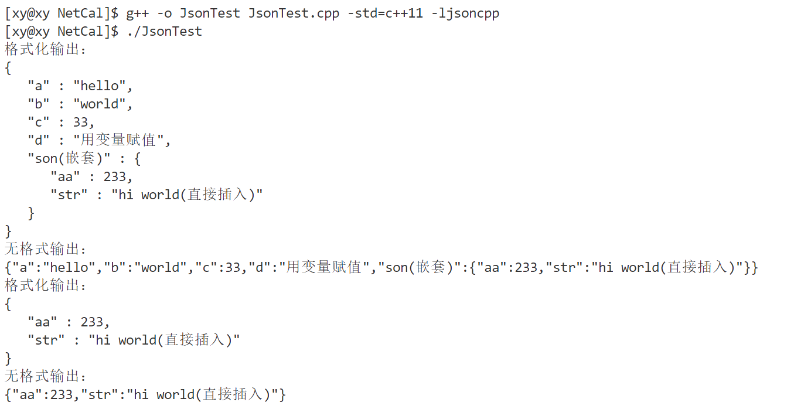
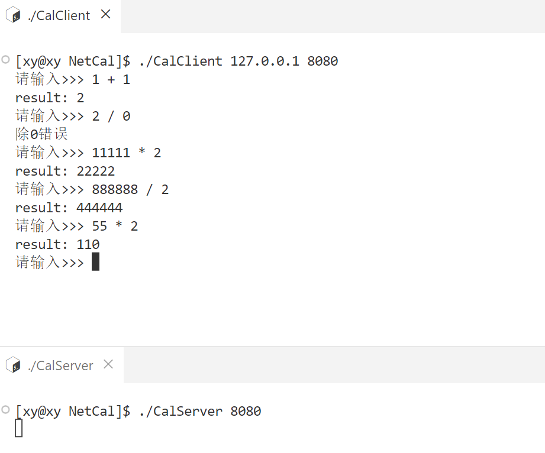

# 什么是协议

在网络通信中，协议（Protocol）是指计算机或设备之间进行通信的一系列规则的集合。

> 不管是网络还是生活中，协议是一种事先约定好的规则，通信的参与方按照同一份规则进行通信，如连接方式，如何识别等等。只有事先约定好了规则，才能保证后续通信时的效率和一定的安全性。

协议规定了通信实体之间所交换的消息的格式、意义、顺序以及针对收到信息或发生的事件所采取的动作。协议可以分为不同的层次，每一层负责不同的通信功能。常见的协议有 IP、TCP、HTTP、POP3、SMTP 等，它们属于 TCP/IP 协议族，也就是基于 TCP 和 IP 这两个最初的协议之上的不同的通信协议的大集合。

# 结构化数据

在网络通信时，数据可以分为结构化数据和非结构化数据。

处理数据的主体是机器，数据的本质是二进制序列，因此数据在网络中传输也是以二进制序列的形式传输的。

值得注意的是：

- 二进制序列和二进制数据流是不同的概念。二进制序列是指一串由 0 和 1 组成的数字，它可以表示任何类型的数据，例如文本、图像、音频等。二进制数据流是指一种数据传输方式，它是指以二进制序列为单位的连续数据流，例如从网络或文件中读取或写入数据。

- 二进制序列流可以认为是字符流，也就是字符串，只要它们遵循一定的编码规则，例如 ASCII、UTF-8 等。不同的编码规则会影响二进制序列和字符之间的对应关系。

也就是说，数据在网络中传输时，都是以二进制序列的形式传输的，无论是结构化数据还是非结构化数据。只是它们的==组织方式不同==，结构化数据有固定的格式和模式，非结构化数据没有预定义的格式和模式。因此，处理和分析这两种类型的数据需要不同的工具和方法。

## 结构化数据

结构化数据是指按照一定的规则、格式和顺序组织的数据，通常以表格、树形结构、图形等形式呈现，可以用数据库二维逻辑表来表现的数据。例如，在一个数据库中，数据以表格的形式存储，每个表格都有固定的字段和数据类型，数据的格式和顺序都是固定的。在网络通信中，结构化数据通常以 XML、JSON、Protocol Buffers 等格式进行传输。

> 简单理解结构化数据：例如我们的身份证 ID，虽然看起来是一串数字，但是不同的位数表示了不同的含义。这和下面的序列化和反序列化息息相关。

## 非结构化数据

非结构化数据是指没有固定格式和顺序的数据，通常以文本、图像、音频、视频等形式呈现，不方便用数据库二维逻辑表来表现的数据。例如，在一个文本文件中，数据没有固定的格式和顺序，而是由一些字符和换行符组成。在网络通信中，非结构化数据通常以二进制数据流的形式进行传输，例如在 FTP、HTTP 等协议中，文件就是以二进制数据流的形式传输的。

相比于非结构化数据，结构化数据更容易被处理和解析，因为它们有固定的格式和顺序，可以通过解析规则来进行处理。而非结构化数据则需要更强的语义理解和处理能力，因为它们没有固定的格式和顺序，需要通过文本分析、图像处理、音频识别等技术来进行处理。在网络通信中，结构化数据通常用于传输少量的、格式固定的数据，而非结构化数据则用于传输大量的、没有固定格式和顺序的数据，例如图像、音频、视频等。

## 半结构化数据

半结构化数据是指非关系模型的、有基本固定结构模式的数据，例如日志文件、XML 文档、JSON 文档等。在此暂不考虑。

# 结构化数据的传输

==在网络中传输结构化数据时，通常会将数据转换为字符串的形式进行传输，这样可以方便在网络上传输和解析==。具体地说，结构化数据在网络中传输时，有以下两种情况：

1. 字符串形式传输：一种常见的方法是将结构化数据转换为字符串格式（也就是说结构化的数据不能拆分地发送），例如 XML、JSON 等格式，然后通过网络协议（如 HTTP、TCP、UDP 等）进行传输。在接收端，可以通过解析字符串，将其还原为结构化数据。

   > 如果数据本身已经是字符串格式，那么在网络中传输时可以直接将其作为消息体进行传输，无需进行额外的转换。例如，在使用 HTTP 协议进行通信时，可以将字符串格式的数据直接放在 HTTP 请求或响应的消息体中进行传输。

2. 二进制形式传输：另一种方法是将结构化数据直接编码为二进制数据，然后通过网络协议进行传输。这种方法可以减少数据传输的大小，提高传输效率。在接收端，可以将接收到的二进制数据解码为结构化数据。

需要注意的是：

- [重要] 结构化数据在网络中传输时，通常是作为一个整体进行传输的，而不是拆分成多个部分进行分别发送的。这是因为结构化数据通常具有一定的层次结构，其中包含了多个元素或字段，这些元素或字段之间存在着一定的关系和依赖关系。如果将结构化数据拆分成多个部分进行分别发送，可能会导致数据不完整或顺序不正确，从而影响数据的正确性和解析。

  > 可以认为若干数据本身是一个结构体或类的属性（在示例中也是这么做的）。

  例如，假设要传输一个 XML 格式的文档，其中包含多个标签、元素和属性。如果将文档拆分成多个部分进行分别发送，可能会导致某些标签、元素或属性被分开发送，从而无法正确解析文档。此外，如果拆分后的数据包过小，还会导致网络传输效率低下，增加网络传输的开销。

  需要注意的是，尽管可以使用特殊的协议或技术将结构化数据拆分成多个部分进行传输，但这种方式仍然可能会增加数据传输的复杂度和开销，因此只有在必要的情况下才应该使用。如果数据本身不需要拆分，那么应该将其作为一个整体进行传输，以确保数据的正确性和传输效率。

- 如果字符串中包含一些特殊字符（例如空格、换行符、制表符、单引号、双引号等），则需要对其进行转义，以避免在传输过程中出现解析错误。常见的转义方式包括使用转义字符（如`\n`、`\t`、`'`、`"`等）或将字符串进行 Base64 编码等。在接收端，需要根据具体的转义方式进行解析和还原字符串数据。

- 虽然字符串格式和二进制格式是两种常见的数据传输方式，但在实际应用中也有其他的数据传输方式。例如，一些协议（如 HTTP）支持直接传输 HTML、CSS 等格式的文本数据，UDP 协议可以支持直接传输音视频流等二进制数据。因此，在选择数据传输方式时，需要根据具体的应用场景和要求进行选择。

- 此外，如果字符串数据需要进行压缩，可以使用压缩算法（如 Gzip、Deflate 等）将其压缩后再进行传输，以减少数据传输的大小。在接收端，需要将接收到的压缩数据进行解压缩，还原为原始的字符串数据。

例如稍后要实现的网络版计算器，操作符和其两侧的操作数就是结构化的数据，它不应该被分散地发送，因为对于一次运算它们是必要的。由于这是一个跨网络的数据传输，因此对于客户端向服务端发送计算请求时，应该将操作符和操作数打包在一起，作为一个整体发送给服务端处理；这样就能保证服务端能够接收到完整的数据。这便是“结构化”的意义。

## 序列化和反序列化

序列化和反序列化是一种在网络传输中处理对象的方法，它们是一对相反的操作。

- 序列化是把（结构化的）对象转换为可以传输的二进制流（二进制序列）的过程。
- 反序列化是把二进制流（序列）转换为（结构化的）对象的过程。

进行序列化和反序列化的原因有两个：

- 实现数据的持久化，通过序列化可以把数据永久地保存到硬盘上（通常存放在文件里）；
- 利用序列化实现远程通信，即在网络上传送对象的字节序列。

# 网络版计算器概述

## 制定协议

协议是通信方事先约定好的规则，由于通信的内容有所不同，对于若干个绑定在一起的数据，通过网络传输会提高风险，因此使用一个类或结构体保存它，然后将它打包通过网络传输。

值得注意的是，网络只是数据传输的通道，数据处理的主体是计算机，在计算机眼里，数据是由 01 组成的二进制序列。

> 为什么不直接传输结构化数据，而首先要转换为二进制序列？

- 一是为了保证数据的可移植性，不同的平台或语言可能有不同的数据表示方式，而二进制数据是一种通用的格式，可以在不同的环境中进行交换；

  > 例如不同系统和不同平台看待结构体的视角不同、大小端也可能不同。
- 二是为了提高数据的传输效率，结构化的数据通常包含很多元数据和冗余信息，而二进制数据是一种紧凑的格式，可以减少数据的大小和带宽消耗；
- 三是为了保证数据的安全性，结构化的数据容易被人为篡改或破解，而二进制数据是一种难以直接阅读和修改的格式，可以增加数据的保密性。

客户端和服务端是相对的，一般将请求计算资源的一端称之为客户端，将响应请求返回结果的一端称之为服务端。向网络中发送数据的主体可能是客户端（发送请求）也可能是服务端（响应请求），这需要将数据转化为二进制序列，也就是序列化；同样地，从网络中接受数据的主体可能是客户端（接收服务端的处理结果）也可能是服务端（处理客户端的请求），需要将二进制序列形式的数据**转换为服务器机器能处理的**结构化的数据，才能进行处理

> 也就是说，二进制序列是通用的，它能被各种机器识别，而不被它们之间的设计差异而有所区别。因此服务端或客户端机器将从网络中获取的二进制序列转换为结构化的数据后，这个结构化数据（的二进制组成）不一定和原主机进行序列化之前的结构化数据完全相同，这取决于机器和软件的实现。
>
> 服务端大多数机器是 Linux，客户端的操作系统可能是各种各样的。

### 通过字符串传输

很容易想到的一种协议是：客户端发送形如`操作数 1 运算符 操作数 2`这样的字符串给服务端，然后服务端解析这个字符串，取出操作数和运算符，将运算以后的结果返回。但是这样的操作实在太麻烦了。而且服务端响应请求都要执行这样繁琐的操作，大大降低效率。

### 结构化数据+序列化与反序列化

将操作数和运算符打包为一个结构化数据，放在一个类或结构体中，客户端将属性填充好以后对其进行序列化操作，使之能通过网络传输给对端服务器。当服务器接受到二进制形式的结构化数据后，对其进行反序列化，转换为客户端主机能处理的结构化数据，直接取出结构体或类中的属性，而不需要花费过多资源解析。

简单地说，序列化后的数据是方便机器处理，反序列化后的数据是方便用户层查看。

# 实现计算器

## 网络相关接口

将 Linux 中的网络操作例如创建套接字、监听、获取连接、连接等操作封装为函数，然后放在类`Sock`中。

```cpp
#include <iostream>
#include <string>
#include <cerrno>
#include <cstring>
#include <sys/types.h>
#include <sys/socket.h>
#include <netinet/in.h>
#include <arpa/inet.h>
#include <unistd.h>
#include "Log.hpp"

class Sock
{
private:
    const static int _backlog = 20;

public:
    Sock() {}
    ~Sock() {}
    // 1. 创建套接字
    int Socket()
    {
        int listen_sockfd = socket(AF_INET, SOCK_STREAM, 0);
        if (listen_sockfd < 0)
        {
            logMessage(FATAL, "%d:%s", errno, strerror(errno));
            exit(2);
        }
        logMessage(DEBUG, "%s: %d", "create socket success, sockfd", listen_sockfd);
        return listen_sockfd;
    }
    // 2. 绑定
    void Bind(int listen_sockfd, uint16_t port, std::string ip = "0.0.0.0")
    {

        // 2.1 填充属性
        struct sockaddr_in local;
        memset(&local, 0, sizeof(local));
        local.sin_family = AF_INET;    // 网络传输
        local.sin_port = htons(port); // 本地->网络
        local.sin_addr.s_addr = ip.empty() ? INADDR_ANY : inet_addr(ip.c_str());

        // 2.2 绑定
        if (bind(listen_sockfd, (struct sockaddr *)&local, sizeof(local)) < 0)
        {
            logMessage(FATAL, "bind():errno:%d:%s", errno, strerror(errno));
            exit(3);
        }
    }
    void Listen(int listen_sockfd)
    {
        // 3. 监听
        if (listen(listen_sockfd, _backlog) < 0)
        {
            logMessage(FATAL, "listen()errno:%d:%s", errno, strerror(errno));
            exit(4);
        }
        logMessage(NORMAL, "initialize tdp server...%s", strerror(errno));
    }
    int Accept(int listen_sockfd, std::string *ip, uint16_t *port)
    {
        struct sockaddr_in client;
        memset(&client, 0, sizeof(client));
        socklen_t len = sizeof(client);
        int service_sockfd = accept(listen_sockfd, (struct sockaddr *)&client, &len);
        // 获取连接失败
        if (service_sockfd < 0)
        {
            logMessage(ERROR, "accept()errno:%d:%s", errno, strerror(errno));
            return -1;
        }
        if (port)
            *port = ntohs(client.sin_port);
        if (ip)
            *ip = inet_ntoa(client.sin_addr);
        return service_sockfd;
    }
    // 获取连接成功
    // 通信准备 （网络->主机）
    bool Connect(int service_sockfd, const std::string &server_ip, const uint16_t &server_port)
    {
        struct sockaddr_in server;
        memset(&server, 0, sizeof(server));
        server.sin_family = AF_INET;
        server.sin_port = htons(server_port);
        server.sin_addr.s_addr = inet_addr(server_ip.c_str());

        if (connect(service_sockfd, (struct sockaddr *)&server, sizeof(server)) == 0)
            return true;
        else
            return false;
    }
};
```

## 框架

### 服务端

目前的服务端并未使用线程池，只是每获取一个客户端请求后，创建一个线程执行线程函数。

- 下面的逻辑将会在命名空间`ns_tcpserver`中定义，表示网络流通信（Network Stream ）。

- 定义一个类`ThreadData`，保存网络通信获取的套接字文件描述符，为了能够在静态的线程函数中直接调用`TcpServer`类中的接口，用一个成员保存指向`TcpServer`对象的地址。
- 定义一个`TcpServer`类，其中包含监听套接字文件描述符，以及刚才实现的`Sock`对象，以便直接通过这个对象执行网络相关操作。还有一个数组`_func`保存不同的线程函数。
  - 构造函数：获取监听套接字文件描述符、绑定和监听。
  - 析构函数：关闭监听套接字文件描述符。
  - Bind()：绑定一个服务，即将数组`_func`中的一个函数和内核绑定起来。
  - Excute()：执行任务。
  - Start()：通过`Sock`对象中的`Accept()`获取连接，然后创建一个线程执行任务。

```cpp
// CalServer.hpp
#pragma once

#include <pthread.h>
#include <functional>
#include <vector>
#include "Sock.hpp"

namespace ns_tcpserver
{
    using func_t = std::function<void(int)>;

    class TcpServer; // 声明 TcpServer 类，以供 ThreadData 定义成员
    
    class ThreadData
    {
    public:
        ThreadData(int sockfd, TcpServer *server)
            : _sockfd(sockfd), _server(server)
        {
        }
        ~ThreadData() {}
    public:
        int _sockfd;
        TcpServer *_server;
    };

    class TcpServer
    {
    private:
        static void *ThreadRoutine(void *args)
        {
            pthread_detach(pthread_self());
            ThreadData *td = static_cast<ThreadData *>(args);
            td->_server->Excute(td->_sockfd);
            close(td->_sockfd);
            return nullptr;
        }

    public:
        TcpServer(const uint16_t &port, const std::string &ip = "")
        {
            _listen_sockfd = _sock.Socket();
            _sock.Bind(_listen_sockfd, port, ip);
            _sock.Listen(_listen_sockfd);
        }
        ~TcpServer()
        {
            if (_listen_sockfd >= 0)
                close(_listen_sockfd);
        }
        void BindService(func_t func)
        {
            _func.push_back(func);
        }
        void Excute(int sockfd)
        {
            for (auto &f : _func)
                f(sockfd);
        }
        void Start()
        {
            while (1)
            {
                std::string client_ip;
                uint16_t client_port;
                int sockfd = _sock.Accept(_listen_sockfd, &client_ip, &client_port);
                if (sockfd == -1)
                    continue;
                logMessage(NORMAL, "%s: %d", "link success, sockfd: %d", sockfd);
                pthread_t tid;
                ThreadData *td = new ThreadData(sockfd, this);
                pthread_create(&tid, nullptr, ThreadRoutine, td);
            }
        }

    private:
        int _listen_sockfd;
        Sock _sock;
        std::vector<func_t> _func;
    };
}
```

值得注意的是：

- `ThreadData`的成员`_server`类型是`TcpServer *`，但是后者还没有实现，所以要在`ThreadData`之前使用`class TcpServer;`声明`TcpServer`类才能编译通过。
- `using func_t = std::function<void(int)>;`是一种常用的给函数对象起别名的方法。

```cpp
// CalServer.cc
#include <iostream>
#include <memory>
#include "CalServer.hpp"

using namespace ns_tcpserver;

void Usage(const std::string &proc)
{
    std::cout << "\nUsage: " << proc << " [PORT]\n" << std::endl;
}

void debug(int sock)
{
    std::cout << "test" << std::endl;
}

int main(int argc, char *argv[])
{
    if(argc != 2)
    {
        Usage(argv[0]);
        exit(0);
    }
    std::unique_ptr<TcpServer> server_ptr(new TcpServer(atoi(argv[1])));
    server_ptr->BindService(debug);
    server_ptr->Start();
}
```

目前的代码能编译通过，后续只要在这个基础上修改即可。

### 客户端

由于 TCP 面向连接，客户端无需手动绑定，实现起来比服务端更简单。

```cpp
// CalClient.hpp
#include "Sock.hpp"

namespace ns_tcpclient
{
    class TcpClient
    {
    public:
        TcpClient(const uint16_t &server_port, const std::string &server_ip = "") 
        {
            _sockfd = _sock.Socket();
            if (!_sock.Connect(_sockfd, server_ip, server_port))
            {
                logMessage(FATAL, "Sock.Connect():errno:%d:%s", errno, strerror(errno));
                exit(2);
            }
        }
        ~TcpClient() 
        {
            if (_sockfd >= 0) 
                close(_sockfd);
        }
        void Start()
        {
            bool quit = false;
            while (!quit)
            {
                // 获取请求
                // 发送请求
                // ...
            }
        }
    private:
        int _sockfd;
        Sock _sock;
    };
}
```

- 成员属性：`_sockfd`保存套接字文件描述符；`Sock`类型的`_sock`对象，以便客户端调用网络相关接口。
- 构造函数：获取用户在命令行传入的 IP 和 PORT，然后通过`_sock`对象调用`Socket()`接口创建套接字，同时保存文件描述符。
- 析构函数：关闭文件描述符。
- `Start()`：客户端发起请求的逻辑，将在后续实现。

```cpp
// CalClient.cc
#include <iostream>
#include <memory>
#include "CalClient.hpp"

using namespace ns_tcpclient;

void Usage(const std::string &proc)
{
    std::cout << "\nUsage: " << proc << " [IP] [PORT]\n" << std::endl;
}

int main(int argc, char *argv[])
{
    if(argc != 3)
    {
        Usage(argv[0]);
        exit(1);
    }
    std::string ip = argv[1];
    uint16_t port = atoi(argv[2]);
    std::unique_ptr<TcpClient> client_ptr(new TcpClient(port, ip));
    client_ptr->Start();
}
```

## 制定协议

指定协议相关的逻辑将在`Protocol.hpp`中实现。

计算器的例子中，通信双方是客户端和服务端，它们都需要按照一套相同的规则通信，因此单独将这一套相同的规则包装。

客户端和服务端都需要处理请求（request）和响应（response），因此它们都需要对数据进行序列化和反序列化。

- 请求：
  - 序列化（Serialize）：[客户端生产请求] 将结构化的数据转换为二进制序列，例如将形如`1 + 1`这两个操作数和 1 个操作符以及 2 个空格作为一个字符串通过网络传输给对端主机。
  - 反序列化（Deserialized）：[服务端处理请求] 将从网络中获取的序列化的二进制序列（字符串）按照规则，提取出运算需要的两个操作数和一个操作符。
- 响应：
  - 序列化（Serialize）：[服务端生产响应] 将得到的结果和错误码转换为二进制序列的字符串，通过网络传输给请求的发出者。
  - 反序列化（Deserialized）：[客户端处理响应] 将从网络中获取的结果和错误码提取出来，然后根据错误码和错误原因的映射情况处理。（错误码一般和不同的错误原因有映射关系）如果没有出现异常，客户端则直接输出结果。

> 实际上，为保证效率和稳定性，一般会采用成熟的方案，而不会自己订制协议。在此只是为了演示。

### 请求

**序列化：**

将形如`1 + 1`这样的操作序列化为一个形如`"1 + 1"`这样的字符串。其中包含 2 两个空格，2 个数字和 1 个操作符。为了方便后续操作，将空格和它的长度用宏定义。

序列化就是将这些操作数和操作符以及空格拼接成一个字符串。

**反序列化：**

和序列化的过程相反，从字符串中拆分，然后再转换为操作数和操作符。

```cpp
// Protocol.hpp
namespace ns_protocol
{
#define SPACE " "
#define SPACE_LEN strlen(SPACE)
    // 请求
    class Request
    {
    public:
        // 序列化
        //  1  +  1 -> "1 + 1"
        // _x  + _y
        std::string Serialize()
        {
            std::string str;
            str += std::to_string(_x);
            str += SPACE;
            str += _op;
            str += SPACE;
            str += std::to_string(_y);
            return str;
        }
        // 反序列化
        // 1  +  1 <- "1 + 1"
        bool Deserialize(const std::string &str)
        {
            std::size_t left = str.find(SPACE);
            if (left == std::string::npos)
                return false;
            std::size_t right = str.rfind(SPACE);
            if (right == std::string::npos)
                return false;
            _x = atoi(str.substr(0, left).c_str());
            _y = atoi(str.substr(right + SPACE_LEN).c_str());
            if (left + SPACE_LEN > str.size())
                return false;
            else
                _op = str[left + SPACE_LEN];
            return true;
        }

    public:
        Request() {}
        Request(int x, int y, char op)
            : _x(x), _y(y), _op(op)
        {
        }
        ~Request() {}

    public:
        int _x;
        int _y;
        char _op;
    };
}
```

同样地，它将在命名空间`ns_protocol`中被定义。

### 响应

响应的对象是请求，即处理请求。那么它应该包含两个操作数和一个运算符，用`_result`保存结果。

除此之外，运算本身也是有一定前提的，因此它可能会产生错误，例如分母不能为零，模数不能为零。因此使用一个`_code`错误码来标识错误类型，通常情况下，若干错误码对应着不同的错误类型，当出现错误时从表中获取错误类型并打印出来，以供调试和告知。这里的错误类型比较少，就直接用了。

```cpp
// Protocol.hpp
namespace ns_protocol
{
#define SPACE " "
#define SPACE_LEN strlen(SPACE)
#define SEP "\r\n"
#define SEP_LEN strlen(SEP)    
	// 响应
    class Response
    {
    public:
        // 序列化
        std::string Serialize()
        {
            std::string str;
            str += std::to_string(_code);
            str += SPACE;
            str += std::to_string(_result);
            return str;
        }
        // 反序列化
        bool Deserialize(const std::string &str)
        {
            std::size_t pos = str.find(SPACE);
            if (pos == std::string::npos)
                return false;
            _code = atoi(str.substr(0, pos).c_str());
            _result = atoi(str.substr(pos + SPACE_LEN).c_str());
            return true;
        }

    public:
        Response() {}
        Response(int result, int code, int x, int y, char op)
            : _result(result), _code(code), _x(x), _y(y), _op(op)
        {
        }
        ~Response() {}

    public:
        int _result; // 结果
        int _code;   // 错误码

        int _x;
        int _y;
        char _op;
    };

    // 发送数据
    void Send(int sockfd, const std::string &s)
    {
        if (send(sockfd, s.c_str(), s.size(), 0) < 0)
        {
            logMessage(FATAL, "send error, %d:%s", errno, strerror(errno));
            exit(5);
        }
        logMessage(DEBUG, "send %s", strerror(errno));
    }
    // 接收数据
    std::string Recv(int sockfd)
    {
        char inputBuffer[1024];
        if (recv(sockfd, inputBuffer, sizeof(inputBuffer), 0) < 0)
        {
            logMessage(FATAL, "recv error, %d:%s", errno, strerror(errno));
            exit(6);
        }
        logMessage(DEBUG, "recv %s", strerror(errno));
        return inputBuffer;
    }
}
```

### 发送和接收数据

服务端处理获取请求，需要从网络中获取；服务端处理请求以后，可能需要将结果回传给客户端，因此需要将数据发送到网络中。客户端同理。

发送和接收数据的逻辑是和网络相关的，它可以放在`Sock.hpp`中，但由于服务端中处理请求的逻辑可能并不是被类包装的，也就没有`Sock`类的成员，因此也就无法直接通过成员调用被封装在对象中的发送和接收数据的逻辑。

因此将发送和接收数据的逻辑放在了`Protocol.hpp`中，不被`ns_protocol`命名空间限制。

```cpp
// 发送数据
void Send(int sockfd, const std::string &s)
{
    if (send(sockfd, s.c_str(), s.size(), 0) < 0)
    {
        logMessage(FATAL, "send error, %d:%s", errno, strerror(errno));
        exit(5);
    }
    logMessage(DEBUG, "send %s", strerror(errno));
}
// 接收数据
std::string Recv(int sockfd)
{
    char inputBuffer[1024];
    if (recv(sockfd, inputBuffer, sizeof(inputBuffer), 0) < 0)
    {
        logMessage(FATAL, "recv error, %d:%s", errno, strerror(errno));
        exit(6);
    }
    logMessage(DEBUG, "recv %s", strerror(errno));
    return inputBuffer;
}
```

实际上真正在执行接收和发送数据的操作只有几行，其他部分都是差错处理和打日志的操作。

需要注意响应`Response`和请求`Request`中序列化和反序列化的参数及返回值。

## 计算逻辑

服务端首先从网络中获被客户端序列化的字符串，然后定义一个`Request`类型的对象`req`，使用它来将其反序列化。

接着定义一个`Response`类型的对象`resp`，获取处理请求后的结果，序列化以后发送到网络中。

计算的逻辑很简单，就是通过对象中`_op`的类型来进行不同的计算。需要注意的是`calculatorHelper`的参数是`Request`类型对象，返回值是`Response`类型对象。

```cpp
static Response calculatorHelper(const Request &req)
{
    Response resp(0, 0, req._x, req._y, req._op);
    switch (req._op)
    {
    case '+':
        resp._result = req._x + req._y;
        break;
    case '-':
        resp._result = req._x - req._y;
        break;
    case '*':
        resp._result = req._x * req._y;
        break;
    case '/':
        if (req._y == 0) resp._code = 1;
        else resp._result = req._x / req._y;
        break;
    case '%':
        if (req._y == 0) resp._code = 2;
        else resp._result = req._x % req._y;
        break;
    default:
        resp._code = 3;
        break;
    }
    return resp;
}
void calculator(int sockfd)
{
    while (1)
    {
        std::string str = Recv(sockfd);
        Request req;
        req.Deserialize(str);                   // 网络->反序列化
        Response resp = calculatorHelper(req);  // 处理请求
        std::string respStr = resp.Serialize(); // 序列化->网络
        Send(sockfd, respStr);                  // 回传数据
    }
}
```

## 测试

回顾之前定义的`BindService()`函数，它的作用是将函数的地址 push_back 到数组中，以供线程调用。

```cpp
int main(int argc, char *argv[])
{
    if (argc != 2)
    {
        Usage(argv[0]);
        exit(0);
    }
    std::unique_ptr<TcpServer> server_ptr(new TcpServer(atoi(argv[1])));
    server_ptr->BindService(calculator);
    server_ptr->Start();
}
```

从标准输入获取结构化数据：

```cpp
// CalClient.hpp
namespace ns_tcpclient
{
    class TcpClient
    {		
		void Start()
        {
            bool quit = false;
            while (!quit)
            {
                int x, y;
                char op;
                std::cin >> x >> op >> y;
                Request req(x, y, op);
                // ...
            }
        }
    };
}
```

在这里，`calculator`就是被 push_back 的函数。


简单测试几个功能，注意到当除数为 0 时，错误码是刚刚设置的 1。

## 存在的问题

1. 当前的逻辑当客户端断开连接时，服务端会直接退出。
2. 服务端获取序列化的字符串不应该为空，否则后续的 Send() 函数会出现问题。例如常见的问题是一端在写入时，另一端直接关闭了。

解决办法是增加差错处理逻辑：

- 忽略`SIGPIPE`信号
- 当服务端没有获取到数据时，就直接 break 退出。

```cpp
// Protocol.hpp
// 接收数据
bool Recv(int sockfd, std::string *out)
{
    char inBuffer[1024];
    ssize_t s = recv(sockfd, inBuffer, sizeof(inBuffer) - 1, 0);
    if (s > 0)
    {
        inBuffer[s] = 0;
        *out += inBuffer;
    }
    else if (s == 0)
    {
        logMessage(FATAL, "client quit %d:%s", errno, strerror(errno));
        return false;
    }
    else
    {
        logMessage(FATAL, "recv %d:%s", errno, strerror(errno));
        return false;
    }
    logMessage(DEBUG, "recv %s", strerror(errno));
    return true;
}
```

`Recv()`增加一个输出型参数，返回值改为 bool 类型。

```cpp
// Calserver.cc
void calculator(int sockfd)
{
    while (1)
    {
        std::string str;
        bool ret = Recv(sockfd, &str);
        if (ret)
        {
            Request req;
            req.Deserialize(str);                   // 网络->反序列化
            Response resp = calculatorHelper(req);  // 处理请求
            std::string respStr = resp.Serialize(); // 序列化->网络
            Send(sockfd, respStr);                  // 回传数据
        }
        else break;
    }
}
```

```cpp
// CalClient.hpp
void Start()
{
    bool quit = false;
    while (!quit)
    {
        Request req;
        std::cout << "请输入>>>";
        std::cin >> req._x >> req._op >> req._y;
        std::string s = req.Serialize(); // 序列化->网络
        Send(_sockfd, s);
        std::string buffer;
        while (1)
        {
            bool ret = Recv(_sockfd, &buffer);
            if (!ret)
            {
                quit = true;
                break;
            }
            Response resp;
            resp.Deserialize(buffer); // 反序列化->主机
            std::string err;
            switch (resp._code)
            {
                case 1:
                    err = "除 0 错误";
                    break;
                case 2:
                    err = "模 0 错误";
                    break;
                case 3:
                    err = "非法操作";
                    break;
                default:
                    std::cout << "code: " << resp._code << std::endl;
                    std::cout << "result: " << resp._result << std::endl;
                    break;
            }
            if (!err.empty()) std::cerr << err << std::endl;
            break;
        }
    }
}
```

现在就从代码逻辑上解决了服务端在读取时，如果读取失败就直接退出。但是没有解决一方正在写入时对方把连接关闭的问题。一般经验：服务端在编写时，要有较为严谨的判断逻辑，一般服务器都要忽略 SIGPIPE 信号，防止非法写入的问题。

# TCP 服务端

TCP 是面向字节流的，从实现上可以简单地理解为使用字符串。不同于 UDP，前者面向数据包，相当于发快递，是客户端发一次，服务端接收一次（调用一次 recvfrom 函数），因此读取的是完整的 Request 对象。在 TCP 协议的服务端中，可能一个服务端会同时等待多个 Request 请求，然后一次性读取多个 Request 对象，==问题在 TCP 服务端获取 Request 时，如何保证数据传输的完整性==。

TCP 和 UDP 是「传输控制」协议。在 TCP 协议中，客户端和服务端调用函数发送或接收数据时，只是将数据拷贝到缓冲区，并未真正交给函数处理。 这是因为 TCP 是流式传输，没有边界，需要根据窗口大小和网络状况来确定何时发送数据。

所以不能认为调用 send() 和 recvfrom() 等函数是将数据发送/接收到网络或对方主机中。

> 一般来说，当缓冲区满了或者超时了，TCP 就会发送数据。当收到对方的确认信息或者重置信息，TCP 就会接收数据。

结论：

1. IO 函数的本质都是拷贝函数，因为一般 IO 接口都会有一个用户自定义的缓冲区作为参数。
2. 数据何时发送、每次发送多少数据，以及差错处理等细节，都不是应用层应该关心的，这取决于「传输控制」协议即 TCP 协议决定。
3. 由于缓冲区的存在，发送数据的次数和接收次数没有任何关系。（例如管道中写端快读端慢，两端读写的次数不一定是相同的）

虽然如此，但是具有这些性质并不能保证读取的完整性。

## 保证报文的完整性

`Protocol.hpp`中的`Recv()`函数的返回值不再是一个字符串，而是以一个输出型参数作为返回值，只返回 bool 类型以表示成功与否。这么做可以让这个函数值负责接收数据，`CalServer.cc`中的计算器函数`calculator()`函数使用一个指针类型的变量作为输出型参数获取处理以后的数据。如何在此函数中解析和处理数据。

像之前`Recv()`的逻辑，无法保证读到`inbuffer`缓冲区中的数据是一个完整的请求。

因此需要在原有的基础上对协议进一步定制。

## 定制协议（划分报文）

在之前写过的 TCP socket 中，TCP 的客户端-服务端（c-s）都无法保证报文的完整性，因此在协议中增加一个成员`length`，表示报文的长度。因此，报文的信息就包含了：报文长度+报文内容。

形如`"length\r\nx_ op_ y_\r\n"`中的`'\r\n'`（宏`SEP`）是为了将`length`属性字段和其他属性字段划分，是通过特殊字符区分属性的方法。因为有效信息的长度本身是变化的，因此这个属性`length`的值也可能会变，因此要有一个方法，使得机器无论如何都能得到`length`字段。

长度是一个整数，内部不会出现特殊符号，那么以`length`分隔的字段就是数据本身了，即正文。那么`length`即使协议报头，后面的内容就是有效载荷。

> 为什么使用`\r\n`划分？

- `\r\n`的可读性比较好，如果不加的话也可以。

注意：`length`不能包含`\r\n`(2 字节）

这样就通过多个标记字符`'\r\n'`（当做一个整体）将报文划分为 2 个区域：有效数据的长度+有效数据。这样当主机从网络中获取到报文时，通过这个标记字符就能取出它们，并验证长度是否正确，这样就能保证报文的完整性。为了方便使用，用宏定义它们：

```cpp
#define SEP "\r\n"
#define SEP_LEN strlen(SEP)
```

注意不能用 sizeof 计算它的长度，否则会包含最后的'\0'。

### 编码

编码实际上就是将一个完整的报文用一个长度字段的报头包装起来，使得有效载荷是完整的。

实际上就是返回一个字符串，这个字符串的格式是这样的：`"length\r\nx_ op_ y_\r\n"`，编码的格式就是简单的字符串拼接，中间的有效数据（有效载荷）序列化时处理好了，现在要拼接的只有一个长度`length`和两个`'\r\n'`：
```cpp
// 编码
std::string Encode(std::string &s)
{
    std::string package = std::to_string(s.size());
    package += SEP;
    package += s;
    package += SEP;
    return package;
}
```

> 为什么在后面也要加一个`\r\n`呢？

因为可能一次发送的报文不止一个，例如：

```text
length\r\nx_ op_ y_\r\nlength\r\nx_ op_ y_\r\n
```

这样就能和其他报文区分了。

### 解码

解码的过程和编码相反，是将字符串拆分的过程。对应的，是去除长度报头，提取被包装的有效载荷的过程。

`Recv()`只接受数据，`Decode()`的作用就是根据定制的协议，提取数据。步骤：

1. 用 find() 提取`length`字段，如果它不存在则返回空串。
2. 验证正文长度是否与`length`相等。
3. 截取有效内容，去除无效内容。只要只有一个完整的报文，就可以提取。

```cpp
// 解码
// "length\r\nx_ op_ y_\r\n"
std::string Decode(std::string &buffer)
{
    // 查找 length 字段
    std::size_t pos = buffer.find(SEP);
    if (pos == std::string::npos)
        return "";
    // 验证 length 和有效数据长度是否相等
    int size = atoi(buffer.substr(0, pos).c_str());
    int surplus = buffer.size() - pos - 2 * SEP_LEN;
    if (surplus >= size)  // 至少有一个完整的报文，提取
    {
        buffer.erase(0, pos + SEP_LEN);
        std::string s = buffer.substr(0, size);
        buffer.erase(0, size + SEP_LEN);
        return s;
    }
    else
        return "";
}
```

## 修改

在`calculator()`和`TcpServer::Start()`中增加添加和取出报头的逻辑。

```cpp
// CalClient.hpp
void Start()
{
    bool quit = false;
    std::string buffer;
    while (!quit)
    {
        // 生产请求
        Request req;
        std::cout << "请输入>>> "; // 从标准输入获取数据
        std::cin >> req._x >> req._op >> req._y;
        // 序列化->网络
        std::string s = req.Serialize();
        // 添加长度报头
        s = Encode(s);
        // 发送数据到网络中（服务器）
        Send(_sockfd, s);
        // 读取
        while (1)
        {
            bool ret = Recv(_sockfd, &buffer);
            if (!ret)
            {
                quit = true;
                break;
            }
            std::string package = Decode(buffer); // 协议解析（提取有效载荷）
            if (package.empty())                  // 得到的字符串为空，进行下一次读取
                continue;                         // 保证了读取报文的安全性
            Response resp;
            resp.Deserialize(package); // 反序列化->主机（注意是有效载荷）
            std::string err;
            switch (resp._code) // 打印错误信息
            {
                case 1:
                    err = "除 0 错误";
                    break;
                case 2:
                    err = "模 0 错误";
                    break;
                case 3:
                    err = "非法操作";
                    break;
                default:
                    std::cout << "result: " << resp._result << std::endl;
                    break;
            }
            if (!err.empty())
                std::cerr << err << std::endl;
            break;
        }
    }
}
```

```cpp
// CalServer.cc
void calculator(int sockfd)
{
    std::string inbuffer;
    while (1)
    {

        bool ret = Recv(sockfd, &inbuffer); // 从网络中读取请求
        if (!ret)
            break;

        std::string package = Decode(inbuffer); // 协议解析（提取有效载荷）
        if (package.empty())                    // 得到的字符串为空，进行下一次读取
            continue;                           // 保证了读取报文的安全性
        logMessage(NORMAL, "inbuffer: %s", package.c_str());
        Request req;
        req.Deserialize(package);               // 网络->反序列化（注意要使用有效载荷）
        Response resp = calculatorHelper(req);  // 处理请求
        std::string respStr = resp.Serialize(); // 序列化->网络
        respStr = Encode(respStr);              // 添加长度报头
        Send(sockfd, respStr);                  // 回传数据
    }
}
```

## 测试

简单测试一下：


# 守护进程版本

[守护进程](https://blog.csdn.net/m0_63312733/article/details/131025735?spm=1001.2014.3001.5501)（Daemon）是一种在后台运行的特殊进程，它不属于任何终端，也不受用户的交互控制，通常用来执行一些系统服务或应用程序。

像上面包括之前博文实现的 UDP 和 TCP 服务器，都是在前台运行的进程（即运行起来以后光标一直在闪动，因为需要用无限循环使逻辑不断运行）。关于守护进程：

1. 每当一个用户登录计算机时，系统会自动创建一个新的 shell 会话，通常是 bash、zsh、fish 等。那么它（这个窗口）就是一个前台进程（如果你试着 kill 掉某个 bash 进程，你的窗口就会被关闭）。每一个 shell 会话，只允许存在一个前台进程，而可以用若干个后台进程。用户在这个窗口中执行的各种命令的父进程都是 shell 会话进程（如 bash）。
2. 使用 PID 标识进程 ID，使用 PPID 标识父进程 ID，使用 PGID 标识进程组 ID。
3. 可以使用`|`管道同时启动多个进程，这些进程是兄弟关系，它们的父进程是会话进程（例如 bash），它作为前台进程和用户进行交互。这些兄弟进程可以使用匿名管道进行通信。
4. 被同时启动的进程总体被称为进程组，通常第一个进程被作为这个进程的组长进程。这个进程组提供的服务就称之为会话。

每当用户登录计算机，OS 会为用户创建一个新的会话，以提供相应服务；如果用户退出登录（如注销），理论上 OS 会释放所用对应的资源：

- 前台服务：（有可能）退出（取决于 OS）。
- 后台服务：后台服务不属于任何终端，这种服务一般被期望用于长期服务的进程，那么它会自成一个会话，不被 shell 会话关闭而受影响，称之为“守护进程”。

> 如何让进程（组）自成一个会话？

可以使用** setsid **命令。它不仅会创建一个新的进程组，还会在一个新的会话中启动命令。例如：

```bash
setsid COMMAND
```

这会在一个新的会话和进程组中运行 COMMAND。可以使用`ps -o pid,sid,pgid,comm`命令来查看进程的会话 ID（SID）和进程组 ID（PGID）。

> setsid() 要成功被执行，有什么前提？

- 调用进程不能是一个进程组的组长进程。

如果调用进程是一个进程组的组长进程，setsid() 会返回-1，并设置 errno 为 EPERM（表示操作不被允许）。这是为了防止一个进程组的组长进程将自己放到一个新的会话中，而其他进程仍然留在原来的会话中，这样会破坏会话和进程组的两级层次结构。为了确保 setsid() 能够成功，可以先调用 fork(2) 并让父进程退出，而子进程（一定不是一个进程组的组长进程）调用 setsid()。


## 实现

下面将在进程中调用该函数，让它自己成为一个守护进程：
```cpp
#pragma once

#include <iostream>
#include <unistd.h>
#include <signal.h>
#include <sys/types.h>
#include <sys/stat.h>
#include <fcntl.h>

void MyDaemon()
{
    // 1. 忽略信号
    signal(SIGPIPE, SIG_IGN);
    signal(SIGCHLD, SIG_IGN);

    // 2. 不要让自己成为组长
    if (fork() > 0)
        exit(0);
    // 3. 调用 setsid
    setsid();
    // 4. 将标准输入，标准输出和标准错误的重定向到该路径
    // 使得守护进程不能直接向显示器打印消息
    int devnull = open("/dev/null", O_RDONLY | O_WRONLY);
    if (devnull > 0)
    {
        dup2(0, devnull);
        dup2(1, devnull);
        dup2(2, devnull);
        close(devnull);
    }
}
```

在`CalServer.cc`中调用它：
```cpp
int main(int argc, char *argv[])
{
    // ...
    MyDaemon();
    
    std::unique_ptr<TcpServer> server_ptr(new TcpServer(atoi(argv[1])));
    server_ptr->BindService(calculator);
    server_ptr->Start();
}
```

> 守护进程为什么要将标准输入，标准输出和标准错误的重定向？

- 守护进程通常不需要和用户交互，所以关闭标准输入可以防止它们被意外地阻塞在等待用户输入的地方。
- 守护进程可能会从父进程继承一些打开的文件描述符，这些文件描述符可能是不需要的或者占用了系统资源。关闭所有不必要的文件描述符，包括标准输入，标准输出和标准错误，可以释放这些资源，并避免对这些文件的误操作。
- 守护进程可能会产生一些输出或者错误信息，如果不重定向到合适的地方，这些信息可能会丢失或者干扰其他程序。重定向标准输出和标准错误到一个日志文件或者/dev/null，可以方便地记录或者忽略这些信息。

总的来说，不能向显示器打印消息的原因是它已经是独立的进程（组），和当前的会话（终端）已经没有关系了。一旦打印消息，就会被暂停或者被终止。

简单测试一下：


可以看到，这个进程自成会话，表现是 PPID=1，PID 和 PGID 相同，TTY=？。守护进程是孤儿进程的一种，守护进程自成会话。这样就能让服务端在后台运行，关闭终端窗口也不影响服务，这样就能无时无刻的为客户端提供服务了。而且后台进程不会影响当前终端窗口的其他任务的执行，因为含有无限循环的前台进程会阻塞 I/O，它会一直占用 CPU 资源，导致其他进程无法得到调度。

在同一 shell 会话中也能启动客户端进程测试：


# json 版本

## json 介绍

JavaScript Object Notation，是一种轻量级的数据交换格式，使用人类可读的文本来存储和传输由属性值对和数组（或其他可序列化的值）组成的数据对象。JSON 是一种语言无关的数据格式，它源自于 JavaScript，但是许多现代编程语言都包含了生成和解析 JSON 格式数据的代码。JSON 文件使用。json 作为扩展名，但不是强制的。

JSON 有以下特点：

- 数据以==键值对==的形式表示，类似于 JavaScript 对象的属性。
- 数据由逗号分隔，花括号保存对象，方括号保存数组。
- JSON 是“自描述”的，易于理解和使用。
- JSON 可以用于存储和交换各种类型的数据，如数字、布尔值、字符串、日期、对象、数组等。

JSON 有以下用途：

- JSON 通常用于从服务器向网页发送数据。
- JSON 可以用于在不同的编程语言之间进行数据交换。
- JSON 可以用于存储配置文件、日志文件、用户偏好等信息。
- JSON 可以用于构建复杂的数据结构，如树、图、地图等。

- JSON 数据格式比较简单，易于读写，格式都是压缩的，占用带宽小。
- JSON 易于解析，客户端 JavaScript 可以简单地通过 eval() 函数进行 JSON 数据的读取。
- JSON 格式能够直接为服务器端代码使用，大大简化了服务器端和客户端的代码开发量，但是完成的任务不变，且易于维护。

## 优点

相比于手动对字符串 encode 和手动 decode，后者有以下缺点：

- 需要编写额外的代码，增加了开发和维护的成本和复杂度。
- 容易出错，比如忘记转义特殊字符，或者解析时没有考虑到边界情况。
- 对字符串 encode 和手动 decode 可能导致数据类型的丢失或不一致，比如数字、布尔值、日期等在字符串中无法区分。
- 对字符串 encode 和手动 decode 可能导致数据结构的不清晰或不规范，比如数组、对象、嵌套等在字符串中无法直观地表示。

实际上，之前手动写的协议是一个很粗略的协议，实际上用户只要输入两个操作数和一个操作符，中间的空格理论上可以是任意个，诸如此类的问题还有很多。因此实际应用中会使用成熟的协议。

## 实现

C++没有内置的 json 库，但是有很多第三方的 json 库可以使用，如 RapidJSON, JsonCpp, sonic-cpp 等。安装 JsonCpp：

```shell
sudo yum install jsoncpp-devel 
```

验证安装是否成功：


在编译选项中要增加`-ljsoncpp`链接该第三方库。

### 用法

注意头文件的包含。

```cpp
#include <iostream>
#include <string>
#include <jsoncpp/json/json.h>

int main()
{
    std::string a = "hello";
    std::string b = "world";
    char c = '!';
    std::string d = "用变量赋值";

    Json::Value root;
    root["a"] = a;
    root["b"] = b;
    root["c"] = c;
    root["d"] = d;

    Json::Value son;
    son["aa"] = 233;
    son["str"] = "hi world（直接插入）";

    root["son（嵌套）"] = son;

    Json::StyledWriter swriter; // 格式化输出（适合人类阅读）
    Json::FastWriter fwriter;   // 无格式输出（适合机器读取）

    std::string sstr1 = swriter.write(root);
    std::string fstr1 = fwriter.write(root);
    std::cout << "格式化输出：" << std :: endl << sstr1;
    std::cout << "无格式输出：" << std :: endl << fstr1;

    std::string sstr2 = swriter.write(son);
    std::string fstr2 = fwriter.write(son);
    std::cout << "格式化输出：" << std :: endl << sstr2;
    std::cout << "无格式输出：" << std :: endl << fstr2;

}
```

- 初始化键值对主要用两种办法，一是先初始化各种类型的变量，然后赋值给键（key）；二是直接用值（value）赋值给键（key）。后者更方便。

- `root["son"] = son`表示将 son 对象嵌套进 root 对象中。

- 其次转换为字符串有两种格式，一是格式化，比较美观，适合人类阅读，方便调试；而是无格式，比较紧凑，能节省空间，提高传输效率。

例如：


### 实现

下面修改`Request`和`Response`中序列化和反序列化的逻辑（Protocol.hpp）：

```cpp
// Request::Serialize
std::string Serialize()
{
    Json::Value root;
    root["x"] = _x;
    root["y"] = _y;
    root["op"] = _op;
    Json::FastWriter fwriter;
    return fwriter.write(root);
}
// Request::Deserialize
bool Deserialize(const std::string &str)
{
    Json::Value root;
    Json::Reader reader;
    reader.parse(str, root);
    _x = root["x"].asInt();
    _y = root["y"].asInt();
    _op = root["op"].asInt();
    return true;
}
// Response::Serialize
std::string Serialize()
{
    Json::Value root;
    root["code"] = _code;
    root["result"] = _result;
    root["xx"] = _x;
    root["yy"] = _y;
    root["zz"] = _op;
    Json::FastWriter fwriter;
    return fwriter.write(root);
}
// Response::Deserialize
bool Deserialize(const std::string &str)
{
    Json::Value root;
    Json::Reader reader;
    reader.parse(str, root);
    _code = root["code"].asInt();
    _result = root["result"].asInt();
    _x = root["xx"].asInt();
    _y = root["yy"].asInt();
    _op = root["zz"].asInt();
    return true;
}
```

这样就能保证每次获取的数据是一个完整的 Json 字节流。

简单测试一下（为了方便测试，暂时不作为守护进程）：



使用成熟的协议，能很方便地扩充或修改协议，可以在数据中包含 x、y 和 op，那么就不用在函数内部使用临时字符串保存数据了，而 Json 数据本身就携带了这些信息。

例如日志记录的 Json 字符串：

```text
[NORMAL] [1685870721] inbuffer: {"op":42,"x":55,"y":2}
```

[源代码](https://gitee.com/shawyxy/2023-linux/tree/main/NetCal)
