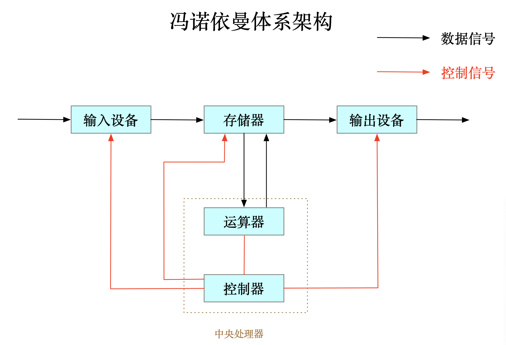
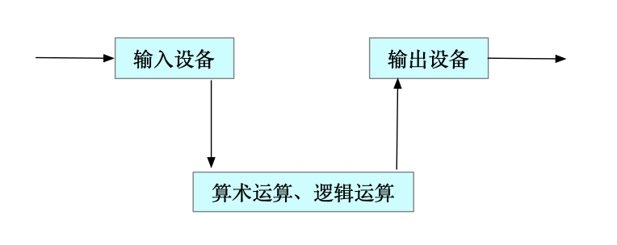
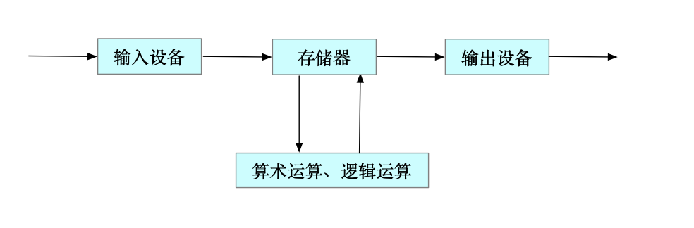
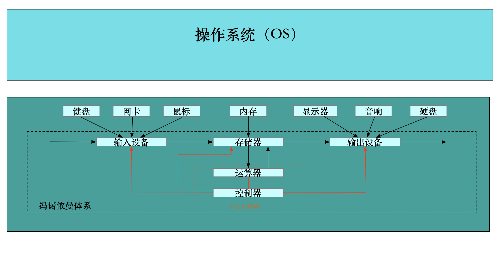
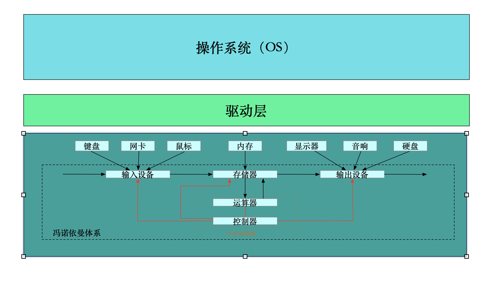
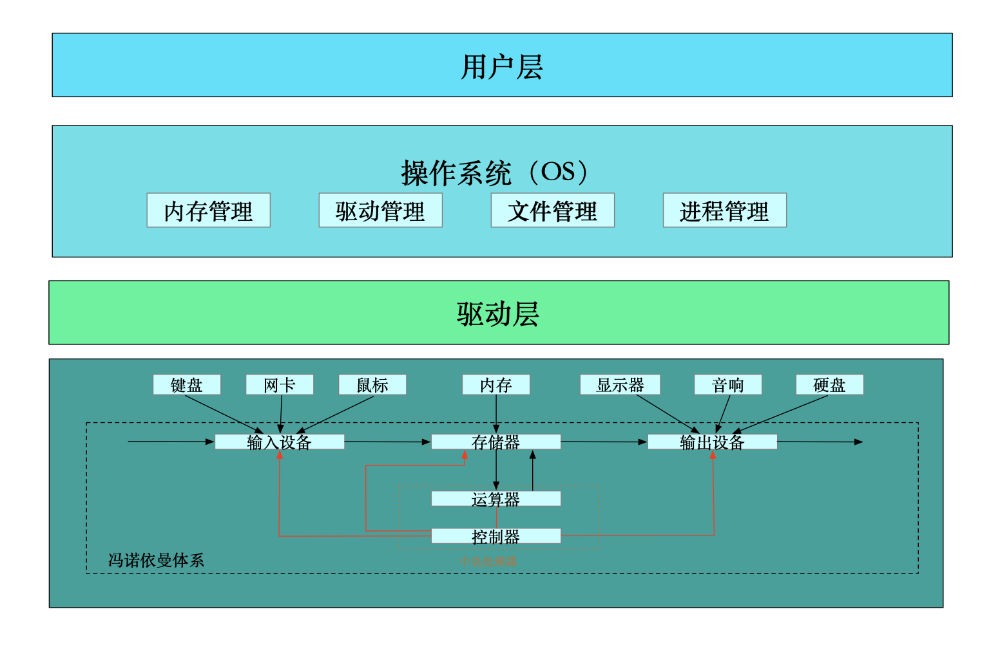
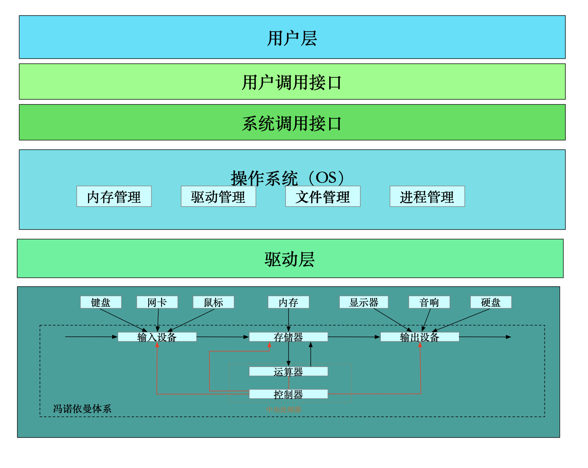
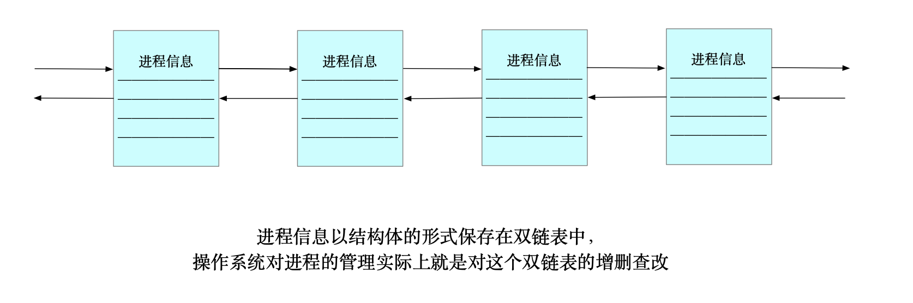

#  1. 冯诺依曼体系

如今的计算机由以下几个部分组成，根据它们的功能可以分为：

- 输入设备：键盘、鼠标、网卡、硬盘、话筒、摄像头、扫描仪等，产生数据。
- 存储器：内存；
- CPU：中央处理器；
- 输出设备：显示器、音响、网卡、硬盘、打印机等，保存或显示数据。

##  体系介绍

计算机的的工作就是计算，处理人们产生的数据。所以需要有输入设备，显示结果，需要输出设备。而计算的过程交给 CPU（中央处理器）。

- 中央处理器的组成：
  - 运算器：算术运算和逻辑运算。即普通的加减乘除运算、逻辑与和逻辑或运算；
  - 控制：响应外部事件。例如控制何时获取输入的数据，几时输出结果，if 等判断语句、循环、函数等。

但是这样的体系是有缺陷的：以现在的视角而言，CPU 的速度是非常快的（冯诺依曼体系是 1945 年提出的），而硬件输入输出数据的速度相比于 CPU 是很慢的，差了几个数量级。这样就会造成输入和输出的时候 CPU 要等待，虽然 CPU 速度很快，但是整个输入输出的过程的速度取决于硬件的速度，这是木桶效应的体现。**为了弥补硬件和 CPU 之间速度的差距，增加了一个缓冲区域，叫做存储器，即内存。**（硬盘是外存）

这样冯诺依曼体系就形成了。

> 为什么它会成为一系列计算机的体系架构且几十年屹立不倒？
>
> 因为它是经济且实用的。以具有处理数据和存储的硬件而言，从 CPU，内存，硬盘，价格都是递减的，如果要用更快速度的输入输出硬件来弥补与 CPU 之间速度的差距，成本是非常大的。

##  内存的重要性

弥补硬件和 CPU 之间速度的差距，虽然看起来比直接将数据交给 CPU 还要慢，但是通常情况下数据都是存到一定数量才会被 CPU 获取。

CPU 可以同时处理和加载数据，内存也能存储数据。局部性原理：当某一块数据被访问时，那么下次有可能会访问它周围的数据（这也是 CPU 高速命中的情况）。

- CPU 从内存中加载数据：等内存中积累到一定量的数据后，一次性交给 CPU，这个存放一定量的内存区域，称为缓冲区；
- CPU 输出数据到内存：等缓冲区满了以后，才会将数据输出到外显设备。

##  举例

###  IO 过程

- input：将输入设备的数据加载到内存；数据被 CPU 处理，然后再输入到内存；
- output：从内存中将数据刷新出来。

###  数据流

当你和同学聊天时，冯诺依曼体系是这样发挥作用的：

两部设备都是冯诺依曼体系结构。当你键入消息，这些数据被加载到内存，内存再把数据交给 CPU，数据再被网络传输到同学的机器上，进行相同的操作。无处不在的数据：发送成功的数据会被显示，对方发送来的数据也会被显示。

##  小结

通过图示和对体系结构的理解，我们可以发现，CPU 只和内存传输数据。换句话说，只要是需要被处理的数据，都要将它加载到内存。在 Linux 中，一切皆文件，即一切皆数据，如果要运行一个可执行文件，必须将它加载到内存中才能被 CPU 处理，这是下面的内容。

> 设备的角色取决于它的用途。
>
> CPU 中有寄存器我们知道，但是有许多设备中也有寄存器，例如键盘将键入的数据存储在寄存器中，然后通过寄存器写入内存。

#  2. 操作系统

如果看着全是专业词汇的教科书，操作系统是很难理解的，我们需要通过许多例子，站在“管理”的角度理解 OS。

==操作系统是管理软硬件资源的软件。==

- 目的：对上提供稳定、安全、简单的良好使用环境；
- 手段：对下通过管理好软硬件资源，以达到系统稳定。

##  2.1 面向底层

### 2.1.1 如何管理

#### 管理底层硬件的数据

作为用户，我们只和硬件打交道，我们用键盘打字，用显示器查看，但是我们无法自己决定数据如何加载到内存，何时被 CPU 处理。.. 这些细节且至关重要的操作，就是操作系统这个软件干的事情；

#### 管理外层软件的数据

操作系统作为一个软件，是要编译源代码的，可以认为读取硬件数据就是通过一个个接口实现的，如果某个硬件的读取数据的方式改变了，那么就要改变这个接口（就像修改函数一样），最后也要重新编译这个操作系统，成本未免也太大了。

为了解决这个问题，大佬增加了一个“工具人”，叫做**驱动层**。它存在于操作系统和冯诺依曼体系之间，例如：键盘驱动、硬盘驱动、网卡驱动等等。

> 驱动一般由生产硬件的厂商提供，它的作用就是把输入输出数据的功能封装起来，对系统开放传输数据的接口。站在操作系统外，它只关心数据的传输，不关心如何传输。
>
> 有没有觉得这个过程很像写了个函数？

### 2.1.2 管理什么

- 内存管理：内存分配、内存共享、内存保护以及内存扩张等；

- 驱动管理：对计算机设备驱动驱动程序的分类、更新、删除等操作；

- 文件管理：文件存储空间的管理、目录管理、文件操作管理以及文件保护等；

- 进程管理：其工作主要是进程的调度。

##  2.2 面向用户

上面都是对操作系统对底层硬件的管理的概述，而操作系统的另一个功能是为用户提供安全稳定易用的操作环境。

当计算机有了显示器时，只有命令行界面，即使在现在的我们看来，它很“底层”，但是这也是封装在操作系统之上的一层软件，叫做用户层。

通过用户层，我们可以通过显示器查看自己输入输出的数据，和上面一样，如果让操作系统自己对用户层（主要是显示信息的数据）自己操作数据，传输数据的方式发生改变也会让成本增加，所以像驱动层一样，增加了一个**系统调用接口**，它封装了操作系统对用户层的数据传输的各种方式，对用户层开放了接口。

> 图形化界面是用户层的优化，它让计算机简单易用，使得不是计算机科学家的普通人也能很快上手。

##  2.3 管理的方式

==先描述，后组织。==通过下面的解释理解这句话。

古人结绳记事，爷爷辈的人用账本，我们用计算机软件。不论是现实世界还是计算机，管理的本质是管理数据，只是要管理的数据太多了，我们算不过来，所以才会用计算机。

> 众所周知，懒是第一生产力。计算机也是为战争而制造的，冷战时期的俄美科学也是以空前速度发展，就是因为数据随着需求越来越复杂算不过来。

###  举例

原则上管理者和被管理者是不需要沟通的。为什么？

####  银行

以上帝视角看待一个银行的组成：

- 桌椅板凳电脑。.. 相当于硬件；
- 后勤部：相当于驱动程序；
- 各种部门：相当于各种软件；
- 行长：相当操作系统。

行长管理各个部门，提拔或开除某个人不需要到他面前，只需要通过个人的业绩考核就能得到答案。银行不相信任何人，因为外部矛盾可能会造成内部崩溃（抢劫），为了交互，只对外公开了一个个小窗口。这些小窗口就是系统接口，接口本质是 C 语言（Linux）写的函数，但注意不是库函数。站在大厅的指导人员，相当于 shell 外壳程序或图形化界面，能让用户熟悉操作流程。

银行内部层层加固，保证了内部安全，外部分配了指导人员，保证了用户能方便易用。

####  学校

- 管理者：校长
- 被管理者：学生

一年见不到几次的校长，是如何管理学生的呢？完成每一件事都要经过「决策」和「执行」两个步骤，校长是决策者，因为人（数据）太多了，辅导员就是执行者。

校长想在大会上嘉奖几个优秀代表，在之前需要审核，不可能全校的人都挨个叫到办公室，都是让辅导员或老师推荐。那么老师是如何迅速选出最佳人选的呢？平时的表现，成绩单，健康信息。.. 这些在计算机眼里都是数据。校长也是如此。

---

既然如此，那什么是「先描述，后组织」呢？

###  先描述

就学校的例子而言，在入学之前，我们并未被辅导员管理，但是我们的个人信息已经被收集起来了，这就是先描述。只有知道了每个元素的信息，才能管理好它们。

在 C 语言中，这一套组织起来的信息叫做结构体，在面向对象语言中（如 C++），它叫做对象。

###  后组织

在操作系统层面，进程（就像每个学生）的信息会被一个**结构体**保存，它们被一个双向链表组织起来。如果用户启动了一个进程，那么这个双链表就会新增一个结点；如果用户关掉了一个进程，操作系统会把对应的结点从双链表中删除。

操作系统对进程的管理，实际上就是对这个双链表的增删查改。

> 早期的 Linux 是用 C 语言编写的，所以使用结构体保存进程的信息。

##  2.4 总结

操作系统是各种数据的管理者，数据是被管理者，它们不需要直接接触。按照规则组织的信息被存放在某个数据结构中，管理者对这个数据结构的管理和维护就是对数据的管理和维护。

「数据结构」四个字似乎已经说明了它的作用。
