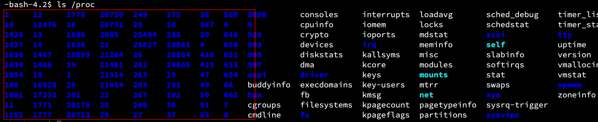
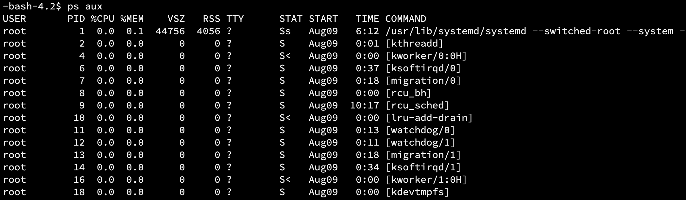
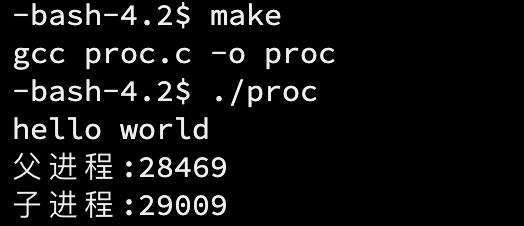
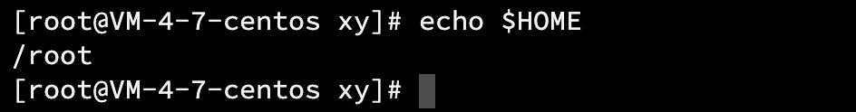

##  1. 进程

###  1.1 概念

当我们双击桌面上的图标，就能运行我们想要的程序（.exe）。由于上层的封装，运行一个程序十分简单，但是其中的某些观点需要我们修正。

在「认识系统」中我们知道，CPU 只和内存打交道，而程序要运行必须经过 CPU，所以程序必须要经过内存。有不少人有误区：

- 程序不是在内存吗？

  实际上，不管是编译前还是编译后，程序就是一堆代码，它是存在磁盘中的。也就是说，程序在未运行之前是存储在磁盘中的，只有加载到内存中才能运行。如果没有被加载到内存，它不会变成进程，也就是一个一直在磁盘内的文件。

- 程序运行起来了，还叫程序吗？

​	严格来说并不是，程序是文件，当加载到内存中运行起来以后，这个程序的内容就会被执行，执行这个动作叫做「**进程**」。

###  1.2 PCB

开机启动的第一个程序就是操作系统，它是第一个加载到内存中的。我们知道操作系统是一个管理的软件，其中就包括管理各种进程，通过指令可以查看当前系统中正在运行的进程。

```shell
ps aux
```


在「认识系统」中我们知道，操作系统管理进程实质上是对结构体双链表的增删查改。进程信息被放在一个叫做进程控制块的数据结构中，可以理解为进程属性的集合。称之为 PCB(process control block)，Linux 下的 PCB 是：`task_struct`。

- 概念：程序的一个执行实例，正在执行的程序等；
- 内核观点：担当分配系统资源 (CPU 时间，内存）的实体。

> `task_struct`是 PCB 的一种，它是 Linux 内核的一种数据结构，它会被装载到 RAM（内存）里并且包含着进程的信息。

####  1.2.1 task_struct 的内容

task_struct 就是 Linux 当中的进程控制块，task_struct 当中主要包含以下信息：

- 标示符：描述本进程的唯一标示符，用来区别其他进程；
- 状态：任务状态，退出代码，退出信号等；
- 优先级：相对于其他进程的优先级；
- 程序计数器 (pc)：程序中即将被执行的下一条指令的地址；
- 内存指针：包括程序代码和进程相关数据的指针，还有和其他进程共享的内存块的指针；
- 上下文数据：进程执行时处理器的寄存器中的数据；
- I/O 状态信息：包括显示的 I/O 请求，分配给进程的 I/O 设备和被进程使用的文件列表；
- 记账信息：可能包括处理器时间总和，使用的时钟总和，时间限制，记账号等；
- 其他信息。
  

###  1.3 查看进程

####  通过系统目录查看

查看根目录下名为/proc 的系统文件夹：


该文件夹中包含大量进程的信息，有些子目录的目录名为数字：



这些数字是，某一进程的 PID（稍后会介绍），可以认为它是进程的编号，如果想查 PID=10 的进程信息，可以进入该文件夹查看：


#####  通过 ps 命令查看

直接使用 ps 命令，会显示出当前操作系统中所有的进程信息：
```shell
ps aux
```



如果只需要打印某一进程的信息，可与 grep 指令搭配使用：

```shell
ps aux | head -1 && ps aux | grep proc | grep -v grep
```

其中`proc`是指定的进程名称或关键字。


####  通过系统调用获取进程标识符

- 进程 ID：PID；
- 父进程 ID：PPID。

> PID 和 PPID 存在的意义：就像现实世界中，父子之间是要有名字或代号的。“ID”也说明了它是进程的身份标识。

通过以下代码可以打印这段代码运行起来创建的进程的 PID 和 PPID：

```cpp
##include <stdio.h>
##include <sys/types.h>
##include <unistd.h>
int main() 
{
    printf("pid: %d\n", getpid());
    printf("ppid: %d\n", getppid());
    return 0;
}
```


把这段代码改成死循环，目的是让这个进程一直运行，我们使用上面的 ps 打印 PID 和 PPID：


另外开一个窗口，使用 ps 命令，查看名为`proc`的进程的 PID：


可以看到，ps 指令确实可以通过可执行程序的名字找到对应的进程。

> 使用 Ctrl+c 终止进程。

###  1.4 创建子进程

我们不仅可以通过运行一个程序来创建进程，而且还能主动创建进程。

- 系统调用函数 fork：作用是创建一个子进程。

运行以下代码：
```cpp
##include <stdio.h>
##include <sys/types.h>
##include <unistd.h>
int main() 
{
    fork();
    printf("pid: %d\n", getpid());
    printf("ppid: %d\n", getppid());
    return 0;
}
```


其中，30140 出现了两次，第一次是 PID，第二次是 PPID。说明这个 fork 函数创建的进程是该进程的子进程。第一次是该进程的信息，第二次是 fork 创建的进程的信息。

###  1.5 终止进程

通过下面的指令可以杀掉指定 PID 的进程：
```shell
kill -9 PID
```

## 2. 初识 fork

###  2.1 介绍

fork 函数的返回值：

- 失败：返回-1；
- 成功：返回 PID 给父进程，返回 0 给子进程。

这是不符合我们的认知的，为什么一个函数能返回两个值呢？（我目前只学习了 C/C++、Java）

###  2.2 基本用法

fork 之后，代码是父子进程共享的，但是创建子进程的初衷不就是为了让子线程去做父进程不一样的事情吗？

在 fork 上面增加一条打印语句：


运行结果：


在 fork 函数被调用之前的代码被父进程执行，fork 之后的代码默认情况下父子进程都可以执行。虽然代码是父子进程共享的，但是父子进程是各自开辟内存空间的。

> 使用 fork 函数创建子进程，父子两个进程被操作系统调度的顺序是不确定的，这取决于操作系统。

###  2.3 分流

上面提到，创建子进程的初衷是让父子进程各自干各自的事情，下面以 if...else 语句为例：

```cpp
##include <stdio.h>
##include <unistd.h>
int main()
{
	printf("hello world");
	pid_t id = fork();
	if(id == 0)//子进程返回 0
	{
		while(1)
		{
			printf("子进程：\n");
			sleep(1);
		}		
	}
	else if(id > 0)//父进程返回 PPID
	{
		while(1)
		{
			printf("父进程：\n");
			sleep(1);
		}
	}

	return 0;
}
```


在 C 中，这两个死循环是不会同时执行的，而在系统层面上，fork 创建子进程后，子进程会进入到 if 语句打印，父进程会进入 else if 语句打印。这与语言无关，只与系统有关。

##  3. 进程状态

以下是 Linux 内核源码关于进程状态的定义：
```cpp
*/
* The task state array is a strange "bitmap" of
* reasons to sleep. Thus "running" is zero, and
* you can test for combinations of others with
* simple bit tests.
*/
static const char * const task_state_array[] = {
"R (running)", /* 0 */
"S (sleeping)", /* 1 */
"D (disk sleep)", /* 2 */
"T (stopped)", /* 4 */
"t (tracing stop)", /* 8 */
"X (dead)", /* 16 */
"Z (zombie)", /* 32 */
};
```

进程也像人一样，有的进程在运行，有的进程在等待，进程的状态根据 CPU 调度不同而不同。

通过下面的指令可以查看进程的状态：
```shell
ps aux
```


```shell
ps axj
```


两种方式略显不同，但是都有我们要查看的进程状态。下面介绍几种不同的进程状态。

###  R（运行状态）

- 前台进程：+：可以被 Ctrl+c 终止

  

  当运行上面代码（增加了 getpid 和 getppid），然后再查看进程状态：

  

  可以发现这个 29009 的进程 S 后面是有一个「+」，说明它是一个前台进程，是可以通过 Ctrl+c 终止的。

- 后台进程（&）

进程处于运行状态（Running），不要想当然地认为进程一定运行。运行状态表示这个进程正在运行或在「运行队列」中。所以可以存在多个运行状态的进程。

> Linux 内核使用一个运行队列（runqueue）来存放可运行的任务，可以在这个队列中切换要运行的进程。

###  S（阻塞状态）

S 状态也叫可中断睡眠状态（interruptible sleep），浅睡眠。表示具有 S 状态的进程正在等待某种资源，处于 S 状态的进程可以随时被唤醒，也可以随时被杀掉。

###  D（磁盘睡眠）

磁盘睡眠，也叫深度睡眠。和 S 状态类似，也是进程等待资源的状态，不同的是，深度睡眠是不可被中断，不可被杀掉的。原因是磁盘速度比较慢，进程需要等待磁盘返回，系统即使在进程繁忙时也不能杀掉 D 状态的进程，这就叫做磁盘睡眠。

###  T（调试状态）

例如当使用 gdb 调试某个程序时，只要遇到断点就暂停。但是这个进程在此时并未等待任何资源，只是把它停住了，是单纯的暂停。（T 的大小写取决于发行版本）

### X（终止状态）

终止状态（死亡状态）是一个返回状态，当一个进程的退出信息被读取后，该进程申请的资源就会被立刻释放，也就是进程结束了，所以不会在列表中看到 X 状态的进程。

如果一个进程终止就回收一次，这样做效率比较低。于是操作系统就给它一个标签，等有了一定量具有 X 状态的标签时，一次性回收终止 X 状态的进程。

### Z（僵尸/僵死状态）

这部分会在后面说明。

当子进程退出并且父进程没有读取到子进程退出的返回值，那么这个子进程就是僵尸进程，它处于僵尸状态。

- 僵尸进程会以终止状态存在在进程表中，并且会一直等待父进程读取退出状态的代码；

只要子进程终止，父进程仍然在运行，但是父进程没有读取到子进程的状态，那么子进程就会进入僵尸状态。

> 例子：如果一个人被杀（子进程终止），警察正在调查（父进程运行），这个人就处于僵尸状态。
>
> 疑问：C 语言的 main 函数的返回值是 return 给谁的？如果返回 2、3 呢？

##  4. 僵尸进程

僵尸进程是子进程退出的返回值未被父进程读取，正在等待其读取的进程。

现在将刚才的代码修改，用计数器让子进程所在的分支结束：

```cpp
##include <stdio.h>
##include <stdlib.h>
##include <unistd.h>
int main()
{
    printf("hello world\n");
    pid_t id = fork();
    if(id == 0){ //child
    int count = 3;
    while(count){
    printf("子进程：PID:%d, PPID:%d, count:%d\n", getpid(), getppid(), count);
    sleep(1);
    count--;
     }
     printf("子进程结束、n");
     exit(1);
   }
   else if(id > 0){ //father
    while(1){
       printf("父进程 PID:%d, PPID:%d\n", getpid(), getppid());                      
       sleep(1);
     }
   }
   return 0;
}
```


当分支结束后，便不再打印子进程的信息，只剩下父进程。保持此进程运行，新建一个窗口，使用下面的指令查看子进程的信息：

```shell
while :; do ps axj | head -1 && ps axj | grep proc | grep -v grep;echo "######################";sleep 1;done
```


可以看到，PID 为 27272 是 PID27271 的子进程，这个子进程的状态就是 Z。（后面有加号，表示它是前台进程，上面有提到）注意后面有个标识符`<defunct>`，“无效的”。

###  4.1 僵尸进程的危害

- 如果子进程退出的信息一直没有被父进程读取，那么子进程就会一直处于僵尸状态；
- 增加开销：僵尸进程（子进程）的退出信息被保存在 task_struct（PCB 的一种）中，如果一直处于僵尸状态，那么 PCB 就要一直维护 task_struct；
- 浪费资源：如果一个父进程创建了很多子进程，而这些子进程都处于僵尸状态，进程也是数据，会占用资源；
- 内存泄漏：创建子进程而不回收，也是会占有内存资源的，虽然一个进程看起来很小。

> 僵尸进程的代码和数据可能不在，但是维护它的 PCB（描述代码的数据结构）依然存在。
>
> 处于僵尸状态的进程是暂时的，如果一直没有父进程对它的返回信息处理，那么这个子进程就会一直处于僵尸状态，叫做僵尸进程。

##  5. 孤儿进程

与僵尸进程相对地，如果父进程先退出，子进程进入僵尸状态时没有父进程对其返回值处理，这个子进程就叫做孤儿进程。

和僵尸进程一样，孤儿进程也会一直占用内存资源，造成内存泄漏。一旦出现孤儿进程，孤儿进程就会被 1 号 init 进程领养（可以认为是系统本身），一旦孤儿进程进入僵尸状态，init 进程就会对其回收。

同样地，将上面的代码修改，用计数器先让父进程退出，观察子进程的信息：

```cpp
##include <stdio.h>
##include <stdlib.h>
##include <unistd.h>
int main()
{
    printf("hello world\n");
    pid_t id = fork();
    if(id == 0){ //child
        while(1){
                printf("子进程：PID:%d, PPID:%d\n", getpid(), getppid());
                sleep(1);
        }
        exit(1);
    }
    else if(id > 0){ //father
    	int count = 3;
    	while(count){
      	printf("父进程 PID:%d, PPID:%d, count:%d\n", getpid(), getppid(), count);
        sleep(1);
        count--;
        }
	}
    return 0;
} 
```


可以看到，当父进程退出后，子进程就变成了孤儿进程，它被 1 号进程领养。

> 1 号进程：由 0 号进程创建 1 号进程（内核态），1 号内核线程负责执行内核的部分初始化工作及进行系统配置，并创建若干个用于高速缓存和虚拟主存管理的内核线程。
>
> 暂时不需要知道它们是什么，只要知道 1 号进程的地位即可：0 号进程->1 号内核进程->1 号用户进程（init 进程）->getty 进程->shell 进程（bash）

## 6. 进程优先级

###  6.1 介绍

####  为什么要有优先级

对于进程（代码）而言，CPU 就是它们唯一要竞争的资源，但是 CPU 能分配的资源是有限的，而进程太多，所以需要有一个指标限制获得资源的先后顺序。

####  什么是优先级

确认进程获取资源的先后顺序的指标，就叫做进程优先级。

它只是一个值，OS 根据值的大小判断进程获取资源的先后顺序。

###  6.2 查看系统进程信息

使用命令查看系统进程信息：

```shell
ps -l
```


其中：

- UID：代表执行者的身份；
- PID：代表这个进程的代号；
- PPID：代表这个进程是由哪个进程发展衍生而来的，即父进程的代号；

####  PRI 和 NI

PRI：进程优先级（priority），即进程被 CPU 分配资源的先后顺序，值越小优先级越高。

NI：进程的 nice 值，表示进程可被执行的优先级的修正数值。

PRI 一般默认 80，所以需要有 nice 来修正优先级，OS 会根据新的优先级判断，规则是：

- PRI(new) = PRI(old) + NI

- NI 的取值范围为-20~19，共 40 个级别。如果 nice 值为负数，那么优先级就会变高。

###  6.3 修改 nice 值

####  通过 top 命令修改

top 命令相当于 Windows 系统中的任务管理器，它能动态显示系统中进程资源占用情况。


输入 top 指令后，键入`r`，输入要修改 nice 值的进程的 PID


任意运行一个进程（我运行了刚才的死循环），查看 proc 进程的 PID：


键入 14536 后：


提醒要输入的 nice 值：键入`10`，回车后，输入`q+回车`退出。

重新查看 proc 进程的 PRI：


可以看到 proc 进程的优先级已经被修改为 90 了。

如果想让它的优先级变高，也就是输入的 nice 值为负数，需要 sudo 或 root 权限。

> 之所以说 top「命令」是「任务管理器」，是因为这些命令实际上都是软件，也就是进程（ps 命令是查看系统进程，CMD 选项相当于进程的别名）。我们使用诸如 ls、ps 这样的命令，实际上就是把这个程序运行起来，这和使用`./`运行我们自己写的可执行程序是等价的，只是方式不同，稍后会介绍。

####  通过 renice 命令修改

【语法】

```shell
renice [newNI] [PID]
```

【示例】

依然运行上面的死循环。修改 nice 值为 10。


同样地，若 nice 值为负值，需要 sudo 或 root 权限。

> 对于系统进程的任何信息，都不建议修改，特别是在工作中。

###  6.4 重要概念

- 竞争性：是进程的属性。CPU 可分配资源有限而进程数量很多，进程之间有竞争关系。为了合理利用资源，高效完成任务，需要优先级来限制进程获取 CPU 资源的顺序；
- 独立性：多进程运行时独享各种资源，运行期间互不干扰，而且进程之间是不知道彼此的存在的；
- 并行：多个进程，多个 CPU，同时运行；
  - 时间片：限制 CPU 分配给进程的时间。如果工作没有做完，那么达到这个时间以后就暂停该进程，跑完其他进程以后才会继续该进程；
  - 抢占与出让：更高优先级的进程会抢占更低优先级的进程的资源，前者执行完后才会执行后者。出让就是进程让自己任务暂停，让自己占用的 CPU 资源让出给其他进程。
- 并发：多个进程，一个 CPU，不断暂停进程，切换进程，继续运行下一个进程。在一段时间内让多个进程分段式推进任务。

**寄存器保存的信息（进程）**：

- 对于 CPU 中的寄存器：如果进程 A 正在被运行，那么 CPU 中的寄存器保存的是进程 A 的临时数据。

- 上下文保护：这个临时数据叫做进程 A 的上下文数据。例如函数的返回值，传值拷贝都是用寄存器（eax）保存的。
  - 上下文数据不可以被随意丢弃！当进程 A 被进程 B 切换下来后，寄存器保存的信息就是 B 的信息了。但是进程 A 会同时保存它的上下文数据，以便下次进程 A 切入的时候能在暂停处向后继续执行；
  - 可以认为上下文是保存在 PCB 中的（实际上并不是，只是为了好理解），CPU 中的寄存器只有一份，而上下文可以有多份，对应不同的进程。这点后面会继续提到。

## 7. 环境变量

###  7.1 介绍

**环境变量**（environment variables）是一个动态命名的值，可以影响计算机上进程的行为方式。

<mark>环境变量通常是全局有效的。</mark>

###  7.2 引入

上面介绍 top 指令时提到过，各种指令实际上就是一个个可执行程序，但是和我们自己写的程序编译出来的可执行程序不一样，为什么这些系统程序（进程）直接用它们的名字就能运行它们呢？例如

```shell
ps -la
```

而不是

```shell
./ps -la
```

而且，如果我们不在这个可执行程序所在的目录，`./`还要跟上路径。为什么这些系统指令不需要带上路径呢？

另外，我们编写 C/C++程序中的头文件是有静态库的，但是编译时并没有指定静态库的路径，依然可以顺利编译，生成可执行程序。

这些都是环境变量对进程行为的影响。

###  7.3 常见环境变量

- **PATH：** 指定命令的搜索路径，也就是命令程序所在的路径；
- **HOME：** 指定用户的主工作目录（即用户登录到 Linux 系统中的默认所处目录）；
- **SHELL：** 当前 Shell，它的值通常是/bin/bash。

> Bash 是 [Bourne shell](https://zh.wikipedia.org/wiki/Bourne_shell) 的後繼相容版本與開放原始碼版本，它的名稱來自 [Bourne shell](https://zh.wikipedia.org/wiki/Bourne_shell)（sh）的一個雙關語（*Bourne again* / born again）：**B**ourne-**A**gain **SH**ell。--[wiki](https://zh.wikipedia.org/zh-tw/Bash)
>
> 从它的命名就可以看出，bash：bash 是一个 shell 外壳程序的一种，macOS 是 zsh（终端）。

**和环境变量相关指令**：

- echo: 显示某个环境变量值
- export: 设置一个新的环境变量
- env: 显示所有环境变量
- unset: 清除环境变量
- set: 显示本地定义的 shell 变量和环境变量

####  7.3.1 测试 PATH

用 echo 指令查看环境变量：
  【语法】

```shell
echo $NAME
```

例如查看  环境变量 PATH：

```shell
echo $PATH
```


可以看到，环境变量的路径由`:`分隔开，现在查看`ls`命令所在在目录：

```shell
which ls
```


注意到命令`ls`所在的路径和环境变量 PATH 第二个路径是一样的，现在 cd 到这个路径看看：


这个目录下的所有程序都是系统命令，就如我们之前使用过的 nano。如果往下翻，ls、vim 都在其中。OS 是通过环境变量 PATH 来找到各种系统程序的，我们才可以把这些程序当成指令使用

如何让自己写的程序像使用命令一样：

- 理论上可以将自己写的程序放在这个目录下，运行自己的程序就像运行系统命令一样方便。

  ```shell
  sudo cp proc /usr/bin
  ```

  但是同样地，这样会污染这个命令池。

- 将可执行程序所在的目录路径放在环境变量中，就像我们配置 Java 环境、Python 环境、go 环境一样。这种方法也是配置前面这些语言环境常用的方法。

  

  ```
  export PATH=$PATH:/home/xy/test
  ```

####  7.3.2 测试 HOME

每个用户登录系统时都有自己的家目录，环境变量 HOME 保存的就是当前用户的家目录。

- 普通用户：
  

- 超级用户：	

> 除了查看自己的 HOME 判断普通用户和超级用户之外，还可以看命令之前是美元符号还是今号判断。

####  7.3.3 测试 SHELL

我们在 Linux 中敲的各种指令实际上需要由「命令行解释器」进行解释，而在 Linux 当中有许多种命令行解释器（例如 bash、sh），我们可以通过查看环境变量 SHELL 来知道自己当前所用的命令行解释器的种类。


也就是我们通常所说的 shell 外壳（上面也有提到），它是系统启动的第一个进程，相当于给众多程序（进程）指导的服务人员（就像银行大厅的工作人员一样）。


####  7.3.4 补充

部分环境变量和它的含义：

| 环境变量名称 |        内容        |
| :----------: | :----------------: |
|     PATH     |   命令的搜索路径   |
|     HOME     |  用户的主工作目录  |
|    SHELL     |     当前 shell      |
|   HOSTNAME   |       主机名       |
|     TERM     |      终端类型      |
|   HISTSIZE   | 记录历史命令的条数 |
|   SSH_TTY    |    当前终端文件    |
|     USER     |      当前用户      |
|     MAIL     |        邮箱        |
|     PWD      |    当前所处路径    |
|     LANG     |      编码格式      |
|   LOGNAME    |     登录用户名     |

###  7.4 环境变量的组织方式

实际上，环境变量的值是保存在一个数组中的：


每个程序都会收到一张环境变量表，环境表是一个字符指针数组，每个指针指向一个以’\0’结尾的环境字符串，最后一个字符指针为空。

###  7.4.1 获取环境变量

在很久以前，main 函数有一种写法是这样的：

```cpp
int  main(void)
{
	//...
    return 0;
}
```

也就是说 main 函数是有参数的。

####  命令行参数

main 函数的三个参数：

```cpp
int main（int argc, char* agrv[], char* envp[]）
```

- argc：命令行传的参数的个数；
- argv（指针数组）：指向第 n 个命令行参数的头指针；
- envp（指针数组）：指向每个环境变量的头指针，环境变量通过字符串的方式保存。

####  通过 main 函数获取

##### argc 和 argv：

通过前者构造循环，打印后者：

```cpp
##include <stdio.h>
int main(int argc, char* argv[])
{
    for(int i = 0; i < argc; i++)
    {
        printf("agrv[%d]:%s\n", i, argv[i]);
    }
    return 0;
}
```


可以看到，第一次运行 proc 程序没有传入选项，那么 argv 这个指针数组就只会存储这个程序本身的名字；第二次运行 proc 程序传入了四个选项，那么 grgv 指针数组就会储存这四个选项对应的字符串的头指针。

> 选项：例如我们在使用`ls`指令时，后面跟的`-l`或`-a`这些就是选项。

#####  envp

实际上 main 函数的第三个参数接收的是环境变量表，通过以下代码获取系统环境变量：

```cpp
##include <stdio.h>
int main(int argc, char* argv[], char* envp[])
{
	for(int i = 0; envp[i]; i++)
	{
		printf("envp[%d]:%s\n", i, envp[i]);
	}
	return 0;
}
```


可以看到打印出来的都是各种环境变量的值，有许多在上面的表中都已经提到过。

> libc 中定义的全局变量 environ 指向环境变量表，environ 没有包含在任何头文件中，所以在使用时 要用 extern 声明。

####  通过系统调用获取

上面获取环境变量的方法都是循环打印，都是把环境变量当成字符串，而且有点麻烦，一般情况下都不会使用。可以通过系统调用（函数）直接获取环境变量：

```cpp
##include <stdio.h>
##include <stdlib.h>
##include <unistd.h>
int main(int argc, char* argv[], char* envp[])
{
	printf("%s\n", getenv("PATH"));
	return 0;
}
```


通过调用这个系统接口，可以查看指定环境变量的值。

###  7.5 环境变量的继承

进程都是被创建出来的，对于每个进程，它们的环境变量都是继承自父进程的。默认情况下，所有的环境变量都会被子进程继承。层层往上，下面的进程都是继承自系统（bash）。

【证明】

首先打印环境变量 PATH 的值和它的 PPID：

```cpp
##include <stdio.h>
##include <stdlib.h>
##include <unistd.h>
int main(int argc, char* argv[], char* envp[])
{
	printf("%s\n", getenv("PATH"));
	printf("pid:%d, ppid:%d\n", getpid(), getppid());
	return 0;
}
```

然后通过`ps`指令查找所有含有这个 PPID 的进程信息：


最后可以看到，刚刚的进程是继承自 bash 的（可以认为它是系统本身）。

所以环境变量是具有**全局属性**的。

## 8. 进程地址空间

###  8.1 引入

下面的代码在全局定义了一个变量 g_val，然后通过 fork 创建的子进程修改它的值，在父子进程都打印它的值和它的地址：

```cpp
##include <stdio.h>
##include <sys/types.h>
##include <unistd.h>
int g_val = 1;
int main()
{
	pid_t id = fork();
	if(id == 0)//子进程
	{
		g_val = 2;
		printf("子进程：PID:%d, PPID:%d, g_val:%d, &g_val:%p\n", getpid(), getppid(), g_val, &g_val);
	}
	else if(id > 0)//父进程
	{
        sleep(3);
		printf("父进程：PID:%d, PPID:%d, g_val:%d, &g_val:%p\n", getpid(), getppid(), g_val, &g_val);
	}
	return 0;
}
```


> 因为 fork 后，父子进程执行的先后顺序是取决于内核版本的，所以在这里我让父进程 sleep 了 3 秒，意在让子进程先执行，当然也可以让子进程 sleep。
>
> 虽不能保证 sleep 父进程后，能让子进程一定先被执行，但是在通常情况下（CPU 资源充足），子进程是会先被执行的。

非常不可思议的结果：父子进程打印出来的全局变量的地址是一样的，但是子进程打印的是修改之后的值，而父进程打印的依然是修改之前的值。这就非常奇怪，为什么同一个地址的值的内容是不一样的呢？

【结论 1】

几乎所有编程语言中的「地址」都是「虚拟地址」而不是「物理地址」。物理地址在 OS 被设计的时候就已经被保护起来了。

虽然访问的是虚拟地址，但是还是不对劲，为什么父子进程访问同一个虚拟地址的内容还是不一样呢？

【结论 2】

虚拟地址是对于程序本身而言的，理论上每个独立的进程都能得到一个完整范围的虚拟地址（一般情况下 OS 会避免这种情况发生），不同的程序有可能出现虚拟地址相同的情况。

到这里依然无法解释为什么访问同一个虚拟地址会得到不同的值，原因同上，每个进程的虚拟地址都是独立拥有一份的，这份虚拟地址映射的物理地址是不同的。

###  8.2 程序地址空间布局


​	图：32 位系统下进程地址空间默认布局（左）和进程地址空间经典布局（右）

--图片来源于网络。

在 C/C++程序员眼中，内存布局是这样的：


下面通过代码验证：

```cpp
##include <stdio.h>
##include <stdlib.h>
//定义全局变量
//未定义
int g_unval;
//已定义
int g_val = 1;
int main(int argc, char* argv[], char *envp[])
{
    printf("代码区：%p\n", main);
    char* str = "hello";
    printf("只读常量区：%p\n", str);
    printf("初始化数据区：%p\n", &g_val);
    printf("未初始化数据区：%p\n", &g_unval);

    int* p = (int*)malloc(5);
    printf("堆区：%p\n", p);
    printf("栈区：%p\n", &str);
    printf("栈区：%p\n", &p);

    //命令行参数
    for(int i = 0; i < argc; i++)
    {
        printf("命令行参数：%p\n", argv[i]);
    }
    //环境变量
    int i = 0;
    while(envp[i])
    {
        printf("环境变量：%p\n", envp[i]);
        i++;
    }
    return 0;
}
```


仅仅通过地址的长度就可以知道：它们的布局是符合上图的。

- 堆栈相对而生：可以这样记忆：地上是堆，且越网上地址越高；反之上面是堆，向下增长，地址越来越低；
- 从堆区和栈区地址的长度之间的差距可以看出：它们之间隔了一大块空间。

【引例 1】

为什么 malloc 的时候要指定空间大小，而 free 时却不用？

- 因为 OS 会多申请一些空间以保存进程申请内存时的信息，例如当时的时间，申请内存的大小等等，它叫做 cookie 数据。

【引例 2】

对于函数中的 static 变量，为什么它的作用域在函数内，生命周期却是全局，不应该都是全局吗？

- 函数中的局部变量被 static 修饰，编译后会进入全局数据区（通过打印地址可以验证）。static 本质上是将局部变量变成全局变量，只是语法上约束了它的作用域只能在函数内部，只能在函数内部访问该变量。

> C/C++是编译型语言，编译链接以后就是二进制可执行文件。
>
> 像这样的`hello`、`10`、`'a'`，这些叫做「字面常量」。也就是初始化变量是，等号右边的部分。它们是硬编码进代码的，代码是只读的、不可写入的。

####  内核空间&&用户空间

对于 32 位机器，进程的地址空间的范围是 [0x0000 0000, 0xFFFF FFFF]，0xFFFF FFFF 其实就是十进制的 4 294 967 296 字节，即 4GB。

- 用户空间：[0， 3GB]
- 内核空间：(3GB， 4GB]

进程地址空间一般是整体而言的，对于每个进程的地址空间都在这个范围（稍后会用例子解释）。上面的代码打印出来的地址对应的区域不会有什么偏差，而在 Windows 系统下结果可能会比较混乱，原因是 Windows 系统内存分配的算法不一样。

###  8.3 什么是进程地址空间

【引例 1】

一个不恰当的比喻：一个富豪有三个私生子，私生子之间互不知道彼此的存在。而这个富豪对每个私生子都说，将来你都会继承我的 10 亿家产，这是富豪给私生子们画的饼。

在这里，操作系统就是富豪，进程就是私生子，地址空间就是富豪画的大饼。对于每个进程而言，以它的视角看，所有的地址空间都可以被它获取，而每个进程之间又是独立的。

【引例 2】

首先要知道，访问内存数据的直接方式就是访问物理地址，物理地址是原生联系到内存上的。

这是一个历史问题：在之前，计算机使用的是物理内存，如果出现了野指针，就会访问到其他区域的数据，非常不安全，所以需要有一层虚拟地址保护物理地址。

> 即使是现在，即便有了虚拟地址的保护，通过野指针读写其他区域的数据（垂钓指针）也是常用的攻击手段。

我们知道，进程地址空间是有各种区域的，那么 OS 是如何划分这些区域的呢？

实际上，划分这些区域就是管理这些区域，那么回到操作系统的核心：「先描述，后组织」，先定义出一种数据结构，用这种数据结构管理区域。实际上，Linux 中进程地址空间由 mm_struct 结构体划分，它的结构是这样的：


每个结构体都有 start 和 end 成员以划定区域的边界。

- 堆的向上增长以及栈的向下增长实际就是改变 mm_struct 当中堆和栈的边界的值；
- 我们刚才通过程序验证各种变量的地址，这是如何办到的？编译器在编译时就已经根据变量的类型分配了不用区域的（虚拟）地址，所以程序的数据是在运行前就被分配好内存区域的。只要运行它的时候按照规则加载到对应的地址处即可；而不是等程序运行以后才分配数据（不同类型的变量）的内存区域，提高了系统执行进程的效率。

###  8.4 映射关系维护

####  （分）页表

页表实际上有点复杂，在这里仅仅用简单的图示解释它最主要的作用。在线程的部分我们还会继续学习页表。

当进程被创建时，其对应的进程控制块（PCB）（task_struct）和进程地址空间（mm_struct）也会被创建。而操作系统可以通过 task_struct 找到其 mm_struct（memory management），因为 task_struct 当中有一个结构体指针存储的是 mm_struct 的地址（见上图）。

父子进程都有属于自己的 task_struct 和 mm_struct，也有属于自己的一份页表。父子进程的进程地址空间当中的各个虚拟地址分别通过页表映射到物理内存的某个位置，如下图：

页表的作用就是将虚拟地址和物理地址映射起来：


只要保证每个进程的页表，映射的是物理内存的不同区域，就能保证进程之间不会互相干扰，进而保证进程的独立性。

####  写时拷贝

写时拷贝（copy on write），是一种被广泛使用的技术。个人觉得这个直译没有翻译出这个技术的精髓，我认为应该翻译成“写时才拷贝”。

说白了就是系统的“偷懒”的行为，例如我们写文档如果不按保存，突然断电，那么我们写的东西就没了；Unix 系统甚至直到关机才会保存修改的数据，这也是通常修改系统数据要重启的原因之一。这个行为就是为了节省每次修改数据的开销，只保留最后一次有效的修改。

此部分会说明之前的程序中通过同一个虚拟地址却访问到不同的值的原因：

当父进程创建子进程时，它们的代码是共享的，我们之前是这么说的，但没有了解它的原理。那么联系此部分页表的知识，实际上父进程创建子进程的过程就是将父进程的信息复制一份给子进程，有的地方可能会根据子进程的信息而修改，不过大部分都是一样的。这样父子进程不但虚拟地址一样，映射的物理地址也一样。

不过当父进程修改了其中的一个变量时，OS 就会单独为这个修改的数据另外开辟一块物理内存供其存放，接着就会更新父进程页表中已修改的数据的映射关系（修改物理地址），其他依然未改变。然而，子进程依旧还是原来和父进程未改变的那份页表。这样就会造成虚拟地址相同由于它们属于不同的页表，映射的物理地址不同的情况。

> 从这里可以体会到进程之间的独立性：还记得之前举的大富翁和私生子的例子吗？使用「写时拷贝」的原因也在于此。

###  8.5 可执行程序的装载

可执行程序的装载是一个复杂的过程，在这里仅仅对这个过程中关于进程虚拟空间的部分作出简要介绍，以更深刻地理解进程地址空间和页表的重要性。

实际上，程序在被编译链接生成可执行程序时，且未被加载到内存中，程序的内部已经有地址了，当然，这个地址是虚拟地址。其实在 8.3 的最后已经提到，编译器在编译代码时，就已经根据代码中的变量的类型分配好了地址。并且采用和 Linux 内核中相同的编址方式给每个变量，每行代码都进行了编址，所以最后形成的可执行程序中已经包含了虚拟地址。

当 CPU 读取到每条语句（实际上已经是二进制编码了）的同时，指令的内部也有虚拟地址，所以 CPU 得到的就是虚拟地址而不是物理地址。

###  8.6 进程地址空间存在的意义

####  管理、保护物理内存空间

#####  管理

因为进程需要空间，而且进程不止一个，所以需要管理进程地址空间。这就回到 OS 的哲学：「先描述，后组织」了，先定义出一种数据结构，然后用这个数据结构划分、维护内存区域。

#####  保护

之前提到，早期的计算机都是直接使用物理内存的，这非常不安全，「计算机科学类域的任何问题都可以通过增加一个间接的中间层来解决」，虚拟空间起着保护物理空间的作用。

如果是物理内存，一个进程造成的错误会影响其他进程，而虚拟内存的存在最大限度地保证了进程之间的独立性。如果进程非法访问了映射好的虚拟内存，OS 会及时捕捉错误并有效拦截进程对物理内存的非法访问。

因为虚拟地址空间和页表是 OS 创建并维护的，这就意味着凡是使用虚拟地址空间和页表进行映射的行为，都要被 OS 监管，保护了物理内存中的所有合法数据（包括各个进程和内核的数据）。

有没有想过：为啥常量字符串只读不可写呢？

- 实际上数据在系统中最初都是可读可写的，只是 OS 认为这种数据很重要，一旦写入到内存中就修改了它被读写的权限。

####  解耦、提高效率

#####  解耦

因为有虚拟地址空间和页表映射关系的存在，我们可以将数据加载到物理内存的任意位置。物理内存的分配（即页表映射关系）和进程本身管理是没有关系的。例如之前父子进程的例子，子进程退出、父进程休眠 3s，是管理进程；父进程修改全局变量是修改了页表的映射关系，这两个操作之间并不互相影响。

这就是「解耦合」：减少了各组件之间的关联性，就像函数封装一样。

#####  提高效率

「缺页中断」：当软件试图访问已映射在虚拟地址空间中，但是并未被加载在物理内存中的一个分页时，由中央处理器的内存管理单元所发出的中断。

简单地说，就是我们 C/C++程序在 malloc 或 new 申请内存时，如果不立马使用这块内存，操作系统是不会给我们分配内存的。在这种情况下（CPU 正在读语句 ing...），直到我们要使用这块内存时，CPU 才反应过来刚刚没有给我们分配内存，也就是我们还没有建立好虚拟地址和物理内存之间的映射关系，这时候 CPU 就会暂停，叫 OS 过来给我们修改一下页表中的映射关系，CPU 才会接着执行。

缺页中断不是坏事，它跟写时拷贝是类似的，直到要用的时候才会给我们分配内存，大佬给它起了一个好听的名字，叫做「延时分配」。

对所有进程采用延时分配的策略来提高整机的效率，能让内存的有效使用率接近 100%。而且这种做法对于进程而言是无感知的。

> 就像小明跟妈妈说第二天下午要去商场，要把自己过年红包的钱拿来买玩具。但是晚上妈妈就把小明红包里的钱借给急用钱的邻居了，第二天早上便还回来了，这对小明而言是无感知的。

####  保证进程间的独立性

【有序 or 无序？】

理论上代码可以加载到物理内存的任意位置，但这并不意味着物理内存中的数据和代码是乱序的。还是 OS 哲学：「先描述，后组织」。

我们用页表管理虚拟地址和物理空间之间的映射关系，即使以数据本身的视角看数据是乱序的，但是以映射关系的视角看数据就是有序的。

虚拟地址空间+页表，可以将内存分布「有序化」，可以明确知道各个区域的内存分布，便于 OS 管理。每个进程是不知道其他进程的存在的，独立性的另一种表现形式：每个进程都以为所有的虚拟地址空间（4GB）都是自己的，进程都以这个视角统一看待虚拟内存地址。

###  8.7 挂起

这部分是进程地址空间的拓展部分，它相较于其他知识点可能不那么重要，但是对理解它还是有好处的。

程序被加载到内存中就是进程被创建的过程，那么是不是要一次性将所有的代码都加载到内存中呢？

> 在分页未出现时 OS 就是这么做的。

事实上，根据程序的局部性原理，当一个程序正在被运行时（进程），在某个时间段内，它只是频繁地用到了一小部分数据，也就是说，程序的很多数据其实在一个时间段内是不会被用到的。大佬想到一种能充分利用程序的局部性原理使程序能够得到充分的利用，大大提高内存的使用率，这种方法就是分页。

分页的出现，使得程序理论上可以分批地加载到内存中（尤其是 CPU 繁忙时）。

- 换入：从磁盘中分批加载程序到内存中；
- 换出：反之。

程序可以被分批换入和换出，甚至这个进程短时间内都不会被执行，例如处于阻塞状态。那么 OS 就会将它换出到磁盘中，将原来内存中的地址释放，这个操作叫做「挂起」。当然这个操作也会影响页表中的映射关系，不要以为页表映射的关系不止物理空间和虚拟进程地址，既然挂起操作把进程的代码换出到磁盘中了，那么映射关系就变成了虚拟进程地址和磁盘地址。

###  8.8 温故

####  fork

【面试题】fork 创建子进程，OS（内核）都做了什么？

1. 分配新的内存块和内核数据结构给子进程；
2. 将父进程部分数据结构拷贝至子进程；
3. 将子进程添加到系统进程列表中；
4. fork 返回，开始调度器调度。

> 一些细节会在后续的学习中接触。
>
> 分配内存，相当于创建对象不赋值。

对上面步骤的总结：

==进程 = 内核数据结构 + 进程代码和数据==

对于进程独立性的理解：

创建子进程，给子进程分配对应的内核数据结构，必须是子进程自己独有的，因为进程需要具有独立性。理论上子进程也要有自己的代码和数据，可是一般情况下，子进程是没有「加载」这个过程的，也就是说子进程没有自己的代码和数据。所以子进程只能“使用”父进程的代码和数据，这也是一开始说父子进程的代码是共享的原因。

- 代码：只能读不能写，父子进程共享没问题；

- 数据：可以被读写，必须父子进程各自拥有一份。

  ---

【问题】对于 fork 之前和之后的代码，父子进程是共享的吗？

【答案】是的。

首先介绍 CPU 中的部分寄存器：

- EIP：存放着要读取指令的地址；

- PC：程序计数器，用于存放下一条指令所在单元的地址的地址。

这两个寄存器就像两条腿，没有它们 CPU 就无法工作（执行语句）。

通过 CPU 执行进程的过程解释：

代码编译链接生成的可执行程序中，每条语句每个变量都是已经有虚拟地址了的；进程随时可能被中断（也可能没有被执行完），下次继续执行它时，必须从原来的位置继续执行，这就要求 CPU 在中断进程时就要立刻记录下当前语句的位置（使用两个寄存器）。CPU 中对应的寄存器数据，就叫做进程的「上文数据」；

寄存器在 CPU 内只有一份，而不同的进程有它自己的寄存器数据；那么在创建子进程的时候也要给子进程以上文数据。虽然父子进程各自调度，各自会修改 EIP 的值，但是子进程会认为自己的 EIP 起始值就是 fork 之后的起始位置，这叫做进程的「下文数据」。

因为子进程就是在 fork 那个位置创建的，所以寄存器记录的位置就是那里，并不是之前的代码子进程看不到（是共享的），只是因为 EIP 记录的位置就是 fork 后的起始位置！

> 这里的「上文数据」和「下文数据」是我自己定义的，它们统称为进程的「上下文数据」。

####  写时拷贝

对于数据而言，依然使用了写时拷贝技术：

- OS 为了节省空间，在数据层面上，创建子进程时，不会把不需要被访问到或只被读取的数据拷贝给子进程。

【问】什么样的数据值得被拷贝？

- 将来会被父进程或子进程写入的数据。

> （众所周知），std::string 内部类中也使用了写时拷贝技术。
