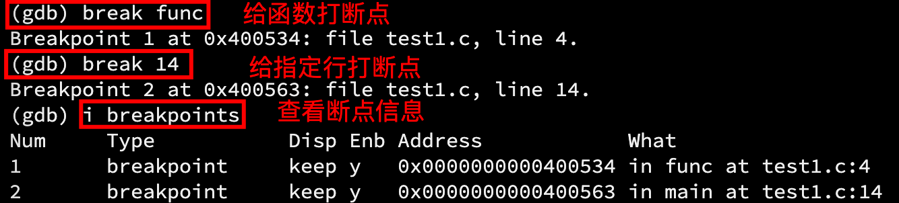
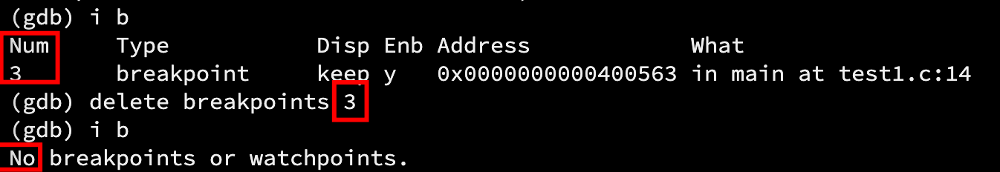
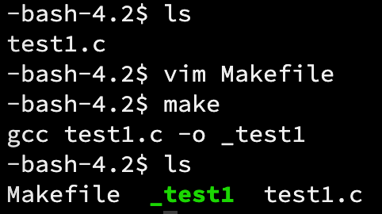
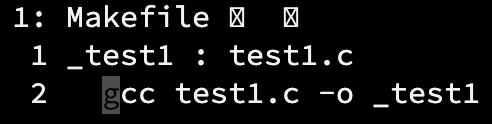
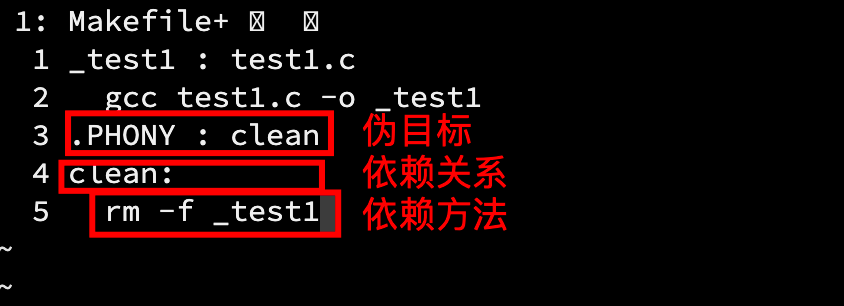

使用系统：CentOS 7.6

# 1. yum
即 Yellow dog Updater, Modified，它是 Linux 中一个常见的**包管理器之一**，它能维护大多数软件，就像 App Store 和其他应用商店一样。因此，它本身也是一个软件，在 Linux 下，安装软件通常有两种方式：

- 下载源码，在本地编译，生成可执行程序，但是时间比较长，优点是源代码体积小；
- 直接下载编译好的可执行程序，加以网速的提升，省去了本地编译的时间，缺点是时间取决于软件包的大小和网速。
> 软件包：
> 	简单地理解为可执行程序，它是需要被编译的，像 Windows 系统的镜像（体积很大），经常使用的办法是下载源码然后在本地编译的，例如 uupdump。

而 yum 作为包管理器，在 Linux 下就起着 App Store 的作用。简单的安装、升级、卸载等基本操作不在话下。
> 包管理器是有“源”的，可以认为 yum 就是从源上下载软件包，由于在国内访问国外源速度很慢，所以建议将源更改为国内源，例如阿里、腾讯、xx 大学源。
> 链接：[yum 更改为阿里源](https：//developer.aliyun.com/article/556579)

## 1.1 list 命令
```shell
yum list | grep xx
```
	xx 是软件的关键字，使用这条命令会罗列出所有能下载的、与关键字有关的软件。
> grep 是一个文本搜索工具。

## 1.2 install 命令
```cpp
sudo yum install xx
```
	xx 是软件包名。<br />输入该指令后，如果检索到对于软件包，会提示是否安装（y/n），键入 y 确认安装。<br />等待出现 complete 出现则说明安装完毕。<br />【注意】

- 安装软件操作实际上就是向系统目录写入数据，需要 root 用户或 sudo 执行；
- yum 一次安装只能一个软件，不能同时安装多个软件。
## 1.3 remove 命令
```cpp
sudo yum remove xx
```
	xx 是要卸载的软件名。
# 2. Vim
Vim 是一个强大的编辑器，它可以在 Linux、macOS、Windows 系统下使用。Vim 非常强大，它的参考文档也非常多，是学习 Linux 必须掌握的工具之一。
## 2.1 三种模式
Vim 采用**模式编辑**的理念，即在不同的模式下只能该模式下的事，这样做不需要通过复杂的切换，大多数情况只需要依次按下按键，而且越常用的操作，所需要按键的数量越少。在这里仅介绍最常用的三种模式。

- 普通模式/命令模式（Normal mode）：用 vim 命令打开文件就是默认为命令模式。控制屏幕光标移动，字符或行的删除，移动赋值某区段及进入插入模式或末行模式下；
- 插入模式（Insert mode）：在命令模式下按`i`，进入命令模式。只有在此模式下才能进行文字编写。按下`esc`键回到命令行模式；
- 末行模式（Last line mode）：文件保存或退出，也可以进行文件替换，查找字符串，显示行号等操作。
> 在命令模式下，输入`：+ 功能键`进入需要的模式。

##  2.2 基本操作

- 命令模式->插入模式：键入`a`、`i`、`o`;
- 插入模式->命令模式：按下`esc`；
- 命令模式->末行模式：键入`：`；
- 退出 Vim：键入`：`+`q`（quit）；
- 保存修改：键入`w`；
- 保存修改并退出：键入`wq`；
- 强制退出：键入`q！`;
- 保存后强制退出：键入：`wq!`。

### 示例

现在用 vim 指令打开一个文件：
```cpp
vim test1.txt
```


最下侧显示 NORMAL，说明现在处于命令模式，键入`i`：


最下侧的标识变成 INSERT，说明现在正处于插入模式。

修改文本内容，按下`esc`，并键入：`wq`


按下回车自动退出 vim，回到当前工作目录。

#  3. Vim 正常模式命令集

##  插入模式

- 按「i」切换进入插入模式「insert mode」，按“i”进入插入模式后是从光标当前位置开始输入文件；

- 按「a」进入插入模式后，是从目前光标所在位置的下一个位置开始输入文字；

- 按「o」进入插入模式后，是插入新的一行，从行首开始输入文字。

##  移动光标

- vim 可以直接用键盘上的光标来上下左右移动，但正规的 vim 是用小写英文字母「h」、「j」、「k」、 「l」，分别控制光标左、下、上、右移一格；
- 按「G」：移动到文章的最后；
- 按「 $ 」：移动到光标所在行的“行尾”；
- 按「^」：移动到光标所在行的“行首” 按「w」：光标跳到下个字的开头；
- 按「e」：光标跳到下个字的字尾 ；
- 按「b」：光标回到上个字的开头 ；
- 按「#l」：光标移到该行的第#个位置，如：5l,56l ；
- 按 [gg]：进入到文本开始 ；
- 按 [shift+g]：进入文本末端； 
- 按「ctrl」+「b」：屏幕往“后”移动一页 ；
- 按「ctrl」+「f」：屏幕往“前”移动一页 ；
- 按「ctrl」+「u」：屏幕往“后”移动半页 ；
- 按「ctrl」+「d」：屏幕往“前”移动半页。

##  删除文字

- 「x」：每按一次，删除光标所在位置的一个字符 ；
- 「#x」：例如，「6x」表示删除光标所在位置的“后面（包含自己在内）”6 个字符 ；
- 「X」：大写的 X，每按一次，删除光标所在位置的“前面”一个字符 ；
- 「#X」：例如，「20X」表示删除光标所在位置的“前面”20 个字符 ；
- 「dd」：删除光标所在行；
- 「#dd」：从光标所在行开始删除#行。

##  复制

- 「yw」：将光标所在之处到字尾的字符复制到缓冲区中；

- 「#yw」：复制#个字到缓冲区；

-  「yy」：复制光标所在行到缓冲区； 

- 「#yy」：例如，「6yy」表示拷贝从光标所在的该行“往下数”6 行文字；

- 「p」：将缓冲区内的字符贴到光标所在位置。

  > 注意：
  >
  > 所有与“y”有关的复制命令都必须与“p”配合才能完 成复制与粘贴功能。

## 替换

- 「r」：替换光标所在处的字符；
- 「R」：替换光标所到之处的字符，直到按下「ESC」键为止。

##  撤销

- 「u」：如果您误执行一个命令，可以马上按下「u」，回到上一个操作。按多次“u”可以执行多次回复；
- ctrl + r」： 撤销的恢复。

##  更改

- 「cw」：更改光标所在处的字到字尾处 ；
- 「c#w」：例如，「c3w」表示更改 3 个字。

##  跳转

- 「ctrl」+「g」列出光标所在行的行号；
- 「#G」：例如，「15G」，表示移动光标至文章的第 15 行行首。

#  4. Vim 末行模式命令合集

【注意】

在使用末行模式前，需确保 Vim 处于命令模式。键入`：`即进入末行模式。

##  显示行号

- 「set nu」： 输入「set nu」后，会在文件中的每一行前面列出行号。

##  跳转 

- 「#」：「#」号表示一个数字，在冒号后输入一个数字，再按回车键就会跳到该行，如输入数字 15，回车，就会跳到文章的第 15 行。

##  检索字符

- 「/关键字」： 先按「/」键，再输入您想寻找的字符，如果第一次找的关键字不是您想要的，可以一直按「n」会往**后**寻找到您要的关键字为止； 
- 「? 关键字」：先按「?」键，再输入您想寻找的字符，如果第一次找的关键字不是您想要的，可以一直按「N」会往**前**寻找到您要的关键字为止。

> 区别：前者向下查找，后者向前查找。
>
> 前者搭配 n 使用，后者搭配 N 使用。

##  保存

- 「w」： 在冒号输入字母「w」就可以将文件保存。

##  退出

- 「q」：按「q」就是退出，如果无法离开 vim，可以在「q」后跟一个「!」强制退出 Vim；
- 「wq」：一般建议离开时，搭配「w」一起使用，这样在退出的时候还可以保存文件。

# 5. 配置 Vim

在使用过功能强大的 IDE 后，再看原生 Vim 就显得有点“朴素”，为了提高效率和习惯，常常会搭配插件使用 Vim。

在目录 /etc/ 下面，有个名为 vimrc 的文件，这是系统中公共的 vim 配置文件，对所有用户都有效。 而在每个用户的主目录下，都可以自己建立私有的配置文件，命名为：“.vimrc”。例如，/root 目录下， 通常已经存在一个。vimrc 文件，如果不存在，创建它。切换用户成为自己执行 su ，进入自己的主工作目录，执行 cd ~

打开自己目录下的。vimrc 文件，执行 `vim .vimrc`

自己配置有点小麻烦，[链接](https：//blog.csdn.net/wooin/article/details/1858917)，所以可以使用下面这条命令，自动安装插件。

```shell
curl -sLf https：//gitee.com/HGtz2222/VimForCpp/raw/master/install.sh-o ./install.sh && bash ./install.sh
```

稍等片刻，你就能得到一个炫酷的 Vim，它具有语法高亮，自动补全等功能。

#  6. gdb

gdb 是 Linux 功能强大的调试器，尽管 gdb 命令有很多，但我们只需掌握常用的十几条就足以满足绝大多数调试需求。

## 6.1 背景知识

gdb 是一个调试器，它的对象是**已被编译的二进制代码**。在 C 语言学习中，我们已经了解了编译链接的原理，在这里结合 gcc/g++复习一次。

> gcc，即 GNU Compiler Collection，它是一个系统社区发布的调试工具，随着使用需求日益增加，它现在更像是一个各种工具的集合体，能根据文件的后缀调用不同的库，例如。c 文件调用 C 语言的库。
>
> 现在只需要将 gcc 看作 C 语言的编译器，g++看作 C++的编译器即可。

###  6.1.2 预处理

- 预处理指令：宏替换、包含头文件、条件编译、去注释等；

下面的讲解都以 C 语言代码示例：

```shell
//编写源文件，不存在则自动创建
vim test1.c
//添加以下代码
#include <stdio.h>
int func(int n)
{
  int ret = 0;  
  int i = 1
  for(; i <= n; i++)
  {
    ret += i;
  }
  return ret;
}
int main()
{
  int n = 100, ans = 0;
  ans = func(n);
  printf("%d\n", ans);
  return 0;
}
```

保存并退出。键入以下指令：

`gcc test1.c -o _test1`


可以看到当前工作目录下多了一个_test1 文件，那么我们可以知道，上面指令中的`-o`选项后面跟的内容就是指定生成的可执行程序的文件名，否则 Linux 下编译后生成的可执行程序名字默认是 a.out。

这里其实已经执行完整个编译链接过程了（因为已经生成了可执行程序），如果想要看到只进行预处理后的代码，只需在指令中加入`-E`选项。

> [Linux 下各种文件的后缀](https：//blog.csdn.net/ithomer/article/details/5660615)

###  6.1.3 编译

- 在检查完语法规范后，将语言翻译成汇编代码。在 Linux 中，汇编代码以

同样地，用户可以使用`-S`选项，可以看到生成的汇编代码，保存在。s 文件中。

> 注意，不用再加-E 选项，否则可能会停留在上一阶段，这取决于选项的顺序。

### 6.1.4 汇编

- 把编译阶段生成的汇编代码（.s 文件）转换成可重定向目标二进制文件（.o 文件）。

同样地，用户可以使用`-C`选项，查看由汇编代码转换而成的二进制代码。

### 6.1.5 链接

- 按照规则链接多个。o、.obj 文件，然后合成一个。exe 可执行程序。

###  6.1.6 函数库【补充】

C 语言没有内置输入输出函数，每次要包含的**标准输入输出头文件**就是一个库，它包含着许多内置的接口。

####  静态库

其后缀一般为`.a`，在编译链接时，需要将整个静态库的代码加载到可执行文件中，所以静态库生成的文件一般比较大，但是在运行时就不再需要库文件。

所如果调用一个库中的方法很多，直接将库的接口的==**实现**==方法拷贝到自己的代码中（已编译）。所以它不依赖库，但是占用资源（代码重复）。

#### 动态库

其后缀一般为`.so`，与静态库相对，为了节省系统开销，在编译链接时并未将整个库的代码加入到可执行文件中，而是在程序执行是有运行时链接文件加载库。

静态库相当于一个仓库，自己写的代码中需要使用库中的接口，只需将库中对应接口的==**地址**==填入代码中（已编译）就能找到库中接口对应的实现（实际的函数体），从而达到链接，所以只需要调用库即可。

而 gcc、g++默认生成的二进制程序是动态链接的。

##  6.2 gcc/g++选项

- -E 只激活预处理，这个不生成文件，你需要把它重定向到一个输出文件中；
- -S 编译到汇编语言不进行汇编和链接；
- -c 编译到目标代码；
- ==-o== 文件输出到文件；
- -static 此选项对生成的文件采用静态链接；
- ==-g== 生成调试信息。GNU 调试器可利用该信息；
- -shared 此选项将尽量使用动态库，所以生成文件比较小，但是需要系统由动态库；
- 编译器的优化选项的 4 个级别：
  - -O0 表示没有优化；
  - -O1 为缺省值；
  - -O3 优化级别最高。
- -w 不生成任何警告信息；
- -Wall 生成所有警告信息。

##  6.3 gdb 选项

首先需要再次强调：gdb（调试）的对象是已经被编译生成的二进制文件。

- l（list） + 行号：显示二进制文件的源代码（也就是编译前的代码），接着上次的位置往下列，每次列 10 行；
- l（list） + 函数名：列出某个函数的源代码；
- r（run）：运行程序；
- n（next）：单条语句执行；
- s（step）：进入函数语句；
- display + 变量名：跟踪查看一个变量，每次停下来都显示它的值 ；
- undisplay：取消对先前设置的那些变量的跟踪；
- until + n 行：跳至第 n 行；
- bt（breaktrace）：查看各级函数调用及参数；
- i（info） locals：查看当前栈帧局部变量的值；

- b（break） 行号：在某一行设置断点；
- b + 函数名：在某个函数开头设置断点；
- info break ：查看断点信息；
- finish：执行到当前函数返回后，停下来等待命令；
- p（print）：打印表达式的值，通过表达式可以修改变量的值或者调用函数；
- p 变量：打印变量值；
- set var：修改变量的值； 
- c（continue）：从当前位置开始连续而非单步执行程序；
- r（run）：从开始连续而非单步执行程序；
- delete breakpoints：删除所有断点；
- delete breakpoints + n：删除序号为 n 的断点；
- disable breakpoints：禁用断点；
- enable breakpoints：启用断点；
- i（或 info，意即 information） breakpoints：查看当前设置了哪些断点；
- q（quit）：退出 gdb。

> 注：为了括号内和括号外的选项是等价的。

##  6.4 示例

假设 test1.c 中已有以下代码：

```cpp
#include <stdio.h>
int func(int n)
{
  int ret = 0;                                                                                    
  for(int i = 1; i <= n; i++)
  {
    ret += i;
  }
  return ret;
}
int main()
{
  int n = 100, ans = 0;
  ans = func(n);
  printf("%d\n", ans);
  return 0;
}
```

且该文件已编译，二进制文件为_test1。

> 注意：
>
> 想要使用 gdb 进行调试（debug），就必须在 gcc 编译时增加选项-g（上文未提到），意思是**可执行程序包含调试信息**，也就相当于在 VS 编译器下从 Release 模式切换到 Debug 模式。
>
> gcc 编译器默认是 Release 模式。

【补充】首先要对 gdb 进行配置，有的机器默认情况下 gdb 是缺少配置的，会出现这样的问题（即使加了-g 选项）：


【原因】缺少配置

【解决办法】

1. 用指令`vim /etc/yum.repos.d/CentOS-Debuginfo.repo`打开该文件，将 enable 置为 1，如果该文件不存在，会自动创建，将以下内容粘贴：

```shell
[debug]
name=CentOS-7 - Debuginfo
baseurl=http://debuginfo.centos.org/7/$basearch/ 
gpgcheck=1
gpgkey=file:///etc/pki/rpm-gpg/RPM-GPG-KEY-CentOS-Debug-7 
enabled=1
```

2. 执行`sudo yum install -y glibc`；
3. 执行`debuginfo-install glibc`。

> 注意
>
> 上述指令可能需要 root 用户或 sudo 执行。
>
> 参考：https://www.796t.com/content/1538198547.html

现在开始对_test1 调试：

- 如果编译时不加选项-g：

```cpp
//编译
gcc test1.c
//用 gdb 打开
gdb _test1
//用指令 r 试一下
(gdb) r
```


由于没有以调试模式编译 test1.c，那么得到的二进制文件中就不会有调试信息，gdb 也就无法对其调试，这也是 Debug 版本的程序体积更大的原因。

蓝色部分依然打印出了程序的结果，原因是命令 r 是运行程序，且程序没有断点（也不会有）。

键入`q`退出 gdb。

- ==编译时一定要加-g 选项==

```shell
//编译
gcc test1.c -g
//用 gdb 打开
gdb _test1
//用指令 r 试一下
(gdb) r
```


最下面的提示表明调试信息已经加载成功。

- `r`运行程序，`l`显示源码：

	

`l`可以指定行号范围打印，也可以`l -`、`l +`向下或向上打印。

`r`是运行完整个程序。

- `break + 函数名`，给指定函数打断点；
- `b + 行号`，给指定行打断点；
- `i breakpoints、i b`，查看断点信息。

		

- `r`运行至最近的断点处，无断点则运行整个程序；
- `n`单句执行，`s`遇到函数则进入函数；
- `p + 变量 `打印变量的值；
- `display + 变量`每次执行语句都打印变量的值；`undisplay`取消；
- `c`从当前位置从单步->连续执行，直到断点或执行完毕；

	

- `s`进入函数，`finish`结束函数，得到返回值：
  

- `disable breakpoints`禁用断点；
- `enable breakpoints`启用断点。


- `delete + 断点序号`删除断点；`delete breakpoints`删除所有断点；



gdb 是一个非常强大的调试器，不仅限于 C/C++，熟练使用指令后，效率甚至比 IDE 还高，动手练才是王道。

#  7. make 和 Makefile

首先要说明，make 是工具（软件），Makefile 是一个统称的文件，它的内容可以由用户按照格式自己编写，它的名字也可以是 makefile、GNUMakefile，习惯上约定俗成地使用 Makefile。

下面分别介绍 Makefile 和 make。

##  7.1 概念

想象一个场景：实际上项目都是有很多个源文件组合而成的，像上面 g 使用 gcc 的方式，一次只能编译一个或者几个源文件，这对不计其数的项目文件来说杯水车薪，难道要一直 gcc、g++吗？就算这样，难道一个程序不用调试就直接发布吗（多次编译）？而且有时需要文件编译的顺序不同，是否重新编译，等等。

为了提高效率，人们把 gcc、g++这些指令都集合在一个文件`Makefile`中，只需编辑一次，有新需求再对其修改，通过工具`make`，自动化执行指令。

也就是说，make 充当了每次输入 gcc、g++编译命令的我们，Makefile 对于我们而言，就相当于一个大指令。

##  7.2 Makefile 的组成

```shell
目标文件 : 依赖文件
	指令
```

或

```shell
目标文件 : 依赖文件；指令
	指令
```

- 目标文件：必须要有，它可以是个中间文件，也可以是可执行程序，还可以是个标签（暂时只将它认为是编译后生成的二进制文件）；
- 依赖文件（列表）：如需要被编译的。c/.cpp 文件；但它不是必要的，如果有多个，使用空格隔开；
- 指令：任意 shell 指令（也就是 Linux 中的指令），若有多条命令，每条占一行。

> 「目标文件 : 依赖文件」统称为**依赖关系**，「指令」则叫做**依赖方法**，它们是组成 Makefile 不可缺少的部分。
>
> 【==注意==】
>
> 「依赖方法」前必须用`tab`，不能用空格代替。且依赖方法必须在目标文件下一行。

##  7.3 构建项目

下面用一个简单的例子演示 make 使用 Makefile：



其中 Makefile 的内容是：



这就是它们最基本的用法，有没有很简单。下面补充更多基础用法。

##  7.4 清理项目

实际上，清理项目并不是真正意义上的“清理”，因为 make 和 Makefile 本身就是为了构建项目（看它们的英文名字），清理项目实际上就是让 make 执行了清理的指令。

直接给出清理项目需要的 Makefile 代码：



举个例子：


在下面将说明这里的蹊跷之处。

##  7.5 make 项目构建原理

对于 Makefile：

```shell
 //我这里的 tab 占 2 个空格
_test1 : test1.c
	gcc test1.c -o _test1
.PHONY : clean
clean:
  rm -f _test1  
```

而言：

只要键入`make`指令：

1. 在当前目录下寻找名为`Makefile`或`makefile`的文件；
2. 如果 Makefile 文件存在，它会默认==由上而下==地找文件中第一个目标文件 a，如果第一个文件 a 不存在，那么它就会找到生成文件 a 的文件 b，以此类推。通常情况下，都是由。c/.cpp 和。h 文件生成第一个目标文件的。

【注意】

make 只会处理依赖关系，不会处理是否编译。

> 言外之意：如果依赖关系中，`:`后面的文件不存在，这是无法编译的，但是 make 不会对其检查。这是稍后解释清理项目的原因。

如果将 Makefile 中的两个依赖关系语句调换位置：

```shell
.PHONY : clean
clean:
  rm -f _test1 
_test1 : test1.c
	gcc test1.c -o _test1
```


因为默认是从上到下查找文件（注意刚刚已经更改了两个语句块的顺序），所以 make 执行的是 rm 指令。上文提到，Makefile 是由依赖关系和依赖方法组成，它们通过目标文件绑定在一起，这样我才能用`make+目标文件名`的形式使用特定的指令。

这也是上文中项目清理不是纯粹的“清理”的原因，因为我指定了目标文件名`clean`，但这里有个问题，为什么`clean`是一个动作，这里却把它叫做目标文件呢？

##  7.6 伪目标

看到这个小标题你大概就已经猜到，这是用某种手段将`clean`这个动作让 make 工具以为它是一个目标文件。

首先要介绍`.PHONY`，它之于 make 工具，就像关键字之于 C。被它修饰的目标文件叫做**伪目标**。将`make clean`和`make _test1`结合起来看，它们都是指定目标文件 make，这就是刚才说 make 清理项目并不纯粹的原因，因为清理的动作是额外实现的。清理项目是没有诸如。c 这样的源文件的，加之以 make 不会对是否能编译进行检查，所以 clean 的“骚操作”才显得合理。

伪目标总是根据依赖关系，执行依赖方法。

> 这句话对理解伪目标和它的作用非常重要，但是许多地方都把这句话说成“总是被执行的”，让人费解。我猜可能是直译过来的，突然好想吐槽= =，算了不说了，懂得都懂。

下面解释这个“总是被执行的”到底是什么意思（这里 Makefile 已经恢复原样）：


我在这里多次 make，它提示目标文件已存在是最新的了，但是我多次 clean，即使当前目录没有目标文件，它依然执行`rm`命令，这就是“总是被执行的”。

Makefile 文件写到这种程度对初学者而言已经足够，在后续的学习和工作中会有更多不同的需求。
