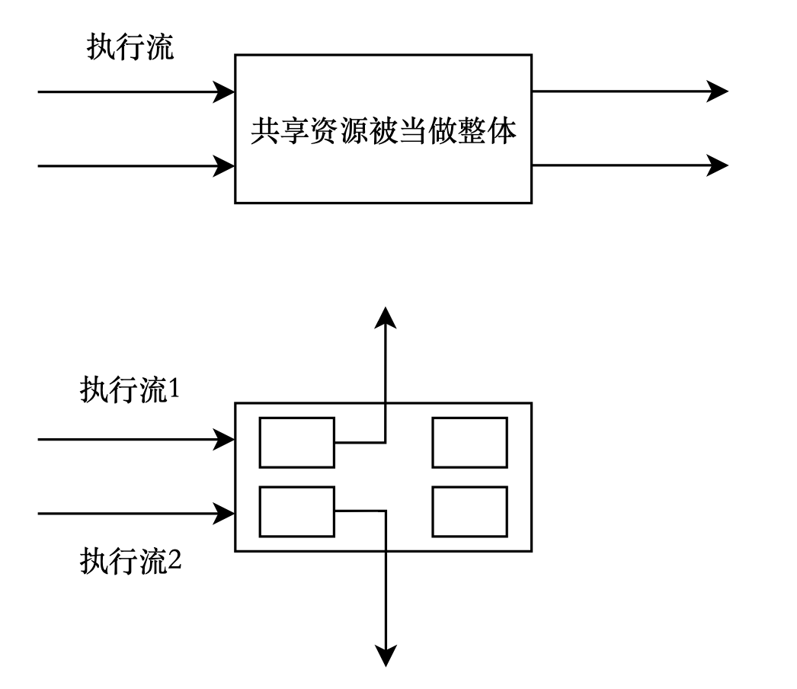

阅读前导：

本文默认读者已经了解了互斥锁与线程相关知识。

# 1. POSIX 信号量

> [什么是"POSIX？"](https://zhuanlan.zhihu.com/p/460426074)
>
> 友情链接：[进程间通信--5. 信号量](https://blog.csdn.net/m0_63312733/article/details/129721739?spm=1001.2014.3001.5501#5__2074)

## 1.1 引入

首先以在电影院的买票为例：

信号量就是一场电影的座位总数，每一个人都是一个独立的执行流，所有的座位之和是临界资源。在生活中，并不是因为我们坐到某一个座位，才说明这个座位是属于我们的，而是通过票上面的座位编号确定座位在本场电影的所属权。也就是说，当我们还没进放映厅，坐到座位之前，这个座位在本场电影就归属于我了。电影票对于座位来说，是一种预定机制。

## 1.2 概念

信号量（信号灯）的概念 1965 年由著名的荷兰计算机科学家 Edsger Wybe Dijkstra 提出，其基本思路是用一种新的变量类型（semaphore，信号量）来记录当前可用资源的数量。有两种实现方式：

1. semaphore 的取值必须大于或等于 0。0 表示当前已没有空闲资源，而正数表示当前空闲资源的数量；
2. semaphore 的取值可正可负，负数的绝对值表示正在等待进入临界区的进程个数。

信号量是由操作系统来维护的，用户进程只能通过初始化和两个标准原语（P、V 原语）来访问。初始化可指定一个非负整数，即空闲资源总数。

--百度百科-[PV 原语](https://baike.baidu.com/item/PV%E5%8E%9F%E8%AF%AD/1882650?fromModule=lemma_inlink)

==信号量的本质是一个计数器==（整数变量），它被用来描述临界资源中资源的数目。

同时，信号量也是一种共享资源，任意时刻只有一个执行流能访问它。在刚开始学习进程间通信和使用互斥锁时，我们是将共享资源看成一个整体的。但是共享资源可能往往不止一种类型，如果不同的执行流只访问共享资源中属于自己的那一部分，这样就不会发生并发问题，还在一定程度上提高了效率。因此可以使用信号量以更小的粒度管理临界资源。

用电影院的例子来说，所有放映厅的座位合起来是一个整体的临界资源，但是我们拿着不同电影的票，对应着整体中的一小部分因此不会出现某个人走错的情况（计算机的执行不会出错）。



## 1.3 PV 原语（原理）

- P 原语：P 是荷兰语 Proberen（测试）的首字母。为阻塞原语，负责把当前进程由运行状态转换为阻塞状态，直到另外一个进程唤醒它。操作为：申请一个空闲资源（**把信号量减 1**），若成功，则退出；若失败，则该进程被阻塞；

- V 原语：V 是荷兰语 Verhogen（增加）的首字母。为唤醒原语，负责把一个被阻塞的进程唤醒，它有一个参数表，存放着等待被唤醒的进程信息。操作为：释放一个被占用的资源（**把信号量加 1**），如果发现有被阻塞的进程，则选择一个唤醒之。

> PV 操作必须是原子性的。

每一个执行流要访问临界资源，首先要申请信号量，这个申请的过程是多个执行流共同竞争同一类信号量的过程。信号量被多个执行流访问，那么信号量本身也是临界资源。

信号量是用来保护临界资源的，而它本身就是临界资源，因此信号量的 PV 操作也必须是原子性的，这样就能实现它自己保护自己，也保护了临界资源。

> `++`和`--`操作符本身并不是原子操作。但是，可以使用原子库提供的原子操作来实现类似于`++`和`--`的原子操作。例如，可以使用`atomic_fetch_add`和`atomic_fetch_sub`来实现类似于`++`和`--`的原子操作。

> 信号量的两个原子操作具体是什么？

PV 操作。

信号量的两个原子操作是等待（wait）和信号（signal）。这两个操作有时也被称为 P 和 V，或 down 和 up。等待操作简单地将信号量的值减 1，如果它大于零（有可用资源）。如果信号量的值已经为零（没有可用资源），则调用进程将被挂起。信号操作将信号量的值加 1，如果没有其他进程在等待资源。否则，而不是增加它的值，一个等待进程被操作系统调度程序选择唤醒。因此，该进程获得对资源的控制。

> 上面提到，如果执行流申请信号量失败（也就是信号量为 0，表示所有资源被占用）时，就会被阻塞，有什么数据结构能实现这个操作呢？

信号量的实现需要一个整数值（用于保存信号量值）和一个指向等待列表中下一个进程的指针。当一个进程执行等待操作时，如果信号量的值为零，则该进程将被阻塞并加入等待列表。当另一个进程执行信号操作时，它会唤醒等待列表中的一个进程。

> 如果一个执行流（线程或进程）申请了信号量而不使用它，会造成什么问题？

如果要说有什么问题的话，那就是可能会导致其他等待该信号量的执行流被阻塞，从而影响程序的执行效率。但是效率这件事应该视情况讨论它的严重性，一般而言效率的下降不会是致命性（fatal）错误。

## 1.4 相关接口

在 pthread 库中，与信号量相关的函数包括`sem_init`，`sem_wait`，`sem_post`，`sem_getvalue`和`sem_destroy`等。

- `sem_init(sem_t *sem, int pshared, unsigned int value)`用于初始化信号量。第一个参数是指向信号量的指针，第二个参数指定信号量是否在进程之间共享（非零值表示共享），第三个参数指定信号量的初始值。此函数成功时返回 0，失败时返回错误码。
- `sem_wait(sem_t *sem)`用于等待信号量。它将信号量的值减 1，如果信号量的值大于零（有可用资源）。如果信号量的值已经为零（没有可用资源），则调用进程将被挂起。此函数成功时返回 0，失败时返回错误码。
- `sem_post(sem_t *sem)`用于发出信号。它将信号量的值加 1，如果没有其他进程在等待资源。否则，而不是增加它的值，一个等待进程被操作系统调度程序选择唤醒。因此，该进程获得对资源的控制。此函数成功时返回 0，失败时返回错误码。
- `sem_getvalue(sem_t *sem, int *sval)`用于获取信号量的当前值。第一个参数是指向信号量的指针，第二个参数是指向存储信号量值的整数的指针。此函数成功时返回 0，失败时返回错误码。
- `sem_destroy(sem_t *sem)`用于销毁信号量。此函数成功时返回 0，失败时返回错误码。

这些函数都定义在`semaphore.h`头文件中，它们的返回值都是`int`类型。

# 2. 二进制信号量

当信号量的值为 0 或 1 时，说明临界资源只有一份，那么它可以用作二进制信号量/二元信号量，也称为互斥信号量。在这种情况下，信号量的作用类似于互斥锁，用于实现对共享资源的互斥访问。

但是，信号量和互斥锁之间仍然存在一些区别。互斥锁是一种锁定机制，只有一个线程可以获得互斥锁。这意味着与互斥锁相关联的所有权，只有所有者才能释放锁（互斥锁）。而信号量是一种信号机制，一个线程可以执行`sem_wait()`操作，而另一个线程可以执行`sem_post()`操作。

# 3. 基于环形队列的生产消费模式

友情链接：[生产者消费者模式](https://blog.csdn.net/m0_63312733/article/details/130191224?spm=1001.2014.3001.5501)

## 3.1 介绍

基于环形（循环）队列的生产者消费者模式是解决多模块间数据通信问题的高效机制。它在数据生产者和数据消费者之间建立数据缓冲区，以实现低耦合的数据通信。

这种结构就像流水线上的两个过程以及它们之间的货架。前道工序有数名工人将本道工序的产品上架，然后立即返回自己的生产工作；同样，下一道工序的几个工人可以直接从货架上取下上一道工序的产品，直接开始自己的生产工作。 与直接调用数据通信方式相比，生产者/消费者模型虽然多了一个数据缓冲区，但其优势也非常明显：支持模块并发。

## 3.2 为什么要使用环形队列

当然，也可以使用普通队列或其他数据结构来实现生产消费模式，但环形队列具有一些优点，例如它可以有效地利用内存空间，并且可以很容易地实现循环访问数据。

> 好处体现在哪里？

1. 环形队列的优点之一是它可以有效地利用内存空间，避免数据搬移，重复利用之前使用过的空间。这是因为它使用一个固定大小的数组来存储数据，当数组填满时，新添加的数据会覆盖旧数据。这样，环形队列就可以在有限的内存空间内循环存储数据，而不会浪费内存。

2. 另一个优点是环形队列可以很容易地实现循环访问数据。由于它使用一个固定大小的数组来存储数据，所以可以通过简单地增加或减少数组索引来访问下一个或上一个数据元素。这样，就可以很容易地在环形队列中循环访问数据。
3. 由于环形队列使用固定大小的数组实现，因此可以通过下标索引快速查询资源，所以它的实现相比于其他数据结构较简单，因此循环队列可以通过下标索引（指针）实现同步和互斥，因此它可以用来实现多线程编程。

## 3.3 环形队列的作用

使用环形队列来实现生产消费模式的好处包括：

1. 它提供了一个负载均衡的系统，可以处理应用程序实例发送的大量请求的广泛变化。
2. 队列充当应用程序实例和消费者服务实例之间的缓冲区。这个缓冲区可以帮助最大限度地减少对应用程序和服务实例的可用性和响应性的影响。

对于生产者和消费者，环形队列就是一个缓冲区，在此之前，我们一直强调“临界资源必须被所有相关的线程/进程看到”，言外之意就是这个临界资源必须是全局的（C/C++），才能被所有线程/进程共享。因此生产者和消费者对应的两个执行流要检测临界资源是否就绪时，缓冲区必须也是全局的。但是在这里队列是可以作为局部资源被检测的。

## 3.4 实现

### 互斥和同步

在环形队列实现的生产者消费者模式中，两个基本原则是：

1. 同步：生产者和消费者之间需要通过某种同步机制来协调它们的操作，以确保生产者不会在队列已满时继续添加数据，消费者不会在队列为空时尝试获取数据。

2. 互斥：当多个生产者或多个消费者同时访问环形队列时，需要通过某种互斥机制来确保它们之间不会发生冲突。例如，可以使用互斥锁或信号量来实现互斥访问。

在环形队列中，如果生产者和消费者的指针指向同一个位置，那么就代表缓冲区为空或为满。生产者和消费者的关系必须是互斥且同步的，即在同一时间段中只有一个执行流访问这个队列中的资源。例如缓冲区满时，只有消费者在运行，生产者处于阻塞状态。

但是这是一个小概率事件，大部分情况它们指向的位置都是不同的：

1. 想让生产者和消费者指向同一个位置，它们需要有互斥和同步关系。
2. 想让生产者和消费者指向不同位置，它们需要并发地访问临界资源。

> 当队列为空时，应该要先让谁先运行？

当环形队列为空时，消费者无法从队列中获取数据，因此应该让生产者先运行，向队列中添加数据。一旦队列中有了数据，消费者就可以从队列中获取数据并进行处理。反之消费者先运行。

结合环形队列的特点和生产消费模型，即环形队列的数据更新是通过覆盖旧数据实现的，因此需要有下面两个原则限制生产者和消费者的行为：

1. 当消费者阻塞，生产者将缓冲区中充满以后，那么两个指针就在同一个位置，此时生产者就不能继续生产了，从逻辑上的环形队列来看，就是生产者比消费者多走了整整 1 圈，如果继续生产，会造成还未被消费者使用的有效数据被覆盖。
2. 消费者的位置不能超过生产者，否则会读取到已经被使用过的、废弃的数据。

> 如何在代码层面上保证这些？

首先要明确生产者和消费者关心什么类型的资源，才能限制它们的行为。

- 生产者：最关心有没有空间资源，有空闲资源就能生产；
- 消费者：最关心有没有数据资源，有有效数据就能消费。

### 两个信号量

因此，我们可以将共享资源划分为不同区域，根据生产者和消费者的不同需求（假设循环队列中的有效数据个数是$N$）：

- 生产者使用空间信号量（spaceSem），当 spaceSem 达到 N 时，说明生产者可以进行生产；反之暂停生产。
- 消费者使用数据信号量（dataSem），当 dataSem 被申请到 0 时，说明已经没有有效数据能被消费者使用了；反之继续消费。

> spaceSem 和 dataSem 是为了方便描述而自定义的命名，它将在稍后的代码中出现。

现在对于生产者消费者模式，有两个信号量控制生产者和消费者的行为，而这两个信号量本身就是互斥的。即不论何时，spaceSem+dataSem 一定等于有效数据的个数$N$。就这两个互斥的信号量而言：

- 生产者：每生产一个数据都会对 spaceSem 进行一次 P 操作，即 spaceSem--；有效数据的个数多 1，对 dataSem 进行一次 V 操作，即 dataSem++;
- 消费者：每消费一个数据都会对 dataSem 进行一次 P 操作，即 dataSem++；空间资源的空出来 1 个，对 spaceSem 进行一次 V 操作，即 spaceSem--。

因此在初始状态，环形队列中没有数据，全是空间资源，所以 spaceSem 的初始值是队列有效数据的个数$N$，dataSem 的初始值是 0，表示没有数据可以被消费者消费。

### 框架

在`ringQueue.hpp`中实现环形队列：
```cpp
#include <iostream>
#include <vector>

using namespace std;

#ifndef _RING_QUEUE_HPP_
#define _RING_QUEUE_HPP_

template<class T>
class RingQueue
{
public:
	RingQueue()
	{}
	~RingQueue()
	{}
	void push(const T& in)
	{}
	void pop(T* out)
	{}
private:
	vector<T> _ring_queue;
	int _num;
};

#endif
```

其中，环形队列使用了 vector 容器，以便在编写 pop 和 push 逻辑时复用 vector 的接口。`num`是用来记录队列中有效数据的个数的，其实可以复用 vector 的 size 接口，这里是显式地定义 num，强调了有效数据的个数。

补充：

这些宏是用来防止头文件被重复包含的，它们的作用和`pragma once`是一样，只不过后者可能在某些编译器无法使用，因为后者不是标准的 C++语言特性。`#ifndef` 和 `#define` 是预处理器指令，用于检查某个宏是否已经定义。如果没有定义，则执行 `#ifndef` 和 `#endif` 之间的代码。在这种情况下，它定义了一个名为 `_RING_QUEUE_HPP_` 的宏。这样，如果这个头文件被多次包含，预处理器会检查到 `_RING_QUEUE_HPP_` 已经定义过了，从而不会重复包含这个头文件中的内容。

> 为什么要防止头文件被重复包含？

防止头文件被重复包含是很重要的，因为它可以避免多种潜在的问题。例如，如果一个头文件被重复包含，那么其中定义的类型、变量或函数也会被重复定义，这会导致编译错误。此外，重复包含头文件还会增加编译时间，因为编译器需要多次处理相同的内容。使用 `#pragma once` 或者宏定义来防止头文件被重复包含，可以避免这些问题。

在`ProdCon.cc`中实现多线程并发访问临界资源的逻辑：
```cpp
#include "ringQueue"

void* productor(void* args)
{
	RingQueue<int>* rq = (RingQueue<int>*)args;
	// 生产的逻辑
}
void* consumer(void* args)
{
	RingQueue<int>* rq = (RingQueue<int>*)args;
	// 消费的逻辑
}

int main()
{
	RingQueue<int>* rq = new RingQueue<int>();
	pthread_t prod, cons;
	pthread_create(&cons, nullptr, consumer, (void*)rq);
	pthread_create(&prod, nullptr, productor (void*)rq);

    pthread_join(cons, nullptr);
	pthread_join(prod, nullptr);

	return 0;
}
```

这样就实现了两个线程看到了同一个队列，也就是临界资源。资源的管理将在环形队列中实现，而这里的临界资源并不是在全局中定义的。

### 生产和消费的逻辑

```cpp
void* productor(void* args)
{
	RingQueue<int>* rq = (RingQueue<int>*)args;
	while(1)
	{
		// 模拟生产过程，产生数据或任务--[会占用一定时间]
		int in = 1;
		cout << "生产者：" << in << endl;
		// 将数据或任务推送到环形队列中
		rq->push(in);
	}
}
void* consumer(void* args)
{
	RingQueue<int>* rq = (RingQueue<int>*)args;
	while(1)
	{
		// 模拟消费过程，从队列中获取数据或任务
		int out;
		rq->pop(&out);
		// 执行任务或处理数据--[会占用一定时间]
		cout << "消费者：" << ++out << endl;
	}
}
```

假设已经完成环形队列的设计，对于生产者和消费者的线程函数，由于它们的参数是 void *类型，因此可以传送任何类型的数据给线程，只要在线程内部强转回去即可。

因此我们可以把环形队列这个临界资源作为线程信息传送给生产者和消费者线程，实际上传送的是环形队列对象在堆上的起始地址，线程函数在函数内部拿到这个地址就能调用同一个队列对象的成员函数，实现多个线程共同访问同一个资源。

对于生产者和消费者线程，它们都有着不同的职责：

- 生产者：生产任务，然后将任务派发给其他线程。用到的接口是`push`。在上面的代码中，暂且用一个数据`in`模拟生产任务的过程。
- 消费者：执行任务，使用接口`pop`将队列中的任务取出，这里使用了一个输出型参数`out`获取队列中的任务。上面的代码中暂且用它和打印语句模拟执行任务的过程。

### 完善环形队列 1

```cpp
const int g_default_num = 5;

template<class T>
class RingQueue
{
public:
	RingQueue(int default_num = g_default_num)
	: _ring_queue(default_num)
	, _num(default_num)
	, _p_step(0)
	, _c_step(0)
	{}
	~RingQueue()
	{}
	void push(const T& in)
	{
		_ring_queue[_p_step++] = in;
		_p_step %= _num;
	}
	void pop(T* out)
	{
		*out = _ring_queue[_c_step++];	// 输出型参数
		_c_step %= _num;
	}
	void debug()
	{
		cout << "size: " << _ring_queue.size() << " num: " << num << endl;
	}
private:
	vector<T> _ring_queue; // 用数组保存环形队列的数据
	int _num;				// 容量
	int _p_step;			// 生产下标
	int _c_step;			// 消费下标
};
```

**debug() 和 pop()、push()：**

为了测试和观察现象的方便，在`ringQueue`类中增加了`debug()`接口，以此打印调试信息，这是一个非常使用的调试方法，因为这样能直接获取大部分成员变量的值，而不需要单独为他们写 get 接口（实际上这就是一种 get 节接口）。

push 的逻辑：将参数`in`入队列，也就是直接将`in`插入到数组中的最新位置上，我们可以用一个变量`index`来记录队列（数组）中的最新位置，就像这样：
```cpp
void push(const T& in)
{
	int index = 0;
	_ring_queue[index] = in;
}
```

这样做虽然能将`in`插入到数组中，但是它是一个局部变量，因此每次 push 时都会从下标为 0 的位置插入。所以我们考虑用`static`修饰，每次 push 以后都更新一下它的位置。

但是这样做仍然不够，因为存储数据的数据结构是队列，如果超出了存储的限制，就会从原来的起点覆盖之前可能还未使用的数据。因此环形队列常常利用模运算的特性，即`一个正整数%N`，那么值域一定为`[0, N - 1]`。

```cpp
void push(const T& in)
{
	static int index = 0;
	_ring_queue[index++] = in;
    index %= _num;
}
```

但是这样的话如果要使用成员函数`debug()`打印它的信息，就必须将`index`作为类的成员，这样做是可行的。但是在这里我们想看到每次生产和消费的时下标的变化，而 index 只能代表队列中的最新位置，也就是生产者生产的最新数据的位置，所以我们分别使用两个下标`_p_step`和`_c_step`表示生产者和消费者生产和消费的最新位置。在初始情况下，它们的值都是 0。

pop() 的逻辑也是类似的，需要注意的是`out`是一个输出型参数，因此要在类的内部把队头数据赋值给`*out`，这样消费者的线程函数才能取到队列中的任务或数据。

**构造函数和析构函数：**

在构造函数中初始化队列的大小以及成员函数。注意`_ring_queue(default_num)`实际上是调用了 vector 的构造函数。构造函数和析构函数还有部分逻辑会在稍后补充。

### 信号量

模运算的特性使得我们可以不加以判断地更新生产者和消费者的下标，但是在线程函数中，为了保证效率，生产者和消费者都是以`while`的方式不断生产和消费数据，而不是以`if`。要知道计算机执行的速度数以亿计，这对缓冲区中的数据来说会有很大的安全问题，因此我们必须保证缓冲区中的数据在同一个时间段内只能被生产者或消费者访问。

所以我们使用信号量来保护缓冲区中的空间（对应生产者）和数据（对应消费者）。由于信号量本质上是一个整数计数器（也就是说它应该是递减的），所以它的初始值应该是被手动赋值的。下面将在`sem.hpp`中将信号量的操作接口用一个类封装，这也是常用的模块化方式。

```cpp
#ifndef _SEM_HPP_
#define _SEM_HPP_

#include <semaphore.h>

class Sem
{
public:
	Sem(int val)
	{
		sem_init(&_sem, 0, val);
	}
	~Sem()
	{
		sem_destroy(&_sem);
	}
	void p()
	{
		sem_wait(&_sem);
	}
	void v()
	{
		sem_post(&_sem);
	}
private:
	sem_t _sem;
};

#endif
```

注意：`sem_t`和`pthread_t`以及`pid_t`一样，是一个内核提供数据类型。

### 完善环形队列 2

**新增信号量类型的成员：**

现在封装好了信号量类`Sem`，那么在环形队列中为生产者和消费者分别保护空间资源和数据资源，即生产和消费的对象（资源）不同，因此要相应地定义两个信号量。值得注意的是，这两个信号量应该是互斥的，也就是说，在任何时候它们的和都是队列的长度$N$，即`_space_sem`和`_data_sem`的初始值分别为$N$和$0$。

**push 和 pop 的逻辑：**

现在有了信号量，而 push 和 pop 分别对应着生产者和消费者：

- 生产者：每生产一个数据，空间都变少一个，有效数据变多一个。对`_sapce_sem`信号量进行 P 操作，即--；对`_data_sem`信号量进行 V 操作，即++；
- 消费者：每消费一个数据，有效数据都变少一个，空间都变多一个。对`_date_sem`信号量进行 P 操作，即--；对`_space_sem`信号量进行 V 操作，即++。

值得注意的是，PV 操作必须在数据操作的前后。P 操作会等待信号量变为正数，然后将其减一。这可以用来确保在对共享数据进行操作之前，没有其他线程正在访问它。V 操作则将信号量加一，表示共享数据已经被释放，可以被其他线程访问了。

```cpp
emplate<class T>
class RingQueue
{
public:
	RingQueue(int default_num = g_default_num)
	: _ring_queue(default_num)
	, _num(default_num)
	, _p_step(0), _c_step(0)
	, _space_sem(default_num), _data_sem(0)
	{}
	~RingQueue()
	{}
	void push(const T& in)
	{
		_space_sem.p(); 	// 空间--
		_ring_queue[_p_step++] = in;
		_p_step %= _num;
		_data_sem.v();		// 数据++
	}
	void pop(T* out)
	{
		_data_sem.p(); 		// 数据++
		*out = _ring_queue[_c_step++];	// 输出型参数
		_c_step %= _num;
		_space_sem.v();		// 空间--
	}
	void debug()
	{
		cout << "size: " << _ring_queue.size() << " num: " << num << endl;
	}
private:
	vector<T> _ring_queue; // 用数组保存环形队列的数据
	int _num;				// 容量
	int _p_step;			// 生产下标
	int _c_step;			// 消费下标
	Sem _space_sem;			// 空间资源信号量
	Sem _data_sem;			// 数据资源信号量
};
```

### 测试 1

```cpp
#include "ringQueue.hpp"
#include "Task.hpp"
#include <sys/types.h>
#include <unistd.h>
void* productor(void* args)
{

	RingQueue<int>* rq = (RingQueue<int>*)args;
	while(1)
	{
		sleep(1);

		// 模拟生产过程，产生数据或任务--[会占用一定时间]
		int in = 1;
		cout << "生产者：" << in << endl;
		// 将数据或任务推送到环形队列中
		rq->push(in);
	}
}
void* consumer(void* args)
{

	RingQueue<int>* rq = (RingQueue<int>*)args;
	while(1)
	{
		sleep(1);

		// 模拟消费过程，从队列中获取数据或任务
		int out;
		rq->pop(&out);
		// 执行任务或处理数据--[会占用一定时间]
		cout << "消费者：" << ++out << endl;
	}
}

int main()
{
	RingQueue<int>* rq = new RingQueue<int>();
	rq->debug();
	pthread_t prod, cons;
	pthread_create(&cons, nullptr, consumer, (void*)rq);
	pthread_create(&prod, nullptr, productor, (void*)rq);

	pthread_join(cons, nullptr);
	pthread_join(prod, nullptr);

	return 0;
}
```

通过 sleep 控制读写的读写速度。即使刚开始生产者因为 sleep 比慢，但是有信号量的限制，只有当队列中有数据可读时才会让消费者线程读，初始情况没有数据，当消费者线程首先被调度时，它将会被挂起，然后由消费者线程生产数据或任务到队列中。


再次强调 push 和 pop 中的 PV 操作，它们是互斥的。当`_c_step`和_`p_step`（下标）相等时，就是队列为空或为满时，所以不可能在 push 时 pop，也不可能在 pop 时 push，push 和 pop 不可能同时发生。因为任意一个操作（push 和 pop）中的 PV 都是`P（自己）`（++），`V（对方）`（--），因此 push 和 pop 操作也是互斥的并发的。

> 这个模型可以实现多消费多生产吗？

在思考这个问题时，应该想多生产多消费比单生产单消费多了些什么，而不要单纯地想如何实现它。单生产单消费体系中，只存在生产者和消费者之间的关系，前者多了生产者之间与消费者之间的关系。因此要想到生产者消费者的“123 原则”：

- 1 个空间：生产者和消费者在同一时间段内共用同一存储空间，生产者向空间里生产数据，而消费者从空间里取走数据。
- 2 种角色：生产者和消费者。
- 3 种关系：
  - 生产者之间：互斥
  - 消费者之间：互斥
  - 生产者和消费者：互斥与同步

> 在生产者消费者模式中，生产者和消费者是线程角色化的，这意味着生产者和消费者都是独立的线程，这样它们只能并发地执行。这个共享的空间指的是由某种数据结构表示的缓冲区，所谓的商品就是计算机中的数据。
>
> 并且要做到生产者和消费者的操作必须是互斥的，即对于数据而言，它只有被生产前和被生产后两种状态。这样才能保证生产者和消费者可以并发地执行，生产者不需要等待消费者消费完数据才能继续生产数据，消费者也不需要等待生产者生产完数据才能继续消费数据。
> 原文链接：https://blog.csdn.net/m0_63312733/article/details/130191224

因此如果要实现多生产多消费，那么一定要保证生产者之间、消费者之间的线程访问队列资源的过程必须是互斥的。所以要给生产者、消费者分别加锁，以保护共享资源的安全，避免因为不确定的线程调度策略造成资源安全问题。

> 在这个环形队列中，生产者（们）的临界资源是什么？

是下标。在环形队列中，生产者能够进行生产的前提是队列中有可用的空间，环形队列本质是一个固定大小的数组，因此生产者们的临界资源是下标。

初始化、销毁锁和加解锁的过程可以用一个类封装起来，当然也可以不封装。下面直接将与锁有关的逻辑放在环形队列的构造函数和析构函数中。同时也要对 pop 和 push 操作加锁：
```cpp
const int g_default_num = 5;

template<class T>
class RingQueue
{
public:
	RingQueue(int default_num = g_default_num)
	: _ring_queue(default_num)
	, _num(default_num)
	, _p_step(0), _c_step(0)
	, _space_sem(default_num), _data_sem(0)
	{
		pthread_mutex_init(&plock, nullptr); // 初始化锁
		pthread_mutex_init(&clock, nullptr);
	}
	~RingQueue()
	{
		pthread_mutex_destroy(&plock);		 // 销毁锁
		pthread_mutex_destroy(&clock);
	}
	void push(const T& in)
	{
		pthread_mutex_lock(&plock);		// 加锁
		_space_sem.p();					// 空间--
		_ring_queue[_p_step++] = in;
		_p_step %= _num;
		_data_sem.v();					// 数据++
		pthread_mutex_unlock(&plock);	// 解锁
	}
	void pop(T* out)
	{
		pthread_mutex_lock(&clock);		// 加锁
		_data_sem.p(); 					// 数据++
		*out = _ring_queue[_c_step++];	// 输出型参数
		_c_step %= _num;
		_space_sem.v();					// 空间--
		pthread_mutex_lock(&clock);		// 解锁
	}
	void debug()
	{
		cout << "size: " << _ring_queue.size() << " num: " << _num << endl;
	}
private:
	vector<T> _ring_queue;	// 用数组保存环形队列的数据
	int _num;				// 容量
	int _p_step;			// 生产下标
	int _c_step;			// 消费下标
	Sem _space_sem;			// 空间资源信号量
	Sem _data_sem;			// 数据资源信号量
	pthread_mutex_t plock;  // 生产者的锁
	pthread_mutex_t clock;  // 消费者的锁
};
```

当一个线程执行到 lock 函数时，就意味着它是一个成功竞争锁的线程，请注意，是仅仅一个！这说明实际上虽然我们从代码层面实现多生产多消费，但是它会出现并发问题，因此我们用互斥锁限制在同一个时间段内只有持有锁的线程才能对共享资源访问，这就使得多生产多消费从执行流的角度又变回了单生产单消费。也就是说，每种信号量的 PV 操作每次只有一个线程会执行，这就保证了环形队列中数据的安全。当然，这么做会降低效率。

> 我突然想到一个很形象的例子（生活中有很多类似的例子），视频实际上是由多张连续的照片合成的，帧率越高说明在一秒之内显示的照片数量越多，也就越流畅，虽然我们看到的是“连续”的，但从更小尺度上看，组成连续的东西是分段的。我想说的是，很多情况下我们感官感受到的“连续”可能是一种“假象”，操作系统也是如此。在同一时间 CPU 执行任务的能力是有限的，因此它会在执行一段时间后换下一个执行流，从理论上来说，只要切换的间隔足够短，当任务数量合适时，就会给人一种“同时进行”的假象（以单核为例）。

前文提到，库中的信号量的 PV 操作时原子操作，因此它本质上是一个原子的计数器，即使是多线程访问它，仍然是以单生产单消费访问的，这是安全的。

> 先加锁还是先申请信号？

要先申请信号量。我们知道，锁对于线程而言本质也是一种共享资源，线程要获取锁，必须通过竞争，所以持有锁的线程数量一定是非常少的。如果先申请锁，就会造成申请信号量的线程也会很少，这会降低整体效率，相当于申请锁这个过程将大多数线程过滤了。

信号量和锁从本质上是不一样的，信号量是表征临界资源数量的整数计数器，因此对于系统而言，它应该先把任务分配给执行流，然后再让它们拿着线程给的信号量（也就是电影票）去等待锁，然后再访问临界资源。这和生活中的任务分配也是类似的，例如火车的数量有限，只能让乘客先买固定时间的票。

也就是说，线程竞争锁非常激烈当没有申请到锁的线程等待锁是，可以并发地去申请信号量，那么等待和申请信号量的时间就可以重合在一起了，这反而是一种节省时间的过程（就像吃饭的时候背书一样），这是合理可行的。就像大家都是在电影院先买票再一个一个排队，这样效率才是最高的。

> 这样做有什么意义？

多生产多消费的意义并不仅仅在于将数据或任务放在一个缓冲区中。数据或任务的生产，数据或任务的执行才是最耗费时间的部分，这是生产者消费者模式所淡化的部分。生产者消费者模式将生产者和消费者对数据的操作行为从时间上错开，使得它们不必担心自己在对数据操作时，对方执行流进来“捣乱”，毕竟生产时不允许数据被取走，消费时也不允许数据继续生产。

- 生产的本质：把私有的数据或任务，放到被共享的公共空间中；
- 消费的本质：把公共空间中的数据或任务取出，放到自己私有空间处理。

这就像食堂的大锅饭，当菜在锅里时，它们就是被共享的数据或任务，这是属于大家的；当菜被盛到碗里时，这份菜就已经属于某个学生了。当大家一起吃饭时，就是多线程并发，这就是多消费。

> 在阻塞队列实现的生产者消费者模式中，使用了条件变量限制了在同一时间段只有生产者和消费者之一才能访问临界资源，为什么基于环形队列实现它时，却没有使用条件变量？

条件变量解决的问题是保证生产者只有在有空闲空间时才生产，消费者只有在有数据时才消费。这个操作实际上已经通过信号量完成了。我们之所以要在锁中使用条件变量进行判断临界资源是否就绪，是因为我们不知道临界资源正处于何种情况。信号量的作用是对资源的预定机制，“预定”的前提是资源已经就绪，就像在网上买电影票一样，我们一看到剩余票数就知道临界资源（座位）是否就绪（可以买）。

因此信号量不仅用数据的大小表示了临界资源的使用情况，还表征了临界资源是否就绪。它的意义在于不同在临界区中就能知道临界资源的情况，甚至可以减少临界区内部的判断。只要执行流申请信号量时，信号量一旦不合法，这个执行流就会在加锁之前被挂起，这也是限制加锁必须在申请信号量之后的一个原因。
