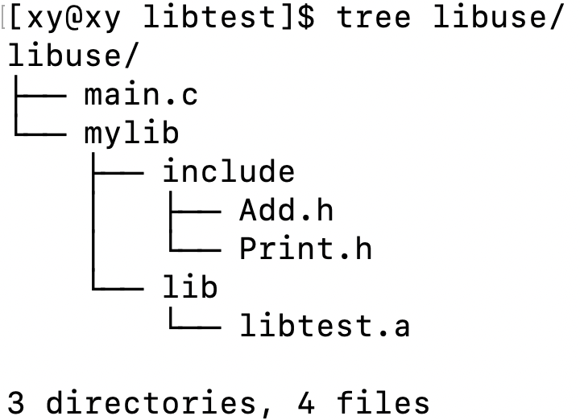
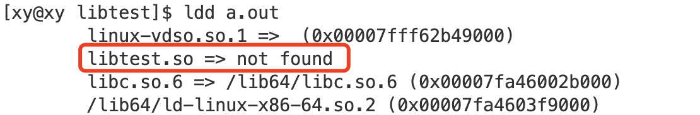
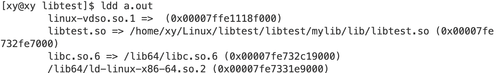
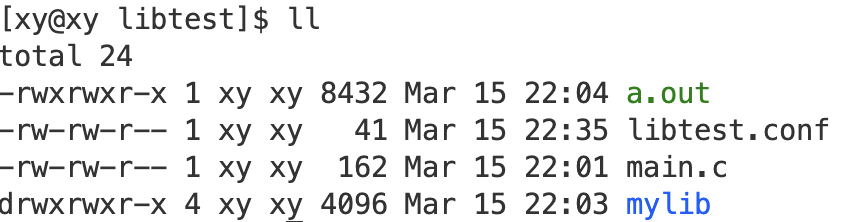

# 1. 背景

在实践中，我们一定会使用别人的库（不限于 C、C++的库），在实践中，我们会使用成熟、被广泛使用的第三方库，而不会花费很多时间自己造轮子，为了能更好地使用库，就要在学习阶段了解其本质。那么对于库而言，可以从两方面认识它：

1. 如果想自己写一个库呢？（编写者）
2. 别人应该如何使用我们写的库？（使用者）

作为 C、C++的使用者，应该知道它是一门编译型语言，一堆源文件（.cpp）和一堆头文件（.h）要合在一起才能生成一个可执行程序（.exe）：

1. 预处理： 头文件展开、去注释、宏替换、条件编译等，生成`.i`文件；
2. 编译： 词法分析、语法分析、语义分析、符号汇总等，检查无误后将代码翻译成汇编指令，生成`.s`文件。
3. 汇编： 将汇编指令转换成二进制指令，生成`.o`文件。
4. 链接： 将生成的各个`.o`文件进行链接，生成可执行程序（Windows：`.exe`，Linux：`.out`。

> 关于以上各类文件后缀的含义：
>
> - .o 文件是目标文件，它是源代码编译后生成的二进制文件。.o 是 object 的缩写，表示这个文件包含了目标代码，即机器语言代码。
> - .a 文件是静态库文件，它是由多个目标文件打包而成的。.a 是 archive 的缩写，表示这个文件是一个归档文件，包含了多个目标文件。
> - .so 文件是动态库文件，它也是由多个目标文件组成的。.so 是 shared object 的缩写，表示这个文件是一个共享对象，可以在程序运行时被载入。
> - .i 文件是预处理后的 C 或 C++源代码文件。预处理器会处理源代码中的宏定义、条件编译和头文件包含等指令，生成一个。i 文件，其中包含了预处理后的源代码。
> - .s 文件是汇编语言源代码文件。它包含了用汇编语言编写的程序代码，可以通过汇编器转换为机器语言代码。
> - .out 文件是可执行文件，它包含了可以直接在计算机上运行的机器语言代码。.out 是 output 的缩写，表示这个文件是编译器输出的结果。
> - .exe 文件是 Windows 操作系统下的可执行文件。它包含了可以直接在 Windows 操作系统上运行的机器语言代码。.exe 是 executable 的缩写，表示这个文件是可执行的。与。out 文件类似，.exe 文件也是编译器输出的结果，它可以直接在计算机上运行。不过，.exe 文件只能在 Windows 操作系统上运行，而不能在其他操作系统（如 Linux 或 macOS）上运行。

库中有`main`函数吗？下面会告诉你答案：


当有多个不同的源文件中的`main`函数调用这些功能函数时，每次都要重新对这几个函数重复预处理、编译、汇编操作，各自生成`.o`文件，然后再和调用功能函数的源文件（一般是 main 函数）生成的`.o`，最后才生成可执行程序。

这样会有很多重复的操作，所以一般将这些常用的函数所在的`.cpp`文件预处理、编译、汇编生成的多个`.o`文件打包在一起，称之为**库**。而事实上我们经常使用的`<stdio.h>`、`<iostream>`、使用各种 STL 容器包含的头文件都是这么做的。

由此可以见，==库的本质是若干个目标文件（.o 文件）的集合。==每个`.o`文件都包含了由源码编译生成的二进制代码，以供调用。

严格地说，库并不是可执行程序的半成品。库是一组预先编译好的目标文件（.o 文件）的集合，它们可以被链接到可执行程序中，以提供某些功能。库中的目标文件包含了机器语言代码，但它们并不能直接运行。要生成一个可执行程序，需要将库中的目标文件与其他目标文件（如含有 main 函数的目标文件）链接在一起，然后由链接器生成一个可执行文件。

> 编译型语言需要通过编译器将源代码转换为机器语言，然后才能在计算机上运行。编译器会将源代码翻译成计算机能够直接执行的机器语言，这样程序就可以直接运行，而不需要解释器。
>
> 编译型语言的优点是运行速度快，因为它们直接运行机器语言，而不需要经过解释器的解释。但是，编译型语言的缺点是开发过程中需要花费更多的时间进行编译。

# 2. 初识动静态库

用一个简单的例子初步了解动静态库：
```cpp
#include <stdio.h>
int main()
{
    printf("Hello World!\n");
    return 0;
}
```

其 Makefile：

```Makefile
mylib : mylib.c
	gcc -o $@ $^
.PHONY : clean
clean :
	rm -f mylib
```

编译生成可执行程序`mylib`。这个程序能够成功调用库函数 printf，归功于 gcc 编译器在生成可执行程序时，将 C 标准库也链接进可执行程序中。

通过指令`ldd filename`查看可执行程序依赖的库文件：

```shell
[xy@xy 3_14]$ ldd mylib
        linux-vdso.so.1 =>  (0x00007ffea9bfb000)
        libc.so.6 => /lib64/libc.so.6 (0x00007fc6231d9000)
        /lib64/ld-linux-x86-64.so.2 (0x00007fc6235a7000)
```

> `ldd` 是一个命令，它用于打印程序或库文件所依赖的共享库列表。它不是一个可执行程序，而只是一个 shell 脚本。

其中，`libc.so.6`就是这个可执行程序依赖的库文件，通过`ll`指令查看这个该路径下这个库文件的属性：


表明它其实是软链接到同目录下的`libc-2.17.so`文件，通过`file`指令，查看该文件的文件类型：


如果一个库文件是 shared object，那么它是一种特殊的目标文件，可以在程序运行时被加载（链接）进来。在 Linux 下，动态链接库（shared object file，共享对象文件）的文件后缀为 .so。使用动态链接库的优点是：程序的可执行文件更小，便于程序的模块化以及更新，同时，有效内存的使用效率更高。

也就是说：这个`libc-2.17.so`是一个动态库。

> 动静态库的后缀因平台而不同：
>
> - Linux ：`.so`：动态库；`.a`：静态库。
> - Windows ：`.dll`：动态库；`.lib`：静态库。

去掉前缀和后缀，剩下的就是库的名字。在这里，`libc.so.6`实际上是 C 语言的动态库，库名是`c`。

> libc.so.6 是 glibc 的软链接。glibc 是 GNU 发布的 libc 库，即 C 运行库。
>

默认情况下，gcc/g++ 采用动态链接的方式链接第三方库。例如，当你指定 `-lpng` 时，链接程序就会去找 `libpng.so`。不过，gcc/g++ 提供了一个 `-static` 参数，可以改变默认链接方式。如：

```shell
gcc -static mylib.c -o mylib-s
```


其中`mylib-s`是静态链接版本生成的可执行程序，可见，动态链接生成的可执行程序的大小比静态链接的小不少。

使用`ldd`指令试着查看它是否有依赖的其他库文件：
```shell
[xy@xy 3_14]$ ldd mylib-s
        not a dynamic executable
```

说明静态链接生成的可执行程序不依赖其他库文件，同样地，用`file`指令查看它的文件类型：


> 可能出现的错误：
>
> ```shell
> /usr/bin/ld: cannot find -lc collect2: error: ld returned 1 exit status
> ```
>
> 这个错误信息 `/usr/bin/ld: cannot find -lc` 表示链接器找不到 C 库，可以通过以下步骤解决（centos）：
>
> - 安装静态 C 库：
>
>   ```shell
>   sudo yum update
>   sudo yum install glibc-static
>   ```
>
> - 刷新数据库：
>
>   ```shell
>   updatedb
>   ```
>
> - 查看是否已经在系统上存在 libc.a 文件：
>
>   ```shell
>   locate libc.a
>   ```
>
>   如果打印：`/usr/lib64/libc.a`则说明安装成功，可继续执行 gcc 指令。

# 3. 静态库

以下面四个文件和一个 main.c 文件为例，演示其打包为库的过程。

`Add.h`：

```c
#pragma once

extern int Add(int a, int b);
```

`Add.c`：

```c
int Add(int a, int b)
{
    return a + b;
}
```

`Print.h`：

```c
#pragma once

extern void Print(const char* str);
```

`Print.c`：

```c
#include <stdio.h>

void Print(const char* str)
{
    printf("%s", str);
}
```

> `extern` 是 C 语言中的一个关键字，它可以置于变量或函数前，用来说明“此变量/函数是在别处定义的，要在此处引用”。它的作用是提示编译器遇到此变量或函数时，在其他模块中寻找其定义。

`main.c`：

```c
#include <stdio.h>
#include "Print.h"
#include "Add.h"
int main()
{
    int res = Add(1, 2);
    Print("Hello World!\n");
    printf("%d\n", res);
    return 0;
}
```

## 3.1 打包静态库

1. 首先需要将所有的`.c`源文件都编译为目标文件。

```shell
gcc -c Add.c
gcc -c Print.c
```

> `-c`选项告诉 gcc 只编译源代码，但不进行链接。这会生成一个目标文件（通常以`.o`结尾），该文件包含了编译后的代码，但还不能直接运行。你可以使用`-c`选项来编译多个源文件，然后再使用链接器将它们链接成一个可执行文件或共享库。

生成目标文件：

> 如果我们只把`.o`和`.h`文件给别人，别人能用吗？

再将`main.c`编译：
```shell
gcc main.c -c
```

然后，将 main.o 和其他。o 文件链接以后生成的文件就是可执行程序：
```shell
gcc Add.o Print.o main.o -o libtest.out
```

运行：


通过上面的例子我们知道，需要将生成的所有目标文件和 main.o 文件链接才能生成可执行程序，但是除了 main.o 之外的。o 文件都太分散了，用起来很麻烦（当然可以通过 Makefile 简化步骤），给别人使用也不太方便，还容易缺失，所以将它们打包。而将目标文件打包的结果就是一个静态库。

2. 使用`ar`指令将所有目标文件打包为静态库。

> `ar` 命令是 GNU Binutils 的一员，可以用来创建、修改静态库，也可以从静态库中提取单个模块。它可以将一个或多个指定的文件并入单个写成 `ar` 压缩文档格式的压缩文档文件。

常用参数：

- `-r`(replace)：若静态库文件当中的目标文件有更新，则用新的目标文件替换旧的目标文件。
- `-c`(create)：建立静态库文件。
- `-t`：列出静态库中的文件。
- `-v`(verbose)：显示详细的信息。

语法：`ar [选项] [库名] [依赖文件]`

例如，将`Add.o`和 `Print.o`打包：
```shell
ar -rc libtest.a Add.o Print.o
```

用`-t`和`-v`选项查看静态库中的文件及信息：
```shell
ar -tv libtest.a
```


3. 将打包成的静态库需要和头文件组织起来。

> 这是因为头文件包含了静态库中函数和变量的声明，而这些声明对于使用静态库的程序来说是必要的。如果没有头文件，编译器将无法确定如何使用静态库中的函数和变量。
>
> 头文件和函数的实现分离是为了提高代码的可维护性和可重用性。头文件中只包含函数和变量的声明，而不包含具体的实现。这样，当我们需要修改函数的实现时，只需要修改对应的源文件，而不需要修改头文件。同时，由于头文件只包含声明，因此可以被多个源文件共享。这样，当我们需要在多个源文件中使用同一个函数时，只需要在每个源文件中包含对应的头文件即可。

组织静态库和头文件的方法有很多种。一种常见的方法是将静态库文件（.a 文件）和头文件放在同一个目录下。在使用静态库时，需要在程序中包含对应的头文件，并在编译时指定静态库的位置。这样，编译器就能够找到静态库中的函数和变量，并将它们链接到程序中。

例如，将所有的头文件（.h）放在一个名为`include`的目录下，将生成的静态库文件（.a）放在一个名为`lib`的目录下。然后将这两个目录都放在名为`libtest`的目录下，这个`libtest`就可以作为一个第三方库被使用。

创建好目录以后，通过`tree`指令查看目录结构：


### Makefile 打包

make 指令既然可以执行编译和删除指令，自然也能执行打包目标文件生成静态库和组织头文件与库文件的指令。

```Makefile
libtest.a : Add.o Print.o # 静态库依赖的目标文件
	ar -rc libtest.a Add.o Print.o # 打包
Add.o : Add.c # .o 文件依赖的源文件
	gcc -c Add.c -o Add.o
Print.o : Print.c
	gcc -c Print.c -o Print.o

.PHONY : mylib # 组织头文件和库文件
mylib:
	mkdir -p mylib/lib
	mkdir -p mylib/include
	cp -rf *.h mylib/include
	cp -rf *.a mylib/lib

.PHONY : clean
clean : 
	rm -rf *.o mylib libtest.a
```

`make`：生成目标文件，然后打包生成静态库：


`make mylib`：组织静态库文件和头文件：


查看`mylib`的目录结构：


## 3.2 使用静态库

仍然使用一开始就写好的 main.c，让它和含有头文件、静态库文件的`libtest`共处同一目录`libuse`下才能调用库中写好的函数。


试着在该目录下直接编译 main.c：


这个错误说明 gcc 没有找到头文件对应的库文件，下面的操作是让 gcc 看到导入的第三方库。

使用打包好的静态库有三种方法：

- 将库文件放到系统路径下。
- 使用 `gcc -L` 选项指定链接库的搜索路径，例如 `gcc main.c -o main -L./ -lchild` 。
- 设置存放链接库时搜索路径的环境变量，将当前库文件所在的路径添加进去，例如 `export LIBRARY_PATH=$LIBRARY_PATH:.` 。

下面将介绍前两种方法。

### 拷贝到系统目录

- 系统库目录： `/usr/lib64` 或 `/usr/lib` ；
- 系统头文件目录：`/usr/include`。

将生成的静态库文件和头文件分别添加到系统目录下 ：

```shell
[xy@xy libuse]$ sudo cp mylib/include/* /usr/include
[xy@xy libuse]$ sudo cp mylib/lib/* /usr/lib
```

试着编译：


这是链接时错误，两个函数没有引用，说明编译器已经找到头文件了。

即使我们将头文件和库文件拷贝到系统目录下，但是 gcc 在编译 main.c 时，还需要显式地说明要链接的库在哪一路径下。通过`-l 库名`选项让 gcc 知道这是一个第三方库，而库名就是`libtest.a`去掉前缀和后缀剩下的部分，即`test`。

```shell
gcc main.c -ltest
```

> 这是因为 gcc 在默认路径下是链接 C/C++的库，它只知道哪些是内置的库，而不知道第三方库的存在。

运行程序：


但是将头文件和库文件添加到系统目录下是非常不推荐的，因为这样会污染系统库目录，而这就是安装库的过程。

### 指定库的路径

gcc 编译 main.c 链接库时，需要由以下三个选项定位文件：

1. `-I`：指定头文件搜索路径。
2. `-L`：指定库文件搜索路径。
3. `-l`：指明需要链接库文件路径下的哪一个库。

我们只要显式地给 gcc 指明第三方库的路径即可完成链接：
```shell
gcc main.c -I./mylib/include -L./mylib/lib -ltest
```

编译运行程序：


> 三个选项后，空格可加可不加。

这个 mylib 文件就相当于一个第三方库，只要调用了 include 里的头文件，就可以间接调用 lib 里已经被编译成二进制编码的函数。

静态库必须整个拷贝到可执行程序中，所以由静态库链接生成的可执行程序一般比动态库链接的大，这种程序采用的是绝对编址，它们在当前程序的进程地址空间中的地址是固定的。

# 4. 动态库

## 4.1 打包动态库

依然使用之前的四个文件和一个 main.c 文件示例。

1. 生成所有源文件对应的目标文件。

gcc 需要增加`-fPIC`选项 (position independent code)：位置无关码。

```shell
gcc -fPIC -c Add.c
gcc -fPIC -c Print.c
```


### 位置无关码

位置无关代码（Position Independent Code，PIC）是一种特殊的机器代码，它可以在内存中的任何位置运行，而不需要重新定位。这意味着，当程序被加载到内存中时，它的代码段可以被放置在任何可用的内存地址，而不需要修改代码中的任何地址引用。

这对于创建共享库（即动态库）非常有用，因为共享库可以被多个程序同时使用，而每个程序都可能将其加载到不同的内存地址。如果共享库中的代码不是位置无关的，那么每次加载时都需要对其进行重新定位，这会增加程序启动的时间和内存占用。

使用位置无关代码可以避免这些问题，因为它可以在内存中的任何位置运行，而不需要重新定位。这样，当多个程序使用同一个共享库时，它们都可以直接使用共享库中的代码，而不需要对其进行重新定位。这样可以节省大量的 RAM，因为共享库的代码节只需加载到内存一次，然后映射到许多进程的虚拟内存中。

和静态库采用的绝对编址相比，动态库采用的就是相对编址，各个模块在库中的地址可能不相同，但是它们之间的相对位置是固定的。就好像房车旅行一样，房车的位置虽然一直在变，但是房车内家具的相对位置一直不变。

位置无关代码对于 gcc 来说：

- `-fPIC`作用于编译阶段，告诉编译器产生与位置无关的代码，此时产生的代码中没有绝对地址，全部都使用相对地址，从而代码可以被加载器加载到内存的任意位置都可以正确的执行。这正是共享库所要求的，共享库被加载时，在内存的位置不是固定的。
- 如果不加`-fPIC`选项，则加载。so 文件的代码段时，代码段引用的数据对象需要重定位，重定位会修改代码段的内容，这就造成每个使用这个。so 文件代码段的进程在内核里都会生成这个。so 文件代码段的拷贝，并且每个拷贝都不一样，这样就和动态库一样占用内存了，具体取决于这个。so 文件代码段和数据段内存映射的位置。
- 不加`-fPIC`编译生成的。so 文件是要在加载时根据加载到的位置再次重定位的，因为它里面的代码 BBS 位置无关代码。如果该。so 文件被多个应用程序共同使用，那么它们必须每个程序维护一份。so 的代码副本 （因为。so 被每个程序加载的位置都不同，显然这些重定位后的代码也不同，当然不能共享）。
- 我们总是用`-fPIC`来生成。so，但从来不用`-fPIC`来生成。a。但是。so 一样可以不用`-fPIC`选项进行编译，只是这样的。so 必须要在加载到用户程序的地址空间时重定向所有表目。

2. 使用 gcc 的 `-shared` 选项将所有目标文件打包为一个动态库。

```shell
gcc -shared -o libtest.so Add.o Print.o
```


其中，在选项`-shared`后面的是要生成动态库的名称，在它之后是动态库依赖的目标文件。

通过指令`readelf -S`可以查看库的部分详细，如偏移量 offset ：


动态库使用相对地址，是由偏移量和某个参照点找到库的

3. 组织头文件和动态库文件。

同样地，将所有的头文件（.h）放在一个名为`include`的目录下，将生成的静态库文件（.a）放在一个名为`lib`的目录下。然后将这两个目录都放在名为`libtest`的目录下，这个`libtest`就可以作为一个第三方库被使用。


### 使用 Makefile 打包

将编译、打包等指令用 Makefile 保存。在这里，可以通过 Makefile 先后生成动静态库：
```Makefile
.PHONY:all
all:libtest.so

libtest.so:Print.o Add.o
	gcc -shared Print.o Add.o -o libtest.so
Print.o:Print.c
	gcc -c -fPIC Print.c -o Print.o
Add.o:Add.c
	gcc -c -fPIC Add.c -o Add.o

.PHONY:output
output:
	mkdir -p mylib/lib
	mkdir -p mylib/include
	cp -rf *.h mylib/include
	cp -rf *.so mylib/lib

.PHONY : clean
clean : 
	rm -rf *.o mylib *.a *.so output
```

此处将打包的操作命名为`output`。


## 4.2 动态库的使用

对于动态库，即使显式地提示 gcc main.c 中调用了第三方库中的函数，也会因为找不到库而编译错误。

例如，仍然使用 gcc 的三个选项说明编译 main.c 需要的库文件和头文件，以及应该链接哪个库。注意，此时的工作目录依然是：


```shell
gcc main.c -I./mylib/include -L./mylib/lib -ltest
```

这样就能生成可执行程序：


不同于静态库，这里动态库生成的可执行程序并不能运行。


通过`ldd`指令查看可执行程序依赖的动态库的信息：



发现`libtest.so => not found`，这说明系统无法找到动态库文件。

在 Linux 下，有以下几种使用第三方动态库的方法（解决以上问题）：

- 使用 ldconfig 指令；
- 设置 LD_LIBRARY_PATH 环境变量；
- 在编译时指定路径；
- 也可以使用 pkg-config 命令来导入第三方库文件。

在这里，主要介绍前三种方式。

### 拷贝到系统目录

类似静态库的操作：

```shell
sudo cp mylib/lib/libtest.so /lib64
```


现在这个动态库就被找到了。

> 但是，为什么只要将动态库的。so 文件拷贝到系统目录下，这个可执行程序就可以被链接到动态库呢？不应该重新编译链接一次吗？

在编译链接时，只需要记录需要链接文件的编号，==运行程序时==才会进行真正的“链接”，所以称为“动态链接”。因此，只要将动态库的。so 文件拷贝到系统目录下，这个可执行程序就可以被链接到动态库，而不需要重新编译链接。

也就是说，编译器只负责生成一个 main.c 对应的二进制编码文件，而链接的工作要等到运行程序时才会进行链接，所以生成可执行程序以后就没有编译器的事了。

缺点：同样地，将动态库的。so 文件拷贝到系统目录下也可能会污染系统库目录。

### 更改 LD_LIBRARY_PATH 环境变量

`LD_LIBRARY_PATH`是程序运行动态查找库时所要搜索的路径，我们只需将动态库所在的目录路径添加到`LD_LIBRARY_PATH`环境变量中，告诉系统程序依赖的动态库所在的路径：

```shell
export LD_LIBRARY_PATH=$LD_LIBRARY_PATH:/home/xy/Linux/libtest/libtest/mylib/lib
```


现在，程序也可以运行了。

`ldd`查看依赖库信息：



注意要用`:`隔开，否则会覆盖原来的环境变量。但是这个方法是临时的，因为这个环境变量是内存级别的环境变量，机器会在下次登录时清理。

### 使用 ldconfig 指令

/etc/ld.so.conf.d/目录下的文件用来指定动态库搜索路径。这些文件被包含在/etc/ld.so.conf 文件中，ldconfig 命令会在默认搜寻目录 (/lib 和/usr/lib) 以及动态库配置文件/etc/ld.so.conf 内所列的目录下，搜索可共享的动态链接库，并创建出动态装入程序 (ld.so) 所需的连接和缓存文件。

这些`.conf`文件中存储的都是各种文件的路径，只要将我们写的第三方库的路径保存在一个`.conf`文件中，程序运行时在就会通过它链接到它依赖的动态库。

1. 将路径存放在`.conf`文件中。

```shell
echo /home/xy/Linux/libtest/libtest/mylib/lib > libtest.conf
```

这样，当前目录下就会出现刚才创建的文件：



2. 将`.conf`文件拷贝到`/etc/ld.so.conf.d/`下。

```shell
sudo cp libtest.conf /etc/ld.so.conf.d/
```

`ldd`一下：

系统还是没有找到 a.out 依赖的动态库，原因是此时的系统的数据库还未更新，使用命令`ldconfig`更新配置文件：
```shell
sudo ldconfig
```

`ldd`一下：


成功链接，运行一下：


# 5. 补充

## 5.1 gcc 默认优先链接动态库

如果同时存在动态库和静态库文件，gcc 会优先链接动态库。如果你想强制 gcc 链接静态库，可以直接指定静态库的全称，或者使用`-static`选项。你也可以使用`-Bdynamic`和`-Bstatic`选项在命令行中切换首选项。

## 5.2 动态库可分批加载到内存

动态库在程序运行时才被加载，它和可执行文件是分开的，只是可执行文件在运行的某个时期调用了它。动态库可以实现进程之间资源共享，有一份就行。

可执行程序先加载，代码区的代码运行到动态库的方法时，可以先跳转到共享区，而共享区是保存了页表和动态库的映射关系的，所以使用完动态库的方法以后，再返回到代码区继续执行即可。由此可见，静态库是在可执行程序自己的进程地址空间中跳转的。

## 5.3 动静态库的区别

静态库和动态库的最大区别是，静态库链接的时候把库直接加载到程序中（也就是直接拷贝一整份库），而动态库链接的时候，它只是保留接口，将动态库与程序代码独立。这样就可以提高代码的可复用度和降低程序的耦合度。动态库相对于静态库有便于更新拓展、减小体积等诸多优势。

但这不意味着静态库是一无是处的。

当你更希望简单易用，尽量免除后顾之忧，那就首选静态（隐式）连接。静态库在链接时就和可执行文件在一块了，因此，对于同样的程序，静态链接的要比动态链接==加载更快==。所以选择静态库还是动态库是空间和时间的考量。但是通常来说，牺牲这点性能来换取程序在空间上的节省和部署的灵活性时值得的。

## 5.4 动态库的原理

堆栈相向而生，在它们之间有一个区域，是共享内存所属的位置，叫做共享区。当动态库被磁盘加载到内存，动态库中的地址采用的是与位置无关的地址，即相对地址。相对地址能使得进程通过和某个基准地址的偏移量找到代码的对应位置，因此动态库可以被分批加载。

当动态库被加载到内存，然后经过页表映射到各个进程对应的地址空间时，可能被映射到了不同于地址空间的区域，但这不重要，因为它使用的是偏移量。因为程序在链接是，基准值是库加载到内存空间中的起始地址，而记录的是自己要调用的函数在库中的偏移量，用不同函数对应的偏移量即可找到对应函数。

## 5.5 动态库的意义

动态库把对一些库函数的链接载入推迟到程序运行的时期，可以实现进程之间的资源共享，将一些程序升级变得简单。库是别人写好的现有的、成熟的、可以复用的代码，用户可以按照说明使用库。现实中每个程序都要依赖很多基础的底层库，不可能每个人的代码都从零开始，因此库的存在意义非同寻常。

可以减少代码冗余，只需要一份即可。分批加载后，只要建立相对地址关系即可。如果有很多个进程都要用同一个库，只要建立映射关系即可。只要加载一次，就可以在内存中被多份代码复用。
