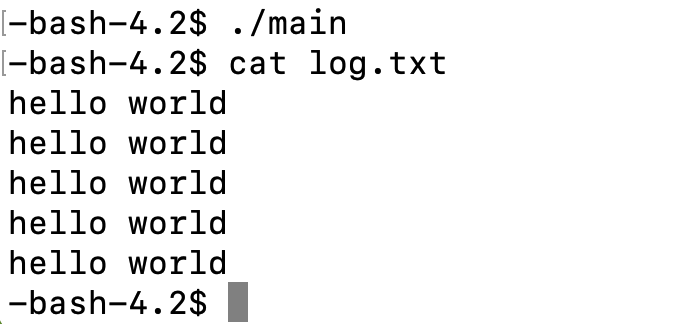
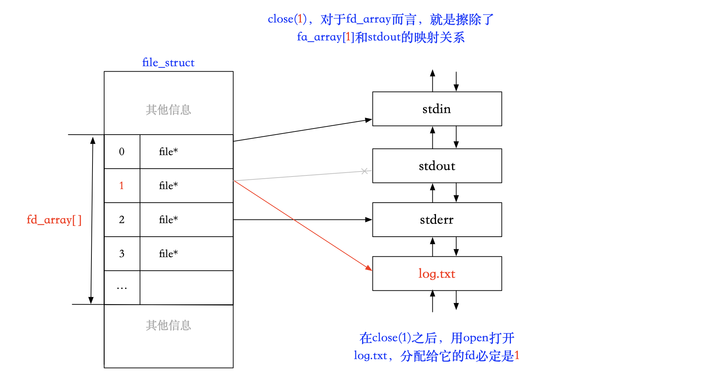
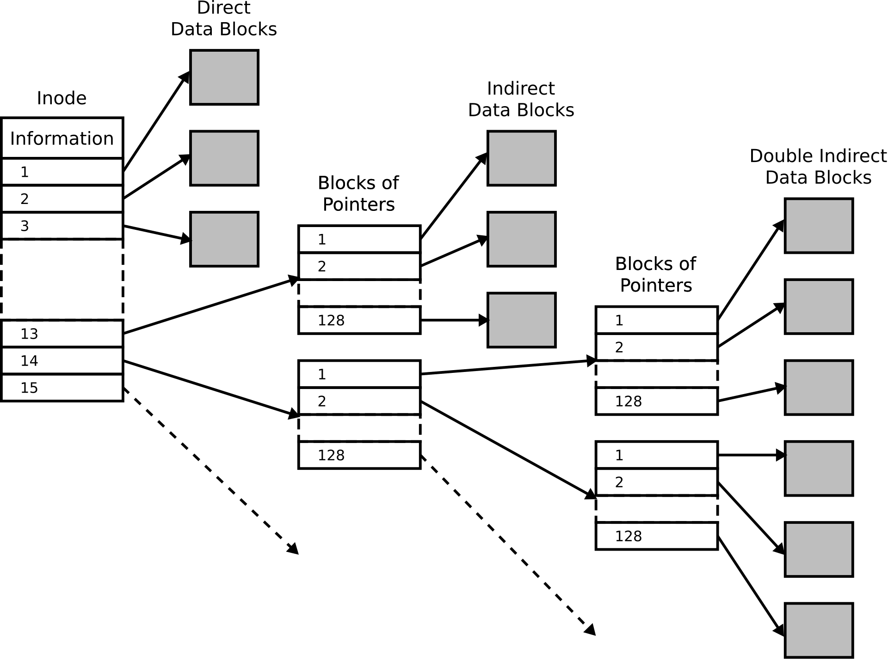

## 前言

Linux 下一切皆文件，这个文件可以是我们通常认为的文件，也可以是任何硬件。而文件并不仅指文件内容本身，还有它的属性（大小、创建日期等），这些都是数据。由此可见，文件的所有操作，不仅包括对文件内容的操作，而且包含对文件属性的操作。

对于储存在磁盘上的文件，我们要访问它，首先要写访问文件的代码，然后编译生成可执行程序，运行它以后才能访问文件。那么，访问文件的直接主体是进程。

磁盘是作为硬件存在的，所以只有操作系统才有权限对它读写，作为上层用户，是没有办法直接访问的。所以 OS 必须要提供相应的软件层的文件类系统调用接口，这样不论是 C、C++、Java 等不同的语言，都能通过封装 OS 开放的接口作为自己语言的文件操作接口。

由于历史原因，Linux 是由 C 语言写的，所以开放的接口也是 C 语言函数，这也侧面说明了 C 语言的重要性，而且许多编程语言都是由 C、C++封装而来的。不同的语言有不同的封装，由不同的文件操作接口，但是它们的底层都是封装的系统接口。

---

> 为什么要学习操作系统层面的文件接口？

- 因为这样的接口只有一套，为什么？
  - 因为 OS 只有一个

> Linux 和 Windows 的接口相同吗？使用语言的用户，要不要访问文件呢？

- 不相同；要。一旦使用系统接口，编写操作文件的代码，就无法再其他不同的平台下运行，不具备跨平台性。所以要使用语言级别的接口，因为它封装了 OS 开放的接口。

> 为什么编译型语言要依赖库？换句话说，C 语言是如何保证跨平台性的？

- C 语言简单粗暴地把所有平台的代码都实现一遍，（通过条件编译）在不同的系统下使用不同版本的接口（代码）。

> 如果语言不提供对文件的系统接口封装，所有访问文件的操作，都必须使用操作系统给的接口。

---

Linux 认为一切皆文件：

- 对于文件而言（不考虑属性，是曾经理解的文件）：读和写；
- 显示器：打印，相当于程序向显示器写入；
- 键盘：程序从键盘读取。

以上是站在程序的角度看的，而程序被加载到内存成为进程才能进行操作，所以是站在内存的角度看待的。显示器就是 output，键盘就是 input。通过冯诺依曼体系：软件的行为转化为硬件的行为。

至此，重新认识「文件」：

- 系统角度：能够被 input 读取，或者能 output 写出的设备就叫文件；
- 狭义：普通的磁盘文件；
- 广义：磁盘、显示器、键盘、网卡、声卡等几乎所有外设。

> 什么叫 I/O？
>
> **I/O**（英语：**I**nput/**O**utput），即**输入／输出**，通常指数据在存储器（内部和外部）或其他周边设备之间的输入和输出，是信息处理系统（例如电脑）与外部世界（可能是人类或另一信息处理系统）之间的通信。

##  1. C 语言文件 I/O

###  1.1 回顾

关于 C 语言的文件操作接口，可以移步：[文件操作](https://blog.csdn.net/m0_63312733/article/details/123925412?spm=1001.2014.3001.5502)

首先给出 fopen 的原型：

```cpp
FILE * fopen ( const char * filename, const char * mode );
```

filename 是要打开的文件名，mode 的打开文件要做什么。

打开方式 (mode)：

| 文件使用方式  |                   含义                   | 如果该文件不存在 |
| :-----------: | :--------------------------------------: | :--------------: |
|  “r”（只读）  | 为了输入数据，打开一个已经存在的文本文件 |       出错       |
|  “w”（只写）  |      为了输出数据，打开一个文本文件      |     新建文件     |
|  “a”（追加）  |           向文本文件尾添加数据           |     新建文件     |
| “rb”（只读）  |     为了输入数据，打开一个二进制文件     |       出错       |
| “wb”（只写）  |     为了输出数据，打开一个二进制文件     |     新建文件     |
| “ab”（追加）  |        向一个二进制文件尾添加数据        |       出错       |
| “r+”（读写）  |       为了读和写，打开一个文本文件       |       出错       |
| “w+”（读写）  |      为了读和写，新建 一个新的文件       |     新建文件     |
| “a+”（读写）  |      打开一个文件，在文件尾进行读写      |     新建文件     |
| “rb+”（读写） |       为了读和写打开一个二进制文件       |       出错       |
| “wb+”（读写） |    为了读和写，新建一个新的二进制文件    |     新建文件     |
| “ab+”（读写） |  打开一个二进制文件，在文件尾进行读和写  |     新建文件     |

> 重要的是前 6 个，最重要的是前三个

我们知道，如果使用 fopen 函数以"w"的方式打开一个文件，如果文件不存在会在<mark>当前路径</mark>下创建文件。那么<mark>当前路径</mark>是哪个路径呢？


所以当前路径不是可执行程序所在的路径，而是执行可执行程序时，进程所处的路径。文末的「软硬链接」会解释它。

由于 C 语言的文件 I/O 接口众多，下面仅用最常使用的两个接口示例。

### 1.2 fwrite 写入

对文件写入数据示例：

```cpp
#include <stdio.h>
#include <string.h>
int main()
{
    FILE* fp = fopen("log.txt", "w");//创建 log.txt 新文件
    if(fp == NULL) //
    {
        perror("fopen");
        return 1;
    }
    int count = 5;
    const char* text = "hello world\n";
    while(count--)
    {
        fwrite(text, strlen(text), 1, fp);
    }
    close(fp);
    return 0;
}
```

运行程序，默认在当前目录下创建文件 log.txt，并通过 fwirte 函数写入字符串。


> 写入上面这个字符串，要把、0 也写到 log.txt 中吗？
>
> - 不。因为、0 是语言的特性，文件不需要遵守，文件值存储有效数据。所以 strlen() 不要+1，strlen() 的长度不包含、0。
>
> 注：w，是先清空后再写入。清空是在打开的时候，写入数据之前就已经被清空了。

### 1.3 fgets 按行读取

读取文件数据示例：

```cpp
#include <stdio.h>
int main()
{
    FILE* fp = fopen("log.txt", "r");
    if(fp == NULL)
    {
        perror("fopen");
        return 1;
    }

    char line[64];
    while(fgets(line, sizeof(line), fp) != NULL)
    {
        printf("%s", line);
    }
    fclose(fp);
    return 0;
}
```


### 1.4 C 默认打开的三个流

在「前言」中，重新认识了文件。计算机能获取我们从键盘敲下的字符，是因为键盘对“键盘文件”进行了数据写入，计算机从“键盘文件”中读取了写入的数据；显示器同理。

> 既然都是文件，那么为什么上面示例的时候，我们要先用 fopen 打开一个文件，才能写入和读取文件，最后还要用 fclose 关闭文件呢？而键盘显示器这些文件，为什么不需要打开和关闭操作呢？

首先我们可以猜测，显示器键盘这些文件，和上面像 log.txt 这样的文件的级别是不同的。其实，Linux 下一切皆文件，也就是 C 语言下一切皆文件，因为 Linux 是 C 写的。C 语言的程序一旦被加载到内存，以进程的形式运行起来以后，有三个文件会被默认打开，以便键盘和屏幕的访问。

这三个文件我们称之为「流」（stream），在 C 语言中，分别是 stdin（标准输入）、stdout（标准输出）、stderr（标准错误）。

通过 man 手册查看：

```shell
man stdout
```


需要注意的是：

- 这三个东西都是`FILE*`类型的。在上面 fgets 的示例中，由一个参数就是 stdout，它 q 是一个指针，指向了标准输出，也就是显示器文件。
- 与 FILE 有关的接口，都是由 C 标准库（std）维护的，它不属于操作系统，但是它封装了操作系统开放的文件 I/O 接口。

> 在 C++中，分别是 cin、cout、cerr。这种特性是由操作系统决定的，所有语言都有类似的概念。

## 2. 系统文件 I/O

实际上，C 语言的标准库文件 I/O 接口是封装系统文件的 I/O 接口的，这我们很容易理解。不仅是为了使用方法符合语言的特性（系统接口往往是偏复杂的），保证系统的安全，也要保证语言本身具有跨平台性（C 语言根据系统，封装了不同版本的接口，Linux、Windows...）。

### 2.1 open

通过 man 手册查看，`man 2 open`：


在本文只看 open，忽略 create()。下面主要针对 open() 的三个参数和返回值进行阐述。

> 请注意系统接口 open 的头文件，等下可能会用到。

#### 参数 pathname

- 要打开或创建的目标文件。

  - 给路径：在该路径下创建文件；

  - 给文件名：在当前路径下进行创建（请明确「当前路径」的含义）。

#### 参数 flags

- 打开文件的方式。

常用选项：

| 参数选项 |             含义             |
| :------: | :--------------------------: |
| O_RDONLY |     以只读的方式打开文件     |
| O_WRNOLY |     以只写的方式打开文件     |
| O_APPEND |     以追加的方式打开文件     |
|  O_RDWR  |     以读写的方式打开文件     |
| O_CREAT  | 当目标文件不存在时，创建文件 |

> 注意：宏通常可以见名知意，例如 O_RDONLY，就是 read only。

##### 拓展

> 如果在 man 手册往下翻，会发现很多这些选项，它们都是宏，为什么要有这么多宏呢？

试想一个场景，如果我想打开一个文件，不知道这个文件是否存在，那么就需要传入参数`O_CREAT`创建它；如果我也要读和写的方式打开，用参数`O_RDWR`；如果还不想覆盖原来的，就在文件数据末尾追加，就要用参数`O_APPEND`。这样就要传入好多次（个）参数，于是大佬使用了宏来代替多次传入参数。

> 原因：读、写、创建、追加。.. 这些状态都可以用“是”或“否”来表示，那么对于计算机，我们就可以用 0 和 1 表示状态。那么如何将它们组合呢？
>
> 我们知道，int 类型有 32 个比特位，理论上就是 32 个状态位（标志位）！用`|`或操作就能将不同位的二进制数字组合。和这样类似的操作我们在用 status 变量获取子进程状态时也接触过，IP 地址也由不同区间的二进制位组合而成的。.....

在/usr/include/bits 路径下，可以找到`fcntl-linux.h`头文件，这里面有表中定义的宏：


如果你往下翻，可以发现，这些宏的二进制位都在 32 位比特位中的不同位置，所以才能通过或运算将这些标志位组合。

动手试试：用 open 以只读的方式打开一个文件（暂时忽略 fd，后面会解释）：

```cpp
#include <stdio.h>
#include <unistd.h>
#include <string.h>
#include <sys/types.h>
#include <sys/stat.h>
#include <fcntl.h>
int main()
{
  int fd = open("log.txt", O_WRONLY); // 以只读形式打开文件
  if(fd < 0) // 打开文件失败
  {
    perror("open");
    return 1;
  }

  // 打开文件成功
  printf("open success, fd: %d\n", fd);
  close(fd);
  return 0;
}
```


在 C 语言中，我们只需要给 fopen 传一个“r”, 底层封装的 open 其实是这样：

```cpp
int fd = open("log.txt", O_WRONLY | O_CREAT); // 以只读形式打开文件
```


这样就成功创建了。

#### mode 参数

- 创建文件的默认权限。

如果不传入第三个参数，那么默认文件访问权限就是只读的，就如上面创建的 log.txt 一样：


文件权限：


如果不传入 mode 参数，创建出来的文件对其他用户是不可读写的。

mode 参数就是文件默认权限，以 8 进制位的形式传入，例如：

```cpp
int fd = open("log.txt", O_WRONLY | O_CREAT, 0666);
```

这也是 C 语言的 fopen 时，传入"w"选项的原理。

删掉刚才创建的文件，然后运行：


然而，权限并不是我们想象的那样（rw-rw-rw-），原因是创建出来的文件会受到 umask（默认文件掩码，默认值是 0002）的影响，最后文件的权限为：mode&(\~umask)，那么就是 0666&(~0002)=0664。

> 关于文件权限和 umask，可以移步：[文件权限](https://blog.csdn.net/m0_63312733/article/details/126283392?spm=1001.2014.3001.5501#t71)，[umask](https://blog.csdn.net/m0_63312733/article/details/126283392?spm=1001.2014.3001.5501#t84)

要避免 umask 的影响，就要在创建文件之前用 umask 函数将默认文件掩码设置为 0：

```cpp
umask(0);
int fd = open("log.txt", O_WRONLY | O_CREAT, 0666); // 以只读形式打开文件
```

同样，要看到测试的情况，要删掉刚才创建的 log.txt：


注意：

open 的第三个参数只有需要创建文件的情况下才会使用，也就是有`O_CREAT`选项的时候。

#### 返回值

- 成功：返回新打开文件的文件描述符；
- 失败：返回-1。

上面的例子中，open 的返回值 fd 是 3，那么如果多打开几次文件呢？

```cpp
#include <stdio.h>
#include <unistd.h>
#include <sys/types.h>
#include <sys/stat.h>
#include <fcntl.h>
int main()
{
	umask(0);
	int fd1 = open("log1.txt", O_RDONLY | O_CREAT, 0666);
	int fd2 = open("log2.txt", O_RDONLY | O_CREAT, 0666);
	int fd3 = open("log3.txt", O_RDONLY | O_CREAT, 0666);
    if(fd1 == -1 || fd2 == -1 || fd3 == -1)
    {
        perror("open");
    }
  	printf("fd1:%d\n", fd1);
	printf("fd2:%d\n", fd2);
	printf("fd3:%d\n", fd3);
	return 0;
}
```


可以看到，当前目录下不仅多了几个新增的文件，而且 fd 是从 3 开始递增的，0/1/2 去哪了？

### 2.2 read

```cpp
#include <stdio.h>
#include <string.h>
#include <sys/types.h>
#include <sys/stat.h>
#include <stdlib.h>
#include <fcntl.h>
int main()
{
    umask(0);

    int fd = open("log.txt", O_RDONLY);
    if(fd < 0) // 打开失败
    {
        perror("open");
        return 1;
    }
    printf("open succsee, fd:%d\n", fd);

    char buffer[64];
    memset(buffer, '\0', sizeof(buffer));
    read(fd, buffer, sizeof(buffer));
    printf("%s\n", buffer);
    close(fd);
    return 0;
}
```


## 3. 文件描述符

open（成功）的返回值是文件描述符，通过示例可以知道，文件描述符是一个整数，而且总是从 3 开始的，为什么呢？

### 3.1 概念

文件描述符（File descriptor，以下简称 fd）在形式上是一个非负整数。实际上，它是一个索引值，指向 [内核](https://zh.wikipedia.org/wiki/内核）为每一个 [进程](https://zh.wikipedia.org/wiki/进程)所维护的该进程打开文件的记录表。当程序打开一个现有文件或者创建一个新文件时，内核向进程返回一个文件描述符。

之前在学习进程时，一个中心思想使得我们能够理解 OS 的行为：「先描述后组织」。（我们通常认为的文件）是被进程加载到内存中的，而一个进程可以打开多个文件，系统中多个进程又指向着不同的文件，造成了整个操作系统中有许多被打开的文件。

这么多打开的文件，必定是要管理它们的，方式和 OS 管理进程类似：OS 会给每个被打开的文件创建它们的结构体`file struct`，它储存着文件的各种信息。然后用双向链表把这些`file struct`链接起来。那么 OS 对文件的管理变成了对这个双向链表的增删查改。不过这样还不足以管理文件的所属关系，毕竟文件可不想进程一样只（直接）属于 OS 一个对象，不同的进程有着自己的文件。

> 那么，进程和文件之间的映射关系是如何建立的？

### 3.2 作用

在进程部分的学习中，我们知道，当进程开始运行时，OS 会将程序的数据加载到内存中，创建属于它的`task_struct`、`mm_struct`、页表等数据结构，而建立虚拟内存和物理内存之间的映射是页表。那么对于进程和文件而言，也是类似的方式，只不过不是页表，<mark>而是一个存在于`file_struc`t 结构体中的一个指针数组，数组的下标就是文件描述符。</mark>

首先简要地说明一下这些结构体之间的关系（从进程到文件）：`task_struct`结构体保存着进程的数据，而`task_struc`t 中保存着另一个结构体的地址，名为`file_struct`，保存着文件的数据。而这个`file_struct`中有一个指针数组`fd_array`，<mark>文件描述符的本质是指针数组的下标。</mark>

> 文件描述符作为数组下标，它的作用是什么呢？

当打开一个文件时，文件会被进程从磁盘加载到内存中，OS 会给他创建`file_struct`，链入文件管理的双链表中。然后将`file_struct`的地址放在`fd_array`中下标为 3 的位置。此时 fd_array[3] 就会指向该文件的`file struct`，然后返回数组下标也就是文件描述符给进程。

> 为什么新打开一个文件，放置的下标是 3 而不是 0？

这是本节的重点：创建进程时，`file_struct`也会被创建。对于 C 语言来说：一旦进程被创建，就会有 3 个流默认被打开着，分别是标准输出、标准输入和标准错误。这是在语言层面上的体现，由此可以推测，底层的操作系统中，fd_array 的前三个位置也和它们有关，而且也可以推测，C 语言是封装了这个指针数组的。

对于语言，我们说进程创建时默认打开了 3 个流，那么对于 OS 来说，创建进程时就是将进程的 task_struct 指向的 file_struct 中的 fd_array[0]、fd_array[1] 和 fd_array[2] 给占了，怎么占的呢？

Linux 下一切皆文件，我们知道，OS 会将各种接入计算机的硬件看作文件，那么要管它们，给它们创建对应的 file_struct 必不可少，fd_array[0]、fd_array[1] 和 fd_array[2] 分别储存着输入设备、输出设备的 file_struct 的地址。它们分别对应上层的输入、输出、错误流，对应底层的（设备）键盘、显示器等输入输出硬件。

> 文件描述符和 FILE 之间的关系？
>
> - 文件描述符是系统调用的返回值，它的本质是指针数组的下标；
> - FILE 是 C 语言的一个结构体，它是 C 标准库提供的，其中包含了文件的各种信息，底层是封装了文件描述符的。
>
> 在底层的 OS 角度，只有文件描述符才是文件的“身份证”。

用代码验证一下：

```cpp
#include <stdio.h>
#include <unistd.h>
#include <sys/types.h>
#include <sys/stat.h>
#include <fcntl.h>
int main()
{
    printf("stdin, %d\n", stdin->_fileno);
    printf("stdout, %d\n", stdout->_fileno);
    printf("stderr, %d\n", stderr->_fileno);
    return 0;
} 
```


因为 stdin、stdout 和 stderr 都是 C 语言的结构体指针，所以可以访问结构体成员。其中_fileno 就是封装了文件描述符的成员。

### 3.3 分配规则

在看了 2.1 中的示例和上面的阐述后，不难知道为什么用 open 打开文件后的返回值是从 3 递增的整数。

你有注意到吗？open 和 close 是如何建立联系的（我的意思是，open 一个文件以后，close 怎么知道刚才打开的是哪个文件）？从 2.1 的示例中可以知道，close 的参数是 open 的返回值，也就是指针数组的下标。

> 那么，可以关闭 fd=0/1/2 的文件吗？

- 可以。但是不要关闭 fd=1 的文件，因为它对应着输出设备的文件，否则就看不到<mark>显示器显示的</mark>结果了。

例如，就 2.1 的代码，可以用 close 把 fd=0/2 的文件关掉，然后再打开一个其他文件，看看 fd 的情况：

```cpp
#include <stdio.h>
#include <unistd.h>
#include <sys/types.h>
#include <sys/stat.h>
#include <fcntl.h>
int main()
{
    close(0); // 关闭标准输入
    close(2); // 关闭标准错误
	umask(0);
	int fd1 = open("log1.txt", O_RDONLY | O_CREAT, 0666);
	int fd2 = open("log2.txt", O_RDONLY | O_CREAT, 0666);
	int fd3 = open("log3.txt", O_RDONLY | O_CREAT, 0666);
    if(fd1 == -1 || fd2 == -1 || fd3 == -1)
    {
        perror("open");
    }
  	printf("fd1:%d\n", fd1);
	printf("fd2:%d\n", fd2);
	printf("fd3:%d\n", fd3);
	return 0;
}
```


从结果来看，在最开始关闭了下标为 0 和 2，后来打开的文件的信息把这几个位置都填上了。

规则：文件描述符将空的位置填完以后，才会往后递增。

以图示理解进程时如何管理文件的：


## 4. 重定向

### 4.1 概念

总之就是一句话：数据本来要写入到 A 文件中，却被写到了 B 文件中。例如，在学习 Linux 基本操作时，就有这样的重定向操作：

```shell
echo 重定向测试 > test.txt
```


### 4.2 重定向的原理

#### 输出重定向示例

在理解了文件操作符的作用和分配规则以后，理解重定向的原理也就不难了。

<mark>重定向的本质是修改下标为 fd 的数组元素的指向。</mark>

首先来看，如果关掉了 fd=1（标准输出）的文件后，会发生什么？

```cpp
#include <stdio.h>
#include <unistd.h>
#include <sys/types.h>
#include <sys/stat.h>
#include <fcntl.h>
int main()
{
	close(1);
	int fd = open("log.txt", O_WRONLY | O_CREAT, 0666);
	if (fd < 0)
    {
		perror("open");
		return 1;
	}
    
	printf("hello world\n");
	
	close(fd);
	return 0;
}

```


#### 原理

对代码的解读：

> C 语言的 printf 函数默认往 stdout 这个文件中打印。而 stdout 是一个 FILE *类型的结构体指针，它成员变量_fileno 默认设置为 1，也就是也就是 C 标准库设置好了 stdout->\_fileno 和 fd=1 之间的映射关系。既然 fd=0、1、2 是被占用的，那么 close(1)，下一次分配的一定是 1。打开 log.txt，log.txt 的 fd 就是 1，而 C 标准库只会认 fd，不会认名字。此时在 C 标准库看来，stdout 就是 log.txt。

上面的程序想把打印的内容重定向到 log.txt 中，但是 cat 它却无内容，为什么呢？

> 此处和 C 标准库维护的缓冲区有关，后面会介绍。现在试试吧 close 语句关掉？

```cpp
//close(fd); 注释掉 close 语句
```



这样就完成了重定向，不过有点“歪门邪道”，下面用一种“正统”的方法实现重定向，同样是上面的代码，close 取消注释，然后再它之前添加：

```cpp
fflush(stdout);
close(fd);
```


结果同样可以实现数据的重定向。

> fflush 是 C 语言的函数，它的作用是将缓冲区的内容强制刷新到指定的三个文件中，在这里是 stdout。C 标准库维护的缓冲区，稍后也会着重介绍。

在本小节中，最重要的是理解重定向的原理。在语言层面，fd 和 stdout、stdin、stderr 是绑定的，而且对于 OS 而言，它只认 fd，不认名字。所以如果在某个进程中使用系统调用 close 掉 fd=1，新打开的文件 log.txt 的 fd 必定是 1。那么从语言的映射关系来看，log.txt 就是 stdout。

用图示理解重定向的过程：



从图示可以知道，输出重定向就是打开一个文件的同时，OS 在内核中创建一个 file 对象，让进程的 fd_array[1] 重新指向打开文件的 file 对象。

#### 追加重定向

上面的输出重定向如果测试几次，会发现它和 C 语言以"w"形式使用 fopen 打开文件一样，每次都是先清空然后再输入，如何实现追加重定向呢？

很简单，在 open 的第二个参数中加上 O_APPEND：

```cpp
int fd = open("log.txt", O_WRONLY|O_APPEND|O_CREAT, 0666);
```

#### 输入重定向

和输出重定向的原理类似，都是修改 fd_array[] 元素的指向。对于 C 语言，输入是从 stdin 读取的数据，所以要修改的下标 fd=0。

```cpp
#include <stdio.h>
#include <unistd.h>
#include <sys/types.h>
#include <sys/stat.h>
#include <fcntl.h>
int main()
{
	close(0);
	int fd = open("log.txt", O_RDONLY | O_CREAT, 0666);
	if (fd < 0)
    {
		perror("open");
		return 1;
	}
	char buffer[64];
	while (scanf("%s", buffer))
    {
		printf("%s\n", buffer);
	}
	close(fd);
	return 0;
}

```


使用系统调用 close(0)，关闭 stdin 标准输入文件，对这个程序而言，就是把键盘文件关闭了。运行程序，C 语言函数 scanf 把 log.txt 中的数据都读取出来了。

> C 语言中，scanf 函数默认从 stdin 读取文件，所以使用它传参时不需要加上 stdin，printf 也是一样的：
>
> ```cpp
> #include <stdio.h>
> int main()
> {
>     int i = 0;
>     scanf("%d", &i, stdin);
>     printf("%d\n", i, stdout);                                                    
>     return 0;
> }
> ```
>
> 

#### 补充

对于 stdout 和 stderr，都是对应的显示器，它们的区别在于：

- 当只进行打印输出时，它们没有区别；

- 当我们进行重定向操作时，只会把本来要输出到 stdout 的内容重定向。

和 printf 和 scanf 对应，perror 默认输出到 stderr 中：

```cpp
#include <stdio.h>
int main()
{
    printf("stdout printf\n");                                                    
    perror("stderr perror");

    fprintf(stdout, "stdout fprintf\n");
    fprintf(stderr, "stderr fprintf\n");
    return 0;    
} 
```


> fprintf 是 C 语言文件操作的函数，是专门用于在文件中输出字符串内容的，但是也可以指定它输出的文件。（stdout 和 stderr 也是文件）。
>
> perror 是 C 语言函数，如果打印成功，会提示`:Success`。

它们都会被打印出来，但是如果想让打印出来的语句重定向到一个文件，比如 log.txt 中：

```cpp
./main > log.txt
```


结果表明，重定向操作不会把本来要输出到 stderr 文件中的数据输出到 log.txt，只会对 stdout 文件操作。

## 5. dup2

在系统调用中，dup2 封装了类似上面示例中的操作，仅需要传入两个新旧文件描述符，就能完成重定向操作。

### 5.1 介绍

使用 man 手册查看系统调用 dup2 的介绍：

```shell
man 2 dup
```

或：

```cpp
man 2 dup2
```


#### 原型

```cpp
int dup2(int oldfd, int newfd);
```

#### 功能

- dup2 会将 fd_array[oldfd] 的内容拷贝到 fd_array[newfd] 中。

#### 返回值

- 调用拷贝成功：返回 newfd；
- 失败：返回-1。

#### 注意事项

1. 如果 oldfd 不是有效的文件描述符，则 dup2 调用失败，并且此时文件描述符为 newfd 的文件没有被关闭；
2. 如果 oldfd 是一个有效的文件描述符，但是 newfd 和 oldfd 具有相同的值，则 dup2 不做任何操作，并返回 newfd。

#### 示例

打开一个文件 log.txt，用 fd 变量保存文件的文件描述符，然后 close(1)，关闭 stdout 文件，使用 dup2 实现 stdout 数据到文件 log.txt 的重定向。

```cpp
#include <stdio.h>                                                              
#include <unistd.h>
#include <sys/types.h>
#include <sys/stat.h>
#include <fcntl.h>
int main()
{
    int fd = open("log.txt", O_WRONLY | O_CREAT, 0666);
    if(fd < 0)
    {
        perror("open");
        return 1;
    }
    close(1); // 关闭 stdout 文件
    dup2(fd, 1); // 将数据重定向到 log.txt 中
    printf("hello, world <- printf\n");
    return 0;
}
```


printf 默认向 stdout 输出，在使用 dup2 重定向后，本应该在显示器上输出的数据被写到了文件 log.txt 中。

当然，使用 fprintf 指定输出文件是 stdout 结果也是一样的，在 printf 语句后再加上：

```cpp
fprintf(stdout, "hello, world <- fprintf\n");
```


## 6. C 标准库中的 FILE 结构体

从重定向的原理和示例可以知道，尽管 C 标准库中定义 stdin、stdout 和 stderr 是 FILE 结构体指针，但因为语言层是封装系统调用的，所以 stdin、stdout 和 stderr 这些，只是语言中给文件描述符起的名字。实际上系统只认识文件描述符 fd，即 fd_array[] 的下标。

正因如此，C 语言标准库定义的 FILE 结构体内部一定封装了等价于文件描述符的成员。

### 6.1 FILE 中的_fileno

在`/usr/include/libio.h`头文件中，可以查看`struct _IO_FILE`结构体的定义 (line:246)：

```cpp
struct _IO_FILE {
    int _flags;   /* High-order word is _IO_MAGIC; rest is flags. */
    #define _IO_file_flags _flags

    /* The following pointers correspond to the C++ streambuf protocol. */
    /* Note:  Tk uses the _IO_read_ptr and _IO_read_end fields directly. */
    char* _IO_read_ptr; /* Current read pointer */
    char* _IO_read_end; /* End of get area. */
    char* _IO_read_base;  /* Start of putback+get area. */
    char* _IO_write_base; /* Start of put area. */
    char* _IO_write_ptr;  /* Current put pointer. */
    char* _IO_write_end;  /* End of put area. */
    char* _IO_buf_base; /* Start of reserve area. */
    char* _IO_buf_end;  /* End of reserve area. */
    /* The following fields are used to support backing up and undo. */
    char *_IO_save_base; /* Pointer to start of non-current get area. */
    char *_IO_backup_base;  /* Pointer to first valid character of backup area */
    char *_IO_save_end; /* Pointer to end of non-current get area. */

    struct _IO_marker *_markers;

    struct _IO_FILE *_chain;

    int _fileno;
    #if 0
    int _blksize;                                                                 
    #else
    int _flags2;
    #endif
    _IO_off_t _old_offset; /* This used to be _offset but it's too small.  */

    #define __HAVE_COLUMN /* temporary */
    /* 1+column number of pbase(); 0 is unknown. */
    unsigned short _cur_column;
    signed char _vtable_offset;
    char _shortbuf[1];

    /*  char* _save_gptr;  char* _save_egptr; */

    _IO_lock_t *_lock;
#ifdef _IO_USE_OLD_IO_FILE
};
```

在这个头文件中，还有这样的定义 (line:316)：

```cpp
typedef struct _IO_FILE _IO_FILE; 
```

在同路径下的`stdio.h`头文件中，还可以看到这样的定义 (line:48、74)：

```cpp
typedef struct _IO_FILE FILE;

#include <libio.h>
```

在头文件`<libio.h>`中，有一个成员变量名为`_fileno`，它就是封装的文件描述符。而在 C 语言的标准输入输出库`stdio`中，包含了系统库`libio.h`，并将`FILE`作为`_IO_FILE`的别名。

> 那么结合上面的内容，C 库函数中的 fopen 函数，打开文件这个操作背后的逻辑是什么？

1. C 库函数 fopen 处于 OS 上层，当它使用系统调用 open 成功打开一个文件时，C 标准库会给它生成一个 FILE 结构体；

2. 系统调用 open 处于 OS 底层，当它被 fopen 调用时，它会去打开对应文件，然后分配给它一个文件描述符 fd，并返回这个 fd 给在上层调用它的 fopen；

3. 上层 fopen 接收到底层 open 的返回值以后，通过 fd 的值是否大于 0 就可以判断打开文件是否成功。如果成功，fopen 会将接收的返回值 fd 复制给文件对应的 FILE 结构体中的_fileno 成员变量。最后，fopen 返回结构体的地址，即一个 FILE *类型指针。

类似地，如 fread、rwrite、rputs、fgets 等 C 标准库的其他文件 I/O 函数，实现的原理都是如此，只不过输入和输出的方向相反。万变不离其宗，文件的操作离不开文件描述符。

#### 小结

进程如何管理文件？

- 先描述后组织。

- 文件描述符的本质是 fd_array[] 的下标，这个结构体指针数组的地址是被进程的 task_struct 保存的。进程通过 fd_array[] 和用 fopen 函数得到的下标，就能通过特定下标元素和文件之间的映射关系管理文件。

### 6.2 FILE 中的缓冲区

#### 引入

在早期学习 C 语言时，一定会遇到使用 getchar()、fflush 等函数才能让我们正常地打印东西，但是至今还是一头雾水，不知道原理所在，只知道有“缓冲区”这个东西存在，它让人无语的地方就在于时不时能碰到它，却不能彻头彻尾地解决它。

首先以一个程序引入，代码中分别调用了两个 C 库函数和一个系统调用，并且在 return 语句之前 fork 创建了子进程：

```cpp
#include <stdio.h>
#include <unistd.h>
int main()
{
    printf("hello world <- printf\n");
    fputs("hello world <- fputs\n", stdout);                                      

    write(1, "hello world <- write\n", 21);
    fork();
    return 0;
}
```


显然，都所有输出语句都正常执行了。但是如果要将打印到显示器的内容重定向到一个文件 log.txt 中呢？


1. 不重定向，直接打印：输出到显示器无异常；
2. 重定向：C 库函数会被执行两次，系统调用只会被执行一次。

这两种不同的情况和 fork 有关，虽然它在语句最后。

#### 认识

首先要说明，缓冲有三种方式：

- 无缓冲：标准 I/O 库不缓存字符；

- 行缓冲：只有在输入/输出中遇到<mark>换行符</mark>的时候，才会执行 I/O 操作，一般而言，行缓冲对应显示器文件；

- 全缓冲：I/O 操作只有在缓冲区<mark>被填满了之后</mark>才会进行，一般而言，全缓冲对应磁盘文件（是磁盘这个文件，而不是磁盘中的文件）。

- 特殊情况：

  - 用户强制刷新：fflush；
  - 进程退出。

  > 补充：
  >
  > 无缓冲：标准库不缓存并不意味着操作系统或者设备驱动不缓存；
  >
  > 行缓冲：涉及到终端的流：例如标注输入 (stdin) 和标准输出 (stdout)；
  >
  > 全缓冲：对驻留在磁盘上的文件的操作一般是有标准 I/O 库提供全缓冲。缓冲区一般是在第一次对流进行 I/O 操作时，由标准 I/O 函数调用 malloc 函数分配得到的。
  >
  > 术语 flush 描述了标准 I/O 缓冲的写操作。缓冲区可以由标准 I/O 函数自动 flush（例如缓冲区满的时候）; 或者我们对流调用 fflush 函数。

> 为什么要有缓冲区？

I/O 过程是最耗费时间的，就像借钱谈话 1 小时，转账 5s 一样。缓冲区的策略是为了效率，而不是为了提高用户体验。例如，我要寄东西给远在北京的同学，如果我自己去送的话，非常慢，如果寄快递，我们就不用跑那么远了；快递公司也不傻，一定是等到车子塞得差不多了以后才会送货。缓冲区就是 OS 和上层之间传输数据的快递公司，它提高了整机效率，也就提高了用户的响应速度。

缓冲区就是一段内存空间（一般是字符数组的形式），它是由语言本身维护的，上面的例子中，缓冲区就是 C 标准库提供的。其实之前在实现简易 shell 和本文中 1.3 程序中的 line 字符数组，都有用到缓冲区，其实它就是一个临时容器。

其实，当缓冲区的策略是全缓冲时，效率才是最高的，很容易理解，快递公司的老板当然希望包裹塞满车子，省油费。对于操作系统来说，只有当缓冲区满了以后才刷新，I/O 次数就会降到最低，对外设的访问次数也是最低，自然就提高了效率。所以对于所有设备，它们的刷新策略都倾向于全缓冲。

> 为什么是「倾向于」呢？

因为需要数据被处理的结果的主体是人，计算机只是工具，人们需要接收动态的数据结果，就要通过显示器实时查看。如果采用全刷新，人们也就不用时时刻刻盯着股价看了，也不知道它什么时候显示走势，所以行刷新通常对应显示器文件。所以，除了全刷新之外的刷新策略（包括特殊情况），都是一种折中手段，一方面要保证效率，一方面要照顾用户体验。对于特殊情况，可以由用户自己决定。

#### 原理

造成上面同一打印方式不同输出文件而造成不同的结果的原因是：OS 根据输出文件的不同，采取了不同的刷新策略。

需要注意的是，前两个打印语句都是 C 标准库中的，第三个打印语句是系统调用，而重定向以后却是 C 标准库的打印函数输出了两次。这里也可以验证，我们所说的“缓冲区”是 C 标准库维护的，如果缓冲区都是 OS 内部统一提供的（这句话暗示了 OS 也有自己的缓冲区），也就不存在这个奇怪的现象了。

> 对于两种输出方式，缓冲区的策略有何不同？

- 向显示器输出：刷新策略是行刷新，注意每个打印语句（C 函数和系统调用）中都有`\n`。只要遇到`\n`，数据就会被刷新到显示器文件中，那么执行到 fork 时，数据都已经被输出到显示器上了，所以行刷新时，最后的 fork 不起作用；
- 输出重定向：刷新策略从行刷新转变为全刷新（为什么是“转变”？因为打印函数默认是行刷新）。那么对于全缓冲而言，它是不认识`\n`的，只会等缓冲区满了或者进程要结束才会刷新，所以输出语句中的`\n`就没有意义了。

> 我知道重定向的刷新策略是全刷新了，那么为什么输出重定向时 C 语言的函数会被执行 2 次？

**写时拷贝**。既然是全缓冲，这些打印语句输出的数据都会被暂时保存在缓冲区中（注意，这里的缓冲区其实分为两部分：C 标准库维护的缓冲区和 OS 内核缓冲区）。也就是说，fork 之前的打印语句的内容都还未被写到文件中。联系进程部分的知识，我们知道 fork 以后，父子进程的上下文数据和代码是共享的，其中也包括缓冲区中的数据。所以 C 语言的打印语句会被执行两次。

> 为什么系统调用只被执行一次？

因为 C 语言内部是封装了系统调用的，例如 printf 函数，它会调用系统接口 write，将数据写入到 printf 指定的文件中。对于 fork 以后的父子进程，它们都执行了一次 C 语言打印函数，所以每个 C 语言打印函数都调用了两次系统接口 write。


其实，在 fork 之后，数据也只是被保存在 C 标准库维护的缓冲区里，fork 做的事就是创建子进程，父进程的数据会发生写时拷贝，只有当进程退出时（执行 return 语句），父进程准备把数据从缓冲区刷新出来了，子进程也要进行同样的操作。请注意，数据不是从 C 标准库维护的缓冲区被直接刷新到文件中，还要经过系统调用将数据暂存到内核的缓冲区，最后数据才会被写入到文件中。（此部分暂且不需要对内核缓冲区作深入研究，只要知道它的存在即可。）

C 标准库维护的缓冲区，是“用户层”的缓冲区，实际上 FILE 结构体中也保存着用户缓冲区的信息：

```cpp
/* The following pointers correspond to the C++ streambuf protocol. */
/* Note:  Tk uses the _IO_read_ptr and _IO_read_end fields directly. */
char* _IO_read_ptr;   /* Current read pointer */
char* _IO_read_end;   /* End of get area. */
char* _IO_read_base;  /* Start of putback+get area. */
char* _IO_write_base; /* Start of put area. */
char* _IO_write_ptr;  /* Current put pointer. */
char* _IO_write_end;  /* End of put area. */
char* _IO_buf_base;   /* Start of reserve area. */
char* _IO_buf_end;    /* End of reserve area. */
/* The following fields are used to support backing up and undo. */
char *_IO_save_base; /* Pointer to start of non-current get area. */
char *_IO_backup_base;  /* Pointer to first valid character of backup area */
char *_IO_save_end; /* Pointer to end of non-current get area. */
```

## 7. 文件系统

### 7.1 背景

我们在之前通常所说的“文件”是磁盘中的文件（磁盘级文件），它们都是没有被打开的文件。学习磁盘级文件有以下侧重点：

1. 单个文件角度：
   1. 文件在哪里
   2. 大小
   3. 其他属性
2. 系统角度：
   1. 一共有多少文件
   2. 各自属性在哪里
   3. 如何快速找到
   4. 还能存储多少个文件
   5. 如何快速找到指定文件
   6. ...

为了更好地存取文件，如何对磁盘文件分门别类地存储？在学习磁盘文件之前，当然要对磁盘这个硬件有一定的了解。

### 7.2 磁盘

#### 磁盘的特性

首先，要区分磁盘和内存的区别：

- 内存：掉电易失存储介质
- 磁盘：永久性存储介质 ，如 SSD、U 盘、flash 卡、光盘、磁带。..

磁盘是一个外设，是计算机中唯一一个机械设备，所以从结构上说它很慢（相对于 CPU 而言），但是 OS 会有一些提速方式（不展开讲）。所有的普通文件都是存储在磁盘中的。

#### 磁盘的结构

磁盘由盘片、磁头、伺服系统、音圈马达（旋转）等部分组成。

物理结构：计算机只认识 0 和 1，盘面上通过磁极的南和北规定 0 和 1。向磁盘写入数据，实际上通过磁头改变磁盘的正负。

> 光盘看一段时间就会变卡，这是因为磁头把数据影响了，可以类比飞机低空 1m 贴地飞行，对地上的影响。

存储结构：磁道（同心圆），磁道组成扇区。半径相同的磁道是柱面（一摞）。

> 如何在磁盘中找到对应文件？

在物理上找到任意一个扇区->CHS 寻址

1. 在哪个面？磁头对应盘面 (C)
2. 在哪个磁道 (H)
3. 在哪个扇区 (S)


> 一般传统的磁盘规定每个扇区的大小是 512 字节。

通过 CHS 寻址，就能找到数据在磁盘中的位置。

抽象磁盘结构：把这一摞磁盘想象成线性结构。就像磁带卷成一盘一样。


把磁盘当成磁带，将它拉成线性结构，符合我们对数组的抽象理解：


在 OS 眼中，这每一个扇区就是一个数组，那么对磁盘的管理也就转变为对数组的管理。比如数组的前 10000 个位置是某个盘的位置，前几百个位置是某个扇区的位置，根据下标的范围，OS 便能管理磁盘不同盘面、不同磁道和不同扇区的数据。

- 将数据存储到磁盘，在逻辑上就相当于将数据存储到该数组。

- 找到磁盘特定的扇区，就是找到数组特定的位置。

- 对磁盘的管理，就是对数组的管理。

对于一块很大的磁盘，直接管理是非常有难度的，例如 512GB：处理方法是将大的磁盘拆分为容易管理的小磁盘的集合，这就是分治。所以对磁盘的管理，实际上就是对一个小分区的管理，因为每个小分区的管理方式都是一套的。对于这个 100GB 的小分区，它依然很大，就像把国家拆分为若干省、进而拆分为市、区、街道。.. 这个操作很像我们对磁盘进行分区。

对于磁盘中的每个分区，它由块组组成。


### 7.3  EXT2 文件系统

#### 文件系统

文件系统和操作系统类似，都是存储和组织计算机数据的方法。它使得对其访问和查找变得容易，文件系统使用**文件**和**树形目录**的抽象逻辑概念代替了硬盘和光盘等物理设备使用数据块的概念，用户使用文件系统来保存数据不必关心数据实际保存在硬盘（或者光盘）的地址为多少的数据块上，只需要记住这个文件的所属目录和文件名。在写入新数据之前，用户不必关心硬盘上的那个块地址没有被使用，硬盘上的存储空间管理（分配和释放）功能由文件系统自动完成，用户只需要记住数据被写入到了哪个文件中。

文件系统就像操作系统一样不止一个，本节主要了解 EXT2 文件系统。

#### 介绍

**第二代扩展文件系统**（**second extended filesystem**，缩写为** ext2**），是 Linux 内核所用的文件系统。

#### 结构

ext2 中的空间被分成了若干块（blocks），这些块被分到块组（block group）中。大型文件系统上通常有数千个块。任何给定文件的数据通常尽可能包含在单个块组中。这样做是为了在读取大量连续数据时尽量减少磁盘寻道次数。

每个块组包含超级块（super block）和块组描述符表（group descriptor table，GDT）的副本，所有块组包含块位图（block bitmap）、inode 位图（inode bitmap）、inode 表（inode table），最后是数据块（data block）。

超级块包含对操作系统启动至关重要的重要信息。因此，备份副本在文件系统中的多个块组中制作。但是，通常仅在文件系统的第一个块中找到它的第一个副本用于引导。

组描述符存储块位图的位置、inode 位图以及每个块组的 inode 表的开始。这些又存储在组描述符表中。

在本节中，我们着重了解 inode，在此之前，需要把握整体结构。


由图示可见，每个块组（block group）都由以下几个部分组成：

- super block： 存放文件系统本身的结构信息。记录的信息主要有：data block 和 inode 的总量、未使用的 data block 和 inode 的数量、一个 data block 和 inode 的大小、最近一次挂载的时间、最近一次写入数据的时间、最近一次检验磁盘的时间等其他文件系统的相关信息。super block 的信息被破坏，可以说整个文件系统结构就被破坏了；
- group descriptor table： 块组描述符表，描述该分区当中块组的属性信息；
- block bitmap： 块位图当中记录着 Data Block 中哪个数据块已经被占用，哪个数据块没有被占用；
- inode bitmap： inode 位图当中记录着每个 inode 是否空闲可用；
- inode Table： 存放文件属性，即每个文件的 inode（index node）；
- data blocks： 存放文件内容。

> 启动块（boot block）的大小是固定的，其他块组的大小是根据写入的数据量确定的，且无法更改。

#### 管理方式

文件系统是属性信息的集合，虽然磁盘的基本单位是 512 字节的扇区，但是 OS 中的文件系统和磁盘进行 I/O 操作的基本单位是 4KB（8*512byte）。

> 为什么不用 512 字节为单位？

1. 512 个字节太小了，有可能会导致多次 I/O 操作，进而导致效率降低；
2. 基础技术是在发展中的，所以 OS 作为软件不能限制硬件的发展，基本单位大一点，可以更好地适应以后硬件的性能。到时候再不行的话再修改 OS 的源码就好了。这是硬件和软件（OS）之间进行解耦。

下面解释块组（block group）的组成部分的作用：

- data block：多个 4KB（8 个扇区）大小的集合，报错的都是特定文件的内容；
- inode table：inode 是一个大小为 128 字节的空间，保存的是文件的属性。这个块组中是所有文件的 inode 空间的集合，需要标识唯一性，每一个 inode 块，都要有一个 inode 编号。inode 就像是文件的身份证，一个文件、一个 inode、一个 inode 编号；
- block bitmap：假设有 10000+个 inode 结点，那么就有 10000+个比特位。比特位和特定的 inode 是一一对应的；
- GDT：块组描述符。它用来标识这个块组的信息，比如它有多大？已使用多少？有多少个 inode？已经占用了多少个？还剩多少？一共有多少个 block？使用了多少？...
- super block：保存当前分区的属性，所以它非常重要。它是作为“备份”而存在的。

上面的这些块组组成部分，能让一个文件的信息可追溯、可管理。

> 一个文件可以有多个 block 吗？

可以，当文件很大的时候。不是所有的 data block 都只能存数据，也可以存其他块的块号。例如 15 容量，前 12 个存数据，后 3 个存其他块，一个块 4 个字节，能指向上千个其他块。而且其他块还能指向其他块，类似树状结构，这就能储存大体积文件了。

> 在 inode 结构体中，有一个数组 block[]，它维护着每个文件使用的数据块和 inode 结构体之间的映射关系。它的长度为 15，其中前 12 个元素分别对应该文件使用的 12 个数据块，剩余的 3 个元素分别是一级索引、二级索引和三级索引，当该文件使用数据块的个数超过 12 个时，可以用这三个索引进行数据块扩充。--图片来源于 [维基百科](https://en.wikipedia.org/wiki/Ext2#ext2_data_structures)
>
> 

#####  格式化

如果每个块组中的组成部分都进行上面的操作，那么每个分区都会被写入管理数据，整个分区（块组组成分区）也就被写入了系统文件信息，我们将它称为“格式化”。其实格式化磁盘，就是格式化区块的属性，data block 那些储存信息的分区。

##### 创建文件

1. 内核会在当前区块中遍历 inode 位图，得到状态为空闲（0）的 inode，然后将它的状态置为 1；
2. 在 inode 表中找到对应 inode，然后将文件属性填入 inode 对应的结构体中；
3. 文件名是用户提供的，inode 编号是文件系统给的，OS 会建立它们之间的映射关系，然后把映射关系保存到文件目录的 data block 中。

##### 查找（写入、查看）数据

1. 内核在当前区块的目录文件的 data block 中找到文件的 inode 结构体，通过文件的 inode 编号，找到对应的 inode 结构体；
2. 通过 inode 结构体，找到储存文件内容的数据块，将数据写入其中；
3. 如果数据块不存在或者数据块已满，内核会遍历块位图得到一个状态为空闲的块组的块号，在数据区找到块号对应的空间，将数据写入其中，最后建立新数据块和 inode 结构体之间的映射关系。

##### 删除文件

1. 将文件对应的 inode 在 inode 位图中的状态置为无效；
2. 将文件已申请的数据块在块位图中的状态置为无效。

> 我们知道，磁盘和 OS 进行 I/O 操作的最小单位是 512 字节，那么对于扇区，它只有 0/1 两种状态，对应着占用和空闲。删除只是我们想象的理解，实际上在计算机中不存在真正的删除，因为数据是覆盖上去的。
>
> 文件系统删除文件，只是将文件的 inode 号和数据块号的状态置为空闲，但数据还是存储在内的。如果丢失了重要数据，请不要让 OS 进行大量的 I/O 操作，因为这很可能会被后来的文件覆盖。

这也可以理解为什么删除文件咔嚓一下，拷贝文件却要非常久。

> 因为拷贝文件是文件系统创建文件，然后对文件写入数据。在写入数据之前，文件系统要做很多工作。而删除只需要两步。

> 面试题：
>
> 明明还剩有容量，创建文件却频频失败，为什么？inode 是固定的，data block 也是固定的呀？

- inode 是固定的，data block 也是固定的，有可能出现一个能分配而另一无法分配的情况，但这是没办法的事。

#### 理解目录

目录是文件吗？

> - 是。
> - 目录要有自己的 inode->要有自己的 data block。因为目录也是有自己的属性的。目录的 data block，存的是文件名的 inode 编号的映射关系，它们互为 key 值。

- 连硬件都被 Linux 认为是文件，文件目录也是作为文件被 OS 管理的；
- 目录也有它自己的属性信息，目录的 inode 结构体中存储的是目录的属性；
- 目录的作用是存储文件结构，那么它也是有自己的内容的，目录的数据块中存储的是该目录下的文件名和所有文件对应的 inode 结构体地址。

目录有自己的属性，也有它自己的内容，当然可以被认为是文件。

##### inode vs 文件名

指令：

```shell
ls -i
```


> OS 如何找到文件？

inode 编号（分区内有效，在哪个分区，就是哪个编号）->分区特定块组（block group）->inode->文件属性->内容。

> ↑最大的问题就是，OS 怎么一开始就知道 inode 编号的呢？我们操作文件，都是用文件名来标识和识别文件的呀。

在 Linux 内核中，inode 属性里，没有文件名这样的说法：

- 一个目录下，可以保存很多文件，但是文件名不能重复；
- 目录也是文件。

> 为什么我们想要在自己的目录里创建文件，必须要有写（w）权限呢？

- 因为目录也是文件，在目录下创建文件，就是要把文件的属性写入到目录文件中。

> 为什么使用 ls 指令时，ls -l 显示文件的各种属性，必须要有 r 权限呢？

- 因为目录是文件，查看（磁盘）文件的属性也是从目录中读取文件的信息。

> 回答最初的问题，为什么 OS 一开始就知道 inode 编号？

- 依托于目录结构。不管是相对路径和绝对路径，它都能通过目录结构找到想操作的文件。

## 8. 软硬链接

### 8.1 准备工作

创建一个文件 testLink.txt，然后给它一些内容。

```shell
touch testLink.txt
echo "hello world" > testLink.txt 
```

用指令查看信息：

```shell
ls -li
```


其中，第一列是 inode 编号，第三列是引用计数。

### 8.2 软链接

通过指令实现两个文件之间的硬链接：

```shell
ln -s testLink.txt testLink1.txt
```


> ln 指令要求创建的文件在当前目录下没有同名文件。

软链接又叫符号链接，软链接创建的文件有自己的 inode 编号，是一个独立的文件。它通过文件名引用另一个文件，如果把例中的 main.c 编译后的可执行程序 main 软链接到一个新文件：

```shell
ln -s main main.txt
```


可以发现，新创建出来的文件 main.txt 相比于 main 可执行程序这个文件，它要小得多。其实，软链接文件中保存的是一个文本字符串，存储的是目标文件（即：链接到的文件）的路径名。类似 Windows 操作系统中的快捷方式。

软链接文件和快捷方式一样，如果删除了被链接的文件，链接文件虽然保留着它的文件名，但是不再能够查看它的内容。


### 8.3 硬链接

通过指令创建文件并建立硬链接关系：

```shell
ln main mainH
```


由此可见，硬链接和软链接的区别就在于硬链接创建出来的文件的 inode 编号和被链接文件的是相同的。而且，它们的大小都相同。

> 但是，通过`ls -li`命令查看信息时，软链接的引用计数都是 1，而硬链接的引用计数都变成了 2，这是为什么呢？

<mark>引用计数用来描述文件被硬链接的次数。</mark>硬链接创建的文件是被链接文件的一个别名，它的别名有几个，那么它的引用计数就是几。而原文件唯一的身份标识就是 inode 编号，所以即使是原文件的别名，inode 编号也必须一致。

> 如果删除了原文件，硬链接创建的文件还能正常访问吗？

```shell
rm main
ls -li
```


硬链接文件依然存在，没有报错，而且可以正常执行：


可以看到，文件的引用计数-1。

### 8.4 目录的引用计数

创建一个目录，用`ls -li`命令查看它的引用计数（硬链接数）：

```shell
mkdir dir
```


> 为什么一个目录的引用计数是 2？

如果没有之前对文件的理解，是很难理解其中的原理的。

用指令查看目录链接的对象：

```shell
ls -i -d dir
ls -i -a dir
```


每个目录中，都有两个隐藏文件：`.`和`..`，我们都很熟悉它，经常用 cd 指令在上下级目录中跳转。它们分别表示当前目录和上级目录。那么，当前目录就有了两个名字，一个是`dir`，一个是`.`，所以引用计数是 2，同时，它们的 inode 编号也是一样的。

### 8.5 文件时间

通过`stat`命令可以查看文件的三个时间（ACM）：


- A（Access）：文件最后被访问的时间；
- C（Change）：文件内容最后的修改时间；
- M（Modify）：文件属性最后的修改时间。

当内容被修改，大小也会随之改变，也会影响文件属性，所以 Modify 的改变一般会引起 Change 改变，反之则不会。

使用指令`touch 文件名`可以将文件的 ACM 时间更新。

### 8.6 小结

- 软链接：通过文件名引用文件；软链接文件是一个独立的文件，有它自己的 inode。相当于一个快捷方式（例如 Windows 中的快捷方式也是占有内存的，也是一个文件），本质没有创建文件，只是建立了某个已有的文件名和 inode 的映射关系，这个映射关系被保存到当前目录文件中。
- 硬链接：通过 inode 编号引用文件，没有独立的 inode。
