## 前导知识

### shell、terminal、console

- terminal（终端）是一种可以和计算机交互的设备，通常有键盘和显示器，可以输入和输出文本信息。终端可以是物理的（如电传打字机）或者虚拟的（如终端模拟器程序）。
- shell（外壳）是一种命令行解释器，它接收终端输入的命令，并将其转换为操作系统内核可以理解的语言，然后调用相应的应用程序，并将输出结果返回给终端显示。shell 可以有不同的类型，如 bash, zsh, PowerShell 等。
- console（控制台）是一种特殊的物理终端，通常位于计算机主机上，有开关和指示灯，可以对计算机进行底层的操作。在软件意义上，控制台和终端是同义词，表示一个文本输入输出环境。

由于技术的发展，terminal 和 console 两个物理设备逐渐变成了具有图形化界面的软件，因此我们现在并未对二者做严格区分，所以要了解它们之间本质区别，还需要从历史发展中学习。

相关资料：

[视频：【技术杂谈】shell 和 terminal](https://www.bilibili.com/video/BV16A411675V/?from=search&seid=877614585939603485&spm_id_from=333.337.0.0&vd_source=b46c022ff65a946442d77e8b7b4b2646)

对于本文，只要知道 shell 是一个命令行解释器即可，它是我们和机器交互的窗口，我们的各种任务，都是通过 shell 交给机器执行的。

### 进程组

进程组（Process Group）是一个或多个进程的集合，它们通常有共同的目的或协作关系，如它们可以接收来自同一个终端的信号。每个进程组都有一个唯一的进程组 ID，它等于该进程组中第一个进程的进程 ID（PGID），以标识该进程组。每个进程组都有一个“进程组首进程”（process group leader）。进程组 ID 就是进程组首进程的 PID。只要在某个进程组中还有一个进程存在，则该进程组就存在。即使进程组首进程终止了，该进程组依然存在。

进程组可以分为前台进程组和后台进程组，前台进程组可以从控制终端接收输入和信号，后台进程组则不能。

### 作业

作业（Job）是指由同一个 shell 启动的一组进程，shell 可以允许一个前台作业（foreground job）和任意多个后台作业（background job）。在前台运行的作业接收终端的输入输出，后台作业则在后台运行，不占用终端。shell 可以通过作业控制命令来切换作业的前后台状态，或者暂停、恢复、终止作业。

进程组和作业之间的关系是：每个作业都对应一个进程组，但不是每个进程组都是一个作业。<mark>只有由 shell 启动的进程组才是作业</mark>，而其他程序启动的进程组则不是。例如，系统启动时创建的 init 进程和它的子进程就不属于任何作业。另外，如果作业中的某个进程又创建了子进程，则子进程不属于作业，而是属于另一个进程组。

注意：

若作业中（进程组）的某个进程创建了一个新的子进程，那么这个子进程是不属于作业的。当作业运行结束以后，shell 会将它自己作为前台作业，如果原先的前台进程依然存在，即这个新的子进程还未终止，那么它将会变成后台进程组。

### 会话

会话（Session）是一次用户登录系统后的交互过程（从使用上看就是打开的 terminal 窗口），一个会话可以包含一个或多个进程组，但只能有一个前台进程组。每个会话都有一个会话首进程，即创建会话的进程，其进程 ID 是会话 ID。一个会话可以有一个控制终端，通常是登录的终端设备（硬件）或伪终端设备（软件）。控制终端上的输入和信号会发送给前台进程组中的所有进程。一个会话可以有多个作业，但只有一个作业是前台作业，其他的都是后台作业。前台作业可以接收终端的输入和输出，而后台作业则不会影响终端的交互。

会话的创建和终止由终端设备控制。当一个用户登录到一个终端（计算机）时，登录进程就会为这个用户创建一个新的会话，该会话的首个进程是登录 shell，登录 shell 被作为“会话首进程”。登录 shell 可以启动其他的进程或进程组，从而形成该会话的作业。会话首进程的 PID 就被作为会话 ID。会话是一个或多个进程组的集合。会话囊括了登录用户的所有活动，并且分配给用户一个控制终端（controling terminal）。控制终端是用于处理用户 I/O 的特定 tty 设备。因此，会话的功能和 shell 差不多。实际上，没有谁刻意去区分它们。--《Linux 系统编程（第二版）》

当用户退出终端时，会向前端进程组中的所有进程发送 SIGQUIT 信号。当终端发现网络中断的情况时，会向前端进程组中的所有进程发送 SIGHUP 信号。当用户敲入了终止键（一般是 Ctrl+C），会向前端进程组中的所有进程发送 SIGINT 信号。因此，会话使得 shell 可以更容易管理终端以及登录行为。

> 例如在使用计算机的“登录”功能时，就相当于打开了一个会话，这个用户打开的进程都属于此会话；类似地，当使用了“注销”功能时，就相当于终止了这个会话中（进程组）的进程。

不同的会话之间可以通过管道或其他方式进行通信，但是每个会话都有自己独立的命名空间，不能直接访问其他会话的进程组或作业。每个会话都有自己的前台作业和后台作业，它们可以通过 shell 命令（如 fg、bg、jobs 等）进行切换和管理。

用计算机的“登录”和“注销”操作来解释会话、进程组以及作业：

- 当在计算机上登录时，就开始了一个新的会话，输入的用户名和密码会被验证，然后会进入一个 shell 环境，这个 shell 是会话首进程，也是控制终端的控制进程，它也是自己的进程组的唯一成员。
- 当在 shell 中输入一个命令或者通过管道连接的一组命令时，shell 就会创建一个或多个新的进程，并把它们放在一个新的进程组中，这个进程组就是一个作业。如果在命令后面加上&符号，就表示让这个作业在后台运行，否则就让它在前台运行。可以用 shell 提供的一些命令来管理作业。
- 当在计算机上注销时，就结束了当前的会话，所有属于这个会话的进程组和作业都会被终止，控制终端也会被释放。如果还有其他的会话在运行（比如通过远程登录或者打开多个终端窗口），它们不会受到影响。

#### 测试

一个会话中，应该包括建立与控制终端连接的会话首进程的控制进程，若干进程组分为一个前台进程组和任意多个后台进程组。

为了方便观察现象，使用同一个休眠或死循环来生成多个可执行程序：
```cpp
##include <unistd.h>
int main()
{
    sleep(100000000);
    return 0;
}
```

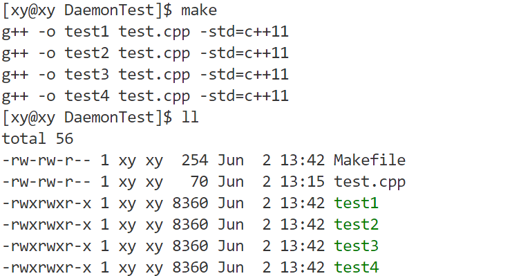

将 test1 和 test2 放到后台运行（在末尾加上`&`）：

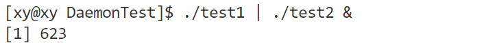

将 test3 和 test4 放到前台运行：

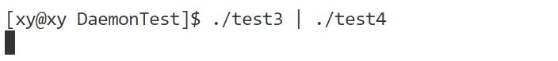

可以看到，将进程置于后台运行时，它会返回一个提示信息，例如这里的：

```text
[1] 623
```

其中，1 是作业编号。623 是作业中某个进程的 ID。

当在命令后面加上`&`符号时，就表示让这个命令在后台运行，shell 会把它当作一个作业，并给它分配一个编号。否则就表示让这个命令在前台运行，shell 不会把它当作一个作业，并且会等待它结束才返回提示符。

通过脚本查看进程的信息：

```shell
ps axj|head -1&&ps axj|grep test
```

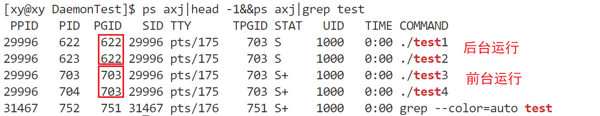

细节：前台运行的进程的状态标识后有`+`符号；后台运行的进程没有。

当前台进程退出以后：

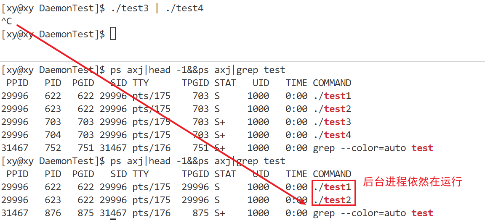

当使用`kill -9 [PID]`来杀掉两个后台进程时：

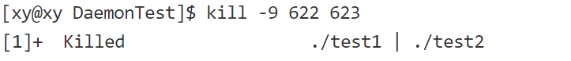

会出现如图所示的提示字样。这表示终止了一个后台作业。`[1]+`表示这是第一个后台作业，`Killed`表示这个作业被 SIGKILL 信号终止了，`./test1 | ./test2`表示这个作业由两个通过管道连接的命令组成。

可以用同一组进程（如 test1 和 test2）多次作为进程组在后台运行：

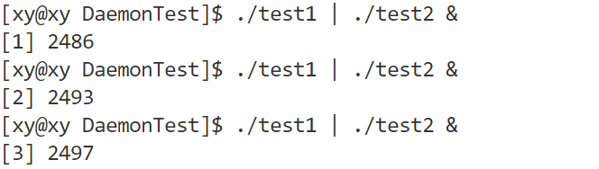

值得注意的是，当关闭了本次会话，相当于执行了“注销”操作，那么这个会话运行的所有进程都会退出。在新会话中，不会存在之前正在运行的后台进程（可以用脚本验证）。

### 会话控制

除了创建前台进程组和后台进程组，还能使用各种命令对它们操作。

#### job

使用`jobs`命令，可以查看当前会话中的作业情况：

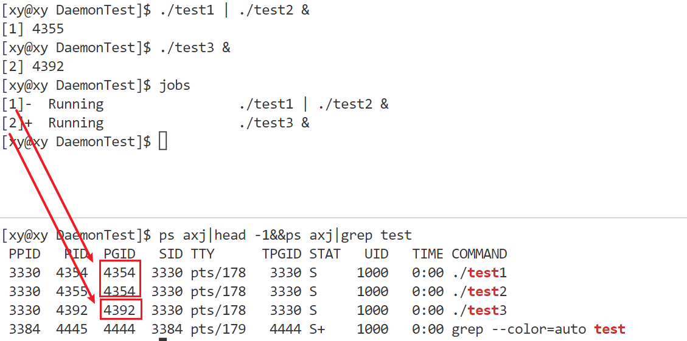

`[1]-`和`[2]+`表示这是第一个和第二个后台作业，Killed 表示这些作业被 SIGKILL 信号终止了。+和-表示这些作业在 shell 中的相对位置。+表示当前作业，或者说最近被调到前台的作业，-表示当前作业的前一个作业。

#### fg

使用`fg`命令（foreground），可以将作业提至前台运行，如果该作业正在后台运行则直接提至前台运行，如果该作业处于停止状态，则给进程组的每个进程发 SIGCONT 信号使它继续运行并提至前台。

将 1 号作业提至前台运行：

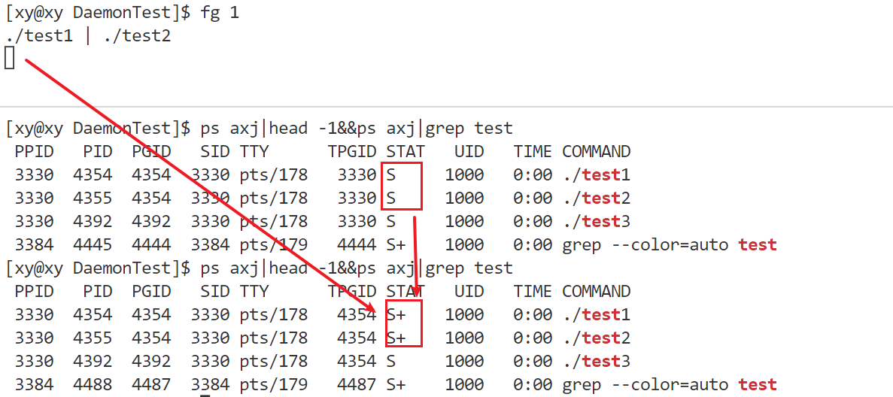

可以看到，1 号进程组的两个进程的状态后面多了符号`+`，表示前台进程。

值得注意的是，每一个 shell 都是不同的会话，在这里单独在一个 shell 运行进程，另一个用来打印信息，而作业运行的进程在同一个 shell 中运行才会使作业编号依次增加，也就是说，每一个 shell 窗口都对应着不同的作业。例如下面分别在两个 shell 窗口中让进程组作为作业在后台运行：

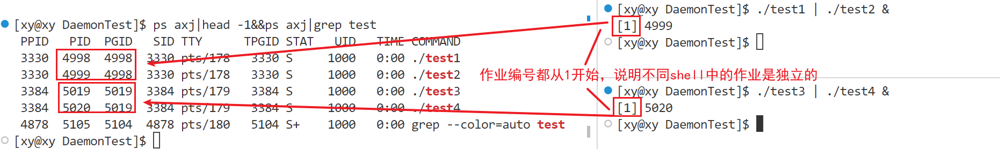

> 使用工具远程连接至服务器或者本地主机时，本质都是先创建一个 shell 进程（通常是 bash、zsh、fish 等），称之为会话，也就是我们打开的窗口。在这个窗口中创建的进程都是这个 shell 进程的子进程。所有运行的进程都在这个会话中进行。

将提至前台运行的进程用 Ctrl + Z 停止：

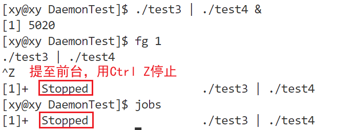

#### bg

使用`bg`（begin）命令可以让停止的作业在后台继续运行（Running），本质是给该作业的进程组的每个进程发 SIGCONT 信号：

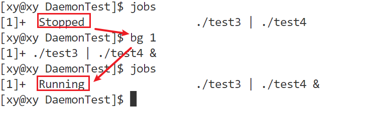

#### ps

`ps`命令已经很熟悉了，如果带上`-o`选项，可以查看<mark>本会话</mark>的进程信息：

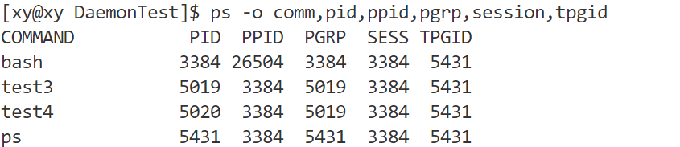

如上所说，每次“登录”的操作就是创建 bash 进程的操作，即新建一个会话。同一个会话中的所有进程的 SESS 都是相同的。例如我在另一个 shell 中输入同样的指令：

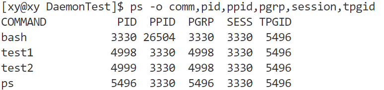

注意到这两个会话的 SESS 值是不一样的。

## 守护进程

守护进程（Daemon）是一种在后台运行的特殊进程，它不属于任何终端，也不受用户的交互控制，通常用来执行一些系统服务或应用程序。

守护进程的特点是：它们由系统启动时或其他进程创建，而不是由用户登录时创建；它们没有控制终端，也不会接收终端上的信号；它们通常有一个特殊的父进程（init 或 launchd），当它们的创建者退出时，不会成为孤儿进程；它们通常以 root 用户或者其他特殊的用户（例如 apache 和 postfix）运行，并处理一些系统级的任务。习惯上守护进程的名字通常以 d 结尾，例如 httpd（Web 服务器的守护进程）、sshd（SSH 服务器的守护进程）、crond（作业规划进程）等等。

> 这个名字的由来源于 Maxwell’s demon，它是物理学家 James Maxwell 在 1867 年进行的一个思想实验。Daemon 这个词也是希腊神话中的鬼怪，它存在于人类和神之间，拥有占卜的能力。与 Judeo-Christian 神话中的 daemon 不同，希腊神话中的 daemon 不是邪恶的。实际上，神话中的 daemon 是神的助手，做一些奥林匹斯山的居民自己不愿做的事——很像 UNIX 中的守护进程，完成前端用户不愿做的事。

### 作用

守护进程的作用是在后台运行不受终端控制的进程，这样就能在系统运行期间在后台执行某些特定任务，通常是为了提供系统服务，例如 Web 服务器、邮件服务器、数据库服务器等等，一般的网络服务都是以守护进程的方式运行的。它们可以在系统启动时启动，并在整个系统运行期间一直存在，以便在需要时随时提供服务。

系统服务进程会启动很多系统服务进程和守护进程，例如网络服务、文件系统服务、日志服务、安全服务等等。这些服务进程和守护进程提供的功能是 Linux 系统正常运行所必需的。因此，守护进程是 Linux 系统中非常重要的一部分，它们保证了系统的可靠性和稳定性。

守护进程可以突破终端的限制，即使关闭终端，守护进程也不会被关闭，而是一直运行到系统关机或者被 kill 命令终止。

### 查看守护进程

最常用的方式是使用`ps`指令，当使用`ps`命令时，可以使用各种选项来控制显示的进程信息。下面是一些常用的选项：

- `a`：显示所有进程，包括其他用户的进程。
- `u`：显示进程的详细信息，例如用户、CPU 使用率、内存使用情况等。
- `x`：显示没有控制终端的进程（通常是后台进程）。
- `j`：显示与作业控制相关的信息。
- `f`：以树形结构显示进程，其中父进程和子进程之间通过缩进来表示。
- `e`：显示所有进程，包括没有控制终端的进程。
- `r`：显示当前正在运行的进程。
- `o`：自定义输出格式，可以指定要显示的字段。
- `t`：指定要显示的进程类型，例如 TTY 进程、批处理进程或用户进程。
- `p`：指定要显示的进程 ID。

可以使用`ps axj`查看系统中的进程：
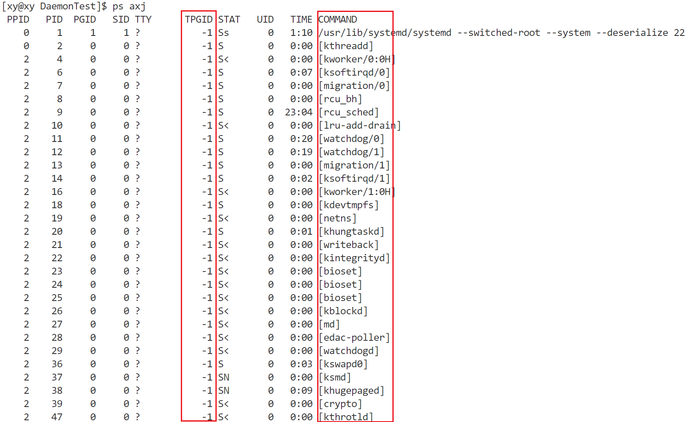

其中，TPGID 为-1 表示没有控制终端的进程，即守护进程。

除此之外，COMMAMD 被`[]`括起来的是内核线程的名称。由于这是在内核中创建的线程，执行的代码属于内核，不执行用户空间中的代码，因此没有程序文件名和命令行，且通常以`k`（Kernel）开头。守护进程的名称通常以 d（Daemon）结尾。

补充：

- udevd 负责维护/dev 目录下的设备文件。
- acpid 负责电源管理。
- syslogd 负责维护/var/log 下的日志文件。

### 创建守护进程

对于守护进程，有两个基本要求：一是必须作为 init 进程的子进程运行，二是不与任何控制终端交互。

一般来讲，进程可以通过以下步骤成为守护进程。

1．调用 fork()，创建新的进程，该进程将会成为守护进程。

2．在（将要成为）守护进程的父进程中调用 exit()。这会确保父进程的父进程（即守护进程的祖父进程）在其子进程结束时会退出，保证了守护进程的父进程不再继续运行，而且守护进程不是首进程。最后一点是成功完成下一步骤的前提。

3．调用 setsid()，使得守护进程有一个新的进程组和新的会话，并作为二者的首进进程。这也保证不存在和守护进程相关联的控制终端（因为守护进程刚创建了新的会话，不会给它分配一个控制终端）。

4．通过调用 chdir( )，将当前工作目录改为根目录。因为守护进程是通过调用 fork() 创建来创建，它继承来的当前工作目录可能在文件系统中的任何地方。而守护进程往往会在系统开机状态下一直运行，我们不希望这些随机目录一直处于打开状态，导致管理员无法卸载守护进程工作目录所在的文件系统。

5．关闭所有的文件描述符。我们不希望继承任何打开的文件描述符，不希望这些描述符一直处于打开状态而自己没有发现。

6．打开文件描述符 0、1 和 2（标准输入、标准输出和标准错误），并把它们重定向到/dev/null。

每一个步骤的原因：

- fork() 创建子进程，父进程 exit() 退出，是为了让子进程在后台运行，不受终端的影响，也不占用终端。
- 在子进程中调用 setsid() 函数创建新的会话，是为了让子进程摆脱原会话、原进程组和原控制终端的控制，成为新的会话组长和进程组长，拥有自己的会话 ID 和进程组 ID。
- 再次 fork() 一个孙进程，并让子进程退出，是为了防止孙进程重新打开控制终端，因为只有会话组长才能打开控制终端，而孙进程不再是会话组长。
- 在孙进程中调用 chdir() 函数，是为了让根目录 "/" 成为孙进程的工作目录，避免影响文件系统的卸载，因为工作目录所在的文件系统不能被卸载。
- 在孙进程中调用 umask() 函数，是为了设置进程的文件权限掩码为 0，增加守护进程的灵活性，因为守护进程可能需要创建一些文件或目录，而不受父进程的文件权限掩码的限制。
- 在孙进程中关闭任何不需要的文件描述符，是为了释放资源，避免占用终端，因为守护进程从父进程继承了一些已经打开的文件描述符，而这些文件描述符可能永远不会被守护进程使用，也可能导致文件系统无法卸载。
- 在孙进程中处理 SIGCHLD 信号，是为了防止产生僵尸进程，因为守护进程可能会 fork() 出一些子进程来处理请求或任务，如果父进程不等待或忽略这些子进程的结束状态，那么这些子进程就会变成僵尸进程，占用系统资源。

下面这个程序遵循了以上这些规则，可以成为守护进程：

```cpp
##include <fcntl.h>
##include <signal.h>
##include <sys/types.h>
##include <sys/stat.h>
##include <unistd.h>
##include <stdlib.h>

int main()
{
    umask(0);

    if (fork() > 0)
        exit(0);
    setsid();

    signal(SIGCHLD, SIG_IGN);

    if (fork() > 0)
        exit(0);

    chdir("/");

    close(0);
    int fd = open("/dev/null", O_RDWR);
    dup2(fd, 1);
    dup2(fd, 2);

    while (1);
    return 0;
}
```

通过 ps 指令查看该进程的信息（应该是 daemon 而不是 deamon）：

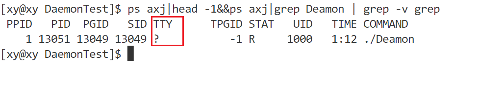

注意它的 PID 和 PGID 以及 SID 不同，说明它既不是进程组首进程也不是会话首进程。实际上，它的 SID 和 bash 进程的 SID 也不相同，表示不属于同一个会话。

通过`ls /proc/PID -al`查看：

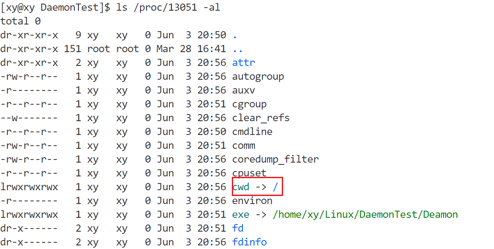

说明该进程的工作目录成功地被修改为根目录。

通过`ls /proc/PID/fd -al`查看：

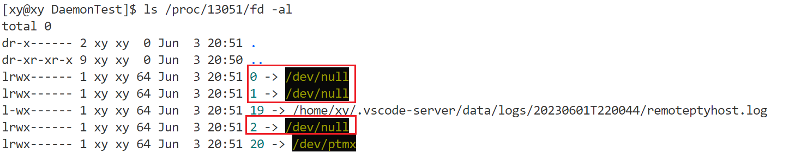

说明该进程的标准输入和标准输入及标准错误成功重定向到了`/dev/null`。

许多 UNIX 系统在它们的 C 函数库中提供了 daemon() 函数来自动完成这些工作，从而简化了一些繁琐的工作：

```c
##include <unistd.h>

int daemon(int nochdir, int noclose);
```

如果参数 nochdir 是非 0 值，就不会将工作目录改为根目录。如果参数 noclose 是非 0 值，就不会关闭所有打开的文件描述符。如果父进程设置了守护进程的这些属性，那么这些参数是很有用的。通常都会把这些参数设为 0。

成功时，返回 0。失败时，返回-1，并将 errno 设置为调用 fork() 或 setsid() 的错误码之一。

用 daemon() 完善代码：

```cpp
##include <fcntl.h>
##include <signal.h>
##include <sys/types.h>
##include <sys/stat.h>
##include <unistd.h>
##include <stdlib.h>

void daemonTest(int nochdir, int noclose)
{
    umask(0);

    if (fork() > 0)
        exit(0);
    setsid();

    signal(SIGCHLD, SIG_IGN);

    if (fork() > 0)
        exit(0);

    if (nochdir == 0)
        chdir("/");

    if (noclose == 0)
    {
        close(0);
        int fd = open("/dev/null", O_RDWR);
        dup2(fd, 1);
        dup2(fd, 2);
    }
}
int main()
{
    daemonTest(0, 0);
    while (1);
    return 0;
}
```

使用 daemon() 系统调用，只需要设置参数 nochdir 和 noclose。当 nochdir 为 0 时，将守护进程的工作目录改为根目录；当 noclose 为 0 时，将守护进程的标准输入和标准输入及标准错误重定向到`/dev/null`。