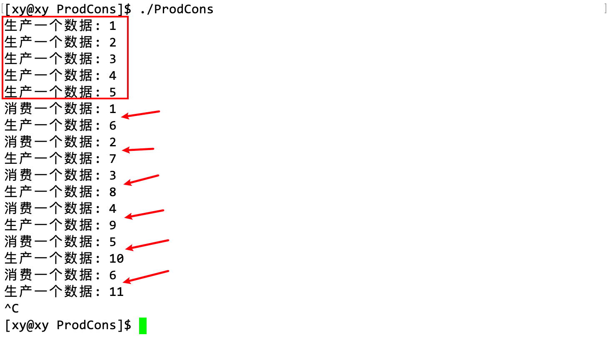

## 1. 概念

### 1.1 引入

超市、厂商和顾客是一个很好的例子，厂商可以被看作是生产者，它生产商品并将其运送到超市。超市可以被看作是缓冲区，它存储厂商生产的商品。顾客可以被看作是消费者，它从超市购买商品。

当超市的库存充足时，厂商不需要再运送更多的商品。但是，当超市的库存不足时，厂商需要生产更多的商品并将其运送到超市。同样，当超市有足够的商品时，顾客可以购买它们。但是，当超市缺货时，顾客需要等待厂商运送更多的商品。

生产者消费者模式的基本思想：生产者负责生成数据并将其放入缓冲区，而消费者则从缓冲区中取出数据并进行处理。当缓冲区为空时，消费者需要等待生产者生成新的数据；当缓冲区已满时，生产者需要等待消费者取出数据。

### 1.2 概念

生产者消费者模型是一种常见的多线程设计模式，它用于解决生产者和消费者之间的同步问题。在这个模型中，生产者线程负责生成数据并将其放入缓冲区，而消费者线程则从缓冲区中取出数据并进行处理，以解决生产者和消费者的强耦合问题。

由于生产者和消费者线程共享缓冲区，所以需要使用同步机制来确保线程安全。通常情况下，可以使用互斥锁来保护缓冲区，防止多个线程同时访问。此外，还可以使用条件变量来实现生产者和消费者之间的同步。当缓冲区为空时，消费者线程会等待条件变量，直到生产者线程向缓冲区中添加了新的数据并唤醒它。同样，当缓冲区已满时，生产者线程也会等待条件变量，直到消费者线程从缓冲区中取出了数据并唤醒它。

> 为什么没有缓冲区，生产者和消费者就是强耦合的？

这是因为在没有缓冲区的情况下，生产者必须直接将数据传递给消费者，而消费者也必须直接从生产者那里获取数据。

这样一来，生产者和消费者之间就会形成一种紧密的依赖关系。生产者必须等待消费者准备好接收数据，而消费者也必须等待生产者生成新的数据。这种依赖关系会导致生产者和消费者之间的耦合度增加，使得它们之间的交互变得更加复杂。

相反，如果有了缓冲区，那么生产者和消费者之间就可以通过缓冲区来解耦。生产者只需要将数据放入缓冲区，而不需要关心消费者何时获取数据。同样，消费者也只需要从缓冲区中取出数据，而不需要关心生产者何时生成新的数据。这样一来，生产者和消费者之间就可以独立地运行，它们之间的耦合度也会降低。

> 现实中生产者、消费者可能不止一个，在计算机中，生产者、消费者之间会不会存在类似的竞争关系？

保证线程的操作是互斥和同步的，以确保数据的安全性。

现实生活中，可能同时存在两个品牌的火腿厂商同时上架，在计算机中，如果这样做的话会导致数据混乱，例如超市中的货架就相当于线程共享的资源，如果不加以控制，线程之间会竞争共享资源；消费者也是类似的，举一个在现实生活中极端的例子，在世界末日来临时，消费者之间会有很强的竞争、互斥关系。同样地，如果不限制生产者的生产、消费者的消费的方式，那么也很有可能造成数据缺失问题：例如生产者在生产的中途就被消费者取出一部分数据，数据会缺失；消费者正在取出数据时，生产者依然继续生产。

这就是互斥锁和条件变量存在的意义：

- 互斥锁：避免多个线程同时访问共享数据区而导致的竞态条件，使得所有线程独立。
- 条件变量：通过标记两种状态保证数据的安全性。
  - 当缓冲区已满时，生产者线程应该进入等待状态。此时，生产者线程可以使用条件变量来等待消费者从缓冲区中取出数据。
  - 当消费者从缓冲区中取出数据时，它会使用条件变量来通知生产者继续生产数据。

## 2. 特点

我们可以用“123 原则”记忆生产者消费者模式的几个特点：

- 1 个空间：生产者和消费者在同一时间段内共用同一存储空间，生产者向空间里生产数据，而消费者从空间里取走数据。
- 2 种角色：生产者和消费者。
- 3 种关系
  - 生产者之间：互斥
  - 消费者之间：互斥
  - 生产者和消费者：互斥与同步

> 在生产者消费者模式中，生产者和消费者是线程角色化的，这意味着生产者和消费者都是独立的线程，这样它们技能并发地执行。这个共享的空间指的是由某种数据结构表示的缓冲区，所谓的商品就是计算机中的数据。
>
> 并且要做到生产者和消费者的操作必须是互斥的，即对于数据而言，它只有被生产前和被生产后两种状态。这样才能保证生产者和消费者可以并发地执行，生产者不需要等待消费者消费完数据才能继续生产数据，消费者也不需要等待生产者生产完数据才能继续消费数据。

这样做的好处是可以提高程序的并发性和性能。这样可以提高程序的吞吐量和响应时间。

> 这个缓冲区是由哪个数据结构实现的？

队列。缓冲区可以由一个固定大小的数组来实现。这个数组可以被看作是一个队列，它遵循先进先出（FIFO）的原则。生产者向队列中添加数据，消费者从队列中取出数据。

当然，缓冲区也可以由其他数据结构来实现，例如链表、栈等。具体使用哪种数据结构取决于具体的应用场景。本文将以队列为例。

> 超市里是否新增了商品，谁最清楚？ -- 生产者
>
> 是否有空间可以放商品，谁最清楚？ -- 消费者

上面这两个条件可以形成一个逻辑回路：

1. 当消费者取出商品后，消费者就能唤醒生产者继续生产；
2. 当生产者生产完，把商品放到超市中，就能唤醒消费者继续取出。

对于消费者，唤醒生产者的“条件”就是缓冲区中数据还没满；对于生产者，唤醒消费者的“条件”就是缓冲区中的数据已经满了。这个“条件”就会成为条件变量要标记的条件。

注意：生产和消费的过程不仅包括生产者把数据存放在缓冲区中，消费者从缓冲区中取出数据，还包括生产者产生的数据从何而来（网络、磁盘。..），以即数据被消费者如何使用。这反而是更占用时间的。

## 3. Blocking Queue

### 3.1 介绍

Blocking Queue 常用于生产者消费者模型中，作为生产者和消费者之间的缓冲区，生产者向 Blocking Queue 中添加数据，消费者从 Blocking Queue 中取出数据：

- 当 Blocking Queue 已满时，生产者线程将会被阻塞；
- 当 Blocking Queue 为空时，消费者线程将会被阻塞。


> 图片来源于：https://math.hws.edu/eck/cs124/javanotes7/c12/producer-consumer.png

Blocking Queue 与普通队列的主要区别在于它具有阻塞功能。这和管道是类似的，当管道在某些情况下可能会产生阻塞：

- 当管道中没有数据可读时，从管道中读取数据的操作将会被阻塞，直到有新的数据可用；
- 当管道已满时，向管道中写入数据的操作将会被阻塞，直到管道中有空闲位置可用。

阻塞是相对于两者而言的。

### 3.2 模拟实现 Blocking Queue

为了方便实现，下例中只有一个生产者和消费者。

#### 基本框架

将在`ProdCons.cc`源文件中实现创建、等待线程，生产者和消费者函数。

```cpp
##include "BlockQueue.hpp"
##include <pthread.h>

void* productor(void* args)
{
	return nullptr;
}
void* consumer(void* args)
{
	return nullptr;
}
int main()
{
	pthread_t cons, prod;
	pthread_create(&cons, nullptr, consumer, nullptr);
	pthread_create(&prod, nullptr, productor, nullptr);

	pthread_join(cons, nullptr);
	pthread_join(prod, nullptr);

	return 0;
}
```

下面将对这个框架进行扩充。在`BlockQueue.hpp`中，实现阻塞队列逻辑。

#### 阻塞队列

STL 不是线程安全的，这是因为它的设计目标并不是支持多线程并发访问。STL 容器和算法的实现并没有内置的机制来防止多个线程同时访问同一个容器或算法而导致的竞态条件。线程安全的问题需要再用户层实现。

> STL 的设计哲学是提供高效、通用和可重用的组件，而不是为每种可能的使用场景提供内置的支持。这样可以让程序员根据具体的应用场景来选择最适合的同步机制，而不是强迫程序员使用 STL 内置的同步机制。

在此，我们可以使用 queue 容器和 pthread 库中的互斥锁保证线程安全。

同时，将会使用两个条件变量表征生产者和消费者唤醒对方的“条件”，即：

- 生产者唤醒消费者的条件：货被取走了->缓冲区不为空；
- 消费者唤醒生产者的条件：货被补满了->缓冲区满了。

互斥锁的意义就在于此，它保证同一时间只有一个线程能够访问容器，避免两者同时在缓冲区中操作数据，从而避免竞态条件。

为了判断缓冲区是否为空，所以要有一个计数器记录着容量，这个操作也是由用户实现的。同时，为了泛化类型，使用了模板。下面是`BlockQueue`类的框架。

```cpp
##pragma once

##include <iostream>
##include <queue>
##include <pthread.h>

using namespace std;

const int gDefaultCap = 5; // 队列容量

template<class T>
class BlockQueue
{
public:
	BlockQueue(int capacity = gDefaultCap)
	: _capacity(capacity)
	{}
	void push()
	{}
	void pop()
	{}
	~BlockQueue()
	{}
private:
	queue<T> _bq;			// 阻塞队列
	int _capacity;			// 容量
	pthread_mutex_t _mtx;	// 互斥锁
	pthread_cond_t _empty;	// 队空条件变量
	pthread_cond_t _full;	// 队满条件变量
};
```

#### 线程函数框架

返回`ProdCons.cc`编写生产者和消费者线程函数的逻辑。

首先，pthread_create 函数的最后一个参数是用来在外部传递参数给线程的，而且它的类型是 void *类型，因此我们可以将 BlockQueue 类型的对象强转以后传过去，然后线程函数内部再转回对象本身类型就能取到这个对象中的线程信息。在线程函数内部对信息加以限制，就能限制线程的行为，从而就实现了通过阻塞队列控制线程的目的。

```cpp
int main()
{
	BlockQueue<int>* bqueue = new BlockQueue<int>();

	pthread_t cons, prod;
	pthread_create(&cond, nullptr, consumer, bqueue);
	pthread_create(&prod, nullptr, productor, bqueue);

	pthread_join(cons, nullptr);
	pthread_join(prod, nullptr);

	delete bqueue;

	return 0;
}
```

值得注意的是，pthread_create 的第四个参数就会传入 BlockQueue *类型的对象，相当于把一个数据包传给线程。

对于阻塞队列而言，最重要的两个接口是 pop 和 push，它们分别对应着消费者和生产者。现在，可以就生产者和消费者的线程函数写一些简单的逻辑：生产者单纯地写入数据，消费者单纯的读取数据。

```cpp
void* productor(void* args)
{
	BlockQueue<int>* bqueue = (BlockQueue<int>*)args;
	int a = 1;
	while(1)
	{
		bqueue->push(a);
		cout << "生产一个数据：" << a << endl;
		a++;
	}
	return nullptr;
}
void* consumer(void* args)
{
	BlockQueue<int>* bqueue = (BlockQueue<int>*)args;
	while(1)
	{
		sleep(1);
		int a = -1;
		bqueue->pop(&a); // 输出型参数
		cout << "消费一个数据：" << a << endl;
	}
	return nullptr;
}
```

为了方便观察现象，在线程函数中增加了打印语句。

#### push 和 pop 框架

在补充 push 和 pop 框架之前，需要补充`BlockQueue`类的其他成员函数：

```cpp
template<class T>
class BlockQueue
{
public:
	BlockQueue(int capacity = gDefaultCap)
	: _capacity(capacity)
	{
		pthread_mutex_init(&_mtx, nullptr);
		pthread_cond_init(&_empty, nullptr);
		pthread_cond_init(&_full, nullptr);
	}
	void push(const T& in)
	{}
	void pop(T* out)
	{}
	~BlockQueue()
	{
		pthread_mutex_destroy(&_mtx);
		pthread_cond_destroy(&_empty);
		pthread_cond_destroy(&_full);
	}
private:
	queue<T> _bq;			// 阻塞队列
	int _capacity;			// 容量
	pthread_mutex_t _mtx;	// 互斥锁
	pthread_cond_t _empty;	// 队空条件变量
	pthread_cond_t _full;	// 队满条件变量
};
```

互斥锁的初始化和销毁操作分别放在 BlockQueue 的构造函数和析构函数，这是一种常见的编程方式：RAII（Resource Acquisition Is Initialization，资源获取即初始化），简单地说，就是将资源的申请和释放交给对象的生命周期管理（C++11 新增的智能指针就用到了这个思想）。

值得注意的是，互斥锁和条件变量在此发挥作用：

- 互斥锁：在 push 和 pop 之前，都要进行加锁和解锁操作，以免两个操作时机有交叉，保证数据安全。
- 条件变量：在 push 和 pop 之前要检测临界资源是否满足访问条件，然后才能访问临界资源。

push 和 pop 的逻辑：队列满的时候就是临界资源不满足条件，那么就让线程等待这个条件变量。

>为什么 pthread_cond_wait() 的第二个参数是锁的地址？

因为线程在检测临界资源是否符合条件这个检测的操作本身就需要在临界区中执行（临界区：加锁和解锁之间的代码），如果这个 wait 函数成功等待，在调用 wait 函数的这行代码阻塞以后，锁就无法释放。后续如果消费者线程要调用 pop，因为 pop 内部也有检测操作，那么它申请锁就无法成功。

第二个参数是锁的地址，这就能解决上面的问题，当线程成功调用 wait 函数阻塞后，锁就会在 wait 函数内部被自动释放，防止这个锁被阻塞的线程持有。

> 生产者的线程在等待条件变量满足以后会被唤醒，那么它会在哪里被唤醒？

在哪一行代码被阻塞，就在哪一行代码唤醒。

下面是 pop 和 push 的逻辑，它们使用了 queue 容器的 push() 和 pop() 接口，并且判断队列为空或满的逻辑用函数包装，同样封装了 size() 接口。

```cpp
// 删除了重复的内容
const int gDefaultCap = 5; 	// 队列容量

template<class T>
class BlockQueue
{
private:
    bool isQueueEmpty()
    {
        return _bq.size() == 0;
    }
    bool isQueueFull()
    {
        return _bq.size() == _capacity;
    }
public:
	void push(const T& in)
	{
		pthread_mutex_lock(&_mtx);				// 加锁
		if(isQueueFull()) 
			pthread_cond_wait(&_full, &_mtx);	// 队列满，生产者等待
		_bq.push(in);							// 队列未满，继续生产
		pthread_mutex_unlock(&_mtx);			// 解锁
		pthread_cond_signal(&_empty);			// 唤醒
	}
	void pop(T* out)
	{
		pthread_mutex_lock(&_mtx);				// 加锁
		if(isQueueEmpty())
			pthread_cond_wait(&_empty, &_mtx);	// 队列空，消费者等待
		*out = _bq.front();						// 更新输出型参数
		_bq.pop();								// 队列未空，继续消费
		pthread_mutex_unlock(&_mtx);			// 解锁
		pthread_cond_signal(&_full);			// 唤醒
	}
private:
	queue<T> _bq;			// 阻塞队列
	int _capacity;			// 容量
	pthread_mutex_t _mtx;	// 互斥锁
	pthread_cond_t _empty;	// 队空条件变量
	pthread_cond_t _full;	// 队满条件变量
};
```

为了让打印出来的内容比较工整，让 consumer 线程函数先 sleep1 秒以后再消费。注意：为了获取队列头部元素的值（为了打印），封装的 pop 接口有一个 out 输出型参数，它对应着 consumer 线程函数中的输出型参数。

```cpp
void* consumer(void* args)
{
	BlockQueue<int>* bqueue = (BlockQueue<int>*)args;
	while(1)
	{
		sleep(1);
		int a = -1;
		bqueue->pop(&a);
		cout << "消费一个数据：" << a << endl;
	}
	return nullptr;
}
```

#### 测试 1



这是一个最简单的生产者消费者模式的实现示例，当内部的 queue 的 size 还未到规定的容量时（5 个），队列未满，因为没有用 sleep 限制 push，所以生产者线程就会瞬间生产 5 个数据（实际上这是生产者线程在单次被调用时就完成的）；队列满时，就会触发 push 中的`if(isQueueFull()) `分支，使生产者线程阻塞，然后消费者线程函数被线程运行时，由于队列不为空，直接 pop，此时队列元素个数为 4。那么下次再调用生产者线程时，就会继续 push 一个数据，循环往复。

这就是图中首先生产 5 个数据，然后循环消费一个生产一个的原因。可以通过 sleep 控制生产和消费的速度：


但是这样的效率太低了，每次生产或取出数据才几个，如果是快递，那么快递费就太高了。万一业务中队列的容量可能很大，所以可以让消费者在容量为一半以上时才消费：
```cpp
void pop(T* out){
    // ...
if(_bq.size() >= _capacity / 2)
    pthread_cond_signal(&_mtx);		// 解锁
}
```


从这个结果看，这个策略成功控制了生产和消费的行为。

> 在对临界资源操作的逻辑中（push 和 pop），解锁和唤醒的顺序有限制吗？

在操作临界资源完成后，解锁和唤醒的顺序是有限制的。通常情况下，应该先解锁，然后再唤醒等待线程。这样可以避免唤醒的线程立即再次被阻塞。

先解锁再唤醒等待线程是为了避免死锁和浪费 CPU 资源。如果先唤醒等待线程，那么唤醒的线程会立即尝试获取锁，但由于锁仍然被持有，所以唤醒的线程会再次被阻塞。这样就会浪费 CPU 资源，并且可能导致死锁。因此，应该先解锁，然后再唤醒等待线程。

> 如果在解锁某个线程之前唤醒它，此时锁还未被释放怎么办？

被唤醒之前的线程处于阻塞状态，是在条件变量下等待的，如果出现这样的情况，唤醒的线程会立即尝试获取锁，条件就会变成在锁上等，只要锁被释放后，它就能获取锁。但是但由于锁仍然被持有，所以唤醒的线程会再次被阻塞。这样就会浪费 CPU 资源，并且可能导致死锁。这也是先解锁后唤醒的原因。

> 如果有多个线程都在等待那个未被释放的锁，而最后一旦锁被释放以后只有一个线程能获取锁，其他线程应该怎么办？

那么其他未能获取锁的线程会继续等待。剩下的线程会竞争同一个锁，操作系统会根据调度算法来决定哪个线程将获得锁。未能获取锁的线程会继续等待，直到它们能够获取锁为止。从时间上看，每个线程都能获取锁，只要它申请和释放锁的行为是规范的，保证了数据安全，不用关心是那个线程生产资源和消费资源。

#### 条件变量使用规范

以上面的代码为例，由于使用了条件变量限制了 pthread_cond_wait() 函数的行为，而条件变量就是「检测临界资源是否就绪」这个动作的一个标记。而这个操作本身就在临界资源中，因为条件变量通常用一个全局变量定义，所以限制条件变量的使用，就能限制访问临界资源的行为。

> pthread_cond_wait() 函数会失败吗？

只要是一个函数，那就有可能失败。如果它失败了，表明线程没有成功被阻塞，那么就会执行这个函数后面的语句，因此可能会造成越界问题。

> 有没有一种可能，条件变量并未正在表征实际条件？

可能存在线程等待的条件并未满足，却被错误地唤醒，称之为"伪唤醒"。一旦出现伪唤醒的情况，那就不应该继续向下执行代码，而是重新判断 wait 函数的返回值是否合法。所以解决办法是把 if 改成 while。这样就能 100%确定资源时就绪的：

```cpp
while(isQueueFull()) 
    pthread_cond_wait(&_full, &_mtx);	// 队列满，生产者等待

while(isQueueEmpty())
    pthread_cond_wait(&_empty, &_mtx);	// 队列空，消费者等待
```

> 在生产者和消费者线程最初创建后，它们被调度的顺序会影响结果吗？

不会，因为我们使用了条件变量限制它们的行为，即不满足条件变量就会立即处于阻塞状态，所以重要的是在写代码时要按照规范，处理好并发情况。

#### 关于效率

> 从上面的代码中可以知道，数据在生产者->阻塞队列->消费者的移动可能会经过拷贝，拷贝会使效率降低，那么这个模式有什么意义？

如果只是单纯地看待数据在队列两端移动的过程，拷贝确实会导致效率变低。但是生产消费模式是一种解耦行为，把眼光放长远，这个队列可能只是数据传输过程中很小一部分，就像一个小木桥一样。因为在队列的生产者端，数据可能来自于网络，这是需要花费很多时间的；在队列的消费端，数据也可能流向不同的地方，处理数据的方式也是根据具体情况实现的，如果是高 IO、访问网络的话，也是要处理很久的。实际上解耦行为才是提高效率的根本，例如数据的生产者不必担心消费者在自己写数据的时候被对方打断，因为处理对方打断也是需要花费时间的（就像超市店员正在上货，你却叫他把刚放上的东西拿给你）；对于消费者也是类似的。<mark>所以阻塞队列真正提高效率的地方不在于它本身是以何种高效的方式传输数据而提升它这一小部分的数据传输效率，而是通过将数据的生产者和消费者解耦，使它们能尽可能多的时间专注于自己的事情，从而提升整体效率。</mark>

补充：
在阻塞队列中，数据是否经过拷贝取决于具体实现。在一些实现中，数据可能会被拷贝到缓冲区中，而在另一些实现中，数据可能会通过移动语义来避免拷贝。拷贝数据会增加额外的开销，可能会影响效率。如果数据量较大，那么避免拷贝可以带来显著的性能提升。

#### 补充数据处理过程

上面的程序我们实现了一个小木桥。那么下面就来简单的地模拟一下消费者处理数据的过程。实际上也没什么，也就通过 sleep 模拟一下而已，重要的是体会这个木桥在整体中的作用。

可以另外在`task.hpp`中定义它们。

```cpp
##pragma once

##include <iostream>
##include <functional>
using namespace std;

typedef function<int(int, int)> func_t;
class Task
{
public:
	Task(){}
	Task(int x, int y, func_t func)
	: _x(x)
	, _y(y)
	, _func(func)
	{}
	int operator()()
	{
		return _func(_x, _y);
	}
public:
	int _x;
	int _y;
	func_t _func;
};
```

在这个`Task`类中，重载了默认构造函数和`operator()`，前者是取消编译器告警，因为这个类中的成员本应该设置为私有，但是再写 get 和 set 接口就显得冗余了。后者的目的是在消费者和生产者的线程函数中直接调用方法。

其中，func_t 是一个函数对象类型。

可以以一个简单的加减法函数作为线程的数据处理任务，在这里用一个数组保存：

```cpp
##define SOL_NUM 2

typedef function<int(int, int)> func_t;

int Add(int x, int y)
{
	return x + y;
}
int Sub(int x, int y)
{
	return x - y;
}

func_t sol[SOL_NUM] = {Add, Sub};
```

数组中保存的分别是两个函数的地址。

线程函数也应该做对应的修改，在原来的示例中，BlockQueue 的数据类型是 int，现在应该改成自定义的 Task 类，因为懒得输入，所以用随机值得到 x 和 y 两个整数的值。设置一个全局变量 opt，它的取值是 0 或 1，表示消费者要执行的任务在数组中的下标。

同时也要根据任务的不同（下标）来分配不同的任务，可以通过打印语句体现。

```cpp
int opt = -1;
void* productor(void* args)
{
	BlockQueue<Task>* bqueue = (BlockQueue<Task>*)args;
	while(1)
	{		
		opt = rand() % 2;
		int x = rand() % 10 + 1;
		usleep((rand() % 1000));
		int y = rand() % 5 + 1;
		Task t(x, y, Add);
		bqueue->push(t);
		if(opt) cout << "生产者线程：" << t._x << "-" << t._y << "= _?_" << endl;
		else 	cout << "生产者线程：" << t._x << "+" << t._y << "= _?_" << endl;
	}
	return nullptr;
}
void* consumer(void* args)
{
	BlockQueue<Task>* bqueue = (BlockQueue<Task>*)args;
	while(1)
	{
		sleep(1);
		Task t;			 // 获取任务
		bqueue->pop(&t); // 输出型参数
		if(opt) cout << "消费者线程：" << t._x << "-" << t._y << "=" << sol[opt](t._x, t._y) << endl;
		else	cout << "消费者线程：" << t._x << "+" << t._y << "=" << sol[opt](t._x, t._y) << endl;
	}
	return nullptr;
}
```


值得注意的是，调用函数的方法的同时需要传入参数`sol[opt](t._x, t._y)`。

> 这个例子中只有一个生产者和消费者，这里的代码能耗支持多个生产者和消费者吗？

- 互斥锁可以保证多线程的实现，因为线程必须竞争同一个锁。如果是一个生产者，多个消费者，这就相当于实现了一个线程池。

#### 互斥锁的设计

如果有多个线程，那么加解锁的过程总是要使用 lock 和 unlock 接口，显得十分不便，有时候可能还会忘记。所以也可以用 RAII 的方式将互斥锁的申请和释放操作绑定在一个对象的生命周期上。

下面是`Mutex`类的实现，其实就是把地址作为成员变量，把两个接口分别放在构造函数和析构函数中：
```cpp
class Mutex
{
public:
    Mutex(pthread_mutex_t* mtx)
    : _pmtx(mtx)
    {}
    void lock() 
    {
        pthread_mutex_lock(_pmtx);
    }
    void unlock()
    {
        pthread_mutex_unlock(_pmtx);
    }
    ~Mutex()
    {}
private:
    pthread_mutex_t* _pmtx;
};
```

关于锁的传递，使用指针或引用都可以。

然后再套一层，用来加解锁：
```cpp
class lockGuard
{
public:
    lockGuard(pthread_mutex_t* mtx, string msg)
    : _mtx(mtx)
    , _msg(msg)
    {
        _mtx.lock();
        cout << _msg <<"---加锁---" << endl;
    }
    ~lockGuard()
    {
        _mtx.unlock();
        cout << _msg << "---解锁---" << endl;
    }
private:
    Mutex _mtx;
    string _msg;
};

```

为了方便观察现象，增加了一个字符串成员函数，用于在线程函数中传入提示信息。那么 push 和 pop 就能简洁一点，主要是申请锁和释放锁的操作是符合规范的。


通过结果可以看到，加解锁都是成对出现的。在定义对象时调用构造函数加锁，退出代码块，会调用析构函数，释放锁。