# 1. 基础概念

首先要说明，前主要阐述与 Linux 线程相关的（前导）概念，只有了解了 Linux 实现线程的基本原理，才能理解 Linux 中的线程。

## 1.1 Linux 线程概念

==线程在进程的内部执行，是操作系统调度和执行的基本单位。==在 Linux 中线程也被称之为轻量级进程。在 Linux 内核中（注意是 Linux），并没有线程的概念，它把所有的线程以统一的方式当做进程实现并管理。因此，Linux 内核中并未给进程单独提供特殊的系统调用，也没有为线程实现特定的内核数据结构，自然也就没有为线程提供单独的调度策略。在 Linux 操作系统中，线程与其他进程共享部分资源。

> 由于线程是属于操作系统的概念，因此线程的实现方式取决于具体的系统，如 Windows 系统内核就单独为线程提供了系统调用和专门管理线程的调度策略。
>
> 线程、thread、执行流，都是我们对代码被执行的情况形象的理解，执行流就像公路，有通往不同目的地的分叉路，有让车辆并驾齐驱的多车道。代码被执行，就是要完成某件事，而完成某件事的关键在于 CPU 的资源如此有限，如何通过不同的策略让代码更高效地被执行，同时保证数据的正确性。

如上所说，轻量级进程（LWP，Lightweight Processes）是 Linux 中线程的别名，也就是说，Linux 中的线程是通过进程模拟实现的，因此它是内核线程的抽象，线程是我们从操作系统层面对它形象的理解。==线程是建立在内核之上并由内核支持的用户线程，==每一个轻量级进程都与一个特定的内核线程关联，每个 LWP 都可以作为独立单元由内核独立调度。

> 存疑：
>
> 1. 线程在进程内部执行？
> 2. 为什么把线程叫做轻量级进程？
> 3. 为什么线程是用户层面的？
> 4. Linux 中线程和进程的区别？（常见面试题）

## 1.2 多线程概念

在 Linux 中，多线程指的是在一个进程中同时运行多个线程（这是硬件支持的）。线程是操作系统能够进行运算调度的最小单位，它被包含在进程之中，是进程中的实际运作单位。每个线程都有自己的程序计数器、寄存器集合和栈，但是它们共享同一进程的内存空间和其他资源。

多线程可以让程序在同一时间执行多个任务，提高程序的并发性和响应性。例如，在一个文本编辑器中，一个线程可以用来处理用户输入，另一个线程可以用来进行后台拼写检查。

## 1.3 主线程和其他线程

> 区别内核线程和主线程：
>
> 内核线程（kernel-level threads）是由操作系统内核管理的线程，它只运行在内核态，不受用户态上下文的拖累。它只能由内核管理并像普通进程一样被调度。每一个轻量级进程都与一个特定的内核线程关联，这样，每个 LWP 都可以作为独立单元由内核独立调度。这里的内核线程不是主线程，而是与轻量级进程关联的特定内核线程。在这里并不对此讨论，只要知道每个线程都有一个在内核中的调度者即可。

在多线程中，线程分为主线程和其他线程。主线程的特殊之处在于它在程序中扮演的角色。它是程序启动时创建的第一个线程，通常用于执行程序的主要控制流程，并负责协调程序的结束。在许多语言中，main 函数是程序的入口，main 函数对应的执行流就是主线程。

实际上，在学习进程时，我们所说的进程就是主线程，因为整个进程内没有其他线程。

# 2. 线程资源相关数据结构

## 2.1 vm_area_struct 结构体

vm_area_struct 是一个结构体，它表示进程使用的连续虚拟地址空间区域，保存着进程地址空间的信息。一个进程使用多个 vm_area_struct 结构来分别表示不同类型的虚拟内存区域，以满足不同类型数据的存储需求，包括虚拟内存的起始和结束地址，以及内存的访问权限等。

vm_area_struct 结构描述了一个给定地址空间中连续区间上的单个内存区域。它可以用来描述进程中的各种内存区域，包括代码区（text）、数据区（data）、堆区（heap）、栈区（stack）和内存映射区（mmap）等。

在 mm_struct 中有一个指向 vm_area_struct 的指针，用于表示该进程的虚拟内存区域列表。这些 vm_area_struct 结构通过链表连接起来，表示进程的整个虚拟地址空间。

它的定义如下：

```c
struct vm_area_struct {
    unsigned long vm_start;
    unsigned long vm_end;
  
    struct vm_area_struct* vm_next, * vm_prev;
    struct rb_node vm_rb;
    unsigned long rb_subtree_gap;
  
    struct mm_struct* vm_mm;
    pgprot_t vm_page_prot;
    unsigned long vm_flags;
  
    struct {
         struct rb_node rb
         unsigned long rb_subtree_last;
    } shared;
  
    struct list_head anon_vma_chain;
    struct anon_vma* anon_vma;
  
    const struct vm_operations_struct* vm_ops;
  
    unsigned long vm_pgoff;
    struct file* vm_file;
    void* vm_private_data;
  
#ifndef CONFIG_MMU
    struct vm_region* vm_region;
#endif
#ifdef CONFIG_NUMA
    struct mempolicy* vm_policy;
#endif
};
```

它有最重要的几个成员：

- vm_start 和 vm_end：分别保存了该虚拟内存空间的首地址和末地址后第一个字节的地址；
- 双链表指针 vm_next 和 vm_prev：它们都是 vm_area_struct *类型）

vm_area_struct 和 mm_struct 都是 Linux 内核中与内存管理相关的结构，区别在于：

- vm_area_struct 结构描述了一个给定地址空间中连续区间上的单个内存区域。内核将每个内存区域视为一个独特的内存对象。每个内存区域都具有某些共同属性，例如权限和一组相关操作。它表示的是一块连续的虚拟地址空间区域，供进程使用，地址空间范围是 0 ~ 3G，对应的物理页面都可以是不连续的。
- mm_struct 表示一个进程的内存描述符，其中包含了该进程的虚拟内存空间信息。在 mm_struct 中有一个指向 vm_area_struct 的指针，用于表示该进程的虚拟内存区域列表，即整个进程地址空间的信息。这些 vm_area_struct 结构通过双向链表连接起来，表示进程的整个虚拟地址空间。

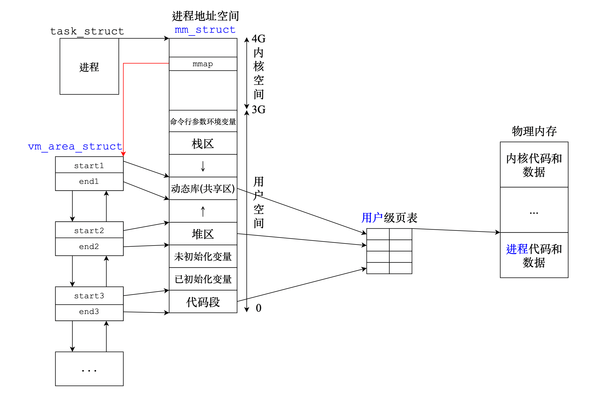

> 注意：vm_area_struct 可以用来描述这些不同的内存区域。例如，代码区用于存储程序的机器指令，数据区用于存储全局变量和静态变量，堆区用于动态分配内存，栈区用于存储局部变量和函数调用信息，内存映射区则用于映射文件或设备到内存中。而图中为了简洁只画了一部分。
>
> 值得注意的是，Linux 多线程的实现需要链接动态库。

vm_area_struct 维护的是更细小的空间，它是一个双向链表。说明了操作系统可以做到让进程进行资源的粒度划分的，单纯对进程而言，是颗粒度比较大的。例如进程确定某个变量在堆区，那么操作系统会通过这个双向链表找到某个 vm_area_struct 结点，这个结点的成员 start 和 end 限制的空间范围就是某个变量存储的范围。

## 2.2 二级页表

### 引入

> 在学习进程时，我们知道页表其实就是一种 key-value 模型，是虚拟地址和物理地址之间的桥梁。32 位系统中一共有$2^{32}$个地址需要被映射，那么页表是如何将这么多虚拟地址映射到物理地址的？（下面以 32 位机器为例）

在磁盘中，程序本质是一个文件，可执行程序在生成时，按照上图中的布局进行编译，即按照进程地址空间方式编译。这样，可执行程序中的区域就被划分成了以 4KB 为单位大小的物理内存区域，它是和上图中的逻辑布局相对应，为了配合语句跳转，页表的大小也被设计为了 4KB。（为什么页表大小是 4KB，稍后会做出解释）

假设页表的条目（行）的大小是 9 字节（8 字节保存一对保存地址映射的变量，1 字节保存区分权限等级的标记变量），对于$2^{32}$个地址，整个页表的大小约为 36GB，这显然不可能作为页表的存储方式。

实际上，我们在之前讨论的页表是一个多级结构，从虚拟->物理映射时（32 位），要经过一级页表和二级页表。在 Linux 中，多级页表用于支持对大地址空间快速、高效的管理。因此，Linux 内核对页表进行了分级。对于 32 位系统中，两级页表已经足够了。但是 64 位需要更多数量的分页级别。为了同时支持适用于 32 位和 64 位的系统，Linux 采用了通用的分页模型，在此不做讨论，是类似的。

### 页帧和页框

页帧和页框是同一个概念，都是指内存区域的划分，而且它们的大小都是 4KB：

- 页框/页帧（page frame）是一个固定长度的内存块，是对于内存而言的；
- 页（page）是一个固定长度的数据块，是对于磁盘而言的。

上文提到，可执行程序在被加载到内存中被运行之前是存储在磁盘上的文件，在编译时以 4KB 为单位大小划分区域，这每一个 4KB 大小的数据块就是一「页」；运行程序时，需要将磁盘中的可执行程序文件加载到内存中，加载的方式就是以 4KB 为单位大小，将「页」复制到一个「页框」内。

> 值得注意的是，内存中的进程地址空间也被以 4KB 为单位大小划分为不同区域。
>
> 我们通常用一个结构体数组来定义页表，这样便能实现查找的时间复杂度为$O(1)$。

### 映射原理

对于 32 位机器，虚拟地址到物理地址的转换通常使用两级页表，其中一级页表是一个目录，它不是真正的页表，一级页表充当着索引二级页表的作用。在这种情况下，32 位虚拟地址被分为三部分：前 10 位，中间 10 位和后 12 位：

- 前 10 位：用于索引页目录表（Page Directory Table），该表包含指向页表（Page Table）的指针。
- 中间的 10 位：用于索引页表，保存物理内存中对应页的起始地址。
- 最后 12 位：页内偏移量，用于配合起始地址找到它在物理内存页中的确切位置。

页的大小为 4KB 的原因（32 位）：

因为后 12 位用作页内偏移量，而$2^{12}$等于 4096，即 4KB，这意味着每个物理内存页可以容纳 4096 个字节。

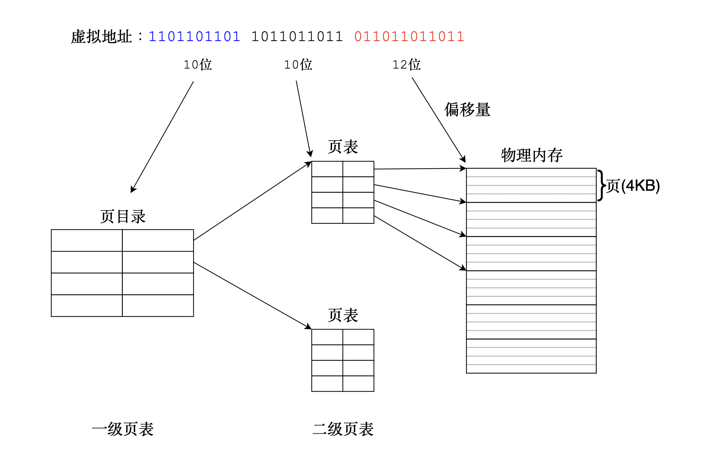

机器 IO 的基本单位是块（块：4kb)，在程序编译成可执行程序时也划分好了以 4KB 为单位加载到内存中。32 位机器下物理内存 4GB，4GB 以 4KB 为单位划分，一共$2^{20}$（1048576）个。大约 100 万个页目录条目（一级页表），那么大小也就不到 10MB。

一级页表必须存在，但是二级页表不一定。原因是操作系统不会全负荷地给每一个进程完整地提供所有空间大小的页表。当进程使用的虚拟空间比较少时，就会少分配一些页表管理内存。但是对于进程而言这是无感知的，因为操作系统会根据情况分配内存，在进程眼中它能使用的空间依然是 4GB，这就好像操作系统给进程画的 4GB 大小的饼，吃完了再申请。实际上并不会真的分配这么多给进程，否则机器内存就不够用了。

这是结构决定的。一级页表是虚拟内存到物理内存映射的基础，它包含指向二级页表的指针。如果没有一级页表，就无法进行虚拟地址到物理地址的转换。二级页表是可选的，它用于进一步细分虚拟地址空间。在某些情况下，一级页表可能已经足够满足需求，因此不需要使用二级页表。例如，在小型系统中，虚拟地址空间可能不够大，无需使用二级页表进行进一步细分。

二级页表要需要配合缺页异常才能做到节省内存，进程往往只需将一级页表保持到内存中，二级页表在缺页异常时再分配。

### 缺页异常

缺页异常（Page Fault）是指当软件试图访问已映射在虚拟地址空间中，但是并未被加载在物理内存中的一个分页时，由中央处理器的内存管理单元所发出的中断。这通常发生在虚拟内存系统中，当所需的数据不在物理内存中时，操作系统会将其从辅助存储器（如硬盘）调入物理内存。

缺页异常并不一定是错误。它是一种常见且必要的机制，用于利用虚拟内存来增加程序可用内存空间的操作系统，缺页异常对用户是无感知的。

原理：

缺页异常的原理是基于虚拟内存系统的工作原理。虚拟地址空间通常比物理内存空间大得多，这意味着程序可以使用比物理内存更多的内存。当程序访问一个虚拟地址时，操作系统会检查该地址是否已经被映射到物理内存中。如果该地址已经被映射，那么程序可以直接访问物理内存中的数据。但是，如果该地址尚未被映射，那么操作系统就会触发一个缺页异常。

当缺页异常发生时，操作系统会暂停程序的执行，并将所需的数据从辅助存储器（如硬盘）调入物理内存中。然后，操作系统会更新虚拟地址到物理地址的映射关系，并恢复程序的执行。这样，当程序再次访问该虚拟地址时，它就可以直接访问物理内存中的数据了。

# 3. 了解线程

每个进程都有它独立的 PCB，包括父子进程。但是这样有点浪费时间和资源，也会带来系统维护的开销。不恰当但容易理解的话：如果多个进程共享一个进程地址空间，那么这些进程就叫做线程。每个进程的 task_struct 就叫做线程。在同一个虚拟地址空间内，按照某种调度策略，将主进程的资源划分给不同的 task_struct。

> 因此，在 Linux 内核中，task_struct 不仅用于表示一个进程，还能表示线程。每个进程或线程都有一个对应的 task_struct 实例，其中包含了该进程或线程的许多重要信息。

## 3.1 实现流程

在 Linux 内核中，并没有严格地区分进程和线程，而它们也不过是人们取的名字，本质上还是执行指令，完成指派的任务，不同的是执行任务的效率有区别。线程的虚拟地址空间是从进程的地址中划分出来的，且共享页表等内核数据结构，创建线程和创建进程都要创建 task_struct 结构体对象。由于线程存在于进程中，所以把线程叫做“轻量级进程”，因为线程只要直接用进程申请好的资源就行，不用它自己申请，进程（主线程）会帮其他线程管理好自己的资源，线程要做的就是执行主线程指派给它的任务；主线程的主要任务就是管理好它内部的线程，给它指派任务，管理好自己这块进程空间的资源。

CPU 从来不关心执行流是线程还是进程的，它只关心 PCB，CPU 都是以 task_struct 为单位进程调度的（例如进程切换）。

## 3.2 两个角度

可以以两个视角看待进程和线程使用资源的关系：

- 用户角度：进程（主要）=相关数据结构+进程代码和数据。线程的资源不需要重新申请，从进程直接获取资源。
- 内核角度：进程是承担分配系统资源的基本实体。进程以进程的身份向操作系统申请资源，线程以线程的身份使用进程的资源，而不需要从操作系统申请获取，进程相当于线程的上级。

对于 CPU ，它只关心 task_struct（PCB），不关心它是进程还是线程的，所以在 Linux 下的 PCB “<=” 其他系统的 PCB，例如 Windows 系统为线程设计特殊的数据结构和调度策略，而 Linux 用进程的 PCB 模拟线程，以统一的方式管理进程和线程，因此管理的成本比其他系统稍高。这是 Linux 将线程称之为“轻量级进程”的另一个原因。

> Linux 中没有真正意义上的线程，它是一种处理执行流的方式，只不过从操作系统概念的层面上看这种执行方式属于线程。
>
> Windows 中有真正的线程，它有属于自己的数据结构，因此在 Windows 中线程是有实体的，就像进程一样。

对于单纯程是不矛盾的，相当于没有线程的存在，或者进程内部只有一个线程。对于多线程，就是进程内部含有多个执行流，即前者是后者的子集。

## 3.3 进程和线程资源共享

在 Linux 中，线程共享的环境包括：进程代码段、进程的公有数据（利用这些共享的数据，线程很容易的实现相互之间的通讯）、进程打开的文件描述符、信号的处理器、进程的当前目录和进程用户 ID 与进程组 ID。

# 4. 线程控制

## 4.1 线程库

Linux 并不像 Windows 操作系统一样使用由内核提供的线程库控制线程，自然不能通过系统调用创建线程或多线程，Linux 使用轻量级进程的概念统一管理进程和线程，它不提供线程专用的接口，只能提供轻量级进程的接口。

但是作为用户（程序员），从操作系统知识的完整度层面上，我们要学习线程的概念，但是这又和 Linux 的概念不太统一，理解和控制线程也就有了困难。所以 Linux 作者们考虑到用户的学习成本（Linux 的生存），做了一个违背祖宗的决定：在用户层实现了一台用户层多线程方案，以（动态或静态）库的方式开放接口供用户创建线程。

> 历史：
>
> 最初，Linux 系统并没有线程的概念，只有进程。后来，为了引入多线程，Linux 2.0~2.4 实现了一种称为 LinuxThreads 的多线程方式，它通过轻量级进程（LWP）来模拟线程。在 Linux 2.6 版本中，内核开始提供真正的内核线程支持，并引入了新的 NPTL（Native POSIX Thread Library）线程库。
>
> 相对于 LinuxThreads，NPTL 的主要优势在于：内核线程不再是一个进程，这就避免了很多进程模拟内核线程导致的语义问题；抛弃了管理线程，终止线程、回收线程堆栈等工作可以由内核来完成；由于不存在管理线程，所以一个进程的线程可以运行在不同的 CPU 上，从而充分利用了多处理器系统的优势；线程的同步由内核来完成，属于不同进程的线程之间也能共享互斥锁，因此可实现跨进程的线程同步。
>
> 因此，Linux 的线程库并不是内核直接提供的，而是由 glibc 库提供，并与内核紧密协作，以便利用内核提供的功能（例如调度和同步）来实现线程。这样，线程库可以在用户空间中实现，又能够充分利用内核提供的功能，这样可以提高灵活性和可移植性，并且可以减少内核的复杂性。

### POSIX 线程库

pthread，即 POSIX 线程（POSIX threads），它是一种跨平台的线程标准，定义了创建和操作线程的一组 API，是用户层的原生线程库。在 Linux 系统上，pthread 库是由 glibc 库提供的。

> 用户层/应用层是什么层？

- 用户层（也称为应用层）是操作系统体系结构中最高层，它位于内核层之上。在这一层，运行着用户应用程序，例如文本编辑器、浏览器和游戏等。这些应用程序通过系统调用与内核层进行交互，以请求操作系统服务，例如文件读写、网络通信和内存管理等。用户层与内核层之间有一个明确的边界，它们之间的交互是通过严格定义的接口进行的。这样可以保护内核层不受恶意或错误的应用程序影响，并且可以提高系统的稳定性和安全性。

> 原生线程库的原生是什么意思？

- 在 Linux 系统中，原生库通常指的是操作系统自带的库，它们是 Linux 系统的一部分，与内核紧密协作，为应用程序提供各种基础服务。

使用 pthread 库，可以创建多个线程来执行并行任务。每个线程都有自己的栈空间和寄存器，但是它们共享进程的地址空间和其他资源，例如文件描述符和全局变量。这样，线程之间可以方便地共享数据，并且线程切换的开销比进程切换要小。

> 库的实现也体现了线程是一种轻量级进程。

pthread 库提供了许多函数来管理线程，包括创建、终止、同步和调度等。例如，可以使用 `pthread_create` 函数来创建一个新线程，使用 `pthread_join` 函数来等待一个线程结束，使用 `pthread_mutex_lock` 和 `pthread_mutex_unlock` 函数来实现互斥锁，以保护关键区域。

此外，pthread 库还提供了一些高级特性，例如条件变量、读写锁和屏障等。这些特性可以帮助程序员更好地管理多线程程序。

POSIX 线程库（pthread 库）通常是作为操作系统的 C 库（例如 Linux 系统上的 glibc 库）的一部分提供的。这些 C 库既提供静态库版本，也提供动态库版本。通常情况下，程序会链接 C 库的动态库版本，这样可以减小程序的大小，并且可以在运行时共享动态库。但是，在某些情况下，需要链接静态库版本，以便生成独立的可执行文件。

## 4.2 创建线程

pthread_create 用于在进程中创建一个新线程。原型：

```c
#include <pthread.h>

int pthread_create(pthread_t *thread, const pthread_attr_t *attr,
                   void *(*start_routine) (void *), void *arg);
```

参数：

- thread：输出型参数，创建成功的线程 ID。
- attr：定义线程属性，如果为 NULL 则使用默认属性，一旦创建时使用了它，即使之后 attr 被修改，线程的属性也不会因此改变。
- start_routine：函数指针，表示线程例程，即线程要执行的函数。
- arg：pthread_create 函数的 arg 参数是传递给 start_routine 函数的唯一参数，新线程通过调用 start_routine 开始执行。

> 数据类型：
>
> - pthread_t 是用于唯一标识线程的数据类型。它由 pthread_create 返回，并由应用程序在需要线程标识符的函数调用中使用。如果 pthread_create 成功完成，thread 将包含创建的线程的 ID。如果失败，则不会创建新线程，且 thread 引用的位置的内容未定义。
> - pthread_attr_t 是线程属性对象，它用于在创建线程时确定新线程的属性。pthread_attr_init 函数用于使用默认属性值初始化线程属性对象。此调用之后，可以使用各种相关函数（列在 SEE ALSO 下）设置对象的各个属性，然后可以在一个或多个 pthread_create 调用中使用该对象创建线程。

返回值：

- 成功：返回 0；
- 失败：返回-1。

新线程通过调用 start_routine 开始执行，arg 作为 start_routine 的唯一参数传递。如果 pthread_create 成功完成，thread 将包含创建的线程的 ID。如果失败，则不会创建新线程。

>通过手册 man pthread_create 查看，有非常重要的一句话：
>
>```text
>DESCRIPTION
>       The  pthread_create()  function  starts  a  new  thread  in the calling process. 
>```

### 测试

如之前所说，主线程一般是 main 函数启动的进程，因此主线程被叫做 main 线程。

下面的代码通过主线程和它创建的 5 个线程一起打印进程的 PID：

```cpp
#include <iostream>
#include <pthread.h>
#include <unistd.h>
#include <string>
using namespace std;

void Print(const string& name)
{
	cout << name << ", PID: " << getpid() << endl;
}
void threadMission(void* args) // 参数就是传入的线程名字
{
	const string name = (char*)args;
	while(1)
	{
		Print(name); // 其他线程打印 PID
		sleep(1);
	}
}
int main()
{
	pthread_t tid[5]; // 用数组保存线程 ID
	char name[64];	  // 用缓冲区保存每个线程的名字
	for(int i = 0; i < 5; i++)
	{
		snprintf(name, sizeof(name), "%s -- %d", "thread", i);// 将序号格式化输入到数组
		pthread_create(tid + i, nullptr, threadMission, (void*)name); // 创建线程
		sleep(1);
	}
	while(1) // 主线程打印 PID
	{
		cout << "main thread, PID:" << getpid() << endl;
		sleep(3);
	}
	return 0;
}
```

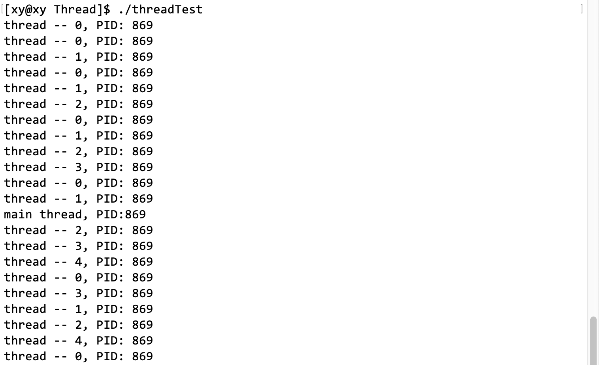

六个线程打印的进程 PID 都是相同的，说明所有线程都在进程内部执行。

> 可能遇到的问题：

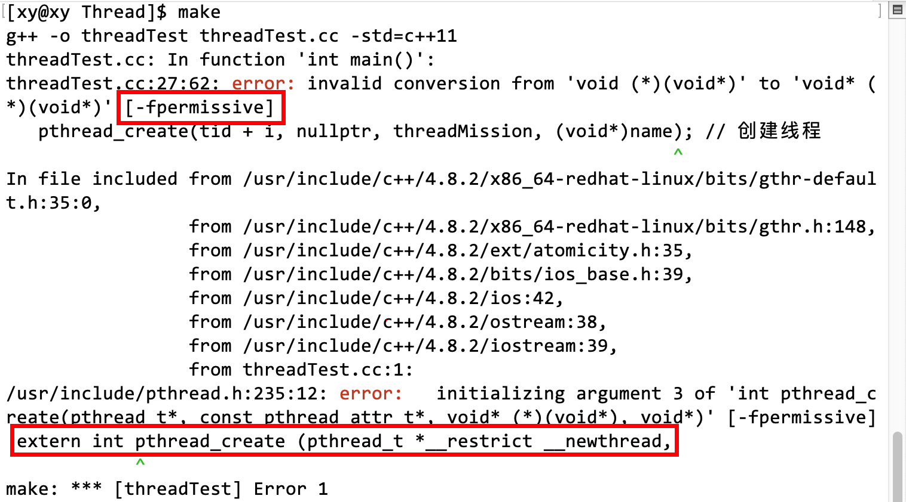

分别用 g++的 -fpermissive 和 -lpthread 两个选项，以表示忽略转换风险和链接动态版本的线程库。

可以用 ps 指令查看当前系统内的线程信息：
```shell
ps -aL | head -1 && ps -aL | grep threadTest
# -L 选项表示查看每个进程内的线程（轻量级进程，Light）。
```

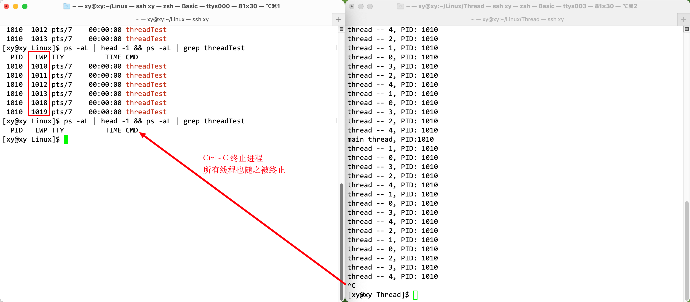

可以看到，当所有线程被调度执行打印任务时，它们的 PID 虽然相同（实际上它们的 PPID 也相同），但是它们的 LWP 不同。

LWP（Light Weight Process）是轻量级进程的 ID。在 Linux 中，用户层的线程与内核的 LWP 是一一对应的，实际上操作系统调度时采用的是 LWP，而非 PID，只不过我们之前接触到的进程只有它自己一个主线程，所以 PID 和 LWP 相等，因此使用 PID 和 LWP 调度单线程进程是等价的。

而且当终止进程时，所有线程也会随之退出。验证了线程的直接管理者是进程。

### 获取线程 ID

获取线程 ID 的方式有两种：

1. pthread_self 函数：返回调用线程的 ID。
2. 输出型参数：pthread_create 第三个参数返回的值。

pthread_self 原型：

```c
pthread_t pthread_self(void);
```

分别通过两种方式打印线程 ID：

```cpp
void Print(const string& name)
{
	cout << name << ", PID: " << getpid() << ", PPID: " << getppid() << ", TID: " << pthread_self() <<endl;
}
void threadMission(void* args) // 参数就是传入的线程名字
{
	const string name = (char*)args;
	while(1)
	{
		Print(name); // 其他线程通过调用打印 PID PPID TID
		sleep(1);
	}
}
int main()
{
	pthread_t tid[5]; // 用数组保存线程 ID
	char name[64];	  // 用缓冲区保存每个线程的名字
	for(int i = 0; i < 5; i++)
	{
		sleep(1);
		snprintf(name, sizeof(name), "%s -- %d", "thread", i);// 将序号格式化输入到数组
		pthread_create(tid + i, nullptr, threadMission, (void*)name); // 创建线程
		cout << name << "'s TID is" << tid[i] << endl; // 通过打印输出型参数打印线程 ID
	}
	while(1) // 主线程通过调用打印 PID PPID TID
	{
		cout << "main thread, PID:" << getpid() << ", PPID: " << getppid() << ", TID: " << pthread_self() << endl;
		sleep(3);
	}
	return 0;
}
```

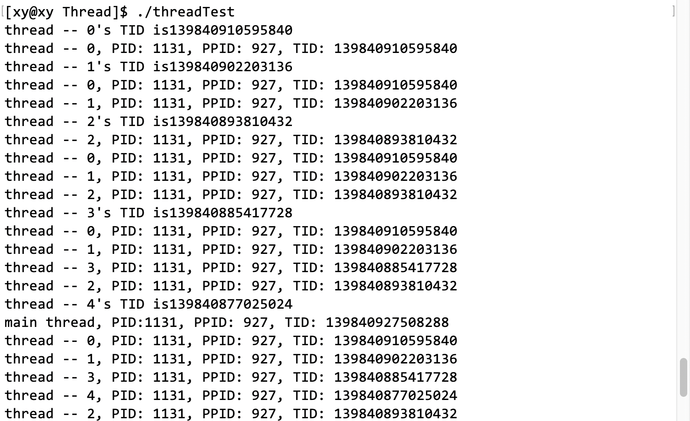

可以看到，两种方式打印的线程 ID 的值都是相同的。

值得注意的是，通过调用 pthread_self 获取到的线程 TID 是不同于通过 ps 指令查看到的线程 LWP，虽然它们都是线程 ID，但是 pthread_self 返回的线程 ID 是 POSIX 描述的线程 ID，而不是内核真正的线程 ID。它相对于进程中各个线程之间的标识号，对于这个进程内是唯一的，而不同进程中，每个线程的 pthread_self 可能返回是一样的。

也就是说，pthread_self 函数获得的是线程库提供的线程 ID，而 LWP 是内核中轻量级进程 ID，它们是一对一的关系。

## 4.3 等待线程

在 Linux 中，线程在进程内部实现，虽然线程能直接使用进程共享的部分资源，但是如果进程作为资源的管理者不回收线程的资源，也会造成类似僵尸进程的问题，导致线程的资源不能被释放，也不能被复用，即内存泄漏。

pthread_join 等待目标线程终止。原型：
```c
int pthread_join(pthread_t thread, void **retval);
```

参数：

- thread：被等待线程的 ID;
- retval：指向线程的退出信息，如果不关心它，可以设置为 NULL。

返回值：

- 成功：返回 0；
- 失败：返回错误码。

调用该函数的线程将挂起等待，直到 ID 为 thread 的线程终止。终止方式有下面几种：

- 如果目标线程正常终止，那么 pthread_join 会将目标线程的退出状态（即 ID 为 thread 的线程提供给 pthread_exit 的参数）复制到 retval 指向的位置。
  - return 语句返回；
  - ID 为 thread 的线程自己调用 pthread_exit 终止自己。
- 如果目标线程被取消，那么 PTHREAD_CANCELED 会被放置在 retval 指向的位置。PTHREAD_CANCELED 是一个值为-1 的宏。
  - 其他线程调用 pthread_cancel 函数终止 ID 为 thread 的线程。

### 测试 1

下面通过 pthread_create 创建一个线程，让线程执行完打印任务后，主线程用 pthread_join 等待进程：

```cpp
void* threadMission(void* args) // 参数就是传入的线程名字
{
	const string name = (char*)args;
	int i = 5;
	cout << "5 秒后目标进程退出" << endl;
	while(i--) // 目标进程正在执行任务
	{
		cout << "目标进程 [" << name << "] 正在运行。.." << i << endl; 
		sleep(1);
	}
	cout << "目标进程退出" << endl;

	return nullptr;
}
int main()
{
	pthread_t tid;
	pthread_create(&tid, nullptr, threadMission, (void*)("thread 1")); // 创建线程
	pthread_join(tid, nullptr); // 以阻塞方式等待目标线程退出
	cout << "主线程等待目标进程成功，已退出" << endl;

	return 0;
}
```

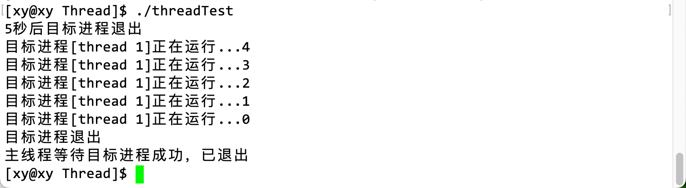

主线程在等待目标线程退出时，主线程会等待目标线程执行完毕，否则会一直阻塞式地等待，就像进程使用 wait 阻塞式等待目标进程一样。

### 测试 2

> 对于 pthread_create 第三个参数（线程函数），是进程指派给线程的任务，它是一个回调函数，那么它的返回值是返回给谁呢？

这个函数的返回值可以通过 pthread_join 函数的第二个参数来获取，它是一个输出型参数。当你调用 pthread_join 来等待线程退出时，这个返回值会被存储在 pthread_join 的第二个参数所指向的内存中。

```cpp
void* threadMission(void* args)
{
    // ... 同上
	return (void*)10;
}
int main()
{
	pthread_t tid;
	pthread_create(&tid, nullptr, threadMission, (void*)("thread 1")); // 创建线程

	void* ret = nullptr; // 创建输出型参数，获取 threadMission 的返回值
	pthread_join(tid, &ret); 
    
	cout << "主线程等待目标进程成功，已退出，退出信息：" << (int)ret << endl;
	
	return 0;
}
```

中间两句就是通过输出型参数获取 pthread_create 的线程函数的返回值的操作。

值得注意的是，pthread_create 的线程函数的返回值是指针类型，而我们通过 pthread_join 使用输出型参数获取它，本身就需要一层指针，所以 pthread_join 的第二个参数是二级指针类型，用来接收指针。

> 注意，这里使用指针的目的不是获取指针指向的内容，而是要得到指针本身的值。事实的确如此，上面的操作也没有对指针进行解引用操作（*）。
>
> threadMission 的返回值被强转为 void* 类型，只是为了让它符合返回值类型，在打印时强转回来。因为 void* 类型意味着它可以指向任何类型的数据。这种强制转换并不总是安全的。如果线程函数返回的不是一个整数值，那么这种强制转换可能会导致未定义行为。如果机器是 64 位，那么需要强转为 long long，否则会发生截断。

通过上面的代码可以验证，线程函数的返回值一般会返回给主线程，主线程通过 pthread_join 的第二个参数获取。

另外，void* 的返回值甚至能支持返回一个数组：

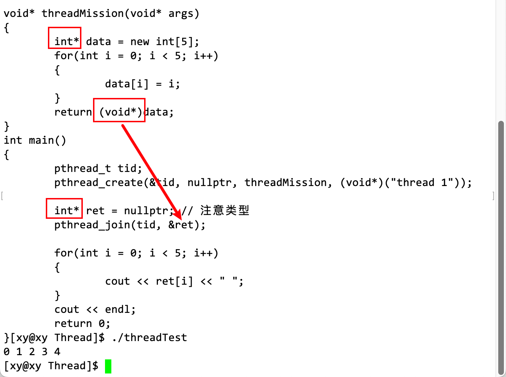

## 4.4 终止线程

在 Linux 中，有几种方法可以终止线程：

- 线程执行 return 语句，这与 main 函数结束类似。
- 线程调用 pthread_exit 函数，终止自己，这与调用 exit 返回类似。
- 目标线程被另一个线程通过 pthread_cancel 函数取消，这与通过 kill 函数发送 SIGKILL 信号类似。

如果进程终止，那么进程内部所有线程也会终止。这是可以理解的，线程的资源来自进程，如果资源的管理者都终止了，线程不退出的话也不合理。

### return 终止线程

下面将在主线程内每隔 5 秒创建一个线程，在线程函数中 3 秒后退出：
```cpp
void* threadMission(void* agrs)
{
	int i = 3;
	const string name = (char*)agrs;
	while(i--)
	{
		sleep(1);
		cout << "线程：" << name << " 在"<< i << "秒后退出。.." << endl;
	}
	cout << "线程：" << name << " 已退出！" << endl;
	return nullptr;
}
int main()
{
	pthread_t tid[5];
	char name[64];
	for(int i = 0; i < 5; i++)
	{
		snprintf(name, sizeof(name), "%s -- %d", "thread", i);
		pthread_create(tid + i, nullptr, threadMission, (void*)name);
		sleep(5);
		
	}	
	cout << "主线程退出！" << endl;
	return 0;
}
```

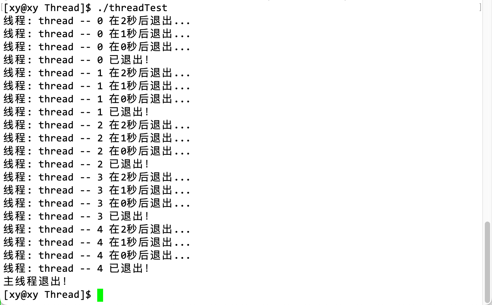

 每隔五秒创建线程，线程 3 秒后退出，是为了让结果更清晰，还能用含有 ps 指令的脚本循环打印线程信息：

```shell
while :; do ps -aL | head -1 && ps -aL | grep threadTest | grep -v grep;echo "#";sleep 3;done
```


可见，LWP 为 3163 的线程始终存在，说明它就是主线程，其 LWP 和 进程的 PID 是相同的，并且当所有线程退出以后，主线程也会随之退出。

### pthread_exit 函数终止线程

pthread_exit 函数的功能是终止指定线程。原型：

```c
void pthread_exit(void *retval);
```

参数 retval：线程退出时的退出信息。接受一个 void 指针作为参数，该指针指向的数据将作为线程退出时的返回值。如果线程不需要返回任何数据，将参数置为 NULL 即可。

> 注意，pthread_exit 函数不能返回一个指向局部数据的指针，局部变量存储在栈区，出了函数作用域就会被销毁，因此很可能使程序运行结果出错甚至崩溃。但是可以返回堆区或全局区的数据，即可以返回指向全局变量或 由 malloc 分配的内存。

在线程中调用 pthread_exit 函数可以终止线程自身。如果主线程中调用 pthread_join 函数阻塞等待线程结束并释放资源，pthread_exit 的返回值会传给 pthread_join。如果设置线程为分离属性，线程中调用 pthread_exit 退出线程后系统会自动释放资源。

> 为什么它的返回值（指向信息的指针）可以被 pthread_join 获取？

当一个线程调用 pthread_exit 函数并传递一个指针作为参数时，这个指针会被存储在操作系统的线程控制块中。当主线程调用 pthread_join 函数来等待这个线程结束并获取它的返回值时，操作系统会检索这个指针并将其传递给主线程。

> 在 Linux 操作系统中，每个进程都有一个 PCB，而每个线程都有一个 TCB（Thread Control Block）。PCB 和 TCB 都是操作系统用来管理和调度进程和线程的重要数据结构。在此不做过多讨论，因为它的作用和 PCB 是类似的。

该函数无返回值，跟进程一样，线程结束的时候无法返回它的调用者（自身）。
pthread_exit 或者 return 返回的指针所指向的内存单元必须是全局的或者是用 malloc 分配的，不能在线程函数的栈上分配，因为当其他线程得到这个返回指针时，线程函数已经退出了。

创建线程后，在线程内部调用 pthread_exit 函数终止进程：

```cpp
void* threadMission(void* agrs)
{
	int i = 3;
	const string name = (char*)agrs;
	while(i--)
	{
		sleep(1);
		cout << "线程：" << name << " 在"<< i << "秒后退出。.." << endl;
	}
	cout << "线程：" << name << " 已退出！" << endl;
	pthread_exit((void*)1234); // 线程终止
}
int main()
{
	pthread_t tid[3];
	char name[64];
	for(int i = 0; i < 3; i++)
	{
		snprintf(name, sizeof(name), "%s -- %d", "thread", i);
		pthread_create(tid + i, nullptr, threadMission, (void*)name);
		void* ret = nullptr;
		pthread_join(tid[i], &ret);
		cout << "主线程打印获取线程：" << name << " 的退出码：" << (int)ret << endl;
		sleep(1);
	}	
	cout << "主线程退出！" << endl;
	return 0;
}
```


可以通过 pthread_join 线程等待，获取线程的退出信息。

>  在这段代码中，临时值 1234 是一个字面量，它是一个右值，它不能被赋值，也没有持久的存储地址。
>
> 当 1234 被强制转换为 void* 类型并作为 pthread_exit 函数的参数传递时，它不会被存储在堆区或任何其他内存空间中。相反，它只是一个整数值，被解释为一个指针并传递给 pthread_exit 函数。当主线程调用 pthread_join 函数来等待这个线程结束并获取它的返回值时，这个整数值会被传递给主线程。主线程可以通过将其强制转换回整数类型来访问它，仅此而已。
>
> 需要注意的是，这种用法并不安全，因为将一个整数强制转换为指针类型可能会导致未定义行为。更好的做法是使用动态分配的内存来存储返回值，并将指向该内存的指针传递给 pthread_exit 函数。
>
> 补充：C 语言风格的强制类型转换只改变了值的类型，而不改变它的左值或右值属性。

如果在线程中使用 exit 退出呢？

```cpp
void* threadMission(void* agrs)
{
	// ... 同上
	//pthread_exit((void*)1234); // 线程终止
	exit(1234);
}
```

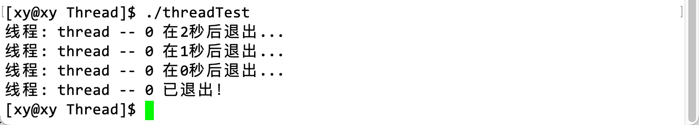

可以看到只要一个线程使用了 exit 退出，整个进程都会退出，而且主线程后面的执行流也未被执行。因为 exit 的作用是终止进程而不是终止线程，如果在任何线程中使用了它，就等价于在进程中使用了 exit 终止进程。

### pthread_cancel 函数终止线程

pthread_cancel 函数用于取消一个线程的执行。原型：

```c
int pthread_cancel(pthread_t thread);
```

参数 thread：要取消的线程的线程 ID，以向指定 ID 的线程发送一个取消请求。

返回值：返回值为 0 表示成功，否则表示失败。如果失败，返回值会是一个错误代码，表示调用失败的原因。例如，如果指定的线程 ID 无效，返回值将是 ESRCH。

> 当目标线程收到取消信号时，会返回-1 给主线程。

需要注意的是，即使 pthread_cancel 函数成功返回，也不能保证线程已经终止。线程可以选择忽略取消请求，或者延迟处理取消请求。因此，在调用 pthread_cancel 函数后，应该使用 pthread_join 函数来等待线程结束。

下面的代码会创建三个线程，并在执行线程函数 threadMission 打印一些语句之后再调用 pthread_cancel 函数来取消它们。

```cpp
void* threadMission(void* agrs)
{
	int i = 3;
	const string name = (char*)agrs;
	while(i--)
	{
		sleep(1);
		cout << "线程：" << name << " 在"<< i << "秒后退出。.." << endl;
	}
	return (void*)5678;
}
int main()
{
	pthread_t tid[3];
	char name[64];
	for(int i = 0; i < 3; i++)
	{
		snprintf(name, sizeof(name), "%s -- %d", "thread", i);
		pthread_create(tid + i, nullptr, threadMission, (void*)name);
		sleep(5); // 为了让线程能在取消前打印

		pthread_cancel(tid[i]); // 取消线程
		cout << "线程：" << name << " 已退出！" << endl;
		void* ret = nullptr;
		pthread_join(tid[i], &ret);
		cout << "主线程打印获取线程：" << name << " 的退出码：" << (int)ret << endl;		
	}	
	cout << "主线程退出！" << endl;
	return 0;
}
```

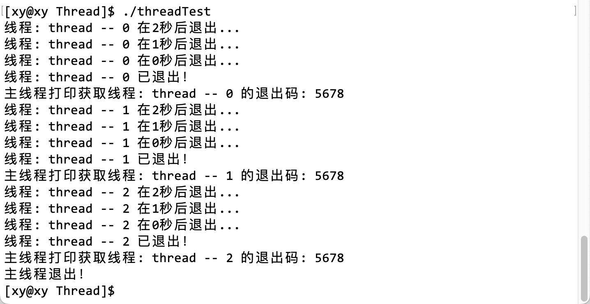

值得注意的是，如果在使用 pthread_create 创建线程后马上用 pthread_cancel 取消线程，线程可能还没有机会开始执行线程函数 threadMission 就已经收到了取消请求。因此，它们可能根本没有机会执行 threadMission 函数中的打印语句。由于 pthread_cancel 函数只是向线程发送一个取消请求，而不保证线程会立即终止，所以线程可能会在收到取消请求之前执行一些操作。事实上也是如此，如果将 sleep 语句注释：

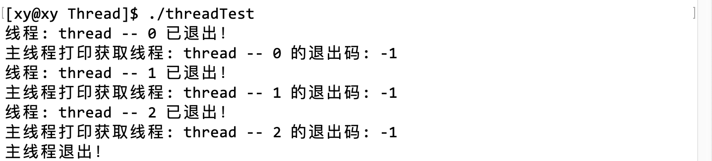

并且线程的退出码是-1，这说明 pthread_cancel 函数紧跟在 pthread_create 函数之后，会让线程没有时间执行线程函数中的语句（因为我自定义了返回值是 5678）。所以在 pthread_cancel 函数和 pthread_create 函数之间的 sleep 的作用是延迟取消进程。

还可以通过之前使用的脚本查看线程信息，为了能不留空隙地打印，在注释掉  pthread_cancel 函数和 pthread_create 函数中间的 sleep 之后，在每次循环的最后 sleep 2 秒，每 1 秒打印线程信息：


可以发现，每次只会打印 1 个线程的信息，它是主线程，即使使用 pthread_create 创建了线程，只要立刻 pthread_cancel 取消线程，那么它就不会被创建。

> 按常理来说，代码应该是由上至下从左至右依次执行的，这是操作系统的策略吗？

**在多线程程序中，不同线程之间的执行顺序是不确定的，取决于操作系统的调度策略。**

在上面的代码中，main 函数中的代码确实是从上到下顺序执行的。但是，当 main 函数调用 pthread_create 函数创建一个新线程时，新线程会并发地运行。这意味着新线程和 main 函数中的代码可能会交替执行，也可能同时执行（如果系统有多个处理器）。

由于操作系统可以自由调度线程的执行顺序，所以新线程可能会在 main 函数调用 pthread_cancel 函数之前、之后或同时开始执行。因此，在多线程程序中，不同线程之间的执行顺序是不确定的。如果希望在线程之间强制执行顺序，可以使用同步原语（如互斥锁、信号量等）来协调它们的执行。

> 为什么这么说呢？实际上面的示例代码虽然创建了多个进程，但都是在同一个循环中创建，并取消的，也就是每次只创建了一个线程。因为我想让打印出来的结果比较工整，如果分别创建和取消线程，那么打印出来的语句会比较混乱，因为不同线程的执行顺序是不确定的。

### 补充

#### 取消线程的注意事项

其他线程可以在线程函数中通过 pthread_exit 和 pthread_cancel 终止自己，但这样做总感觉怪怪的，因为线程的直接管理者是主线程，所以通常情况下其他线程由主线程创建，那就由主线程取消，这是符合逻辑的。

创建线程后立马取消它，通过测试我们知道，由于操作系统的调度策略，这并不会真正创建进程（在 Linux 中），取消线程的前提是线程已经被创建了，但是线程可能并未被创建，如果对一个未被创建的进程取消，可能出现未定义行为。因为就执行流而言，所有线程（包括主线程）的调度是不确定的，这也是我在一些示例代码中让线程做点事情（例如打印）的原因。上面这么做只是为了示例，这种做法本身是无意义的，也很少有这样的需求。

> 一个不恰当的体会：取消线程这个操作就好像我们感觉某个线程做的不错，差不多了就踹开它，妥妥的“工具人”。

除此之外，对于取消线程这个操作，其他线程和主线程的地位是相同的，其他线程也能取消主线程（非常不推荐）。虽然主线程是其他线程的管理者，其他线程的资源也由主线程而来，但是主线程被其他线程取消后，其他线程仍然能执行线程函数，完成各自的执行流后才会退出。只不过主线程（即 main 函数）在被取消后，中断之后的代码就无法被执行了。

> 为什么其他线程可以取消主线程？

在 Linux 中，线程之间是平等的，没有主次之分。每个线程都可以取消其他线程，包括主线程。这是因为线程之间共享进程的资源，包括内存空间、文件描述符和信号处理等。这样，一个线程可以调用 pthread_cancel 函数来取消另一个线程。

> 为什么线程的 ID 那么长？

我们知道，线程的 ID 本质上是一个地址，这个地址的 32 个比特位（32 位）被分为 3 部分，以此讲虚拟地址通过不止一层的页表映射到物理内存地址。内核只负责管理和调度线程，而线程是由用户层的 pthread 库提供的，因此线程资源的管理是在用户层面的。

#### pthread 库相关

对于磁盘中的动态 pthread 库，在多线程程序运行时，需要将动态库加载到物理内存中。多线程程序需要通过页表映射到物理空间中，才能访问到 pthread 库中的代码。因为动态库被加载到进程地址空间中的共享区，那么程序调用 pthread 库函数时，只要从代码区跳转到共享区即可；如果执行流使用了系统调用，那么会通过内核级页表跳转到内核地址空间中。例如，当线程需要进行 I/O 操作、创建新线程或进程 (fork)、改变进程属性等操作时，它会通过系统调用来实现。

> 我知道每个 PCB/TCB 都要被操作系统调度，但是整个进程地址空间中只有一个栈区，线程在运行时也需要自己私有的栈，寄存器只有一份吗？是如何保证每个小栈区都是线程独占的？

在 Linux 中，每个线程都有自己的栈空间。当创建一个新线程时，操作系统会为该线程分配一个独立的栈空间。这个栈空间与进程的栈空间是分开的，每个线程都有自己独立的栈指针寄存器，用来指向自己的栈空间。

> 这里的栈指针寄存器指的是 CPU 中的硬件寄存器。计算机中的寄存器数量是有限的，但是操作系统可以通过上下文切换来实现多个线程共享同一个寄存器。

当线程被调度执行时，操作系统会将线程的栈指针寄存器加载到 CPU 中，这样线程就可以访问自己的栈空间了。当线程被切换出去时，操作系统会保存线程的栈指针寄存器的值，以便下次调度该线程时能够恢复它的栈指针寄存器。

> 线程的栈是内核提供/维护的还是用户层的 pthread 库提供/维护的

在线程创建时，线程的栈空间是由操作系统内核分配的。当使用 pthread_create 函数创建一个新线程时，该函数会调用 clone 系统调用来创建一个新的线程。在这个过程中，操作系统内核会为新线程分配一个独立的栈空间。

在线程运行期间，线程栈的维护是由用户层的程序来完成的。当线程调用函数时，它会在栈上分配空间来存储函数的局部变量和返回地址。当函数返回时，线程会释放栈上分配的空间。

在线程库中，提供了各种结构，如 struct pthread 等，其中包括线程的栈，即线程栈是由库提供的，为了让线程迅速找到它自己的属性字段，将线程在库内部相关属性集合的起始地址作为线程的 tid（实际上就是一个结构体，创建进程会返回这个类型的结构体，以表示属性集合的起始地址），这就是 tid 的由来。它是属于库层面上的 “ID”。

> 如何保证创建线程时能够在进程地址空间中，并以共享区中的一个地址作为栈的起始空间？

当使用 pthread_create 函数创建一个新线程时，该函数会调用 clone 系统调用来创建一个新的线程，同时内核会为新线程分配一个独立的栈空间。这个栈空间是在进程的地址空间中分配的，它与进程的其他内存区域（如代码区、数据区和堆区）是分开的。

操作系统内核会将新线程的栈指针寄存器设置为新分配的栈空间的起始地址。这样，当新线程被调度执行时，它就可以访问自己的栈空间了。

> 如果每个线程都在库中维护，那么主线程自己的栈区谁来维护？

主线程的栈空间是由操作系统内核在创建进程时分配的，两者互不冲突。如果只有一个执行流，就使用内核提供的栈区。在进程运行期间，主线程栈的维护是由用户层的程序来完成的。当主线程调用函数时，它会在栈上分配空间来存储函数的局部变量和返回地址。当函数返回时，主线程会释放栈上分配的空间。

#### 进程替换造成的影响

如果在线程中调用 execl 执行进程替换，会替换页表中虚拟地址的部分。对于线程，虚拟地址的内容是属于当前主线程的，一旦替换以后，所有代码将被替换，原本进程中所有其他线程都将停止执行它们各自的执行流。可以测试：主线程先执行 5 秒，然后让新线程替换进程，5s 后线程就会全部退出，ps axj 也找不到了任何线程相关信息。

任意一个线程调用 execl，等价于进程替换，相当于 exit。

#### 寄存器

寄存器是计算机中的硬件部件，它是一种高速存储器，位于 CPU 内部。寄存器用来存储指令、数据和地址等信息。由于寄存器位于 CPU 内部，所以它的访问速度非常快。

## 4.5 线程分离

线程分离是指线程的资源由系统回收，而不需要主线程调用 pthread_join 来回收。

在退出系统时，系统会自动回收资源。这样可以防止主线程因为调用 pthread_join 而被堵塞，无法处理其他事务。有两种方法可以实现线程分离。一种是使用函数 pthread_detach 来实现线程分离。另一种是通过设置线程属性为 PTHREAD_CREATE_DETACHED 来实现线程分离（暂不讨论）。

> 线程分离是相对于主线程而言的。

### pthread_detach 函数分离线程

pthread_detach 函数用于实现线程分离，不再受主线程管理，由系统接任。原型：

```c
int pthread_detach(pthread_t thread);
```

参数 thread：被指定要分离的线程的 ID。

返回值：成功返回 0；失败返回错误信息（非 0）。

pthread_detach 函数可以由主线程或其他线程调用。下面的代码在其他线程中的线程函数执行分离线程操作，并且在每个线程中打印一个全局变量：

```cpp
int global_val = 10;

void* threadMission(void* agrs)
{
	pthread_detach(pthread_self()); // 分离线程
	
	int i = 3;
	const string name = (char*)agrs;
	while(i--)
	{
		sleep(1);
		cout << "线程：" << name << " 在"<< i << "秒后退出。.." << endl;
	}
	cout << "线程：" << name << " global_val: "<< global_val << " : " << "&global_val: " << &global_val << endl;
	return (void*)789;
}
int main()
{
	pthread_t tid[3];
	char name[64];
	for(int i = 0; i < 3; i++)
	{
		snprintf(name, sizeof(name), "%s -- %d", "thread", i);
		pthread_create(tid + i, nullptr, threadMission, (void*)name);
		sleep(5); // 为了让线程能在取消前打印

		cout << "主线程：" << " global_val: "<< global_val << " : " << "&global_val: " << &global_val << endl;
	}	
	cout << "主线程退出！" << endl;
	return 0;
}
```

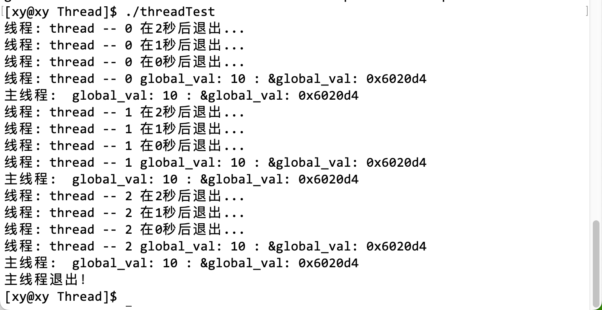

当线程分离后，主线程就不能再使用 pthread_join 等待线程了，如果在目标线程内部对这个全局变量自增：

```cpp
void* threadMission(void* agrs)
{
    // ...
    pthread_detach(pthread_self()); // 分离线程
	global_val++;
    // ...
}
int main()
{	
    // ...
    int ret = pthread_join(tid + i, nullptr);
    cout << "分离线程返回值：" << ret << endl;
	// ...
	return 0;
}
```

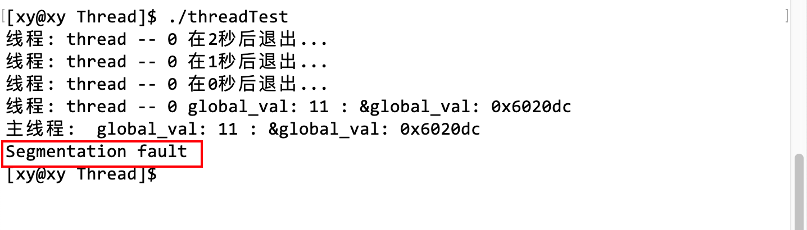

当线程被分离以后，它就不能获取进程内的资源了，换句话说，目标线程的直接管理者就是操作系统而不是它所在的进程了。所以主线程就不能等待它。如果把 pthread_join 相关语句注释掉，那么就不会出现段错误，而且能够正常打印全局变量被修改后的值。

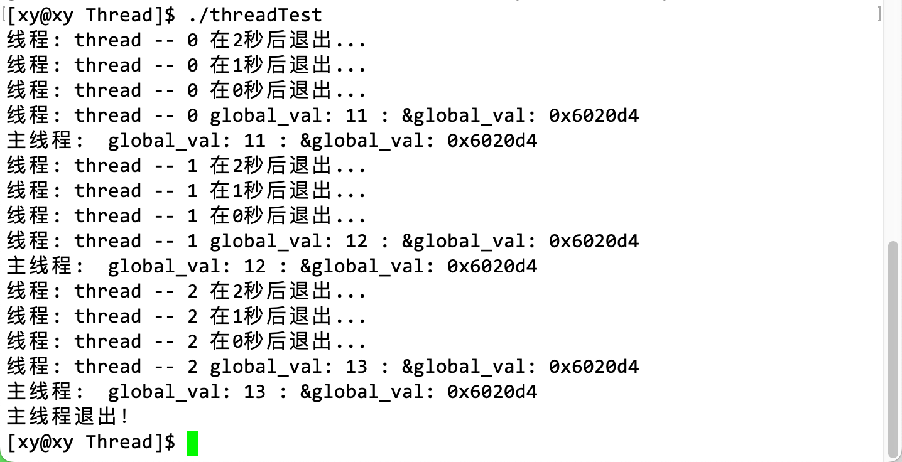

类似的，如果主线程先退出了，那么其他线程再分离就没有意义了。因为当主函数返回或调用 exit 时，系统将终止进程和该进程中运行的所有线程。如果希望分离线程并想让它们继续运行，你必须只结束主线程，而不是进程，这也是 pthread_exit 存在的原因，它允许只终止任意一个线程。

#### __thread

__thread 是 GCC 提供的一种线程局部存储（Thread Local Storage，TLS）技术。它允许声明一些变量，这些变量在线程之间是独立的，每个线程都有自己的一份拷贝（编译时）。

当在一个变量前面加上 __thread 关键字时，该变量就成为了线程局部变量。每个线程都有自己独立的一份拷贝，线程之间互不影响。这样可以在多线程程序中使用全局变量而不必担心同步问题了。

例如将上面的全局变量用 __thread 修饰：

```cpp
__thread int global_val = 10;

void* threadMission(void* agrs)
{
	global_val++;
	int i = 3;
	const string name = (char*)agrs;
	cout << "线程：" << name << " global_val: "<< global_val << " : " << "&global_val: " << &global_val << endl;
	return (void*)789;
}
int main()
{
	pthread_t tid[3];
	char name[64];
	for(int i = 0; i < 3; i++)
	{
		sleep(1);
		snprintf(name, sizeof(name), "%s -- %d", "thread", i);
		pthread_create(tid + i, nullptr, threadMission, (void*)name);
	}	
	cout << "主线程：" << " global_val: "<< global_val << " : " << "&global_val: " << &global_val << endl;
	cout << "主线程退出！" << endl;
	return 0;
}
```

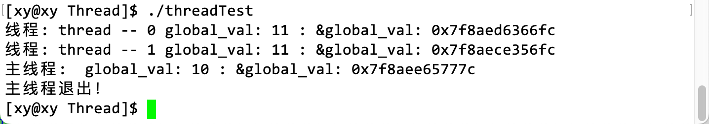

另外，在主进程永不退出或超长时间不退出时（后台服务），分离其他线程是有很有意义的，可以避免内存泄漏。线程分离和进程不 wait 或不 waitpid 是类似的。

线程分离和进程不调用 wait 或 waitpid 函数有一些相似之处。当一个线程被分离后，它结束运行时会自动释放所有资源，无需其他线程调用 pthread_join 函数来等待它结束。类似地，当一个进程不调用 wait 或 waitpid 函数来等待子进程结束时，子进程结束运行后会变成僵尸进程，直到父进程退出或显式等待它结束。

但是，这两者之间也有一些区别。当一个线程被分离后，它结束运行时会自动释放所有资源，而不会变成僵尸线程。但是，当一个进程不调用 wait 或 waitpid 函数来等待子进程结束时，子进程结束运行后会变成僵尸进程，占用系统资源，直到父进程退出或显式等待它结束。

# 5. 理解线程

上面介绍了几个线程相关的的基本概念，以及演示了控制线程的方法，下面将从 Linux 中线程的实现原理理解 Linux 中的线程。

## 5.1 线程共享进程的资源

进程是承担分配系统资源的基本实体，线程是调度的基本单位。这是我们对线程和进程从资源分配和调度策略上的高度总结，我们知道进程是线程的直接管理者，线程的资源从它所在的进程而来，然而，并非进程所有资源都能被线程使用。

> 每个家庭就像一个进程，当家的就是主线程，其他成员是其他线程，虽然大家都有各自的任务，但是最终目的都是统一的，是让家庭幸福。每个线程就像每个家庭成员，共享着房子中的大部分资源，例如空间、食物。但是每个成员也有属于自己私有的空间，例如自己的房间、自己写的日记等，线程也是一样的，它们共享着进程的一部分资源，也同时具有自己私有的数据。

上面所有线程打印全局变量的例子也说明了全局区是被所有线程共享的，除此之外还有线程共享了进程的许多资源，包括进程的堆区、进程代码段、进程的公有数据、进程打开的文件描述符、信号的处理器、进程的当前目录和进程用户 ID 与进程组 ID 等。不过这些在本节暂时不重要。

> 虽然上面以进程和线程为例，但言外之意是所有线程共享了许多资源。这些共享的资源并不是其他线程共享了主线程的资源，而是所有线程都共享了同一进程中的这些资源。也就是说，所有线程都可以访问这些共享的资源，而不仅仅是主线程。

==每个线程最重要的两种资源：一组寄存器和栈区。==每个线程都有自己独立的、私有的栈区，用于保存函数运行时的信息，如栈帧。此外，函数运行时需要额外的寄存器来保存一些信息，如部分局部变量（存储在栈区），esp 和 ebp 寄存器用来标记函数栈帧的范围，这些寄存器也是线程私有的。

> 尽管栈区是线程的私有数据，但由于栈区没有添加任何保护机制，一个线程的栈区对其它线程是可以见的，也就是说我们可以修改属于任何一个线程的栈区。

> 进程的地址空间中只有一个栈区吗，如何分配栈区给线程？

进程的地址空间中不止有一个栈区，进程的地址空间中包含所有线程的栈区，每个线程的栈区都是独立的。当创建一个新线程时，操作系统会为该线程分配一个新的栈区。这些栈区在进程的地址空间中是分开的，每个栈区都属于特定的线程。即进程地址空间的栈区是由所有线程的栈区组成的。

> 我知道，在 Linux 中，CPU 切换执行流是不关心它是线程还是进程的，那为什么切换线程的成本反而更低呢？

在 Linux 中，切换线程的成本比切换进程的成本更低，主要是因为线程之间共享了许多资源，这些共享的资源使得线程之间切换时不需要重新加载这些资源，从而降低了切换成本。

另外，在切换线程时，只需要保存和恢复线程私有的上下文信息，如程序计数器、栈指针和寄存器等。而在切换进程时，需要保存和恢复更多的上下文信息，包括虚拟内存映射、文件描述符和信号处理等，不需要重新加载这些资源。这也使得切换线程的成本比切换进程的成本更低。

结论：==线程切换成本更低的主要原因是线程之间共享了许多资源。==

> 这得益于 CPU 中的哪个硬件？

首先，在切换线程时，不需要切换进程的地址空间和页表，只要更改 CPU 寄存器中的值。其中 CPU 中的 Cache 硬件相当于内存和 CPU 之间的缓存区。CPU 将指令 load 到 CPU 中，距离还是很远的，如果每次只读取一条指令，会导致效率非常低。所以 CPU 一般会一次性读取很多条指令先存放在它内部的 Cache 硬件中。根据局部性原理，很大概率 CPU 会执行上一条指令附近的指令，那么刚好就能从它身边的 Cache 中取出，速度就快起来了。

线程切换成本比进程切换成本更低是由于操作系统在设计上对线程和进程进行了不同的处理，而不是由于 CPU 中的某个硬件实现的。

### 补充

**CPU 缓存**

CPU 缓存（Cache）是一种高速存储器，位于 CPU 和内存之间。它用于暂存最近访问过的内存数据，以便 CPU 在下次访问相同数据时能够更快地获取。由于 CPU 缓存比内存更快，所以当 CPU 需要访问内存数据时，它会首先检查缓存中是否有所需数据。如果缓存中有所需数据，那么 CPU 就可以直接从缓存中获取数据，而不需要访问内存。这样就可以大大减少访问内存的时间，从而提高程序运行速度。

CPU 缓存通常分为多级，如 L1、L2 和 L3 缓存。L1 缓存位于 CPU 内部，速度最快但容量最小；L2 缓存位于 CPU 外部，速度较快但容量较大；L3 缓存位于主板上，速度较慢但容量最大。当 CPU 需要访问内存数据时，它会首先检查 L1 缓存，如果没有找到所需数据，再检查 L2 缓存，最后检查 L3 缓存。如果仍然没有找到所需数据，那么 CPU 就需要访问内存。

当然，CPU 缓存并不是万能的。它只能暂存有限的数据，所以当程序需要访问的数据不在缓存中时，CPU 仍然需要访问内存。此外，由于缓存和内存之间需要保持一致性，所以当内存数据发生变化时，缓存也需要进行更新。这些都会影响程序运行速度。

**CPU 高速缓存命中率**

CPU 高速缓存命中率（Cache Hit Rate）是指 CPU 在访问内存数据时，能够在缓存中找到所需数据的比例。它是衡量 CPU 缓存效率的一个重要指标。

当 CPU 需要访问内存数据时，它会首先检查缓存中是否有所需数据。如果缓存中有所需数据，那么就称为一次缓存命中（Cache Hit），此时 CPU 可以直接从缓存中获取数据，而不需要访问内存。如果缓存中没有所需数据，那么就称为一次缓存未命中（Cache Miss），此时 CPU 需要访问内存来获取数据。

CPU 高速缓存命中率通常用百分比来表示，计算公式为：缓存命中次数 / （缓存命中次数 + 缓存未命中次数）。高速缓存命中率越高，说明 CPU 在访问内存数据时能够更多地从缓存中获取数据，从而提高程序运行速度。

### 小结

在 Linux 中，线程切换的成本相对较低，因为它不需要切换虚拟内存空间。这意味着在线程切换期间，虚拟内存空间保持不变，而在进程切换期间则不是这样。两种类型都涉及将控制权交给操作系统内核来执行上下文切换。执行上下文切换的过程以及寄存器切换的成本是执行上下文切换的最大固定成本。

另一个模糊的成本是上下文切换会影响处理器的缓存机制。线程切换与 CPU 高速缓存命中率有关，因为线程切换不需要更改虚拟内存空间，这意味着 CPU 高速缓存中的数据仍然有效并且可以继续使用。基本上，当 CPU 进行上下文切换时，处理器缓存中“记忆”的所有内存地址实际上都变得无用。当您更改虚拟内存空间时，处理器的转换后备缓冲区（TLB）或等效内容会被刷新，使得一段时间内的内存访问变得更加昂贵。这在线程切换期间不会发生。

如果进程切换，Cache 会立即失效，新进程只能重新缓存。

## 5.2 线程的优点

在 Linux 中，线程有很多优点。例如，创建一个新线程的代价要比创建一个新进程小得多，释放成本也更低。与进程之间的切换相比，线程之间的切换需要操作系统做的工作要少很多。此外，线程占用的资源要比进程少很多。

线程还能充分利用多处理器的可并行数量。在等待慢速 I/O 操作结束的同时，程序可执行其他的计算任务。计算密集型应用，为了能在多处理器系统上运行，将计算分解到多个线程中实现。I/O 密集型应用，为了提高性能，将 I/O 操作重叠。线程可以同时等待不同的 I/O 操作。

> 计算密集型任务是指 CPU 计算占主要的任务，CPU 一直处于满负荷状态。例如，在一个很大的列表中查找元素，复杂的加减乘除等。
>
> IO 密集型任务是指磁盘 IO、网络 IO 占主要的任务，计算量很小。比如请求网页、读写文件等。

## 5.3 线程的缺点

- 性能损失：例如，一个很少被外部事件阻塞的计算密集型线程往往无法与其他线程共享同一个处理器。如果计算密集型线程的数量比可用的处理器多，那么可能会有较大的性能损失，这里的性能损失指的是增加了额外的同步和调度开销，而可用的资源不变。
- 健壮性降低：编写多线程需要更全面更深入的考虑，在一个多线程程序里，因时间分配上的细微偏差或者因共享了不该共享的变量而造成不良影响的可能性是很大的，换句话说，线程之间是缺乏保护的。
- 缺乏访问控制：进程是访问控制的基本粒度，在一个线程中调用某些 OS 函数会对整个进程造成影响。例如一个线程因 exit 或异常终止，其他线程也会因此终止。
- 编程难度提高：编写与调试一个多线程程序比单线程程序困难得多。

## 5.4 线程异常

- 单个线程如果出现除零、野指针等问题导致线程崩溃，进程也会随着崩溃。
- 线程是进程的执行分支，线程出异常，就类似进程出异常，进而触发信号机制，终止进程，进程终止，该进程内的所有线程也就随即退出。

## 5.5 线程的作用

线程是程序执行的最小单位，它可以让程序在同一时间内执行多个任务。这样可以提高程序的执行效率，尤其是在多核处理器的计算机上。

线程还能充分利用多处理器的可并行数量。在等待慢速 I/O 操作结束的同时，程序可执行其他的计算任务。计算密集型应用，为了能在多处理器系统上运行，将计算分解到多个线程中实现。I/O 密集型应用，为了提高性能，将 I/O 操作重叠。线程可以同时等待不同的 I/O 操作。

> 例如一些下载器“边下边播”的功能就是通过多线程实现的。