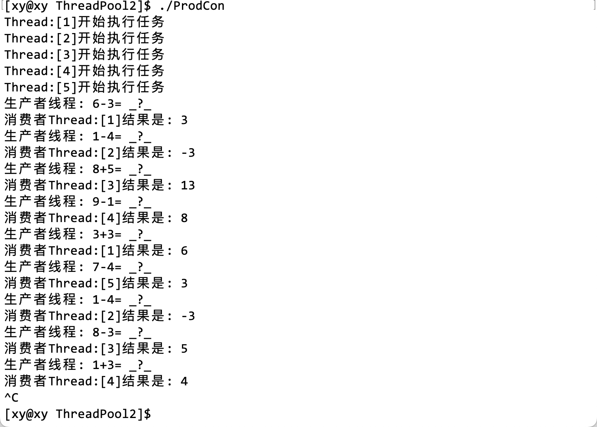
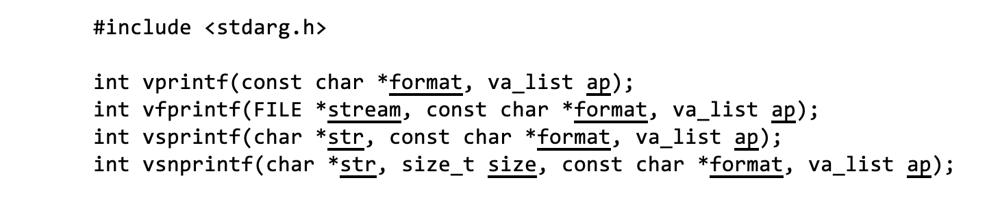

# 1. 引入

线程池是一种池化技术，是一种线程的使用方式。对于执行任务的整个过程，执行流的创建与销毁，调度本身就需要花费一定的时间。当线程数量达到一定程度，那么维护线程会消耗一些资源。

在生产者消费者模型中，这两个执行流在任意时刻只有其中之一才会访问临界资源；为了提高对临界资源处理的效率，即使实现了多生产多消费，其本质上也是单生产单消费。本质原因是，由于多线程并发访问临界资源可能会出现问题，所以使用条件变量或信号量，以及互斥锁限制了在同一时间段内，只有一个执行流能够访问临界资源。

线程池是一种以空间换时间的做法，例如在 STL 中，通常以 1.5 倍或 2 倍增长。这样做的目的是减少时间，提高效率。实现创建多个线程，用某个数据结构管理它们（例如队列），让多个线程同时在队列中等待任务的派发。那么当任务很多时，就能直接从队列中取出线程，这就将「创建线程」这一操作从「执行任务」的流程中剔除，从整体上节省了时间。

# 2. 应用

# 3. 实现

## 封装线程

在线程类`Thread`中用成员函数封装创建线程和销毁线程的接口。并且可以设置要传给线程的各种参数。不可缺少的是线程要执行的任务，即线程函数，除此之外，增加了线程的信息，例如线程的名字。其中线程的信息单独用一个类`ThreadData`封装。

```cpp
// #include <functional>

// typedef std::function<void* (void*)> func_t; 
typedef void *(*func_t)(void *);	// 定义一个函数类型
// （要传递给）线程的信息
class ThreadData
{
public:
	void* _args;		// 线程参数
	std::string _name;	// 线程名称
};
// 线程类
class Thread
{
public:
	Thread(int num, func_t callback, void* args)
	: _func(callback)
	{
		char threadName[64];
		snprintf(threadName, sizeof(threadName), "Thread:[%d]", num);
		_name = threadName;
		
		_td._args = args;	// 给线程传递参数
		_td._name = _name;
	}
	~Thread()
	{}
	// 创建线程
	void start()
	{
		pthread_create(&_tid, nullptr, _func, (void*)&_td);
	}
	void join()
	{
		pthread_join(&_tid, nullptr);
	}
	std::string name()
	{
		return _name;
	}
private:
	ThreadData _td;		// 要传递给线程的信息
	std::string _name;	// 线程名称
	pthread_t _tid;		// 线程 ID
	func_t _func;		// 线程函数
};
```

注意，这里只是简单地实现了线程类的框架，稍后还要补充其他内容。它的实现在`Thread.hpp`中实现。

这里的`name()`接口稍后会有用，实际上它是后补的，在这里就先给出了。

## 封装线程池

在`ThreadPool.hpp`中实现线程池的框架，线程池的本质是一个生产者消费者模型。

线程池的作用是等待任务的派发，所以要在任务执行之前将线程保存起来。在这里可以使用容器`vector`保存线程，有了线程还不够，所以也要将任务保存起来，在这里使用`queue`容器保存任务。

- 构造函数：调用`Thread`的构造函数，创建线程，创建的线程
- 析构函数：回收线程的资源。

除了构造函数和析构函数以外， 最重要的两个接口是`run()`和`pushTask()`，分别代表线程执行任务和任务入队（等待被执行）。

```cpp
#pragma once

#include "Thread.hpp"
#include <vector>
#include <queue>

#define THREAD_NUM 5
template<class T>
class ThreadPool
{
public:
	ThreadPool(int thread_num = THREAD_NUM)
	: _num(thread_num)
	{
		for(int i = 1; i <= _num; i++)
		{
			// 参数列表对应着 Thread 的构造函数
			_threads.push_back(new Thread(i, /*线程函数*/, nullptr));
		}
	}
	~ThreadPool()
	{
		for(auto& it : _threads)
		{
			it->join();
			delete it;
		}
	}
	// 线程执行任务
	void run()
	{
		for(auto& it : _threads)
		{
			it->start();
			std::cout << "线程开始执行任务" << std::endl;
		}
	}
	// 将任务入队列
	void pushTask(const T& task)
	{
		_task_queue.push(task);
	}
private:
	std::vector<Thread*> _threads;		// 保存线程的数组
	std::queue<T> _task_queue;			// 保存任务的队列
	int _num;							// 线程的个数
};
```

- 构造函数中使用`new`创建线程时，参数列表和`Thread`对应。但是此时还未实现线程函数，和传递给线程的参数，因此后面两个参数是暂时不确定的。

## 线程函数

在这里暂时用打印语句代替线程要执行的任务：

```cpp
// 线程函数
static void* routine(void* args)
{
    ThreadData *td = (ThreadData*)args;
    while(1)
    {
        std::cout << td->_name << std::endl;
        sleep(1);
    }
}
```

注意：这个线程函数中可能会使用到线程池`ThreadPool`中的成员（虽然在本例没有使用），所以把它定义在类的内部。但是这样可能会出现一些问题：类成员函数的第一个参数实际上是对象的 this 指针，它是隐藏的，因此在编译时可能会出现参数列表不匹配的问题。

> 可能出现的报错信息：
>
> ```text
> ThreadPool.hpp: In instantiation of 'ThreadPool<T>::ThreadPool(int) [with T = int]':
> ProdCon.cc:6:44:   required from here
> ThreadPool.hpp:20:61: error: no matching function for call to 'Thread::Thread(int&, <unresolved overloaded function type>, void*)'
>     _threads.push_back(new Thread(i, routine, (void*)nullptr));
> ```

解决办法是用`static`修饰，这样就没有 this 指针了。实际上可以写在类的外部，这取决于测试环境。

## 生产消费逻辑

在`ThreadPood.hpp`在可以定义一个临时的测试函数：
```cpp
// 测试
void joins()
{
    for(auto& it : _threads)
    {
        it->join();
    }
}
```

main 函数启动的线程就是主线程，主线程的作用一般是指派任务给其他线程。在主线程中`new`一个线程池对象，在对象实例化时，`ThreadPool`类构造函数会被调用，接着会调用`Thread`类的构造函数。

```cpp
#include "ThreadPool.hpp"

// 主线程
int main()
{
	ThreadPool<int>* tp = new ThreadPool<int>();
	tp->run();
	tp->joins();
	// while(1)
	// {
	// 	// 分配任务。..
	// }
	
	return 0;
}
```

在这里只是测试之前的代码有没有问题，只是实现了主线程框架。其中被注释的`while`代码块中，就是分配任务的逻辑。

测试结果：


这个结果基本说明前面的代码在逻辑上没什么问题，最可能出现问题的地方就是刚才提到的`static`routine() 函数。

## 互斥锁

上面只是实现了简单的线程池，但是多个执行流并发操作并不是安全的，因此要限制在同一时间段内只有一个执行流能访问临界资源。

> 在线程池中，哪一部分是临界资源？

临界资源是被所有执行流共享的，在线程池中，每个线程都会从队列中取出数据或任务，因此这个存储数据或任务的队列中的空间对于所有执行流来说是临界资源。

下面将`pthread`库中的锁的操作用一个类`Mutex`简单地封装起来，它将被定义在`LockGuard.hpp`中。

```cpp
#pragma once

#include <iostream>
#include <pthread.h>
#include <string>

class Mutex
{
public:
    Mutex(pthread_mutex_t* mtx)
    : _pmtx(mtx)
    {}
    void lock() 
    {
        pthread_mutex_lock(_pmtx);
    }
    void unlock()
    {
        pthread_mutex_unlock(_pmtx);
    }
    ~Mutex()
    {}
private:
    pthread_mutex_t* _pmtx;
};

class LockGuard
{
public:
    LockGuard(pthread_mutex_t* mtx)
    : _mtx(mtx)
    {
        _mtx.lock();
        std::cout <<"---加锁---" << std::endl;
    }
    ~LockGuard()
    {
        _mtx.unlock();
        std::cout << "---解锁---" << std::endl;
    }
private:
    Mutex _mtx;
};
```

为了方便观察现象，在加解锁的逻辑中增加了打印语句，以作提示。

> 这种将资源的初始化/销毁操作分别交给构造函数和析构函数的做法是常见的，它被称为 RAII（Resource Acquisition Is Initialization，资源获取即初始化）。因为局部对象在创建时会调用构造函数，出了作用域以后会调用析构函数，它是一种半自动化的操作，这种编码规范能减少出现内存泄漏、死锁等问题。

## 条件变量

单纯的加锁只会拖慢速度，互斥锁常常与条件变量协同作用，所以可以设置一个条件变量，表征队列中的任务或数据条件（也就是有没有）是否就绪。条件变量也可以和锁一样，用 RAII 实现，不过下面为了有所区别，直接用条件变量的相关接口实现。

下面是增加了互斥锁和条件变量的线程池代码：

```cpp
#define THREAD_NUM 5
template<class T>
class ThreadPool
{
public:
	void waitCond()
	{
		pthread_cond_wait(&_cond, &_lock);
	}
	pthread_mutex_t* getMutex()
	{
		return &_lock;
	}
	T getTask()
	{
		T t = _task_queue.front();
		_task_queue.pop();
		return t;
	}
	bool empty()
	{
		return _task_queue.empty();
	}
	// 测试
	void joins()
	{
		for(auto& it : _threads)
		{
			it->join();
		}
	}
public:
	ThreadPool(int thread_num = THREAD_NUM)
	: _num(thread_num)
	{
		pthread_mutex_init(&_lock, nullptr);
		pthread_cond_init(&_cond, nullptr);
		for(int i = 1; i <= _num; i++)
		{
			// 参数列表对应着 Thread 的构造函数
			_threads.push_back(new Thread(i, routine, (void*)nullptr));
		}
	}
	~ThreadPool()
	{
		for(auto& it : _threads)
		{
			it->join();
			delete it;
		}
		pthread_mutex_destroy(&_lock);
		pthread_cond_destroy(&_cond);
	}
	// 线程执行任务
	void run()
	{
		for(auto& it : _threads)
		{
			it->start();
			std::cout << "线程开始执行任务" << std::endl;
		}
	}
	// 将任务入队列
	void pushTask(const T& task)
	{
		LockGuard LockGuard(&_lock);
		_task_queue.push(task);
		pthread_cond_signal(&_cond);
	}
	// 线程函数
    static void* routine(void* args)
    {
        ThreadData *td = (ThreadData*)args;
        while(1)
        {
            std::cout << td->_name << std::endl;
            sleep(1);
        }
    }
private:
	std::vector<Thread*> _threads;		// 保存线程的数组
	std::queue<T> _task_queue;			// 保存任务的队列
	int _num;							// 线程的个数
	pthread_mutex_t _lock;				// 互斥锁
	pthread_cond_t  _cond;				// 条件变量
};
```

除了加解锁逻辑之外，在`pushTask()`函数中，生产完毕以后至少要唤醒一个线程，所以使用 signal 接口，如果要唤醒多个线程，可以用 board 接口唤醒。

由于线程函数被`static`修饰，那么它是属于所有对象的，因此它不能访问类的普通成员，解决这个问题有两种办法：

1. 将要访问的成员也设置为`static`，但是这样做会改变成员变量的属性，可能会出现问题。
2. 对外开放 get 方法，这是封装常用的做法。

因此上面顺便封装了`waitCond()`和`empty()`配合条件变量使用，以及`getMutex()`和`getTask()`，以获取锁的地址和将生产的任务放入队列中。（实际上这个操作应该在下面完成）

## 线程函数

线程函数`routine`就是一个消费过程，但是在这里是存在问题的。由于刚才我们用`static`修饰了它，那么这个静态函数是属于所有成员的，那么它就不能使用类内部的成员属性和方法，如`_task_queue`。无法读取任务队列，拿不到队列也就无法消费。

这是由于 C++的语法限制的，是 C++和 C 在系统编程上的区别。

【拾遗】C++的构造函数中是能够传入 this 指针的。

> 得到 this 指针的前提不应该是对象被实例化之后才能获取的吗？

构造函数分为两部分：

1. 在初始化列表中申请空间；
2. 在代码块中赋值。

也就是说，在`{}`之外就已经完成内存空间的申请了，对象的起始地址在此时就已经能取到了。所以将`Thread`对象本身作为信息传输给线程，那么构造线程时的最后一个参数可以改成 this 指针：

```cpp
_threads.push_back(new Thread(i, routine, this));
```

下面是线程函数中的逻辑：
在`Thread`类中封装了创建线程的接口，还封装了一个`ThreadData`的成员变量，它在线程被创建时会被作为参数传入给线程。在线程内部，只要将接收到的 void *类型的参数`args`强转回原来的类型，就能取出线程信息。

信息在线程被创建时被封装了两层，取出信息的过程也要从两个对象中取出。信息中包含了线程池中的互斥锁的地址（它是被所有相关线程共享的），这个接口在上面已经报封装为`getMutex()`，包括条件变量等接口：

```cpp
// 线程函数
static void* routine(void* args)
{
    ThreadData *td = (ThreadData*)args;
    ThreadPool<T>* tp = (ThreadPool<T>*)td->_args;

    while(1)
    {
        T task;
        {
            LockGuard LockGuard(tp->getMutex());
            while(tp->empty())
            {
                tp->waitCond();
            }
            // 读取任务
            task = tp->getTask(); // 任务 [共享空间]->获取 [私有空间]
        }
        std:: cout << "消费者" << td->_name;
        task(); // 执行任务
    }
}
```

注意事项：

- 首先要将参数`args`强转，才能调用对象的接口。
- `while(1)`表示消费者不断地消费，也就是不断地从队列中取出任务，然后执行任务。
- 由于任务队列对于所有线程而言是临界资源，因此要在访问临界资源之前加锁。
- 用`while([队列为空])`配合条件变量，表征临界资源是否就绪，否则让线程挂起。
- 通过`getTask()`接口获取队列（头部）中的任务，取出的实际上是任务函数的地址，所以最要通过操作符`()`执行该地址处的函数。

值得注意的是，这里用一堆`{}`限定了互斥锁的有效范围：
```cpp
{
    LockGuard LockGuard(tp->getMutex());
    // ...
}
```

## 主线程

主线程的作用是分配任务，在这里可以简单地用加减操作作为任务，它将被定义在`Task.hpp`中：
```cpp
#pragma once

#include <iostream>
#include <functional>
#define SOL_NUM 2

typedef std::function<int(int, int)> func_t;

int Add(int x, int y)
{
	return x + y;
}
int Sub(int x, int y)
{
	return x - y;
}

func_t sol[SOL_NUM] = {Add, Sub};

class Task
{
public:
	Task(){}
	Task(int x, int y, func_t func)
	: _x(x)
	, _y(y)
	, _func(func)
	{}
	int operator()()
	{
		int res = _func(_x, _y);
		std::cout << "结果是：" << res << std::endl;
	}
public:
	int _x;
	int _y;
	
	func_t _func;
};
```

在主线程中，可以用`Task`类创建任务。用一个值域为 0 或 1，表示`sol[0]`或`sol[1]`，以选择加法或减法。同时用随机数定义两个操作数，传入函数中，这样就完成了任务的生产，将`Task`对象存入任务队列中。

```cpp
#include <iostream>
#include "ThreadPool.hpp"
#include "Task.hpp"
#include <sys/types.h>

// 主线程
int opt = -1;
int main()
{
	srand((unsigned long)time(nullptr) ^ getpid() ^ 0x3f3f3f3f);
	ThreadPool<Task>* tp = new ThreadPool<Task>(); // 创建线程池对象
	tp->run();	// 创建线程
	while(1)
	{
		opt = rand() % 2;
		int x = rand() % 10 + 1;
		int y = rand() % 5 + 1;
		Task task(x, y, sol[opt]);
		// 将任务放到线程池中
		tp->pushTask(task); 

		if(opt) std::cout << "生产者线程：" << x << "-" << y << "= _?_" << std::endl;
		else 	std::cout << "生产者线程：" << x << "+" << y << "= _?_" << std::endl;

		sleep(1);
	}

	return 0;
}
```

## 测试 1

[源代码](https://gitee.com/shawyxy/2023-linux/tree/main/ThreadPool2/test1)

测试结果：



这里的任务函数如果只是为了测试，也可以不用在一个新文件中定义任务函数，直接在主线程内使用 lambda 表达式也可以：

```cpp
Task task(x, y, [](int x, int y)->int
{
	return x + y;
 });
```

此处为了更清楚地显示结果，将加解锁的提示语句注释了。而且通过 sleep 限制了主线程和线程池中的线程生产和消费的速度。

# 4. 优化

可以用两个队列，分别属于生产者和消费者。当生产者生产任务的任务把其中一个队列存满以后，直接将这个满的队列中的所有任务通过`swap`，放到消费者的队列中，这样生产者和消费者就能更关注自己的队列。而消费者就不用自己从任务队列中取出任务，然后执行了，这个操作是由程序员完成的。

原来的临界资源是任务队列，在对它操作的整个过程中都需要线程持有锁，但是现在消费者和生产者都有自己的队列，我们知道加锁会降低效率，这样的话也会拖慢整体执行任务的速度，但是优化以后只要对`swap`操作加锁即可。而`swap`恰好是消费者取出任务的操作，这就将锁限制的粒度进一步缩到最小，以提高整体效率。

# 5. 日志

## 日志的重要性

在学习过程中，我们经常使用打印语句打印提示信息，虽然“打印大法”在很多时候很有用，但产品始终是面向用户的，因此提示信息既要使用用户看得到的话呈现，又要将错误信息保存起来，以供开发者修复。日志信息通常保存在日志文件中，它的文件后缀是`.log`

日志文件是用于记录系统操作事件的记录文件或文件集合，可分为事件日志和消息日志。它具有处理历史数据、诊断问题的追踪以及理解系统的活动等重要作用。日志文件中的记录可提供以下用途：监控系统资源；审计用户行为；对可疑行为进行告普；确定入侵行为的范围；为恢复系统提供帮助；生成调查报告等等。

## 实现

使用上面的例子来实现日志信息的生成，它将在`log.hpp`文件中被实现。

日志的设计可以根据需要，但是日志需要实现最基本的功能：日志等级、日期和时间、内容，以及支持用户自定义等（可以使用可变参数实现用户自定义的日志信息）。

### 日志级别

根据日志的重要性，赋予日志以优先级，以保证重要的问题最先被处理。

```cpp
#define DEBUG   0
#define NORMAL  1
#define WARNING 2
#define ERROR   3
#define FATAL   4
const char* LevelMap[] = 
{
    "DEBUG",
    "NORMAL",
    "WARNING",
    "ERROR",
    "FATAL"
};
```

通过不同数值的宏表示日志的等级，其中：

- 值为 0 的宏`DEBUG`是用于调试的日志，仅用于调试，在产品发布时可以删除它。
- `NORMAL`：日常日志。
- `WARNING`：告警日志。
- `ERROR`：错误但不影响任务执行。
- `FATAL`：致命错误。

用一个数组`LevelMap[]`保存这些宏，以便使用，且下标和它们的值对应。

### 提取参数

首先介绍一下可变参数，在 C 语言中，常用的函数`printf`就是可变参数，它的参数可以任意长。main 函数也是可变参数：

```cpp
int main (int argc, const char * argv[])
{}
// argc 表示参数的个数，数组 argv 保存参数
```

#### stdarg.h 头文件

stdarg 是由 standard（标准） arguments（参数）简化而来，主要目的是让函数能够接收可变参数。它定义了一个变量类型 va_list 和三个宏，这三个宏可用于在参数个数未知（即参数个数可变）时获取函数中的参数。

这 3 个宏分别是：

- va_start 宏初始化 va_list 类型的变量，它与 va_arg 和 va_end 宏一起使用。这个宏必须在使用 va_arg 和 va_end 之前被调用。
- va_arg 宏检索函数参数列表中类型为 type 的下一个参数。
- va_end 宏允许使用了 va_start 宏的带有可变参数的函数返回。如果在从函数返回之前没有调用 va_end，则结果为未定义。

用例：

下面是一个简单的例子，它演示了如何使用 `stdarg.h` 头文件中的宏来定义一个接受可变数量参数的函数。这个函数计算传递给它的所有整数参数的平均值。

```c
#include <stdio.h>
#include <stdarg.h>

double average(int count, ...) 
{
    va_list args;
    va_start(args, count);

    double sum = 0;
    for (int i = 0; i < count; i++) 
    {
        sum += va_arg(args, int);
    }
    va_end(args);

    return sum / count;
}

int main() 
{
    printf("Average of 2, 3, 4, 5 = %f\n", average(4, 2, 3, 4, 5));
    printf("Average of 5, 10, 15 = %f\n", average(3, 5, 10, 15));
}

```

在上面的代码中，我们定义了一个名为 `average` 的函数，它接受一个名为 `count` 的参数，表示可变参数的数量，后面跟着 `count` 个整数参数。我们使用 `va_start` 宏初始化 `va_list` 类型的变量 `args`，然后使用 `va_arg` 宏在循环中检索每个参数。最后，我们使用 `va_end` 宏结束可变参数的处理。

当我们运行上面的代码时，它会输出以下内容：

```
Average of 2, 3, 4, 5 = 3.500000
Average of 5, 10, 15 = 10.000000
```

实际上，它们是一个 char *类型的指针，指向的是参数在栈帧中的位置，本质上是宏。例如`va_start`将第一个参数指向第二个参数。

这些宏可以配合`stdio`中的`vprintf`函数族使用。



例如`vsnprintf` 是一个标准库函数，它在 `stdio.h` 头文件中定义。它与 `snprintf` 函数类似，但接受一个 `va_list` 类型的参数，而不是可变数量的参数。

`vsnprintf` 函数用于将格式化输出写入字符串。它接受一个目标缓冲区、缓冲区大小、格式字符串和一个 `va_list` 类型的参数。它会根据格式字符串和 `va_list` 中的参数将格式化输出写入目标缓冲区，最多写入 `size - 1` 个字符，然后在末尾添加一个空字符。

下面是一个简单的例子，演示了如何使用 `vsnprintf` 函数：

```c
#include <stdio.h>
#include <stdarg.h>

void format_string(char *buffer, size_t size, const char *format, ...) {
    va_list args;
    va_start(args, format);
    vsnprintf(buffer, size, format, args);
    va_end(args);
}

int main() {
    char buffer[100];
    format_string(buffer, sizeof(buffer), "Hello, %s!", "world");
    printf("%s\n", buffer);
}
```

在上面的代码中，我们定义了一个名为 `format_string` 的函数，它接受一个目标缓冲区、缓冲区大小、格式字符串和可变数量的参数。我们使用 `va_start` 宏初始化 `va_list` 类型的变量 `args`，然后将其传递给 `vsnprintf` 函数。最后，我们使用 `va_end` 宏结束可变参数的处理。

当我们运行上面的代码时，它会输出以下内容：

```
Hello, world!
```

#### 日志文件

下面使用文件接口，将日志信息写入到`ThreadPool.log`日志文件中：
```cpp
#pragma once

#include <iostream>
#include <cstdarg>
#include <ctime>
#include <string>

// 日志级别
#define DEBUG   0
#define NORMAL  1
#define WARNING 2
#define ERROR   3
#define FATAL   4

const char *LevelMap[] = 
{
    "DEBUG",
    "NORMAL",
    "WARNING",
    "ERROR",
    "FATAL"
};

#define LOGFILE "./ThreadPool.log"

void logMessage(int level, const char *format, ...)
{

#ifndef DEBUG_SHOW
    if(level == DEBUG) return;
#endif

    char stdBuffer[1024]; // 标准部分（一定要有的）
    time_t timestamp = time(nullptr); // 时间
    snprintf(stdBuffer, sizeof stdBuffer, "[%s] [%ld] ", LevelMap[level], timestamp);

    char logBuffer[1024]; // 自定义部分（因需求）
    va_list args;
    va_start(args, format);
    vsnprintf(logBuffer, sizeof logBuffer, format, args);
    va_end(args);

    FILE *fp = fopen(LOGFILE, "a");
    fprintf(fp, "%s%s\n", stdBuffer, logBuffer);
    
    fclose(fp);
}
```

其中，这是一个预处理命令，`DEBUG_SHOW`是编译选项，例如`g++ ... -DDEBUG_SHOW`，就会启用这个日志文件重程序，否则不会执行。

```cpp
#ifndef DEBUG_SHOW
    if(level == DEBUG) return;
#endif
```

现在有了记录日志的逻辑，就可以使用它来程序主体中使用：

[源文件（有日志版本）](https://gitee.com/shawyxy/2023-linux/tree/main/ThreadPool2/test2)

`ThreadPool.log`的一部分：

```text
[NORMAL] [1682508157] Thread:[1] 启动成功
[NORMAL] [1682508157] Thread:[2] 启动成功
[NORMAL] [1682508157] Thread:[3] 启动成功
[NORMAL] [1682508157] Thread:[4] 启动成功
[NORMAL] [1682508157] Thread:[5] 启动成功
[WARNING] [1682508157] Thread:[1] 处理完成：2+2=4 | Task.hpp | 35
[WARNING] [1682508158] Thread:[1] 处理完成：6+3=9 | Task.hpp | 35
[WARNING] [1682508159] Thread:[2] 处理完成：5+4=9 | Task.hpp | 35
```

# 懒汉实现单例模式

## 什么是懒汉模式

懒汉模式是一种实现单例模式的方法，它在第一次使用单例实例时才创建该实例。这种方法的优点是可以延迟单例实例的创建，直到真正需要它为止。

下面是一个简单的示例，演示了如何使用懒汉模式来实现单例模式：

```c++
#include <mutex>

class Singleton {
public:
    static Singleton& getInstance() {
        std::call_once(flag, [] { instance = new Singleton(); });
        return *instance;
    }

private:
    Singleton() {}
    static Singleton *instance;
    static std::once_flag flag;
};

Singleton *Singleton::instance = nullptr;
std::once_flag Singleton::flag;
```

在上面的代码中，我们定义了一个名为 `Singleton` 的类，它包含一个静态成员函数 `getInstance` 来返回单例实例。我们使用一个静态成员变量 `instance` 来存储单例实例，并使用一个静态成员变量 `flag` 来保证只创建一个实例。

在 `getInstance` 函数中，我们使用 `std::call_once` 函数来保证只调用一次 lambda 表达式来创建 `Singleton` 实例。这样可以确保只创建一个单例实例，即使在多线程环境中也是如此。

这种方法可以实现懒汉模式，即在第一次使用单例实例时才创建该实例。

## 什么是单例模式

简单介绍一下单例模式：

单例模式是一种常用的软件设计模式，它用于限制一个类只能创建一个实例，并提供一个全局访问点来访问这个实例。这种模式通常用于管理共享资源，例如数据库连接或线程池。

在多线程环境中，实现单例模式需要特别注意，因为多个线程可能会同时尝试创建单例实例。如果没有正确地同步这些线程，可能会导致创建多个实例，从而破坏单例模式的目的。

有几种方法可以在多线程环境中安全地实现单例模式。一种常用的方法是使用双重检查锁定（Double-Checked Locking）模式。这种方法使用一个锁来保护对单例实例的访问，并在创建实例之前检查两次实例是否已经存在。这样可以确保只有一个线程能够创建单例实例，并且其他线程在访问实例时不会被阻塞。

下面是一个简单的示例，演示了如何在多线程环境中使用双重检查锁定模式来实现单例模式：

```c++
#include <mutex>

class Singleton 
{
public:
    static Singleton& getInstance() 
    {
        if (instance == nullptr) 
        {
            std::lock_guard<std::mutex> lock(mutex);
            if (instance == nullptr) 
            {
                instance = new Singleton();
            }
        }
        return *instance;
    }

private:
    Singleton() 
    {}
    static Singleton *instance;
    static std::mutex mutex;
};

Singleton *Singleton::instance = nullptr;
std::mutex Singleton::mutex;
```

在上面的代码中，我们定义了一个名为 `Singleton` 的类，它包含一个静态成员函数 `getInstance` 来返回单例实例。我们使用一个静态成员变量 `instance` 来存储单例实例，并使用一个静态成员变量 `mutex` 来保护对 `instance` 的访问。

在 `getInstance` 函数中，我们首先检查 `instance` 是否为 `nullptr`。如果是，则获取锁并再次检查 `instance` 是否为 `nullptr`。如果仍然是，则创建一个新的 `Singleton` 实例并将其赋值给 `instance`。最后，我们返回对 `instance` 的引用。

这种方法可以确保在多线程环境中安全地创建和访问单例实例。

> 为什么要限制它的成员函数？

在单例模式中，我们通常会限制类的构造函数、拷贝构造函数和赋值运算符，以防止外部代码创建多个实例或复制单例实例。

例如，在上一个示例中，我们将 `Singleton` 类的构造函数声明为私有，以防止外部代码直接创建 `Singleton` 实例。我们还可以将拷贝构造函数和赋值运算符声明为删除，以防止外部代码复制或赋值 `Singleton` 实例：

```c++
class Singleton 
{
public:
    static Singleton& getInstance() 
    {
        // ...
    }

private:
    Singleton() 
    {}
    Singleton(const Singleton&) = delete;
    Singleton& operator=(const Singleton&) = delete;

    // ...
};
```

在上面的代码中，我们将拷贝构造函数和赋值运算符声明为删除，这意味着外部代码不能复制或赋值 `Singleton` 实例。

限制这些成员函数的目的是确保单例模式的正确性。如果我们允许外部代码创建多个实例或复制单例实例，那么单例模式就失去了意义。

> 为什么成员变量要设置为静态？

在单例模式的示例中，我们使用了一个静态的互斥锁来保护对单例实例的访问。这个锁是静态的，因为它需要在整个程序运行期间存在，并且需要在所有线程之间共享。

如果锁不是静态的，那么每个 `Singleton` 实例都会有自己的锁。但是，在单例模式中，我们只允许创建一个 `Singleton` 实例，因此只需要一个锁来保护对这个实例的访问。此外，由于 `Singleton` 类的构造函数是私有的，外部代码无法创建 `Singleton` 实例，因此也无法创建非静态锁。

## 实现

为了演示的简单，上例用 C++内置`Mutex`库实现单例模式，下面仍然使用`pthread`库中的接口。

首先， 在`ThreadPool`类中增加两个成员变量，并且使用`static`修饰：

```cpp
static ThreadPool<T> *thread_ptr;
static pthread_mutex_t mutex;
```

- `thread_ptr`的作用：保存对象的地址；
- `mutex`的作用：定义全局的互斥锁对象。

由于要实现单例模式，这个指针一定不能是属于某个类私有的，要是属于全局的（这里的全局指的是所有线程中），因此这个指针要设置为静态的，这样它就被线程池中所有线程共享。互斥锁也是类似的，稍后会解释它的具体作用。

既然互斥锁和单例对象的指针都是静态的，那么它们的初始值必须在类的外部赋值：

```cpp
template <typename T>
ThreadPool<T> *ThreadPool<T>::thread_ptr = nullptr;

template <typename T>
pthread_mutex_t ThreadPool<T>::mutex = PTHREAD_MUTEX_INITIALIZER;
```

同时，要将所有能构造对象的函数都设置为私有的（具体原因已经介绍了），将原先的构造函数设置为`private`，将拷贝构造函数和赋值运算符重载函数设置为`delete`，告诉编译器不要生成：

```cpp
ThreadPool(const ThreadPool<T> &other) = delete;
const ThreadPool<T> &operator=(const ThreadPool<T> &other) = delete;
```

现在，在主线程中（main 函数）就不能通过`new`来构造线程池了，所以可以封装一个 get 接口：

```cpp
public:
	static ThreadPool<T> *getThreadPool(int num = THREAD_NUM)
    {
        if (nullptr == thread_ptr)
        {
            thread_ptr = new ThreadPool<T>(num);
        }
        return thread_ptr;
    }
```

> 注意，这个 get 函数是有问题的。

同样地，将它设置为静态成员，那么返回给任何一个线程的指针就是同一个对象的地址，同时静态成员函数才能访问类的静态成员变量。

在主函数中，获取单例对象的地址就不能使用`new`了，由于上面的 get 函数是静态的，静态成员函数属于类，因此可以用`::`调用它：
```cpp
ThreadPool<Task> *tp = ThreadPool<Task>::getThreadPool(); // 获取单例对象
tp->run();	// 创建线程
// ...
tp->pushTask(task); // 生成任务
```

下面生产消费逻辑是不变的。

实际上常用的操作是这样的：

```cpp
ThreadPool<Task>::getThreadPool()->run();
// ...
ThreadPool<Task>::getThreadPool()->pushTask(task);
```

虽然麻烦一点，但是这样做反而更清晰了一些，反正调用的是同一个对象的成员函数。

> 单例对象在执行任务中，只有一个，假如有多个执行流都在申请使用这同一个对象呢？

多线程使用单例，也就是多个线程会在它们自己的线程函数中调用 getThreadPool 接口。可能会出现多个线程同时 new 的情况，所以可能会因为多线程创建多个单例对象，这就不单例了，也就不线程安全了。因此上面写的`getThreadPool`的逻辑如果不加锁的话，就不是线程安全的。加个锁？

```cpp
static ThreadPool<T> *getThreadPool(int num = THREAD_NUM)
{
    {
        LockGuard Lockguard(&mutex);
        if (thread_ptr == nullptr)
        {
            thread_ptr = new ThreadPool<T>(num);
        }
    }
    return thread_ptr;
}
```

> 注意被`{}`划定的范围，它是互斥锁对象`Lockguard`的生命周期。

请注意，需要被互斥锁限制的操作只有`new`线程池对象的时候。实际上以后任何一个线程想获取单例，都必须调用 getThreadPool 接口。但是只有第一次 new 的时候才可能出现隐患。但是以后这个指针就不为空了，加解锁中什么都没做，存在大量申请和释放锁的行为，无用且浪费资源的。因为除了第一次之外，资源已经安全了

所以在外部再增加一个判断：
```cpp
static ThreadPool<T> *getThreadPool(int num = THREAD_NUM)
{
    if (thread_ptr == nullptr) 
    {
        LockGuard Lockguard(&mutex);
        if (thread_ptr == nullptr)
        {
            thread_ptr = new ThreadPool<T>(num);
        }
    }
    return thread_ptr;
}
```

这个判断操作非常巧妙，虽然从代码上看它俩长得一样，但是作用却不同。最外层的 if 语句直接限制了线程申请互斥锁，除了第一次以外，所有线程都会被第一个 if 判断过滤。

[源代码（单例模式-线程安全版本）](https://gitee.com/shawyxy/2023-linux/tree/main/ThreadPool2/test3)

> 注意上面的等号不要写成赋值符号，本笨 b 被它搞了 1 个小时。..
