## 1. 什么是信号

### 1.1 信号的作用

我们之所以能理解生活中各种各样的信号，是因为我们知道各种的信号背后蕴含的信息，这些各式各样的信号指导着世界运作。<mark>不同信号对应着不同动作的执行。</mark>

在计算机中，信号是一种进程间通讯的有限制的方式。它们用于在进程之间传递信息或通知进程发生了某个事件的机制。例如在 Linux 中，信号是一种软件中断，它为 Linux 提供了一种处理异步事件的方法。例如，当终端用户输入 Ctrl+C 来中断程序时，它会通过信号机制使进程终止。

### 1.2 异步和同步

在进程间信号传递中，异步指的是信号可以在任何时候发送给某个进程，而不需要等待进程处于某种特定状态。信号是进程间通信机制中唯一的异步通信机制。

通过发送指定信号来通知进程某个异步事件的发送，以迫使进程执行信号处理程序。信号处理完毕后，被中断进程将恢复执行 。

和异步相对的是同步：

同步信号传递指的是：多个进程或线程之间通过某种方式协调它们的执行顺序，以便在正确的时间执行正确的操作。

以上课为例理解同步和异步，假设上课时小明有事出去了：

- 同步：全班暂停，直到小明回来以后才继续上课；
- 异步：继续上课，各忙各的，互不影响。

### 1.3 处理信号的方式

当一个进程收到一个信号时，它可以采取以下几种方式之一来处理该信号：

- 执行默认操作：每种信号都有一个默认操作，当进程收到该信号时，如果没有定义信号处理程序或选择忽略该信号，则会执行默认操作。例如，当进程收到 `SIGINT` 信号时，默认操作是终止进程。
- 忽略信号：进程可以选择忽略某些信号，这意味着当这些信号到达时，进程不会采取任何行动。
- 捕获信号并执行信号处理程序：进程可以为特定的信号定义一个信号处理程序。当该信号到达时，进程会暂停当前的执行流程，转而执行信号处理程序。当信号处理程序执行完毕后，进程会恢复原来的执行流程。
- 阻塞信号：进程可以阻塞某些信号，这意味着当这些信号到达时，它们不会立即被传递给进程。相反，它们会被挂起，直到进程解除对它们的阻塞。

注意：忽略信号本身就是一种处理信号的方式。

### 1.4 信号的种类

根据不同的需求，信号被分为实时信号和非实时信号：

- 非实时信号（不可靠/普通/标准信号）：是 Linux 系统最初定义的信号，它们的编号从 1 到 31。每种标准信号都有一个预定义的含义和默认操作。

- 实时信号（可靠信号）：是 Linux 系统后来引入的一种新型信号，它们的编号从 34 到 64。

标准信号和实时信号之间的区别主要是为了满足不同的应用需求。标准信号适用于简单的进程间通信，而实时信号则提供了更多的功能和灵活性，以满足复杂应用程序的需求。它们的区别在于：

- 标准信号不支持排队，这意味着如果一个进程在短时间内收到多个相同的信号，它只能处理其中一个，而其他的都会被丢弃。

- 实时信号支持排队和优先级，这使得它们能够更好地满足复杂应用程序的需求。此外，实时信号还提供了更多的信号编号，这使得应用程序可以定义更多的自定义信号。

可以通过`man 7 signal`指令查看信号相关信息，其中 Action 列就是不同信号的默认处理动作（在 1.8 中会对 Action 列介绍）：

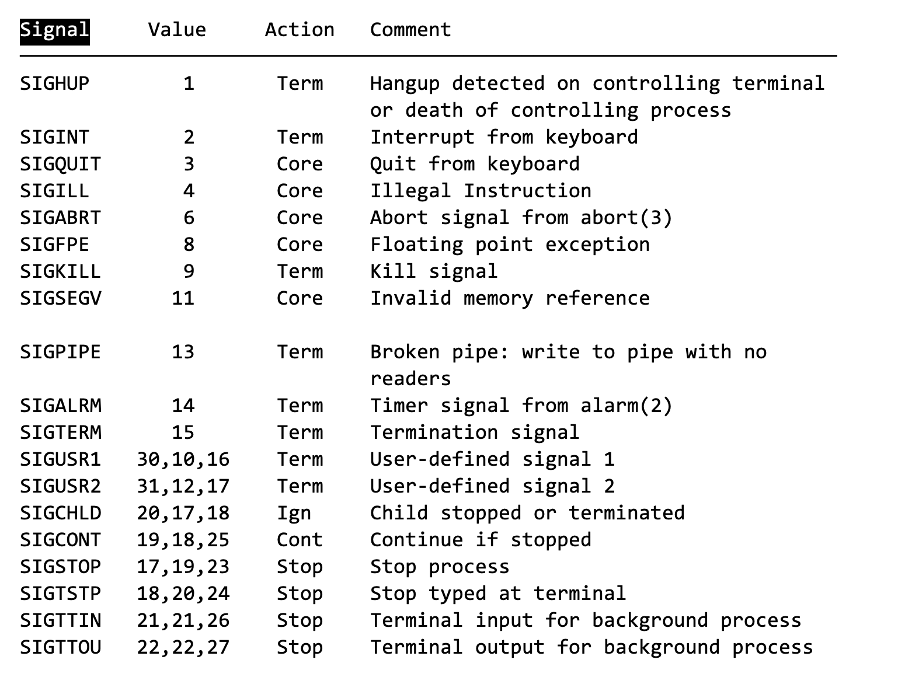

> 可能出现的错误：No manual entry for signal in section 7
>
> 意味着系统中没有安装第 7 章的 `signal` 手册页，centos 可以通过命令安装：
>
> ```shell
> sudo yum install man-pages
> ```

在此仅讨论非实时信号。

| 编号 |   名称    |               解释               |        默认动作        |
| :--- | :-------: | :------------------------------: | :--------------------: |
| 1    |  SIGHUP   |               挂起               |        终止进程        |
| 2    |  SIGINT   |               中断               |        终止进程        |
| 3    |  SIGQUIT  |               退出               |        终止进程        |
| 4    |  SIGILL   |             非法指令             |        终止进程        |
| 5    |  SIGTRAP  |          断点或陷阱指令          |        终止进程        |
| 6    |  SIGABRT  |         abort 发出的信号          |        终止进程        |
| 7    |  SIGBUS   |           非法内存访问           |        终止进程        |
| 8    |  SIGFPE   |             浮点异常             |        终止进程        |
| 9    |  SIGKILL  |             kill 信号             | 不能被忽略、处理和阻塞 |
| 10   |  SIGUSR1  |            用户信号 1             |        终止进程        |
| 11   |  SIGSEGV  |           无效内存访问           |        终止进程        |
| 12   |  SIGUSR2  |            用户信号 2             |        终止进程        |
| 13   |  SIGPIPE  |  管道破损，没有读端的管道写数据  |        终止进程        |
| 14   |  SIGALRM  |         alarm 发出的信号          |        终止进程        |
| 15   |  SIGTERM  |             终止信号             |        终止进程        |
| 16   | SIGSTKFLT |              栈溢出              |        终止进程        |
| 17   |  SIGCHLD  |            子进程退出            |        默认忽略        |
| 18   |  SIGCONT  |             进程继续             |        终止进程        |
| 19   |  SIGSTOP  |             进程停止             | 不能被忽略、处理和阻塞 |
| 20   |  SIGTSTP  |             进程停止             |        终止进程        |
| 21   |  SIGTTIN  | 进程停止，后台进程从终端读数据时 |        终止进程        |
| 22   |  SIGTTOU  | 进程停止，后台进程想终端写数据时 |        终止进程        |
| 23   |  SIGURG   |    I/O 有紧急数据到达当前进程     |        默认忽略        |
| 24   |  SIGXCPU  |       进程的 CPU 时间片到期        |        终止进程        |
| 25   |  SIGXFSZ  |        文件大小的超出上限        |        终止进程        |
| 26   | SIGVTALRM |           虚拟时钟超时           |        终止进程        |
| 27   |  SIGPROF  |         profile 时钟超时          |        终止进程        |
| 28   | SIGWINCH  |           窗口大小改变           |        默认忽略        |
| 29   |   SIGIO   |             I/O 相关              |        终止进程        |
| 30   |  SIGPWR   |               关机               |        默认忽略        |
| 31   |  SIGSYS   |           系统调用异常           |   终止进程，核心转储   |

作为查询补充：[Linux 中的 31 个普通信号](https://blog.csdn.net/chenlong_cxy/article/details/121952922)

### 1.6 信号的保存

在 Linux 中，进程的 PCB 包含了进程的所有信息，操作系统使用了两个掩码和一个函数指针数组来保存控制进程的信号。这在下文会详细介绍。

> 掩码（mask）和位图（bitmap）都是使用二进制位来表示信息的数据结构。它们之间的区别在于用途不同。
>
> 掩码通常用于通过按位与或按位或运算来设置或清除某些位。例如，如果我们想要设置一个整数的第 k 位为 1，我们可以使用按位或运算：`x = x | (1 << k)`。
>
> 而位图通常用于表示一组元素的存在性。例如，如果我们想要表示编号为 k 的元素存在，我们可以设置位图中的第 k 位为 1：`bitmap[k] = 1`。

### 1.7 信号发送的本质

所有信号都由操作系统发送，因为掩码存在于进程的 PCB 中，说明它属于内核数据结构，从掩码这种数据结构的角度看：

OS 向目标进程发送信号，就是修改掩码中某一个位置的比特位，“发送”信号是形象的理解，实际上信号是被“写”入的。

那么我们使用组合键 Ctrl + C ，操作系统解释了这个组合键对应的信号编号，然后查找进程列表，让正在前台运行的进程的 PCB 中的掩码中的某个比特位变化。其中信号的编号就对应着掩码中的位置。

## 2. 产生信号

在 Linux 中，信号可以通过多种方式产生：

- 通过终端按键产生信号，例如用户按下 Ctrl + C 时会发送 SIGINT 信号 。
- 调用系统函数向进程发信号，例如使用 `kill` 函数向指定进程发送信号 。
- 由软件条件产生，例如当程序出现错误（如除零或非法内存访问）时会产生相应的信号 。

上面已经以常见产生信号的方式作为引入，硬件中断、系统调用、软件条件和硬件异常都是产生信号的手段。

### 2.1 硬件中断产生信号

终端按键产生信号的本质是硬件中断。当用户在终端按下某些键时，键盘输入产生一个硬件中断，被操作系统获取，解释成信号，发送给目标前台进程。

除了 Ctrl + C 可以终止进程的运行外，还可以用 Ctrl + \ 组合键终止进程，实际上，它对应着信号编号为 3 的 SIGQUIT 信号。通过查阅 man 手册可以看到：

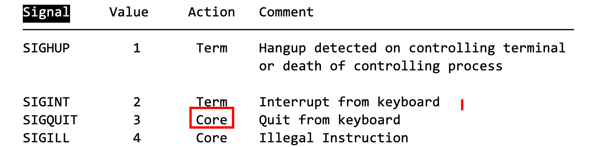

注意到 SIGQUIT 的 Action 和 SIGINT 的不同，SIGQUIT 和 SIGINT 都是用来终止进程的信号，但它们之间有一些区别：

- SIGQUIT 通常由 QUIT 字符（通常是 Ctrl + \）控制，当进程因收到 SIGQUIT 而退出时，会产生 core 文件，在这个意义上类似于一个程序错误信号。
- SIGINT 是程序终止（interrupt）信号，在用户键入 INTR 字符（通常是 Ctrl + C）时发出，用于通知前台进程组终止进程。

Term 和 Core 都表示终止进程。Term 表示正常终止，而 Core 表示异常终止并生成 core 文件。

#### 核心转储

当进程出现异常时，重要的内容就会被加载到磁盘中，生成 core.id。例如当以 Ctrl + \ 终止刚才的程序时：

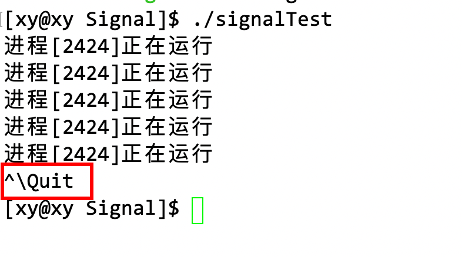

在云服务器中，core.id 是默认不会生成的，原因是云服务器的生产环境的核心转储是关闭的：

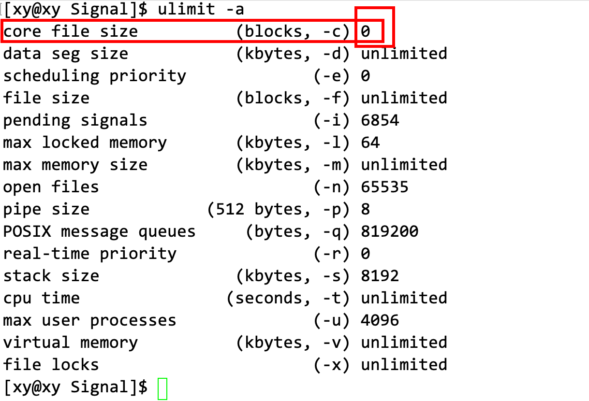

通过指令 ulimit -c size 设置 core 文件的大小：
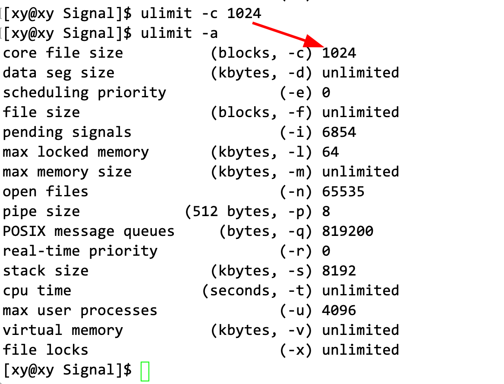

如果再次用 Ctrl + \ 终止进程，可以看到提示语句：

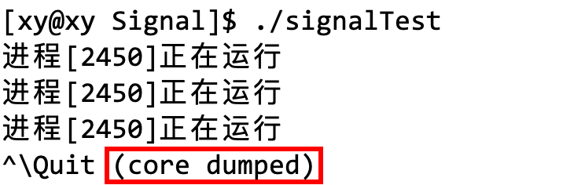

在可执行程序的目录中还能看到 core 文件：
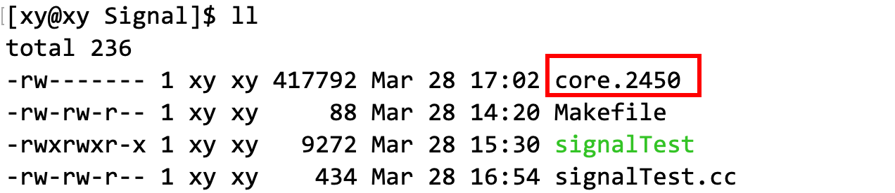

它的后缀和进程的 pid 对应。

>  ulimit 命令改变的是 Shell 进程的 Resource Limit，但 signalTest 进程的 PCB 是由 Shell 进程复制而来的，所以也具有和 Shell 进程相同的 Resource Limit 值。这种方法是内存级的修改，再次开启终端便会回到默认状态。

#### 事后调试 [了解]

核心转储（core dump）是操作系统在进程收到某些信号而终止运行时，将此时进程地址空间的内容以及有关进程状态的其他信息写出的一个磁盘文件。这种信息往往用于调试中定位问题。

可以通过一个简单的除零错误让 OS 生成 core 文件：

```cpp
##include <iostream>
##include <unistd.h>
using namespace std;

int main()
{
    cout << "即将发生除零错误" << endl;
    sleep(1);
    int a = 1 / 0;
    return 0;
}
```

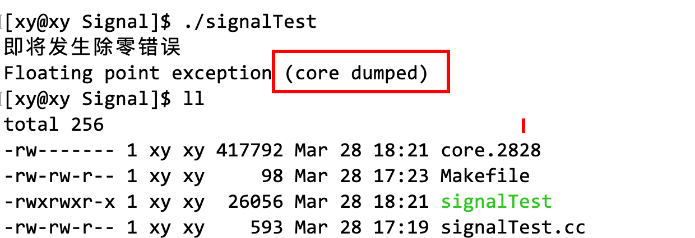

g++加上 -g 选项，以开发模式编译：

```makefile
g++ -o $@ $^ -std=c++11 -g
```

在此之前，我们在 Linux 中对程序调试用 gdb + 可执行程序名，必须要自己打断点定位错误，费时费力，有了 core 文件以后就能直接定位到问题位置：

`code-FILE + core.id`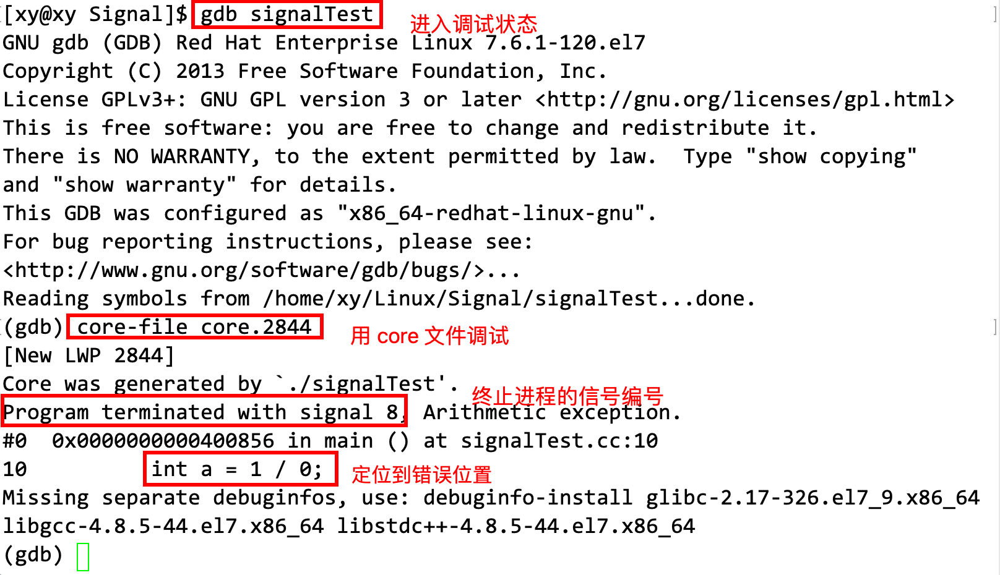

#### core dump 标记位

core dump 即核心转储，进程等待接口 waitpid 的第二个参数 status 是一个输出型参数，它的第 7 个比特位就是标识是否发生核心转储的位置：

```cpp
pid_t waitpid(pid_t pid, int *status, int options);
```

man signal 手册的 Action 列中的 Core 就是让 OS 判断是否发生核心转储的意思。

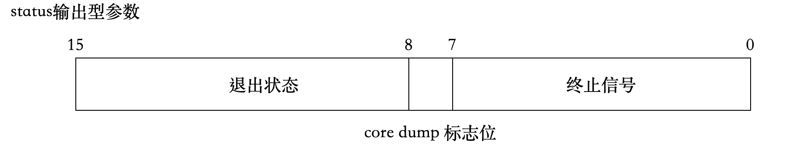

- 如果进程正常终止，core dump 标志位也就没有它存在的意义，因此 status 的次低 8 位表示进程的退出状态；
- 如果进程被信号终止，status 的低 7 位表示终止信号，第 8 位比特位就是 core dump 标志位，表示进程终止时是否（1/0）进行了核心转储。

有了终止信号之后，还需要让操作系统接收到这个终止信号是否会发生核心转储。下面将不捕捉信号，直接获取到进程的 status 输出型参数，并通过位运算获取到第七位的 core dump 标志位。

```cpp
##include <iostream>
##include <unistd.h>
##include <signal.h>
##include <sys/wait.h>
##include <sys/types.h>
using namespace std;

int main()
{
    pid_t id = fork();
    if(id == 0) // 子进程
    {
        cout << "即将发生除零错误" << endl;
        sleep(1);
        int a = 1 / 0;
        exit(0);
    }
    int status = 0;
    waitpid(id, &status, 0);
    cout << "父进程 [" << getpid() << "]: 子进程 [" << id << "], exit signal: "
    << (status & 0x7F) << " core dump: " << ((status >> 7) & 1) << endl;
    
    return 0;
}
```

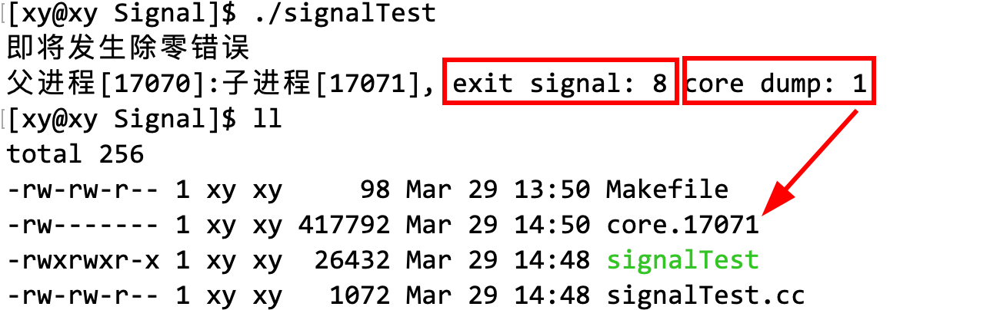

可以得到遇到除零错误时，OS 给进程发送的终止信号是 8 ，发生了核心转储，生成了 core 文件。

除此之外，我们还可以用 kill [信号编号] [PID] 在终止进程的同时发送信号，例如：

```cpp
int main()
{
    pid_t id = fork();
    if(id == 0) // 子进程
    {
        while(1)
        {
            sleep(1);
            cout << "child process is running" << endl;
        }        
        exit(0);
    }
    int status = 0;
    waitpid(id, &status, 0);
    cout << "父进程 [" << getpid() << "]: 子进程 [" << id << "], exit signal: "
    << (status & 0x7F) << " core dump: " << ((status >> 7) & 1) << endl;
    
    return 0;
}
```

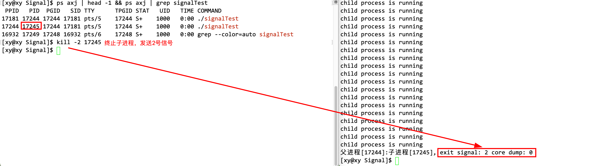

可以验证，2 号信号是不会发生核心转储的。

### 2.2 系统调用产生信号

系统调用可以产生信号。当进程为某个信号注册了信号处理程序后，当接收到该信号时，内核就会调用注册的函数。例如注册信号处理函数可通过系统调用 signal() 或 sigaction() 来实现。

#### signal 函数

在 Linux 中，信号可以通过几种不同的方式产生，首先以熟悉的键盘组合键产生的信号作为引入。处理信号要有具体的逻辑实现，在 Linux 中通过回调函数实现，各种对信号的操作被打包为一个个函数，对于我们而言，信号的操作就是代码的逻辑。

对信号的处理通过函数 signal 完成，它的原型（可通过 man 2 signal 查看）：

```cpp
##include <signal.h>

typedef void (*sighandler_t)(int);
sighandler_t signal(int signum, sighandler_t handler);
// 等价↕
void (*signal(int signum, void (*handler)(int)))(int)
```

参数：

- signum：信号的编号；
- handler：是一个函数指针，指向一个带有一个整数参数且返回值为 void 的函数。这个函数就是信号处理函数。

返回值：

返回传入的参数 handler，即函数指针。

我们在使用 Ctrl + C 终止进程时，实际上是这个组合键对应的信号被操作系统获取后，让前台进程杀死了当前进程。实际上这个信号就是 2 号信号 SIGINT。

下面将用 signal 接口捕获 2 号信号：

```cpp
##include <iostream>
##include <unistd.h>
##include <signal.h>
using namespace std;
void catchSignal(int signum)
{
    cout << "进程 [" << getpid() << "] 捕捉到信号：[" << signum << "]" << endl;
}
int main()
{   
    // 捕捉 2 号信号
    signal(SIGINT, catchSignal);
    // 用循环让进程一直运行
    while(1)
    {
        cout << "进程 [" << getpid() << "] 正在运行" << endl;
        sleep(1);
    }
    return 0;
}
```

运行起来后，即使多次使用组合键 Ctrl + C 也无法杀死进程，而且进程还按照写的处理方式打印了提示语句：

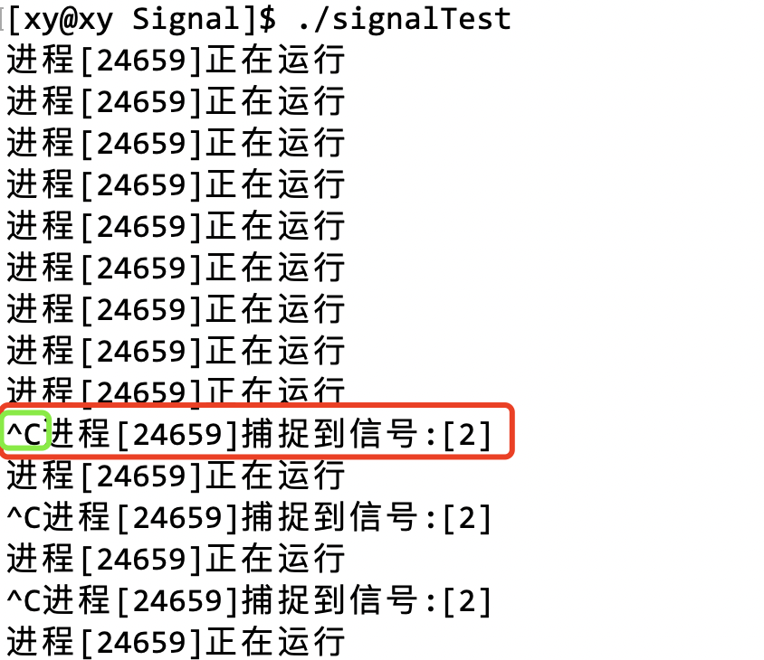

这个现象说明进程 signal 接口成功捕获了 2 号信号，并且验证了键盘组合键 Ctrl + C 就是 2 号信号。要杀死进程，只能使用`kill -9 pid`终止进程了。

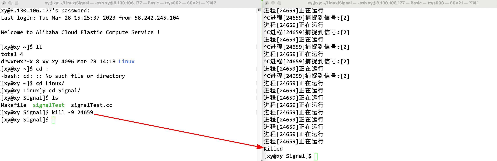

值得注意的是，signal 的第二个参数虽然是函数的地址，但是调用 signal 并不代表它会立刻调用第二个参数对应的函数，它是一种注册行为，只有捕获到它的第一个参数即信号编号时才会调用自定义函数，修改进程对特定信号默认的处理动作。在这里，2 号信号 SIGINT 的默认处理动作就是中断（interrupt）进程的运行。

在实际情况下，可能捕捉的信号不是 2 号，signal 后的逻辑也不一定是死循环，也可能是长时间执行的代码，总之 signal 的调用表示它之后的逻辑中一旦遇到了指定的 signum 信号的编号，那么就会执行对应的操作（第二个参数）。 在这里为了保证 signal 一定能捕捉到指定的信号，使用了死循环。假如后续没有任何指定信号编号（第一个参数）被进程接收，第二个参数也就不会被调用。

> 1. Ctrl + C 产生的信号只能发送给前台进程。在一个命令后面加上 & 就可以让它后台运行，这样 Shell 就不必等待进程结束就可以接收新的命令，启动新的进程。
> 2. Shell 可以同时运行一个前台进程和任意多个后台进程，但是只有前台进程才能接到像 Ctrl + C 这种控制键产生的信号。

在这里也验证了信号对于进程的控制流程是异步的，因为信号一旦被发送就会被进程立刻处理，即进程一旦接收到信号，就会暂停当前正在执行的逻辑，优先执行信号对应的处理操作。而 signal 接口就起着导向作用。

#### kill 函数

实际上 kill 命令是封装了 kill 系统调用实现的，我们可以自己实现一个 mykill 命令。

`kill` 用于向任何进程组或进程发送信号。函数原型：

```cpp
##include <signal.h>
int kill(pid_t pid, int sig)
```

参数：

- `pid` ：进程 ID；
- `sig` ：要发送的信号的编号。如果 `sig` 的值为 0，则没有任何信号送出，但是系统会执行错误检查，通常会利用 `sig` 值为 0 来检验某个进程是否仍在执行。

返回值：

- 成功：返回 0；
- 失败：返回 -1 。

命令行参数其实就是一个字符串，`main` 函数作为程序的入口，它是有参数的，被称之为命令行参数。在 C 语言中，`main` 函数通常有两种形式：`int main(void)` 和 `int main(int argc, char *argv[])`，这两种形式的参数是隐藏的。其中，`argc` 是命令行参数的个数，`argv` 是一个指向字符串数组的指针，其中包含了命令行参数。

尽管 main 函数不是一个可变参数函数，但是它可以通过 argc 和 argv 来接收命令行参数，这些参数的个数和内容是不确定的。因此，可以认为 main 函数通过 argc 和 argv 来接收可变数量的命令行参数，并自动以空格分隔放进数组。

假设我们要输入的命令是这样的：./mykill -2 pid ，那么参数个数 argc 为 3，我们使用字符串转整数 atoi，提取出传入的命令编号和进程 PID。然后将它们作为参数传入系统调用 kill ，完成手动终止进程的操作。

```cpp
##include <iostream>
##include <cstring>
##include <string>
##include <signal.h>
using namespace std;

static void Usage(string proc)
{
    cout << "format:\t\n\t" << proc << " [sigNum] [procId]" << endl;
}
// 示例命令：./mykill -2 pid
int main(int argc, char* argv[])
{
    if(argc != 3)
    {
        Usage(argv[0]);
        exit(1);
    }
    int sigNum = atoi(argv[1]);
    int procId = atoi(argv[2]);

    int ret = kill(procId, sigNum);
    if(ret < 0)
    {
        cout << "kill failed" << endl;
    }
    else
    {
        cout << "killed" << endl;
    }

    return 0;
}
```

让 Shell 运行一个 sleep，时间足以让我们观察现象：
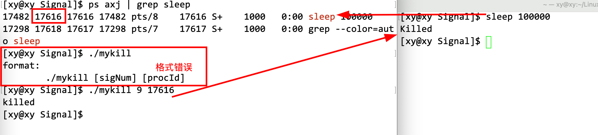

#### raise 函数

raise() 用于向程序发送信号。原型：

```cpp
int raise(int sig);
```

参数 sig：是要发送的信号码。

返回值：

- 成功：返回 0；
- 失败：返回非零。

```cpp
##include <iostream>
##include <signal.h>
##include <unistd.h>
using namespace std;

int main()
{
    int count = 5;
    while(count--)
    {
        cout << "process is running" << endl;
        sleep(1);
    }
    raise(8);
    return 0;
}
```

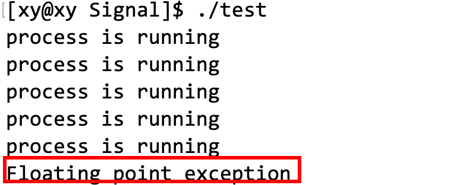

打印的内容就是 8 号信号对应的 Comment。

在上面的例子中，自己给自己发送 8 号信号也是一种产生信号的方式。向程序发送信号，以便在程序运行过程中触发某些事件或操作。例如，你可以使用 raise(SIGINT) 来模拟用户按下 Ctrl + C 来中断程序的执行。它也可以用于测试程序对特定信号的响应。

#### abort 函数

abort 的作用是异常终止一个进程，它向目标进程发送一个 SIGABRT 信号，意味着 abort 后面的代码将不再执行。原型：

```cpp
void abort(void);
```

它没有参数，也不返回任何值。

```cpp
##include <iostream>
##include <signal.h>
##include <stdlib.h>
##include <unistd.h>
using namespace std;

int main()
{
    int count = 5;
    while(count--)
    {
        cout << "process is running" << endl;
        sleep(1); 
    }
    abort();
    return 0;
}
```

注意它没有参数。

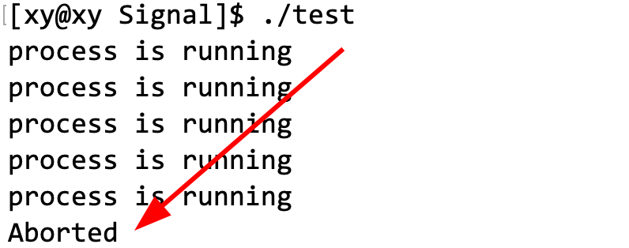

当调用 abort 函数时，会导致程序异常终止，而不会进行一些常规的清除工作。和 exit 函数的区别是：后者会正常终止进程。由于 abort 本质是暴力地通过向当前进程发送 SIGABRT 信号而终止进程的，因此使用 exit 函数终止进程可能会失败，使用 abort 函数终止进程总能成功。

#### 小结

当这些产生信号的系统接口被调用时，机器执行对应的内核代码，操作系统提取参数或设置为特定的数值，向目标进程发送信号。而发送信号的本质就是修改进程 PCB 中掩码的某个标记位，位置和信号编号对应。当进程发现它的 PCB 中的掩码的某个比特位被修改了以后，就会执行事先规定好的操作。

注意：当一个进程正在执行一个系统调用时，如果向该进程发送一个信号，那么对于大多数系统调用来说，这个信号在系统调用完成之前将不起作用，因为这些系统调用不能被信号打断。

### 2.3 软件条件产生信号

软件中断能产生信号。信号本质上是在软件层次上对中断机制的一种模拟，它可以由程序错误、外部信号或显式请求产生。例如，当程序执行过程中发生除零错误时，操作系统会向该程序发送一个 SIGFPE 信号。

在管道中，如果管道的读端被关闭，而写端一直写，那么在写入一定量的数据后，写端会收到一个 SIGPIPE 信号（13 号）。这个信号的默认行为是终止进程。如果进程忽略了这个信号或者捕获了这个信号并从其处理程序返回，那么写操作会返回-1，errno 被设置为 EPIPE。

在这种情况下，软件条件产生的信号是 `SIGPIPE` 信号。

通过提取输出型参数 status 的信号码的操作在 2.1 中已经演示过了。 实现的代码在这里。

对管道文件只写不读，操作系统会识别到这个情况，称之为软件条件不足。这是可以理解的，因为管道本身就是一种文件。

#### SIGALRM 信号

`SIGALRM` 信号通常用于实现定时器功能。当你希望在一段时间后执行某个操作时，可以使用 `alarm` 函数来设置一个定时器，当定时器到期时，内核会向你的进程发送 `SIGALRM` 信号。你可以通过捕获这个信号并在信号处理函数中执行相应的操作来实现定时功能。

原型：

```cpp
##include <unistd.h>

unsigned int alarm(unsigned int seconds);
```

seconds 参数：无符号整数，作为表示定时器的秒数。

返回值：返回上一个定时器剩余的秒数，如果没有上一个定时器，则返回 0。

如果你没有为 `SIGALRM` 信号设置信号处理函数，那么当进程收到这个信号时，它会执行默认操作，即终止进程。

下面将测试我的服务器在 1s 内能计算多少次++操作，结果用 count 保存并输出：
```cpp
##include <iostream>
##include <unistd.h>
##include <signal.h>
using namespace std;

int main()
{
    alarm(1);
    int count = 0;
    while (1)
    {
        count++;
        cout << "count:" << count << endl;
    }
    return 0;
}
```


现在的 CPU 每秒计算数以亿次，这里却只累加了近 2 万次，造成这种情况主要是 IO 太慢了，包括：

1. `cout` 语句可能会影响程序的性能。每次循环迭代时，都会调用 `cout` 来输出信息，这会增加额外的开销。
2. 网络传输带来的开销：每次打印的数据都会通过网络传输到本地，实际显示的结果比 1 秒内累加的次数要少得多。

3. [非重要原因] 这个程序可能不是唯一在计算机上运行的程序。操作系统会在多个进程之间共享 CPU 时间，因此此程序可能无法获得全部 CPU 时间。

每计算一次，进程都会被阻塞（停下来），IO（包括上面两方面）完成以后才会再计算下一次，可见 IO 非常费时间。如果要单纯计算算力，我们可以用 signal 捕捉信号：

```cpp
##include <iostream>
##include <unistd.h>
##include <signal.h>
##include <stdlib.h>
using namespace std;

int count = 0;
void Handler(int sigNum)
{
    cout << "final count:" << count << endl;
    exit(1);
}
int main()
{
    signal(SIGALRM, Handler);
    alarm(1);
    while(1)
    {
        count++;
    }
    return 0;
}
```


当 1 秒后触发 alarm 后它就会被自动移除，如果想周期性地每秒打印，可以在函数中再次设置 alarm：

```cpp
long long count = 0;
void Handler(int sigNum)
{
    cout << "final count:" << count << endl;
    alarm(1);
}
```

将 count 定义为 long long 以避免溢出。

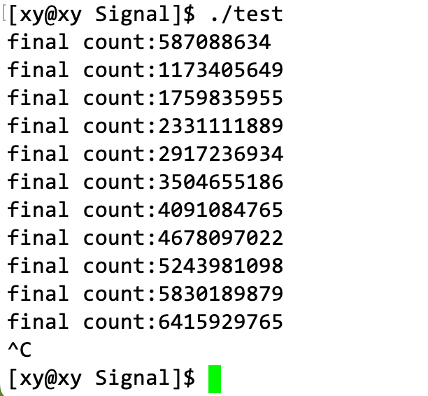

这样就用 alarm 实现了一个基本的定时器功能，能够每秒打印 count。

> 为什么不用 sleep 实现周期性打印？（alarm 和 sleep 的区别）

- alarm 函数用于设置信号 SIGALRM 在经过指定秒数后传送给当前进程。如果忽略或不捕捉此信号，则其默认动作是终止调用该 alarm 函数的进程。每个进程只能有一个闹钟时间。如果在调用 alarm 之前已设置过闹钟时间，则任何以前的闹钟时间都被新值所代替。

- sleep 函数用于使调用的进程睡眠指定秒数。调用 sleep 的进程如果没有睡眠足够的秒数，除非收到信号后才会返回。sleep 的返回值是 0，或剩余的睡眠秒数。

> alarm 和 sleep 的关系？

sleep 是在库函数中实现的，它是通过 alarm 来设定报警时间，使用 sigsuspend 将进程挂起在信号 SIGALRM 上。

#### 小结

如何理解软件条件给进程发信号：

1. 操作系统首先识别到某种软件条件触发或不满足
2. 操作系统构建信号，发送给指定进程

### 2.4 硬件异常产生信号

在 Linux 中，硬件异常指的是一些硬件错误，例如除零错误或访问进程地址空间以外的存储单元等。这些事件通常由硬件（如 CPU）检测到，并将其通知给 Linux 操作系统内核，然后内核生成相应的信号，并把信号发送给该事件发生时正在进行的进程。如果进程没有捕获并处理这些信号，操作系统会采取默认行为，通常是杀掉进程。

> 注意区分硬件中断：
>
> 硬件中断是指由计算机硬件设备产生的中断信号。它通常用于通知操作系统有新的外部事件发生，需要进行处理。硬件中断完全是随机产生的，与处理器的执行并不同步。
>
> 例如键盘输入通常是通过硬件中断实现的。当用户在键盘上按下一个键时，键盘控制器会向计算机发送一个中断信号。这个信号会通知计算机有新的输入需要处理。然后，计算机会暂停当前正在执行的任务，转而执行中断处理程序来处理这个输入。
>
> 硬件中断还可以用于其他外部事件的处理，例如鼠标移动、网络数据到达、磁盘读写完成等。它们都通过向 CPU 发送中断信号来通知操作系统进行处理。

#### 进程崩溃的本质

C/C++程序崩溃通常是由于程序运行时出现错误导致的。这些错误可能包括内存问题，例如内存越界，访问空指针，野指针等，而这些错误通常是内核接收到由硬件异常产生的信号才能确定程序崩溃的原因的。

下面以访问空指针为例，说明硬件异常产生的信号是如何让程序崩溃的：

1. 用 signal 捕捉信号，并注册了一个函数 handler；
2. handler 函数会打印捕捉到信号的编号；
3. 设计一个访问空指针，那么 signal 捕捉的是 SIGSEGV（11）信号；
4. 在死循环中 sleep，以便能观察现象。

```cpp
void Handler(int sigNum)
{
	sleep(1);
	cout << "捕捉到信号：" << sigNum << endl;
}
int main()
{
	signal(SIGFPE, Handler);
	int *p = nullptr;
	*p = 1;
	while(1)
	{
		sleep(1);
	}
	return 0;
}
```

在 `main` 函数中，首先使用 `signal` 函数将 `SIGSEGV` 信号与 `Handler` 函数关联起来。然后，程序执行了一个访问空指针的操作，这会触发 `SIGSEGV` 信号。

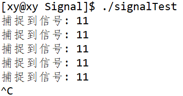

但是程序进入了一个无限循环，这是不符合预期的，因为访问空指针应该会让进程终止，原因是我们修改了 11 号进程的默认动作，处理信号的方式被改成自定义的 Handler 函数。

> 这样的话，是不是 1-31 信号都能这样被修改处理信号的默认动作呢？

首先答案是否定的，大多数信号都可以被捕获并由用户定义的处理程序进行处理，但是有些信号（如 SIGKILL(9 号） 和 SIGSTOP）不能被捕获或忽略。

下面通过使用 signal 注册多个信号，并将它们和自定义的 Handler 绑定，再用 kill 命令验证：

```cpp
void Handler(int sigNum)
{
	sleep(1);
	cout << "捕捉到信号：" << sigNum << endl;
}
int main()
{
	signal(1, Handler);
	signal(2, Handler);
	signal(3, Handler);
	signal(4, Handler);

	signal(9, Handler);

	while(1)
	{
		sleep(1);
	}
	return 0;
}
```

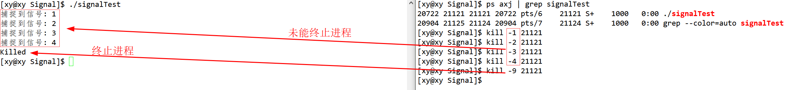

通过这个例子可以验证，即使用户修改了 9 号进程的默认处理方式，对于操作系统而言是无效的。

补充：

`while(1)`是一个无限循环，它会一直执行循环体中的代码。而`while(1) {sleep(1)}`也是一个无限循环，但是每次执行完循环体中的代码后，程序会暂停 1 秒钟再继续执行下一次循环。这样可以减少程序对 CPU 的占用。

#### 如何理解除零错误

CPU 对两个操作数执行算术运算时，会将它们放在两个寄存器中，计算完毕后将结果放到寄存器中写回。其中，有一个叫做“状态寄存器”的家伙，它类似一个掩码，用某个位置的比特位标记当前指令执行的状态信息（进位、溢出等）。

操作系统位于硬件之上、软件之下，是软硬件资源的管理者，如果 OS 发现程序运行时 CPU 中的状态寄存器出现异常（通过比特位），由于当前 CPU 处理的数据的上下文属于某个进程，因此 OS 可以通过它找到目标进程。CPU 中有个寄存器保存着这个进程信息，内核中有个指针 correct，指向当前运行进程的 PCB，它也会被 load 到 CPU 的寄存器中，所以 OS 可以通过这个指针找到进程的 PCB ，进而找到进程的 PID，通过指令将识别到的硬件异常封装为信号打包发送给目标进程。因此除零错误的信息传递是通过寄存器耦合实现的。

那么对于除零错误，硬件会触发中断，OS 就会将硬件上传的除零错误信息包装成信号，找到进程的 task_struct，向其中的掩码的第 8 比特位写入 1，这时 OS 就会被进程（在<mark>合适的时候</mark>）终止（注意这里的措辞）。

> 中断机制：
>
> 中断机制是现代计算机系统中的基本机制之一，它在系统中起着通信网络的作用，以协调系统对各种外部事件的响应和处理。中断是实现多道程序设计的必要条件，中断是 CPU 对系统发生的某个事件作出的一种反应。
>
> 简单来说，中断机制可以让计算机暂时停止某程序的运行，然后转到另外一个程序，CPU 会运行该程序的指令。

##### 结论

因此，除零错误的本质是硬件异常。

一旦出现了硬件异常，进程不一定会立马退出（我们能修改部分信号的默认行为），默认行为是退出的原因是：捕捉了异常信号但是不退出，程序员也拿它没办法，进程终止以后也会释放资源，所以捕获到异常信号的默认处理方式就是直接退出。

出现死循环的原因是：在寄存器中的异常信息一直没有被解决。

#### 如何理解野指针问题

我们知道，操作系统提供给进程的地址并非真实的物理地址，而是通过页表映射的虚拟地址，进程要访问某个变量的内存，必须用自身的虚拟地址，内核会根据页表找到物理地址。

MMU（Memory Management Unit，内存管理单元），它是一种硬件电路单元，负责将虚拟内存地址转换为物理内存地址，而页表是 MMU 完成上述功能的主要手段，即 MMU 是虚拟地址到物理地址的桥梁。

MMU 现在已经被集成在 CPU 中，它作为一个硬件，信息也会被操作系统管理。当访问了不属于进程的虚拟地址时， MMU 转换成物理地址就会出现错误，它的状态就会被操作系统识别，操作系统就会向目标进程发送 SIGSEGV 信号。

因为操作系统也属于一种软件，所以页表是一种软件映射关系，那么处理野指针的过程就是软件结合向进程发送信号。代码执行时，CPU 的调度比较温和，它会保存数据和恢复进程。

### 总结

1. 所有信号都有它的来源，但最终都是被操作系统识别、解释并发送给进程的。
2. 给进程发送信号的本质是修改进程 PCB 中掩码中的某个标记位，信号编号对应掩码中的位置。
3. 对于自定义捕捉动作（函数），当触发信号是，才会调用（回调）我们自定义的函数，signal 函数是一种注册机制。这个函数可能会被延后调用，这取决于信号何时产生，如果永远不产生该信号，那么这个回调方法也不会被调用。
4. 了解信号的基本原理可以帮助我们更好地理解代码中的信号处理部分。信号是一种软件中断，它提供了一种处理异步事件的方法。例如在程序运行过程中接收到终止信号时如何优雅地退出程序。这样，我们就能够更好地看待代码，并编写出更健壮、更可靠的程序。

## 3. 阻塞信号

信号阻塞就是让系统暂时保留信号待以后发送。

### 3.1 信号的状态

- 实际执行信号的处理动作，称为信号递达（Delivery）。
- 信号从产生到递达之间的状态，称为信号未决（Pending）。
- 进程可以选择阻塞（Block）某个信号。

被阻塞的信号产生时将保持在未决状态，直到进程解除对此信号的阻塞，才执行递达的动作。注意：信号阻塞和信号忽略是不同的。只要信号被阻塞就不会递达，除非解除阻塞，而忽略是在递达之后可选的一种处理动作，它们在时间线上是一前一后的关系。

> 不是所有的信号都被处理为信号未决。也不是所有的信号都处理（递达）。具体取决于需求。

### 3.2 相关数据结构

task_struct 是 Linux 内核的一种数据结构，它会被装载到 RAM 中并且包含着进程的信息。每个进程都把它的信息放在 task_struct 这个数据结构体中。在 Linux 操作系统中，每个进程都有一个唯一的进程控制块（Process Control Block, PCB），它包含了所有该进程的运行状态信息以及所需的所有资源。task_struct 结构是进程控制块中最重要的一个结构，它包含了该进程的所有信息。

内核中 task_struct 的定义在：`/usr/src/kernels/3.10.0-1160.83.1.el7.x86_64/include/linux/sched.h`中，可以通过 vim 使用`:\task_struct`查找关键字找到，这个路径中的`3.10.0-1160.83.1.el7.x86_64`是当前机器安装的 Linux 版本号。关于信号部分的定义：

```c
struct task_struct {
    /* ... */
    int sigpending;
    sigset_t blocked;
    struct signal_struct *sig;
    struct sigpending pending;
    /* ... */
};
```

这些字段用于存储进程与信号处理相关的信息，首先了解它们的类型。

类型说明：

- sigset_t：可以被实现为整数（即掩码）或结构类型，用于表示信号集。

- struct signal_struct：主要作用是存储信号与处理函数之间的映射，其定义如下：

  ```c
  struct signal_struct {
      atomic_t count;
      struct k_sigaction action[_NSIG];
      spinlock_t siglock;
      wait_queue_head_t signalfd_wqh;
  };
  ```

  其中，action 成员是一个长度为 _NSIG 的<mark>数组</mark>，下标为 k 的元素代表编号为 k 的信号的处理函数。

- struct sigpending：用于存储进程接收到的信号队列，其定义如下：

  ```c
  struct sigpending {
      struct list_head list;
      sigset_t signal;
  };
  ```

  其中，list 成员是一个双向链表，用于存储接收到的信号队列；signal 成员是一个信号集，用于保存接收到的信号的编号掩码。

在 Linux 内核中：

- blocked：掩码结构，表示被屏蔽的信息，每个比特位代表一个被屏蔽的信号；
- sig：表示信号相应的处理方法，它指向的结构体中有一个函数指针数组，保存着函数的地址，<mark>这个数组是专门用来存储用户自定义的函数地址的（内核设置的处理信号的默认动作不会存储在这个数组中）</mark>；
- pending：存储着进程接收到的信号队列，其成员 signal 类型和 blocked 相同，也是一个掩码。

为了更好地理解，将以上后两个结构中最重要的成员代表代表整个结构，即 sig 指向对象中的数组，暂称为 handler；pending 中的 signal 成员。以数据结构分组：

- 两个掩码：blocked，pending；
- 一个数组：handler。

阻塞信号集也叫信号屏蔽字（Signal Mask），即表示处理信号的方式是阻塞。

### 3.3 信号如何被处理

总结一下信号相关数据结构：

- blocked：表示信号是否被阻塞；
- pending：表示进程是否接收到该型号，每一个位置都对应着一个信号；
- handler：表示信号被递达时的处理动作，下标和信号编号对应。

每个信号都有两个标志位分别表示阻塞（block，1）和未决（pending，0），还有一个函数指针用来表示处理动作。信号产生时，内核在 PCB 中设置该信号的未决状态，直到信号递达才清除该标志。

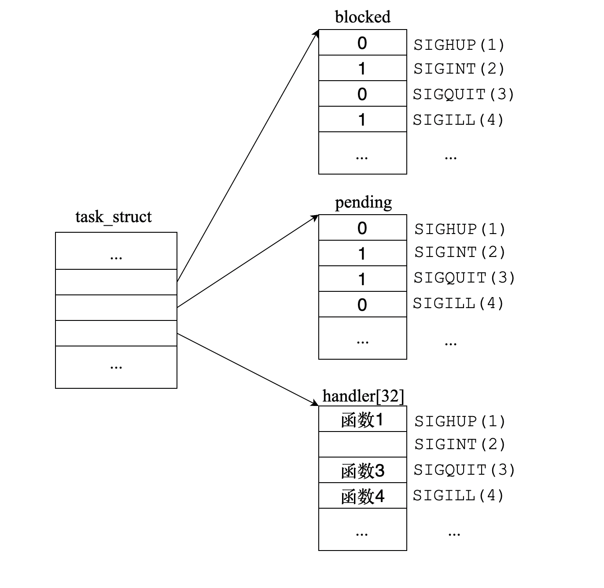

blocked 和 pending 搭配工作，在 blocked 中标志位为 1 的信号是被阻塞的，要让进程处理它，必须让标志位被置为 0，即解除阻塞。

图中的 SIGUP 信号既未被进程阻塞，也未被接收，因为 blocked 和 pending 掩码的第 1 比特位是 0，因此它在被递达时会执行内核设置的默认动作，而不会调用 handler 数组中的自定义处理方式（如果注册的话），即函数 1。

图中 SIGINT 信号的两个掩码都被设置为 1，表示 SIGINT 信号被进程接收后被阻塞，保持在未决状态，即使处理这个信号的默认处理方式是忽略，进程也必须在解除阻塞以后再忽略，因为忽略是处理信号的一种方式。

图中 SIGILL 信号未被接收，它一旦被接收就会被阻塞，处理动作被修改为用户自定义的处理方式，即函数 4。如果在进程解除对某个信号的阻塞状态之前，这种信号产生过多次，在 Linux 内核中：**普通信号**在递达之前产生多次只计一次，而**实时信号**在递达之前产生多次可以依次放在一个队列里。

#### 操作系统使用 handler 数组的规则

函数指针数组的下标即信号的编号，这使得我们可以以$O(1)$的速度查找到信号对应的比特位，实现信号的写入。操作系统要捕捉信号，首先要知道信号编号 signum，然后通过 handler 函数指针数组索引到对应的函数，然后将它强转为 int，如果为 0，则执行默认动作，如果为 1，则执行忽略动作。如果都不满足才会调用这个位置指向的函数。

所以通过这个流程可以知道，我们通过 signal 函数传送信号，并不一定会立刻调用它的第二个参数，而是将这个函数的地址放到第一个参数对应的下标位置上。

#### 小结

操作系统把信号发送到 pending 中后，首先要看 blocked 对应的标志位是否被置为 1，只有是 0 的时候才会去 handler 数组中调用对应函数。

> 体会：
>
> 学习 OS 的过程，能更加体会到数据结构和算法存在的意义，体会计算机科学的哲学思想，<mark>结构决定算法</mark>！
>
> 理解某个知识点“在做什么”是非常重要的，它往往不是高深的，抽丝剥茧地学习某个知识，不仅仅是把这个知识“搬”到我们脑子里，而是学习它（底层）的思想，这能改变我们看待知识的视角，提高我们对事物的认知能力。
>
> 例如我们学高数，即使会做题，也不知道它在干嘛。即使知道有寄存器这个玩意，如果我们不知道寄存器、操作系统存在的意义，学起来就会一头雾水。现在回过头看，以前闷着头学习的概率论、线性代数和离散数学，就是我们学习数据结构与算法的基础。

### 3.4 系统级类型

在 Linux 操作系统中，内核级类型是指为内核设计的数据类型。这些类型通常用于内核程序中，以便更好地管理和操作内核数据结构。例如 C 语言的 struct_file 和 FILE ，如果某些操作访问了硬件，那么它一定是通过内核系统调用实现的，因为操作系统是软硬件的中间层。因此所有的语言都要调用操作系统接口才能正常工作。

这些类型通常在内核头文件中定义，可以在内核程序中使用。

#### sigset_t

`sigset_t` 是一个内核级类型，是由操作系统提供的数据类型，它用于表示信号集。

> 信号集是什么？

在 Linux 操作系统中，信号集是一个数据类型，用于表示一组信号。它通常用于阻塞或解除阻塞一组信号，或检查一组信号是否处于未决状态，信号集由 sigset_t 类型表示。

- 在阻塞信号集中，“有效”和“无效”的含义是该信号是否被阻塞。
- 在未决信号集中，“有效”和“无效”的含义是该信号是否处于未决状态。

sigset_t 是一个不透明的数据类型，它的具体实现取决于操作系统和编译器。在 Linux 操作系统中，sigset_t 通常定义为一个位掩码，其中每个位表示一个特定的信号。例如，在 Linux 的 glibc 库中，sigset_t 的定义如下：

```c
// 在头文件<signa.h>中
##define _SIGSET_NWORDS (1024 / (8 * sizeof (unsigned long int)))
typedef struct
{
  unsigned long int __val[_SIGSET_NWORDS];
} __sigset_t;
```

请注意，这只是 `sigset_t` 的一个实现，它可能会因操作系统和编译器的不同而有所不同。应该避免直接访问 `sigset_t` 的内部结构，而应该使用相关的函数来操作它，例如 `sigemptyset`、`sigfillset`、`sigaddset` 和 `sigdelset` 等。

1. sigset_t 不允许用户自己进行位运算，所以 OS 给程序员提供了对应的操作方法（体现了结构决定算法）。

2. sigset_t 是用户可以直接使用的类型，和内置类型及自定义类型是同等地位的。
3. sigset_t 需要对应的系统接口来完成对应功能，其中参数可能就包含了 sigset_t 定义的对象或变量。

### 3.5 信号集操作函数

#### sigpending

sigpending 返回进程的 pending 信号集，即在阻塞时已经被触发的信号。挂起信号的掩码将返回到变量 set 中。原型：

```c
##include <signal.h>

int sigpending(sigset_t *set);
```

set 参数：输出型参数，用于存储 pending 信号集。

返回值：成功返回 0，失败返回-1。

#### sigpromask

sigprocmask 用于获取或更改 blocked 掩码。该调用的行为取决于 how 的值。原型：

```c
##include <signal.h>

int sigprocmask(int how, const sigset_t *set, sigset_t *oldset);
```

参数：

- how：更改 blocked 掩码的方式。
- set：表示要更改的信号集。
- oldset：输出型参数，如果不为 NULL，则在其中存储信号掩码的先前值，即返回修改之前的 blocked 掩码。

其中，how 有三种方式：

- SIG_BLOCK：set 包含了我们希望添加到当前信号屏蔽字的信号，相当于`mask=mask|set`
- SIG_UNBLOCK：set 包含了我们希望从当前信号屏蔽字中解除阻塞的信号，相当于`mask=mask|~set`
- SIG_SETMASK：设置当前信号屏蔽字为 set 所指向的值，相当于`mask=set`

返回值：成功返回 0，失败返回-1。

注意：如果调用 sigprocmask 解除了对当前若干个未决信号的阻塞，则在 sigprocmask 函数返回前，至少将其中一个信号递达。

#### 测试

需要验证的问题：

1. 如果对所有信号自定义捕捉，是不是就相当于写了一个不会被异常或被用户杀掉的进程？这在 2.4 中已经被初步验证了，是不行的。

2. 如果将 2 号信号 blocked，并且不断获取当前进程的 pending 信号集，然后突然发送一个 2 号信号，2 号信号则无法被递达，它将一直被保存在 pending 信号集中，此时的现象是 pending 信号集中有一个比特位 0->1
3. 如果对所有信号 blocked，也就是阻塞所有信号，这样是不是也写了一个永远不会被异常或被用户杀掉的进程？答案是否定的。

##### 测试 1

用循环将 1->31 的信号通过 signal 注册为阻塞，并绑定函数 catchSig，函数会打印捕捉到的信号编号：

```cpp
##include <iostream>
##include <unistd.h>
##include <signal.h>

using namespace std;

void catchSig(int signum)
{
	cout << "捕捉到信号：" << signum << endl;
}
int main()
{
	for(int i = 1; i <= 31; i++)
	{
		signal(i, catchSig);
	}
	while(1)
	{
		sleep(1);
	}
	return 0;
}
```


`signal`函数用于设置信号处理函数，但并不是所有的信号都可以被阻塞。例如，`SIGKILL`和`SIGSTOP`这两个信号是不能被阻塞的。因为它们是用来强制终止或暂停一个进程的。如果这两个信号可以被阻塞，那么就可能出现无法终止或暂停一个进程的情况，这会影响系统的稳定性和安全性。所以，操作系统设计者决定不允许这两个信号被阻塞。

> 其中 while(1) 的作用是让进程一直运行，能不断读取信号，加上 sleep 的原因是减少对内存资源的占用。

##### 测试 2

除了上面两个信号集操作函数之外，还有一些操作信号集的函数：

```c
##include <signal.h>

int sigemptyset(sigset_t *set);

int sigfillset(sigset_t *set);

int sigaddset(sigset_t *set, int signum);

int sigdelset(sigset_t *set, int signum);

int sigismember(const sigset_t *set, int signum);  
```

- sigemptyset 函数：初始化 set 所指向的信号集，使其中所有信号的对应 bit 清零，表示该信号集不包含任何有效信号。

- sigfillset 函数：初始化 set 所指向的信号集，使其中所有信号的对应 bit 置位，表示该信号集的有效信号包括系统支持的所有信号。
- sigaddset 函数：在 set 所指向的信号集中添加某种有效信号。
- sigdelset 函数：在 set 所指向的信号集中删除某种有效信号。
- sigemptyset、sigfillset、sigaddset 和 sigdelset 函数都是成功返回 0，出错返回-1。
- sigismember 函数：判断在 set 所指向的信号集中是否包含某种信号，若包含则返回 1，不包含则返回 0，调用失败返回-1。

注意： 在使用 sigset_t 类型的变量之前，一定要调用 sigemptyset 或 sigfillset 初始化，使信号处于确定的状态。set 就是“集”的意思。

示例代码：

```c
##include <stdio.h>
##include <signal.h>

int main()
{
	sigset_t s; //用户空间定义的变量

	sigemptyset(&s);

	sigfillset(&s);

	sigaddset(&s, SIGINT);

	sigdelset(&s, SIGINT);

	sigismember(&s, SIGINT);
	return 0;
}
```
注意： 代码中定义的 sigset_t 类型的变量 s，与我们平常定义的变量一样都是在用户空间定义的变量，所以后面我们用信号集操作函数对变量 s 的操作实际上只是对用户空间的变量 s 做了修改，并不会影响进程的任何行为。因此，我们还需要通过系统调用，才能将变量 s 的数据设置进操作系统。

----

要打印 pending 中的某个比特位的变化：

1. 先 block 2 号信号：用 sigset_t 定义两个信号集：bset 和 obset。表示新的信号集和老的信号集（o 也有 output 的意思，b 是 block 的意思）。它们存在于当前进程的（用户层栈属于用户空间）栈区（局部变量存放在栈区）。

2. 初始化两个（信号集）变量：sigemptyset 函数，传指针，对应比特位 0->1。
3. 添加要屏蔽的信号：sigaddset 函数，注意参数。

上面的操作都是在（用户层）栈上对对象的修改，下面将对内核中的数据修改：

4. 设置 set 到内核中对应的进程内部：sigpromask 函数，注意参数要传选项，老的和新的 set。默认情况下进程是不会屏蔽任何信号。
5. 循环打印当前进程的 pending 信号集的 32 个比特位：
   1. 前提是获取当前进程的 pending 信号集：在最前面定义一个 sigset_t 变量 pending，用于保存 pending 信号集，也要记得初始化。当然也可以放在循环里。用 sigpending 函数获取信号集合
   2. 显示 pending 信号集中没有被递达的信号：showPending 函数，这个函数是自定义的，它的功能是遍历 pending 的所有位数，判断 1-31 位置是否在 pending 集合中。

```cpp
static void showPending(sigset_t &pending)
{
    for (int sig = 1; sig <= 31; sig++)
    {
        if (sigismember(&pending, sig))
            cout << "1";
        else
            cout << "0";
    }
    cout << endl;
}

int main()
{
    // 1. 定义信号集对象
    sigset_t bset, obset;
    sigset_t pending;
    // 2. 初始化信号集对象
    sigemptyset(&bset);
    sigemptyset(&obset);
    sigemptyset(&pending);
    // 3. 添加要阻塞的信号
    sigaddset(&bset, 2); // 即 SIGINT
    // 4. 设置 set 到内核中对应的进程内部（默认情况进程不会阻塞任何信号）
    int n = sigprocmask(SIG_BLOCK, &bset, &obset);
    assert(n == 0);
    (void)n;

    cout << "阻塞 2 号信号成功，PID: " << getpid() << endl;
    // 5. 打印当前进程的 pending 信号集
    while (1)
    {
        // 5.1 获取当前进程的 pending 信号集
        sigpending(&pending);
        // 5.2 显示 pending 信号集中的没有被递达的信号对应的比特位
        showPending(pending);
        sleep(1);
    }

    return 0;
}
```

这段代码演示了如何使用信号集来阻塞特定的信号，并在循环中显示当前进程的未决信号集，下面将解释它们的作用：

首先，程序定义了一个自定义函数`showPending`，它接受一个信号集作为参数，并在循环中遍历 1 到 31 号信号，使用`sigismember`函数检查每个信号是否在信号集中。如果在，就输出 1，否则输出 0。最后输出一个换行符。

接下来，在`main`函数中，程序定义了三个信号集对象：`bset`、`obset`和`pending`。它们分别用来存储要阻塞的信号、原来阻塞的信号和当前未决的信号。

然后，程序使用`sigemptyset`函数初始化这三个信号集对象，然后使用`sigaddset`函数将信号 2（即`SIGINT`）添加到`bset`中。

接下来，程序使用`sigprocmask`函数将进程的阻塞信号集设置为`bset`，并将原来的阻塞信号集保存在`obset`中。这样，信号 2 就被阻塞了。

接下来，程序进入一个无限循环。在每次循环中，程序首先使用`sigpending`函数获取当前进程的未决信号集，并将其存储在`pending`中。然后，程序调用自定义的函数`showPending`来显示未决信号集中未被递达的信号对应的比特位。


这里为了演示时能直接使用 ctrl + C 给进程发送 2 号信号，所以在代码中屏蔽了 2 号信号，打印 PID 是为了能 kill 方便一些。通过演示，可以看到进程接收到 2 号信号以后， pending 中的第二个比特位就被从 0 改写为 1。最后是随便用了 1 号信号终止了进程。

> 补充：
>
> 一般判断返回值是意料之中的用 assert，意料之外用 if 判断返回值。(void)n 的原因是 release 版本下 assert 失效，这个 n 就会被标记为定义却未被使用，消除编译器告警。

如果想看见比特位 1->0，并且同时看到之前的变化，可以做出以下改变：

```cpp
void handler(int sigNum)
{
	sleep(1);
	cout << "捕捉到信号：" << sigNum << endl;
}
int main()
{
 	// 0. 为了验证方便，捕捉 2 号信号
    signal(2, handler);
    // 1. 定义信号集对象
    sigset_t bset, obset;
    sigset_t pending;
    // 2. 初始化信号集对象
    sigemptyset(&bset);
    sigemptyset(&obset);
    sigemptyset(&pending);
    // 3. 添加要屏蔽的信号
    sigaddset(&bset, 2); // 即 SIGINT
    // 4. 设置 set 到内核中对应的进程内部（默认情况进程不会阻塞任何信号）
    int n = sigprocmask(SIG_BLOCK, &bset, &obset);
    assert(n == 0);
    (void)n;

    cout << "阻塞 2 号信号成功，PID: " << getpid() << "，10 秒后解除阻塞。.." << endl;
    // 5. 打印当前进程的 pending 信号集
    int count = 0;
    while (1)
    {
        cout << "count: " << count++ << "  ";
        // 5.1 获取当前进程的 pending 信号集
        sigpending(&pending);
        // 5.2 显示 pending 信号集中的没有被递达的信号对应的比特位
        showPending(pending);
        // 10 秒以后解除阻塞
        if (count == 10)
        {
            // 默认情况解除 2 号信号阻塞时，会递达它
            // 但是 2 号信号的默认处理动作是终止进程
            // 为了观察现象，需要对 2 号信号进行捕捉
            int n = sigprocmask(SIG_SETMASK, &obset, nullptr);
            assert(n == 0);
            (void)n;
            cout << "解除 2 号信号阻塞状态" << endl;
        }
        sleep(1);
    }

    return 0;
}
```


用计数器控制 2 号信号只有 10 秒的阻塞状态，在这 10 秒期间，一旦进程接收到 2 号信号，pending 信号集的第二个比特位就会 0->1，但是不会调用 handler 处理信号，因为它被阻塞了；10 秒过后解除对 2 号的阻塞，那么这个比特位就会复原为 0，并调用 handler 对信号进行处理。

注意：

- 因为这里使用 2 号信号演示，而 2 号信号一旦被解除阻塞状态，它的默认处理方式是终止进程，所以必须要事先用 signal 捕捉 2 号信号，并绑定 handler 函数打印信号编号。否则 10 秒后进程会终止，无法观察现象。

- 在打印时，需要注意打印语句的先后顺序：先打印“捕捉”后打印“解除”。所以可以把打印语句放在 sigpromask 之前。原因是它解除以后可能就立马递达了，调用了 handler 函数，然后才会继续执行代码。

> 貌似没有一个接口可以修改 pending 信号集，但我们可以获取 sigpending。所有信号的发送方式都是修改 pending 信号集的过程（如 q，abort，键盘，异常。.. 即产生信号的方式）。所以手动修改它没必要，它在传递信号的过程中就已经被修改了。

##### 测试 3

1. 首先将屏蔽信号的逻辑封装为一个接口，取名为 blockSig，它的作用是屏蔽指定的信号。

2. 用循环调用上述接口屏蔽所有信号。

3. 获取 pending 信号，可以不用初始化，因为后面直接覆盖了。

4. 打印 pending 的 1-31 比特位。

```cpp
static void blockSig(int sig)
{
    sigset_t bset;
    sigemptyset(&bset);
    sigaddset(&bset, sig);
    int n = sigprocmask(SIG_BLOCK, &bset, nullptr);
    assert(n == 0);
    (void)n;
}
int main()
{
	for(int sig = 1; sig <= 31; sig++)
    {
        blockSig(sig);
    }
    sigset_t pending; // 获取 pending 信号
    while(1)
    {
        sigpending(&pending);
        showPending(pending);
        sleep(1);
    }
	return 0;
}
```

上述逻辑本身就是进程在运行的。`pidof + 进程名称`，可以直接获取进程 pid，用一个脚本查看每个进程自动发送 1-31 信号，把脚本保存在：SendSig.sh：

```shell
##!/bin/bash

i=1
id=$(pidof signalTest)
while [ $i -le 31 ]
do
    if [ $i -eq 9 ];then # 跳过了 9 号
        let i++
        continue
    fi
    if [ $i -eq 19 ];then # 跳过了 19 号
        let i++
        continue
    fi
    kill -$i $id
    echo "kill -$i $id"
    let i++
    sleep 1
done
```

> 可能遇到的问题：
>
> 在 Linux 系统中，无法运行 .sh 脚本的原因可能有很多。一个常见的原因是脚本文件没有执行权限。你可以使用 chmod 命令来给予脚本文件执行权限，例如 chmod u+x script.sh 。
>
> 此外，你也可以通过将脚本文件作为参数传递给 shell 来运行它，例如 bash script.sh。

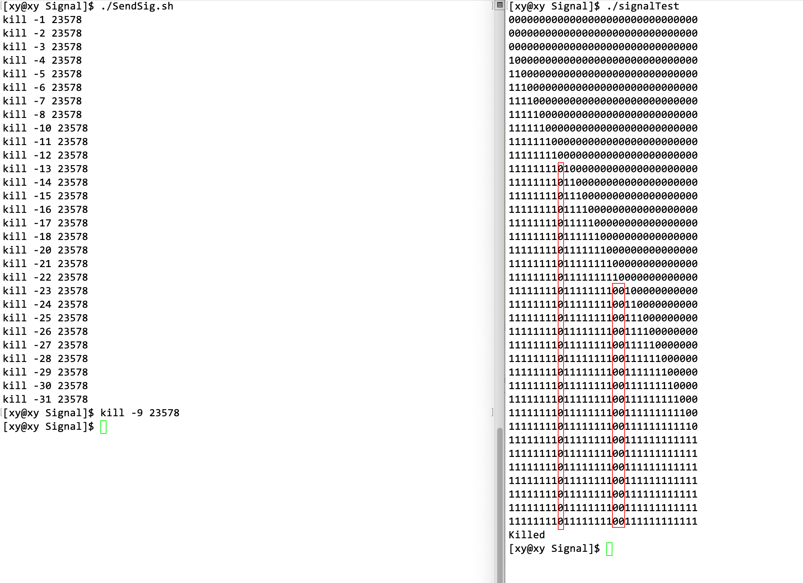

这段代码首先阻塞了所有信号，然后每隔一秒钟检查一次 pending 信号集，并打印出 pending 信号集中的所有信号。如果有未决信号，它会在屏幕上显示为 1，否则显示为 0。本来只有 9 和 19 号不打印 1，即只有 2 列 0，但是这里有 3 列 0。多出来的是 20 号信号。

20 号信号是 SIGTSTP，它是一个终端上发出的停止信号，通常是由用户键入 SUSP 字符（通常是 Ctrl + Z）发出的 1。这个信号可以被处理和忽略。在这里应该是被忽略了。

但最主要的是要知道 9 号和 19 号是不能被捕捉、屏蔽的。

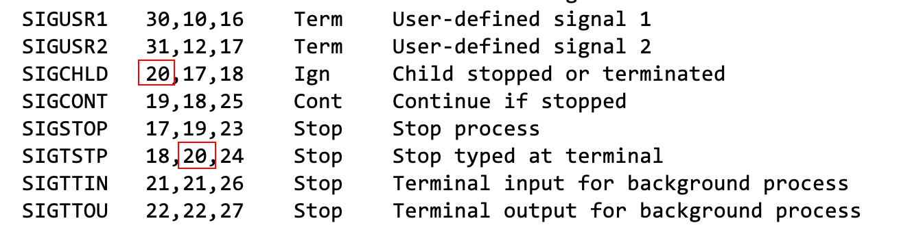

## 4. 捕捉信号

### 4.1 内核空间和用户空间

操作系统会给进程一个大小为 4G 的进程地址空间，在这个虚拟地址空间中划分为两种：

- 0-3G：用户地址空间；
- 3G-4G：内核地址空间。

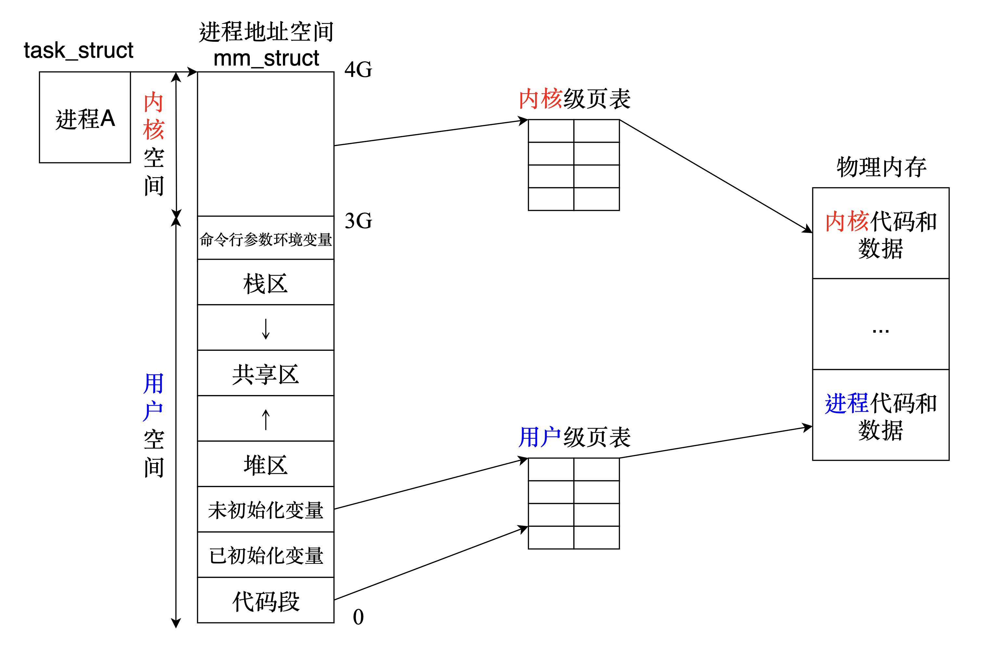

内核空间和用户空间是操作系统中虚拟地址空间的两个部分。内核空间是操作系统内核访问的区域，独立于普通的应用程序，是受保护的内存空间。用户空间是普通应用程序可访问的内存区域，以供进程使用。

> 内核如何使用内核地址空间？

物理内存中只有一份操作系统的代码，另外还有一份<mark>内核级</mark>页表，它可以被所有进程共享，不同进程就可以看到同一个物理内存中的操作系统。任何一个进程调用了系统接口，只要从用户地址跳转到内核地址中（用户态->内核态），然后通过内核级页表找到系统调用对应的代码执行即可。

> 这个“跳转”的动作和动态库是类似的。进程切换的代码也是这样执行的，当前进程在被 CPU 执行，因此当前进程的上下文、地址空间在当前执行流中，所以 OS 是能找到进程的，一旦发生时钟中断，OS 去 CPU 中找当前正在执行的进程，去它的地址空间找到进程切换的函数（即系统调用），然后在进程上下文中切换（跳转）。因此 CPU 将正在执行的进程的临时数据压到进程的 PCB 中，以保证跳转回来时继续使用数据。OS 对每个进程都会执行同样的工作。

### 4.2 内核态和用户态

遗留问题：

> 信号产生之后，可能无法被立即处理，“合适的时候”是什么时候？

首先我们知道，在 操作系统中某些操作需要 root 权限，文件的权限划分等级，以保护重要的文件不被轻易修改，这是一种保护机制。有些信号是硬件产生由操作系统捕捉的，而程序员无法直接从软件层面直接访问硬件，这就是操作系统通过划分权限的限制用户对文件的行为。

内核态与用户态是操作系统的两种运行级别，表示不同的权限等级：

- Kernel Mode：当进程运行在内核空间时就处于内核态，是一种权限非常高的状态。此时 CPU 可以执行任何指令。运行的代码也不受任何的限制，可以自由地访问任何有效地址，也可以直接进行端口的访问。
- User Mode：进程运行在用户空间时则处于用户态，用来执行普通用户代码的状态，是一种受监管的普通状态。进程运行在用户地址空间中，被执行的代码要受到 CPU 的很多检查。

解答上面的问题：

信号产生之后，可能无法被立即处理，<mark>合适的时候就是**从内核态切换为用户态时**</mark>。在内核态返回用户态之前，信号才会被处理。但是由于信号处理函数的代码在用户空间，所以这增加了内核处理信号捕捉的复杂度。如果不是紧急信号，是不会立即处理的。信号相关的数据字段都在进程的 PCB 内部，属于内核，在用户态是无法获取的。所以检测信号（是否被屏蔽），必须是内核状态。在内核态处理好后，再返回用户态。

#### 状态切换

从内核态到用户态的过程是权限缩小的过程，操作系统只信任它自己，想要访问操作系统内核或硬件必须通过系统调用。操作系统的代码只能由操作系统执行，用户的代码就只能由用户进程执行，实际情况用户也会有访问操作系统内部的需求，所以进程会在内核态和用户态两种状态之间切换。

> 什么时候用户态->内核态？

1. 系统调用：当用户程序需要操作系统提供的服务时，会通过系统调用进入内核态。
2. 异常和中断：当发生异常或中断时，CPU 会从用户态切换到内核态，以便内核能够处理异常或中断。
3. 陷阱（Traps）：陷阱是一种特殊的中断，它通常由于执行了特定的指令或者违反了某些规则而触发。例如，当程序试图执行一条特权指令或访问受保护的内存地址时，就会触发陷阱。

在这些情况下，CPU 会从用户态切换到内核态，并开始执行内核代码。当内核完成处理后，它会将控制权返回给用户程序，并从内核态切换回用户态。

一般地，我们将用户态切换为内核态称之为陷入内核，对象一般是 CPU。进程要陷入内核的原因是要调用系统接口，执行内核中的代码。

> 什么时候内核态->用户态？

1. 系统调用完成：当内核完成对系统调用的处理后，它会将控制权返回给用户程序，并从内核态切换回用户态。
2. 异常和中断处理完成：当内核完成对异常或中断的处理后，它会将控制权返回给用户程序，并从内核态切换回用户态。
3. 陷阱（Traps）处理完成：当内核完成对陷阱的处理后，它会将控制权返回给用户程序，并从内核态切换回用户态。

在这些情况下，CPU 会从内核态切换回用户态，并开始执行用户程序代码。

#### 操作系统如何切换进程状态

> 操作系统如何确认进程的优先级状态？这个状态是谁确定的？

**特权级**

CPU 的执行权限是由特权级（Ring）来控制的。x86 架构中有 4 个特权级，分别为 Ring 0、Ring 1、Ring 2 和 Ring 3。数字越大，权限越小，Ring 0 是最高特权级，具有最高的执行权限，可以访问所有的指令和资源。Ring 3 是最低特权级，只能访问受限制的指令和资源。

操作系统内核（内核态）通常运行在 Ring 0，具有最高的执行权限。而用户程序（用户态）通常运行在 Ring 3，只能访问受限制的指令和资源。我们知道，当用户程序需要访问受保护的资源时，它必须通过系统调用进入内核态，由内核代表它执行相应的操作。

**CR3 寄存器**

CPU 中有 2 套寄存器，一套是可见的，一套是它自己用的。其中 CR3 寄存器是 x86 架构中的一个控制寄存器，它用于存储页表的物理地址。当 CPU 需要访问虚拟地址时，它会使用 CR3 寄存器中存储的页表地址来查找对应的物理地址来访问实际的内存。在进程切换时，操作系统会更新 CR3 寄存器的值，以便下一个进程能够使用正确的页表。这样，每个进程都有一个独立的虚拟地址空间，它们可以互不干扰地运行。

**CS 寄存器**

在 x86 架构中，CPU 的执行权限是由其当前的特权级别（Current Privilege Level，CPL）决定的。CPL 是一个 2 位字段，存储在代码段寄存器（CS）的隐藏部分。CPL 的值可以是 0 到 3，数字越大，权限越小。例如，Ring 0 具有最高权限，而 Ring 3 具有最低权限。1 代码段寄存器（CS）的隐藏部分包含一个 2 位字段，称为当前特权级别（CPL），用于存储 CPU 的当前特权级别。

> Ring 和 CPL 是密切相关的概念。CPL 是用来表示当前正在执行的代码所处的特权级别（即 Ring），它一个 2 位字段，即一个由两个二进制位组成的字段。每个二进制位可以是 0 或 1，因此 2 位字段可以表示 4 种不同的状态（00、01、10 和 11）。在 x86 架构中，CPL 的值可以是 0 到 3，对应于四个 Ring 级别。

**int 0x80**

特权级和 int 0x80 指令之间有一定的关系。特权级用于控制 CPU 的执行权限，而 int 0x80 指令是 x86 架构中用于**发起系统调用的指令**。

当用户程序需要使用操作系统提供的服务时，它会通过 int 0x80 指令发起系统调用。这会触发一个软中断，使得 CPU 从用户态切换到内核态。在内核态下，CPU 具有最高的执行权限，可以访问所有的指令和资源。

操作系统内核会根据系统调用号和参数，执行相应的系统调用处理程序。当系统调用处理完成后，内核会将控制权返回给用户程序，并从内核态切换回用户态。

> 系统调用号是一个整数，用于标识特定的系统调用。操作系统内核使用这个号码来确定应该执行哪个系统调用处理程序。

---

**小结**

用户态程序请求内核态服务时，操作系统执行 `int 0x80 `指令，CPU 会将控制权从用户态程序转移到内核态中断处理程序。在这个过程中，CPU 会将代码段寄存器（CS）中的 CPL 修改为 0，表示当前正在执行的代码处于 Ring 0（最高特权级别）。

在内核态中断处理程序完成系统调用后，它会通过执行`iret`指令将控制权返回给用户态程序。在这个过程中，CPU 会将 CS 寄存器中的 CPL 恢复为 3，表示当前正在执行的代码处于 Ring 3（最低特权级别）。

#### 清理进程资源时的状态切换

进程终止时，操作系统会执行一系列清理工作，包括释放进程占用的资源（如内存、文件描述符等），更新进程状态等。这些工作通常是在内核态中完成的。在进程终止之前，操作系统可能会允许进程执行一些清理代码，例如调用进程注册的退出处理程序（exit handler）。这些代码是在用户态中执行的。因此，进程终止时可能会在用户态和内核态之间切换。首先，在用户态执行进程的清理代码；然后，在内核态执行操作系统的清理工作。

> 为什么进程在终止时要切换状态清理资源？只在某一个状态清理不方便吗？难道是因为资源的类型不同吗？

进程在终止时可能会切换到用户态执行清理代码，这主要是为了让进程有机会释放它在用户态分配的资源，或者完成一些其他的清理工作。例如，进程可能会在用户态分配一些动态内存，或者打开一些文件。这些资源是由进程自己管理的，操作系统并不知道它们的存在。因此，在进程终止时，操作系统会允许进程在用户态执行一些清理代码，以便进程能够释放这些资源。此外，进程可能还会注册一些退出处理程序（exit handler），用于在进程终止时执行一些特定的清理工作。这些处理程序也是在用户态中执行的。

当进程从用户态切换到内核态时，操作系统会接管进程的控制权，并执行内核态代码来管理和清理进程占用的资源。操作系统内核包含一组用于管理系统资源和进程的代码。当进程从用户态切换到内核态时，操作系统会调用这些代码来完成各种系统管理任务，包括清理进程占用的资源。例如，当进程在内核态执行`exit`系统调用以终止自身时，操作系统会调用内核中的`do_exit`函数来完成进程终止的相关工作。这些工作包括释放进程占用的内存、关闭进程打开的文件描述符、更新进程状态等。这些工作都是由内核中的代码完成的。

总之，进程在终止时切换到用户态执行清理代码，主要是为了让进程有机会释放它在用户态分配的资源，或者完成一些其他的清理工作。进程在内核态清理，是因为管理系统资源和进程的代码在内核中。

### 4.3 什么是捕捉信号

捕捉信号（catching a signal）是指进程接收到信号后（信号被递达），调用为该信号注册的处理程序来处理信号。

当进程接收到信号时，它可以选择忽略信号、执行信号的默认行为，或者调用为该信号注册的处理程序。如果进程选择调用用户自定义的处理程序，则称为捕捉信号。

进程可以使用`signal`或`sigaction`函数为特定的信号注册处理程序。当进程接收到该信号时，操作系统会调用进程注册的处理程序来处理信号。处理程序是一个用户态函数，可以在其中执行任意的代码，以响应信号。

### 4.4 内核如何协助进程捕捉信号

实际上内核不会直接捕捉信号，而是负责将信号传递给目标进程。进程接收到信号后，可以在用户态中决定如何处理信号：

- 当内核接收到一个信号时，它会检查信号的目标进程。如果目标进程当前正在执行，则内核会将信号传递给该进程。如果目标进程当前处于阻塞状态，则内核会将信号保存在进程的信号队列中，等待进程恢复执行后再传递。

- 当进程接收到信号时，它可以选择忽略信号、执行信号的默认行为，或者调用为该信号注册的处理程序。这些操作都是在用户态中完成的。

捕捉信号属于异常和中断。当一个进程收到一个信号时，操作系统会中断该进程的正常执行流程，并调用该进程注册的信号处理函数。在这个过程中，进程会从用户态切换到内核态，以便内核能够将信号传递给进程并调用相应的信号处理函数。当信号处理函数执行完毕后，控制权会返回给进程，进程会从内核态切换回用户态，继续执行。

#### 处理信号是默认动作

在了解内核如何协助进程捕捉信号之前，需要了解进程处理信号的默认动作，这也可能需要内核的参与。设置一个需要内核参与的情景：

当进程在执行代码时，可能会因为调用了系统接口而陷入内核，在内核中处理完毕即将切换回用户态之前，需要检查 pending 信号集，以确定是否有信号需要传递给进程。如果目标进程当前正在执行，则操作系统会立即将信号传递给该进程。如果目标进程当前处于阻塞状态，则操作系统会将信号保存在进程的信号 pending 信号集中，等待进程恢复执行后再传递。

如果有信号需要传递给进程，则操作系统会根据进程是否有自定义捕捉方式，以不同方式将信号传递给进程：

- 如果待处理信号有自定义处理方式，操作系统会调用进程为该信号注册的处理程序；
- 如果待处理信号的处理动作是默认或者忽略，则执行该信号的默认处理动作后就清除 pending 信号集中对应位置的比特位（1->0），如果没有新的信号要递达，就直接返回用户态，从主控制流程中上次被中断的地方继续向下执行即可。

> 信号可以由内核内部产生，也可以由其他进程发送。无论信号的来源如何，操作系统都会使用相同的方式来传递信号。例如：
>
> - 当进程执行除以 0 的操作时，内核会向进程发送`SIGFPE`信号；当进程试图访问非法内存地址时，内核会向进程发送`SIGSEGV`信号。
>
> - 除了内核内部产生的信号外，进程还可以使用`kill`或`raise`函数向其他进程或自身发送信号。

> 当操作系统检测到信号被 pending 但是没有被 blocked，而且信号有自定义处理方式，此时进程处于内核态，它可以调用自定义处理函数吗？

- 这是因为信号的自定义处理函数是由用户程序定义的，它运行在用户空间中。内核需要将控制权交还给用户程序，以便用户程序能够执行自定义的信号处理函数。这样做可以让用户程序对信号做出响应，例如执行特定的操作或更新程序状态。
- 从权限的角度来说，当然可以，内核态是最高等级权限，原则上内核态的进程可以访问整个 0-4G 地址空间，包括用户地址空间。用户为信号自定义的函数属于用户地址空间，这样做需要谨慎，可能会造成未知错误（尽管内核代码已经很健壮）。

> 有一个我们常见的现象，它随时有可能发生（包括上面的测试）。例如，当进程正在执行读取文件或写入文件的系统调用时，用户按下了 Ctrl + C 组合键来发送中断信号，按了好多次都没办法中断，只有执行完系统调用以后才会被终止。并且，在上面测试遇到死循环捕捉信号时，在 10s 之前信号被阻塞，多次按下 Ctrl + C 也不会打印“捕捉”，只有 10s 解除阻塞才能被捕捉。原因是：

- 当进程在内核态执行系统调用时，操作系统会暂时阻止信号的传递。如果在这段时间内有信号发送给进程，则操作系统会将信号保存在进程的 pending 信号集中，等待进程从内核态切换回用户态后再传递。
- 这样的机制是确保内核代码能够安全地执行完毕，避免出现问题。当进程在内核态执行系统调用时，它正在执行关键的操作，例如读取或写入文件、分配内存等。如果在这个时候立即传递信号并执行信号处理函数，可能会导致内核代码的执行被中断，从而导致系统状态不一致或其他问题。

对于上面这种未决但未被阻塞的信号，且信号的处理动作是默认，进程的状态切换流程时这样的：

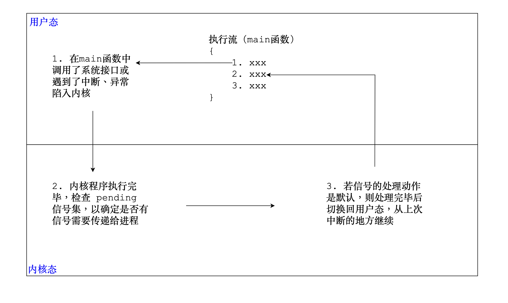

其中，以中间的横线分隔用户态和进程态的进程地址空间。

#### 处理信号是自定义动作

前面都是铺垫和知识上的补充，下面才是内核协助进程捕捉信号的内容。进程接收到信号后，调用为该信号注册的处理程序来处理信号，自定义处理函数属于用户空间，所以为了安全（上面有说明原因），需要切换到用户态执行自定义动作。执行完毕以后再回到系统调用代码内中断的地方，执行完系统调用程序后，再回到 main 函数中的主执行流。

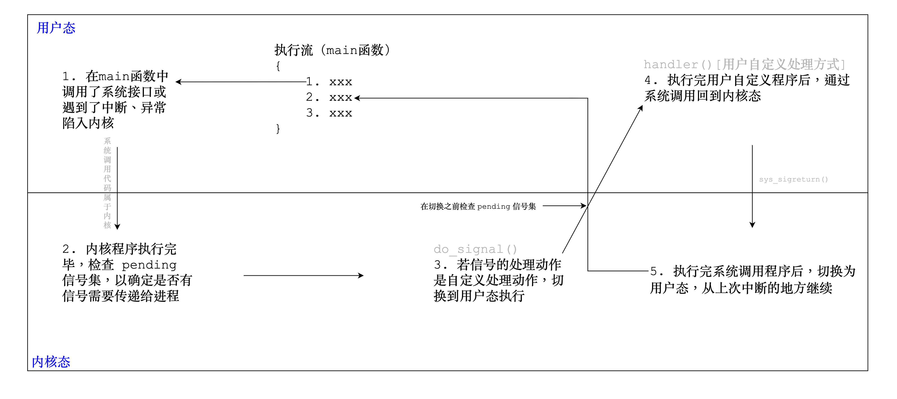

其中的逻辑增加了内核态->用户态执行自定义处理函数、回到内核态继续执行系统调用和执行完系统调用后回到用户态继续执行主执行流。其中切换状态的函数我们暂时不必关心，这是操作系统完成的。

> handler 和 main 函数在不同的堆栈空间，它们之间不存在调用和被调用的关系，是两个独立的控制流程。

上面的流程就像一个$∞$符号，因此可以这样记忆处理信号是自定义动作的进程切换流程：

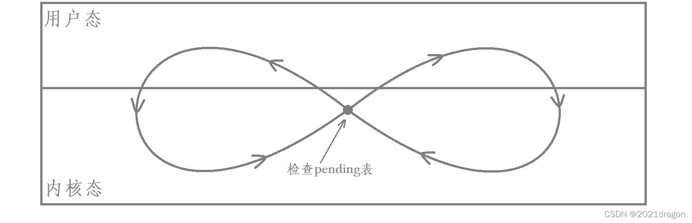

> 图片来源于龙哥的博客 [Linux 进程信号_2021dragon 的博客-CSDN 博客](https://blog.csdn.net/chenlong_cxy/article/details/121315266#_94)

结论：

- 4 次状态切换：4 个交点，箭头代表方向。

- 圆点代表在切换回用户态调用自定义动作之前检查 pending 信号集。

### 4.5 捕捉函数

#### sigaction

除了用前面用过的 signal 函数之外，我们还可以使用 sigaction 函数捕捉信号，它允许调用进程检查和/或指定与特定信号相关联的动作。原型：

```c
##include <signal.h>

int sigaction(int sig, const struct sigaction *restrict act, struct sigaction *restrict oact);
```

参数：

- sig ：指定信号编号。
- act ：指定处理信号的动作（非空）。
- oact ：修改之前原来的处理信号动作（非空）。如果 act 参数是空指针，则信号处理不变；因此，调用可用于查询给定信号的当前处理方式 。

总的来说，它的第二个参数的类型是一个结构体指针，结构体名称也是 sigaction，是一个输入型参数。第三个参数是输出型参数，可以取出旧的（未修改之前） sigaction 结构体。

返回值： 

- 成功：返回 0；
- 失败：返回-1。

struct sigaction 结构体用于描述要采取的动作，它的原型：

```cpp
struct sigaction {
	void(*sa_handler)(int);// 捕捉对应的回调函数
	void(*sa_sigaction)(int, siginfo_t *, void *); 
	sigset_t   sa_mask; // 
	int        sa_flags;
	void(*sa_restorer)(void);
};
```

成员：

- sa_handler：指向信号捕获函数的指针，或者是宏 SIG_IGN 或 SIG_DFL 之一：
  - 函数指针：自定义处理函数；
  - SIG_IGN：忽略信号；
  - SIG_DFL：执行默认动作。
- sa_sigaction：指向信号捕获函数的指针。
  - 是实时信号的处理函数，在此处不做讨论。
- sa_mask：在执行信号捕获函数期间要阻塞的附加信号集。
- sa_flags：影响信号行为的特殊标志。
  - 一般设置为 0

> sa_handler 和 sa_sigaction 占用的存储空间可能重叠，符合规范的应用程序不应同时使用两者。

对于 sa_mask，当信号的处理函数被调用时，内核自动将当前信号加入进程的信号屏蔽字（pending 信号集），当信号处理函数返回时，自动恢复原来的信号屏蔽字，这样就保证了在处理信号时，如果这种信号再次产生，那么它会被阻塞到当前处理结束为止。如果在调用信号处理函数时，除了当前信号被自动屏蔽之外，还希望自动屏蔽另外一些信号，则用 sa_mask 字段说明这些需要额外屏蔽的信号，当信号处理函数返回时，自动恢复原来的信号屏蔽字。

以 2 号信号为例，用 sigaction 函数捕捉信号：

```cpp
void handler(int sigNum)
{
	cout << "捕捉到信号：" << sigNum << endl;
}
int main()
{
	// signal(2, SIG_IGN);
	// 虽然是内核数据类型，但对象储存在用户栈中（局部对象）
	struct sigaction act, oact;
	act.sa_flags = 0;
	sigemptyset(&act.sa_mask);
	act.sa_handler = handler;
	// 设置进当前进程的 PCB 中
	sigaction(2, &act, &oact);
	cout << "默认处理动作：" << (int)(oact.sa_handler) << endl;

	while(1)
	{
		sleep(1);
	}

	return 0;
}
```

> gcc 比较严格会报错，因为强转操作会造成精度损失，编译时可加上 -fpermissive 选项。

定义两个 struct sigaction 类型的局部变量 act 和 oact，将 act 的 sa_flags 字段设置为 0，使用 sigemptyset 函数初始化其 sa_mask 字段，并将其 sa_handler 字段设置为指向前面定义的 handler 函数的指针。oact.sa_handler 是一个指向函数的指针，它指向先前与信号 2 相关联的动作（即默认处理动作）。

然后，使用 sigaction 函数将信号 2 的处理方式设置为 act 所描述的动作，并将先前与信号 2 相关联的动作存储在 oact 中，以便在接收到信号 2（即 SIGINT）时调用 handler 函数。最后，输出先前与信号 2 相关联的动作（即默认处理动作）。

> (int)(oact.sa_handler) 是将 oact 结构体中的 sa_handler 成员强制转换为整数类型并输出，以检查默认的信号处理动作是否符合预期。

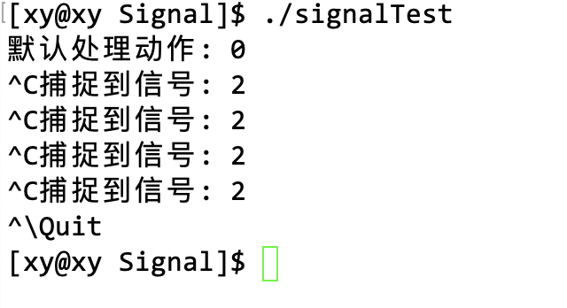

如果将代码中的 signal 去掉注释，捕捉 2 号信号，默认处理动作会发生变化：

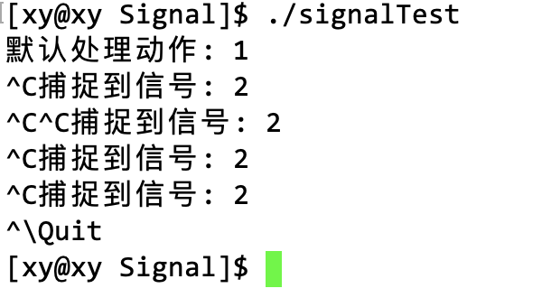

#### as_mask

处理信号时，执行自定义动作，如果在处理信号期间又接收到可能不止一个相同的信号，OS 如何处理？如果自定义捕捉方法中有系统调用的话，一直有相同信号就会一直不断调用，进入内核。OS 无法阻止传入多少个信号，但是能限制什么时候处理信号。

这就是 blocked 屏蔽的意义。

测试：

```cpp
static void showPending(sigset_t *pending)
{
    for (int sig = 1; sig <= 31; sig++)
    {
        if (sigismember(pending, sig)) // 如果信号在 pending 信号集中
            cout << "1";
        else
            cout << "0";
    }
    cout << endl;
}
void handler(int sigNum)
{
	cout << "捕捉到信号：" << sigNum << endl;

	sigset_t pending;
	int count = 10;
	while(1)
	{
		sigpending(&pending);
		showPending(&pending);
		count--;
		if(!count)
			break;
		sleep(1);
	}
}
int main()
{
	struct sigaction act, oact;
	act.sa_flags = 0;
	sigemptyset(&act.sa_mask);
	act.sa_handler = handler;

	sigaction(2, &act, &oact);
	cout << "默认处理动作：" << (int)(oact.sa_handler) << endl;

	while(1)
	{
		sleep(1);
	}

	return 0;
}
```


这就验证了在默认情况下，同时发送多个信号，进程会屏蔽后面的信号，避免信号递归处理。如果想屏蔽 3/5/6 号信号呢？

```cpp
void handler(int sigNum)
{
	cout << "捕捉到信号：" << sigNum << endl;

	sigset_t pending;
	int count = 200;
	while(1)
	{
		sigpending(&pending);
		showPending(&pending);
		count--;
		if(!count)
			break;
		sleep(1);
	}
}
int main()
{
	//signal(2, SIG_IGN);
	// 虽然是内核数据类型，但对象储存在用户栈中（局部对象）
	cout << "PID:" << getpid() << endl;
	struct sigaction act, oact;
	act.sa_flags = 0;
	sigemptyset(&act.sa_mask);
	act.sa_handler = handler;

	sigaddset(&act.sa_mask, 3);
	sigaddset(&act.sa_mask, 4);
	sigaddset(&act.sa_mask, 5);
	sigaddset(&act.sa_mask, 6);
	sigaddset(&act.sa_mask, 7);

	// 设置进当前进程的 PCB 中
	sigaction(2, &act, &oact);
	cout << "默认处理动作：" << (int)(oact.sa_handler) << endl;

	while(1)
	{
		sleep(1);
	}

	return 0;
}
```

注意为了测试，将 count 计数器增大到了 20。


## 5. 可重入函数

> 本小节为学习线程做铺垫。

可重入函数主要用于多任务环境中。一个可重入的函数简单来说就是<mark>可以被中断的函数</mark>，也就是说，可以在这个函数执行的任何时刻中断它，转入 OS 调度下去执行另外一段代码，而返回控制时不会出现什么错误。

首先要明确一点：信号捕捉并未创建新的进程或线程，信号处理是单进程的，只在一个进程的上下文处理。

### 5.1 引例 1

假设有一个函数用于计算两个数的和，它使用了一个全局变量来存储结果。如果这个函数在执行过程中被中断，并且中断处理程序也调用了这个函数，那么全局变量的值就会被改变，导致原来的计算结果出错。这样的函数就是不可重入的。

相反，如果这个函数不使用全局变量，而是将结果作为返回值返回，那么即使在执行过程中被中断，也不会影响计算结果。这样的函数就是可重入的。

### 5.2 引例 2

光看文字难以理解，有头结点的链表插入操作也可以用来说明可重入函数的概念。

假设有一个函数用于在有头结点的链表中插入一个新节点。如果这个函数使用了一个全局变量来存储链表的头结点，那么当这个函数在执行过程中被中断，并且中断处理程序也调用了这个函数时，全局变量的值就会被改变，导致原来的插入操作出错。这样的函数就是不可重入的。

相反，如果这个函数不使用全局变量，而是将链表的头结点作为参数传递给函数，那么即使在执行过程中被中断，也不会影响插入操作。这样的函数就是可重入的。

为了方便，下面用一个有 head 指针的链表头插操作为例。对于一个有头结点的链表，它定义在全局，两个新结点 node2 和 node3 也是全局的。

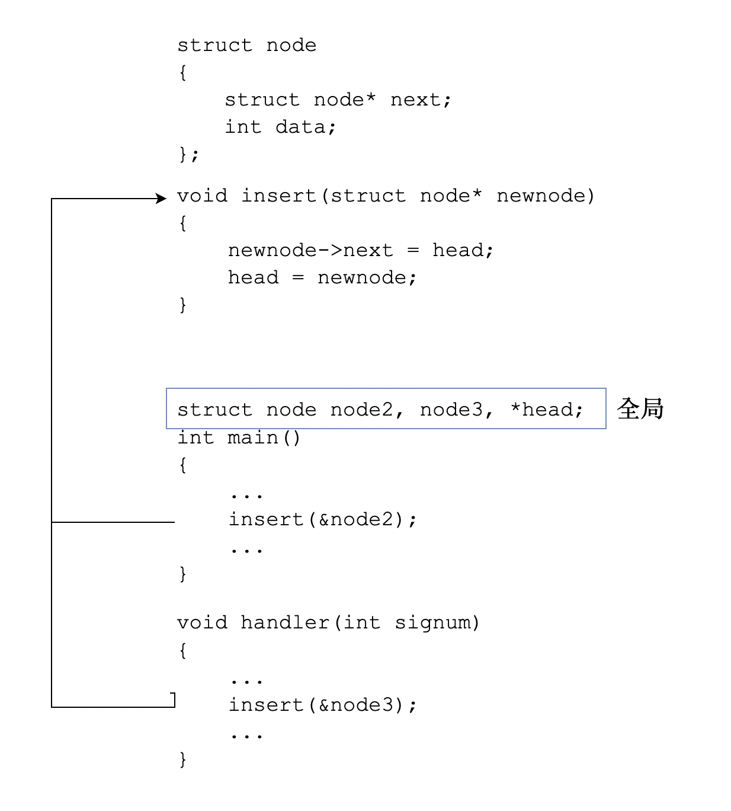

在 main 函数中调用了 insert 函数插入新结点 node2，而某个自定义的信号处理函数中也插入了新结点 node3 。插入的步骤分为两步：

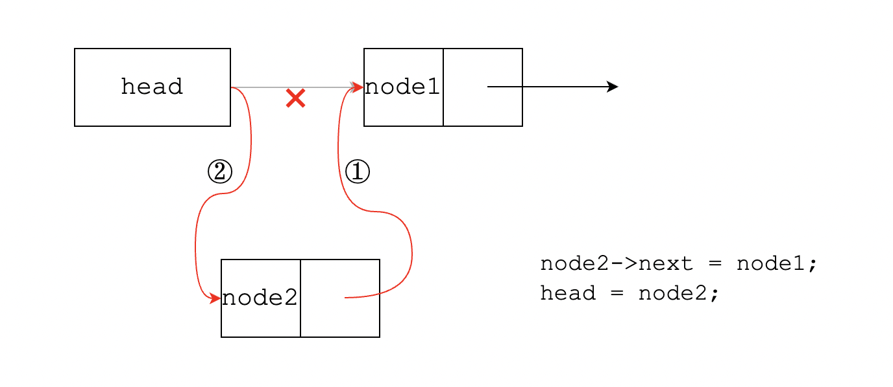

这里并未强调插入的步骤是如何的，只是为了说明插入步骤是需要一定时间的，也就是说，插入操作有可能被中断。

首先要明确的是，当 main 函数在执行插入操作时遇到硬件中断，它会被暂停，CPU 会切换到内核态，开始执行中断处理程序。在中断处理程序执行完毕后，CPU 会切换回用户态，继续执行 main 函数中被暂停的插入操作。如果硬件中断触发的信号有用户自定义的信号捕捉函数，那么在中断处理程序执行完毕后，操作系统会调用用户自定义的信号捕捉函数。

> 在本文的 2.4 小节中说明了硬件中断的发生。

在中断信号发生之前，main 函数中的 insert 函数优先被调用，用于插入 node2 结点。假如它只进行了插入操作的第一步，中断信号就发生了，此时 CPU 会陷入内核。执行完中断程序后便调用自定义信号捕捉函数 handler，而 handler 中也调用了 insert 用于插入 node 3。注意，此时 main 函数中的 insert 还未执行完。

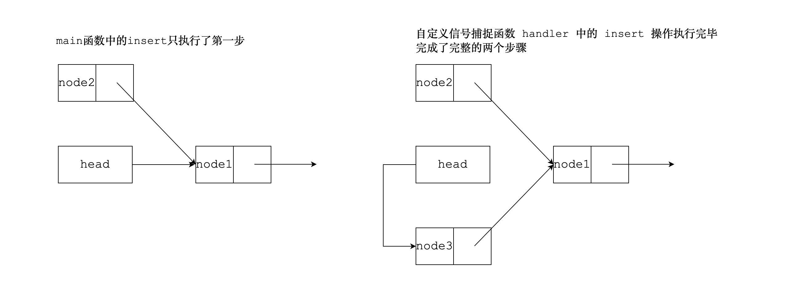

当 CPU 处于内核态执行完自定义信号捕捉函数 handler 中的 insert 的两个步骤后，整个链表的状态是这样的。CPU 切换回用户态后，继续执行 main 函数的 insert 操作剩下的第二步：头插后更新头结点。

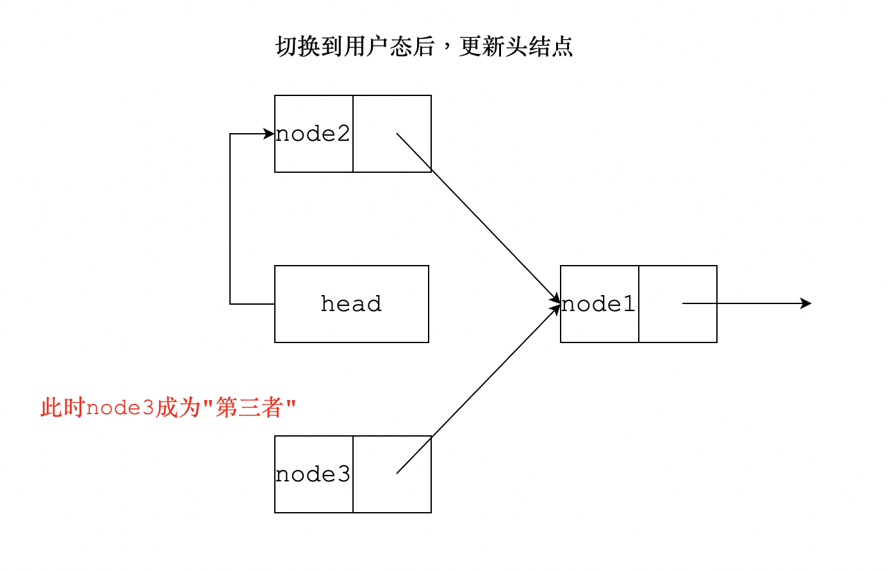

可见，虽然 main 函数的 insert 操作和 handler 的 insert 操作都被完整地执行完毕，但是就是执行的顺序上的错误造成了 node3 结点无法被链接到链表中，造成了内存泄漏。

> 通过头结点 head 无法找到 node3 ，那么在释放资源时也无法释放 node3 结点的资源，造成内存泄漏。
>
> 正确的顺序：①②①②
>
> 上面的顺序：① ①② ②，其中中间的①②是 handler 中 insert 的操作，而 main 函数中的 insert 被拆分了。错就错在最后执行了两次更新 head 头结点的指针。

像这样，insert 被不同的控制流调用（main 函数和 handler 函数属于不同栈帧，是两个独立的控制流程），中断上一次 insert 的执行后再次调用相同的函数 insert 的现象，就叫做重入。

在此例中，insert 函数操作的是一个全局定义的链表，它对不同函数是可见的，因此有可能因为重入现象出错，像这样的函数我们称之为不可重入函数，反之，如果一个函数只访问局部变量或参数，则称之为可重入（Reentrant）函数。

### 5.3 特点

大多数函数都是不可重入函数，可重入函数和不可重入函数没有明显的标志，它们之间的区别在于它们是否依赖于全局变量或其他共享资源。

- 可重入函数不依赖于全局变量或其他共享资源，因此它们可以在多线程或多任务环境中安全地使用。它们通常只使用局部变量和函数参数，并且不调用不可重入的函数。

- 不可重入函数依赖于全局变量或其他共享资源，因此它们在多线程或多任务环境中可能会出现问题。它们可能会使用全局变量、静态变量或调用不可重入的函数，例如 malloc、free 和标准 I/O 函数。

总之，判断一个函数是否可重入需要检查它的实现，看它是否依赖于全局变量或其他共享资源。如果一个函数符合以下条件之一则是不可重入的：

1. 调用了 malloc 或 free，因为 malloc 也是用全局链表来管理堆的。
2. 调用了标准 I/O 库函数，因为标准 I/O 库的很多实现都以不可重入的方式使用全局数据结构。
3. STL 容器、被 static 修饰的函数。.....

## 6. volatile 关键字

volatile （易变的）是一种类型修饰符，用于保持变量的内存可见性。

volatile 关键字通常用于多线程环境中，volatile 提醒编译器它后面所定义的变量随时都有可能改变，当一个变量被多个线程访问和修改时，使用 volatile 可以防止编译器对该变量的读取和存储进行优化。这样可以确保每次读取该变量时都是从内存中读取最新的值，而不是使用寄存器中的缓存值。

这么做的原因是：寄存器中的值可能会被其他进程或线程修改，这是 CPU 无法察觉的。当一个变量被多个线程访问和修改时，如果编译器对该变量的读取和存储进行优化，可能会使用寄存器中的缓存值，而不是从内存中读取最新的值。这样可能会导致读取到过期的数据。

> 例如，在 C 语言中，volatile 关键字可以用于修饰并行设备的硬件寄存器、中断服务程序中修改的供其它程序检测的变量、多任务环境下各任务间共享的标志等。

### 6.1 示例 1

```cpp
##include <iostream>
##include <unistd.h>
##include <signal.h>
using namespace std;

int flag = 0; // 定义一个全局变量

void changeFlag(int signum) // 打印变量的变化
{
	(void)signum;
	cout << "change flag: " << flag;
	flag = 1;
	cout << "->" << flag << endl;
}
int main()
{
	signal(2, changeFlag);
	// 接收到 2 号信号，在 changeFlag 中
	// flag: 0->1, 循环
	// !flag:1->0, 终止循环
	while(!flag);
	cout << "进程退出，flag: " << flag << endl;
	return 0;
}
```

它定义了一个全局变量 flag，并在 changeFlag 函数中将其值从 0 改为 1。当程序接收到 2 号信号时，会调用 changeFlag 函数。程序会一直循环，直到 flag 的值被改变为 1。


这是未被优化的情况，说明 CPU 察觉到了全局变量 flag 从 0->1，才能结束循环，终止进程。

> 注意，这里的 while(!flag) 中并未 sleep，稍后会解释它存在与否对结果的影响。

对于 gcc/g++ 编译器 `-O3` 选项是用来开启编译器的最高级别优化，其中之一就是通过寄存器保存并获取变量的值，而不从内存中获取，以此提高速度。

`-O3`选项的位置应该在源文件之前：

```makefile
g++ -std=c++11 -O3  -o $@ $^
```

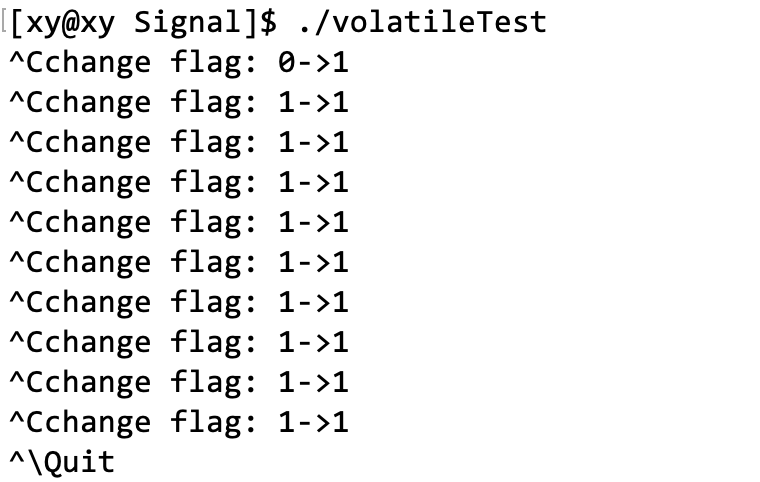

即使捕捉到 2 号信号在自定义处理函数中第一次打印了 0->1，继续执行 while 时，并不能终止循环。首先要知道，CPU 运算数据，首先要将内存中的数据 load 到 CPU 上，对于全局变量也是一样的，不过编译器优化后，它只会检查在 main 函数中修改它的语句，如果有修改才会重新 load 到 CPU 上，然而这里没有在 main 修改，而是在回调函数中修改的。优化以后，CPU 只在第一次使用全局变量时将它 load 到 CPU 中，并用寄存器保存着，main 中无修改的语句，它就会一直使用寄存器中的值，所以这里在 CPU 眼中的全局变量 flag 一直是初识状态的 1。

要避免这种情况，就要用 volatile 修饰全局变量 flag，告诉编译器让 CPU 每次使用这个变量时都到内存中 load。

除此之外，在 while 中使用 sleep 也能达到同样的效果。原因是：sleep 函数会让程序暂停执行一段时间，这样可以让操作系统有机会调度其他进程运行。当使用 g++ 编译器加上 -O3 选项来编译这段代码时，编译器会进行更多的优化，其中之一就是循环展开。如果没有在循环中加入 sleep 函数，那么编译器可能会认为这个循环永远不会终止，因此它会将循环展开成一个无限循环，导致程序无法退出，也就无法抽出空隙更新 flag 的值，虽然 -O3 选项的存在也使得 CPU 无法获取内存中变量的实时值，但单纯的 while 死循环会占用 CPU 大量的算力。

> 优化的时机是编译时还是运行时？

在编译时。CPU 根本不关心程序要做什么，它只是单纯地执行编译后的可执行程序，这些优化处理是编译器应该做的事。不要因为结果运行后才能知道，就认为优化的时机是运行时。

## 7. SIGCHLD 信号

当一个进程终止时，会发送 SIGCHLD 信号给其父进程。子进程终止时会向父进程发送 SIGCHLD 信号，告知父进程回收自己，但该信号的默认处理动作为忽略，因此父进程仍然不会去回收子进程，但是父进程可以实现自定义处理 SIGCHLD 信号的函数。这一机制使得父进程不再需要通过 wait 或 waitpid 函数回收子进程资源了，因为这两种方式都会占用父进程一定的资源：wait 必须让父进程阻塞等待子进程结束；waitpid 必须让父进程对子进程轮询。

只要父进程自定义 SIGCHLD 信号的处理动作，在信号处理函数中调用 wait 或 waitpid 函数清理子进程即可，子进程终止时也会通知父进程。这样父进程就只需专心处理自己的工作，不必关心子进程，提高效率。

> 发送信号的本质是操作系统发送信号给进程。

下面这段代码演示了使用 signal 函数来处理子进程退出时发送的 SIGCHLD 信号。

```cpp
##include <iostream>
##include <unistd.h>
##include <signal.h>
using namespace std;

void handler(int signum)
{
	cout << "子进程退出，信号编号：" << signum << ", 父进程 PID: " << getpid() << endl;

}
int main()
{
	signal(SIGCHLD, handler);
	int n = fork();
	if(n == 0) // 子进程
	{
		int count = 5;
		cout << "子进程 PID: " << getpid() << endl;
		cout << count << "秒后子进程终止" << endl;
		while(count)
		{
			sleep(1);
			cout << count-- << endl;
		}
		exit(0);
	}
	// 父进程
	while(1)
	{
		sleep(1);
	}
	return 0;
}
```


在 main 函数中，首先使用 signal 函数将 SIGCHLD 信号与 handler 函数关联起来，然后使用 fork 函数创建一个子进程。

在子进程中，程序会打印出子进程的 PID，并等待 5 秒后退出。在父进程中，程序会一直循环等待。当子进程退出时，操作系统会向父进程发送一个 SIGCHLD 信号，父进程接收到这个信号后会调用 handler 函数来处理这个信号。在 handler 函数中，程序会打印出信号的编号和父进程的 PID。

通过演示过程证明了子进程退出会向父进程发送 17 号信号，同时可以知道，即使在进程外部给父进程发送 17 号信号，它也是能够识别的。

----

这段代码与上一段代码类似，不同之处在于，在 handler 函数中，程序使用了一个循环来调用 wait 函数。

```cpp
void handler(int signum)
{
	cout << "子进程退出，信号编号：" << signum << ", 父进程 PID: " << getpid() << endl;
	while(wait(nullptr));
}
int main()
{
	signal(SIGCHLD, handler);
	pid_t id = fork();
	if(id == 0) // 子进程
	{
		int count = 5;
		cout << "子进程 PID: " << getpid() << endl;
		cout << count << "秒后子进程终止" << endl;
		while(count)
		{
			sleep(1);
			cout << count-- << endl;
		}
		exit(0);
	}
	// 父进程
	while(1)
	{
		sleep(1);
	}
	return 0;
}
```


> 父进程调用 wait 函数来回收子进程的资源。此外，wait 函数还可以让父进程获取子进程的退出状态，以便根据子进程的运行结果来执行相应的操作。

可见子进程发送信号 SIGCHLD 信号时，如果同时收到多个 wait，OS 只会保留一个。

----

如果不想让父进程等待子进程，并且还想在子进程退出以后自动回收僵尸子进程：
```cpp
int main()
{
	pid_t id = fork();
	if(id == 0) // 子进程
	{
		cout << "子进程 PID: " << getpid() << endl;
 		sleep(5);
		exit(0);
	}
	// 父进程
	while(1)
	{
		cout << "父进程 PID: " << getpid() << ", 执行任务" << endl;
		sleep(1);
	}
	return 0;
}
```

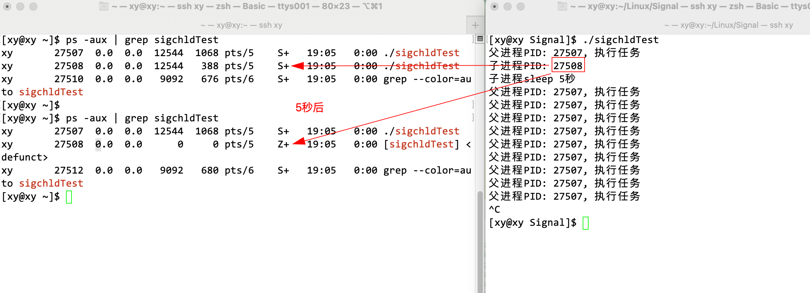

---

如果想不等待子进程，既自动让子进程退出，又想让它自己回收资源。可以用 signal 函数手动设置捕捉到 SIGCHLD 信号后以忽略方式处理：

```cpp
signal(SIGCHLD, SIG_IGN);
```

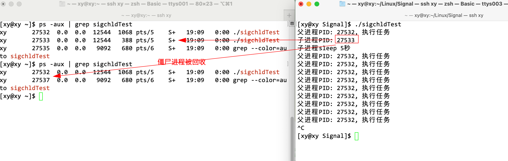
