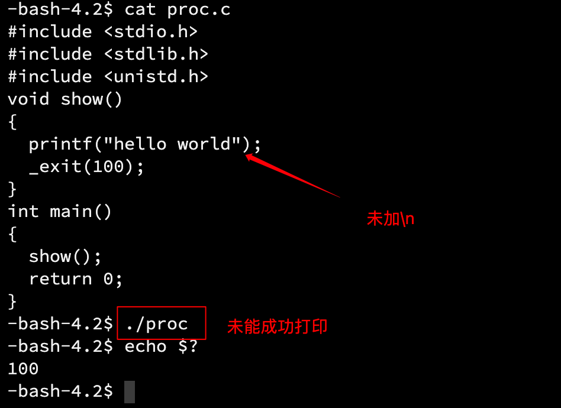

##  1. 创建进程

###  1.1 认识 fork

在 [进程概念]() 中已经说明 fork 函数的用法：在已有的进程中使用 fork 函数，会创建一个子进程，而父进程就是原进程。

fork 函数的位置就是一个分界点，fork 之前的代码由父进程执行，之后的代码分别由父子进程执行。

> 实际上，这里的父子进程共享所有代码，只是 fork 函数在语法上限制了子进程执行的语句范围，原因是 OS 会将 fork 的位置传给子进程，让子进程从这个位置开始执行。
>
> 进程调用 fork 函数，当控制转移到内核中的 fork 代码后，内核会做以下事情：
>
> - 分配新的内存块和内核数据结构给子进程；
> - 将父进程部分数据结构内容拷贝至子进程； 
> - 添加子进程到系统进程列表当中； 
> - fork 返回，开始调度器调度。

```cpp
##include <stdio.h>
##include <unistd.h>
##include <stdlib.h>
##include <sys/types.h>                                                                                         
int main()
{
  printf("fork before:PID:%d\n", getpid());
  pid_t id = fork();
  if(id == -1)//错误
  {
    printf("error\n");
  }
  printf("fork after:PID:%d, PPID:%d\n", getpid(), getppid());
  return 0;
}
```

运行以上代码，查看 PID 和 PPID：


可以看到，fork 之前的代码只执行了一次，fork 之后的代码执行了两次。说明 fork 之后的代码父子进程都会执行。

#### fork 函数的返回值

给子进程返回 0；给父进程返回子进程的 PID，子进程创建失败则返回-1。

> 为什么给子进程返回 0，而对父进程返回子进程的 PID 呢？

首先要明确创建子进程的目的：指派任务给子进程执行。PID 对于进程而言就是一个名字，标识。父进程可以有多个子进程，子进程只有一个父进程，所以父进程必须知道子进程的标识。

> 为什么 fork 有两个返回值？

fork 之后的代码中，包括最后的 return 语句，由于 fork 之后的语句父子进程都要执行，return 语句也不例外。

###  1.2 写时拷贝

在任意一方未进行写入数据的操作时，父子进程是共享代码和数据的。只要当任意一方写入数据，这时才会拷贝一份，然后修改部分代码和数据，得到属于各自的代码和数据。


> 为什么不在创建子进程的一开始就进行数据拷贝、修改等操作？

- 为了按需分配内存，高效地使用内存空间。子进程不一定会使用父进程的所有数据和代码，而且子进程在不写入数据的情况下，也没有必要对数据进行拷贝、修改。

#####  意义

分离父子进程，保证其独立性。写时拷贝本质是一种延时申请的技术，提高内存使用率。

### 1.3 fork 的常规用法

- 一个进程希望复制自己，使子进程同时执行不同的代码段。例如父进程等待客户端请求，生成子进程来处理请求；
- 一个进程要执行一个不同的程序。例如子进程从 fork 返回后，调用 exec 函数。

###  1.4 fork 调用失败的原因

- 系统中有太多的进程，内存空间不足，子进程创建失败；

- 实际用户的进程数超过了限制，子进程创建失败。

##  2. 进程终止

进程终止，本质就是 OS 释放系统资源，释放进程之前申请的相关内核数据结构和对于的数据和代码。

###  2.1 进程退出的情况

进程退出有三种情况：

- 代码执行完，结果正确；

- 代码执行完，结果不正确；
- 代码未执行完，程序崩溃。

>  对于前两种代码执行完的情况，OS 是怎么知道结果是正确还是错误？

- 在学习 C 语言的初期，我们就知道 main 函数是程序的入口，但是我们并没有理解它。实际上，每个程序都有一个 main 函数。那么 main 函数的返回值的意义就在于此，可以让 OS 知道程序运行后的情况如何，以便 OS 调度或提醒用户。

> 为什么 main 函数的 return 语句总是 return 0？它有什么含义吗？return 1、2、3 不行吗？

- main 函数的返回值是可以自己设置的，这个返回值叫做「退出码」，程序员或 OS 以退出码判断运行结果是否正确。return 语句的意义就是返回给上一级进程，以批判该进程执行结果（可以忽略）。
- 非零值有无数个，不同的非零值就可以表示不同的错误原因。返回值（退出码）可以有不同的结果，方便定位错误原因。

使用指令`echo $?`查看上一个进程的退出码：


对于程序员，我们只看返回码是无法知道是什么错误的，所以每个返回码都有对应的错误表。就像 ls 指令打印出的错误一样（后面的选项是随便打的）。


实际上，退出码都是有映射到各种不同的字符串的，这些字符串就像上面 ls 的报错一样。

通过 strerror 函数可以获取错误码和错误信息字符串的映射关系：

```cpp
##include <stdio.h>
##include <string.h>
int main()
{
  for(int i = 0; i < 150; i++)
  {
  printf("%d:%s\n", i, strerror(i));
  }
  return 0;                                                                 
}
```


可以看到，上面 ls 的错误就是退出码为 2 映射的字符串。

> 退出码映射的字符串都有不同的含义，帮助程序员定位执行失败的原因，这是 C 语言中的退出码和字符串的映射关系，映射关系是人为规定的，不同情况下会有不同的含义。

###  2.2 进程退出的方法

正常退出：

- main 函数中的 return 语句；
- 在任何地方调用 exit 函数；
- 在任何地方调用_exit 函数。

> return 代表函数调用结束，exit 是一个接口。

异常退出：

- ctrl + c，信号终止。

####  return 语句退出

上面演示过，return 后可以自定义退出码，通过`echo $?`指令可以查看验证。

####  exit 函数退出

```cpp
##include <stdio.h>
##include <stdlib.h>
void show()
{
  printf("hello world");
  exit(99);
}
int main()
{
  show();
  return 0;
}
```


在这段代码中，exit 会在进程终止前将缓冲区中的数据刷新出来。

####   _exit 函数退出

同样是上面的代码，将 exit 换成_exit，注意包含头文件`<unistd>`：

```cpp
##include <stdio.h>
##include <stdlib.h>
##include <unistd.h>
void show()
{
  printf("hello world");
  _exit(100);
}
int main()
{
  show();
  return 0;
}
```



但是如果在打印语句中加上换行符呢：


结果却可以打印，为什么？

####  三者的区别

- return：只有 main 函数中的 return 语句才能让进程退出，其他函数中的 return 语句不能；exit 和_exit 函数在任何地方都可以让进程退出。
- exit 函数在退出进程前，会执行用户定义的清理函数，冲刷缓冲，关闭流等操作，然后才终止进程；而_exit 直接终止进程，不会做任何收尾操作。
- exit 是一个函数，而_exit 是一个系统调用。

> 「系统调用」，是 system calls 的直译，可以简单地理解为 OS 提供给上层的接口，是系统级别的函数。


重新回看那个、n 的问题，因为 exit 会冲刷缓冲，所以就算不加、n 最后也会打印出来，而没有收尾操作的、_exit，就没办法打印。这就说明「缓冲区」一定不在 OS 内部，而是 C 标准库为我们维护的。如果是 OS 维护，_exit 也可以将缓冲区中的内容刷新出来。

####  三者的联系

事实上，main 函数中的 return 语句会隐式地调用 exit 函数。

而 exit 函数在执行完毕收尾操作后，会调用_exit 函数终止进程。

也就是说，_exit 是最底层的函数，其他两个函数都是由封装而来的。

##  3. 进程等待

###  3.1 原因

进程等待是对于父进程而言的，也就是说等待的进程是子进程。

- 如果子进程退出，父进程不回收，那么子进程会变成僵尸进程；
- 僵尸进程是无法用`kill -9`指令杀死的；
- 父进程创建子进程，其目的是让子进程工作，如果父进程对子进程不管不顾，这就违背了创建子进程的初衷；
- 父进程需要通过进程等待，回收子进程的资源，获取子进程的退出信息。

###   3.2 子进程 status 参数

进程的 status 参数是一个 int 类型参数，但是它的不同范围的比特位储存着不同的信息（此处只研究低 16 位）。


在 status 的低 16 比特位当中，高 8 位表示进程的退出状态，即退出码。进程若是被信号所杀，则低 7 位表示终止信号，第 8 位比特位是 core dump 标志。


在头文件`<sys/wait.h>`中，提供了一些宏简化位运算操作：

```cpp
if (WIFEXITED(status)) {
	// 正常退出：((status) & 0x7f) == 0
	// 打印退出码：(status >> 8) & 0xff
	printf("child return: %d\n", WEXITSTATUS(status));
} else if (WIFSIGNALED(status)) {
	// 异常退出：((signed char) (((status) & 0x7f) + 1) >> 1) > 0
	// 打印异常信号值：(status) & 0x7f
	printf("child signal: %d\n", WTERMSIG(status));
}
```

其中，我们需要了解两个宏：

- WIFEXITED(status)：如果进程正常退出，返回的值是非零值。作用是用值的真假判断进程是否正常退出；
- WEXITSTATUS(status)：如果 WIFEXITED 非零，得到的是进程的退出码。

> 这里的 status 参数是针对进程正常退出而言的，如果进程因为崩溃（或其他不正常的方式）退出，这里的参数也是没有意义的。对于 return 语句，如果进程在它之前因为崩溃而退出，那么 return 的退出码也就没有意义了，因为根本没有执行 return 语句。
>
> 程序异常退出或崩溃，本质上是 OS 杀掉了进程，这和语言是无关的。OS 如何杀掉进程？--发送信号。

###  3.3 进程等待的方法

####  wait 函数

**函数声明和头文件**

```cpp
##include<sys/types.h>
##include<sys/wait.h>
pid_t wait(int* status);
```

**参数**

指向 status 参数的指针，如果不需要监视，设置为 NULL。

**返回值**

- 成功：返回进程 PID；
- 失败：返回-1。

**作用**

等待任意子进程。

下面用 fork 创建一个子进程，然后让子进程工作一段时间，在这段时间中，使用 wait 函数让父进程等待子进程结束。子进程结束以后父进程读取子进程的信息，然后打印子进程的 status 参数。

```cpp
##include <stdio.h>
##include <stdlib.h>
##include <unistd.h>
##include <sys/types.h>
##include <sys/wait.h>
int main()
{
    pid_t id = fork();
    if(id == 0)//子进程创建成功
    {
        int count = 5;
        while(count--)
        {
            printf("子进程：PID：%d, PPID:%d\n", getpid(), getppid());
            sleep(1);
        }
        exit(99);
    }
    //父进程
    int status = 0;//定义一个 status 参数，等下传入 wait 中后再提取
    pid_t ret = wait(&status);
    if(ret > 0)//wait 子进程退出成功，返回它的 pid
    {
        printf("等待子进程退出成功、n");
        if(WIFEXITED(status))//如果是正常退出，条件为真
        {
            printf("子进程退出码：%d\n", WEXITSTATUS(status));
        }
    }
    sleep(3);
    return 0;
}
```


在进程运行时，在另一个终端用下面的脚本监控系统进程的情况：
```shell
while :; do ps axj | head -1 && ps axj | grep proc | grep -v grep;echo "#####################";sleep 1;done
```


从监控结果可以看到，子进程结束以后被父进程回收，不会变成僵尸进程。

####  waitpid 函数

**函数声明和头文件**

```cpp
##include<sys/types.h>
##include<sys/wait.h>
pid_t waitpid(pid_t pid, int* status, int options);
```

**参数**

- pid：待等待的子进程的 PID。如果为-1，表示等待任意子进程；
- status：同上；
- options：
  - `WNOHANG`，如果等待的子进程未结束，则 waitpid 函数的返回值为 0，不再等待；如果正常结束，则返回子进程的 PID；
  - `WUNTRACED`，如果子进程进入暂停执行情况则马上返回，但结束状态不予以理会。

> options 的不同选项，实际上是 C 语言中的宏。为什么是 C 语言？原因：Linux 内核是由 C 语言写的，而 wait 和 waitpid 是系统调用，也就是内核对外开放的接口，也就是 C 语言函数。
>
> 宏的作用是将抽象的数据赋予意义。

**返回值**

- 等待成功则返回等待进程的 PID；
- 如果设置了选项`WNOHANG`，而调用中 waitpid 函数如果判断没有已退出的子进程的信息，返回 0；
- 如果出错，返回-1，errno 会被设置成相应的值以指示错误所在。

**作用**

- 等待指定 PID 进程或任意进程。

####  wait 和 waitpid 的区别

**效果不同**:

wait 会令调用者阻塞，直至某个子进程终止。

waitpid 可以设置一个选项（options）设置为非阻塞，另外 waitpid 并不是等待第一个进程结束而是等待 PID 指定的进程。

waitpid 有 wait 没有的三个特性：

- waitpid 使我们可以等待指定的进程；
- waitpid 提供了一个无阻塞的 wait；
- waitpid 支持工作控制。

> wait 和 waitpid 作为系统调用，它的执行者是 OS，本质上就是 OS 帮我们拿到进程的信息（task_struct）。
>
> 父进程不等待子进程，会造成僵尸进程，这是系统层面上的内存泄漏，跟我们 new 或 malloc 出来的内存空间造成的内存泄漏是不一样的。
>
> 通过 status 参数，父进程可以知道子进程的状态。

####  阻塞等待和非阻塞等待

**阻塞等待**

使用 wait 会令调用者阻塞。被阻塞的进程对于系统而言，无非两种情况：一是等待被调度，也就是这个进程没有被 CPU 调度（CPU 本来就很忙）；二是在阻塞队列中。

**非阻塞等待**

父进程通过 waitpid 等待子进程，如果子进程没有退出，waitpid 直接返回。

**阻塞和唤醒**

一般进程阻塞，伴随着被切换的操作，也就是如果进程不运行了，OS 将它的 PCB 放到排队队列中，在用户层面看来，就好像卡住了一样。将 PCB 放到运行队列中，就是进程运行起来了。

####  阻塞调用和非阻塞调用

调用的主体是父进程，被调用的是 wait 和 waitpid 函数。

- 阻塞调用：父进程一直等待子进程结束；
- 非阻塞调用：父进程会每隔一段时间后查询子进程是否结束，在这些间隔内，父进程可以做自己的事情。

示例

##  4. 进程程序替换

### 4.1 替换原理

fork 之后，父子进程各自执行父进程代码的一部分，这一部分对于用户而言是重复的，而创建子进程的初衷就是让它去干父进程之外的事情（这一点在接触『进程』后已经提到过不止一次）。虽然可以通过写时拷贝让父子进程拥有属于它们各自的数据，但是代码依然是共享的，也就是说，它们虽然数据不同，但是执行的任务还是一样的。

**进程程序替换就是让子进程通过特定的接口（exec 函数），加载磁盘上的一个全新的程序（代码和数据），加载到调用进程的进程地址空间中。**子进程执行不同的程序，叫做替换。

当执行进程替换操作后，子进程的代码和数据被新程序的代码和数据替换，并从新程序开始执行。

> 子进程进行进程替换，有没有创建一个新的子进程？

- 没有。进程=内核数据结构（PCB）+代码+数据，因为内核数据结构没有发生改变，所以没有创建新的进程。

> 子进程进行进程替换后，会影响父进程的代码和数据吗？

- 不会。进程替换，实质上是对子进程的数据进行写入操作。一旦父子进程的任何一方发生数据写入操作，写时拷贝技术就会发挥作用，为写入数据的一方另外创建一份代码和数据。所以父子进程的代码和数据是分离的。

> 子进程进行程序替换后，环境变量相关数据会被替换吗？

- 不会。因为每个进程都有自己的环境变量。环境变量以进程为单位，子进程继承父进程的环境变量。关于环境变量，可以参看这篇文章：[环境变量的来源、原理与应用](https://www.polarxiong.com/archives/%E7%8E%AF%E5%A2%83%E5%8F%98%E9%87%8F%E7%9A%84%E6%9D%A5%E6%BA%90-%E5%8E%9F%E7%90%86%E4%B8%8E%E5%BA%94%E7%94%A8.html)。

###  4.2 exec 函数族

exec 函数族提供了一个在进程中启动另一个程序执行的方法。它可以根据指定的文件名或目录名找到可执行文件，并用它来取代原调用进程的数据段、代码段和堆栈段，在执行完之后，原调用进程的内容除了进程号外，其他全部被新的进程替换了。

**头文件**

```cpp
##include <unistd.h>
```

**函数原型**

```cpp
int execl(const char * path,const char * arg,…);
int execle(const char * path,const char * arg,char * const envp[]);
int execlp(const char * file,const char * arg,…);
int execv(const char * path,char * const argv[]);
int execve(const char * path,char * const argv[],char * const envp[]);
int execvp(const char * file,char * const argv[]);
```

**参数说明**

- path：要执行的程序路径。可以是绝对路径或者是相对路径。在 execv、execve、execl 和 execle 这 4 个函数中，使用带路径名的文件名作为参数；
- file：要执行的程序名称。如果该参数中包含“/”字符，则视为路径名直接执行；否则视为单独的文件名，系统将根据 PATH 环境变量指定的路径顺序搜索指定的文件；
- argv：命令行参数的数组；
- envp：带有该参数的 exec 函数可以在调用时指定一个环境变量数组。其他不带该参数的 exec 函数则使用调用进程的环境变量；
- arg：程序的第 0 个参数，即程序名自身。相当于 argv[O]。
- …：命令行参数列表。调用相应程序时有多少 [命令行参数](https://baike.baidu.com/item/命令行参数/3206082)，就需要有多少个输入参数项。注意：在使用此类函数时，在所有命令行参数的最后应该增加一个空的参数项 (NULL)，表明命令行参数结束。

> 这些参数类型都是字符指针类型，说明这些参数都是以字符串的形式传入的。

**返回值**

- 一 1 表明调用 exec 失败，无返回表明调用成功。即 exec 函数有返回值则表明调用程序失败。

###  4.3 exec 函数用例

####  execl

```cpp
int execl(const char * path,const char * arg,…);
```

execl 中的 l，可以看作 list 的缩写。

使用 execl 函数进行进程替换操作：

- 第一个参数是要替换的程序的路径，需要包括程序名。下面用常用的 ls 程序为例，所以先用 which 指令查看它所在的路径：


- 第二个参数实际上也是有顺序的：第一个参数是程序名，中间的是选项，以字符串形式传入，最后以 NULL 结尾。也就是在命令行是怎么写的，这里就怎么传，下面的示例也是一样的。

```cpp
##include <unistd.h>
##include <stdio.h>
int main()
{
    printf("exec 函数之前、n");
    execl("/usr/bin/ls", "ls", "-l", "-a", "-i", "-d", NULL);
    printf("exec 函数之后、n");
    return 0;
}
```


可以看到 execl 函数确实成功在这个路径下调用成功了 ls 程序，但是 execl 后面的打印语句没有执行。

原因是：一旦 exec 函数调用成功，即进程替换成功后，所有的数据都被替换了，包括 exec 前面的语句、return 语句等。之所以第一个打印语句能执行，是因为它在 exec 函数前面。

> 为什么 execl 成功没有返回值，只有失败了才返回呢？

- 替换成功了，所有数据都被替换了。即使 return 返回，也没有地方可以接收，因为替换以后新进程和原来的进程两者无关。

> 为什么创建子进程？或者说为什么让子进程去进行进程替换操作？

- 为了不影响父进程，保证父进程工作的付利息。父进程的主要任务是读取数据、解析数据、指派进程执行代码等工作，如果替换父进程，那么就没有进程可以管理数据了。

####  execv

```cpp
int execv(const char * path,char * const argv[]);
```

execv 中的 v，可以认为是 vector，和第二个参数 argv 对应，表示字符串参数是存在一个数组中，以数组的形式传入的。

它和 execl 功能上没有什么区别，只是传参方式不同。

下面把参数放到数组中，然后将数组作为参数传入 execv：

```cpp
##include <unistd.h>
##include <stdio.h>
##include <stdlib.h>
##include <sys/types.h>
##define NUM 16
int main()
{
	pid_t id = fork();
	if(id == 0)//子进程
	{
		printf("子进程：PID：%d，PPID：%d\n", getpid(),getppid());
		sleep(3);
		char* const _argv[NUM] = {
			(char*)"ls",
			(char*)"-a",
			(char*)"-l",
			NULL
		};
		execv("/usr/bin/ls", _argv);
		exit(1);
	}
	else//父进程
	{
		printf("父进程：PID：%d，PPID：%d\n", getpid(),getppid());
	}
	return 0;
}
```

> 把字符串强转为 char*，只是为了取消警告（类型匹配）。


####  execlp

```cpp
int execlp(const char * file,const char * arg,…);
```

结合环境变量部分，如果想要让程序直接执行而不指定它的路径，就需要将这个路径添加到环境变量 PATH 中。

execlp 中的 p 和环境变量 PATH 对应。

- 第一个参数是要找的程序名；
- 后面的参数是命令行参数。

**功能**

从环境变量中查找程序，找到然后执行。

也就是说，execlp 可以直接调用环境变量中的程序，而不用传入路径。

```cpp
##include <unistd.h>
##include <stdio.h>
##include <stdlib.h>
##include <sys/types.h>
int main()
{
	pid_t id = fork();
	if(id == 0)//子进程
	{
		printf("子进程：PID：%d，PPID：%d\n", getpid(),getppid());
		sleep(3);
		execlp("ls", "ls", "-a", "-l", NULL);
		exit(1);
	}
	else//父进程
	{
		printf("父进程：PID：%d，PPID：%d\n", getpid(),getppid());
	}
	return 0;
}
```


效果同上。当然，如果要用它执行自己写的程序，就要将这个程序的路径添加到环境变量 PATH 中。

> 实际上，传入的命令行参数（字符串选项），是由被调用程序中的 main 函数的一个参数接收的。
>
> main 函数原型
>
> int main(int argc, char* argv[], char* envp[])

####  execle

```cpp
int execle(const char * path,const char * arg,char * const envp[]);
```

execle 中的 e 和 environment variables（环境变量）对应，所以不带 p 的接口就要带上路径。

上面的示例都是调用系统程序比如 ls，如何调用自己写的 C/C++程序呢？

- 其实就是设置命令行参数之间的对应关系。

下面写一个名为 mycmd 的程序，然后用 proc2 的子进程调用它：

```cpp
//mycmd
##include <stdio.h>
##include <string.h>
##include <stdlib.h>
int main(int argc, char* argv[])//命令行参数个数，命令行参数数组
{
	if(argc != 2)
	{
		printf("无法运行、n");
		exit(1);
	}
	if(strcmp(argv[1], "-a") == 0)
	{
		printf("hi -a\n");
	}
	else if(strcmp(argv[1], "-b") == 0)
	{
		printf("hi -b\n");
	}
	else
	{
		printf("运行失败、n");
	}
	return 0;
}
```

```cpp
//proc2.c
##include <unistd.h>
##include <stdio.h>
##include <stdlib.h>
##include <sys/types.h>
##define NUM 16
//绝对路径或相对路径都可以
const char* myfile = "mycmd";

int main()
{
	pid_t id = fork();

	if(id == 0)//子进程
	{
		printf("子进程：PID：%d，PPID：%d\n", getpid(),getppid());
		sleep(3);
		char* const _argv[NUM] = {
			(char*)"-a",
			NULL
		};
		execle(myfile, "mycmd", "-a", NULL);
		exit(1);
	}
	else//父进程
	{
		printf("父进程：PID：%d，PPID：%d\n", getpid(),getppid());
	}
	return 0;
}
```


可以看到，proc2 的子进程成功调用了自己写的 mycmd 程序。

【注意】

- 第一个参数是被调用的程序的路径，相对路径或绝对路径都可以，但是要保证使用相对路径时被调用程序要在当前进程的路径下。

- 后面的参数是命令行参数。

上面只用了两个参数，也可以传入环境变量 envp[]，它是一个指针数组。

在 proc2.c 的 main 函数中定义一个指针数组作为要传入的环境变量：

```cpp
##include <unistd.h>
##include <stdio.h>
##include <stdlib.h>
##include <sys/types.h>
##define NUM 16

const char* myfile = "mycmd";
int main()
{
    //新增
	char* const _env[NUM] = {
		(char*)"MY_CMD_VAL=1234567890",
		NULL
	};
	pid_t id = fork();

	if(id == 0)//子进程
	{
		printf("子进程：PID：%d，PPID：%d\n", getpid(),getppid());
		sleep(3);
		char* const _argv[NUM] = {
			(char*)"-a",
			NULL
		};
		execle(myfile, "mycmd", "-a", NULL, _env);
		exit(1);
	}
	else//父进程
	{
		printf("父进程：PID：%d，PPID：%d\n", getpid(),getppid());
	}
	return 0;
}
```

在 mycmd.c 中，增加查看环境变量的打印语句：

```cpp
##include <stdio.h>
##include <string.h>
##include <stdlib.h>
int main(int argc, char* argv[])//命令行参数个数，命令行参数数组
{
	if(argc != 2)
	{
		printf("无法运行、n");
		exit(1);
	}
	printf("环境变量：%s\n", getenv("MY_CMD_VAL"));//新增
	if(strcmp(argv[1], "-a") == 0)
	{
		printf("hi -a\n");
	}
	else if(strcmp(argv[1], "-b") == 0)
	{
		printf("hi -b\n");
	}
	else
	{
		printf("运行失败、n");
	}
	return 0;
}
```

编译运行 proc2


结果表明，proc2 的环境变量传给了 mycmd。

#####  补充

这就是环境变量具有全局属性，可以被子进程继承的原因。实际上，在子进程内部调用 execle 函数时，传入 main 函数接收的环境变量 env 就可以让子进程继承父进程的环境变量。


将 mycmd.c 的 getenv 函数的参数改成"PATH"：


编译运行 proc2：


这就是 main 函数接收的系统环境变量 PATH。

####  execve

```cpp
int execve(const char * path,char * const argv[],char * const envp[]);
```

这是一个系统调用，是 OS 提供的接口。实际上 exec 函数族都是用它封装的函数。原因是封装不同功能的函数以满足上层不同的需要。

####  小结

**命名**

- l(list)：表示参数采用列表的形式，一一列出。
- v(vector)：表示参数采用数组的形式。
- p(path)：表示能自动搜索环境变量 PATH，进行程序查找。
- e(env)：表示可以传入自己设置的环境变量。

| 函数名 | 参数格式 | 是否带路径 |  是否使用当前环境变量  |
| :----: | :------: | :--------: | :--------------------: |
| execl  |   列表   |     否     |           是           |
| execlp |   列表   |     是     |           是           |
| execle |   列表   |     否     | 否，需自己组装环境变量 |
| execv  |   数组   |     否     |           是           |
| execvp |   数组   |     是     |           是           |
| execve |   数组   |     否     | 否，需自己组装环境变量 |


## 5. 自制简易 shell

通过了解进程程序替换的原理后，介绍 shell 的运行原理。

###  5.1 shell 运行原理

通过子进程执行命令，父进程完成等待子进程、解析命令等管理操作即可完成命令行解释器（shell）的工作。

> 外壳程序（shell）就像银行的指导人员，OS 相当于银行内部，命令行解释器（shell）对用户输入到终端的命令进行解析，调用对应的执行程序。（回忆我们使用命令行输入命令时，shell 做的工作）


###  5.2 模拟实现

0. 首先要明确，shell 一定是一个常驻内存的进程（不主动退出），也就是死循环。

1. 打印出提示信息；
2. 获取用户从键盘键入的信息（指令和选项）；
3. 解析命令行参数；
4. fork 创建子进程；
5. TODO，内置命令；（在最后）
6. 替换子进程；
7. 等待子进程退出。

> 既然是常驻内存的进程，那么下面的操作都是在死循环内进行的。如果想退出这个自制 shell，可以按 ctrl+c；如果是死循环（打印），连续按几次就可以停下了。

####  打印提示信息

每次输入命令之前，都有这样的提示信息（具体视连接工具和平台而异）：

可以通过打印事先写好的字符串达到这种效果：

```cpp
while(1)
{
    printf("[root@localhost myshell]# ");//随便写的
}
```

这样符号和字符串的组合就是打印给用户看的信息。除此之外，需要注意一些细节：

- shell 并没有在打印提示信息以后换行，但是不加`\n`的话，这个字符串会滞留在缓冲区中，所以打印提示信息需要搭配 fflush 使用，参数是`stdout`（标准输出），将字符串刷新到显示器上。

  ```cpp
  while(1)
  {
      printf("[root@localhost myshell]# ");//随便写的
      fflush(stdout);
  }
  ```

  还增加需要下面的部件，否则这只是一个死循环打印。

####  获取键入的信息

**自己写一个缓冲区**

用一个全局的数组储存命令行参数。因为我们输入命令行参数的形式是一个字符串，就像这样：`"ls -a -l"`，所以这个字符数组存储的是字符串。为了等下方便完整且刚好地截取输入的字符串，在初始化这个数组的时候就将所有元素置为`\0`。

```cpp
##include <string.h>//注意 memset 的头文件
##define NUM 1024    //定义缓冲区的长度

char cmd_line[NUM];  //定义缓冲区字符数组

int main()
{
	while(1)
	{
		//...
		memset(cmd_line, '\0', sizeof(cmd_line));
	}
	return 0;
}
```

写好缓冲区后，用 gets 函数获取输入的字符串，stdin 表示从标准输入中读取数据：

```cpp
if(fgets(cmd_line, sizeof(cmd_line), stdin) == NULL)
{
    continue;
}
printf("echo:%s\n", cmd_line);
```

测试一下，输入"ls -a -l"，回车：


但是回显指令后，会多空一行，原因是：

注意刚刚输入一个字符串后，又按下了「回车」，这就导致缓冲区 cmd_line 的内容变成这样了：`ls -a -l \n\0\0\0...`，这就导致刚刚按下的回车输入到了缓冲区，所以要把这个`\n`去掉。换句话说，我们删除一个尾端的数据，通常将这个元素移除“尾端”的范围内，而`\0`就是字符串尾端的标志。所以我们对缓冲区读取的字符串做修改，将最后的`\n`置成`\0`。

```cpp
cmd_line[strlen(cmd_line) - 1] = '\0';//除去、n
```

测试一下：


现在有模有样的，就差解析命令和程序替换（就是让子进程调用命令的程序）了。

####  解析命令

还记得上面的 exec 函数族吗？给它们传入的命令参数是一个数组，这个数组的元素是命令或选项，就像这样："ls"，"-a"，"-l"。但是我们知道，输入的命令行参数是一个字符串，为了使用这个接口，我们需要将这个字符串拆分成若干个命令和选项的小字符串，并且把它们存到一个数组里面，最后传入这个数组到 exec 函数（至于选哪个，等下再说）中。

```cpp
##define SIZE 32
##define SEP " "     //定义" "为拆散字符串的分隔符
char cmd_line[NUM];  //定义缓冲区字符数组，保存输入的命令行字符串
char *g_argv[SIZE];  //保存拆散后的命令行字符串

int main()
{
	while(1)
	{
		//...
		//解析命令
		g_argv[0] = strtok(cmd_line, SEP);
		int index = 1;
        while(g_argv[index++] = strtok(NULL, SEP));
	}
	return 0;
}

```

> strtok 函数是用来分解字符串的，其原型是： char *strtok(char str[], const char *delim); 其中 str 是要分解的字符串，delim 是字符串中用来分解的字符，该函数返回分解后的字符串的起始位置指针。

【测试】用一个循环检查一下字符串是否被拆成功了（等下要删掉）：

```cpp
for(int i = 0; g_argv[i]; i++)
{
    printf("g_argv[%d]:%s\n", i, g_argv[i]);
}
```


删掉它，继续。解析命令行参数的操作完成了，下面就是创建子进程和用子进程调用指定程序了。

####  创建子进程

用 fork 创建子进程已经轻车熟路：

```cpp
pid_t id = fork();
if(id == 0)//子进程
{
    printf("子进程开始运行：\n");
    //...
    exit(1);
}
else//父进程
{
    //...
}
```

####  替换子进程（子进程）

这部分的操作的主体是子进程。

个人觉得这个操作叫「进程替换」有点不准确，因为它本质上是让子进程去调用、运行其他程序，「替换」体现在当子进程调用其他程序时，子进程的所有数据都会被这个新的程序代替，实行这个操作以后，才是真正地称为进程替换。

那么使用哪个 exec 函数来进行进程替换？

- 根据需要选择。例如我等下要用 ls 示例，因为 ls 是系统程序，它是在环境变量 PATH 中的，那么可以选择 execvp 函数，因为第一个参数是 file（看最开始的参数说明），默认在环境变量 PATH 中搜索名为 file 的程序。

```cpp
if(id == 0)//子进程
{
    printf("子进程开始运行：\n");
    execvp(g_argv[0], g_argv);
    exit(1);
}
```

####  等待子进程退出（父进程）

这部分的操作的主体是父进程。

在前面「进程等待」部分提到，父进程传入一个 status 变量给子进程，通过这个 status 参数的低 16 比特位知晓子进程的状态。

- 成功：返回进程 PID；
- 失败：返回-1 或 0。

```cpp
else//父进程
{
    printf("子进程开始运行：\n");
    int status = 0;
    pid_t ret = waitpid(id, &status, 0);
    if(ret > 0)//退出成功，返回子进程 pid
    {
        printf("退出码：%d\n", WEXITSTATUS(status));
    }
}
```

###  5.3 测试及补充

**测试**

编译运行以下代码：

```cpp
##include <unistd.h>
##include <stdio.h>
##include <stdlib.h>
##include <sys/types.h>
##include <sys/wait.h>
##include <string.h>//注意 memset 的头文件
##define NUM 1024    //定义缓冲区的长度
##define SIZE 32
##define SEP " "     //定义" "为拆散字符串的分隔符
char cmd_line[NUM];  //定义缓冲区字符数组，保存输入的命令行字符串
char *g_argv[SIZE];  //保存拆散后的命令行字符串

int main()
{
	//0. 用死循环让程序常驻内存
	while(1)
	{
		//1. 打印提示信息
		printf("[root@localhost myshell]# ");//随便写的
		fflush(stdout);//将上面的字符串刷新到屏幕
		memset(cmd_line, '\0', sizeof(cmd_line));
		//2. 获取键入信息
		//输入"ls -a -l"
		if(fgets(cmd_line, sizeof(cmd_line), stdin) == NULL)
		{
			continue;
		}
		cmd_line[strlen(cmd_line) - 1] = '\0';//除去、n
		printf("echo:%s\n", cmd_line);
		//3. 解析命令
		g_argv[0] = strtok(cmd_line, SEP);//strtok 第一次要传入字符串地址
		int index = 1;
		while(g_argv[index++] = strtok(NULL, SEP));//传入 NULL，表示继续分割
		// 测试是否解析成功
		// for(int i = 0; g_argv[i]; i++)
		// {
		// 	printf("g_argv[%d]:%s\n", i, g_argv[i]);
		// }
		//4. 创建子进程 
		pid_t id = fork();
		if(id == 0)//子进程
		{
			printf("子进程开始运行：\n");
			execvp(g_argv[0], g_argv);// 5. 程序替换
			exit(1);
		}
		else//父进程
		{
			int status = 0;
			pid_t ret = waitpid(id, &status, 0);//6. 等待子进程退出
			if(ret > 0)//退出成功，返回子进程 pid
			{
				printf("退出码：%d\n", WEXITSTATUS(status));
			}
		}
	}

	return 0;
}
```


**补充**

但是如果试图使用 cd 指令回退到上级目录呢？


上面的程序对 cd 指令是无效的。

【原因】

首先我们要知道，可执行程序（就是编译后的文件）和进程所在的目录是不一样的，可以看 [这里](https://blog.51cto.com/zorro/1203039) 了解。

其次我们还要知道，当该命令（cd）执行时，不会为前往另一个目录而创建一个新的进程，而是由外壳代为执行这条命令，ls 等其他命令也是这种情况，这些命令叫做「内置指令」。这是因为，创建新的进程时，子进程会继承父进程创建时的目录。而如果 cd 命令继承了父进程的目录，则它永远也不能达到它的目标。

因为我们上面的操作对于命令行参数（我们输入的命令）而言，都是子进程执行的，子进程的几乎所有数据都会被替换，那么子进程调用 cd 程序，对于 shell 本身（父进程）是没有影响的。

【解决】

让父进程调用 cd 指令。

> 在真正的 shell 程序中，这些内置指令都是要由父进程执行的。

在 fork 后的父进程代码中，使用接口 chdir，切换工作目录，切换成功就重新循环。添加下面的代码：

```cpp
//4. TODO，内置指令
if(strcmp(g_argv[0], "cd") == 0) 
{
    if(g_argv[1] != NULL) chdir(g_argv[1]); //cd path, cd ..

    continue;
}
```


当然可以把“子进程开始运行”和“退出码”这两个语句删掉，让它更像 shell。

【优化】

可以特殊招待以下 ls 指令，比如像真正的 shell 上个色？给 ls -l 起个别名 ll？

```cpp
if(strcmp(g_argv[0], "ls") == 0)
{
    g_argv[index++] = "--color=auto";
}
if(strcmp(g_argv[0], "ll") == 0)
{
    g_argv[0] = "ls";
    g_argv[index++] = "-l";
    g_argv[index++] = "--color=auto";
}
```


come on，有内味了。

> 有一个细节，我的代码中没有过滤 fork 失败的判断分支，因为篇幅有限且一般情况下不会失败。

###  5.4 小结

运用所学的知识，通过解决各种问题，能更深层次地理解我们平常使用的指令，又理解了一点点“一切皆文件”的 Linux 了。感觉黑乎乎的 shell 也不再那么神秘，只要抽丝剥茧，高楼大厦也是砂砾筑之。

模拟实现 shell 的源代码 [在这里](https://github.com/shawyxy/source_code/blob/main/myShell_test/myShell.c)。
