## 1. 进程间通信

### 1.1 什么是进程间通信

在 Linux 系统中，进程间通信（Interprocess Communication，IPC）是指在不同进程之间传播或交换信息。

由于每个进程具有独立性，即各自有不同的进程地址空间，任何一个进程的全局变量（比如全局的数组 buffer）在另一个进程中都看不到，所以实现不同进程间的通信的难度是比较大的。

但进程之间的独立性不是绝对的，我们可以通过通过某种手段实现不同进程能获取到同一块资源，就能实现进程间通信。而这种手段就是操作系统提供了一块内存区域，进程是共享它的。

因此进程之间要交换数据必须通过内核，在内核中开辟一块缓冲区，在内核中开辟一块缓冲区，进程 A 把数据从用户空间拷到内核缓冲区，进程 B 再从内核缓冲区把数据读走，内核提供的这种机制称为进程间通信。

> 由于进程的独立性，每个进程都有自己的独立虚拟地址，访问的都是虚拟地址，因此无法直接访问，所以需要操作系统给进程间提供通信方式。这就是进程之间实现通信比较困难的原因。

### 1.2 进程间通信的必要性

例如，在某些场景下，不同进程间需要相互通信。比如：进程 A 负责处理用户的请求，而 进程 B 负责保存处理后的数据。那么当 进程 A 处理完请求后，就需要把处理后的数据提交给 进程 B 进行存储。此时， 进程 A 就需要与 进程 B 进行通信。

一般而言，进程间通信的目的有：

- **数据传输：** 一个进程需要将它的数据发送给另一个进程。
- **资源共享：** 多个进程之间共享同样的资源。
- **通知事件：** 一个进程需要向另一个或一组进程发送消息，通知它（它们）发生了某种事件，比如进程终止时需要通知其父进程。
- **进程控制：** 有些进程希望完全控制另一个进程的执行（如 Debug 进程），此时控制进程希望能够拦截另一个进程的所有陷入和异常，并能够及时知道它的状态改变。

上面提到，每个进程都拥有自己独立的用户地址空间，一般而言是不能互相访问的。但是内核空间是每个进程共享的，所以进程之间要通信必须通过内核。

### 1.3 进程间通信的本质

进程间通信的前提是：让不同的进程看到同一块资源，这块资源是用特定的结构组织的，且不仅限于一种，因为在 Linux 中一切皆文件。

那么进程间通信的本质就是不同进程在这同一块资源上交换数据。

### 1.4 进程间通信的方式

- 管道

  - 匿名管道

  - 命名管道

- System V IPC

  - System V 消息队列

  - System V 共享内存

  - System V 信号量

- POSIX IPC

  - 消息队列

  - 共享内存

  - 信号量

  - 互斥量

  - 条件变量

  - 读写锁

本文将对管道、System V IPC 展开介绍。

## 2. 匿名管道

管道是 Linux 中很重要的一种通信方式，它把一个程序的输出直接连接到另一个程序的输入。常说的管道多是指匿名（无名）管道。

- 匿名管道只能用于具有亲缘关系（即父子）的进程之间；
- 有名管道叫 named pipe 或者 FIFO （先进先出），可以用函数 mkfifo() 创建。

### 2.1 匿名管道的概念

生活中的管道有入口和出口，而且多是单向的。在计算机中，管道被用来传输数据，早先的计算机科学大佬设计了一种单向通信方式，叫做管道。

实际上，我们使用的`|`命令也是一种管道。它是匿名管道最常见的形态，我们在 shell 操作中最常用的就是`|`。当在两个命令之间设置管道时，管道符号`|`左边命令的输出就变成了右边命令的输入。只要第一个命令向标准输出写入，而第二个命令是从标准输入读取，那么这两个命令就可以形成一个管道。

例如，我们可以使用 `ls -al /home | wc -l` 命令来统计 /home 目录下有多少个文件。这里 `ls -al /home` 命令的输出结果被当做数据传递给了 `wc -l` 命令作为输入 。

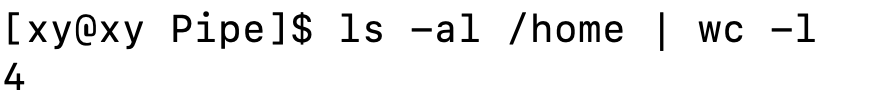

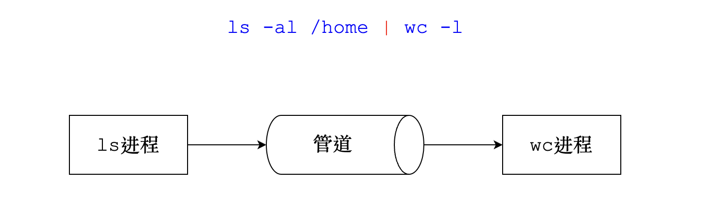

可以用 sleep 命令让`|`运行时间长一点，足以让我们用脚本观察现象：

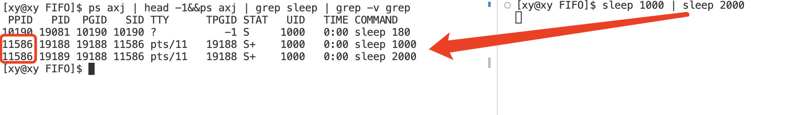

可见，这两个进程的 ppid 是同一个，而它们的父进程就是 bash。

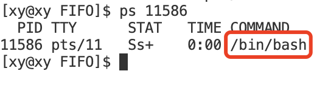

### 2.2 匿名管道的原理

结合进程间通信的本质和匿名管道的特点，总的来说匿名管道就是让父子进程看到同一份资源，然后一个进程对它写入，另一个进程对它读取，这样就完成了进程间通信。

在这里需要介绍当时的技术背景，以便更好地理解管道和之后的共享内存。它的发明人是道格拉斯·麦克罗伊，这位也是 UNIX 上早期 shell 的发明人。他在发明了 shell 之后，发现系统操作执行命令的时候，经常有需求要将一个程序的输出交给另一个程序作为输入。那时候的 OS 内核并没有对外单独提供进程间通信的接口，只有早期的文件操作接口，而文件操作接口也是符合需求的：它有写入数据和读取数据的接口。

而这个资源块自然就是文件操作接口的操作对象：文件。

那么总的来说，<mark>匿名管道的原理就是让父子进程看到同一份被打开的文件，让一个进程对文件写入数据，让另一个进程从文件读取数据，从而实现父子进程间通信。</mark>下面将从文件与进程两方面解释匿名管道的原理。

文件：

我们知道 Linux 下一切皆文件，所以我们知道**文件=内容+属性**，其中内容是我们要传输的数据，暂且不谈；而属性是操作系统用特定的数据结构`struct_file`管理的，在这里也暂不涉及其中的细节。

进程：

除了文件之外，另一大主角就是进程。计算机通过运行若干进程完成被指派的工作，OS 通过特定的数据结构`task_struct`来管理进程，其中就指向了`files_struct`，它是用户打开文件表，包含了一个进程所使用的文件描述符信息。当创建一个进程时，会创建文件描述符表`fd_array[]`，标识该进程打开的文件。然而，这些进程相关的数据结构都是进程私有的。

> fd_array 是 files_struct 结构中的一个域，它包含了一些文件对象指针。通常情况下，如果进程打开的文件数目不超过 32 个，那么 fd_array 就足够使用。但是如果进程打开的文件数目多于 32 个，内核就会分配一个新的、更大的文件指针数组，并将其地址存放在 files_struct 的 fd 域中。
>
> 操作系统会为每个打开的文件描述符维护一个文件位置，用来记录当前读写操作的位置。当我们关闭文件时，相应的文件描述符就会被释放，以供再次分配。

> 如何让父子进程看到同一份文件呢？假如父进程打开文件。

1. 拷贝同一份文件给子进程？
   - 拷贝文件给内核带来的开销太大了，是创建子进程实现父子进程看到同一个文件，而不是对文件拷贝

2. 拷贝父进程自己的进程相关数据结构给子进程？
   - 既然目的是让子进程也看到父进程打开的文件，那么只要拷贝父进程的文件描述表给子进程， 子进程就能通过和父进程一样的路径找到父进程打开的文件

> 为什么不让子进程直接指向父进程的文件描述符表呢？这样还能少一次拷贝。

- 进程之间要具有独立性。即拷贝文件描述符表可以让子进程独立地修改它自己的文件描述符表，而不会影响到父进程。如果子进程直接指向父进程的文件描述符表，那么任何对文件描述符表的修改都会影响到父进程。

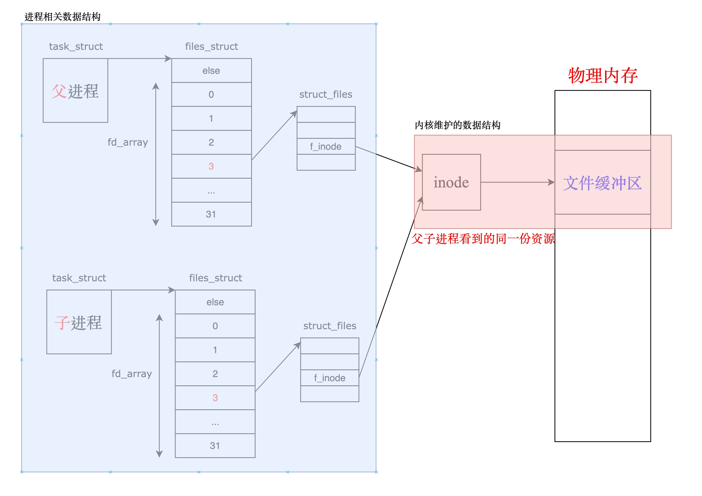

#### 注意

- 在匿名管道中，打开的文件由操作系统维护（这是合理的，因为我们使用了系统调用 open）。当父进程创建子进程时，两个进程最初会共享内存中的相同页表。这些共享页表最初会像一般创建子进程时一样被标记为写时拷贝。但是，由于文件描述符是共享的，也就是说父子进程中的文件描述符编号指向着同一个文件。因此，在父子进程同时对同一文件进行写入操作时，它们都会写入到同一缓冲区中，数据也就不会被写时拷贝。

  > 写时拷贝，即如果任何一个进程试图修改共享页表，那么只会创建这些页表的副本，并且该进程对页表副本进行修改，从而不影响另一个进程。

- 匿名管道中打开的文件并不是存储在磁盘上的实际文件，而是一个内存中的缓冲区，用于在两个进程之间传输数据。

  > 原因：
  >
  > 1. 将数据存储在磁盘上会增加额外的开销。因为磁盘读写（IO）速度相对较慢。而使用匿名管道在内存中传输数据则更快，可以提高进程间通信的效率。
  > 2. 将文件存储在磁盘中没有必要。因为匿名管道通常用于在父进程和子进程之间<mark>临时</mark>传输数据。由于这种数据传输是短暂的，且不需要在计算机关闭或重启后保留，因此没有必要将其存储在磁盘上。

### 2.3 实现匿名管道

由于历史原因，在 Linux 中实现匿名管道并未使用专门的数据结构，而是借助文件系统的 file 结构和文件索引 inode。

我们可以通过文件操作接口实现管道，但系统已经将它们封装为一个叫`pipe`的函数。

#### pipe 函数

pipe() 函数创建一个匿名管道。

原型：

```cpp
##include <unistd.h>
int pipe(int pipefd[2]);
```

参数：

`pipefd[2]`是一个输出型参数，一个大小为 2 的数组，它用来返回两个文件描述符，分别指向管道的两端：

- pipefd[0] 指向管道的读端；
- pipefd[1] 指向管道的写端。

写入管道写端的数据会被内核缓存，直到被读取。

返回值：

- 成功：返回 0；
- 失败：返回-1。

#### 步骤

##### 1. 创建管道

父进程调用 pipe() 创建匿名管道：

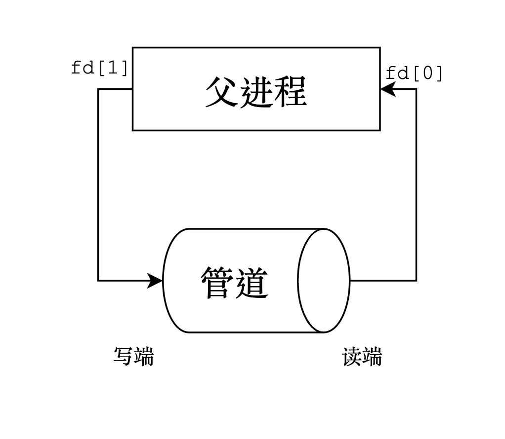

```cpp
##include <iostream>
##include <assert.h>
##include <unistd.h>

using namespace std;

int main()
{
    // 1. 创建管道
    int pipefd[2] = { 0 };
    int n = pipe(pipefd);
    assert(n != -1); (void)n; // debug && release assert
	
    return 0;
}
```

其中，assert 的作用是验证 pipe 的返回值如果为-1 则表明创建管道失败，从而终止程序。

> `(void)n;` 这一行代码的作用是消除 gcc 编译器关于未使用变量 `n` 的警告。`(void)` 是一个强制类型转换，将 `n` 转换为 `void` 类型，表示忽略该变量的值。
>
> 在 Linux 中，无论是 Debug 还是 release 模式，assert 都生效。

同时还可以打印一下数组中的内容以供 debug 时提示：

```cpp
##ifdef DEBUG
    cout << "pipefd[0]: " << pipefd[0] << endl; // 3
    cout << "pipefd[1]: " << pipefd[1] << endl; // 4
##endif
```

> 在这里使用了一个 GCC 编译器选项`-DDEBUG` ，这相当于在源代码中添加了一行 `#define DEBUG`，即第一个 D 意为 difine 。
>
> 如果在编译时使用了-DDEBUG 选项，则上述代码中的打印语句会被执行，否则不会。因此我们通过控制 gcc 的选项来打印提示语句。

##### 2. 创建子进程

fork() 的子进程默认继承父进程打开的管道。通过子进程继承父进程资源的特性，双方进程看到了同一份资源。

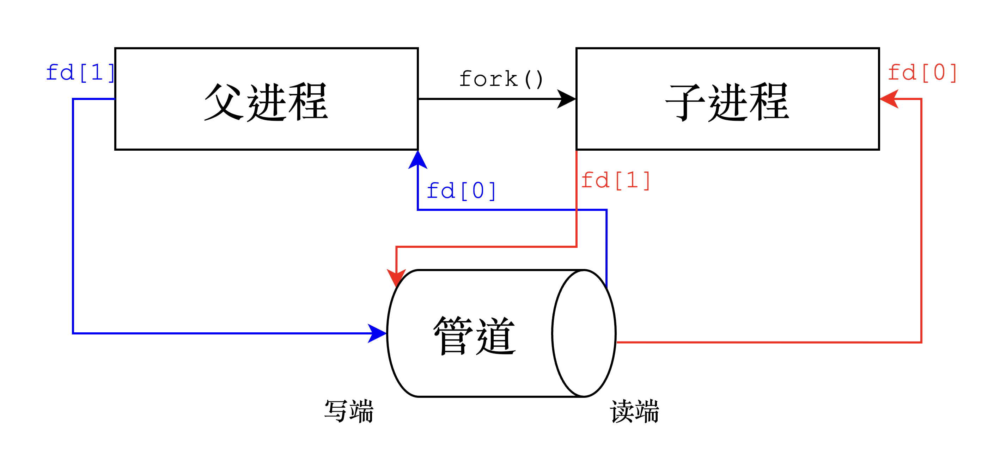

```cpp
// 2. 创建子进程
pid_t id = fork();
assert(id != -1);
if(id == 0) // 子进程
{   
    // ...
}
// 父进程
// ...
```

##### 3. 构建单向信道

由于管道是单向通信的，也就是说一个进程只能写数据，另一个进程只能读数据，这里假设通信的方向是父→子，即父写子读。

> 谁写谁读不是绝对的，取决于通信的方向。

原则上父进程需要关闭读端，子进程要关闭写端，但实际上不关也不会影响读写的成功性，这么做是为了保证通信的安全和减少资源占用（一切皆文件）。

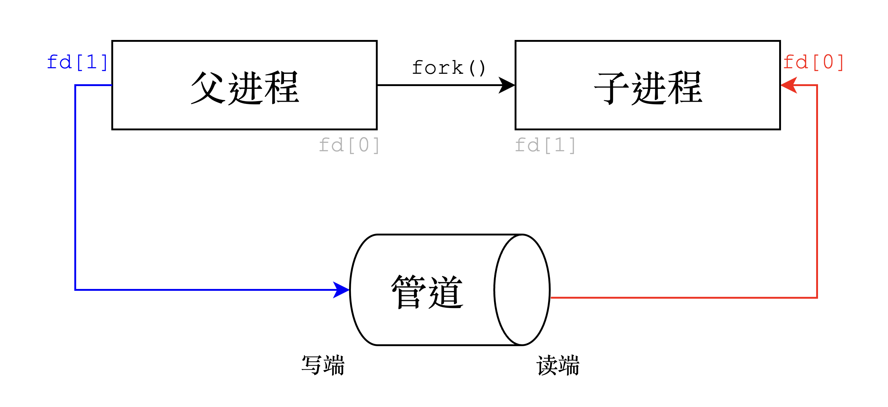

注意：写入管道写端的数据会被内核缓存，直到被读取。在这里，我们可以调用系统接口读取和写入数据。由于像 read 和 write 等接口需要使用一个缓冲区作为参数，所以父子进程<mark>分别使用</mark>一个数组作为缓冲区。例如，read 函数和 write 函数的原型为：

```c
##include <unistd.h>
ssize_t read(int fd, void *buf, size_t count);

ssize_t write(int fd, const void *buf, size_t count);
```

参数：

是一个指向缓冲区的指针，用于存储从文件描述符`fd`中读取或写入的数据。

返回值：

- `read` 函数会把参数 `fd` 所指的文件传送 `count` 个字节到 `buf` 指针所指的内存中。若参数 `count` 为 0，则 `read` 不会有作用并返回 0。返回值为实际读取到的字节数，如果返回 0，表示已到达文件尾或是无可读取的数据。
- `write` 函数的返回值如果大于 0，则表示实际写入文件内容的长度 。当第三个参数为 0 时，此时 write 函数什么也不做，只返回 0。

> ssize_t 是一个有符号整数。第一个 s 代表 system ，意为这个整型类型和操作系统有关，不同操作系统该类型的定义可能不同。

> 为什么父子进程要单独设置一块缓冲区呢？何不设置一个全局的 buffer？

- 因为进程具有独立性，存在写时拷贝，无法更改通信。

###### 子进程

```cpp
// 子进程读取，关闭写端
close(pipefd[1]);
char get_buffer[1024];
while(1)
{
    ssize_t ret = read(pipefd[0], get_buffer, sizeof(get_buffer) - 1); // 注意长度忽略了'\0'
    if (ret > 0) // 返回值>0，表示读取到字符串的长度
    {
        get_buffer[ret] = 0;
        cout << "Child get a message[" << getpid() << "] from Father# " << get_buffer << endl;
    }
    else if(ret == 0) // 返回值=0，表示写数据的一方终止
    {
        cout << "Father stoped writing, child exits" << endl;
        break;
    }
}
exit(0);
```

注意：

- `ssize_t ret = read(pipefd[0], get_buffer, sizeof(get_buffer) - 1);`表示从`get_buffer[]`中读取所有数据，其中不包括最后一个字符`'\0'`。

- 通过 read 函数的返回值判断写数据的一方是否终止写入。

###### 父进程

```cpp
// 父进程
// 父进程写入，关闭读端
close(pipefd[0]);
string message = "I am Father and I am sending you a message!";
int count = 0;
char send_buffer[1024];
while(1)
{
    // ...
}
```

其中，`message`字符串是我们稍后要让父进程写入的数据。变量`count`作为计数器限制稍后写入的数据量。

####### 构建一个变化的字符串

`snprintf`与`printf`类似，它用于将格式化的输出写入到一个字符串中。它可以指定最大写入字符数，从而避免缓冲区溢出。

> `snprintf`函数的原型为：
>
> ```c
> #include <stdio.h>
> 
> int snprintf(char *str, size_t size, const char *format, ...);
> ```
>
> 其中，`str`参数是一个指向目标字符串的指针；`size`参数指定了最大写入字符数（包括结尾的空字符）；`format`参数是一个格式字符串，用于指定输出格式；后面的可变参数与格式字符串中的占位符相对应。
>
> 它是`sprintf`的安全版本，因为`sprintf`没有第三个参数限制最大写入字符数。

在这里，我们将刚才`massage`字符串中的内容与计数器`count`以及子进程的`pid`结合，一并写入到父进程的缓冲区`send_buffer[]`中：

```cpp
snprintf(send_buffer, sizeof(send_buffer), "%s[%d] : %d", message.c_str(), getpid(), count++);
```

####### 写入数据并关闭文件

```cpp
// 3.3 写入
write(pipefd[1], send_buffer, strlen(send_buffer));

pid_t ret = waitpid(id, nullptr, 0);
cout << "id : " << id << " ret: " << ret <<endl;
assert(ret > 0); 
(void)ret;
```

> 子进程没有规定读取信息的规则（节奏），那么它在干什么呢？

- 子进程在等待读取父进程写入的数据。

> 为什么要调用 waitpid 函数？

- 父进程调用 waitpid 函数来等待子进程结束并回收其资源，这样可以防止子进程成为僵尸进程。

waitpid 函数的原型是：

```c
##include <sys/types.h>
##include <sys/wait.h>
pid_t waitpid(pid_t pid, int *status, int options);
```

它有三个参数：`pid`，`status`和`options`。

- `pid`: 用于指定要等待的子进程。当 `pid > 0` 时，只等待进程 ID 等于 `pid` 的子进程。
- `status`: 指向一个整型变量的指针，用于存储子进程退出状态信息。如果不关心子进程的退出状态，可以将其设置为 NULL/nullptr。
- `options`: 用于控制 waitpid 函数的行为。设置为 0 表示阻塞等待子进程结束，再回收资源。

返回值：如果子进程状态正常，返回子进程的`pid`。

#### 实现代码

##### Mypipe.cc

`.cc`和`.cpp`文件都是 C++源文件，前者常被用于 Linux 中使用。

包含所需的头文件后，整体代码如下：

```cpp
##include <iostream>
##include <string>
##include <cstdio>
##include <cstring>
##include <assert.h>
##include <unistd.h>
##include <sys/types.h>
##include <sys/wait.h>
using namespace std;

int main()
{
    // 1. 创建管道
    int pipefd[2] = { 0 };
    int n = pipe(pipefd);
    assert(n != -1); (void)n; // debug && release assert
##ifdef DEBUG
    cout << "pipefd[0]: " << pipefd[0] << endl; // 3
    cout << "pipefd[1]: " << pipefd[1] << endl; // 4
##endif
    // 2. 创建子进程

    pid_t id = fork();
    assert(id != -1);
    if(id == 0) // 子进程
    {
        // 2.1 子进程读取，关闭写端
        close(pipefd[1]);
        char get_buffer[1024];
        while(1)
        {
            ssize_t ret = read(pipefd[0], get_buffer, sizeof(get_buffer) - 1); // 注意长度忽略了'\0'
            if (ret > 0) // 返回值>0，表示读取到字符串的长度
            {
                get_buffer[ret] = 0;
                cout << "Child get a message[" << getpid() << "] from Father# " << get_buffer << endl;
            }
            else if(ret == 0) // 返回值=0，表示写数据的一方终止
            {
                cout << "Father stoped writing, child exits" << endl;
                break;
            }
        }
        exit(0);
    }
    // 父进程
    // 3.1 父进程写入，关闭读端
    close(pipefd[0]);
    string message = "I am Father and I am sending you a message!";
    int count = 0;
    char send_buffer[1024];
    while (1)
    {
        // 3.2 构建一个变化的字符串
        snprintf(send_buffer, sizeof(send_buffer), "%s[%d] : %d", message.c_str(), getpid(), count++);
        // 3.3 写入
        write(pipefd[1], send_buffer, strlen(send_buffer));
        // 3.3 sleep(1)
        sleep(1);
        cout << count << endl;
    }
    close(pipefd[1]); // 关闭文件
    pid_t ret = waitpid(id, nullptr, 0); // 回收子进程资源
    cout << "id : " << id << " ret: " << ret <<endl;
    assert(ret > 0); 
    (void)ret;
    return 0;
}
```

其中，父进程在每次写入一次数据之后 sleep(1)，使得数据传输过程更加清晰。

##### Makefile

```Makefile
MyPipe:MyPipe.cc
	g++ -o $@ $^ -std=c++11 -DDEBUG
.PHONY:clean
clean:
	rm -f MyPipe
```

其中的`-DDEBUG`选项，在调试时可以保持以上原样；在测试完毕后，可以用`#`注释，例如：

```makefile
g++ -o $@ $^ -std=c++11 #-DDEBUG
```

#### 测试 1

在测试时，保留了`-DDEBUG`选项。

将父进程的缓冲区`send_buffer`的大小增大为原来的 4 倍，而且不用计数器`count`控制写入数据量也不用 sleep 控制写入的速度，控制子进程在读取数据之前先 sleep(10)，查看现象。


最开始打印 count，说明了父进程已经成功将数据写入到自己的缓冲区`send_buffer`中，而且是瞬间写满的。但是，在子进程读取数据之前，一直闪烁的光标说明父进程一直在等待，也就是阻塞状态。

让父进程瞬间写满缓冲区，让子进程等待 5 秒之后再读取，形成了写快读慢的局面，通过结果可以知道，写快读慢会让写的进程处于阻塞状态。那么也可以反推出写慢读快会让读的进程阻塞。其中，写快读慢的方式可以适用于流式服务。

除了读写两端的速度不同会造成读写进程阻塞之外，读写两端任意一端关闭之后会有不一样的结果。

- 写端关闭：读端返回 0，以此标识读到了文件结尾（即没有进程写入数据），子进程直接退出。
- 读端关闭：写端会保持写入状态，但是操作系统认为这是无意义的，毕竟没有进程读取数据了，所以 OS 会终止写端进程。

> 进程阻塞意味着进程暂停执行，等待某个条件满足才能继续执行。在某些情况下，阻塞是必要的，例如等待用户输入或等待数据到达。但是，过多的阻塞会导致进程响应缓慢，影响用户体验。此外，如果多个进程同时阻塞在同一个资源上，可能会导致死锁。
>
> 在这里，并不是说阻塞是不好的，阻塞能让进程有一个协调的过程，出现错误后，不会强制读也不会强制写。关于死锁，将会在多线程部分学习。

#### 测试 2

在测试时，注释掉了`-DDEBUG`选项。

限制父进程：每次写入数据以后都 sleep(1)，并且用计数器`count`限制写入的次数为 10 次，缓冲区的大小只要够用，就不会影响此次测试结果。

限制子进程：不 sleep，直接读取。

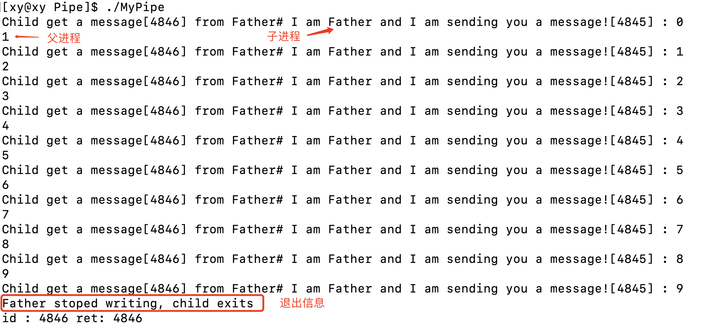

可以看到，限制写端的速度，读端无限制。读端进程能够完整地获取写端输出的数据，完成父子进程间协同通信。

限制写入速度的目的是控制写入数据的速率，使得子进程能够以更稳定的速度读取数据。如果不限制写入速度，父进程可能会快速地向管道中写入大量数据，导致子进程无法及时处理这些数据。

> 当然，限制速度并不一定要在写端进行，也可以在读端进行。关键是保持读写两端进程传输数据有一个速率差，以便更好地控制数据传输的速度和完整性，此外还可以防止管道缓冲区被快速填满，从而避免写端阻塞（即测试 1 出现的情况）。

### 2.4 总结

匿名管道在系统中没有实名，它只是进程的一种资源，会随着进程的结束而被系统清除。它的通信范围是存在父子关系的进程。因为管道没有实体，也就是没有管道文件，只能通过 fork 来复制父进程 fd 文件描述符，来达到通信的目的。

所以，刚才说的父子进程看到的同一份资源，就是管道本身。

#### 匿名管道的特点

##### 用于亲缘关系进程间通信

匿名管道常用于父子进程间通信，或者由一个父进程创建的兄弟进程之间进行通信。

##### 半双工通信

匿名管道只能在一个方向上进行数据传输，即数据只能从写端流向读端。这是可以理解的，因为在一开始我们就说明了管道是一种单向通信信道。

单工、半双工和全双工是电信计算机网络中的三种通信信道。

- 单工通信 (Simplex Communication)：数据传输只支持数据在一个方向上传输。例如，广播电视就是一种单工通信。
- 半双工通信 (Half Duplex)：允许数据在两个方向上传输，但某一时刻只允许数据在一个方向上传输，实际上是一种切换方向的单工通信，不需要独立的接收端和发送端，两者可合并为一个端口。例如，对讲机就是一种半双工通信。
- 全双工通信 (Full Duplex)：通信允许数据在两个方向上同时传输，它在能力上相当于两个单工通信方式的结合。例如，电话通话就是一种双工通信。

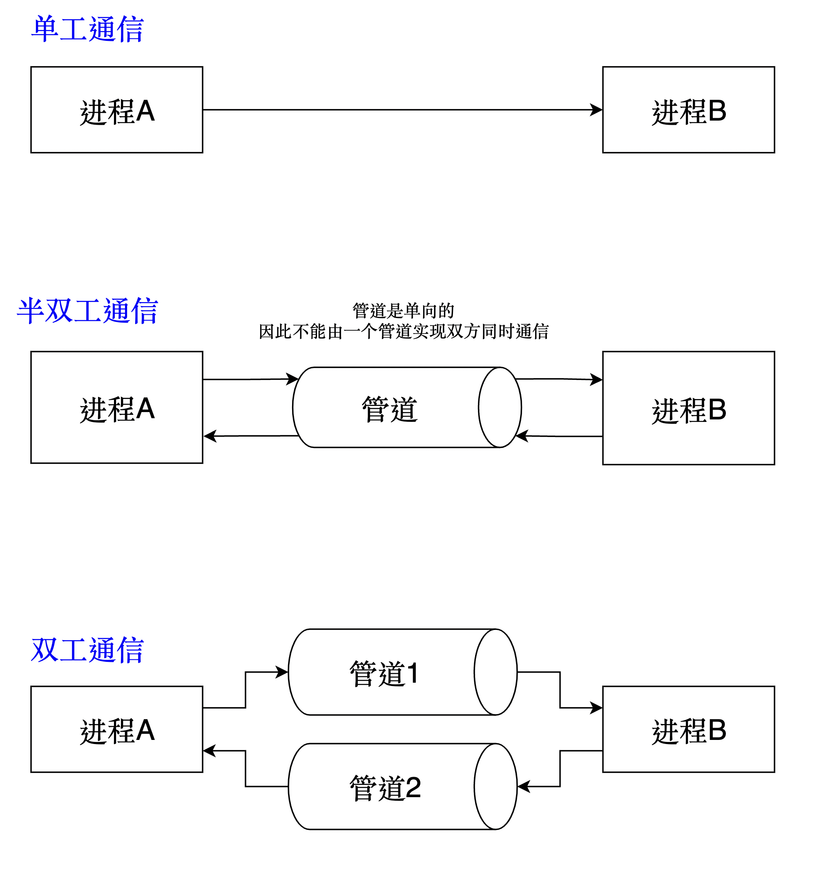

这三种传输方式的区别在于数据传输的方向和时间。单工只能进行单向传输，而双工和半双工都能进行双向传输。不同之处在于，双工可以同时进行双向传输，而半双工只能交替进行。

##### 提供流式服务

匿名管道提供的是一种流式服务，是一种面向字节的、无结构的、流式的通信方式。

这意味着数据是按照顺序一个字节接一个字节地从写端流向读端，就像水从水龙头流出一样。读端可以按照顺序读取数据，但每次读取的数据量是任意的，这在测试 1 中也有体现。

例如，在 Linux 系统中，可以使用 write() 函数向管道写入数据，使用 read() 函数从管道读取数据。当写入一段文本时，文本中的字符会按照顺序一个接一个地被写入管道。当读取这段文本时，也会按照顺序一个字符接一个字符地被读出。

流式服务和数据报服务是两种不同的通信方式：

- 流式服务：流式服务提供的是一种面向连接的、可靠的、按顺序传输的、基于字节流的通信方式。它类似于打电话，通信双方需要先建立连接，然后才能进行数据传输。数据按照顺序一个字节接一个字节地传输，且保证不丢失、不重复、不错乱。
- 数据报服务：数据报服务提供的是一种无连接的、不可靠的、无序传输的、基于数据报文的通信方式。它类似于发短信，通信双方无需建立连接，直接发送数据报文。每个数据报文都是独立传输，可能会丢失、重复或错乱。

这两种通信方式各有优缺点。流式服务提供了可靠性和顺序性，但需要建立连接，且传输效率较低。而数据报服务无需建立连接，传输效率较高，但不保证可靠性和顺序性。

> 这种面向字节流的通信方式，就需要我们制定一定的协议限制，以保证通信效率和安全性，例如稍后我们会自己规定一份进程间通信的协议。这一部分将会在计算机网络中学习。

##### 生命周期与进程绑定

匿名管道的生命周期与<mark>创建它的进程</mark>相关。当一个进程使用 pipe() 函数创建一个匿名管道时，该管道就被分配了两个文件描述符，分别表示读端和写端。这两个文件描述符可以被传递给子进程，以便父子进程间进行通信。

当所有引用该管道的文件描述符都被关闭时，该管道就会被销毁。例如，如果父进程和子进程都关闭了读端和写端的文件描述符，则该管道就会被销毁。

并且，匿名管道是基于文件实现的，因此它的生命周期取决于引用它的文件描述符是否被关闭。只要有一个文件描述符仍然打开着，则该管道就会继续存在。

##### 同步与互斥

与同步相对的是异步，与互斥相对的是并发。

首先了解在进程中同步和互斥的概念：

- 同步：多个进程或线程之间，按照事先约定好的次序协调执行，以保证它们按照一定的顺序执行。

- 互斥：某一时刻只允许一个进程或线程访问共享资源，以防止竞态条件。

在匿名管道中，内核会对管道操作进行同步与互斥，以确保数据能够正确地从一个进程传输到另一个进程。例如，当一个进程试图从空管道中读取数据时，它将被阻塞直到有数据可读；当一个进程试图向满管道中写入数据时，它也将被阻塞直到有空间可写。

在 Linux 中，多个进程或线程之间共享的资源叫做临界资源（Critical Resource），它们在同一时刻只能被一个进程或线程访问。如果多个进程或线程同时访问临界资源，可能会导致竞态条件，从而导致程序运行不正常，例如同时读写、交叉读写以及读取到的数据不一致等问题。为了防止这种情况发生，需要使用同步与互斥技术来保护临界资源。

通过测试 1 的验证，我们知道管道也是在同一时刻只允许一个进程访问，因此管道也是临界资源。

> 与临界资源有关的程序片段称为临界区（Critical Section），即访问共享资源的代码片段。

##### 没有访问控制

> 匿名管道的本质是一个文件，这么说正确吗？

- 匿名管道并不是一个文件，管道是在内存中创建的，用于在两个进程之间实现一个数据流通的通道。

> 那为什么系统接口 pipe() 中封装的是系统文件接口 open() 呢？而且父子进程间传输数据也是通过这个打开的文件实现的。

- 这是对的。在 Linux 和类 Unix 系统中，匿名管道通过文件描述符来实现。当调用 pipe() 函数时，它会返回两个文件描述符，一个用于读取数据，另一个用于写入数据。<mark>尽管匿名管道使用了文件描述符来实现，但它并不是一个真正的文件。它仍然是在内存中创建的，并且不具备文件系统中的访问控制。</mark>结合我们介绍管道的历史背景时所知，这种设计方式使得程序员可以使用熟悉的 read() 和 write() 函数来操作管道，而无需学习新的 API。

在进程间通信（IPC）中，访问控制指的是对**共享资源**访问的管理和保护。它可以确保一次只有一个进程能够访问共享资源，从而避免竞争条件和数据不一致等问题。

一个具有访问控制的例子是命名管道。命名管道是在文件系统中创建的，它具有文件系统中的访问控制。这意味着只有拥有适当权限的进程才能读写命名管道。

相反，一个缺乏访问控制的例子是匿名管道。匿名管道是在内存中创建的，它不具备文件系统中的访问控制。这意味着任何能够获得匿名管道读写端文件描述符的进程都可以读写匿名管道。

#### 匿名管道的四种特殊情况

1. 读端关闭，写端不关闭（管道异常）：此时该进程会收到信号 SIGPIPE，通常会导致进程异常终止。
2. 写端关闭，读端不关闭（管道断开）：那么管道中剩余的数据都被读取后，再次 read 会返回 0，就像读到文件末尾一样。
3. 写端不写数据，读端不关闭（管道空）：此时管道中剩余的数据都被读取之后再次 read 会被阻塞，直到管道中有数据可读了才重新读取数据并返回。
4. 读端不读取数据，写端不关闭（管道满）：此时当写端被写满之后再次 write 会阻塞，直到管道中有空位置了才会写入数据并重新返回。

这四种情况说明了匿名管道的以下特性：

1. 管道满和管道空说明了匿名管道具有阻塞特性。当写入或读取操作无法立即完成时，进程将被阻塞并等待。即体现了同步与互斥，读端和写端都不会在对方异常的情况下强制读或写，能有序地协调通信。
2. 管道断开说明了匿名管道具有单向性。数据只能从管道的写端流向读端，而不能反向流动。
3. 管道异常说明了匿名管道对错误情况的处理方式。当出现异常情况时，将触发一个信号来通知进程。

> 关于信号，将在下一章学习。

#### 管道的大小

1. 使用`ulimit -a`命令查看当前系统资源限制：

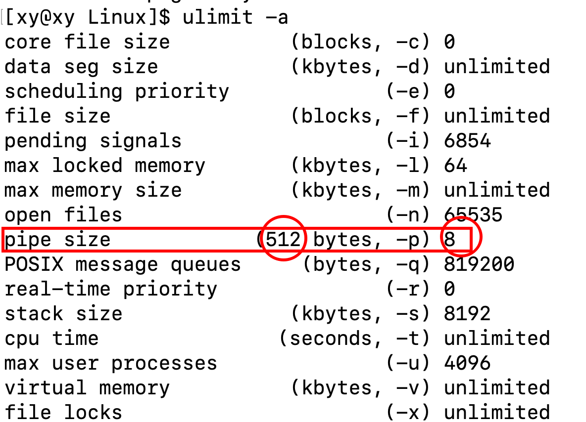

由此得出，管道的最大容量是 4kb。

除此之外，还可以使用程序测试，例如使用读端不读取数据，写端不关闭（管道满）这一情况，每次只写一个字节的内容，写满以后计数器的值就是管道的最大容量。

### 2.5 进程池 [实践]

进程池是一个概念，有一个池子，里面有一定数量正在等待指派任务的进程。当有需求来了，就拿一个池中的进程来处理任务。等到处理完毕，进程并不关闭，而是将进程再放回进程池中继续等待任务。这样可以避免频繁地创建和销毁进程，提高程序的效率。

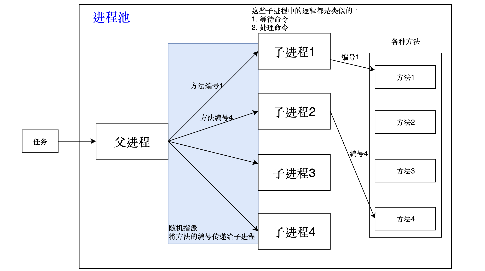

进程池中的进程通常是由一个父进程创建的，这样做有一些优点。首先，子进程是父进程复制 （fork） 而来，所以两者有很大的相似性。这意味着子进程可以继承父进程的所有资源。

此外，使用同一个父进程创建的子进程可以更容易地进行管理和协调。例如，在网络请求的处理中，主进程可以使用特定算法将客户连接套接字通过管道发送给进程池中的某个子进程进行监听和处理。

如果使用没有关系的独立进程作为进程池中的成员，则可能会增加管理和协调难度。

值得注意的是，创建匿名管道和 fork 创建子进程有先后顺序。父进程应该先使用 pipe 函数创建管道，然后再使用 fork 函数创建子进程。

这是因为 fork 产生的子进程会继承父进程对应的文件描述符。利用这个特性，父进程先 pipe 创建管道之后，子进程也会得到同一个管道的读写文件描述符。从而实现了父子两个进程使用一个管道可以完成半双工通信。

下面将用匿名管道实现一个简易的进程池，关于图示中的更多细节将会在实现过程中介绍。

#### 创建多个子进程和匿名管道

在循环中 fork 创建多个子进程。子进程的数量可以用一个名为`PROCESS_NUM`的宏声明，它的值我们设置为 3。

进程池的源代码文件的命名为`ProcessPool.cc`。

```cpp
##include <iostream>
##include <cassert>
##include <sys/types.h>
using namespace std;

##define PROCESS_NUM 3

int main()
{
    // 创建多个子进程
    for(int i = 0; i < PROCESS_NUM; i++)
    {
        // 父进程为每个子进程创建管道
        int pipefd[2] = { 0 };
        int ret = pipe(pipefd);
        assert(n == 0);
        (void)ret;

        pid_t id = fork();
        assert(id != -1);

        if(id == 0) // 子进程的逻辑
        {
            // ... 
        }
    }
    // 父进程的逻辑
    // ...

    return 0;
}
```

首先写好父进程创建匿名管道和 fork 创建子进程的框架，下面将分别补充父子进程的逻辑，这和之前是类似的。

##### 每个子进程的逻辑

在子进程的逻辑块中，由于子进程的作用是首先要读取父进程的命令，才会执行自己的工作，所以首先要关闭子进程的写端。

> 同样的，不关闭写端对后续结果无影响，因为后续子进程对于管道中的信息只会调用读取的接口，但为了安全和规范起见最好关闭写端。

然后再等待命令的指派，类似地，同样将处理命令的逻辑放在一个死循环中，不过此处处理命令的逻辑将会在稍后补充。

```cpp
if(id == 0) // 子进程的逻辑
{
    close(pipefd[1]); // 关闭写端
    while(1) // 等待命令
    {
        // 处理命令的逻辑
        // ...
    }
    exit(1);
}
```

这里的退出码没有作要求，只要和父进程有区分即可，可能在调试时有用。

##### 父进程的逻辑

注意，此处父进程的逻辑是在创建进程的循环中的逻辑，稍后还会介绍父进程派发任务的逻辑。

其实就是做子进程相反的工作，将读端关闭。

```cpp
 // 父进程写入
close(pipefd[0]); // 关闭读端
```

#### 保存每个子进程的信息

在此仅保存子进程的 pid 和 pipefd ，所以可以用一个键值对保存它们；如果要保存更多信息如时间和日期等，可以定义一个结构体或类保存。

将表命名为`slogs`，用 vector 容器保存。因为这个日志表保存着子进程的 pid 进而 pipefd ，所以父进程可以通过这个日志表指派子进程执行任务。

记录子进程信息的方式很简单，在每次循环最后 push_back 一下就好。

```cpp
##include <vector>

int main()
{
    vector<pair<pid_t, int>> slots; // 记录子进程信息

    for(int i = 0; i < PROCESS_NUM; i++)
    {
        // 子进程
        // ...
        // 父进程写入
        close(pipefd[0]); // 关闭读端
        slots.push_back(pair<pid_t, int>(id, pipefd[1])); // 记录子进程信息
    }
    return 0;
}
```

#### 父子进程的逻辑

对于在进程池中的每一个子进程，它们要做的就是等待命令，根据不同的命令执行自己的工作。

对于父进程，它要做的就是根据外部指令派发任务给子进程完成。值得注意的是：

1. 所有事先准备好的方法（函数）应该打包起来，让被指派到的进程根据传入的方法编号执行对应操作。而不是将方法与子进程绑定，因为总会有经常被调用的方法，这样会造成某些子进程经常处于等待状态，反而占用了资源。
2. 指派子进程的过程应该是随机的，以保证每个子进程都有（接近）相等的概率被调用。

##### 父进程派发任务逻辑

1. 首先完成“随机派发”的需求，可以用种子数产生一个随机数。对于这个种子数，为了让它更“随机”一点，可以将它和时间戳、子进程 pid 关联起来，在这里，我们用 `^` 将它们关联，并自作主张地`^`上了一个随便打的数。
2. 把任务指派给进程，是通过一个叫`SandAndWakeup`的函数实现的。

```cpp
##include <ctime>
##include <sys/wait.h>

int main()
{
    vector<pair<pid_t, int>> slots; // 记录子进程信息
    // 创建多个子进程
    for(int i = 0; i < PROCESS_NUM; i++)
    {
        // ...
    }
    // 父进程的逻辑
    srand((unsigned long)time(nullptr) ^ getpid() ^ 99997837); // 让种子更随机
    while(1)
    {
        uint32_t command = rand() % MethodNum(); // 随机获取一个命令
        int ChildNum = rand() % slots.size(); // 随机得到一个进程在日志表中的编号
        SandAndWakeup(slots[ChildNum].first, slots[ChildNum].second, command); // 将任务指派给进程
        sleep(1); // 慢一点指派，观察现象
    }

    // 关闭所有子进程的文件描述符，使之退出
    for (const auto &slot : slots)
    {
        close(slot.second);
    }

    // 回收所有子进程的资源
    for (const auto &slot : slots)
    {
        waitpid(slot.first, nullptr, 0);
    }
    
    return 0;
}
```

其中，由于这里只是模拟，并没有真正存在的指令，因此顺便随机选取了一个指令。MethodNum 是指令对应方法的总数，稍后会解释。

其中，SandAndWakeup 函数的内容如下：

```cpp
void sendAndWakeup(pid_t who, int fd, uint32_t command)
{
    write(fd, &command, sizeof(command));
    cout << "main process: call process " << who << " to execute " << desc[command] << " command through " << fd << endl;
}
```

sendAndWakeup 的参数分别是进程的 pid 和它们打开的文件描述符，这在创建子进程的同时就已经被记录在 slogs 日志表中了。在内部调用了系统接口 write，将指令`command`的编号写入缓冲区中。这里就体现了匿名管道的通信作用。

其中，指令`command`的编号对应的所有指令都被一个叫`desc`的`unordered_map`容器管理着。

##### 子进程处理任务逻辑

首先，处理任务的前提是获取父进程通过匿名管道传输的指令的编号。在这里，通过一个输出型参数`bool quit = false`，和子进程的文件描述符一起传入`WaitCommand`函数中。

`WaitCommand`函数的逻辑就是在读取匿名管道中父进程传的`command`，内容如下：

```cpp
uint32_t WaitCommand(int fd, bool &quit) //如果对方不发，我们就阻塞
{
    uint32_t command = 0;
    ssize_t ret = read(fd, &command, sizeof(command));
    if (ret == 0) // 读取失败
    {
        quit = true;
        return (int)-1;
    }
    assert(ret == sizeof(uint32_t));
    return command;
}
```

> 这个程序各个地方的`command`可能不是同一个，但都是 uint_32 类型，这么做只是看起来规范一些，如果这里失败返回-1，它将会被隐式类型转换为无符号整数。
>
> 实际上，这里的`assert(ret == sizeof(uint32_t));`就定义了一种通信协议，只有 read 到长度为 sizeof(uint32_t) 的才能被作为命令使用。

通过读取成功与否，控制这个参数 quit 的值而决定子进程是否阻塞。用一个变量 command 接收 WaitCommand 的返回值，并检验返回值的失败情况。

```cpp
while(1) // 等待命令
{
    // 处理命令的逻辑
    bool quit = false;
    ssize_t command = WaitCommand(pipefd[0], quit);
    if(quit) // 匿名管道里没有指令，子进程转换为阻塞状态
        break;
    // 获取到指令
    if(command >= 0 && command < MethodNum()) // 检查指令格式
    {
        MethodList[command](); // 调用 command 编号对应函数
    } 
    else // 指令格式错误
    {
        cout << "command not found" << endl; // 打印提示信息
    }
}
```

其中，MethodList 是一个数组，它的元素类型是一个函数包装器类型，所以通过指定下标找到对应的函数指针，再通过操作符`()`调用函数，实现指令的处理。

#### 打包指令对应的方法

所有指令对应的方法将在`Method.hpp`中被实现，其中也包括之前提到的 MethodList、desc 等。

在这里，由于并没有实际存在的指令，因此对应的方法也只能通过打印相应信息体现，重点是体会匿名管道在其中的作用。

##### 函数包装器

通过包装器定义一个函数包装器类型，并且定义一个该类型的数组，数组的下标就对应着上层父进程传递给子进程的 command 指令编号。子进程便可通过 command 编号找到对应位置的函数指针，然后调用。

> 函数的名称是一个函数指针，能被`()`操作符调用。

`unordered_map`容器 desc 的作用是保存指令的编号以及对应的备注信息，以供上层查询。（此容器的元素是 pair 类型，主要被用来查询）

#### 代码实现

##### Method.hpp

```cpp
##pragma once

##include <iostream>
##include <string>
##include <vector>
##include <unordered_map>
##include <unistd.h>
##include <functional>

typedef std::function<void()> func; // 定义函数包装器类型

std::vector<func> MethodList; // 保存函数指针

std::unordered_map<int, std::string> desc; // 保存方法的信息

void Method1()
{
    std::cout << "child process[" << getpid() << " ] Method1" << std::endl;
}

void Method2()
{
    std::cout << "child process[" << getpid() << " ] Method2" << std::endl;
}

void Method3()
{
    std::cout << "child process[" << getpid() << " ] Method3" << std::endl;
}

void load()
{
    desc.insert({MethodList.size(), "Method1"});
    MethodList.push_back(Method1);

    desc.insert({MethodList.size(), "Method2"});
    MethodList.push_back(Method2);

    desc.insert({MethodList.size(), "Method3"});
    MethodList.push_back(Method3);
}

void PrintMethod() // 打印方法信息
{
    for(const auto &it : desc )
    {
        std::cout << it.first << "  " << it.second << std::endl;
    }
}

int MethodNum() // 获取方法总数
{
    return MethodList.size();
}
```

> `.hpp`文件是 C++程序的头文件，它将定义和实现都放在同一个文件中，无需再将 cpp 文件加入到项目中进行编译。它可以减少文件的数量，提高编译效率，适合编写模板和开源库。

其中，load 函数是将方法 push 到容器中，这个函数将在父进程创建匿名管道之前调用。

##### ProcessPool.cc

```cpp
##include <iostream>
##include <vector>
##include <cstdlib>
##include <ctime>
##include <cassert>
##include <unistd.h>
##include <sys/wait.h>
##include <sys/types.h>
##include "Method.hpp"
using namespace std;

##define PROCESS_NUM 3

void SendAndWakeup(pid_t who, int fd, uint32_t command) // 父进程发送命令
{
    write(fd, &command, sizeof(command));
    cout << "main process: call process " << who << " to execute " << desc[command] << " command through " << fd << endl;
}

ssize_t WaitCommand(int fd, bool &quit) // 子进程获取命令
{
    uint32_t command = 0;
    ssize_t ret = read(fd, &command, sizeof(command));
    if (ret == 0) // 读取失败
    {
        quit = true;
        return (int)-1;
    }
    assert(ret == sizeof(uint32_t));
    return command;
}

int main()
{
    load(); // 加载指令对应方法
    vector<pair<pid_t, int>> slots; // 定义记录子进程信息的容器
    // 创建多个子进程
    for(int i = 0; i < PROCESS_NUM; i++)
    {
        // 父进程为每个子进程创建管道
        int pipefd[2] = { 0 };
        int ret = pipe(pipefd);
        assert(ret == 0);
        (void)ret;

        pid_t id = fork();
        assert(id != -1);

        if(id == 0) // 子进程读取
        {
            close(pipefd[1]); // 关闭写端
            while(1) // 等待命令
            {
                // 处理命令的逻辑
                bool quit = false;
                ssize_t command = WaitCommand(pipefd[0], quit);
                if(quit) // 匿名管道里没有指令，子进程转换为阻塞状态
                    break;
                // 获取到指令
                if(command >= 0 && command < MethodNum()) // 检查指令格式
                {
                    MethodList[command](); // 调用 command 编号对应函数
                } 
                else // 指令格式错误
                {
                    cout << "command not found" << endl; // 打印提示信息
                }
            }
            exit(1);
        }
        // 父进程写入
        close(pipefd[0]); // 关闭读端
        slots.push_back(pair<pid_t, int>(id, pipefd[1])); // 记录子进程信息
    }
    // 父进程的逻辑
    srand((unsigned long)time(nullptr) ^ getpid() ^ 99997837); // 让种子更随机
    while(1) // 发送命令的逻辑
    {
        uint32_t command = rand() % MethodNum(); // 随机获取一个命令
        int ChildNum = rand() % slots.size(); // 随机得到一个进程在日志表中的编号
        SendAndWakeup(slots[ChildNum].first, slots[ChildNum].second, command); // 将任务指派给进程
        sleep(1); // 慢一点指派，观察现象
    }

    // 关闭所有子进程的文件描述符，使之退出
    for (const auto &slot : slots)
    {
        close(slot.second);
    }

    // 回收所有子进程的资源
    for (const auto &slot : slots)
    {
        waitpid(slot.first, nullptr, 0);
    }

    return 0;
}
```

##### Makefile

```makefile
ProcessPool:ProcessPool.cc
	g++ -o $@ $^ -std=c++11
.PHONY:clean
clean:
	rm -rf ProcessPool
```

##### 测试

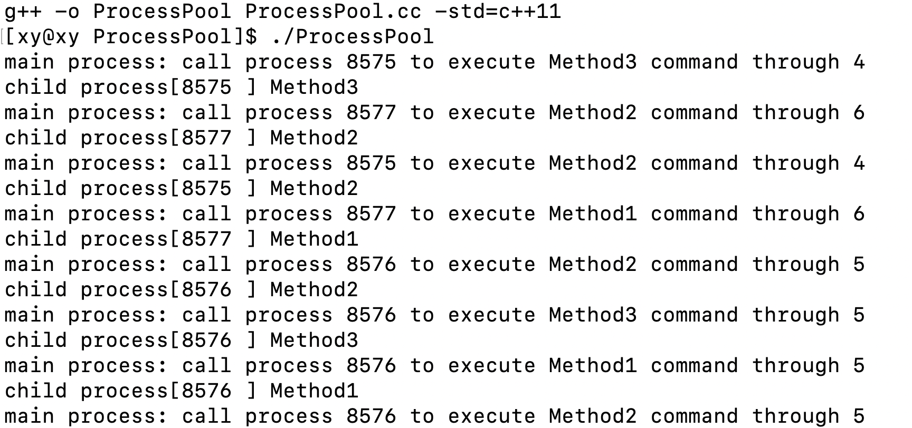

可见，父进程随机指派的要求还是达到了的。

值得注意的是，子进程读取管道中的内容后，对其进行长度上的检查（4 字节），这是一种简单的通信协议。

## 3. 命名管道

### 3.1 命名管道的概念

命名管道（有名管道，FIFO）区别于匿名管道，它可以用于任意两个进程之间的通信。原因在于它提供了一个路径与特定文件关联，以 FIFO 的文件形式存在于文件系统中，这样即使是任意进程，只要访问这个路径，就能通过 FIFO 文件相互通信。

> FIFO 即 First In First Out，意为先进先出。在计算机科学中，它通常指一种特殊的数据结构——队列。在有名管道（FIFO）中，数据的读取顺序与写入顺序是一样的，即先写入的数据会被先读取。

言外之意，命名管道（FIFO）是一种文件，它提供了一个路径名与本身关联，因此其打开方式与打开一个普通文件是一样的 。

### 3.2 命名管道的原理

还是不变的思想：想让不同进程之间实现通信，就必须让不同进程看到同一份资源。

首先，不同进程打开同一个文件，是指向同一个 struct file 的，而不是各自拷贝一份 struct file 。这是可以理解的，否则当第二个以后的进程按照同一个路径打开这个文件时，文件已经被打开了。当然也不能让文件为了每个进程都加载到内存中，否则会出现很多重复的文件，效率也会因此而降低。

而操作系统对于通信是追求效率的，让磁盘和内存进行 IO，这速度也太慢了。所以磁盘中有一种叫做<mark>命名管道文件</mark>的特殊文件（区别于匿名管道，它是有名字的），它可以被多个进程同时打开，但是操作系统不会将内存中的数据刷新到磁盘。该文件在系统路径中，因此这个路径具有唯一性。不同进程通过同一条路径看到同一个管道文件共享同一份资源。

> 这也是 OS 采用相对路径和绝对路径不冲突的原因，而且使用绝对路径来标定某些文件的位置，这是绝对路径的唯一性决定的。实际上，文件路径展开后就是一颗树，从根结点到任意节点是绝对路径，它不会和其他任意路径相交，因此它具有唯一性。

结合匿名管道的特性，不同进程通过同一条路径找到的文件是同一个文件，这个文件是管道文件。在本质上命名管道和匿名管道都是文件，而且都是内存文件，但前者有磁盘实例，后者无磁盘实例。

### 3.3 使用 mkfifo 指令创建命名管道

- 用于创建命名管道。

语法：
```shell
mkfifo [选项] 名称
```

不加路径时默认在当前目录下创建管道文件：

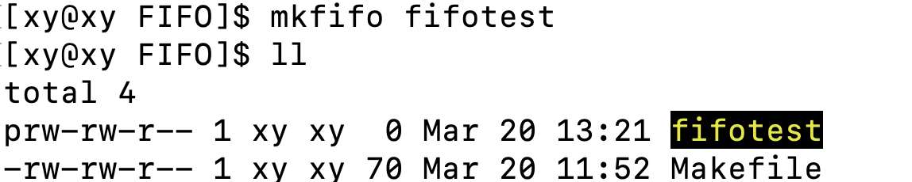

文件属性`prw-rw-r-- 1`中的`p`代表这个文件是管道文件。

> `-`是普通文件，`d`是目录文件。

试着写点东西进去：

```shell
echo "Hello World" > fifotest
```


但是光标一直在等待，此时进程处于阻塞状态。原因是这个文件没有被打开，在上面阻塞的同时再开一个 shell，将管道文件中的内容通过`cat`重定向到屏幕上：

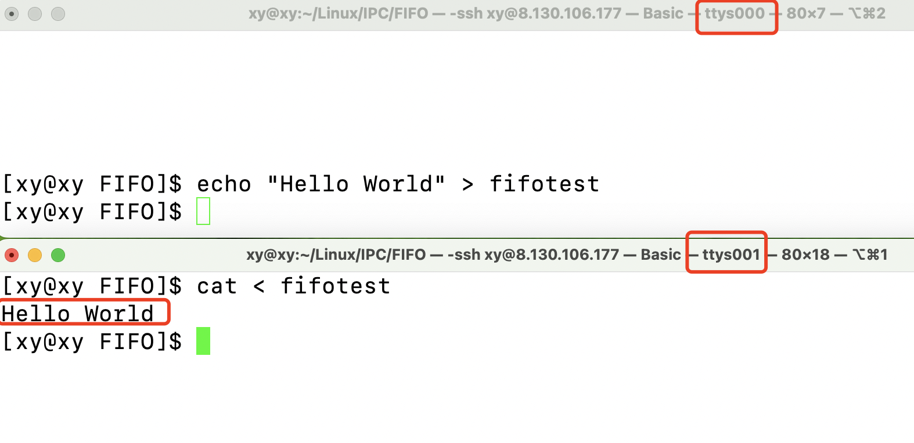

`cat`进程读取数据后，`echo`便不再阻塞。

这就是一个进程从文件读取另一个进程写入的数据的过程，是通过命名管道文件实现的。

也可以用一个脚本每隔一秒往管道文件中写入数据，另一个进程（例如`cat`）读取数据输出到屏幕上：

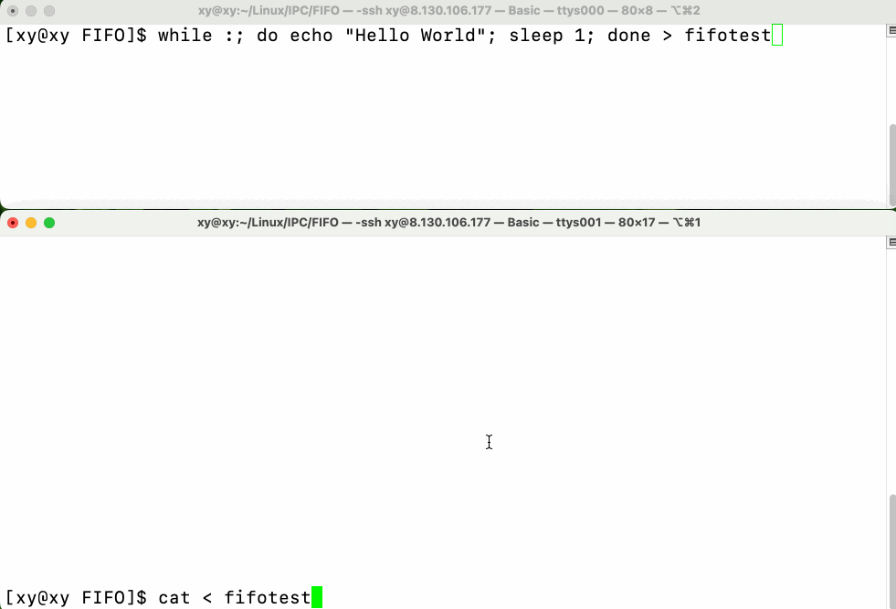

注意，这两个进程是独立的，而我们通过 mkfifo 创建的命名管道文件实现了任意进程间的通信。

结合匿名管道中的协同通信机制，我们知道当读端的进程终止，也就是不再有进程从管道中读取数据后，操作系统会杀掉写端进程，因为此时再向管道中写入数据是没有意义的。

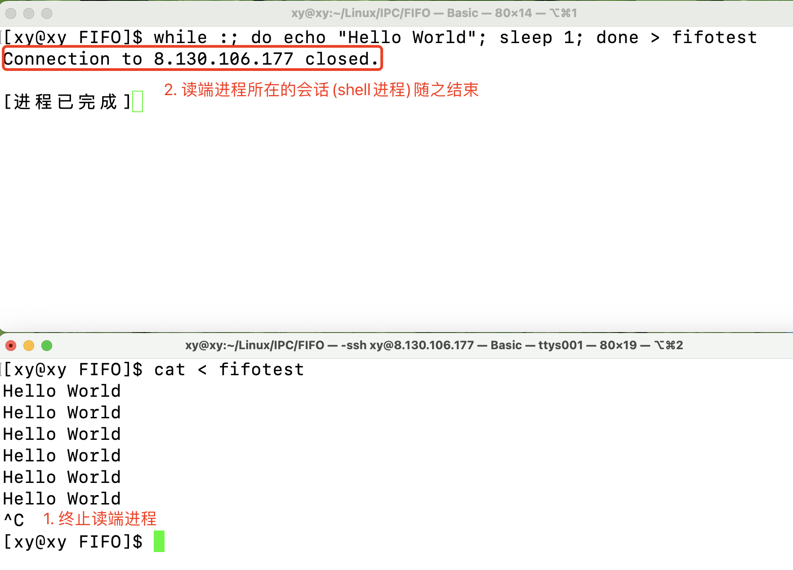

而当读端进程被终止后，本地和服务器的连接也会中断。原因是我们是通过 shell 程序连接到服务器的，而我们写的脚本就是 shell 进程帮我们执行的，所以在这里 shell 进程就是写端进程。

> shell 是一个命令行解释器。它在操作系统的最外层，负责直接与用户进行对话，把用户的输入解释给操作系统，并处理各种各样的操作系统的输出结果，输出到屏幕反馈给用户。

### 3.4 使用 mkfifo 函数创建命名管道

mkfifo 是一个函数，它可以根据给定的路径创建一个 FIFO 特殊文件（即命名管道文件）。

> mkfifo 命令实际上是调用了 mkfifo() 函数来创建命名管道。它们的功能相同，只是使用方式不同。

函数原型：

```cpp
int mkfifo(const char *pathname, mode_t mode);
```

参数：

- pathname：要创建的命名管道文件。
  - 路径：将命名管道文件创建在 pathname 路径下；
  - 文件名：默认将命名管道文件创建在当前路径下。
- mode：命名管道的权限。该参数会受到进程的文件创建掩码（umask）的影响，因此 umask 值也会影响到命名管道文件的权限，即创建的文件的实际权限为：`mode＆(〜umask)`。

返回值：

- 创建成功：返回 0；
- 创建失败：返回-1。

关于 mode 参数，如果将它设置为 0666，那么命名管道文件创建的权限应该是这样的：`prw-rw-rw-`。

```cpp
##include <iostream>
##include <sys/types.h>
##include <sys/stat.h>

using namespace std;

##define FILE_NAME "myfifo"
int main()
{
    if(mkfifo(FILE_NAME, 0666) < 0) // 创建失败
    {
        perror("mkfifo");
        return 1;
    }

    return 0;
}
```


这和我们预想的有所差别，原因是 umask 的默认值 为 0002 ，所以创建的文件的权限其实是 0664。

若想让文件不受到默认 umask 的影响，可在创建文件之前将 umask 设置为 0。

```cpp
umask(0);
```

### 3.5 实现客户端和服务端通信 [实践]

#### 组织文件

将头文件、宏等内容放在`comm.hpp`中。将服务端的逻辑放在`server.cc`中，将用户端的逻辑放在`client.cc`中。另外，在`Log.hpp`中存放日志所需函数和头文件等。

> 并非能总是在一开始就想好什么代码该放哪个文件，需求也不是一成不变的。

要实现服务端和用户端进程之间的通信，首先要让服务端进程创建一个命名管道文件，并且以只读的方式打开；然后服务端再通过只写的方式传输数据，这样服务端就能读取用户端发送的数据了。

#### 服务端逻辑

1. 创建管道文件
2. 打开管道文件
3. 获取客户端写入的数据
4. 获取数据后，对数据处理
5. 关闭管道文件
6. 删除管道文件

```cpp
##include <iostream>
##include <cstdio>
##include <sys/stat.h>
##include <sys/types.h>
##include <unistd.h>
##include <sys/wait.h>
##include <fcntl.h>
using namespace std;

##define FILE_PATH "./myfifo" // 文件路径
##define MODE 0666 // 文件权限

int main()
{
    // 1 . 创建命名管道文件
    if(mkfifo(FILE_PATH, MODE) < 0) // 创建失败
    {
        perror("mkfifo");
        exit(1);
    }
    // 2. 以只读的方式打开管道文件
    int fd = open(FILE_PATH, O_RDONLY);
    if(fd < 0)
    {
        perror("open"); // 打开失败
        exit(2);
    }
    // 3. 获取客户端数据
    // 通信逻辑
    
    // 父进程回收所有子进程的资源
    for(int i = 0; i < CHILD_PROCESS_NUM; i++)
    {
        waitpid(-1, nullptr, 0);
    }
    close(fd); // 关闭管道文件
    unlink(FILE_PATH); // 删除管道文件

    return 0;
}
```

注意：

- 可以使用`unlink`函数删除管道文件。

其中，处理数据的过程即进程间通信的过程，它的逻辑如下。

##### 服务端通信逻辑

将处理数据的逻辑放在一个名为`GetMessage`的函数中。

GetMessage 用于从命名管道中读取数据，它的逻辑如下：

1. 定义一个一定大小的缓冲区 buffer。
2. 在一个循环中不断地调用 `read` 函数来从管道中读取数据。
   - 读取成功，它会输出客户端发送的消息；
   - 如果读取到文件末尾，说明客户端已经退出，那么服务器也应该退出；
   - 如果读取出错，则输出错误信息并退出。

注意：

- 这个函数被声明为 `static` 是因为它只在这个文件中使用。将函数声明为 `static` 可以限制其作用域，使其只能在定义它的文件中访问。这样可以避免命名冲突，并且有助于代码的模块化。

- `memset` 函数用于将一块内存区域的内容全部设置为指定的值。在这段代码中，`memset` 函数用于将缓冲区的内容全部设置为 `'\0'`，也就是清空缓冲区。这样做是为了确保每次读取数据时，缓冲区中不会残留上一次读取的数据，避免数据混乱。

```cpp
// server.cc

##include <cstring>

##define BUFF_SIZE 1024       // 缓冲区大小

static void GetMessage(int fd)
{
    char buffer[BUFF_SIZE];
    while(1)
    {
        memset(buffer, '\0', sizeof(buffer)); // 清空缓冲区

        ssize_t ret = read(fd, buffer, sizeof(buffer) - 1); // 读取数据
        if(ret > 0) 
        {
            cout <<"进程 ["  << getpid() << "]:"<< "来自客户端的消息：" << buffer << endl;
        }
        else if (ret == 0) // 读到文件结尾
        {
            cerr <<"进程 ["  << getpid() << "]：" << "读到文件结尾，客户端已退出，服务端退出。" << endl;
            break;
        }
        else // 读取错误
        {
            perror("read");
            break;
        }
    }
}
```

注意：

- 使用`read`读取数据时，`read` 函数读取了 `sizeof(buffer) - 1` 个字节的原因是确保缓冲区中有一个空位来存储字符串的结束符 `\0`。这样，当使用 `cout` 来打印缓冲区中的内容时，它就能正确地识别出字符串的结束位置。
- 某些系统调用所要包含的头文件。

注：在这里将`server.cc`中的所有头文件、宏放在了`comm.hpp`文件中。

#### 用户端逻辑

1. 打开命名管道文件；
2. 读取用户输入的消息并将其写入管道；
3. 关闭管道文件。

```cpp
##include "comm.hpp"

int main()
{
    // 1. 获取管道文件
    int fd = open(FILE_PATH, O_WRONLY);
    if(fd < 0)
    {
        perror("open");
        exit(1);
    }

    // 2. 通信逻辑
    string buffer;
    while(true)
    {
        cout << "请键入信息 >> ";
        getline(cin, buffer);
        write(fd, buffer.c_str(), buffer.size());
    }

    // 3. 关闭文件
    close(fd);

    return 0;
}
```

#### 测试

在运行客户端之前，要先运行服务端。因为如果写端（客户端）先运行并向管道中写入数据，而此时没有进程读取这些数据，那么写端将会被阻塞。所以为了避免这种情况，通常让读端先运行。

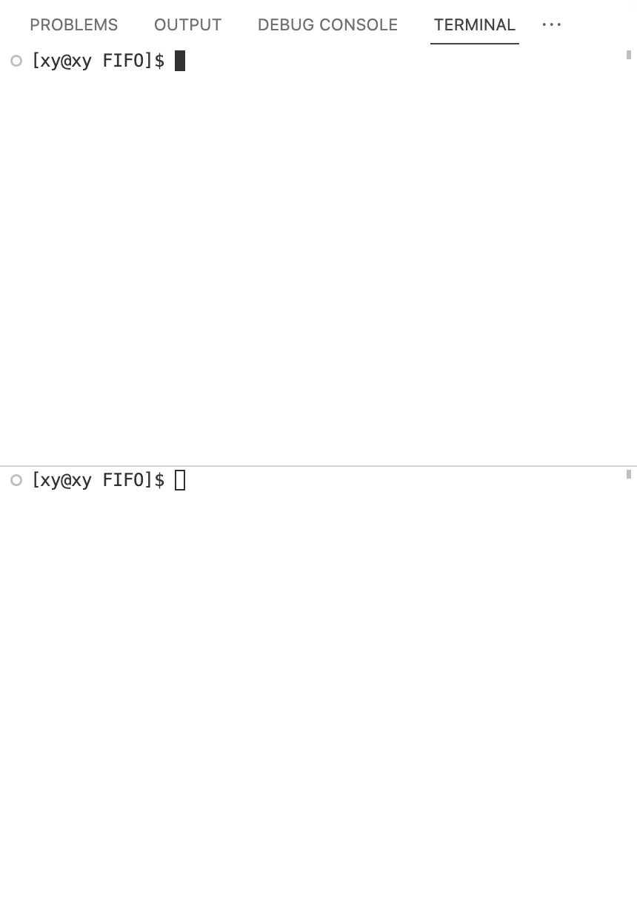

如图，服务端在被运行起来后，在客户端输入的信息就会通过命名管道文件传输到服务端一方，从而实现不同进程间通信。在这里，两个进程并没有任何亲缘关系，因为它们的源文件都有各自的 main 函数。

在测试的最后，注意到如果`Ctrl+C`终止写端进程，那么此时读端无法再从管道文件中读取数据，继续读也就没有意义了。所以读端（服务端）会直接终止。服务端有除了读取管道数据之外的任务，那么它会去执行其他代码。

> 实际上，服务端是被操作系统发送的 SIGPIPE 信号终止的。

可以再服务端创建多个子进程来获取客户端数据可以提高读取数据的效率。每个子进程都可以独立地从命名管道中读取数据，这样就可以并行地处理多个客户端的请求。

由于子进程的存在，子进程会继承父进程打开的文件，因此这就是匿名管道了。增加子进程后的代码存放在`MutiServer.cc`中，其中并未限制子进程的调度策略。

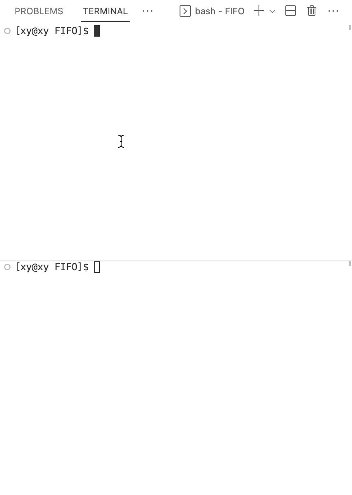

可见，多个这种方式比单个进程顺序读取数据要快得多，但也要注意回收多个子进程的资源。

值得注意的是，具体指派哪一个进程做什么事是需要根据实际情况用调度规则限制的（默认取决于 OS）。虽然一个管道可能有多个读端，但是由于匿名管道是单向通信的，所以父进程可以指派子进程执行任务（这与写入数据的原子性有关）。

如果要按照某种规则调度子进程，父进程可以再指派子进程执行任务之前传入 pid，子进程根据 pid 验证父进程指派的是否是自己，进而决定是否要开始任务。

除此之外，还可以在子进程中再创建一个匿名管道，从而实现广播。管道并不只适用于一个进程给另一个进程传输数据，还适用于一对多传输消息。

### 3.6 命名管道的特点

命名管道与匿名管道类似，最大的区别是命名管道是一个具有名称的管道文件，它可以在同一台计算机的不同进程之间（或跨越一个网络的不同计算机的不同进程之间）支持可靠的、单向或双向的数据通信。

它主要具有以下特点：

- 可以被任意符合权限要求的进程访问。
- 全双工通信通信。

- 在内存中进行。

下面将对第点作出解释：

在介绍命名管道是提到，命名管道是一种特殊的文件，它不会将内存中的数据刷新到磁盘中，我们可以只让客户端写入，服务端不读取，验证文件的大小是否不变证明。

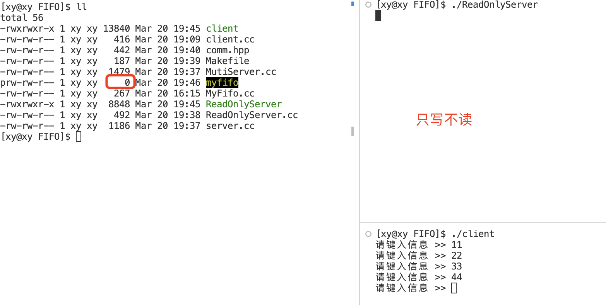

终止程序后：

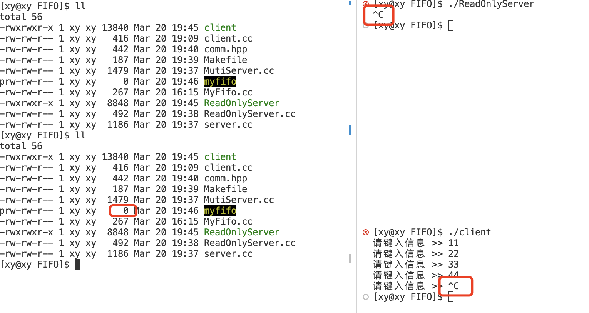

命名管道文件`myfifo`的大小并为变化，说明系统并未将数据从内存刷新到磁盘中。

注意，“看到同一份命名管道文件”只是看到文件名，但是在磁盘中的数据并不会改变。这个文件只是在内存中创建的一个“符号”，它不能存储数据，功能只是让不同进程看到同一份资源。命名管道只是用于不同进程间通信的工具，它并不会对磁盘中的文件产生影响。

## 4. 共享内存

### 4.1 共享内存的概念

还是离不开那句话：要实现进程间通信，前提是让不同的进程看到同一份资源。

共享内存是通过将不同进程的虚拟内存地址映射到相同的物理内存地址，从而实现数据的共享和传输。它是存在与内核级别的一种资源，是所有进程间通信中方式最快的一种。

> 在 Linux 内核中，每个共享内存都由一个名为 struct shmid_kernel 的结构体来管理，而且 Linux 限制了系统最大能创建的共享内存为 128 个。

### 4.2 共享内存的原理

共享内存将不同进程的虚拟内存地址映射到相同的物理内存地址，完成这个操作需要几个步骤。在此之前，需要了解进程地址空间、页表等进程数据结构是如何协助进程完成任务的：进程地址空间是系统中每个用户空间进程所看到的内存，是一种虚拟的内存，系统中的所有进程之间以虚拟方式共享内存。页表是一种数据结构，是虚拟地址（进程地址空间）和物理空间的桥梁。它用于将虚拟地址映射到物理地址。页表属于进程的地址空间，它协助进程完成任务，使得进程能够访问有效内存区域内的内存地址。

关于独立性：每个程序被加载到内存，OS 都会为其建立进程数据结构。每个进程都有自己的页表，将虚拟地址映射到物理内存的不同区域，使得进程数据结构独立，指向的数据和代码独立，进程之间也就有了独立性。

实现不同进程的虚拟地址映射到同一块物理内存地址，步骤主要分为两步：

1. 申请物理内存
2. 建立各个进程的页表和（同一块）物理内存之间的映射关系

> 其中，建立页表和物理内存地址的映射关系在进程被加载到内存时已经被操作系统完成了。

堆栈相向而生，在它们之间有一个区域，是共享内存所属的位置，叫做共享区。首先在共享区中申请一块物理内存空间，然后将它与各个进程的页表建立映射关系。再在进程地址空间中开辟一块叫做进行共享内存的空间，将它与进程的页表建立映射关系。通过内存空间和物理空间分别于进程的同一个页表建立映射关系，不同的进程就能够通过各自的页表索引到同一块物理内存空间，也就看到了同一份资源。

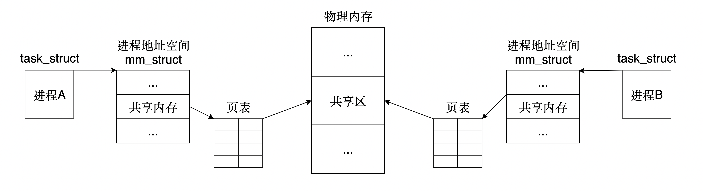

释放共享内存的步骤反之：先去除映射关系，然后再释放物理内存。

> 共享内存的提供者是谁？它属于某个进程吗？

- 共享内存的提供者是操作系统，它不属于任何进程。共享内存是操作系统为实现进程间通信专门提供的功能（模块），而之前用文件实现进程间通信，是利用了文件系统的特性，不是 OS 专门提供的进程间通信的方式。

### 4.3 管理共享内存

在操作系统中，有多个进程在进行通信，那么 OS 要管理好它们，就必须先抽象描述能够维护它们的数据结构，然后才能组织它们。和其他内核数据结构类似，创建共享内存，不止向系统申请了某块内存区域，还创建了（内核）数据结构，<mark>那么对共享内存的维护就是对这个数据结构的增删查改。</mark>

> 虽然到目前为止仍然为知这种维护共享内存的数据结构长什么样，但是我们心中已经有了管理模块的思想。

这是可以理解的，用文件角度的话来说，因为 Linux 下一切皆文件，共享内存也是文件，而文件=内容+属性。其中维护它的数据结构就可以认为是属性。

例如，在 Linux 操作系统中，这个数据结构就是结构体 shmid_ds（shared memory），这个结构体用于管理共享内存的信息。要使用共享内存，首先需要调用 shmget() 函数来创建或者获取一块共享内存。然后可以使用 shmat() 函数将共享内存连接到当前进程中的地址空间。当不再需要使用共享内存时，可以调用 shmdt() 函数将共享内存从当前进程中分离。

在`/usr/include/linux/shm.h`中，可以看到 shmid_ds 的定义：
```cpp
/* Obsolete, used only for backwards compatibility and libc5 compiles */
struct shmid_ds {
	struct ipc_perm		shm_perm;	/* operation perms */
	int			shm_segsz;	/* size of segment (bytes) */
	__kernel_time_t		shm_atime;	/* last attach time */
	__kernel_time_t		shm_dtime;	/* last detach time */
	__kernel_time_t		shm_ctime;	/* last change time */
	__kernel_ipc_pid_t	shm_cpid;	/* pid of creator */
	__kernel_ipc_pid_t	shm_lpid;	/* pid of last operator */
	unsigned short		shm_nattch;	/* no. of current attaches */
	unsigned short 		shm_unused;	/* compatibility */
	void 			*shm_unused2;	/* ditto - used by DIPC */
	void			*shm_unused3;	/* unused */
};
```

在`/usr/include/linux/ipc_perm`可以看到 ipc_perm 的定义：

```cpp
/* Obsolete, used only for backwards compatibility and libc5 compiles */
struct ipc_perm
{
	__kernel_key_t	key;
	__kernel_uid_t	uid;
	__kernel_gid_t	gid;
	__kernel_uid_t	cuid;
	__kernel_gid_t	cgid;
	__kernel_mode_t	mode; 
	unsigned short	seq;
};
```

### 4.4 创建和释放共享内存

共享内存的创建：

1. 申请物理内存空间
2. 建立申请到的物理内存空间（共享内存）与进程自身的地址空间之间的映射关系

共享内存的释放：

1. 取消映射关系
2. 释放物理内存空间

#### 创建共享内存

shmget 函数用于创建共享内存。函数原型：
```cpp
##include <sys/ipc.h>
##include <sys/shm.h>

int shmget(key_t key, size_t size, int shmflg);
```

参数：

- key：标识共享内存的值，即待创建的共享内存段在系统中的名字，以便其他进程可以通过这个名字来访问它。
- size：待创建共享内存的大小。
- shmflg：创建共享内存的方式，有 9 个权限标识符。类似创建文件的 mode 标志的使用（即使用`|`操作符组织选项）。

返回值：

- 成功：返回共享内存的标识符；
- 失败：返回-1。

shmget 的返回值实际上是共享内存的句柄。在这里句柄就是那 9 个权限标识符。句柄是用户使用的，它是必要的，因为在创建共享内存后，还需要使用其他系统接口对共享内存进行某些操作，都需要通过句柄指定接口做特定的操作。

> 句柄（Handle）这个词在英文中的原意是“把手”，用来抓取或操作物体的部分。
>
> 在计算机领域，句柄是一个用来标识对象或者项目的标识符，可以用来描述窗体、文件等。值得注意的是句柄不能是常量。它只是一个 32 位（或者 64 位）的无符号整数。

key 是有必要保存起来的，因为它是共享内存段的名字，其他进程必须通过 key 找到共享内存，才能实现不同进程看到同一份资源。即它是一个公共 key 值。

通过 ftok 函数获取参数 key。函数原型：
```cpp
key_t ftok(const char *pathname, int proj_id);
```

ftok 实际上就是将传入的路径名 pathname 和一个整数标识符 proj_id 通过一个算法生成一个 key 值（IPC 键值）。proj_id 是子序号，它是一个 8 位无符号整数，范围是 0~255。当 shmget 函数申请共享内存时，这个 key 值会被维护共享内存的数据结构保存。

注意：

- pathname 对应的文件必须存在且是可读写权限，它可以是任意的。这个路径可以是绝对路径或相对路径。

- 使用 ftok 函数生成 key 值可能会产生冲突，所以需要修改。
- 各个进程在使用 ftok 函数获取的 key 值必须是相同的。否则无法找到同一块共享内存。因此传入的两个参数也必须是相同的。

关于标识符 shmflg ，主要有两种组合方式：

|        组合方式        |                             作用                             |
| :--------------------: | :----------------------------------------------------------: |
|       IPC_CREAT        | 如果不存在 key 相等的共享内存，则新建之并返回该它的句柄；如果存在，则返回它的句柄 |
| IPC_CREAT `|` IPC_EXCL | 如果不存在 key 相等的共享内存，则新建之并返回该它的句柄；如果存在，则出错返回 |

第一个组合一定能获得一块共享内存的句柄，但无法保证它是新建的共享内存。

第二个组合能保证共享内存是新建的。

如果还想设置文件的权限如 0666，还可以`|`0666。

**创建公共 key**：

在使用 shmget 创建共享内存之前，需要通过 ftok 获取它的第一个参数 key。key 对于每个指向同一块共享内存的进程都是一样的。

**申请共享内存**：

通过 ftok 函数获取到 key 以后才能使用 shmget 函数创建共享内存，为了方便观察现象，可以将这两个函数的返回值分别打印出来。这里用两个源文件`shmClient.cc`和`shmServer.cc`，它们的代码完全相同，目的是验证这个 key 是否是相等的。
```cpp
##include <iostream>
##include <sys/types.h>
##include <sys/ipc.h>
##include <sys/shm.h>
##include <unistd.h>
##include <cstdio>
##include <cstdlib>
using namespace std;

##define PATH_NAME "./tmp.cc" // 文件路径
##define PROJ_ID 0x666              // 标识符
##define SHM_SIZE 4096              // 共享内存大小

int main()
{
    key_t key = ftok(PATH_NAME, PROJ_ID);
    if(key < 0)
    {
        perror("ftok");
        exit(1);
    }
    int shm = shmget(key, SHM_SIZE, IPC_CREAT | IPC_EXCL);
    if(shm < 0)
    {
        perror("shmget");
        exit(2);
    }
    cout << "key: " << key << endl;
    cout << "shm: " << shm << endl;

    return 0;
}
```

其中，tmp.cc 是新建的文件，里面什么都没有，因为 ftok 的第一个参数可以是任意可读写的文件，它只是通过特定算法得到 key 值的工具，这样能减少出现 key 值冲突的情况。

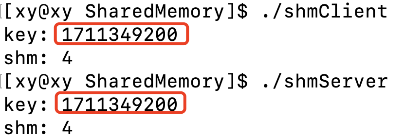

其中，共享内存的大小最好设为页表大小的倍数，因为在 Linux 中，内存是以页为**单位**来管理的，它可以将内存划分成更小的单元，从而更有效地使用内存，页的大小为 4KB。

> 例如设置共享内存的大小为 4097 字节，操作系统就会向上取整，开辟 8KB 的空间，然后只让你使用后 4KB 中的第一个字节。

当然，这个文件可以是不存在的，前提是 shmget 函数的第三个参数要用第二种组合的标识符。

如果再运行一次，就会出现这样的错误：


提示没有这个文件，而且退出码是 1。说明创建失败了，原因是进程终止以后，申请的共享内存依然存在。这是可以理解的，因为共享内存的作用是让不同的进程看到同一份资源，进程的数量不一定是固定的。

使用`ipcs`命令查看进程间通信有关信息：
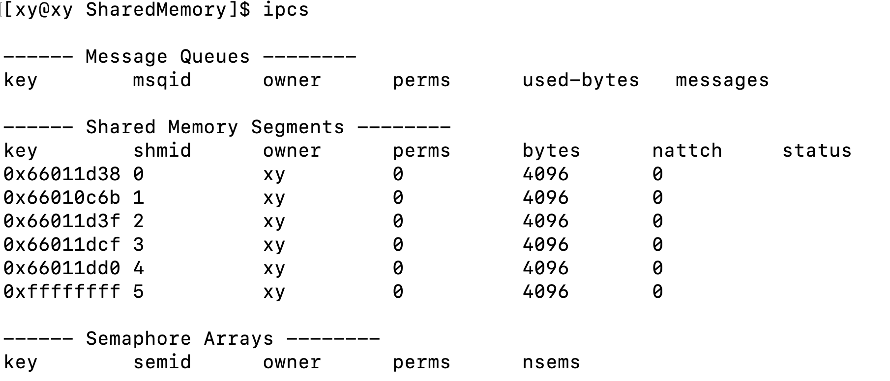

默认列出消息队列、共享内存以及信号量相关的信息，可以根据需要通过添加以下选项单独列出：

- -q：列出消息队列相关信息。
- -m：列出共享内存相关信息。
- -s：列出信号量相关信息。

其中：

正是我们刚才创建的共享内存。

其中每列信息的含义如下：

|  选项  |              含义              |
| :----: | :----------------------------: |
|  key   | 系统区别各个共享内存的唯一标识 |
| shmid  |  共享内存的用户层 id（句柄）   |
| owner  |        共享内存的拥有者        |
| perms  |         共享内存的权限         |
| bytes  |         共享内存的大小         |
| nattch |      关联共享内存的进程数      |
| status |         共享内存的状态         |

值得注意的是，在共享内存信息的倒数第二列：挂接（attach）指的是将共享内存段连接到进程的地址空间。这样，进程就可以访问共享内存段中的数据。可以使用 `shmat()` 函数来挂接共享内存段。其中 n 表示有 n 个进程。

> key 是在内核层面上保证共享内存唯一性的方式，而 shmid 是在用户层面上保证共享内存的唯一性，key 和 shmid 之间的关系类似于 fd 和 FILE * 之间的的关系。

反之，去关联就是 detach。

#### 释放共享内存

管道的生命周期随进程，而共享内存的生命周期随内核（重启即恢复）。这就是进程退出，共享内存依然存在的原因。

##### ipcrm 命令释放

即 IPC remove，它用于删除 System V IPC 对象（如消息队列、信号量和共享内存）。你可以使用 `ipcrm` 命令来删除指定的 IPC 对象，或者通过指定选项来删除所有未使用的 IPC 对象。

语法：`ipcrm [选项] id`

选项：

- -m：共享内存
- -q：消息队列
- -s：信号量

这里使用`ipcrm -m shmid`命令释放指定 id 的共享内存：

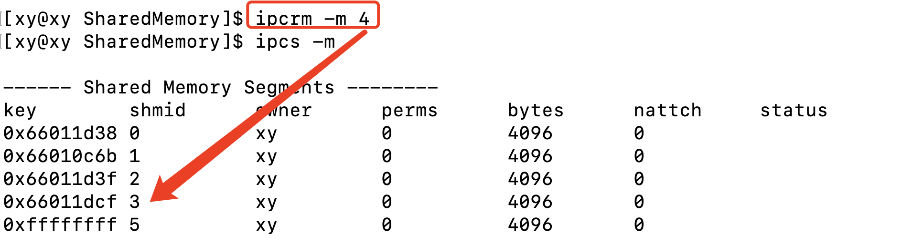

可见，刚才创建的 id 为 4 的共享内存已经被释放了。

##### shmctl 函数释放

即 Shared Memory Control，用于控制共享内存段。它可以用来执行诸如更改共享内存段的权限、删除共享内存段或获取共享内存段信息等操作。

原型：

```cpp
int shmctl(int shmid, int cmd, struct shmid_ds *buf);
```

参数：

-  `shmid` ：共享内存段的标识符；
- `cmd` ：要执行的操作；
- `buf` ：一个指向 `shmid_ds` 结构体的指针，用于传递参数或接收返回值。

返回值：

- 成功：返回 0；
- 失败：返回-1。

第二个参数 cmd 传入的常用的选项有以下三个：

|   选项   |                             作用                             |
| :------: | :----------------------------------------------------------: |
| IPC_STAT |    获取共享内存的当前关联值，此时参数 buf 作为输出型参数     |
| IPC_SET  | 在进程有足够权限的前提下，将共享内存的当前关联值设置为 buf 所指的数据结构中的值 |
| IPC_RMID |                        删除共享内存段                        |

例如，要删除一个共享内存段，你可以使用以下代码：

```c
shmctl(shmid, IPC_RMID, NULL);
```

> 为什么删除共享内存要用 shmid 而不是 key，key 不是在 OS 中是共享内存的唯一标识吗？

- 因为 `shmid` 是操作系统内部使用的唯一标识符，而 `key` 只是用来创建或访问 IPC 对象的。

后者是系统级，前者是用户级。所以操作系统共享内存时，用的是前者。与生命周期「随内核」相对的是「随进程」，共享内存随内核，就是当进程结束以后，共享内存依然存在，直到内核终止才会回收共享内存。

手动删除有点麻烦，可以将删除共享内存的逻辑交给代码实现：

```cpp
// 头文件和宏同上
int main()
{
    key_t key = ftok(PATH_NAME, PROJ_ID);
    if (key < 0)
    {
        perror("ftok");
        exit(1);
    }
    int shm = shmget(key, SHM_SIZE, IPC_CREAT | IPC_EXCL);
    if (shm < 0)
    {
        perror("shmget");
        exit(2);
    }
    cout << "key: " << key << endl;
    cout << "shm: " << shm << endl;

    sleep(2);
    shmctl(shm, IPC_RMID, NULL); // 释放共享内存
    sleep(2);
    return 0;
}
```

这段代码创建内存后隔 2s 释放共享内存，可以通过脚本查看现象：

```shell
while :; do ipcs -m;echo "-----------------------------------------------------";sleep 1;done
```

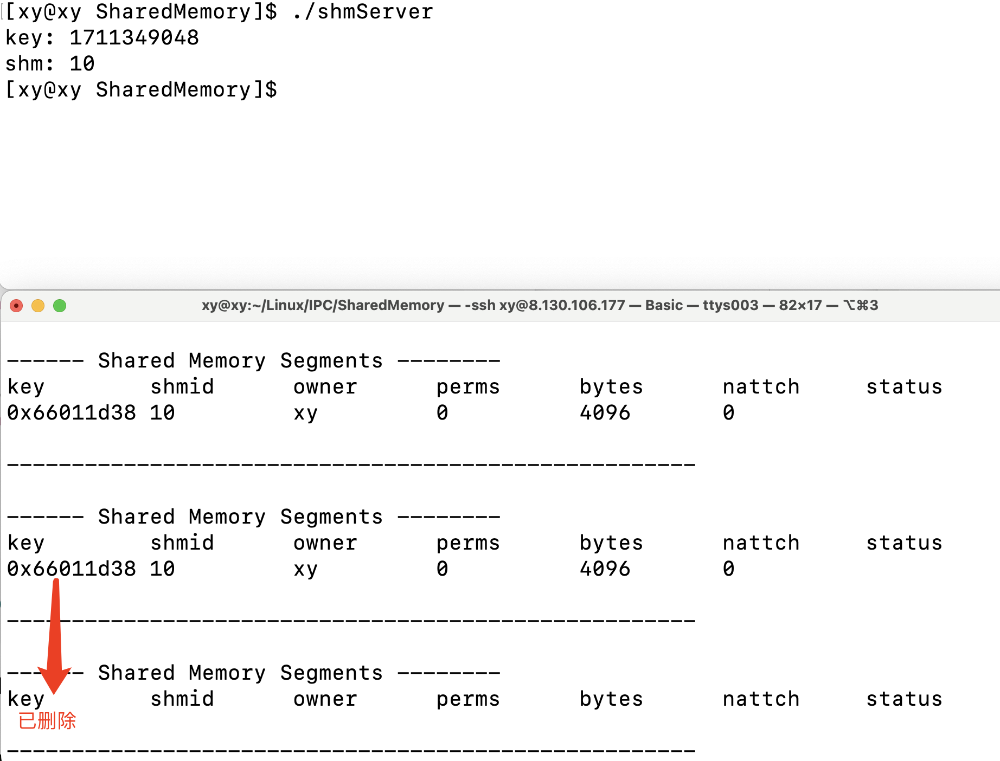

#### 小结

创建共享内存的进程在通信完成以后也应该完成对共享内存的释放，创建者就好像一个开会的组织者，在会议结束以后最后也应该由他来关门。Linux 中通过函数 `shmget` 创建的共享内存一般都是在程序中使用 `shmctl` 来释放的。

但是有时为了调试程序，开发人员可能通过 `Ctrl + C` 等方式发送中断信号来结束程序，此时程序申请的共享内存就不能得到释放。如果总是通过 `Crtl+C` 来结束的话，可以做一个信号处理器，当接收到这个信号的时候，先释放共享内存，然后退出程序（类似 C++中的异常机制）。如果 共享内存还是得不到释放，那么可以通过命令 `ipcrm -m shmid` 来释放。

### 4.5 挂接

shmat 函数是用来启动对共享内存的访问，并把共享内存连接到当前进程的地址空间。

原型：

```cpp
void *shmat(int shmid, const void *shmaddr, int shmflg);
```

参数：

- shmid：shmget 函数返回的共享内存标识符；
- shmaddr：指定共享内存映射到进程地址空间的某一地址，通常设置为 NULL/nullptr，表示让内核自己决定一个合适的地址位置；
- shmflg：表示关联共享内存时设置的某些属性，通常为 0。

返回值 (void*)：

- 成功，则返回共享内存映射到进程地址空间中的**起始地址**；
- 失败：返回 (void*)-1。

其中，第三个参数有以下几种选项：

|    选项    | 作用                                                         |
| :--------: | :----------------------------------------------------------- |
| SHM_RDONLY | 关联共享内存后只进行读取操作                                 |
|  SHM_RND   | 若 shmaddr 不为 NULL，则关联地址自动向下调整为 SHMLBA 的整数倍。公式：shmaddr-(shmaddr%SHMLBA) |
|     0      | 默认为读写权限                                               |

实际上，这个函数后面两个参数一般都设置为 0。它的返回值是 void *类型，和之前使用的 malloc 函数的返回值的类似的。

下面是一个挂接的示例：

```cpp
int main()
{
    // 1. 获取公共 key 值
    key_t key = ftok(PATH_NAME, PROJ_ID);
    if (key < 0)
    {
        perror("ftok");
        exit(1);
    }
    // 2. 申请共享内存
    int shmid = shmget(key, SHM_SIZE, IPC_CREAT | IPC_EXCL | 0666);
    if (shmid < 0)
    {
        perror("shmget");
        exit(2);
    }
    sleep(3);
    // 3. 将共享内存挂接到进程的地址空间
    char* shmaddr = (char*)shmat(shmid, nullptr, 0);
    if(shmaddr == (void*)-1)
    {
        perror("shmat");
        exit(3);
    }
    // 进程间通信逻辑
    // ...
    // 释放共享内存
    shmctl(shmid, IPC_RMID, NULL); // 释放共享内存

    return 0;
}
```

但是却挂接失败：


原因在于使用 shmget 函数创建共享内存时，并没有对创建的共享内存设置权限，所以创建出来的共享内存的默认权限为 0，即无权限，因此进程没有权限关联该共享内存。

所以在使用 shmget 函数时，在第三个参数中添加文件权限，在这里设置为 0666：

```cpp
int shmid = shmget(key, SHM_SIZE, IPC_CREAT | IPC_EXCL | 0666);
```

在执行挂接逻辑之前，sleep(3)，同样运行之前的脚本，观察 nattch 这一列的变化：
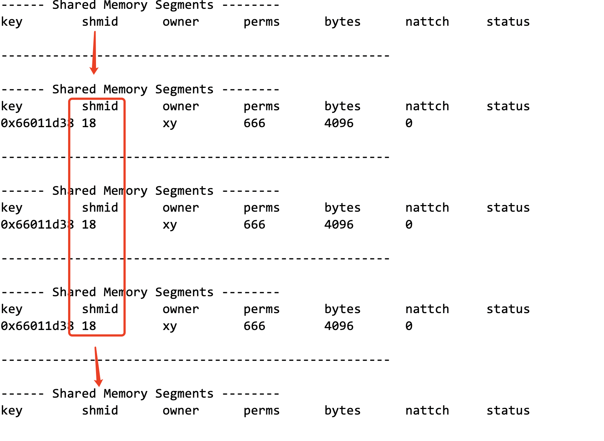

可见，这块共享内存挂接的进程数目从 0 到 1，进程释放后又减到 0。

#### 实现多个进程挂接

在这里，我们用另一个文件 `shmClient.cc` 保存代码。它的头文件和宏被包含在`comm.hpp`中。

服务端代码：

```cpp
// shmServer.cc

##include "comm.hpp"

int main()
{
    // 1. 获取公共 key 值
    key_t key = ftok(PATH_NAME, PROJ_ID);
    if (key < 0)        
    {
        perror("ftok");
        exit(1);
    }
    // 2. 申请共享内存
    int shmid = shmget(key, SHM_SIZE, IPC_CREAT | IPC_EXCL | 0666);
    if (shmid < 0)
    {
        perror("shmget");
        exit(2);
    }
    sleep(3);
    // 3. 将共享内存挂接到进程的地址空间
    char *shmaddr = (char *)shmat(shmid, nullptr, 0);
    if (shmaddr == (void *)-1)
    {
        perror("shmat");
        exit(3);
    }

    // 进程间通信逻辑
    // ...
    while(1){}
    // 去关联
    int n = shmdt(shmaddr);
    if(n == -1)
    {
        perror("shmdt");
        exit(4);
    }
    // 释放共享内存
    shmctl(shmid, IPC_RMID, NULL); // 释放共享内存

    return 0;
}

```

客户端代码：

```cpp
// shmClient.cc

##include "comm.hpp"

int main()
{
    // 1. 获取公共 key 值
    key_t key = ftok(PATH_NAME, PROJ_ID);
    if (key < 0)
    {
        perror("ftok");
        exit(1);
    }
    // 2. 「获取」共享内存
    int shmid = shmget(key, SHM_SIZE, IPC_CREAT); 
    if (shmid < 0)
    {
        perror("shmget");
        exit(2);
    }
    // 3. 将共享内存挂接到进程的地址空间
    char *shmaddr = (char *)shmat(shmid, nullptr, 0);
    if (shmaddr == nullptr)
    {
        perror("shmat");
        exit(3);
    }
    // 4. 进程间通信逻辑
    // ...
    while(1){}
    // 5. 将进程地址空间和共享内存去关联
    int n = shmdt(shmaddr);
    if(n == -1)
    {
        perror("shmdt");
        exit(4);
    }
    // Client 端不需要释放共享内存
    return 0;
}
```

为了能观察现象，客户端和服务端调用了 shmat 函数后让程序死循环，依然使用脚本查看共享内存被挂接数量的变化。

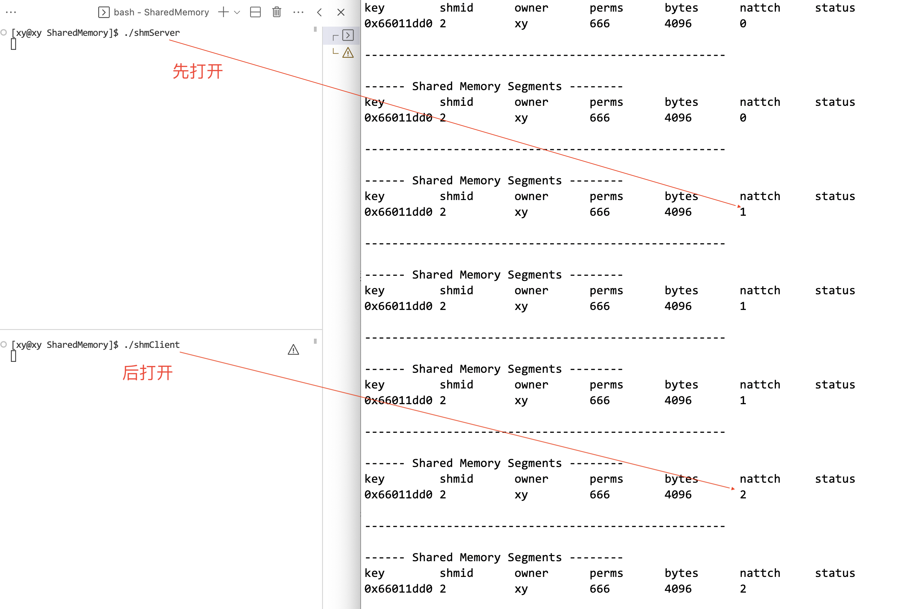

共享内存由服务端创建，理应由服务端释放。

### 4.6 实现客户端和服务端通信 [实践]

在上面的基础上，我们已经完成了进程间通信的前提：不同进程看到同一份资源。接下来要做的事可以想象：一个客户端进程往共享内存中写入数据，服务端进程从共享内存中读取数据。

#### server 端

将共享内存快看成一个大字符串（或数组），它能够被直接读取。创建共享内存的操作类似 malloc，类型在创建时就已经被强制转换为 char* 了。

```cpp
// 进程间通信逻辑
while(1)
{
    printf("%s\n", shmaddr);
    if(strcmp(shmaddr, "quit") == 0)
            break;
    sleep(1);
}
```

> 通过 `shmat` 函数将共享内存附加到进程的地址空间中，然后就可以像访问普通内存一样读写共享内存了。如果共享内存中存储的是字符串，那么就可以直接像读取字符串一样读取共享内存中的内容。

并且，如果读取到了客户端传来的`"quit"`字符串，则终止通信逻辑，去挂接、释放内存。

#### client 端

同样地，将共享内存看成一个元素类型是 char 的数组，也就是（C 风格的）字符串。

使用格式化输出函数 snprintf 向缓冲区输入数据：
```cpp
// 4. 进程间通信逻辑
for(int i = 65; i <= 75; i++)
{
    sleep(1);
    snprintf(shmaddr, SHM_SIZE, "%c", i);
}
strcpy(shmaddr, "quit");
```

实际上，每一次输入都是向共享内存的起始地址写入内容的，也就是 shmaddr 指向的地址。

#### 测试 1

在这里，通过打印字符模拟一下用户端写入的操作，验证是否可行。


首先运行服务端，然后再运行客户端。通过结果表明，这个通信方式是可行的。不用自己手动去挂接，方便许多。

#### 测试 2

[结论]

实际上，只要不同进程通过共享内存通信，一方向共享内存中写入数据后，另一方能够立刻看到其内容。因为拷贝数据的过程只存在内存和硬件之间的数据拷贝

结合管道的知识：管道传输数据实际上是通过数次拷贝实现的。例如：

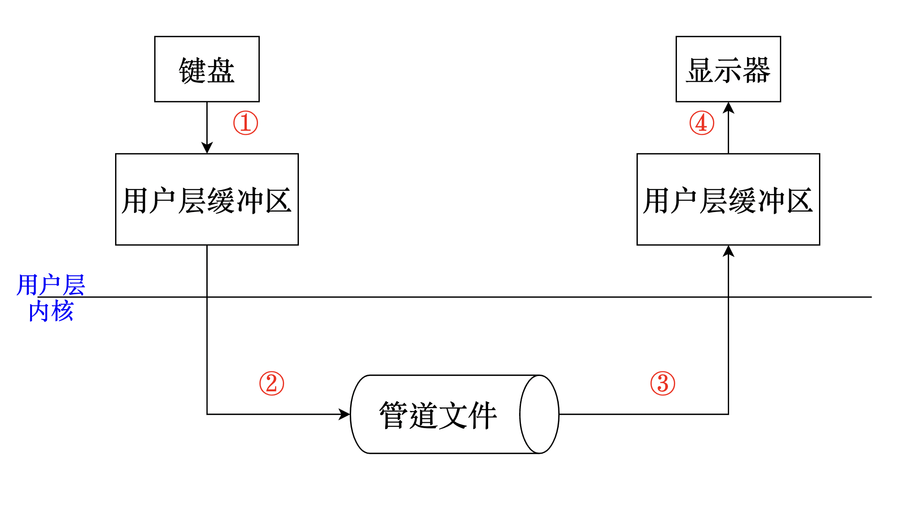

在这个例子中数据被拷贝了 4 次，这将极大影响传输效率。对于共享内存，拷贝数据的过程只存在内存和硬件之间的数据拷贝。

此次测试在之前的基础上做出改进：为了减少拷贝，我们可以让客户端不用缓冲区，直接写入到共享内存中。我们就可以在客户端进程中用键盘输入数据，服务端也能直接从共享内存中读取数据。因此这里只需要修改客户端的通信逻辑。

```cpp
while(1)
{
    ssize_t ret = read(0, shmaddr, SHM_SIZE - 1);
    if(ret > 0)
    {
        shmaddr[ret - 1] = 0;
        if(strcmp(shmaddr, "quit") == 0) 
            break;
    }
    sleep(1);
}
```


注意读取的内容不能包括最后一个字符，当最后输入 quit 的时候 server 端无法终止进程，因为输入了`'\n'`。

现在初步实现了能够用键盘输入信息，但问题是服务端会一直读取内容，而且两个进程互相不知道对方的存在，只知道做自己的事。这说明共享内存没有访问控制。它可能会造成并发问题，导致进程间的数据不一致。

#### 测试 3

对共享内存赋予访问控制，我们可以使用有访问控制的管道实现。将管道文件的创建和删除绑定到一个全局变量的生命周期上：定义一个 Init 类，将创建管道的操作放在构造函数中，将 unlink 删除管道文件的操作放在析构函数中。用这个类定义一个全局对象，进程运行起来后就会自动构建全局变量，也就是要调用构造函数，当那个进程终止时，会调用析构函数。

```cpp
class Init
{
public:
    Init()
    {
        umask(0);
        int n = mkfifo(PATH_NAME, 0666);
        assert(n == 0);
        (void)n;
    }
    ~Init()
    {
        unlink(PATH_NAME);
    }
};
```

要实现服务端只读取一次共享内存的最新内容，可以在读取之前通过让进程等待，当收到客户端的唤醒信号时再读取共享内存中的数据：

```cpp
// 等待
void Wait(int fd)
{
    uint32_t temp = 0;
    ssize_t ret = read(fd, &temp, sizeof(uint32_t));
    assert(ret == sizeof(uint32_t));
    (void)ret;
}
// 唤醒
void Wakeup(int fd)
{
    uint32_t temp = 1;
    ssize_t ret = write(fd, &temp, sizeof(uint32_t));
    assert(ret == sizeof(uint32_t));
    (void)ret;
}
```

其中，`sizeof(uint32_t)`和之前类似，是一种通信协议。


本文所有源码：[点这里](https://github.com/shawyxy/source_code/tree/main/IPC)。

### 4.7 总结

虽然共享内存是最快的进程间通信的方式，但是它也是有缺点的。

在此之前，要明确几个概念：

1. 临界资源：多个进程（执行流）看到的公共资源就是临界资源；
2. 临界区：进程中访问临界资源的代码段。

#### 时序问题

共享内存允许两个或多个进程访问同一块内存。当一个进程改变了这块内存中的内容时，其他进程就可以察觉到这种更改。这样会造成，进而可能会造成数据不一致。原因是由于共享内存没有提供同步机制，因此在使用共享内存时可能会出现时序问题。如果多个进程同时访问和修改共享内存中的数据，可能会导致数据不一致或其他问题。因此，在使用共享内存时，需要小心维护这段共享内存，避免出现时序问题。

这使得我们在使用共享内存进行进程间通信时，往往要借助其他手段来进行进程间的同步工作。

## 5. 信号量

### 5.1 信号量的概念

信号量（semaphore）是一种用于多进程同步的机制。它可以用来控制对共享资源的访问，以避免出现「竞争条件」。

> 在生活中看电影我们需要买票，根据票上的编号找到自己的位置。电影票赋予了座位以标识，编号象征着它在电影播放这段时间是暂时属于我们的。因此，这个座位的所属者是由编号决定的，而不是只有当我们坐下才属于我们。所以现实中即使我们迟到了，也没有人会坐它，因为这是一种「预定」机制。

我们可以把信号量想象成电影院中的座位。假设电影院有 100 个座位，每个座位都有一个编号。那么我们可以将信号量的初始值设置为 100。每当有一个顾客进入电影院并占用一个座位时，信号量的值就会减 1。当所有座位都被占满时，信号量的值变为 0，此时再有顾客想进入电影院就必须等待其他顾客离开并释放座位。

同样，在多进程环境中，当一个进程需要访问共享资源时，它会先检查信号量的值是否大于 0。如果是，则该进程可以访问共享资源，并将信号量减 1；否则，该进程必须等待其他进程释放共享资源。

每个进程想访问临界资源，不能让进程直接使用它，用上面的例子来说，就是不能让人们直接去放映厅里占座位，这样会造成时序混乱。申请信号量的过程就是买票的过程。

#### 竞争条件

竞争条件（race condition）是指多个进程或线程在并发执行时，由于对共享资源的访问顺序不确定，导致程序运行结果不可预测的情况。

举个例子，假设有两个进程 A 和 B，它们都需要对一个共享变量 x 进行加 1 操作。如果这两个进程同时执行，那么可能会出现以下情况：

1. 进程 A 读取 x 的值为 0。
2. 进程 B 读取 x 的值为 0。
3. 进程 A 将 x 加 1 并写回内存，此时 x 的值为 1。
4. 进程 B 将 x 加 1 并写回内存，此时 x 的值为 1。

在这种情况下，尽管两个进程都对 x 进行了加 1 操作，但最终结果却只增加了 1。这就是竞争条件。

为了避免竞争条件，我们需要使用同步机制来控制对共享资源的访问顺序。例如，在上面的例子中，我们可以使用信号量或互斥锁来保证每次只有一个进程能够访问共享变量 x。

### 5.2 信号量的操作

信号量的本质是是一个整数变量，不严谨地说，它就是一个管理共享内存的计数器。

信号量有两个基本操作：

- `wait` 操作用于申请资源，它会将信号量的值减 1。如果信号量的值小于 0，则线程会被阻塞，直到信号量的值大于等于 0。
- `signal` 操作用于释放资源，它会将信号量的值加 1。如果有其他线程被阻塞，则会唤醒一个被阻塞的线程。

> 当一个进程被阻塞时，它通常会被放入等待队列中。

#### 信号量的创建

信号量集（semaphore set）是一组信号量，它们可以被用来同步多个进程对多个共享资源的访问。

在 Linux 中，可以使用 System V 信号量来创建和使用信号量集。System V 信号量提供了一组系统调用，用于创建、访问和控制信号量集。

例如，可以使用 semget 函数来创建一个新的信号量集。原型：

```c
##include <sys/types.h>
##include <sys/ipc.h>
##include <sys/sem.h>

int semget(key_t key, int nsems, int semflg);
```

参数：

- `key`：同 shmget 函数，是信号量集的键值，它用于唯一标识一个信号量集（系统层）。同样地，使用 ftok 函数来生成它。
- `nsems`：指定信号量集中信号量的数量。

- `flags`：同 shmget 函数，指定创建选项。通常，可以将其设置为`IPC_CREAT | IPC_EXCL | mode`，其中 `mode` 指定了信号量集的权限。

返回值：

- 成功：返回一个非负整数，表示新创建的信号量集的标识符（用户层）；
- 失败：返回-1，并设置 errno。

> errno 是一个全局变量，它用于存储系统调用的错误码。当一个系统调用失败时，它会将 errno 设置为一个特定的值，以表示发生了什么错误。
>
> 例如，在上面提到的 semget 函数中，如果函数执行失败，则会返回-1，并将 errno 设置为一个特定的值。可以使用 perror 函数来打印出错误信息：
>
> ```c
> #include <stdio.h>
> 
> if (semid == -1) 
> {
>     perror("semget failed");
> }
> ```
>
> 在这个例子中，如果 semget 函数执行失败，则会打印出类似于“semget failed: No such file or directory”的错误信息，这是我们经常使用的。

#### 信号量的删除

semctl 函数被用来删除一个信号量集。原型：
```cpp
##include <sys/types.h>
##include <sys/ipc.h>
##include <sys/sem.h>

int semctl(int semid, int semnum, int cmd, ...);
```

参数：

- `semid`：要删除的信号量集的标识符；
- `semnum`：通常设置为 0；
- `cmd`：通常设置为`IPC_RMID`。

 返回值：

- 成功：返回 0；
- 失败：返回-1，并设置 errno

注意：在删除一个信号量集之前，应该确保没有进程正在使用它。

#### 信号量的操作

semop 函数用于对一个或多个信号量执行 wait 或 signal 操作。原型：

```c
##include <sys/types.h>
##include <sys/ipc.h>
##include <sys/sem.h>

int semop(int semid, struct sembuf *sops, unsigned nsops);
```

参数：

- `semid`：要操作的信号量集的标识符。

- `sops`：一个指向 sembuf 结构体数组的指针，用于指定要执行的操作。

- `nsops`参数指定了 sops 数组中 sembuf 结构体的数量。

其中，每个 sembuf 结构体表示一次对单个信号量的操作。sembuf 结构体定义如下：

```c
struct sembuf {
    unsigned short sem_num;  // 信号量编号
    short          sem_op;   // 操作
    short          sem_flg;  // 操作标志
};
```

成员：

- `sem_num`字段指定了要操作的信号量在信号量集中的编号。

- `sem_op`字段指定了要执行的操作。如果它的值为正数，则表示执行 signal 操作；如果它的值为负数，则表示执行 wait 操作；如果它的值为 0，则表示等待信号量变为 0。

- `sem_flg`字段用于指定操作标志。可以将其设置为 0 或 IPC_NOWAIT。如果设置为 IPC_NOWAIT，则当无法立即执行操作时，semop 函数会立即返回而不是阻塞。

返回值：

- 成功：返回 0；
- 失败：返回-1，并设置 errno。

### 5.3 互斥 

互斥（Mutual Exclusion）是指在多线程环境下，保证同一时间只有一个线程能访问共享资源的机制。

以电影院和座位为例，现在有多个顾客同时在线购买电影票，每个顾客都可以选择一个座位并购买。为了避免多个顾客同时购买同一个座位（时序问题），我们需要使用互斥锁来<mark>保证同一时间只有一个</mark>顾客能够访问座位信息。

> 进程互斥也可以用集合来解释。假设有一个集合 S，它包含了所有的进程。每个进程都有一个临界区，临界区是指对共享资源进行访问的代码段。
>
> 我们可以定义一个规则，即在任意时刻，集合 S 中最多只能有一个进程处于临界区。这就意味着，在任意时刻，最多只能有一个进程在访问共享资源。
>
> 为了实现这个规则，我们需要使用一些同步机制，比如互斥锁、信号量等。这些同步机制可以帮助我们保证在任意时刻，最多只有一个进程处于临界区。

#### 互斥锁

互斥锁（Mutual exclusion，缩写 Mutex）是一种用于多线程编程中，防止两条线程同时对同一公共资源（比如全局变量）进行读写的机制。该目的通过将代码切片成一个一个的临界区域（critical section）达成。

互斥锁是一种「独占锁」，当线程 A 加锁成功后，此时互斥锁已经被线程 A 独占了。只要线程 A 没有释放手中的锁，线程 B 加锁就会失败。失败的线程 B 于是就会释放 CPU 让给其他线程。既然线程 B 释放掉了 CPU，自然线程 B 加锁的代码就会被阻塞。

实现进程互斥的方法是在初始化该锁的时候，设置为进程间共享，然后将互斥量保存在共享内存中。这样两个进程连接到共享内存后，都可以获得这个互斥锁。可以使用 pthread 库中的互斥锁函数来实现：首先，需要。

可以通过以下步骤来实现：

1. 定义一个存储在共享内存区域的 pthread_mutex_t 类型的变量来表示互斥锁，然后使用 pthread_mutex_init 函数来将这个互斥锁初始化为未锁定状态。
2. 在每个进程中，连接到共享内存并获取互斥锁的地址。
3. 在每个进程的临界区代码之前，使用 pthread_mutex_lock 函数加锁。如果此时互斥锁已经被其他进程占用，则当前进程会阻塞，直到其他进程释放了这个互斥锁。
4. 在每个进程的临界区代码之后，使用 pthread_mutex_unlock 函数解锁。这样其他进程就可以获取这个互斥锁并进入临界区了。
5. 最后，在不再需要这个互斥锁时，可以使用 pthread_mutex_destroy 函数来销毁它。

通过这种方式，我们就可以保证在任意时刻，最多只有一个进程处于临界区。

下面是一个简单的例子，演示了如何使用互斥锁来实现进程互斥：

```c
##include <stdio.h>
##include <pthread.h>

pthread_mutex_t lock;

void *myThread(void *arg)
{
    // 加锁
    pthread_mutex_lock(&lock);

    // 临界区代码
    printf("Thread %d entered critical section.\n", *(int *)arg);

    // 解锁
    pthread_mutex_unlock(&lock);

    return NULL;
}

int main()
{
    pthread_t threads[2];
    int thread_args[2] = {1, 2};

    // 初始化互斥锁
    pthread_mutex_init(&lock, NULL);

    // 创建两个线程
    for (int i = 0; i < 2; i++)
        pthread_create(&threads[i], NULL, myThread, &thread_args[i]);

    // 等待两个线程结束
    for (int i = 0; i < 2; i++)
        pthread_join(threads[i], NULL);

    // 销毁互斥锁
    pthread_mutex_destroy(&lock);

    return 0;
}
```

在这个例子中，我们定义了一个全局的互斥锁变量`lock`。在`main`函数中，我们使用`pthread_mutex_init`函数来初始化这个互斥锁。

然后，我们创建了两个线程，并让它们执行`myThread`函数。在这个函数中，我们首先使用`pthread_mutex_lock`函数来加锁。如果此时互斥锁已经被其他线程占用，则当前线程会阻塞，直到其他线程释放了这个互斥锁。

接着，在临界区代码之后，我们使用`pthread_mutex_unlock`函数来解锁。这样其他线程就可以获取这个互斥锁并进入临界区了。

最后，在不再需要这个互斥锁时，我们使用`pthread_mutex_destroy`函数来销毁它。

### 5.4 原子性操作

#### 引入

依然是电影院的例子，我们可以使用一个信号量来表示剩余的座位数量。

当一个顾客想要购买一张电影票时，他需要执行以下步骤：

1. 等待信号量。如果信号量的值大于 0，则表示还有剩余的座位，顾客可以继续执行下一步。否则，顾客需要等待，直到有其他顾客离开电影院并释放座位。
2. 原子性地减少信号量的值。这一步是原子性操作，它保证了在多线程环境下对信号量的访问是安全的。这意味着，在执行这一步时，不会被其他线程中断。
3. 分配座位并打印电影票。

当一个顾客离开电影院时，他需要执行以下步骤：

1. 原子性地增加信号量的值。
2. 释放座位。

通过这种方式，我们就可以保证在任意时刻，电影院中最多只有 100 个顾客，并且不会出现两个顾客分配到同一个座位的情况。

如果我们不使用原子性操作来实现上述电影院的例子，那么可能会出现一些问题。假设有两个顾客 A 和 B 同时想要购买电影票，此时电影院只剩下一个座位。由于我们没有使用原子性操作来保护信号量，所以可能会出现以下情况：

1. 顾客 A 检查信号量的值，发现它大于 0，于是继续执行下一步。
2. 在顾客 A 减少信号量的值之前，顾客 B 也检查了信号量的值，并发现它大于 0。因此，顾客 B 也继续执行下一步。
3. 顾客 A 和顾客 B 都减少了信号量的值，并且都分配到了同一个座位。

这就是非原子性操作可能导致的问题。由于对信号量的访问不是原子性的，在多线程环境下可能会出现竞争条件，从而导致错误的结果。

----

如介绍信号量时所说，信号量本质是一个计数器，它是对临界资源的预定机制。

> 既然如此，可以用一个全局的整型变量 n 来表示信号量？假设让多个进程（整数 n 在共享内存中），看到同一个全局变量，所有进程都通过变量 n 申请信号量呢？

信号量确实是一个计数器，但是它不仅仅是一个简单的整型变量。信号量提供了一些特殊的操作，用于保证在多线程或多进程环境下对共享数据的安全访问。

如果我们只使用一个全局的整型变量 n 来表示信号量，那么可能会出现一些问题。例如，在上面提到的电影院例子中，如果我们只使用一个整型变量来表示剩余座位数量，那么可能会出现两个顾客同时检查座位数量并发现有剩余座位，然后都购买电影票并分配到同一个座位的情况。

在计算机中，对数据处理的主体是 CPU，CPU 只与内存进行通信，所以全局变量 n 首先要被写入到共享内存中才能被 CPU 处理。

CPU 执行指令的步骤大致可以分为五个阶段：取指令、指令译码、执行指令、访存取数、结果写回。对于这个全局变量 n ，可以分为以下几个步骤：

1. 将内存中的数据加载到 CPU 中的寄存器（取指令）；
2. n--（分析指令、执行指令）；
3. 将 CPU 更新后的变量 n 写回内存（结果写回）。

> 执行流（进程执行任务的过程）在执行时，随时都可能会被切换。因为操作系统需要对多个进程进行调度，以保证每个进程都能获得公平的运行时间。
>
> 寄存器在 CPU 中只有一套，被所有执行流共享，但是寄存器中的数据属于每一个执行流，即属于执行流的上下文数据。进程再被切换时，会进行上下文保护和上下文恢复。

问题就出在 n-- 这个操作上。因为时序问题，会导致变量 n 会出现中间状态，可能导致数据不一致。为什么？因为这个中间状态出现的原因就是 CPU 执行指令时，需要对多个寄存器或内存单元进行读写操作，而这些操作并不是同时完成的，而是有一定的时间差。如果在这个时间差内，数据发生了变化，那么就会造成数据的不一致或错误。

为了避免这种情况，我们需要使用信号量提供的特殊操作来保证对共享数据的安全访问。例如，在上面提到的例子中，我们可以使用`sem_wait()`和`sem_post()`函数来实现对信号量的原子性操作。

总之，虽然信号量本质上是一个计数器，但是它提供了一些特殊的操作来保证在多线程或多进程环境下对共享数据的安全访问。因此，不能简单地用一个全局整型变量来替代信号量。

----

#### 概念

原子性（Atomicity）是指一个操作要么全部执行，要么全部不执行。在多线程环境下，原子操作是指不会被其他线程打断的操作。

对于上面的例子，要实现用一个整数计数器管理进程访问共享资源，前提是要被进程看到， 那么这个计数器天然就要是共享资源。但是这个计数器本身就是为了保护共享资源的安全，所以首先要保证计数器本身的安全，即保证信号量的申请和释放也是安全的。

在 Linux 中，可以使用原子变量（Atomic Variable）来实现原子操作。原子变量是一种特殊的变量，它提供了一组原子操作，可以保证这些操作在多线程环境下不会被打断。只有当这个原子变量自己是原子的，才能保护好自己，进而保护好共享资源，这是有信号量本身的性质决定的。
