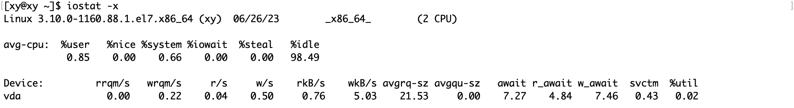
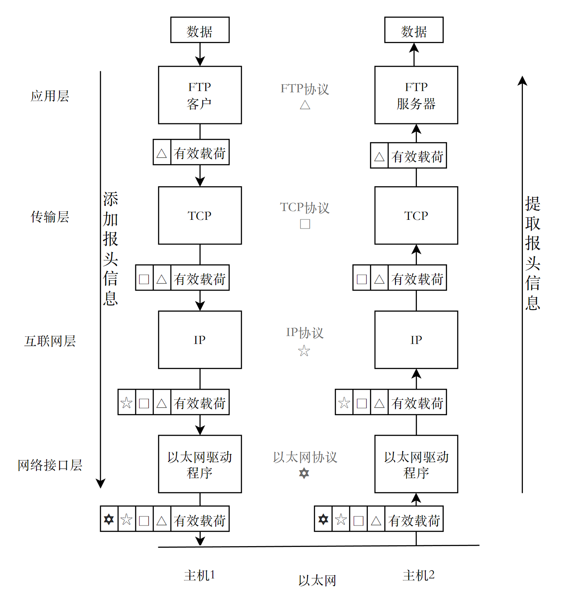

友情链接：[网络基础入门](https://blog.csdn.net/m0_63312733/article/details/130377048?spm=1001.2014.3001.5501)

> 本文适合已经了解了网络基础的同学阅读，即理解了《图解 TCP/IP》前 2 章的内容，了解过 HTTP/HTTPS 协议原理再好不过（至少要理解什么是“协议”），本文结合了《图解 TCP/IP》第 6 章的内容。

# 1. 传输层

HTTP/HTTPS 等应用层协议运行在 TCP/IP 等传输层协议之上，通信的场景和需求不同，对应着不同特点的传输层协议。通过分层实现的模型使得每一层协议只关心它本身这层协议，对于它而言，就好像直接将数据抛给对方一样，而实际上数据是通过协议栈向下传递，向上交付才到达对方主机的，这个过程对通信双方主机的同一层协议是透明的。

因此传输层的协议类型并不影响数据本身，而应用层只关心数据是否能够完整地发送给对方，差异在于传输效率、安全性等方面。

**传输层的作用：**

传输层在ISO模型中的存在有着重要的意义。它既是负责数据通信的最高层，又是连接网络通信的低三层和信息处理的高三层之间的中间层。

传输层的主要功能是为会话层和网络层提供端到端可靠的和透明的数据传输服务，确保数据能完整地传输到网络层。 传输层还可以根据不同的应用需求，提供面向连接或无连接的服务类型，以及不同的服务质量。

传输层在OSI模型中起着**桥梁**的作用，它使得上层应用不必关心网络通信的细节，而只需调用传输层提供的服务接口。同时，它也使得下层网络可以根据实际情况选择合适的协议和技术，而不影响上层应用的正常运行。


传输层有两个具有代表性的协议，它们分别是 TCP 和 UDP。

- TCP (Transmission Control Protocol)：提供可靠的通信传输，是面向连接的。
- UDP (User Datagram Protocol)：则常被用于让广播和细节控制交给应用的通信传输，是面向字节流的。

> 关于面向连接和面向字节流，通过后面的讨论相信将有所体会。

## 1.1 TCP 与 UDP

“可靠”与否在描述这两个协议时是作为中性的形容词使用的，==是协议本身的性质，无关好坏==（当然优劣本身就是相对的，在现实生活中也是往往如此）。UDP 虽然不可靠，但是它效率高；TCP 虽然可靠，但是它要为“可靠”付出代价。

一个简单的例子，例如直播通常会使用 UDP 协议，当网络不好时，画面会模糊（发生丢包），但是不影响观看流畅度。如果使用 TCP 协议，为了画质而损失流畅性，在直播这个场景下是不合理的。

> 下文引用自《图解 TCP/IP》。

可能有人会认为，鉴于 TCP 是可靠的传输协议，那么它一定优于 UDP。其实不然。TCP 与 UDP 的优缺点无法简单地、绝对地去做比较。那么，对这两种协议应该如何加以区分使用呢？下面，我就对此问题做一简单说明。

TCP 用于在传输层有必要实现可靠传输的情况。由于它是面向有连接并具备顺序控制、重发控制等机制的，所以它可以为应用提供可靠传输。

而在一方面，UDP 主要用于那些对高速传输和实时性有较高要求的通信或广播通信。我们举一个通过 IP 电话进行通话的例子。如果使用 TCP，数据在传送途中如果丢失会被重发，但这样无法流畅地传输通话人的声音，会导致无法进行正常交流。而采用 UDP，它不会进行重发处理。从而也就不会有声音大幅度延迟到达的问题。即使有部分数据丢失，也只是会影响某一小部分的通话（在实时传送动画或声音时，途中一小部分网络的丢包可能会导致画面或声音的短暂停顿甚至出现混乱。但在实际使用当中，这一点干扰并无大碍。） 

因此，TCP 和 UDP 应该根据应用的目的按需使用。

# 2. 端口号

总结：

- ==IP+端口号标定着网络中的某台计算机中的某个进程（进程在应用层提供服务）==。
- ==端口号是网络世界中进程的地址==。

> 我们通常所说的“端对端”中的“端”指的就是通信参与方主机上的某个进程。

## 2.1 端口号标识进程

传输层在OSI模型中，它接收来自应用层的数据，然后将数据稍作处理，交给网络层传输。例如邮递员邮寄包裹时，必须要填写发送人和地址以及接收人和地址，对于要在网络中传输的数据也是一样的。传输层需要将从**源 IP 地址**发送的数据，通过各种网络协议的协助，发送到**目的 IP 地址**对应的网络中的**某台计算机**中。

然而仅仅这样是不够的，因为网络中的大多数计算机都是 Client-Server （客户端-服务端）模式。也就是说，客户端发送的数据是要交给服务端处理，在必要的情况下，服务端也需要返回处理后的信息。发送、接收和处理数据的主体并不是计算机，而是计算机中的进程，计算机中有多个进程，因此在传输层中也需要通过类似 IP 地址的方式标定某一台计算机中的进程的身份，即**端口号**。

IP 地址标定的是网络中某台计算机的身份，而端口号标定的是计算机中某个进程的身份，那么 IP+端口号就标定着网络中某台计算机中某个进程身份。

> 客户端和服务端的角色是相对的：
>
> 客户端具有客户的意思。在计算机网络中是提供服务和使用服务的一方，是请求的发起端。而服务端在计算机网络中则意味着提供服务的程序或计算机，表示提供服务的意思，是请求的处理端。

端口号标识了进程服务：


总的来说，数据链路和IP中的地址，分别指的是MAC地址和IP地址。前者用来识别同一链路中不同的计算机，后者用来识别TCP/IP网络中互连的主机和路由器。在传输层中也有这种类似于地址的概念，那就是端口号。端口号用来识别同一台计算机中进行通信的不同应用程序。因此，它也被称为程序地址。

## 2.2 通过IP地址、端口号、协议号进行通信识别

然而，仅通过 源/目的 IP 和端口号还不能标识主机之间的通信。这是因为如果一个客户端同时向同一个服务端发起多次请求，即使源 IP 和目的 IP 能够正确让两台主机建立通信，但是通信的主体依然是进程，而每一次请求信息包含的端口号都是相同的，必须增加能够标识请求的信息，否则这个端口号上的进程会混淆同一个客户端发起的多个请求。这个要增加的信息就是**协议号**。

如图所示，①和②的通信是在两台计算机上进行的。它们的目标端口号相同，都是80。例如打开两个Web浏览器，同时访问两个服务器上不同的页面，就会在这个浏览器跟服务器之间产生类似前面的两个通信。在这种情况下也必须严格区分这两个通信。因此可以根据源端口号加以区分。

下图中③跟①的目标端口号和源端口号完全相同，但是它们各自的源IP地址不同。此外，还有一种情况上图中并未列出，那就是IP地址和端口全都一样，只是协议号（表示上层是TCP或UDP的一种编号）不同。这种情况下，也会认为是两个不同的通信。


因此，TCP/IP或UDP/IP通信中通常采用5个信息（五元组）来识别 一个通信。它们是**“源IP地址”、“目标IP地址”、“协议号”、“源端口号”、“目标端口号”**。只要其中某一项不同，则被认为是其他通信。服务器区分请求是通过五元组中的源IP地址判断数据的来源，以及通过端口号区分当前主机的服务。

## 2.3 协议号

协议号是一个8位的字段，它存在于IP数据报的首部，**用来指示IP数据报中承载的数据使用了何种协议**，以便目的主机的IP层知道将数据部分上交给哪个处理过程。例如，协议号为6表示传输层使用的是TCP协议，协议号为17表示传输层使用的是UDP协议，协议号为1表示网络层使用的是ICMP协议等等。

协议号的取值范围是0～255，其中一些常用的协议号已经由IANA分配给了特定的协议，而一些未分配或保留的协议号可以由用户自定义。

协议号和端口号都是为了实现端到端的数据传输服务，但它们所属的层次不同。协议号是网络层的概念，而端口号是传输层的概念。协议号和端口号的区别在于：

- 端口号是传输层的概念，用来区分同一主机上不同的应用程序或进程。协议号是网络层的概念，用来区分不同的网络层或网络层以上使用的协议。
- 端口号存在于TCP和UDP报文的首部，占用16位，范围是1～65535。协议号存在于IP数据报的首部，占用8位，范围是0～255。
- 端口号和协议号都是为了实现端到端的数据传输服务，使得数据能够正确地送达目的应用程序或协议。端口号和协议号都可以由用户自定义，但通常遵循一些标准或约定。

## 2.4 端口号的范围

端口号占 16 bit，因此它能表示的范围是 $[0,2^{16}-1]$，即$[0, 65535]$。端口号的划分有以下几种方式：

- 按照端口号的范围划分，可以分为三类：
    - 公认端口（Well-Known Ports）：范围从0到1023，这些端口号一般固定分配给一些常见的服务，如80端口对应HTTP服务，21端口对应FTP服务，25端口对应SMTP服务等。
    - 注册端口（Registered Ports）：范围从1024到49151，这些端口号松散地绑定于一些服务，也可以被用户自定义使用，如8080端口常用于Web代理服务器，3306端口常用于MySQL数据库服务器等。
    - 动态或私有端口（Dynamic/Private Ports）：范围从49152到65535，这些端口号一般不分配给任何服务，而是由操作系统动态分配给需要网络通信的进程。

> [注]
>
> 在实际进行通信时，要事先确定端口号。确定端口号的方法分为两种：
>
> - **标准既定的端口号**，即「公认端口」，也叫做知名端口号（Well-Known Port Number）。应用程序应该避免使用知名端口号进行既定目的之外的通信，以免产生冲突。
>
> - **时序分配法**，即「私有端口」。此时，服务端有必要确定监听端口号，但是接受服务的客户端没必要确定端口号。
>
> - 客户端应用程序可以完全不用自己设置端口号，而全权交给操作系统进行分配。操作系统可以为每个应用程序分配互不冲突的端口号。例如，每需要一个新的端口号时，就在之前分配号码的基础上加1。这样，操作系统就可以动态地管理端口号了。
>
>   根据这种动态分配端口号的机制，即使是同一个客户端程序发起的多个TCP连接，识别这些通信连接的5部分数字也不会全部相同。

- 按照协议类型划分，可以分为两类：
    - TCP端口：即传输控制协议端口，需要在客户端和服务器之间建立连接，提供可靠的数据传输服务。
    - UDP端口：即用户数据报协议端口，无需在客户端和服务器之间建立连接，提供不可靠的数据传输服务。

总的来说，除了0~1023 之外的端口号都能分配给客户端程序。

可以在`/etc/services`中查看常见知名端口号：


其中，可以看到我们常用的 ssh 协议、telnet 协议等都是知名协议。其中每一行对应着一种服务，每一列分别是“服务名称”，“使用端口”，“协议名称”和“别名”。

## 2.5 常用命令 

### netstat

netstat用于查看Linux中网络系统状态信息。

例如，通过netstat -nltp 命令显示五元组信息：


其中：

- Local Address：源 IP 地址和源端口号。
- Foreign Address：目的 IP 地址和目的端口号。
- Proto：协议类型。

该命令常用选项：

- n：拒绝显示别名，能显示数字的全部转换成数字。
- l：仅列出处于 LISTEN（监听）状态的服务。
- p：显示建立相关链接的程序名。
- t(TCP)：仅显示 tcp 相关的选项。
- u(UDP)：仅显示 udp 相关的选项。
- a(ALL)：显示所有的选项，默认不显示 LISTEN 相关。

因此，想查看 TCP 相关的网络信息，可以使用 `nltp` 选项，查看 UCP 相关的网络信息，使用 `nlup` 选项：


去掉 `l` 选项，表示查看除 LISTEN 状态之外的网络服务。

### iostat

iostat 用于监视系统输入输出设备和CPU的使用情况。

> 它能汇报磁盘活动统计情况，同时也会汇报出CPU使用情况。同vmstat一样，iostat也有一个缺点，就是它不能对某个进程进行深入分析，仅对系统的整体情况进行分析。

常见选项：

- c：显示 CPU 的使用情况。
- d：显示磁盘的使用情况。
- N：显示磁盘列阵（LVM）信息。
- n：显示 NFS 使用情况。
- k：以 KB 为单位显示。
- m：以 M 为单位显示。
- t：报告每秒向终端读取和写入的字符数和 CPU 的信息。
- V：显示版本信息。
- x：显示详细信息。
- p：显示磁盘分区的情况。




CPU 属性值：

- %user：CPU 处在用户模式下的时间百分比。
- %nice：CPU 处在带 NICE 值的用户模式下的时间百分比。
- %system：CPU 处在系统模式下的时间百分比。
- %iowait：CPU 等待输入输出完成时间的百分比。
- %steal：管理程序维护另一个虚拟处理器时，虚拟 CPU 的无意识等待时间百分比。
- %idle：CPU 空闲时间百分比。

### pidof

pidof 用于查找指定名称的进程的进程号ID号。


这样就能直接通过一个指令查找指定进程名称的PID了，这比`ps`和`grep`命令更简单。

这个命令通常通过 **xargs 工具和管道**，结合 **kill 命令**使用，例如：

```shell
pidof [NAME] | xargs kill -9
```

> [注]
>
> **xargs 命令**是给其他命令传递参数的一个过滤器， 能够处理管道或者 stdin 并将其转换成特定命令的命令参数。在这个例子中，pidof 的返回值通过管道被 xargs 接收，然后它再作为 kill 命令的命令行参数。

## 2.6 存疑

> 一个进程可以绑定（Bind）多个端口号吗？

可以。一个进程可以创建多个socket对象，并绑定不同的端口号，实现与不同的客户端通信。

> 一个端口号是否可以被多个进程绑定？

不可以。同一时间，一个端口号只能被一个进程绑定。如果两个进程试图绑定同一个端口号，会发生冲突，导致绑定失败。但是，如果一个进程先绑定一个端口号，然后再fork一个子进程，这样的话就可以实现多个进程共享一个端口号。另外，TCP和UDP可以同时绑定一个端口号，因为它们是不同的传输协议，数据接收时根据五元组（传输协议，源IP，目的IP，源端口，目的端口）判断接收者的。

# 3. UDP 协议

## 3.1 地位

在OSI七层模型中，HTTP 协议属于应用层，而它运行在 TCP/IP 之上，也就是传输层。UDP和TCP是传输层中典型的协议，从它们在模型中的相对位置来看，HTTP离用户最近，它只负责提供网络服务，UDP和TCP相当于一个“工具人”，它的作用就是将数据传输到目标主机中的目标进程中。

实际上，数据如何传输，是由操作系统维护的，也就是说，传输层属于操作系统内核。


上图是三种常见模型中各个层次的地位。

> 使用 Socket 进行网络编程时，实际上它就是介于应用层和传输层之间的软件层，即介于操作系统和用户之间的系统调用。而我们在使用它时，并不关心 Socket 本身的实现，因为它是由操作系统维护的，所以网络编程也就是系统编程。（所以学好OS重中之重）

## 3.2 报头的分离和交付

报头和有效载荷（有效数据）共同组成网络中传输的数据包，报头的作用是：

- 存储该层协议所需要的一些信息，例如源地址、目的地址、长度、类型、校验和等，这些信息可以帮助该层协议实现其功能，如寻址、路由、差错控制、流量控制等。
- 标识该层协议的类型，例如IP报头中有协议字段，用来指示上层协议是TCP还是UDP；TCP报头中有端口号字段，用来指示应用层协议是HTTP还是FTP等。这些信息可以帮助不同层之间进行交互和分用。

自顶向下通过协议栈封装数据的过程中，每一层协议都会添加对应的报头信息；自底向上通过协议栈完成数据包的解包与分用的过程中，每一层协议都会将对应的报头信息提取出来。



从模型来看，数据由应用层的应用程序（进程）产生，然后从应用层向下交付给传输层发送到对端主机。这个过程主要包含两个步骤：

- 数据分离（封装）是指每一层协议在处理上层传递的数据时，附上当前层协议所必须的首部信息，以便在下一层进行传输。
- 数据交付是指每一层协议在接收到下层传递的数据时，去掉当前层协议的首部信息，然后上传给上一层进行处理。

这个过程基本每个协议都要执行，那么就要解决这两个问题：

1. 低层->高层：如何分离（封装）？
2. 高层->低层：如何交付？

==核心观点：网络中数据传输的过程，实际上是一系列数据拷贝的过程==。

UDP 的解决办法：

- 分离：规定报头的**长度固定**是8个字节。
- 交付：由于端口号Bind了进程，所以是根据报头中包含的端口号找到上层（应用层）的进程的。在 Socket 网络编程中，使用`uint_16`类型的端口号是因为端口号是16位的。

不论是什么主机（不论大小端、操作系统），都能知道报文中的哪一部分是端口号，这是由协议决定的，而不同机器上的操作系统是维护协议的软件层，因此使用系统调用时必须遵守操作系统的规则。

> HTTP 协议使用了特殊符号空行`\r\n`来划分报头和有效载荷，不论是以什么方式区分报文中的各个部分，这个规则都必须让通信的参与方知晓，这也是协议本身的要求。

## 3.3 UDP 报文的格式

UDP报头（首部）由源端口号，目标端口号，包长和校验和组成。下图中，除了数据部分，剩下的就是报头。 


- 16 位源端⼜号（Source Port）：表⽰数据的来源端口号，字段长16位。该字段是可选项，有时可能不会设置源端⼜号。没有源端⼜号的时候该字段的值设置为0。

- 16 位⽬标端⼜号（Destination Port）：表⽰数据目的端⼜。

- 16 位包长度（Length）：该字段保存了UDP⾸部的长度跟数据的长度之和，即整个 UDP 数据报的长度。

- 16 位校验和（Checksum）：校验和是为了提供可靠的UDP⾸部和数据⽽设计，如果校验出错，报文将会被丢弃。

> 值得注意的是，有时候发送的报文中不含数据部分，只含有报头。

在计算校验和时，如下图，附加在UDP伪⾸部与UDP数据报之前。通过在最后⼀位增加⼀个“0”将全长增加16倍。此时将UDP⾸部的校验和字段设置 为“0”。然后以16⽐特为单位进⾏1的补码和（通常在计算机的整数计算中常用2的补码形式。而在校验和计算中之所以使用1的补码形式，是因为即使有一位溢出会回到第1位，也不会造成信息丢失。而且在这种形式下0可以有两种表示方式，因此有用0表示两种不同意思的优点），并将所得到的1的补码和写⼊校验和字段。


> 源IP地址与目标IP地址为IPv4地址的情况下都是32位字段，为IPv6地址时都是128位字段。本文讨论的都是 IPv4地址。
>
> 填充是为了补充位数，一般填入0。

> UDP 如何将报头和有效载荷分离？

UDP 的报头中每个字段都是 16 位，那么 4 个字段总和固定是 8 个字节，UDP 只要处理完前 8 个字节，剩下的部分就是有效载荷。

> UDP 怎么知道将有效载荷交付给应用层的哪个协议？

内核中用哈希维护端口号与进程ID之间的映射关系。这样，当传输层收到一个UDP数据报时，它可以通过目的端口号快速找到对应的进程ID，然后将数据报交付给相应的应用层进程。

> 端口号与进程ID之间的映射关系是由内核在创建进程或者打开套接字时自动建立和更新的。 

## 3.4 UDP 数据封装和分用

报头是一种结构化的数据，作为操作系统，它需要兼容各种机器的兼容问题，所以要考虑各种情况以节省空间（即使只有几个字节）和提高效率--操作系统要设计得尽量高效。

实际上，UDP 的报头是用`struct`封装的位段。在 Linux 内核中，它的定义如下：

```c
struct udphdr {
    __be16 source; 
    __be16 dest; 
    __be16 len; 
    union { 
        __sum16 check; 
        struct { 
            __wsum csum_tcpudp_magic; 
            __u16 len; 
        }; 
    }; 
} attribute ((packed));
```

> [注]
>
> 位段是一种特殊的结构体，它可以指定每个成员占用的二进制位数，而不是字节空间。位段的每个成员都必须是 int、signed int、unsigned int 或 char 类型，后面要加上冒号和位数，表示该成员占用多少位。
>
> 结构体和位段的区别主要有以下几点：
>
> - 结构体可以包含任意类型的成员，而位段只能包含有限的几种类型的成员。
> - 结构体的成员占用完整的字节空间，而位段的成员占用部分或全部的位空间。
> - 结构体的成员按照编译器的对齐规则存储，而位段的成员按照编译器的存储方式存储，不同的编译器可能有不同的实现方案。
> - 结构体可以获取成员的地址，而位段不能获取成员的地址。
>
> 结构体和位段各有优缺点，结构体可以提高数据访问的效率，而位段可以节省数据存储的空间。
>

### 数据封装

1. 应用层将数据向下交付给传输层，在传输层中会创建一个报头位段，然后填充好各种属性。（传输层由操作系统维护）
2. 操作系统在内核中会开辟一块内存空间，然后将报头位段和有效载荷拷贝到这块内存空间中，这样就生成了 UDP 报文。

### 数据分用

1. 传输层获取到下层递交的报文以后，首先读取并剔除前 8 字节的报头，提取报文的目的端口号。
2. 将有效载荷向上交付给目的端口号对应的应用层的进程。

> 如何剔除前 8 字节的报头，提取端口号？

Linux 通过 C 语言实现，那么可以使用指针类型强转操作提取。

实际上，机器在处理数据的过程中，可能会有源源不断的报文正在发送到机器中，这就需要用一个容器将这些未处理的数据保存起来，称之为「接收缓冲区」。与之对应地，还有「发送缓冲区」。

## 3.5 UDP的特点及其目的

UDP不提供复杂的控制机制，利用IP提供面向无连接的通信服务。并且它是将应用程序发来的数据在收到的那一刻，==立即按照原样发送==到网络上的一种机制。

即使是出现网络拥堵的情况下，UDP也无法进行流量控制等避免网络拥塞的行为。此外，传输途中即使出现丢包，UDP也不负责重发。甚至当出现包的到达顺序乱掉时也没有纠正的功能。如果需要这些细节控制，那么不得不交由采用UDP的应用程序去处理（由于互联网中没有一个能够控制全局的机制，因此通过互联网发送大量数据时，各个节点将力争不给其他用户添麻烦。为此，拥塞控制成为必要的功能（拥塞控制往往不是因为自身需要）。然而，当不想实现拥塞控制时，有必要使用TCP。） 。UDP有点类似于用户说什么听什么的机制，但是需要用户充分考虑好上层协议类型并制作相应的应用程序。因此，也可以说，UDP按照“制作程序的那些用户的指示行事”。

> 以上描述引用自《图解 TCP/IP》 6.3 

也就是说，UDP在传输数据时，不会根据双方的收发能力或网络状态况将数据分片，而是直接发送一整个数据，客户端发送的数据被UDP原模原样地发送到对端进程。这叫做“面向数据报”，即UDP的名称：User Datagram Protocol。

> 什么是“面向无连接”呢？

UDP只关心数据有没有发送到网络上，不关心对端主机的指定进程是否真正接收到数据。与之对应的“面向连接”，例如TCP建立连接的过程就是确定数据通信信道是否建立的过程，即使在数据传输的过程中信道发生了异常或者双方的收发能力有限，TCP都有对应的措施，以确保对端进程能够完整地接收到数据。

## 3.6 缓冲区

上文提到，UDP在发送数据的过程中的同时也可能会接收数据，反之亦然。

> TCP也是类似的。

- UDP的接收缓冲区用来缓存已经接收到的数据报，直到应用程序读取为止。如果应用程序没有及时读取，接收缓冲区满了之后，新来的数据报就会被丢弃。
- UDP没有发送缓冲区，只有一个发送缓冲区大小的限制，表示每个UDP数据报的最大长度。如果应用程序发送一个大于该限制的数据报，就会返回错误。

> 为什么UDP没有发送缓冲区呢？
>
> [注]下面的部分内容将会在 TCP 中具体阐述。

- UDP是不可靠的传输协议，它不需要像TCP那样保证数据的可靠性、有序性和完整性，因此不需要在发送端维护一个发送缓冲区来存储已发送但未确认的数据，也不需要进行拥塞控制和流量控制。
- UDP是无连接的传输协议，它不需要建立和维护连接状态，也不需要跟踪对方的窗口大小和接收能力，因此不需要在发送端维护一个发送缓冲区来适应对方的接收速率，也不需要进行窗口控制和滑动窗口机制。
- UDP是面向数据报的传输协议，它每次发送一个完整的数据报，不会对数据进行分片或合并，因此不需要在发送端维护一个发送缓冲区来存储分片后的数据或合并后的数据，也不需要进行重组或分组机制。

当UDP发送数据时，它只会将数据拷贝到内核缓冲区中，然后尽快将数据报或其所有片段加入到链路层的输出队列中。如果输出队列没有足够的空间存放该数据报或其某个片段，内核通常会返回给应用进程一个ENOBUFS错误。当数据从链路层发送出去后，内核就会删除内核缓冲区中的数据。UDP发送成功返回只表示用户写入的数据报或者所有片段已经加入到链路层的输出队列中，并不表示对方已经收到了数据。

### 缓冲区的作用

> 像 `send()` 和 `recvfrom()`/`recv()`等网络 I/O 接口，本质上都是「拷贝函数」。

- send() 函数是将应用层缓冲区的数据拷贝到内核发送缓冲区中，然后由内核负责将数据发送到网络上。如果发送的数据长度大于发送缓冲区的大小，或者大于发送缓冲区的剩余大小时，send() 函数会分帧发送，分帧到缓冲区能够接收的大小。在 UDP 层，没有实际意义上的发送缓冲区，只有接收缓冲区。

- recv() 函数是将内核接收缓冲区中的数据拷贝到应用层缓冲区中，并返回读取的字节数。如果接收到的数据长度大于应用层缓冲区的大小，或者大于接收缓冲区的剩余大小时，recv() 函数会分帧接收，分帧到应用层缓冲区能够容纳的大小。在 TCP 层，如果接收缓冲区满了，会通知对方关闭接收窗口，实现流量控制；在 UDP 层，如果接收缓冲区满了，会丢弃新来的数据报。

> recv() 是一种通用的接收数据的函数，可以用于 TCP 和 UDP 套接字。recvfrom() 是一种专门用于 UDP 套接字的接收数据的函数，它可以返回数据报发送者的地址信息。两者的功能基本相同，只不过 recvfrom() 多了两个参数，用来指定和返回对方的地址信息 。
>
> 它们的区别只在于是否需要返回对方的地址信息。

### 缓冲区的大小

UDP 的报文长度由一个 16 位的字段表示，所以理论上最大为 65535 字节（64KB）。但是，由于 UDP 是基于 IP 协议的，而 IP 协议有一个最大传输单元（MTU）的限制，一般为 1500 字节。所以，如果 UDP 的报文长度超过 MTU，就需要在 IP 层进行分片（fragmentation），将数据报分成若干片，使每一片都小于 MTU。

> MTU 是最大传输单元（Maximum Transmission Unit）的缩写，它是指网络能够传输的最大数据包大小，以字节为单位。MTU 是数据链路层的概念，指数据链路层对数据帧长度的限制。不同类型的网络有不同的默认 MTU 值，例如以太网的默认 MTU 值为 1500 字节。

简单地说，UDP 是面向非连接的协议，它只关心数据有没有发送到网络中，而不负责数据如何发送，所以即使数据（包括报头）的大小超过了 UDP 一次能够发送的容量（64KB），它也不会分片，因此分片和重组的逻辑需要在应用层，也就是由程序员手动实现。但是这么做会增加处理的开销和出错的可能性。

> 这也对应着 UDP 的名字中的 “User”，它并不单单指“互联网的使用者”，更相当于程序员。也就是说，认为UDP是按照程序员的编程思路在传送数据报也情有可原（与之相比，由于TCP拥有各式各样的控制机制，所以它在发送数据时未必按照程序员的编程思路进行）。
>
> 而 TCP 会在传输层，也就是操作系统维护着数据发分片和重组的逻辑。

关于缓冲区的更多内容，将会在 TCP 部分补充。

# 参考资料

- 《图解 TCP/IP》
