# 涉及知识

**池化技术、内存管理、内存分配器、并发编程、单例模式、哈希桶、基数树**

# 项目介绍

本项目实现了一个高并发内存池（Concurrent Memory Pool），它的内存管理器来自 Google 开源项目 [TCMalloc](https://google.github.io/tcmalloc/)（Thread-Caching Malloc），一个专为高并发应用设计的内存分配器。Golang 是一个原生支持高并发的语言，TCMalloc 功不可没。

本项目实现了 TCMalloc 的核心功能，是一个简易的内存分配器，最终测试后效率仍然比 malloc 高。

本文的脉络：

1. 结合 malloc 介绍 TCMalloc
2. 解释相关概念
3. 设计内存池，以供实现简易 TCMalloc 后代替 malloc/free 使用
4. 实现 TCMalloc 三个主要部分申请内存的逻辑
5. 申请内存的调试
6. 实现 TCMalloc 三个主要部分释放内存的逻辑
7. 释放内存的调试
8. 优化代码逻辑
9. 多线程测试
10. 优化性能瓶颈
11. 最终测试

平台：Windows、Visual Studio 2019（32 位）

项目地址：https://gitee.com/shawyxy/concurrent-memory-pool

使用方法：下载并解压安装包，然后使用 Visual Studio 2019（或更高版本）打开`ConcurrentMemoryPool.sln`工程文件，切换到 Debug 模式下的 32 位。

# 关于 malloc()

虽然栈内存不需要由用户维护，但是它的空间很小，C++和 C 程序往往通过 malloc()/free() 来申请和释放堆内存空间（C++的 new 和 delete 封装了 malloc() 和 free()）。在 Linux 上，malloc() 和 free() 实际上是 glibc 提供的一组函数，malloc() 内部会涉及到 brk() 和 mmap() 这两种系统调用。使用策略如下：

- 当申请分配的内存小于 128K：调用 brk()。并且程序即使释放内存也不会真正归还给操作系统，而是继续放到 malloc() 内存池中，以供申请内存时可以直接使用。
- 当申请分配的内存大于 128K：调用 mmap()。程序直接向操作系统释放内存。

阈值 128K 是一个经验值，因为 brk() 分配的内存大多都是非常小的块，如果频繁无规律的申请以及释放，会产生大量的内存碎片，而且更容易导致内存泄露。

> glibc，GNU C Library，是 GNU 项目发布的 C 标准库的实现，为 Linux 系统上的许多应用程序提供核心的 API 接口。在 Windows 平台上，malloc() 是通过 Microsoft 的 C 运行时库（CRT）提供的。

malloc() 是一个向系统申请内存的通用接口，以供其在各种情况下都可以使用，各方面都很平均，所以它在高并发场景下的性能不会很优秀。不同操作系统和 C 库实现的 malloc() 在细节上可能有所不同，但以下是一些导致 malloc() 在高并发环境下性能下降的通用原因：

***锁的竞争**

在多线程环境中，为了保证内存分配和释放操作的原子性，malloc() 需要使用锁（如互斥锁）来同步对堆的访问。当多个线程同时请求或释放内存时，这些线程可能会因为争夺锁而阻塞，导致延迟增加。锁的竞争是 malloc() 在高并发环境中性能问题的主要原因之一。

***内存碎片**

malloc() 分配内存时可能会导致内存碎片，特别是在长时间运行的程序中。内存碎片分为：

- **外部碎片**是指分配和释放内存块后，堆上留下的小空隙，这些小空隙可能无法被再次有效利用。
- **内部碎片**是指分配的内存块比实际请求的内存稍大时产生的未使用空间。

**内存分配算法**

malloc() 使用的内存分配算法也可能影响其在高并发环境下的性能。不同的分配算法（如首次适应、最佳适应、最差适应）在处理大量内存分配和释放请求时，效率各不相同。一些算法可能在尝试找到合适的内存块时导致较高的计算开销。

**系统调用开销**

malloc() 在分配大块内存时可能需要直接调用操作系统提供的系统调用（如 brk() 或 mmap()），这些调用的开销相对较高。在高并发环境下，频繁地进行系统调用可能会成为性能瓶颈。

本项目将着重学习 TCMalloc 是如何解决锁的竞争和内存碎片这两个问题的。

# TCMalloc 介绍

下面通过和 malloc 对比（主要），简要介绍 TCmalloc。

效率和速度：

- malloc：在多线程环境下，malloc 可能因为锁竞争而导致性能下降。
- TCMalloc：设计有线程缓存（ThreadCache），减少了锁的竞争，从而提高了分配和回收内存的速度。

内存碎片：

- malloc：可能会导致更多的内存碎片，特别是在长时间运行的应用中。
- TCMalloc：通过细粒度的内存管理和页迁移技术，减少了内存碎片的问题。

内存使用效率：

- malloc：可能不会那么有效地利用内存，有时会导致更高的内存占用。
- TCMalloc：通过线程缓存机制，可以更有效地重用和分配内存，降低了内存浪费。

本项目要实现的是 TCMalloc 的核心功能，代码只有几千行，目的是学习 TCMalloc 的思想。

# 内部碎片和外部碎片

造成内存碎片（内部和外部）的**根本原因**在于内存分配系统需要在有限的、**连续**的内存空间中满足各种大小的申请，同时还要考虑对齐要求。

## 内部碎片
内部碎片发生在**已分配的内存块内部**，指的是分配给程序的内存块中未被使用的部分。这种情况通常发生在内存分配系统为了满足某些对齐要求或管理方便，**分配给应用程序比实际请求更多的内存时**。

例如一个程序请求 100 字节内存，而系统以 128 字节块分配内存（那么这多出的 28 字节就是内部碎片。

## 外部碎片
外部碎片是指**未被分配的空闲内存空间中的小块碎片**，这些碎片太小，无法被后续的内存请求有效使用。

当有大块内存请求时，尽管总的空闲内存量可能足够，但由于这些空闲内存是分散的，系统可能无法找到足够大的连续空间来满足请求。

## 内存对齐

内存对齐是指在内存中存放数据时，数据的起始地址必须是某个数（通常是 2、4、8 等）的倍数。内存对齐是处理器访问内存的一种约束条件，它确保数据的地址按照一定的对齐方式排列。

内存对齐能提升硬件处理数据的效率，但是会造成（内部）内存碎片问题。内部碎片问题与硬件相关，难以直接解决。内存池和 TCMalloc 主要解决的是外部碎片问题。

关于内存对齐：[C/C++内存对齐详解](https://zhuanlan.zhihu.com/p/30007037)

# TCMalloc 的基本结构

下面是 TCMalloc 的内部设计，主要由三部分组成：


## 基本概念

- Object：内存粒度。小于 256KB 的内存块，称之为（小）对象。
- SizeClass：Object 的规格大小。
- FreeList：自由链表。组织若干相同 SizeClass 的 Object。
- Span：内存粒度。大于 256KB 的内存块，单位是 Page（8KB）。一个 Span 上包含 FreeList。
- SpanList：双向链表。组织若干相同 SizeClass 的 Span。
- page：操作系统和进程交互内存的单位，通常是 4KB。
- Page：TCMalloc 最底层管理内存的单位，通常一个 Page 等于两个 page （系统）。
- Radix Tree：基数树，用于维护 Span。

## ThreadCache

ThreadCache 是**每个线程**私有的内存缓存。它缓存了**小对象**（小于 256KB 称之为 Object）的内存块，当线程需要分配或释放内存时，它首先查询自己的 ThreadCache。如果 ThreadCache 能够满足请求，则直接（**不加锁**）从中分配或回收内存，**避免了与其他线程的竞争和全局锁的开销**。

对于频繁的小对象分配（通常小于 256KB），线程可以直接从自己的 ThreadCache 中申请内存，而大于 256KB 的内存则向操作系统申请。这可以显著提高性能。这是 TCMalloc 在高并发情况下性能更好的主要原因。

## CentralCache

CentralCache 是**全局共享**的，为所有线程提供服务，这意味着线程访问 CentralCache 需要加锁。作为 ThreadCache 和 PageHeap 之间的**中间缓存层**，**它维护着 Objects（由 ThreadCache 管理）和 Spans（由 PageHeap 管理）的映射关系**。当 ThreadCache 无法满足内存分配请求时，它会尝试从 CentralCache 获取内存。CentralCache 以批量方式从 PageHeap 获取内存，然后分割成小块供 ThreadCache 使用，从而**减少对 PageHeap 的直接访问和锁竞争**。

## PageHeap

PageHeap 是 tcmalloc 中管理**大块内存**（Span）分配的组成部分，通过内存管理 API 与操作系统交互，以页（Page，通常为 4KB）为单位管理内存。**一个 Span 由若干个 Page 组成**，PageHeap 维护它们之间的映射关系。PageHeap 还负责跟踪所有已分配和空闲的页面，优化内存使用和减少碎片。

注意，TCMalloc 中只有两种粒度的内存。CentralCache 不维护某一种规格的内存块，而是作为作为 ThreadCache 和 PageHeap 之间的**中间缓存层**，维护 Objects 和 Spans 之间的映射关系，若干 Pages 由自由链表的形式被组织起来，称之为一个 Span。

在着手项目之前，建议了解 TCMalloc 的内部结构：[图解 TCMalloc](https://zhuanlan.zhihu.com/p/29216091)、[tcmalloc 流程详解 #9](https://github.com/ivan-94/notepad/issues/9)。

上面是对 TCMalloc 中的三个重要组成部分的简要介绍，其细节将会在实现的同时深入。

# 设计定长内存池

## 内存池介绍

内存池用于管理内存分配，通过预先分配一大块内存并将其分割成小块来快速满足内存分配请求。这**减少了操作系统分配内存的次数**，降低了内存碎片，提高了内存使用效率。内存池特别适用于**频繁分配**和**释放固定大小内存块**的场景。

> 池化技术常见的应用有：线程池、数据库连接池、内存池等。

在定长内存池中，所有块的大小都是相同的，所以分配内存时只需从池中选择一个空闲块；释放内存时只需要将其标记为可用。而这也避免了因频繁分配和释放不同大小的内存块而产生的内存碎片问题。

## 实现

在将要实现的 TCMalloc 中，定长内存池可以作为操作系统和 PageHeap 的缓冲，大小为 128KB。规定 CentralCache 向 PageHeap 申请大于 128KB 的内存都转为向操作系统申请，否则由定长内存池切分给 PageHeap。

内存池`ObjectPool`提供的接口有两个：

- `T *New()`：从内存池中分配一个小内存块。
- `void Delete()`：回收小内存块。

首先，使用内存池的主体可能不止一个，为了泛型化使用内存池，可以用模版参数作为内存池切分内存块的依据。模板参数的选择可以是非类型模版参数，例如`size_t n`，这个参数由使用者指定。

```cpp
template<size_t N>
```

本着解决内存碎片问题的想法，比较好的办法是对方要多少我就给多少，而且每个小内存块的大小都是固定的，所以可以用`sizeof()`来得到对象的大小。

为了提高小内存块分配的速度，我们将被归还的内存块将用一个自由链表 FreeList 组织起来，以供后续直接取出，而不是重新切分。自由链表指的是不使用结构体对象保存结点的首尾地址，而是用每一个内存块的前 4/8 个字节的内容存放下一个内存块的地址，形成逻辑上的链表。注意链表上的结点起始地址不一定像图示一样是连续的，这是因为分配的内存块随时可能被归还。


现在内存池已经有了 2 个成员变量：`_memory_ptr`指向内存池起始地址，`_freeList_ptr`指向被归还的小内存块的起始地址。值得注意的是，前者是`char *`，原因是`char *`访问内存的单位是 1 个字节，只要通过`sizeof()`就可以精确地控制小内存块的大小；而后者是`void *`，这是因为内存会被存放各种类型的数据（变量是带有名称的内存空间）。

通过`_memory_ptr`和一个偏移量运算，可以分配小内存块；通过将被释放的小内存块头插到自由链表上，可以回收小内存块。但是当请求分配的内存大于实际剩余的内存时会出现越界访问。因此增加一个变量`_remainBytes`来记录剩余内存字节数。

这是基于以上讨论对内存池的实现：

```cpp
// ObjectPool.h
#pragma once
#include "Common.h"

template<class T>
class ObjectPool
{
public:
	T* New()
	{
		T* Obj = nullptr;
		size_t objSize = sizeof(T);
		// 若申请内存大于剩余内存
		if (objSize > _remainBytes)
		{
			// 向系统申请 128KB
			_memory_ptr = (char*)malloc(128 * 1024);
			if (_memory_ptr == nullptr) // 申请失败抛异常
			{
				throw std::bad_alloc();
			}
			_remainBytes = 128 * 1024; // 更新剩余内存大小
		}
		else // 从内存池中分配
		{
			Obj = (T*)_memory_ptr;
			_memory_ptr += objSize; // 更新指针
			_remainBytes -= objSize; // 更新剩余内存大小
		}
		return Obj;
	}
	void Delete(T* obj)
	{
		if (_freeList_ptr == nullptr) // 自由链表没有结点
		{
			_freeList_ptr = obj;
			*((void**)obj) = nullptr; // 将结点的指针置空
		}
		else // 头插到自由链表中
		{
			*((void**)obj) = _freeList_ptr;
			_freeList_ptr = obj;
		}
	}
private:
	char* _memory_ptr = nullptr; // 指向未被划分内存的起始地址
	size_t _remainBytes = 0; // 剩余可分配字节数
	void* _freeList_ptr = nullptr; // 指向被归还的自由链表的起始地址
};
```

需要注意的地方：在释放结点后挂接到链表的过程中，要用指针处理结点的前 4/8 字节的内容。如果插入的是第一个结点，那么它的指针应该指向空，以表示链表结束。

存在的问题：

在不同平台下指针的大小是不一样的，这就不能用数值来处理结点的指针部分。这可以通过条件编译解决，但是在代码上相同形式的指针在不同平台下的指针也是不一样的。由于要操作的是`void*`类型的内存，所以要访问它的地址就需要再套一层指针进行类型转换，这个类型可以是任意的，再解引用后访问到的内存就是符合平台指针的大小了。

```cpp
// Commond.h
// 
static void*& NextObj(void* ptr)
{
	return (*(void**)ptr);
}
```

如果对象的大小还不足以存放指针，那么自由链表也就无法构建了，因为它的高效性，所以将对象大小`objSize`设置为地址大小。除此之外，为了发挥自由链表的作用，当需要分配小内存块时，首先从链表上取。

最后，模板参数 T 可能是容器，例如 string 或者 vector，所以要显式地使用定位 new 来调用其构造函数，显式地调用 T 的析构函数。

> 定位 new 和标准 new：
>
> 标准 new 返回指向堆的地址是由系统决定的。而定位 new（语法：`new (pointer) Type()`）允许在指定内存位置上分配对象，而不是在堆上动态分配。在内存池中这样的需求是合理的，因为我们需要在这块内存上在正确的内存位置上构造和析构，以进行精确的内存控制。
>
> 当释放内存时，也需要释放指定位置的内存空间。

上面用的是 malloc 开辟内存，为了不使用它，封装了 Windows 下申请内存的接口。例如要申请 1 个 page 的内存，`1<<13`相当于`1*2^13`个字节。
```cpp
// Commond.h

// 页大小转换偏移，每页 2^13 Bytes，即 8 KB
static const size_t PAGE_SHIFT = 13;

// 向堆按页申请空间
inline static void* SystemAlloc(size_t kpage)
{
#ifdef _WIN32
	void* ptr = VirtualAlloc(0, kpage << PAGE_SHIFT, MEM_COMMIT | MEM_RESERVE, PAGE_READWRITE);
#else
	// linux 下 brk mmap 等
#endif
	if (ptr == nullptr)
		throw std::bad_alloc();
	return ptr;
}
```

下面是内存池的实现：

```cpp
template<class T>
class ObjectPool
{
public:
	T* New()
	{
		T* obj = nullptr;
		size_t objSize = sizeof(T);
		// 首先使用自由链表中的小内存块
		if (_freeList_ptr != nullptr)
		{
			// 从头部取出一个
			obj = (T*)_freeList_ptr;
			_freeList_ptr = NextObj(_freeList_ptr);
		}
		else
		{
			// 确保一个小内存块能存下一个指针
			objSize = objSize > sizeof(void*) ? objSize : sizeof(void*);
			// 若申请内存大于剩余内存
			if (objSize > _remainBytes)
			{
				_remainBytes = 128 * 1024; // 更新剩余内存大小
				// 按页为单位向系统申请 128KB>>13=4*page
				_memory_ptr = (char*)SystemAlloc(_remainBytes >> PAGE_SHIFT);
				if (_memory_ptr == nullptr) // 申请失败抛异常
				{
					throw std::bad_alloc();
				}
			}
			// 从内存池中分配（切分）
			obj = (T*)_memory_ptr;
			_memory_ptr += objSize; // 更新未被划分内存的起始地址
			_remainBytes -= objSize; // 更新剩余内存大小
		}
		new (obj)T; // 定位 new，显式调用 T 的构造函数
		return obj;
	}
	void Delete(T* obj)
	{
		obj->~T(); // 显式调用 T 的析构函数
		// 头插到自由链表中
		NextObj(obj) = _freeList_ptr;
		_freeList_ptr = obj;
	}
private:
	char* _memory_ptr = nullptr; // 指向未被划分内存的起始地址
	size_t _remainBytes = 0; // 剩余可分配字节数
	void* _freeList_ptr = nullptr; // 指向被归还的自由链表的起始地址
};
```

## 测试

对比内存池的 New/Delete 和 malloc/free 的性能：Round 是轮次，N 是每轮申请/释放的次数。

```cpp
void ObjectPoolTest()
{
	int Round = 100; // 申请/释放的轮次
	int N = 100000; // 每轮申请/释放次数
	
	// malloc/free
	std::vector<Node*> v1;
	v1.reserve(N);
	time_t begin1 = clock();
	for (int i = 0; i < Round; i++)
	{
		for (int j = 0; j < N; j++)
		{
			v1.push_back(new Node);
		}
		for (int j = 0; j < N; j++)
		{
			delete v1[j];
		}
		v1.clear();
	}
	time_t end1 = clock();
	// ObjectPool
	ObjectPool<Node> NodePool;
	std::vector<Node*> v2;
	v2.reserve(N);
	time_t begin2 = clock();
	for (int i = 0; i < Round; i++)
	{
		for (int j = 0; j < N; j++)
		{
			v2.push_back(NodePool.New());
		}
		for (int j = 0; j < N; j++)
		{
			NodePool.Delete(v2[j]);
		}
		v2.clear();
	}
	time_t end2 = clock();
	std::cout << "malloc/free cost time: " << end1 - begin1 << "ms" << std::endl;
	std::cout << "Object Pool cost time: " << end2 - begin2 << "ms" << std::endl;
}
```


可见，将大块内存托管给内存池，在不断申请和释放小块内存的情况下，效率比 malloc/free 更高。

注意：

- 链表头插的逻辑画图会更清楚。

- `PAGE_SHIFT`是页和字节数之间转换的偏移。因为 PageHeap 和操作系统之间按页为单位交互内存，而系统调用以字节为单位。例如内存的字节数是 8k,`PAGE_SHIFT=13`，那么$8k Bytes/2^{13}Bytes=2^{13}/2^{13}\ Page=1\ Page$。
- 用一个`Common.h`包含所有文件要使用的头文件，叫做公共头文件。
- 项目每实现一个小模块，都要及时对其进行测试，这些测试的代码将放在`UnitTest.cpp`中，叫做单元测试。

# ThreadCache

## 框架

ThreadCache 向线程直接提供小于 256KB 的小块内存，每个相同大小的小块内存以自由链表的形式被组织起来，所有不同大小的自由链表的首地址由一个数组保存，下标和自由链表对应。链表+数组下标=哈希桶。


## 设计自由链表

由于哈希桶的每个位置都是一个自由链表，所以实现一个类以供使用。设计的思路和规范的链表没有什么区别。目前需要用到接口主要有：Push，Pop，Empty 和 Size，后续有新需求后再增加。

```cpp
// 自由链表：管理相同大小的小内存块（不大于 256KB)
class FreeList
{
public:
	// 头插
	void Push(void* obj)
	{
		assert(obj);

		NextObj(obj) = _freeList_ptr;
		_freeList_ptr = obj;
		_size++;
	}
	// 头删
	void* Pop()
	{
		assert(_freeList_ptr); // 链表不为空

		void* ptr = _freeList_ptr;
		_freeList_ptr = NextObj(_freeList_ptr);

		_size--;

		return ptr;
	}

	bool Empty()
	{
		return _freeList_ptr == nullptr;
	}
	size_t Size()
	{
		return _size;
	}
public:
	void* _freeList_ptr = nullptr; // 自由链表的起始地址
	size_t _size = 0; // 自由链表的结点个数
};
```

关于链表的头插和头删，最好是画图分析。其次插入和删除的对象都不能为空。当头删结点后，要不要将它的 next 指针置空都可以，因为新内存是被覆盖式地使用，原先的内容不影响。

值得注意的是，自由链表的 `empty` 函数通常是基于链表头指针是否为 `nullptr` 来实现的。这比用一个计数器维护结点个数更安全，更快。

简单测试一下：

```cpp
struct Node
{
	int _val;
	Node(int val = 0)
		:_val(val)
	{}
};
void FreeListTest()
{
	FreeList* freeList = new FreeList;
	for (int i = 0; i < 5; i++)
	{
		Node* ptr = new Node(i);
		std::cout << ptr << std::endl;
		freeList->Push(ptr);
	}
	std::cout << "----------" << std::endl;
	while (!freeList->Empty())
	{
		Node* ptr = (Node*)freeList->Pop();
		std::cout << ptr << std::endl;
	}
}
```


可见，链表确实是头插和头删的。值得注意的是结点内的值会随着插入的进行而发生改变。

## 字节范围与哈希桶下标的映射规则

如果以一个字节为单位，为每个大小的内存块都分配自由链表，那么将会有 256K=2^18 种情况，哈希表（数组）开这么大显然不可取，低频使用的小内存块也是一种内存碎片，降低内存有效利用率。所以运用二八法则，考虑一个折中的做法：用一个类型的内存块代表某一个小范围内的所有类型的内存块，限制总类型数尽可能小，而应对的申请内存请求尽可能广。

这类似操作系统内存对齐的思路。首先要满足一个内存块在 32 位或者 64 位至少都能够存下一个地址，所以最小的内存块应该是 8 个字节。

通过下面的对齐方式，可以将桶的个数降到几百个：

| 字节范围               | 对齐数（字节） | 链表数 | 哈希桶的下标 |
| ---------------------- | -------------- | ------ | ------------ |
| [1, 128]               | 8              | 16     | [0, 15]      |
| [129, 1024]            | 16             | 56     | [16, 71]     |
| [1025, 8*1024]         | 128            | 56     | [72, 127]    |
| [8\*1024+1, 64*1024]   | 1024           | 56     | [128, 183]   |
| [64\*1024+1, 256*1024] | 8*1024         | 24     | [184,207]    |

例如字节范围 [1, 128]，向 8 字节对齐的意思是分配的内存块只能是 8 的倍数。如果申请 2 字节，那么分配 8 字节；如果申请 76 字节，那么分配 80 字节。

内存对齐无法避免内存碎片问题，但是可以通过合理的分配规则来缓解这个问题。采用上面的对齐规则，内存的浪费率只有约 10%。
$$
浪费率=浪费的字节数/对齐后的字节数
$$
最坏的情况是浪费的字节数最多，对齐后的字节数最少。注意字节范围 [1,128] 不在讨论的范围之内，一是这个范围的类型数最少，二是“1”有特殊性。

字节范围 [129, 1024]，对齐数 16，最大浪费字节数是 15，最小对齐后的字节数是第一个对齐数 144，浪费率=15/144=0.10416。同理可得字节范围 [1025, 8\*1024] 的浪费率=127/1152=0.1102；字节范围 [8\*1024+1, 64*1024] 的浪费率=1023/9216=0.111。

用一个类`SizeClass`（规格）来封装字节范围向上对齐的字节数以及字节数与哈希桶下标之间的映射关系。

由于转换函数需要在多个分支中调用，所以将运算的逻辑放在它的子函数中。

内存对齐的思路比较直接，对齐后的字节数一定是对齐数的倍数，所以只需要处理不是倍数的情况。

```cpp
// bytes：字节数		alignNum：对齐数
size_t _RoundUp(size_t bytes, size_t alignNum)
{
	size_t alignSize = 0;
	if (bytes%alignNum != 0)
	{
		alignSize = (bytes / alignNum + 1)*alignNum;
	}
	else
	{
		alignSize = bytes;
	}
	return alignSize;
}
```

通过字节数找哈希桶的下标的思路也很类似，一个字节范围内的所有字节数除以对齐数，向上取整后的结果都属于一个哈希桶，。由于下标 0 的存在，所以当字节数整除对齐数时需要-1。

```cpp
size_t _Index(size_t bytes, size_t alignNum)
{
	size_t index = 0;
	if (bytes%alignNum != 0)
	{
		index = bytes / alignNum;
	}
	else
	{
		index = bytes / alignNum - 1;
	}
	return index;
}
```

然而大佬的思路总是辣么狠，使用了更快的位运算，进一步优化效率。

```cpp
// Common.h

// 管理内存对齐和单位转换
class SizeClass
{
public:
	// 子函数
    // bytes：字节数		alignNum：对齐数
	static inline size_t _RoundUp(size_t bytes, size_t alignNum)
	{
		return ((bytes + alignNum - 1) & ~(alignNum - 1));
	}

	// 获取向上对齐后的字节数
	static inline size_t RoundUp(size_t bytes)
	{
		if (bytes <= 128)
		{
			return _RoundUp(bytes, 8);
		}
		else if (bytes <= 1024)
		{
			return _RoundUp(bytes, 16);
		}
		else if (bytes <= 8 * 1024)
		{
			return _RoundUp(bytes, 128);
		}
		else if (bytes <= 64 * 1024)
		{
			return _RoundUp(bytes, 1024);
		}
		else if (bytes <= 256 * 1024)
		{
			return _RoundUp(bytes, 8 * 1024);
		}
		else // 大于 256KB 的内存申请先不管
		{
			assert(false);
			return -1;
		}
	}

	// 子函数
	static inline size_t _Index(size_t bytes, size_t alignShift)
	{
		return ((bytes + (1 << alignShift) - 1) >> alignShift) - 1;
	}

	// 从字节数转换为哈希桶的下标
	static inline size_t Index(size_t bytes)
	{
		// 每个字节范围有多少个自由链表
		static size_t groupArray[4] = { 16, 56, 56, 56 };
		if (bytes <= 128)
		{
			return _Index(bytes, 3);
		}
		else if (bytes <= 1024)
		{
			return _Index(bytes - 128, 4) + groupArray[0];
		}
		else if (bytes <= 8 * 1024)
		{
			return _Index(bytes - 1024, 7) + groupArray[0] + groupArray[1];
		}
		else if (bytes <= 64 * 1024)
		{
			return _Index(bytes - 8 * 1024, 10) + groupArray[0] + groupArray[1] + groupArray[2];
		}
		else if (bytes <= 256 * 1024)
		{
			return _Index(bytes - 64 * 1024, 13) + groupArray[0] + groupArray[1] + groupArray[2] + groupArray[3];
		}
		else
		{
			assert(false);
			return -1;
		}
	}
};
```

将它们设置为静态的，以通过`类名 :: 函数名`直接调用，而不通过对象调用。通常与之搭配使用的是将它们设置为内联，因为它们不仅短小，而且会被频繁调用。

用两个例子理解位运算的逻辑：

bytes=6，alignNum=8：

```
bytes + alignNum - 1=6+8-1=13=1101

alignNum - 1=8-1=7			 =0111

~(alignNum - 1)				 =1000

(bytes + alignNum - 1)&~(alignNum - 1)=
	1101
&	1000
-----------
	1000	->	8
```

6 字节向 8 对齐后的字节数是 8 字节。

bytes=9，alignNum=16：

```
bytes + alignNum - 1=9+16-1=25=11001

alignNum - 1=16-1=15		  =01111

~(alignNum - 1)				  =10000

(bytes + alignNum - 1)&~(alignNum - 1)=
	11001
&	10000
-----------
	10000	->	16
```

9 字节向 16 对齐后的字节数是 16 字节。

这个逻辑的关键在于：

1. `+ alignNum - 1`：将`bytes`向上舍入到最接近的`alignNum`的倍数。例如，如果`bytes`是 5，`alignNum`是 4，那么`bytes + alignNum - 1`就是 8，因为 8 是大于 5 的最小的 4 的倍数。
2. `& ~(alignNum - 1)`：将上一步得到的结果向下舍入到最接近的`alignNum`的倍数。具体做法是先将`alignNum - 1`的位取反，然后和上一步得到的结果进行按位与运算。这样可以将结果向下舍入到最接近的`alignNum`的倍数。

从字节数基于对齐数转换为哈希桶的下标的逻辑：

1. `+ (1 << alignShift) - 1`：将`bytes`向上舍入到最接近的 2 的`alignShift`次幂的倍数。`(1 << alignShift)`表示将 1 左移`alignShift`位，即得到 2 的`alignShift`次幂。因此，`bytes + (1 << alignShift) - 1`就是将`bytes`向上舍入到最接近的 2 的`alignShift`次幂的倍数。
2. `>> alignShift`：将上一步得到的结果右移`alignShift`位，相当于除以 2 的`alignShift`次幂。这样可以将对齐后的字节数转换为对应的索引。

## 设计 ThreadCache 类

通过上面的讨论，我们知道哈希桶的个数（SizeClass）是 208 个，这与自由链表的数量对应。规定 ThreadCache 只分配小于等于 256KB 的内存。在 C++中尽量用静态常量来代替宏的使用。

```cpp
// ThreadCache 最大能分配的内存块大小
static const size_t TC_MAX_BYTES = 256 * 1024;
// ThreadCache 和 CentralCache 中自由链表（哈希桶）的个数
static const size_t NUM_CLASSES = 208;
```

在 ThreadCache 中，所有自由链表由一个数组`_freeLists`组织起来，下标是链表管理的小块内存的大小。

```cpp
// ThreadCache.h
class ThreadCache
{
public:
	// 分配内存
	void* Allocate(size_t bytes);
	// 回收内存
	void Deallocate(void* ptr, size_t bytes);
	// 从 CentralCache 中获取 Object
	void* FetchFromCentralCache(size_t index, size_t bytes);
    // ...
private:
	FreeList _freeLists[NUM_CLASSES]; // 哈希桶
};
```

由于申请/释放内存和其他逻辑与 CentralCache 相关，所以这里先实现一个框架。

如果申请的内存小于 256KB，则通过字节数计算哈希桶的下标，若桶中还有可用空间，那么，从该桶中取出一个内存对象；否则通过字节数计算对齐字节数，然后从 CentralCache 中获取内存。

释放的内存大于 256KB 的情况是不存在的，因为申请时已经限制了。回收的就是将小内存对象重新挂接到属于它的哈希桶上。

```cpp
// ThreadCache.cpp
// 分配内存
void* ThreadCache::Allocate(size_t bytes)
{
	assert(bytes <= TC_MAX_BYTES); // 最大可分配 256KB
	size_t index = SizeClass::Index(bytes); // 哈希桶下标
	if (!_freeLists[index].Empty()) // 该桶不为空
	{
		return _freeLists[index].Pop();
	}
	else // 从 CentralCache 中获取内存
	{
		size_t alignSize = SizeClass::RoundUp(bytes);
		return FetchFromCentralCache(index, alignSize);
	}
}
// 回收内存
void ThreadCache::Deallocate(void* ptr, size_t bytes)
{
	assert(ptr);
	assert(bytes <= TC_MAX_BYTES);

	size_t index = SizeClass::Index(bytes); // 定位到哈希桶
	_freeLists[index].Push(ptr); // 插入到桶中
}
// 从 CentralCache 中获取内存
void* ThreadCache::FetchFromCentralCache(size_t index, size_t bytes)
{
	// ...
	return nullptr;
}
```

## TLS 无锁访问

正常情况下，全局变量可以被所有线程访问。如果 ThreadCache 使用普通的全局变量维护待分配的内存，那么需要锁控制线程访问内存的行为，这会造成效率低下。ThreadCache 作为更接近应用程序的一层，如果线程可以无锁地从 ThreadCache 中申请和释放小块内存，那么就提高了效率。

如何实现全局变量只被一个线程访问呢？TLS（Thread Local Storage，线程本地存储）是一种变量的存储方法，这个变量在它所在的线程内是全局可访问的，但是不能被其他线程访问到，这样就保持了数据的线程独立性。从效果上看，TLS 就是不用锁的机制实现了锁的效果。

可以使用 `__declspec` 关键字声明 `thread` 变量。 例如，以下代码声明了一个整数线程局部变量，并用一个值对其进行初始化：

```C
__declspec( thread ) int tls_i = 1;
```

一个进程中的多个线程的 ThreadCache 的归属性是未知的，所以每个 ThreadCache 都应该有一个指针指向自己，作为线程管理资源的入口。

```cpp
//ThreadCache.h

// 用 TLS 声明线程管理 ThreadCache 资源的入口地址
static __declspec(thread) ThreadCache* TLSThreadCache_ptr = nullptr;
```

由于这是一个声明，所以置空。

关于 TLS：

- [Thread Local Storage（线程局部存储）TLS](https://zhuanlan.zhihu.com/p/142418922)
- [线程本地存储 (TLS)](https://learn.microsoft.com/zh-cn/cpp/parallel/thread-local-storage-tls?view=msvc-170)

那么现在 ThreadCache 就不能作为普通变量直接定义了，而是由`TLSThreadCache_ptr`接管，资源只归属于线程本身。所有向 ThreadCache 申请和释放的请求，都要经过`TLSThreadCache_ptr`处理。所以在`ConcurrentAlloc.h`中封装 ThreadCache 的分配和回收接口。

```cpp
#include "ThreadCache.h"

static void* ConcurrentAlloc(size_t bytes)
{
	if (bytes > TC_MAX_BYTES) // 大于 256KB 的内存申请
	{
		// 向 PageHeap 申请
	}
	else
	{
		if (TLSThreadCache_ptr == nullptr)
		{
			TLSThreadCache_ptr = new ThreadCache;
		}
	}
    // for test
    std::cout << std::this_thread::get_id() << ":" << TLSThreadCache_ptr << std::endl;
	return TLSThreadCache_ptr->Allocate(bytes);
}

static void ConcurrentFree(void* ptr)
{
	assert(ptr);
	size_t bytes;
	// bytes = ptr->size();
	if (bytes > TC_MAX_BYTES) // 大于 256KB 的内存释放
	{
		// 归还给 PageHeap
	}
	else
	{
		return TLSThreadCache_ptr->Deallocate(ptr, bytes);
	}
}
```

由于涉及到 PageHeap 的逻辑，所以它暂时是一个框架。内存分配函数中有一个测试用的打印语句，将在测试多线程时打印线程 ID 和`TLSThreadCache_ptr`的地址。

## 测试

首先验证 TLS 是否起作用。方法是两个线程执行不同的线程函数，在线程函数中向 ThreadCache 申请若干次内存，然后打印线程 ID 和内存地址。

```cpp
void Alloc1()
{
	for (int i = 0; i < 5; i++)
	{
		void* ptr = ConcurrentAlloc(5);
	}
}
void Alloc2()
{
	for (int i = 0; i < 4; i++)
	{
		void* ptr = ConcurrentAlloc(4);
	}
}
void TLSTest()
{
	std::thread t1(Alloc1);
	std::thread t2(Alloc2);

	t1.join();
	t2.join();
}
```

测试结果：

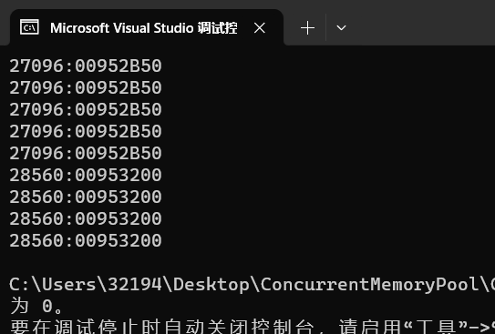

由此可见，两个线程的 ThreadCache 是相互独立的。

# CentralCache

## 框架

当 ThreadCache 中某个 SizeClass 对应的自由链表为空时，这意味着它上面的 Object 都被分配出去了。为了方便 ThreadCache 直接通过 SizeClass（下标）从 CentralCache 中获取自由链表，CentralCache 采取了相同的 SizeClass 映射。


值得强调的是，CentralCache 和 ThreadCache 不同，它被所有线程共享，是共享资源，因此每个线程在向 CentralCache 申请内存时，都需要持有互斥锁才能访问。得益于哈希桶的结构，只要对某一下标对应的哈希桶加锁即可用最低代价解决并发安全问题。如果对整个 CentralCache 加锁，那么效率将会很低，ThreadCache 的工作也前功尽弃了。

其次，CentralCache 中每个 SizeClass 位置上的链表不是像 ThreadCache 那样的由 Object 组成的自由链表，而是一个双向链表，每一个结点都挂着一个 SizeClass 规格的自由链表，结点叫做 Span（中文：跨度）。

更具体地说，Span 也挂着自由链表，**但这些链表管理的内存块是按页（4KB）分配的，因此在物理内存中是连续的**，这意味着若干空闲的 Span 只要是相邻的，就可以合并（而在 ThreadCache 中，自由链表的 Object 内存块在物理内存中不一定是连续的）。

## 设计 Span 类

（回想上图中 Span 的位置）Span 作为双向链表（哈希桶）的结点，它首先要有两个指针`_prev`和`_next`。其次 Span 挂的是自由链表，它上面又有若干个 Object，用于分配给 ThreadCache，所以需要有个计数器`__usedCount`和自由链表的起始地址`_objectsList`。

最后，Span 的规模取决于 SizeClass，都以页为单位，为了后续判断 Span 是否在物理上是相邻的，在 PageHeap 分配 Span 时就给它一个页号`_pageId`，作为 Span 的唯一标记，它的值等于物理地址除以 2^13。

Span 中的 Object 数量可能会被分配或者合并，所以 Span 管理的数量是动态变化的，用一个变量保存。值得注意的是，它并不记录着 Span 中 Object 的数量，而是记录页数。原因是内存分配按页为单位进行，一个 Span 包含了一组连续的内存页。通过跟踪页的数量，可以更好地管理内存的连续性。

首先要解决的是用多大的变量存储页号。如果规定一个页的大小是 8KB（2\^13Bytes），那么页号的值就是 Span 中链表的起始物理地址除以 2^13 后的值。地址以 Byte 为单位，页号以页为单位，后者同样可以标识页的位置。

在 32 位和 64 位下的进程地址空间大小是不同的，后者的地址无法直接用一个`unsigned int`存储 [0,2^51]，需要用 64 位保存。使用条件编译以支持在 32/64 位下使用合适的变量存储页号。

```cpp
// Common.h
#ifdef _WIN64
	typedef unsigned long long PAGE_ID;
#elif _WIN32
	typedef unsigned int PAGE_ID;
#else
	// Linux
#endif
```

值得注意的是，32 位平台中只有_WIN32 有定义，64 位平台两者都有，所以应该先判断、_WIN64。

下面是 Span 的设计：

```cpp
//Common.h
// Span：双向链表的结点，管理一个以页为单位的自由链表 (Objets)
struct Span
{
	PAGE_ID _pageId = 0; // 页号，描述 Span 的起始位置
	size_t _nPage = 0; // Span 中的页数

	Span* _prev = nullptr; // 前后结点指针
	Span* _next = nullptr;
	void* _objectsList = nullptr; // 指向由未被分配的 Object 组成的链表

	size_t _objSize= 0; // Span 中 Object 的大小
	size_t _usedCount = 0; // 记录分配给 ThreadCache 的 Object 个数
};
```

和下面的各个部分的设计一样，这是一个符合目前需求的框架，后面会根据流程的进展按需完善。

注意（这和 Span 的合并相关）：一个 Span 由若干 Page 组成，把第一个 Page 的地址作为 Span 的地址，再除以 2^13 作为页号。

## 设计 SpanList 类

CentralCache 的核心成员是一个元素类型为 SpanList 的哈希桶数组 _spanLists。这些哈希桶对应着不同的 SizeClass，即不同大小的内存块。双向链表方便在 Span 不再需要时将其归还给 PageHeap。

下面是**带头**循环链表的实现：

```cpp
// SpanList：双向链表，管理若干相同规格的 Span
class SpanList
{
public:
	SpanList()
	{
		_head = new Span;
		_head->_next = _head;
		_head->_prev = _head;
	}
	Span* Begin()
	{
		return _head->_next;
	}
	Span* End()
	{
		return _head;
	}
	bool Empty()
	{
		return _head == _head->_next;
	}
	void Insert(Span* pos, Span* newSpan)
	{
		assert(pos);
		assert(newSpan);

		Span* prev = pos->_prev;

		prev->_next = newSpan;
		newSpan->_prev = prev;

		newSpan->_next = pos;
		pos->_prev = newSpan;
	}
	void Erase(Span* pos)
	{
		assert(pos);
		assert(pos != _head); // 不能删除哨兵位的头结点

		Span* prev = pos->_prev;
		Span* next = pos->_next;

		prev->_next = next;
		next->_prev = prev;
	}
	~SpanList() {}
private:
	Span* _head;
public:
	std::mutex _mtx; // 桶锁
};
```

注意访问 SpanList 时需要申请锁。CentralCache 作为一个缓冲层，它只是一个内存的“搬运工”，所以删除 SpanList 的 Span（自由链表），只是将它从 SpanList 摘出来，而不是将内存释放掉。在将 SpanList 中的所有 Span 都被回收后，需要将哨兵位头结点 Span 的内存也释放掉。

如果你发现了诸如下面的警告，不要担心，因为你调用 unlock 的地方编译器不知道你什么时候上锁了（在同一个作用域中成对出现，编译器认为这是安全的）。参阅：[调用函数 std::_Mutex_base::unlock 之前未能保持锁的调用方](https://cloud.tencent.com/developer/ask/sof/108816722)。只要你能保证加锁和解锁在流程中是成对出现的就可以通过编译。这是一个示例：


## 设计 CentralCache 类

首先为了方便用字节转换的索引值在 ThreadCache 和 CentralCache 中申请内存，CentralCache 采用了相同的 SizeClass 映射。

其次 CentralCache 作为一个被全局共享的资源，它的对象实例只会被创建一次。所以可以将其设置为单例模式，这里为了方便，使用饿汉模式：

- 将构造函数私有
- 将构造函数删除，防止拷贝
- 将单例对象作为一个静态成员变量放在类中，它会在程序启动时自动创建。

> 在实践中应该尽量避免使用全局变量，当多个部分的代码需要访问同一个对象时，单例模式可以确保它们都访问的是同一个实例。而且当对象很大时，单例模式可以保证只创建一次对象，节省资源。

```cpp
// CentralCache.h
class CentralCache
{
public:
	// 获取对象地址
	static CentralCache* GetInstance() 
	{
		return &_sInst;
	}
	// ThreadCache 从 CentralCache 申请一段范围的 Object
	size_t FetchRangeObj(void*& start, void*& end, size_t n, size_t bytes);
	// 获取一个非空的 Span
	Span* GetOneSpan(SpanList& spanList, size_t bytes);
	// ThreadCache 释放若干 Object 到 CentralCache 的某个 Span 中
	void ReleaseListToSpans(void* start, size_t bytes);
private:
	SpanList _spanLists[NUM_CLASSES];
private: // 单例模式
	CentralCache() {}
	CentralCache(const CentralCache&) = delete;
	static CentralCache _sInst; // 创建对象
};
```

在 C++中，静态成员属于类而不属于任意实例，规定静态对象在类外定义。所以在`ThreadCache.cpp`中要创建一个全局静态对象。

```cpp
// ThreadCache.cpp
CentralCache CentralCache::_sInst;
```

### 慢开始反馈调节

ThreadCache 向 CentralCache 申请内存 SizeClass 规格的 Object 时，中采用了类似 TCP 慢启动（Slow Start）的算法来管理 ThreadCache 向 CentralCache 的对象请求。这种机制主要用于动态调整每次分配的对象数量，以优化内存使用和减少对 CentralCache 的访问频率。

**初始**时，这个数量可能相对较小。随着应用程序的运行，如果 ThreadCache 发现它经常耗尽其缓存的对象，它会逐渐增加从 CentralCache 请求的对象数量。这有助于减少频繁的内存请求，从而提高效率。反之，如果 ThreadCache 发现它不经常用完其缓存的对象，它可能会减少对 CentralCache 的请求量，以避免不必要地占用过多的内存资源。

本项目的做法是，将 ThreadCache 向 CentralCache 申请 Object 的个数限制在 [2, 512]。`num`是当 ThreadCache 为空时，最多需要向 CentralCache 申请对象的个数。

```cpp
class SizeClass
{
public:	
    // ...
    
	// 返回 ThreadCache 向 CentralCache 获取 Object 的个数
	// objSize：单个对象的大小
	static size_t NumMoveSize(size_t objSize)
	{
		assert(objSize);
		// ThreadCache（空）最多能获取的对象个数
		int num = TC_MAX_BYTES / objSize;

		if (num < 2) // 对象大，分少一点
		{
			num = 2;
		}
		else if (num > 512) // 对象小，分多一点
		{
			num = 512;
		}
		return num;
	}
};
```

但是这个做法很局限也比较极端，例如对象很小时，num 取 512 也是很多的。为了使得 num 在申请小对象时也尽量不要那么大，在自由链表`FreeList`中增加一个计数器`_maxSize`（初始值 1），表示 ThreadCache 中的自由链表的最大对象数。它将随着新加入的 Object 数量递增。

```cpp
class FreeList
{
public:
	// ...
	size_t& MaxSize()
	{
		return _maxSize;
	}
public:
    // ...
	size_t _maxSize = 1; // Object 的最大个数
};
```

返回引用的原因是后面在向 CentralCache 申请新 Object 时需要更新`_maxSize`。

当 ThreadCache 首次向 CentralCache 申请 Object 时，只能申请到一个。下一次是`_maxSize+1`，是 2 个。.. 这是一个线性增长的过程，每次只增加一个，是“慢增长”的部分。如果感觉太慢了，可以每次多加几个。

直到`_maxSize`的值达到`num`后，需要申请的对象个数再换成`num`。慢增长的逻辑可以用`min(_maxSize,NumMoveSize(size))`控制，在`_maxSize`没有到达`NumMoveSize(size)`之前，表达式的值一直是`_maxSize`。

### CentralCache::FetchRangeObj

`CentralCache::FetchRangeObj()`用于 CentralCache 在 SizeClass 对应的 Span 中取出若干 Object 对象给 ThreadCache。逻辑如下：

首先返回值根据 ThreadCache 的需要得有两个，一是实际给了多少个对象（因为 ThreadCache 需要判断是否申请了足够数量的 Objects）；二是对象的起始和终止地址，这可以用输出型参数实现。

CentralCache 在分配 Object 之前，需要用 ThreadCache 所需的字节数`bytes`来计算哈希桶的下标`index`，通过`GetOneSpan()`从桶里取出一个非空的 Span，将它的首尾地址返回。

访问桶之前需要加锁。`GetOneSpan()`和 PageHeap 的逻辑相关，将在后面实现。

```cpp
// CentralCache.cpp

// ThreadCache 从 CentralCache 申请若干 Object
// start/end：对象范围	n: Object 的个数
// bytes: 所需内存的字节数
size_t CentralCache::FetchRangeObj(void*& start, void*& end, size_t n, size_t bytes)
{
	size_t index = SizeClass::Index(bytes); // 哈希桶下标
	_spanLists[index]._mtx.lock(); // 加桶锁

	// 在哈希桶中取一个非空的 Span
	Span* span = GetOneSpan(_spanLists[index], bytes);
	assert(span && span->_objectsList); // Span 及自由链表不为空

	// 在 Span 中取出 n 个 Object
	// 如果不够取，则取整个 Span 中的 Object
	start = end = span->_objectsList; // 输出型参数
	size_t actualNum = 1;
	while (NextObj(end) && n - 1)
	{
		end = NextObj(end); // 链表迭代
		n--;
		actualNum++;
	}
	// 将剩下的 Object 拼接回去
	span->_objectsList = NextObj(end);
	// 将分配出去的最后一个 Object 指向空
	NextObj(end) = nullptr;
	// 更新这个 Span 的 Object 被分配数
	span->_usedCount += actualNum;

	_spanLists[index]._mtx.unlock(); // 解桶锁
	return actualNum;
}
```

值得注意的是链表迭代的逻辑。正常情况下需要多少个 end 指针就要往后走多少步，但是取出来的子链需要被 ThreadCache 使用，所以子链的最后一个 Object 的 next 指针需要置空，因此 end 只需要走 n-1 步即可。

并且如果 Span 的中没有 n 个 Object，那就全部都取出。在这个情况下让循环停下来的条件是`NextObj(end)==nullptr`。

### ThreadCache::FetchFromCentralCache

基于上面的讨论，可以将`ThreadCache::FetchFromCentralCache()`补充，用于 ThreadCache 向 CentralCache 申请 Object。逻辑如下：

首先用慢开始反馈调节，限制 ThreadCache 一次性不能申请过多，数量用`batchNum`保存，每申请一次，只要还处于慢增长状态，那就将`batchNum+1`。

然后用两个指针`start`和`end`维护申请到的这段内存，如果这段内存只有一个 Object（`start==end`），那就直接返回；否则当有多个 Object 时，需要调用自由链表的`PushRange`接口，用于插入一段范围的 Object。

之所以 FetchFromCentralCache 函数要返回内存地址，是因为线程申请 ThreadCache 的某个 SizeClass 的 Object 没有了，ThreadCache 才会向 CentralCache 申请，因此返回的主体是线程。

首先实现自由链表的 PushRange()，对应地，实现 PopRange()。（画图会更好理解）

```cpp
class FreeList
{
public:
	// ...
    
	// 插入一段范围的 Object 到自由链表
	// start/end：地址范围	n: Object 个数
	void PushRange(void* start, void* end, size_t n)
	{
		assert(start);
		assert(end);

		// 头插
		NextObj(end) = _freeList_ptr;
		_freeList_ptr = start;
		_size += n;
	}
	// 从自由链表获取一段范围的 Object
	// start/end：输出型参数
	void PopRange(void*& start, void*& end, size_t n)
	{
		assert(n <= _size);
        
		// 头删
		start = _freeList_ptr;
		end = start;
		for (size_t i = 0; i < n - 1; i++)
		{
			end = NextObj(end);
		}
		_freeList_ptr = NextObj(end);
		NextObj(end) = nullptr;
		_size -= n;
	}
	// ...
};
```

`ThreadCache::FetchFromCentralCache()`的实现：

```cpp
// ThreadCache.cpp

// ThreadCache 从 CentralCache 中获取 Object
// index: 哈希桶索引		bytes: 所需内存字节数
void* ThreadCache::FetchFromCentralCache(size_t index, size_t bytes)
{
	// 慢开始反馈调节
	size_t batchNum = min(SizeClass::NumMoveSize(bytes), _freeLists[index].MaxSize());
	// 在未到 NumMoveSize(bytes) 之前，batchNum 线性增长
	if (batchNum == _freeLists[index].MaxSize())
	{
		_freeLists[index].MaxSize() += 1; // 线性增长
	}
	// 从 CentralCache 中获取 Object
	void* start = nullptr;
	void* end = nullptr;
	size_t actualNum = CentralCache::GetInstance()->FetchRangeObj(start, end, batchNum, bytes);
	assert(actualNum >= 1); // 保证至少获取一个 Object

	if (actualNum == 1) // 只有一个直接返回给线程
	{
		assert(start == end);
		return start;
	}
	else 
	{
		// 将剩下的 Objects 插入到 ThreadCache 的桶中
		_freeLists[index].PushRange(NextObj(start), end, actualNum - 1);
		return start; // 将第一个 Object 返回给线程
	}
}
```

值得强调的是，`ThreadCache::FetchFromCentralCache()`返回的是一个 Object 的地址，它最终会通过线程调用`ThreadCache::Allocate()`得到。新申请的 Object 除了这一个分配出去的之外，添加到 ThreadCache 的 SizeClass 规格的自由链表中。

# PageHeap

## 框架


PageHeap 的结构和 CentralCache 类似，同样用双链表组织 Span。不同的是 PageHeap 哈希桶的下标按 Span 的页号映射。第 x 号桶挂的都是 x 页 Span。在 TCmalloc 中，对于不大于 256KB 内存申请的情况，页号到 Span 的映射有 128 个，128 个 Page 可以被切成 128*8KB/256KB=4 个 256KB 的对象，这个经验值可以满足大多数情况。为了方便映射，弃用下标为 0 的位置。

```cpp
// PageHeap 中哈希桶的个数
static const size_t PH_MAX_PAGES = 129;
```

需要强调的是，在 TCMalloc 中一个 Page 等于两个系统分配的 page（4KB）。虽然 PageHeap 以页（page）为单位向操作系统申请内存，但是它管理内存的基本单位为 Span（跨度），Span 中的 Page 是连续的。


## 设计 PageHeap 类

PageHeap 类的设计和 PageHeap 类似。PageHeap 作为 CentralCache 的内存“供应商”，可能会出现 CentralCache 的多个桶都没有 Span，向 PageHeap 申请多个 SizeClass 的 Span 的情况。

需要说明的是，当 PageHeap 发现自己没有 CentralCache 需要规格的 Span 时，会向后查找，将更大的 Span 切分成符合要求的给它，然后将剩下的 Span 挂到对应的 SpanList 上。如果正在做切分、挂接操作时 CentralCache 正好来取内存，那么会引发线程安全问题。

因此单单加桶锁显然不足以解决这个问题，只能给整个哈希表加锁了。CentralCache 使用桶锁的原因是能够保证线程只访问一个确定的桶，而 PageHeap 需要实现 Span 的切割和合并，因而无法保证。

此外，PageHeap 在程序运行起来也只需要实例化一次，所以设置为单例模式。

```cpp
class PageHeap
{
public:
	static PageHeap* GetInstance()
	{
		return &_sInst;
	}
	// 获取一个 k 页的 span
	Span* NewSpan(size_t k);
	// 返回从 Object 到 Span 的映射
	Span* MapObjectToSpan(void* obj);
	// PageHeap 回收空闲的 Span，并合并相邻的 Span
	void ReleaseSpanToPageHeap(Span* span);
public:
	std::mutex _pageMtx;
    private:
	SpanList _spanLists[PH_MAX_PAGES];

	PageHeap() {}
	PageHeap(const PageHeap&) = delete;

	static PageHeap _sInst;
};
```

这些成员函数将在稍后实现。

## CentralCache::GetOneSpan

现在有了 PageHeap 的哈希桶结构，就可以实现`CentralCache::GetOneSpan()`了。如果 CentralCache 的某个 SizeClass 对应的 SpanList 中没有 Span 了，那么就要从 PageHeap 获取一个 Span，在此之前要遍历它自己的哈希桶链表，这也是要实现 SpanList 迭代器的函数`begin/end`的原因。当遍历完所有的 Span，则说明 CentralCache 要向 PageHeap 申请内存块了。

而申请内存的大小需要根据对象的大小而定，因为 CentralCache 不会无缘无故向 PageHeap 申请，肯定是线程向 ThreadCache 申请，而 ThreadCache 和 CentralCache 都没有同一 SizeClass 规格的 Object 了。CentralCache 为了减少申请的次数，所以它一次性申请一个尽可能大的 Span（多个 Object）。

PageHeap 中的 Span 由若干 Page 组成，它眼里只有一个个 Page，而 CentralCache 的需求和线程申请的 Object 相关，所以 CentralCache 申请内存时需要将字节数转换为页数。逻辑如下：
首先字节数肯定是来源于 ThreadCache 的，**要保证 PageHeap 向 CentralCache 分配的内存一定不能小于 ThreadCache 一次向 CentralCache 申请的内存大小**，否则就还要继续申请了（浪费 CPU 资源），所以要计算出 ThreadCache 一次向 CentralCache 申请 Object 的最大个数；然后将个数乘以对象的字节数，再除以 2^13（Page：8KB），算出页数。

```cpp
class SizeClass
{
public:
    // ...
    
    // 返回 CentralCache 向 PageHeap 申请的页数
	// bytes: ThreadCache 向 CentralCache 申请 Object 的字节数
	static size_t NumMovePage(size_t objBytes)
	{
		size_t num = NumMoveSize(objBytes); // Object 个数
		size_t size = num * objBytes; // 一次性申请的最大字节数

		size_t nPage = size >> PAGE_SHIFT;
		if (nPage == 0)
		{
			nPage = 1; // 至少给 1 页
		}
		return nPage;
	}
};
```

现在已经求出了 CentralCache 一次向 PageHeap 申请的页数。下面就是根据页数找到可以取内存的哈希桶。如何切割 Span 呢？

Span 是由若干 Page 组成的双向链表，它们在物理上是连续的。那么页号的逆运算就是物理地址：用 Span 的起始页号乘以页大小得到起始地址；用 Span 的页数乘以页大小得到内存的跨度；用起始地址+跨度得到终止地址。


现在得到的是一块大内存 Span，它需要被切分成一个个由自由链表组织的 Object，这是一个构建链表的过程。构建链表的过程就是将 Span 中以 SizeClass 为单位划分，然后将每个单位的 next 指针指向下一个单位。具体做法是：

1. 用 start 和 end 指针划定 Span 的地址范围（上面已经求出了）。让 start 向后走 1 步，以供 tail 迭代。
2. 用 tail（初始位置是 start）表示已经被划分的内存尾部。
3. 通过不断迭代的方式，将 start 赋值给 tail 的 next 指针；然后 start 向后走 SizeClass 字节；这样就新建了一个 Object 挂到链表中了。
4. 更新 tail 的位置。
5. 重复 3 和 4 直到 start 走到 end 的位置。
6. 由于多个 Span 之间是连续的，所以划分好以后要将最后一个 Object 的 next 指针置空，表示它和后面的内存无关，防止越界。

> 一个内存块中的 FreeList 能够让一个 Span 中的 Object 在物理上是连续的。线程在使用连续内存时，可以提高 CPU 的高速缓存命中率。

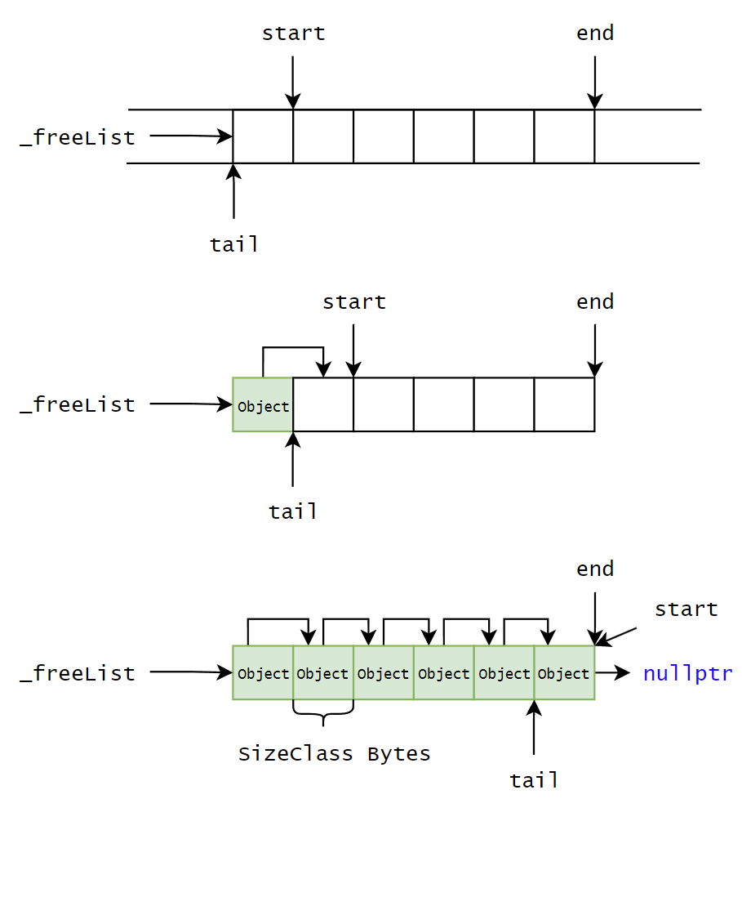

当把 Span 切割好以后，将 CentralCache 需要的那一块挂到对应 SizeClass 的 SpanList 上，选择头插到双向链表中的原因是方便 CentralCache 在寻找非空的 Span 时能够直接取出，避免遍历。在 SpanList 中增加头插（对应地增加头删）的逻辑。

```cpp
class SpanList
{
public:
    
	void PushFront(Span* span)
	{
		Insert(Begin(), span);
	}
	Span* PopFront()
	{
		Span* front = _head->_next;
		Erase(front);
		return front;
	}
};
```

```cpp
// 获取一个非空的 Span
// spanList: CentralCache 的某个哈希桶		bytes: Object 的字节数
Span* CentralCache::GetOneSpan(SpanList& spanList, size_t objBytes)
{
	// 尝试寻找一个非空的 Span
	Span* it = spanList.Begin();
	while (it != spanList.End())
	{
		if (it->_objectsList != nullptr)
		{
			return it;
		}
		else
		{
			it = it->_next;
		}
	}
	// spanList 是空的，向 PageHeap 申请（单位是页）
	Span* span = PageHeap::GetInstance()->NewSpan(SizeClass::NumMovePage(objBytes));
	// Span 的起始/终止地址和跨度
	char* start = (char*)(span->_pageId << PAGE_SHIFT); // 注意类型转换
	char* end = (char*)(start + (span->_n << PAGE_SHIFT));

	// 将 Span 切割成若干 Object
	// 1. 将内存挂到 FreeList 上
	span->_objectsList = start;
	// 2. 切分 Span 为多个 Object（单位是 objBytes)
	// 让 start 向后走一步以迭代
	void* tail = start;
	start += objBytes;

	// 在 [start, end] 中构建 FreeList
	while (start < end)
	{
		NextObj(tail) = start;
		tail = NextObj(tail);
		start += objBytes;
	}
	// 3. 将最后一个 Object 的 next 指针置空
	NextObj(tail) = nullptr;
	// 将划分好的 Span 挂到 CentralCache 的 SpanList 上
	spanList.PushFront(span);

	return span;
}
```

CentralCache::GetOneSpan() 用于从 CentralCache 获取一个非空的 Span，它被 CentralCache::FetchRangeObj() 调用（已经实现），所以要返回 Span 的地址，以供取出一定数量的 Object。

值得注意的是，页号 PageId 原本是通过地址除以 2\^13 得到的，指针的值是一个无符号整数，但是页号乘以 2^13 后仍然是一个无符号整数，所以要强转成 char*，才能访问这个地址中的内存。

## PageHeap::NewSpan

当 CentralCache 的某个 SizeClass 的桶中没有 Span 后，需要调用 PageHeap::NewSpan()，从 PageHeap 中获取一个新的 Span 挂到自己的 SpanLists 上， 然后再给 ThreadCache。

其中`PageHeap::NewSpan()`用于 PageHeap 自己取出一个 k 页的 Span 给 CentralCache，k 页可以直接对应 PageHeap 的 k 号桶。而 PageHeap 也要找一个空闲的 Span 才能给，如果没有的话不是直接向系统申请内存，而是向后顺延，尝试找到一个更多页的 Span，切割成 CentralCache 需要的尺寸（页数），然后将剩下的内存挂到自己对应的桶上。如果 PageHeap 发现所有桶都没有 Span，那么它需要调用 SystemAlloc 函数向系统申请。

注意，PageHeap 以页为单位管理内存，而操作系统返回的是内存的起始地址，所以要将地址除以 2^13，转换为页号。

```cpp
// PageHeap.cpp

// PageHeap 取一个 k 页的 Span 给 CentralCache
Span* PageHeap::NewSpan(size_t k)
{
	assert(k > 0 && k < PH_MAX_PAGES); // 申请的有效页数

	// 大于 128 页
	if (k > PH_MAX_PAGES - 1)
	{
		void* ptr = SystemAlloc(k); // 向系统申请，得到地址
		Span* kSpan = new Span;
		kSpan->_pageId = (PAGE_ID)ptr >> PAGE_SHIFT; // 将地址转换为页号
		kSpan->_nPage = k;

		return kSpan;
	}
	// 首先看自己有没有空闲的 k 页 Span
	if (!_spanLists[k].Empty()) 
	{
		Span* kSpan = _spanLists[k].PopFront();
		return kSpan;
	}
	else // 没有 k 页 Span，从 k+1 号桶往后找 n 页 Span 切分
	{
		for (int i = k + 1; i < PH_MAX_PAGES; i++)
		{
			if (!_spanLists[i].Empty())
			{
				Span* nSpan = _spanLists[i].PopFront();
				Span* kSpan = new Span;

				// 将 n 页 Span 的前 k 页切下来，并两者的更新页号和页数
				kSpan->_pageId = nSpan->_pageId;
				kSpan->_nPage = k;

				nSpan->_pageId += k;
				nSpan->_nPage -= k;
				//将剩下的 n-k 页挂到桶中
				_spanLists[nSpan->_nPage].PushFront(nSpan);

				return kSpan;
			}
		}
	}
	// 走到这里说明一个大于 k 页的 Span 都没有
	// 向系统申请一个 128 页的 Span
	void* ptr = SystemAlloc(PH_MAX_PAGES - 1);
	Span* newSpan = new Span; // 用一个新 Span 管理新内存

	// 更新页号和页数
	newSpan->_pageId = (PAGE_ID)ptr >> PAGE_SHIFT;
	newSpan->_nPage = PH_MAX_PAGES - 1;
	// 将新 Span 挂到 128 号桶上
	_spanLists[newSpan->_nPage].PushFront(newSpan);

	// 递归调用，返回 k 页 Span
	return NewSpan(k);
}
```

其他逻辑都比较简单，这里用了一个巧妙的递归，解决了两种情况：

- 初始情况：PageHeap 中什么都没有，一定会走到最后向系统申请 128 页的逻辑，如果 k 不恰好等于 128 的话，递归后会将这个 128 页的 Span 划分为 k 页返回，剩下的挂到 128-k 的桶上。
- 其他情况：只要 k 桶是空的，那么要切分更大的 n 桶。

> 递归可以用另外的逻辑代替，但是这里权衡递归的成本和代码复用的收益后，后者更加重要，因为递归最多一层。

## PageHeap 的锁问题

### CentralCache 向 PageHeap 申请 Span 加 Page 锁

在设计 PageHeap 类的最后讨论了：由于分割和合并 Span 的需要，只用桶锁对代码实现的要求很高，而通过 CentralCache 在向 PageHeap 申请内存时对一整个 PageHeap 加锁，保证并发安全问题。TCMalloc 在 CentralCache 向 PageHeap 申请内存的前后加锁。


### CentralCache 向 PageHeap 申请 Span 解桶锁

当 CentralCache 已经到了要向 PageHeap 申请 Span 的地步时，桶内已经没有 Span 了。而 CentralCache 是持有锁才能访问这个桶的，这可以保证在并发情况下多个线程取出 Object 不出现错误。

然而 ThreadCache 也需要释放一部分 Object 到 CentralCache 中，因此在 CentralCache 向 PageHeap 申请 Span 之前（这意味着代码跳到其他地方），把桶锁解开，这样当其他 ThreadCache 想归还 Object 给 CentralCache 的这个桶时就不会被阻塞了。

当 CentralCache 访问完 PageHeap（申请 Span）后，不应该立即加上桶锁，因为 CentralCache 拿到新申请的 Span 后，还要对它进行切分。这个划分过程只涉及该线程本地的操作，不需要加锁。所以加桶锁的逻辑应该放在“挂到桶上”之前。


注意将 Span 挂到桶上是访问桶的操作，所以要加锁，保证原子性。

> 加解锁的位置不要想当然，要从资源竞争的角度理解（想象一个线程在访问临界资源的时候其他线程有没有可能访问，是读还是写，会不会影响线程的行为）。
>
> 加锁意味着要访问临界资源；解锁意味着从访问资源出来。脑海里可以有一个流程。

# 内存申请测试

现在 ThreadCache、CentralCache 和 PageHeap 的申请流程已经完善，下面用单线程进行内存申请流程的测试。

## 测试一

```cpp
void AlignTest() // 测试对齐
{
	void* ptr1 = ConcurrentAlloc(6);
	void* ptr2 = ConcurrentAlloc(8);
	void* ptr3 = ConcurrentAlloc(10);

	std::cout << ptr1 << std::endl;
	std::cout << ptr2 << std::endl;
	std::cout << ptr3 << std::endl;
}
```

在这个函数的位置打一个断点，然后 F5 运行。F11 可以执行每一句，当运行到函数时，按它可以进入函数；F10 不进入函数；在函数内部如果想跳出它，可以按 Shift+F11。这几个快捷键也有按钮对应，多十试几次就会了：


监视窗口不只可以添加变量名，还可以添加表达式，例如调用一个函数，对指针解引用，查看变量的地址等。

断点之间也可以跳跃，如果了解了函数间的调用关系，可以在想要停下来的函数前打断点，Shift+F11 可以跳转或返回。如果在循环里出不来，也可以手动执行到某一位置停下来，我觉得这个也很好用。


通过监视窗口（调试->窗口->监视）看到变量值的变化（也可鼠标悬停）。这是第一条语句（申请 6 字节）的执行流程（希望大家看到名称就能想像它在哪一层，其实就是供应商供货到超市，还是比较好懂的）：

```text
1. 由于申请的 bytes=6 小于 256KB，所以由 ThreadCache::Allocate(bytes) 分配
  2. 通过 bytes 算出对齐数 alignSize=8 和桶索引 index=0，但是 index 位置的桶是空的，进入 FetchFromCentralCache(index, alignSize) 从 CentralCache 获取
    3. 慢开始反馈调节：batchNum=1（一次从 Span 取出多少个 Object），_maxSize(+1)=2。进入 CentralCache::FetchRangeObj(start, end, batchNum, bytes)，拿出一段 Objects 给 ThreadCache
      4. 通过 bytes 求出 index，进入 CentralCache::GetOneSpan(_spanLists[index], bytes)，从对应的桶中取一个 Span。但是初始情况它是空的，所以要向 PageHeap 申请，申请肯定不能只申请 8Bytes，至少是 1 个 Page。
        5. 通过 bytes 算出 CentralCache 向 PageHeap 申请的页数 k=1，进入 PageHeap::NewSpan(k)
          6. 初始情况 PageHeap 是空的，所以会调用 SystemAlloc(PH_MAX_PAGES - 1) 给最大桶向系统申请 128 个 Page。这块新内存被挂到 128 号桶，然后递归调用自己：将 128 页切分成 k=1 页和 128-k=127 页，将 k=1 页的 Span 返回给 CentralCache，将剩下的挂到 127 号桶上
-----------------------------------------------------------------------------
      return 4. 返回 CentralCache::GetOneSpan()，将获取到的 k=1 页 Span 以 bytes 为单位构建自由链表，这样 Span 就由若干 8Bytes 的 Object 组成，然后返回链表的起始地址
    return 3. 返回 CentralCache::FetchRangeObj()。现在 index 桶上有了 Span，足够取出 batchNum=1 个 Object，将剩下的拼接回 Span 上
  return 2. 返回 ThreadCache::FetchFromCentralCache()，将一个大小为 alignSize 的 Object 的地址返回给线程
return 1. 线程通过地址使用申请到的内存
```

通过这个流程，可以体会到将 CentralCache 和 PageHeap 设置为单例模式的作用。例如 ThreadCache 通过 CentralCache 开放的接口（FetchRangeObj）来申请一些 Object；CentralCache 通过 PageHeap 开放的接口（NewSpan）来向系统申请一个新 Span。这就好像银行虽然在那里，但是有的事不用银行主动帮你干，而是它已经设计好处理事件的逻辑，你去自助机器上操作。


可以看到，申请 6 字节的对齐数是 8 字节，对应的哈希桶下标是 0，来自系统新的 Span 和 ThreadCache 获得的内存的地址是相同的。

也可以看到自由链表构建的情况：每前 4 个字节的存的是下一个 Object 的地址：


在这个 SizeClass 为 8 的自由链表中，它们的地址都是连续的。这是使用页号和地址相互转换的保障。

剩下两条语句的执行流程类似，只是由于前面的申请，CentralCache 和 PageHeap 里都有内存了。

## 测试二

我们知道在初始情况 PageHeap 向系统申请了 8KB 的内存，下面测试单线程在申请 8KB 内存后，再申请 8Bytes，看看 PageHeap 会不会再申请向系统申请一个 Span。

```cpp
void AlignTest2()
{
	for (int i = 0; i < 1024; i++)
	{
		void* ptr = ConcurrentAlloc(8);
		std::cout << ptr << std::endl;
	}
	void* ptr = ConcurrentAlloc(8); // 在这里打断点
	std::cout << ptr << std::endl;
}
```

当在 CentralCache::FetchRangeObj() 中分配空间后，可以看到 PageHeap 确实向系统申请了内存，然后分给了 CentralCache，因为是头插，所以新 Span 的 next 是老 Span。


老 Span 就是第一次申请的 8KB，全部被循环申请了，其中 46 是慢开始反馈调节得到的 batchNum（一次从 CentralCache 中获取多少个 Object）。这可以通过打印 batchNum 得知。

> 注意慢开始反馈调节使用了`min()`，如果使用`std::min()`，将会调用`<algorithm>`的函数模板；但是`<Windows.h`中也有一个`min`，如果右键->转到定义，你会知道它是一个宏：
>
> 
>
> 由于二者冲突而函数模板需要推演，所以编译器会优先选择更快的宏。所以不要用`std::min()`。

# 内存回收

## ThreadCache::Deallocate

线程使用后的对象被 ThreadCache 回收，而 ThreadCache 是线程私有的。当 ThreadCache 中积累了过多的对象时，需要将部分对象返回给 CentralCache，以便其他线程使用。

解决办法是限定自由链表的长度。这个长度被规定为：ThreadCache 一次性向 CentralCache 申请的 Object 的个数。

> 为什么不直接设置为一个固定值？

不同的应用程序和工作负载可能会有不同的内存使用模式，因此不同线程需要的 Object 个数不同。将 Object 最大个数与 ThreadCache 的申请行为相关联，可以确保自由链表的长度既不会太小也不会太大，从而优化内存使用。

另外，ThreadCache 和 CentralCache 之间的交互涉及同步操作，这可能是一个成本较高的过程，尤其是在多线程环境中。通过将自由链表的长度与 ThreadCache 的请求行为相匹配，可以减少线程之间为了内存分配而进行的同步次数，从而提高性能。

在 TCMalloc 的实现中，也考虑到了限制单个线程的内存上限，即 ThreadCache 整体占用的内存不能超过某个值。

```cpp
// 回收内存
void ThreadCache::Deallocate(void* ptr, size_t bytes)
{
	assert(ptr);
	assert(bytes <= TC_MAX_BYTES);

	size_t index = SizeClass::Index(bytes); // 定位到哈希桶
	_freeLists[index].Push(ptr); // 插入到桶中

	// 当自由链表长度大于等于一次向 CentralCache 申请的个数，再归还这部分
	if (_freeLists[index].Size() >= _freeLists[index].MaxSize())
	{
		ListTooLong(_freeLists[index], bytes);
	}
}

void ThreadCache::ListTooLong(FreeList& list, size_t bytes)
{
	void* start = nullptr;
	void* end = nullptr;

	list.PopRange(start, end, list.MaxSize());
	CentralCache::GetInstance()->ReleaseListToSpans(start, bytes);
}
```

补充链表 PopRange 接口，用于头删一段 Object。

```cpp
class FreeList
{
public:
	// 从自由链表获取一段范围的 Object
	// start/end：输出型参数
	void PopRange(void*& start, void*& end, size_t n)
	{
		assert(n <= _size);

		// 头删
		start = _freeList_ptr;
		end = start;
		for (size_t i = 0; i < n - 1; i++)
		{
			end = NextObj(end);
		}
		_freeList_ptr = NextObj(end);
		NextObj(end) = nullptr;
		_size -= n;
	}

	size_t Size()
	{
		return _size;
	}
public:
	void* _freeList_ptr = nullptr; // 自由链表的起始地址
	size_t _size = 0; // 自由链表的结点个数
};
```

注意，这里删除到倒数第一个 Object 时就要停下来，和之前取 Object 时一样，将最后一个 Object 的 next 指针置空。两个输出型参数用于返回给 CentralCache，只有拿到地址才能操作。

## CentralCache::ReleaseListToSpans

CentralCach 回收来自 ThreadCache 由若干 Object 组成的一段自由链表，它们的起始和终止地址由输出型参数 start 和 end 返回。CentralCache 遍历自由链表中的 Object，然后将它们 Push 到自己对应 SizeClass 的自由链表 Span 中，并将 Span 的`_usedCount--`，表示 ThreadCache 归还 Object。

如果一个 Span 的`_usedCount==0`，则说明 Span 中没有 Object 被使用，即所有都被归还，那么在可以将这个 Span 还给 PageHeap。

非常重要的一点：归还的 Objects 通过 bytes 可以得到它属于 CentralCache 中 index 对应的桶，还需要通过 Object 的地址除以 2^13，得到块号，找到对应的 Span 才能插入。这是因为 ThreadCache 在调用`ThreadCache::Deallocate()`的归还 Object 的个数和时机都是不确定的。

如果 ThreadCache 还了 n 个 Object，CentralCache 对应的 SpanList 上有 m 个 Span，那么插入之前需要一个个比对页号，时间复杂度是$O(nm)$。为此，可以尝试用哈希表在 CentralCache 调用 PageHeap::NewSpan() 分配 Span 时，建立 Span 中的**每个** Page 的页号和 Span 首地址之间的映射关系。


注意：这里不建立每个 Page 的地址和 Span 地址之间的映射关系，因为 PageHeap 按页管理 Span，页号对应哈希表，我们可以认为地址就相当于页号，这在之前是讨论过了的。

这样以后再要插入 Object 到 CentralCache 对应的 SpanList 上，只需要用 Object 的地址除以 2^13 得到的页号查询哈希表，就能直接找到 Span 的首地址，进行头插。

为 PageHeap 增加哈希表：

```cpp
std::unordered_map<PAGE_ID, Span*> _idSpanMap;
```

用一个函数作为地址和 Span 地址的转换：

```cpp
// 返回从 Object 地址到 Span 首地址的映射
Span* PageHeap::MapObjectToSpan(void* objAdr)
{
	PAGE_ID id = (PAGE_ID)objAdr >> PAGE_SHIFT; // 将地址转换为页号
	std::unordered_map<PAGE_ID, Span*>::iterator it = _idSpanMap.find(id); // 查表
	if (it != _idSpanMap.end())
	{
		return it->second;
	}
	else
	{
		assert(false); // 没有映射一定有错误
		return nullptr;	// 仅为通过编译，不会执行
	}
}
```

assert() 的参数为 false，它将生效，用于定位错误。

需要在 PageHeap::NewSpan() 的不同分支中增加映射的逻辑：


CentralCache 要将一段 FreeList 归还，那么首先要加桶锁。然后从 FreeList 的起始地址开始遍历，通过 PageHeap::MapObjectToSpan() 获得每一个 Object 的页号，通过页号查哈希表，得到 Span 的地址，然后将它头插到 Span 中。

这是遍历链表和加解桶锁的框架。start 指针和 bytes 两个参数能够划定内存的范围，使用 end 也可。

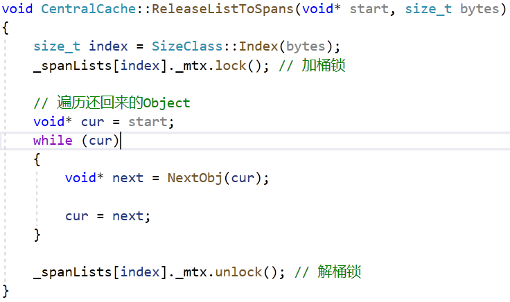

```cpp
// ThreadCache 释放若干 Object 到 CentralCache 的某个 Span 中
// start: ThreadCache 返回的一段内存的地址 bytes: 返回内存的字节数
void CentralCache::ReleaseListToSpans(void* start, size_t bytes)
{
	size_t index = SizeClass::Index(bytes);
	_spanLists[index]._mtx.lock(); // 加桶锁

	// 遍历还回来的 Object
	void* obj = start;
	while (obj)
	{
		void* next = NextObj(obj);
		// 通过 Object 首地址得到映射的 Span 的地址
		Span* span = PageHeap::GetInstance()->MapObjectToSpan(obj);
		// 将 Object 头插到 Span 上
		NextObj(obj) = span->_objectsList;
		span->_objectsList = obj;
		// 更新 Span 记录被分配 Object 的计数器
		span->_usedCount--;

		// 这个 Span 当初管理的所有 Object 都被还了回来
		if (span->_usedCount == 0)
		{
			// 将 Span 从 CentralCache 的哈希桶取出，并还原信息
			_spanLists[index].Erase(span);
			span->_prev = nullptr;
			span->_next = nullptr;
			span->_objectsList = nullptr;

			// 解 CentralCache 的桶锁
			_spanLists[index]._mtx.unlock();

			// 交给 PageHeap 管理
			PageHeap::GetInstance()->_pageMtx.lock(); // 加 PageHeap 大锁
			PageHeap::GetInstance()->ReleaseSpanToPageHeap(span);
			PageHeap::GetInstance()->_pageMtx.unlock(); // 解 PageHeap 大锁

			// 加 CentralCache 的桶锁
			_spanLists[index]._mtx.lock();
		}
		obj = next;
	}

	_spanLists[index]._mtx.unlock(); // 解桶锁
}
```

当`span->_usedCount == 0`时，说明这个 Span 中的所有 Object 都被归还，意味着这部分内存暂时没有被需要。将其返回给 PageHeap 可以使这部分内存重新整合，可能用于满足其他大小的内存请求。如果保留在 CentralCache 中，虽然对于相同大小的内存请求响应更快，但可能导致内存的不充分利用，特别是在内存需求动态变化的情况下。而且 CentralCache 主要用于处理频繁的、大小相对固定的内存请求。如果它还要负责保留大量不再使用的内存，可能会影响其处理效率和响应速度。

将 Span 还给 PageHeap 之前需要将它从 CentralCache 的桶中取出，这个过程需要持有桶锁，并且为了后续内存的安全使用，将 Span **作为结点的信息**清空，注意不要将页号和页数还原，因为这是 PageHeap 后续合并 Span 的依据。在对 PageHeap 访问的前后也需要加大锁。

## PageHeap::ReleaseSpanToPageHeap

随着 CentralCache 的不断申请，它的大多数桶都可以挂上 Span。但是有一种极端情况是 CentralCache 不断申请同一页数的 Span，或者剩下的 Span 总是被挂到同一个桶，这样就会导致有的桶很长，有的桶很短。而且由于切分的操作，大页面的 Span 注定不会太多，而小页面的 Span 会很多，因为切分的是离 k 页最近的 n 页，那么 n-k 就会比较小。我们知道 CentralCache 是从头遍历 SpanList 获取新 Span 的，这样会造成后面很多个小页面的 Span 不能被使用，是一个外部碎片问题。

为了保持 CentralCache 各个桶中 Span 的数量差距不要太大，PageHeap::ReleaseSpanToPageHeap() 专门由于回收 CentralCache 归还的 Span，并尝试将 Span 合并。因此我们可以将重点放在 Span 的合并上，只要合并后的 Span 超过了 128 页，那么就返回给操作系统。

还记得 PageHeap 在申请 Span 的时候吗？PageHeap 首先申请 128 页的 Span，然后做切割，那么合并后也要保证每个 Page 在地址上是连续的，所以 Span 的页号和页数在此发挥作用。从地址的分布上，一个 n 页的 Span 可以向前，也可以向后合并。

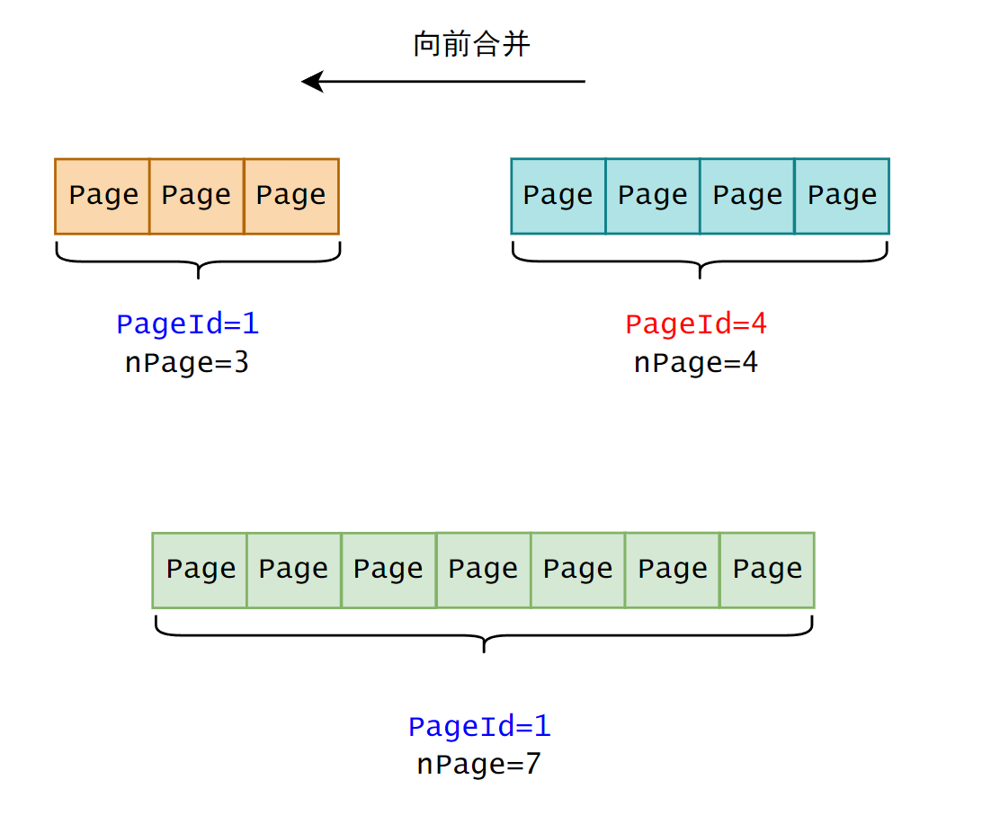

向前合并，就是将后面的 Span 加到前面，然后更新前面的页数。需要注意的是要保证地址是连续的，就是要判断**后面的页号是否等于前面的页号+页数**。例如图中前面的页号+页数是 4，刚好等于后面的页号 4，说明它们在被 PageHeap 切割时是连续的。向后合并也是一样的。可以在一个循环中不断合并，只要不符合相邻的条件就可以停止合并。

现在问题来了，`span->_usedCount == 0`的另一种情况是调用 PageHeap::NewSpan() 时新分配 Span 时，此时 Span 也是一个 Span 都没有被分配出去。为了让合并和切分的操作不冲突，用一个 bool 类型的变量`_isUsed`来标记 Span 是否已经被 CentralCache 使用，作为 Span 的成员。

```cpp
struct Span
{
    // ...
	bool _isUsed = false; // 标记 Span 是否正在被线程访问
};
```

在 CentralCache::GetOneSpan() 获取新 Span 后，立即将它改为 true，注意要在桶锁中进行。


还有一个问题，CentralCache 在调用 PageHeap::ReleaseSpanToPageHeap() 向两边合并 Span 时，PageHeap 可能会访问 CentralCache 这个桶的任何一个 Span，包括 CentralCache 还回来的，和 PageHeap 刚分配给 CentralCache 的。

因此，**为了方便合并**，在 PageHeap::NewSpan() 切分 n 页的 Span 时，不需要像分配出去的 k 页 Span 那样建立 Span 地址和其**所有** Page 页号之间的映射关系，**只需要建立`未被分配的 n-k 页 Span`的地址和其首尾 Page 页号之间的映射关系**。原因如下：

对于已经分配出去的页面，我们通常不需要再跟踪它们的具体位置，因为这部分内存已经在使用中。如果只记录未分配部分的首尾地址，合并操作会更简单和直接。


这个过程是可能的，因为它们在被 PageHeap 分配之前属于一个 Span，内存是连续的，那么只要 Span 之间是相邻的，那么 SpanA2 的头和 SpanA1 的尾是可以合并的。当原先被使用的 Page 被还回来时仍然会这么合并。

> 举个例子，现在有两个**相邻**的两个 Span：
>
> - Span A1：空闲页面 [1, 40]，映射关系：<1, A1>，<40, A1>
> - Span A2：空闲页面 [41, 60]，映射关系：<41, A2>，<60, A2>
>
> 现在，Span A1 的页面 [1, 30] 被分配出去，Span A2 的页面 [41, 50] 被分配出去。在以上策略下：
>
> - Span A1：空闲页面 [31, 40]
> - Span A2：空闲页面 [51, 60]
>
> 现在，如果有一个需要 20 页的内存请求，PageHeap 可以快速检查这些空闲 Span 并认识到 Span A1 的后半部分和 Span A2 的前半部分可以合并来满足这个请求。PageHeap 不需要检查每个单独的页面是否被分配；它只需要查看这些 Span 的空闲部分的记录。因此，它可以迅速定位到页面 [31, 40] 和页面 [51, 60] 可以合并成一个新的 Span，满足**连续** 20 页的需求。
>
> 如果我们必须跟踪每个 Span 的每一页，那么合并操作就需要检查每一页，确认哪些是空闲的，然后才能执行合并。这明显比只关注空闲部分的首尾地址更复杂，也更耗时。


了解了 PageHeap 分割分配和合并回收 Span 的流程后，可以理解哈希表在两者中发挥着不同的作用（见上图注释）。

说说页面合并的逻辑。首先是**边界问题**，PageHeap 只能合并那些相邻且被还回来的 Page（这通过`_isused`保证），如果某个 Page（地址除以 2^13）不在哈希表中有记录，那么说明从它开始往后的内存都没有被 PageHeap 分配。

只要判断页面是相邻的，那么可以一直合并下去（循环），注意合并后要及时更新页号和页数信息，**并且要将被合并的 Span 从它所在的桶中删除，并且释放 Span 的空间**（在上面是通过 new 来创建 Span 对象来管理 Object 的，这是一个稍后要解决的问题）。

合并为更大的 Span 后，要将它挂到 PageHeap 对应的桶上，因为它后续也可能会被合并，所以也要建立首尾页号和 Span 地址的映射关系。

除此之外，如果合并后的 Span 超过了 PageHeap 管理的最大 Span 规格（128 个 Page），那么就直接将它归还给操作系统，也要记得释放 Span 的空间。向前和向后合并的逻辑比较简单，而且是类似的。

首先补充向操作系统释放内存的函数：
```cpp
// Common.h

// 直接将内存还给堆
inline static void SystemFree(void* ptr)
{
#ifdef _WIN32
	VirtualFree(ptr, 0, MEM_RELEASE);
#else
	// Linux 下 sbrk unmmap 等
#endif
}
```

```cpp
// PageHeap 回收空闲的 Span，合并相邻的 Span
void PageHeap::ReleaseSpanToPageHeap(Span* span)
{
	// 大于 128 页还给系统并释放空间
	if (span->_nPage > PH_MAX_PAGES - 1) 
	{
		void* ptr = (void*)(span->_pageId << PAGE_SHIFT); // 页号转换为地址
		SystemFree(ptr);
		delete span;

		return;
	}
    // ...
}
```

注意向前或向后合并是以当前 Span 为基准的，所以向后合并不需要更新 Span 的页号，只需要更新它的页数。

在 PageHeap::NewSpan() 中增加哈希映射：


下面是 PageHeap::ReleaseSpanToPageHeap() 的实现，逻辑还是比较清晰的：

```cpp
// PageHeap 回收空闲的 Span，合并相邻的 Span
void PageHeap::ReleaseSpanToPageHeap(Span* span)
{
	// 大于 128 页还给系统并释放空间
	if (span->_nPage > PH_MAX_PAGES - 1) 
	{
		void* ptr = (void*)(span->_pageId << PAGE_SHIFT); // 页号转换为地址
		SystemFree(ptr);
		delete span;

		return;
	}
	
	// 向前合并
	while (true)
	{
		PAGE_ID preId  = span->_pageId - 1; // Span 左边的页号
		std::unordered_map<PAGE_ID, Span*>::iterator it = _idSpanMap.find(preId ); // 查表

		if (it == _idSpanMap.end()) // 前面没有相邻的 Span
		{
			break;
		}

		Span* preSpan = it->second;
		if (preSpan->_isUsed == true) // 正在被 CentralCache 使用
		{
			break;
		}

		if (preSpan->_nPage + span->_nPage > PH_MAX_PAGES - 1) // 合并后大于 128 页
		{
			break;
		}

		// 向前合并，更新信息
		span->_nPage += preSpan->_nPage;
		span->_pageId = preSpan->_pageId;

		// 从桶中删除 preSpan 并其释放空间
		_spanLists[preSpan->_nPage].Erase(preSpan);
		delete preSpan;
	}

	// 向后合并
	while (true)
	{
		PAGE_ID nextId = span->_pageId + span->_nPage; // Span 右边的页号
		std::unordered_map<PAGE_ID, Span*>::iterator it = _idSpanMap.find(nextId); // 查表

		if (it == _idSpanMap.end()) // 后面没有相邻的 Span
		{
			break;
		}

		Span* nextSpan = it->second;
		if (nextSpan->_isUsed == true) // 正在被 CentralCache 使用
		{
			break;
		}

		if (nextSpan->_nPage + span->_nPage > PH_MAX_PAGES - 1) // 合并后大于 128 页
		{
			break;
		}

		// 向后直接合并，只更新页数
		span->_nPage += nextSpan->_nPage;

		// 从桶中删除 nextSpan 并其释放空间
		_spanLists[nextSpan->_nPage].Erase(nextSpan);
		delete nextSpan;
	}

	// 将合并后的新 Span 挂到桶上，并标记为空闲
	_spanLists[span->_nPage].PushFront(span);
	span->_isUsed = false;

	// 建立新 Span 地址和首尾页号的映射关系，以方便它后续被合并
	_idSpanMap[span->_pageId] = span;
	_idSpanMap[span->_pageId + span->_nPage - 1] = span;
}
```

# 内存释放测试

## 测试一

对应地，下面用单线程测试释放内存的流程。首先实现 ConcurrentFree() 最基本的功能，这个函数稍后要完善，参数 bytes 可以在函数内求得，这里只是为了测试运行起来。

```cpp
// ConcurrentAlloc.h

static void ConcurrentFree(void* ptr, size_t bytes)
{
	assert(ptr);

	if (bytes > TC_MAX_BYTES) // 大于 256KB 的内存释放
	{
		// 归还给 PageHeap
	}
	//else
	{
		return TLSThreadCache_ptr->Deallocate(ptr, bytes);
	}
}
```

```cpp
void ConcurrentFreeTest()
{
	void* ptr1 = ConcurrentAlloc(6);
	void* ptr2 = ConcurrentAlloc(8);
	void* ptr3 = ConcurrentAlloc(10);
	void* ptr4 = ConcurrentAlloc(17);
	void* ptr5 = ConcurrentAlloc(20);

	ConcurrentFree(ptr1, 6);
	ConcurrentFree(ptr2, 8);
	ConcurrentFree(ptr3, 10);
	ConcurrentFree(ptr4, 17);
	ConcurrentFree(ptr5, 20);
}
```

如果你的测试用例不能走到 PageHeap 合并的逻辑，这是因为慢增长申请的内存大小不足以通过这个条件，可以多申请几次：


断点打在最后一个 free 函数，然后 F5 运行，可以用鼠标直接执行到这里：

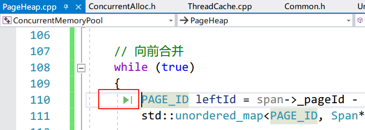

未合并的 Span：


Span 和 leftSpan：


可以看到 Span 和 leftSpan 都有一个 Page，但是因为 leftSpan 的`_isUsed==true`，所以没有被合并。未被合并的 rightSpan：


合并后：


可以看到 rightSpan 确实被合并到了 Span 上，页数也是对上了的。

## 测试二

下面来进行多线程测试：让两个线程分别执行各自的线程函数，在函数内批量申请和释放内存。

```cpp
void MultiThreadAlloc1()
{
	std::vector<void*> v;
	for (size_t i = 0; i < 7; ++i) // 申请 7 次，正好单个线程能走到 pc 回收 cc 中 span 的那一步
	{
		void* ptr = ConcurrentAlloc(6); // 申请的都是 8B 的块空间
		v.push_back(ptr);
	}

	for (auto e : v)
	{
		ConcurrentFree(e, 6);
	}
}

void MultiThreadAlloc2()
{
	std::vector<void*> v;
	for (size_t i = 0; i < 7; ++i)
	{
		void* ptr = ConcurrentAlloc(16); // 申请的都是 16B 的块空间
		v.push_back(ptr);
	}

	for (int i = 0; i < 7; ++i)
	{
		ConcurrentFree(v[i], 16);
	}
}

void TestMultiThread()
{
	std::thread t1(MultiThreadAlloc1);
	std::thread t2(MultiThreadAlloc2);

	t1.join();
	t2.join();
}
```

可以在刚才 PageHeap.cpp 的 110 行打断点，看到相同的流程：


# 项目完善

## 大内存的申请和释放

### 申请

在这个项目中我们只处理了小于 256KB 的内存申请逻辑，下面对其进行补充。

我们规定 PageHeap 的最大规格 Span 是 128 页，即 128*8B=1024KB=1MB。ThreadCache 的最大规格 Object 是 256KB（256KB/8B=32 页）。那么小于 256KB（32 页）的内存请求由 ThreadCache 负责；大于 256KB（32 页）且小于 1MB（128 页）的内存请求由 PageHeap 负责；大于 1MB（32 页）的内存请求交给操作系统。

和之前的申请逻辑一样，不能刚好只申请线程需要的那么多内存，留一些富余比较好快速地处理后续的内存申请；256KB 的内存申请不算小，所以很可能会由 PageHeap 代为申请，而 PageHeap 按页为单位（8KB）向操作系统申请内存，所以在之前实现的向上对齐函数`RoundUp()`中将大于 256KB 的内存按页（8KB）来对齐。

```cpp
// 获取向上对齐后的字节数
static inline size_t RoundUp(size_t bytes)
{
    // ...
    else if (bytes <= 256 * 1024)
    {
        return _RoundUp(bytes, 8 * 1024);
    }
    else // 大于 256KB 的按页 (8KB) 对齐
    {
        return _RoundUp(bytes, 1 << PAGE_SHIFT);
    }
}
```

例如 258KB 的内存等于 32 页（256KB）+8KB，这 1KB 不足一页算作一页，最终对齐到 33 页，向 PageHeap 申请 33*8KB=264KB，这多余的 6KB 就是内存碎片。

那么现在可以完善线程池的内存分配函数：

```cpp
// ConcurrentAlloc.h
static void* ConcurrentAlloc(size_t bytes)
{
	if (bytes > TC_MAX_BYTES) // 大于 256KB 的内存申请
	{
		size_t alignSize = SizeClass::RoundUp(bytes); // 按页对齐
		size_t k = alignSize >> PAGE_SHIFT; // 对齐后的页数

		PageHeap::GetInstance()->_pageMtx.lock(); // 访问 PageHeap 的 Span，加锁
		Span* span = PageHeap::GetInstance()->NewSpan(k); // 由 PageHeap 分配
		span->_objSize = bytes; // 统计大于 256KB 的页
		PageHeap::GetInstance()->_pageMtx.unlock(); // 解锁

		return (void*)(span->_pageId << PAGE_SHIFT); // 返回内存地址
	}
	else
    {
        // ...
    }
```

值得注意的是，内存是由线程调用线程池开放的接口 ConcurrentAlloc() 申请的，所以这个函数可以决定从哪里申请内存。超过 256KB 的内存不通过 ThreadCache 而直接访问 PageHeap。

### 释放

和申请对应：小于 256KB（32 页）的内存释放给 ThreadCache；大于 256KB（32 页）且小于 1MB（128 页）的内存释放给 PageHeap；大于 1MB（32 页）的内存释放给操作系统的堆区。和大内存的申请一样，也是直接还给 PageHeap。

那么现在可以完善线程池的内存回收函数：

```cpp
static void ConcurrentFree(void* ptr)
{
	assert(ptr);

	// 查表找到内存属于哪个 Span
	Span* span = PageHeap::GetInstance()->MapObjectToSpan(ptr);
	size_t size = span->_objSize; // Span 管理的字节数

	if (size > TC_MAX_BYTES) // 大于 256KB，直接还给 PageHeap
	{
		PageHeap::GetInstance()->_pageMtx.lock();
		PageHeap::GetInstance()->ReleaseSpanToPageHeap(span);
		PageHeap::GetInstance()->_pageMtx.unlock();
	}
	else // 小于 256KB，还给 ThreadCache
	{
		assert(TLSThreadCache_ptr);
		return TLSThreadCache_ptr->Deallocate(ptr, size);
	}
}
```

两个测试用例，可以注释掉另外一个测试，这里我先测试申请 129 页的：

```cpp
 //大内存申请和释放测试
void BigAllocTest()
{
	// 找 PageHeap 申请
	void* ptr1 = ConcurrentAlloc(257 * 1024); // 257KB
	ConcurrentFree(ptr1);

	// 找堆申请
	void* ptr2 = ConcurrentAlloc(129 * 8 * 1024); // 129 页
	ConcurrentFree(ptr2);
}
```

申请调用 PageHeap::NewSpan()，走的是大于 128 页的逻辑：

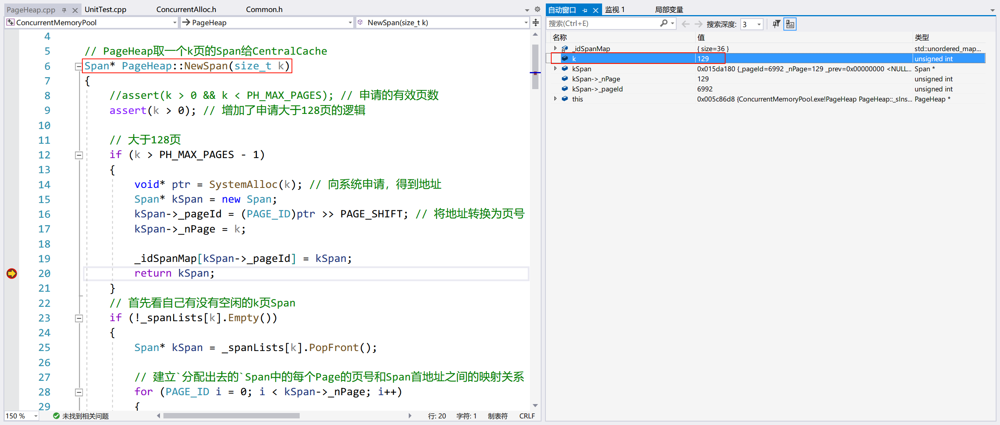

释放调用 PageHeap::ReleaseSpanToPageHeap()，走的也是大于 128 页的逻辑：

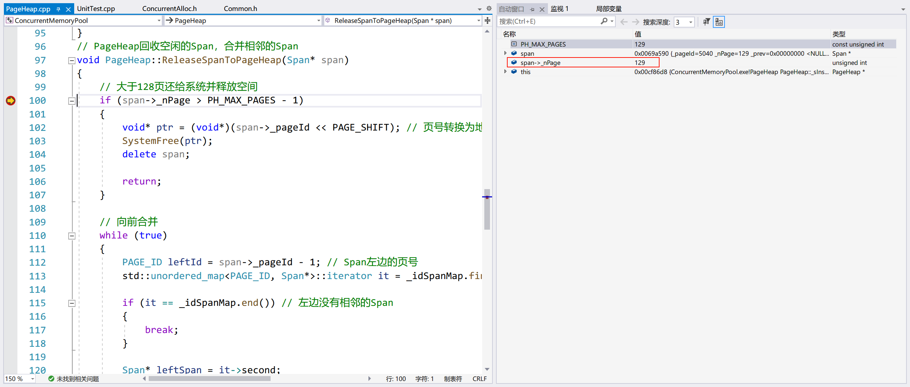

注：这里本来申请的 KSpan 的地址和释放的 Span 地址是相同的，因为 Visual Studio 调试老是崩（烦，可能是我没装某个组件），不得不重新加断点，如果多尝试几次，会看到现象的。

再测试申请 257KB 的：


和之前一样，PageHeap::NewSpan() 首先会申请 128 页的内存，然后递归调用自身，将它切分。


最终申请了 33 个 Page，这符合预期：257/8=32Page 余 1KB，多一个 KB 的向一页对齐，总共 33 个 Page。


 可以看到，释放 33 个页的 Span 时，会将之前被切割剩下的 Span 合并，总页数和初始情况是一样的，都是 128 页。

## 用内存池代替 new 和 delete 管理对象

在目前的实现中，Span 哨兵位头结点以及 ThreadCache 实例都是用 new 和 delete 申请和释放的，为了彻底脱离使用 malloc/free 函数，分别为它们增加一个内存池，用于分配 Span 和线程创建 ThreadCache 实例。

在 SpanList 中修改如下：

```cpp
class SpanList
{
public:
	SpanList()
	{
		_head = _spanPool.New();
		_head->_next = _head;
		_head->_prev = _head;
	}
    // ...
private:
	Span* _head;
	std::mutex _mtx; // 桶锁
	static ObjectPool<Span> _spanPool; // Span 池
};
```

由于每一个 SpanList 只需要一个哨兵位头结点 Span，因此将 Span 池设置为静态的，所有 SpanList 都从它申请 Span，静态成员要在类外创建实例（CentralCache.cpp）。


项目中所有使用 new 和 delete 创建和释放 Span 的地方都要替换成（前提是增加`ObjectPool<T>`成员，并创建实例）：

```cpp
ObjectPool<T> xxxPool; // 1. 创建 xxx 池

// Span* span = new Span; // 不使用 new
T* ptr = xxxPool.New(); // 2. 从 xxx 池取对象

// delete span; // 不使用 delete
xxxPool.Delete(ptr); // 3. 将对象释放到 xxx 池
```

项目中有不少需要替换的地方，这里就不一一截图了（可以 Ctrl+F），可以看本项目的实现。

因为 ThreadCache 由线程私有，所以要将它的内存池设置为静态的，这样每个 ThreadCache 的对象就来自同一个内存池中。


**注意**：SpanList 中的 ObjectPool 池对象的实例化（Common.h）需要包含头文件`<ObjectPool.h>`，但是后者需要使用 Common.h 中的`NextObj()`和`PAGE_SHIFT`，所以它们是互相依赖的头文件。如果你用一个计数器打印，可以发现头文件会被循环包含，编译器规定了一个循环深度，在最后一次引用时，总会有一方找不到变量或函数，即使已经包含了头文件。

查阅资料主要有两种解决办法，第一种办法是使用 [前向声明](https://www.cnblogs.com/wkfvawl/p/10801725.html)，但是`PAGE_SHIFT`是静态常量，前向声明难以解决循环依赖问题。第二种办法是修改代码结构，但是这里的 ObjectPool 是一个模板类，如果将它的声明和定义分离，那么就得在定义里特别指定模板的类型（模板的特化），这和设计这个模板类的初衷相违背。

所以将`<ObjectPool.h>`的引用放在 SpanList 之前，以消除除了 SpanList 之外的（如果有更好的解决办法，请评论告诉我）：


##  线程查表加锁

PageHeap 向系统申请内存，并在内存归还给操作系统之前做着最后的管理，所以要建立 Span 和页号之间的映射关系，以方便 Object 的回收和 Span 间的合并。因此将哈希表交由 PageHeap 维护是合理的。

既然哈希表属于 PageHeap，那么线程在查表之前需要持有 PageHeap 互斥锁，以避免其他线程同时在访问或修改这张表。

这里使用了 std::unique_lock 作为互斥锁，只是为了使用它，效果上和之前使用的互斥锁是一样的。


## ObjectPool 加锁

我们知道 ThreadCache 的内存空间来自同一个 objectsPool，如果按上面这样写，在多线程情况下会出现问题。

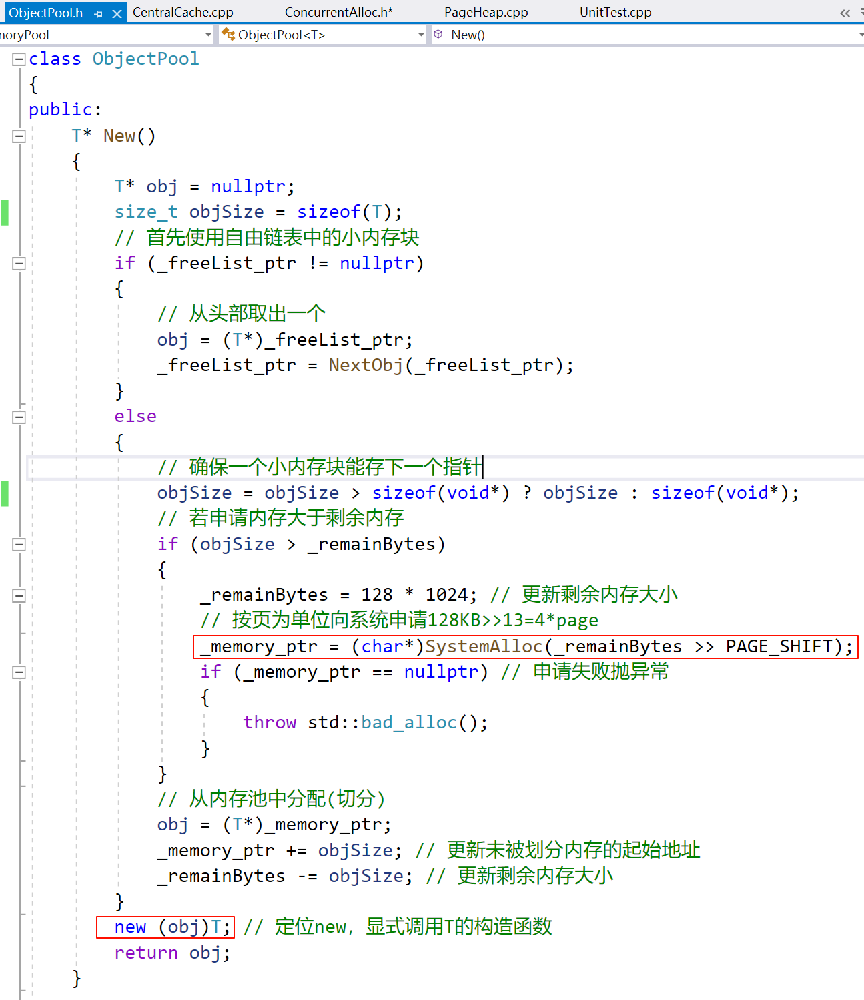

初始情况下，如果线程 1 正好在第一个红框切换，线程 2 从头开始执行，此时`_remainBytes`是上一个线程修改后的值，那么它不会进入`if (objSize > _remainBytes)`分支，那么`_memory_ptr`此时为`nullptr`，这会使定位 new 访问空指针。

解决办法是 ThreadCache 在使用`New()`的前后加互斥锁。在 ObjectPool 中增加互斥锁成员变量：

```cpp
template<class T>
class ObjectPool
{
public:
	std::mutex _poolMtx; // 防止 ThreadCache 申请时申请到空指针
};
```

加锁：


# 综合测试

下面在多线程环境下分别测试 malloc/free 和 ConcurrentAlloc/ConcurrentFree 的性能，放在`Benchmark.cpp`中（基准测试）。

在此之前建议仍用之前的单线程用例测试，以保证申请和回收的逻辑是通的，也比较好调试。

```cpp
#include"ConcurrentAlloc.h"
using std::cout;
using std::endl;

// ntimes: 一轮申请和释放内存的次数
// rounds: 轮次
// nwors:  线程数
void BenchmarkMalloc(size_t ntimes, size_t nworks, size_t rounds)
{
	std::vector<std::thread> vthread(nworks);
	std::atomic<size_t> malloc_costtime = 0;
	std::atomic<size_t> free_costtime = 0;

	for (size_t k = 0; k < nworks; ++k)
	{
		vthread[k] = std::thread([&, k]() {
			std::vector<void*> v;
			v.reserve(ntimes);

			for (size_t j = 0; j < rounds; ++j)
			{
				size_t begin1 = clock();
				for (size_t i = 0; i < ntimes; i++)
				{
					v.push_back(malloc(16));
					//v.push_back(malloc((16 + i) % 8192 + 1));
				}
				size_t end1 = clock();

				size_t begin2 = clock();
				for (size_t i = 0; i < ntimes; i++)
				{
					free(v[i]);
				}
				size_t end2 = clock();
				v.clear();

				malloc_costtime += (end1 - begin1);
				free_costtime += (end2 - begin2);
			}
			});
	}

	for (auto& t : vthread)
	{
		t.join();
	}

	printf("%u 个线程并发执行%u 轮次，每轮次 malloc %u 次：花费：%u ms\n",
		nworks, rounds, ntimes, malloc_costtime.load());

	printf("%u 个线程并发执行%u 轮次，每轮次 free %u 次：花费：%u ms\n",
		nworks, rounds, ntimes, free_costtime.load());

	printf("%u 个线程并发 malloc&free %u 次，总计花费：%u ms\n",
		nworks, nworks * rounds * ntimes, malloc_costtime.load() + free_costtime.load());
}

// 单轮次申请释放次数 线程数 轮次
void BenchmarkConcurrentMalloc(size_t ntimes, size_t nworks, size_t rounds)
{
	std::vector<std::thread> vthread(nworks);
	std::atomic<size_t> malloc_costtime = 0;
	std::atomic<size_t> free_costtime = 0;

	for (size_t k = 0; k < nworks; ++k)
	{
		vthread[k] = std::thread([&]() {
			std::vector<void*> v;
			v.reserve(ntimes);

			for (size_t j = 0; j < rounds; ++j)
			{
				size_t begin1 = clock();
				for (size_t i = 0; i < ntimes; i++)
				{
					v.push_back(ConcurrentAlloc(16));
					//v.push_back(ConcurrentAlloc((16 + i) % 8192 + 1));
				}
				size_t end1 = clock();

				size_t begin2 = clock();
				for (size_t i = 0; i < ntimes; i++)
				{
					ConcurrentFree(v[i]);
				}
				size_t end2 = clock();
				v.clear();

				malloc_costtime += (end1 - begin1);
				free_costtime += (end2 - begin2);
			}
			});
	}

	for (auto& t : vthread)
	{
		t.join();
	}

	printf("%u 个线程并发执行%u 轮次，每轮次 concurrent alloc %u 次：花费：%u ms\n",
		nworks, rounds, ntimes, malloc_costtime.load());

	printf("%u 个线程并发执行%u 轮次，每轮次 concurrent dealloc %u 次：花费：%u ms\n",
		nworks, rounds, ntimes, free_costtime.load());

	printf("%u 个线程并发 concurrent alloc&dealloc %u 次，总计花费：%u ms\n",
		nworks, nworks * rounds * ntimes, malloc_costtime.load() + free_costtime.load());
}

int main()
{
	size_t n = 10000;
	cout << "==========================================================" << endl;
	BenchmarkConcurrentMalloc(n, 4, 10);
	cout << endl << endl;

	BenchmarkMalloc(n, 4, 10);
	cout << "==========================================================" << endl;

	return 0;
}
```

## 测试一

测试 4 个线程，10 轮，每轮 10000 次申请和释放固定大小的内存空间（同一个桶）：


## 测试二

测试 4 个线程，10 轮，每轮 10000 次申请和释放不同大小的内存空间（放开第二条注释的代码）：


在 Debug 模式下（在 Release 模式下可能不一定），malloc/free 总比 ConcurrentAlloc/ConcurrentFree 快。ConcurrentAlloc 和 malloc 相当，但是 ConcurrentFree 远没有 free 快。其主要原因是：在多线程环境下，当多个线程试图同时释放内存到 CentralCache 或进行 Span 操作时，ConcurrentFree 涉及到对资源的竞争。涉及到 Span 合并和返回内存给 PageHeap 时，ConcurrentFree 在释放内存时会执行更复杂的内存合并操作。这些操作通常比简单地释放内存到线程本地缓存要复杂和耗时。

[vs 中 debug 和 release 版本的区别](https://blog.csdn.net/gaoyi221119/article/details/88890486)


# 性能瓶颈分析

把 BenchmarkMalloc() 注释掉，调试->性能探查器（Alt+F2）->“检测”->开始。

可以看到，这个两个函数耗费的时间最长，而这也是 ConcurrentFree 调用的。

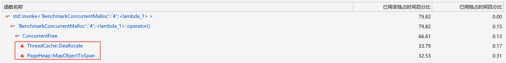

查看调用链，“罪魁祸首”正如我们所分析的那样：

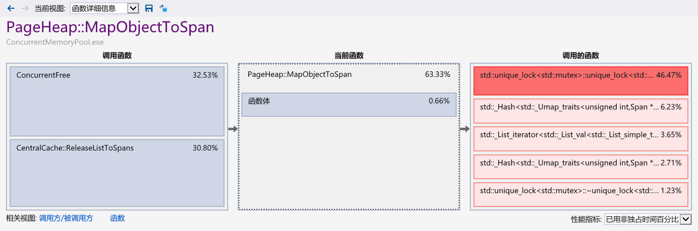

从 TCMalloc 的设计来看，它高效的主要原因是 ThreadCache 是线程私有的缓存，线程无需加锁获取资源。在 TCMalloc 的实现中，使用了基数树优化性能瓶颈，最小粒度缓解了线程加锁竞争资源的问题。

# 基数树

## 介绍

参看：[图解基数树 (RadixTree)](https://blog.ihypo.net/16506944639091.html)；[树 - 前缀树 (Trie Tree)](https://pdai.tech/md/algorithm/alg-basic-tree-trie.html)

看完它你需要知道：基数树是压缩前缀树（字典树），这是一种用于**高效查询**的键值存储结构，适用于需要**快速查找**和**处理大量分散键**的场景。

在基数树中进行查找时，算法会沿着树结构**逐级向下遍历**，每次遍历都是基于键的一部分。基数树可以按顺序遍历键，而哈希表则不能保证这一点。由于这种遍历方式，查找的速度不受树中存储的总元素数量的影响，而是与键的长度直接相关。**其查找时间复杂度通常是$O(k)$**，其中$k$是键（例如内存地址）的长度。但在哈希表中，碰撞解决机制（如链表或开放寻址）可能降低其效率。

另外，基数树特别适合处理分散的键，且**支持范围查询**，这对于内存分配器在执行合并、分割或查找相邻 Span 时非常有用。在内存分配中，Span 可能分布在不连续的内存区域。哈希表可能需要更多的空间来避免碰撞，特别是当负载因子较高时。并且哈希表需要处理键的哈希碰撞，而基数树不涉及哈希计算，因此不会有哈希碰撞问题。

除此之外，相比于如哈希表，基数树可以更加**节省空间**，这对于内存分配器来说是一个重要考虑因素。

基数树的优点完美符合一个内存分配器的需要。这几个特点是从查询效率和节省空间的角度出发的。从本项目的主题（高并发）的角度而言，最重要的是 TCMalloc 中的基数树可以实现无锁（lock-free）或最小化锁的使用，主要是因为基数树的特定操作允许有效地处理并发，而**不必依赖于传统的锁机制**。

1. 原子操作：基数树的某些实现可以使用**原子操作**来处理插入、更新和删除，从而避免在访问和修改树结构时使用全局锁。这些原子操作保证了即使在多线程环境中，基数树的状态也始终是一致的。
2. 读多写少：在许多内存分配场景中，对基数树的读操作（如查找 Span）远多于写操作（如插入或删除 Span）。由于**读操作不会改变树的状态**，它们可以并发进行，而不需要锁。

> 在无法完全避免锁的场景下，TCMalloc 可能采用更细粒度的锁策略，例如仅在特定部分的基数树结构上使用锁，而不是对整个结构加锁。

基数树能够最大限度地减少锁的使用，从而提高性能，尤其是在多线程高并发的环境中。

## TCMalloc 中的基数树使用

基数树的每个节点通常包含一个键值对和指向其子节点的指针。这些子节点的数量取决于基数（radix）的大小。例如，对于一个二进制基数树，每个节点可能有两个子节点（代表 0 和 1）。

分层的基数树不仅仅是单一的树结构，而是由**多个层次的基数树组成**。每一层都是一个基数树，可以处理不同的键值范围。在处理非常大的键空间时，比如内存地址，使用单一的基数树可能会导致很大的内存开销，分层的基数树通过将键空间分解为较小的段来有效地降低内存占用。

在一个内存分配器中，基数树的键（Key）是内存地址或与内存地址相关的标识符（例如**页号**）；值（Value）是** Span 对象**或与该内存地址相关的其他数据。

在下面的实现中，将用页号作为键，以 Span 对象的地址作为值。

## 分层基数树

在分层的基数树中，键被分解为几个部分，每一部分对应树的一层。树的每个级别都代表键的一个部分。例如，在处理 32 位的内存地址时，可以将地址分解成多个 8 位的部分，每部分用来索引树的下一层。一条完整的边的集合就是一个唯一的地址。

查找时，从树的根节点开始，逐步使用键的各个部分在树中向下遍历，直到找到对应的值或者到达一个叶子节点。

与完全二叉树不同，基数树的节点可能不会完全填充。这使得它能有效地处理稀疏的键空间。

例如这是一棵三层的基数树：


图片来源：[Trees I: Radix trees](https://lwn.net/Articles/175432/)

在 Linux 层基数树的实现中，每个结点是长度为 64 的数组，并将键值内存中的最高有效 18 位作为查询的依据：用最高 6 位查询第一层；用中间 6 位查询第二层；用后 6 位查询第三层。这样，三层分别得到的结果再拼接起来，就是最终查询到的结果。

树的层深取决于键值（地址）的长度，在内存分配器中，32 位平台一般使用二层基数树，64 位平台使用三层基数树。

### 单层基数树

单层基数树直接通过数组查询。

```cpp
//单层基数树
template <int BITS>
class TCMalloc_PageMap1
{
public:
	typedef uintptr_t Number;
	explicit TCMalloc_PageMap1()
	{
		size_t size = sizeof(void*) << BITS; //需要开辟数组的大小
		size_t alignSize = SizeClass::_RoundUp(size, 1 << PAGE_SHIFT); //按页对齐后的大小
		array_ = (void**)SystemAlloc(alignSize >> PAGE_SHIFT); //向堆申请空间
		memset(array_, 0, size); //对申请到的内存进行清理
	}
	void* get(Number k) const
	{
		if ((k >> BITS) > 0) //k 的范围不在 [0, 2^BITS-1]
		{
			return NULL;
		}
		return array_[k]; //返回该页号对应的 span
	}
	void set(Number k, void* v)
	{
		assert((k >> BITS) == 0); //k 的范围必须在 [0, 2^BITS-1]
		array_[k] = v; //建立映射
	}
private:
	void** array_; //存储映射关系的数组
	static const int LENGTH = 1 << BITS; //页的数目
};
```

数组的内容是 Span 的地址，下标对应着页号。非模板参数`BITS`对应着该平台下最大页号占的位数。`LENGTH`成员表示页数，其值是$2^{BITS}$。

在 32 位平台中，BITS 的值是`32-PAGE_SHIFT`。1 个 Page 是 8KB，LENGTH 的值是$2^{32-13}=2^{19}$，所以 BITS 的值是 19，表示存储页号最多要用 19 位。求出它的目的是事先将内存申请好，以应付所有的情况。这个数组的大小是$2^{19}*4B=2^{20}KB*2=2MB$，是合理的。但是 64 位下这个数组的大小是$2^{64-13}*8B=2^{54}B=2^{24}GB$，需要用三层基数树划分。

### 二层基数树

在 32 位平台中，需要 19 位保存页号。将前 5 位和后 14 位分别作为第一层和第二层的键（Key），分别**最多**需要$2^5*4B=2^7B$和$2^5*2^{14}*4B=2MB$的空间。二层基数树初始状态只需要为第一层数组开辟空间，第二层数组按需开辟。

```cpp
//二层基数树
template <int BITS>
class TCMalloc_PageMap2
{
private:
	static const int ROOT_BITS = 5;                //第一层对应页号的前 5 个比特位
	static const int ROOT_LENGTH = 1 << ROOT_BITS; //第一层存储元素的个数
	static const int LEAF_BITS = BITS - ROOT_BITS; //第二层对应页号的其余比特位
	static const int LEAF_LENGTH = 1 << LEAF_BITS; //第二层存储元素的个数
	//第一层数组中存储的元素类型
	struct Leaf
	{
		void* values[LEAF_LENGTH];
	};
	Leaf* root_[ROOT_LENGTH]; //第一层数组
public:
	typedef uintptr_t Number;
	explicit TCMalloc_PageMap2()
	{
		memset(root_, 0, sizeof(root_)); //将第一层的空间进行清理
		PreallocateMoreMemory(); //直接将第二层全部开辟
	}
	void* get(Number k) const
	{
		const Number i1 = k >> LEAF_BITS;        //第一层对应的下标
		const Number i2 = k & (LEAF_LENGTH - 1); //第二层对应的下标
		if ((k >> BITS) > 0 || root_[i1] == NULL) //页号值不在范围或没有建立过映射
		{
			return NULL;
		}
		return root_[i1]->values[i2]; //返回该页号对应 span 的指针
	}
	void set(Number k, void* v)
	{
		const Number i1 = k >> LEAF_BITS;        //第一层对应的下标
		const Number i2 = k & (LEAF_LENGTH - 1); //第二层对应的下标
		assert(i1 < ROOT_LENGTH);
		root_[i1]->values[i2] = v; //建立该页号与对应 span 的映射
	}
	//确保映射 [start,start_n-1] 页号的空间是开辟好了的
	bool Ensure(Number start, size_t n)
	{
		for (Number key = start; key <= start + n - 1;)
		{
			const Number i1 = key >> LEAF_BITS;
			if (i1 >= ROOT_LENGTH) //页号超出范围
				return false;
			if (root_[i1] == NULL) //第一层 i1 下标指向的空间未开辟
			{
				//开辟对应空间
				static ObjectPool<Leaf> leafPool;
				Leaf* leaf = (Leaf*)leafPool.New();
				memset(leaf, 0, sizeof(*leaf));
				root_[i1] = leaf;
			}
			key = ((key >> LEAF_BITS) + 1) << LEAF_BITS; //继续后续检查
		}
		return true;
	}
	void PreallocateMoreMemory()
	{
		Ensure(0, 1 << BITS); //将第二层的空间全部开辟好
	}
};
```

`Ensure()`用于当需要建立页号与其 Span 之间的映射关系时，如果用于映射该页号的空间没有开辟时，则会为它开辟。

### 三层基数树

和二层基数树的结构类似。

```cpp
//三层基数树
template <int BITS>
class TCMalloc_PageMap3
{
private:
	static const int INTERIOR_BITS = (BITS + 2) / 3;       //第一、二层对应页号的比特位个数
	static const int INTERIOR_LENGTH = 1 << INTERIOR_BITS; //第一、二层存储元素的个数
	static const int LEAF_BITS = BITS - 2 * INTERIOR_BITS; //第三层对应页号的比特位个数
	static const int LEAF_LENGTH = 1 << LEAF_BITS;         //第三层存储元素的个数
	struct Node
	{
		Node* ptrs[INTERIOR_LENGTH];
	};
	struct Leaf
	{
		void* values[LEAF_LENGTH];
	};
	Node* NewNode()
	{
		static ObjectPool<Node> nodePool;
		Node* result = nodePool.New();
		if (result != NULL)
		{
			memset(result, 0, sizeof(*result));
		}
		return result;
	}
	Node* root_;
public:
	typedef uintptr_t Number;
	explicit TCMalloc_PageMap3()
	{
		root_ = NewNode();
	}
	void* get(Number k) const
	{
		const Number i1 = k >> (LEAF_BITS + INTERIOR_BITS);         //第一层对应的下标
		const Number i2 = (k >> LEAF_BITS) & (INTERIOR_LENGTH - 1); //第二层对应的下标
		const Number i3 = k & (LEAF_LENGTH - 1);                    //第三层对应的下标
		//页号超出范围，或映射该页号的空间未开辟
		if ((k >> BITS) > 0 || root_->ptrs[i1] == NULL || root_->ptrs[i1]->ptrs[i2] == NULL)
		{
			return NULL;
		}
		return reinterpret_cast<Leaf*>(root_->ptrs[i1]->ptrs[i2])->values[i3]; //返回该页号对应 span 的指针
	}
	void set(Number k, void* v)
	{
		assert(k >> BITS == 0);
		const Number i1 = k >> (LEAF_BITS + INTERIOR_BITS);         //第一层对应的下标
		const Number i2 = (k >> LEAF_BITS) & (INTERIOR_LENGTH - 1); //第二层对应的下标
		const Number i3 = k & (LEAF_LENGTH - 1);                    //第三层对应的下标
		Ensure(k, 1); //确保映射第 k 页页号的空间是开辟好了的
		reinterpret_cast<Leaf*>(root_->ptrs[i1]->ptrs[i2])->values[i3] = v; //建立该页号与对应 span 的映射
	}
	//确保映射 [start,start+n-1] 页号的空间是开辟好了的
	bool Ensure(Number start, size_t n)
	{
		for (Number key = start; key <= start + n - 1;)
		{
			const Number i1 = key >> (LEAF_BITS + INTERIOR_BITS);         //第一层对应的下标
			const Number i2 = (key >> LEAF_BITS) & (INTERIOR_LENGTH - 1); //第二层对应的下标
			if (i1 >= INTERIOR_LENGTH || i2 >= INTERIOR_LENGTH) //下标值超出范围
				return false;
			if (root_->ptrs[i1] == NULL) //第一层 i1 下标指向的空间未开辟
			{
				//开辟对应空间
				Node* n = NewNode();
				if (n == NULL) return false;
				root_->ptrs[i1] = n;
			}
			if (root_->ptrs[i1]->ptrs[i2] == NULL) //第二层 i2 下标指向的空间未开辟
			{
				//开辟对应空间
				static ObjectPool<Leaf> leafPool;
				Leaf* leaf = leafPool.New();
				if (leaf == NULL) return false;
				memset(leaf, 0, sizeof(*leaf));
				root_->ptrs[i1]->ptrs[i2] = reinterpret_cast<Node*>(leaf);
			}
			key = ((key >> LEAF_BITS) + 1) << LEAF_BITS; //继续后续检查
		}
		return true;
	}
	void PreallocateMoreMemory()
	{}
};
```

## 用基数树代替哈希表

由于测试的平台选择了 32 位，可以随便选几层基数树，这里将二层哈希表的实现放在`PageMap.h`中。Common.h 包含它以后，将 PageHeap 的哈希表换成基数树：


然后把所有哈希操作换成 get 和 set 函数。例如：


有了基数树，PageHeap::MapObjectToSpan() 就不用加锁了。

# 最终测试

## 测试一

测试 4 个线程，10 轮，每轮 10000 次申请和释放固定大小的内存空间（同一个桶）：


## 测试二

测试 4 个线程，10 轮，每轮 10000 次申请和释放不同大小的内存空间（放开第二条注释的代码）：

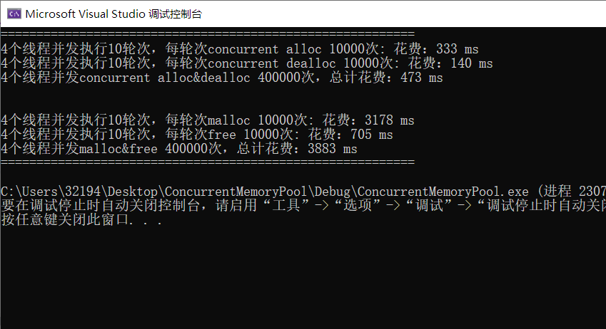

可见，PageHeap::MapObjectToSpan() 没有了锁，尤其是在申请不同大小的对象时，ConcurrentFree 的整体速度要比 free 快好几倍。在 release 模式下会更快，这里用 debug 模式想让现象更明显。

# 总结

## 项目回顾

此项目是一个高效的内存管理器 TCMalloc 简易实现，旨在提高内存分配和回收的性能。它主要采用了以下方法实现高并发内存分配器：

1. 多层内存分配系统：项目实现了 ThreadCache、CentralCache 和 PageHeap 三个层次的内存分配，用于不同大小和频率的内存请求。这种设计可以**减少与系统内存的直接交互，提高内存分配和释放的效率**。
2. **线程局部存储**（Thread Local Storage，TLS）：ThreadCache 作为线程私有缓存，**减少了跨线程的内存分配冲突和锁的需求**，从而提高了**多线程环境**下的性能。
3. 内存碎片管理：通过 Span（连续的内存页组）和自由链表的管理，有效地处理了内存碎片问题，**提高内存使用效率**。
4. 锁的策略和线程安全：在 PageHeap 和 CentralCache 中使用锁来保护共享资源，确保线程安全。这是在多线程环境中维护数据一致性和避免竞态条件的关键。
5. 基数树映射：使用二层基数树（TCMalloc_PageMap2）来快速映射页号和 Span 地址，**加速了内存地址到管理单元的映射过程**。
6. 大小类管理：SizeClass 类用于管理不同大小的内存请求，提供内存对齐和哈希桶索引功能，这有助于优化内存分配的速度和减少浪费。ThreadCache 和 CentralCache 都使用同一阶梯的 SizeClass，使得 ThreadCache 可以向 CentralCache 直接申请内存。
7. 内存分配单元的动态调整：**动态调整内存分配单位**，以适应不同大小的内存请求，从而提高内存利用率。
8. 性能测试：通过基准测试（Benchmark.cpp），这可以评估和分析 TCMalloc 在不同条件下的性能。
10. 内存池：ObjectPool 用于减少频繁内存分配的开销，提高内存分配的效率。

## 项目难点

- 理解内部碎片和外部碎片的产生原因和解决办法。
- 位运算实现内存对齐。
- 自由链表的实现，需要格外小心内存操作，要能够在各自情况下使用。
- CentralCache 中的慢开始反馈调节算法，动态调整每次分配的对象数量。
- 要取出 SpanList 的 n 个 Span，首先要取 n-1 个，然后将最后一个的 next 指针置空，再将这块空间的首地址从 SpanList 中 Pop 出去。
- PageHeap 分配和回收的效率依赖页号和 Span 地址间的映射关系，而两者建立映射的方式有所不同。向前和向后合并 Span 的细节也略有不同。
- 加锁问题。
  - CentralCache 桶锁
  - PageHeap 大锁
  - PageHeap 哈希表锁（基数树不需要锁）
  - ObjectPool 锁
- 基数树。

- 等等。

## 个人收获

- 学习了内存管理器的思想，将内存从小到大分层，将一定数量的小内存让线程私有，按需申请和释放，这个过程是无锁的，是内存分配器在多线程环境下高效的原因之一。让较大的内存交给中央缓存和页堆管理，当它们的内存都超过一个阈值时，将内存归还给下一级。当下一级将内存分配给上一级时，都需要判断自己能不能一次性给那么多，否则就要向自己的下一级申请内存。分配内存首先要取出，其次是切分，并且要将最后一个置空。
- 了解了基数树可以实现无锁或最小化锁，从而有效处理并发。
- 单例模式。
- 解除头文件循环引用，进一步了解了 C++编译的流程。
- 初步学习了如何调试多线程程序。

> 记录一下：在项目的测试过程中，我花费了许多时间去尝试查错，在多线程测试中，出现最多的问题是非法访问内存/空指针。原因是 Span 的_size 从一个正常的值突然变成了 42 亿九千万这样的随机值，调用 SpanList 的 PopRange() 后导致非法访问。如果你出现了类似的问题，并且在 NextObj() 或报错，建议你查一下所有与它有关的逻辑。
>
> 调试运行起来后总是崩溃（不明原因），总是难以观察流程，打印大法永不过时。从头到尾查了一通，发现好几个莫名其妙的问题都是拼写错误造成的，而那些比较容易分析的问题总是逻辑上的小错误。
>
> 教训：写的时候一定要头脑清醒，磨刀不误砍柴工，调试的过程又长又痛苦。
>
> 不过万事开头难，之前 Visual Studio 调试的都是简单的逻辑，光这个项目调的次数都有之前加起来的多很多了，也学习了一些调试技巧。

# 参考资料

- [【项目设计】高并发内存池](https://blog.csdn.net/chenlong_cxy/article/details/122819562?spm=1001.2014.3001.5502)

- [C 内存操作 API 的实现原理](https://www.cnblogs.com/freeweb/p/16151462.html)
- [图解 TCMalloc](https://zhuanlan.zhihu.com/p/29216091)
- [tcmalloc 浅析](https://developer.aliyun.com/article/6045)
- [tcmalloc 流程详解 #9](https://github.com/ivan-94/notepad/issues/9)
- [tcmalloc 原理剖析（基于 gperftools-2.1)](https://gao-xiao-long.github.io/2017/11/25/tcmalloc/)
- [Thread Local Storage（线程局部存储）TLS](https://zhuanlan.zhihu.com/p/142418922)
- [线程本地存储 (TLS)](https://learn.microsoft.com/zh-cn/cpp/parallel/thread-local-storage-tls?view=msvc-170)
